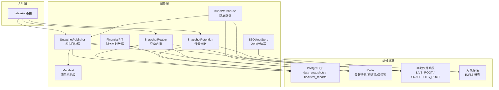
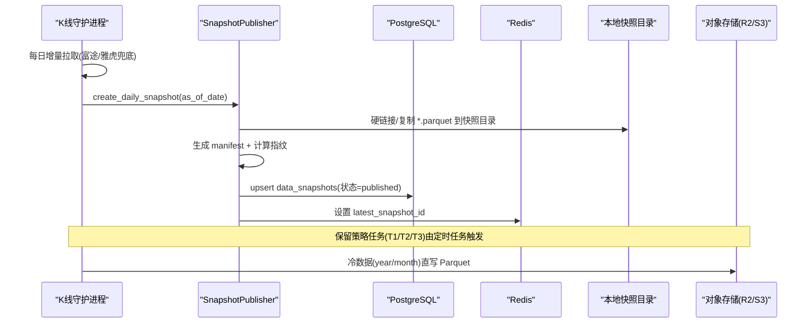
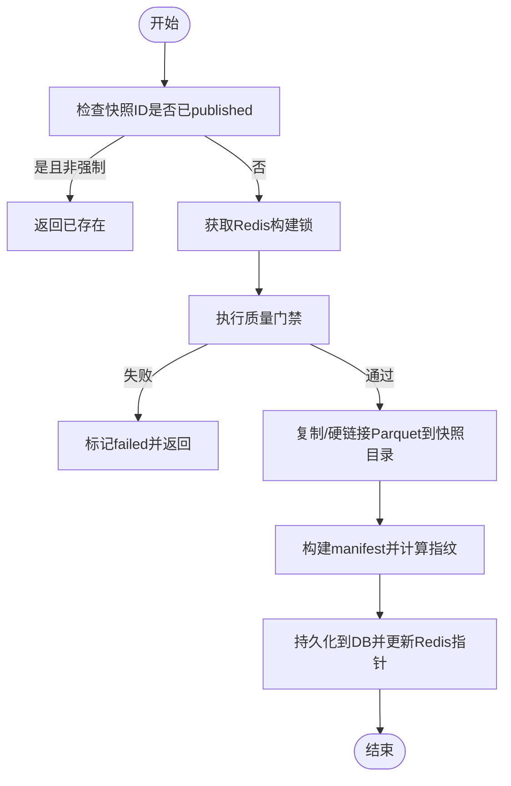
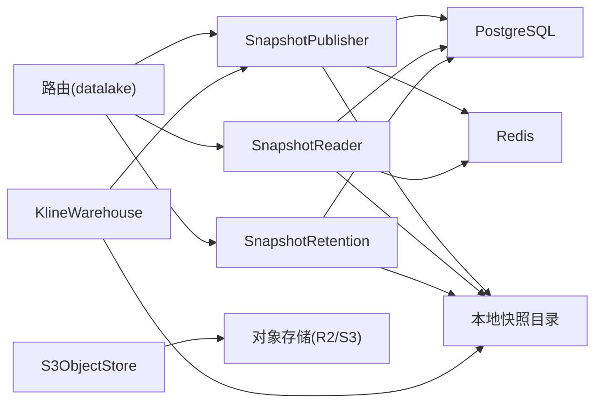

# 数据湖架构

<cite>
**本文引用的文件**
- [backend/routers/datalake.py](file://backend/routers/datalake.py)
- [backend/core/datalake_models.py](file://backend/core/datalake_models.py)
- [backend/services/datalake/object_store.py](file://backend/services/datalake/object_store.py)
- [backend/services/datalake/manifest.py](file://backend/services/datalake/manifest.py)
- [backend/services/datalake/snapshot_publisher.py](file://backend/services/datalake/snapshot_publisher.py)
- [backend/services/datalake/snapshot_reader.py](file://backend/services/datalake/snapshot_reader.py)
- [backend/services/datalake/paths.py](file://backend/services/datalake/paths.py)
- [backend/services/datalake/snapshot_retention.py](file://backend/services/datalake/snapshot_retention.py)
- [backend/services/datalake/kline_warehouse.py](file://backend/services/datalake/kline_warehouse.py)
- [backend/services/datalake/financial_pit.py](file://backend/services/datalake/financial_pit.py)
</cite>

## 目录
1. [简介](#简介)
2. [项目结构](#项目结构)
3. [核心组件](#核心组件)
4. [架构总览](#架构总览)
5. [详细组件分析](#详细组件分析)
6. [依赖关系分析](#依赖关系分析)
7. [性能考量](#性能考量)
8. [故障排查指南](#故障排查指南)
9. [结论](#结论)
10. [附录](#附录)

## 简介
本文件面向 Quant Agent 系统的数据湖，系统性阐述分层存储、元数据管理、数据治理与生命周期管理等核心设计。重点覆盖：
- 分层存储：热层（本地 Parquet 数仓）、温层（快照目录）、冷层（对象存储归档）
- 元数据管理：快照清单（Manifest）、数据库持久化、Redis 指针与分布式锁
- 数据治理：Point-in-Time 财务数据、质量门禁、前视偏差防护
- 分区策略：按标的、周期、时间（年/月）的 Hive 风格分区
- 对象存储抽象：S3/R2 兼容后端直写直读，未配置时优雅降级
- 生命周期管理：T1/T2/T3 冷热分离、自动归档与清理
- 扩展性与最佳实践：Schema 演化、可插拔导出器、可观测性指标

## 项目结构
数据湖相关代码集中在 backend/services/datalake 与 backend/core/datalake_models，并通过路由暴露 API；K线数仓位于 services/datalake/kline_warehouse.py，财务 PIT 在 financial_pit.py。

图表来源
- [backend/routers/datalake.py:61-138](file://backend/routers/datalake.py#L61-L138)
- [backend/services/datalake/snapshot_publisher.py:91-250](file://backend/services/datalake/snapshot_publisher.py#L91-L250)
- [backend/services/datalake/snapshot_reader.py:30-121](file://backend/services/datalake/snapshot_reader.py#L30-L121)
- [backend/services/datalake/object_store.py:32-177](file://backend/services/datalake/object_store.py#L32-L177)
- [backend/services/datalake/manifest.py:16-78](file://backend/services/datalake/manifest.py#L16-L78)
- [backend/services/datalake/snapshot_retention.py:29-143](file://backend/services/datalake/snapshot_retention.py#L29-L143)
- [backend/services/datalake/kline_warehouse.py:16-258](file://backend/services/datalake/kline_warehouse.py#L16-L258)
- [backend/core/datalake_models.py:31-82](file://backend/core/datalake_models.py#L31-L82)

章节来源
- [backend/routers/datalake.py:61-138](file://backend/routers/datalake.py#L61-L138)
- [backend/services/datalake/paths.py:1-43](file://backend/services/datalake/paths.py#L1-L43)

## 核心组件
- 快照发布器（SnapshotPublisher）：从热层（live）生成不可变快照，写入快照目录并持久化 Manifest 到数据库，更新 Redis 最新指针。
- 快照读取器（SnapshotReader）：解析 latest_published/live，按快照 ID 读取 Parquet 文件，提供历史行情查询。
- 清单（Manifest）：以确定性 JSON 序列化计算 sha256 指纹，记录文件列表、规模、质量门禁等。
- 对象存储（S3ObjectStore）：将超过一年的冷数据按 year/month 分区直写到 S3/R2，支持 load 过滤最近 N 天。
- 保留策略（SnapshotRetention）：T1 全保留、T2 仅月锚点、T3 归档为 tar.gz 并删除本地，支持可选 R2 上传。
- K线数仓（KlineWarehouse）：本地 Parquet 热层，增量拉取、去重合并、守护进程定时同步并触发快照发布。
- 财务 PIT（FinancialPIT）：Point-in-Time 语义存储与查询，避免回测前视偏差。

章节来源
- [backend/services/datalake/snapshot_publisher.py:91-250](file://backend/services/datalake/snapshot_publisher.py#L91-L250)
- [backend/services/datalake/snapshot_reader.py:30-121](file://backend/services/datalake/snapshot_reader.py#L30-L121)
- [backend/services/datalake/manifest.py:16-78](file://backend/services/datalake/manifest.py#L16-L78)
- [backend/services/datalake/object_store.py:32-177](file://backend/services/datalake/object_store.py#L32-L177)
- [backend/services/datalake/snapshot_retention.py:29-143](file://backend/services/datalake/snapshot_retention.py#L29-L143)
- [backend/services/datalake/kline_warehouse.py:16-258](file://backend/services/datalake/kline_warehouse.py#L16-L258)
- [backend/services/datalake/financial_pit.py:121-341](file://backend/services/datalake/financial_pit.py#L121-L341)

## 架构总览
数据湖采用“热-温-冷”三层架构：
- 热层：本地 Parquet 数仓（kline_warehouse），用于高频增量更新与极速读取。
- 温层：快照目录（snapshots/snap_YYYYMMDD），包含各标的的 Parquet 文件与 manifest.json，作为回测与报表的不可变基线。
- 冷层：对象存储（S3/R2），按 Hive 分区（year=YYYY/month=MM）归档历史数据，降低本地存储成本。

元数据通过 PostgreSQL 持久化（data_snapshots、backtest_reports），Redis 提供最新快照指针与分布式锁，确保并发安全与快速定位。

图表来源
- [backend/services/datalake/kline_warehouse.py:175-258](file://backend/services/datalake/kline_warehouse.py#L175-L258)
- [backend/services/datalake/snapshot_publisher.py:119-250](file://backend/services/datalake/snapshot_publisher.py#L119-L250)
- [backend/services/datalake/object_store.py:83-165](file://backend/services/datalake/object_store.py#L83-L165)
- [backend/core/datalake_models.py:31-50](file://backend/core/datalake_models.py#L31-L50)

## 详细组件分析

### 快照发布器（SnapshotPublisher）
职责：
- 从 live 层（K_DAY/K_60M）收集 Parquet 文件，复制到快照目录（优先硬链接，失败回退 copy2）。
- 生成 manifest.json，计算 manifest_hash，写入数据库并更新 Redis 最新快照指针。
- 支持质量门禁（quality_gate）与 universe sidecar 导出。

关键流程：
- 幂等保护：已 published 且非强制重建则跳过。
- 分布式锁：基于 Redis 防止重复构建。
- 只读保护：尽力而为将快照文件设为只读。

图表来源
- [backend/services/datalake/snapshot_publisher.py:119-250](file://backend/services/datalake/snapshot_publisher.py#L119-L250)

章节来源
- [backend/services/datalake/snapshot_publisher.py:91-250](file://backend/services/datalake/snapshot_publisher.py#L91-L250)

### 快照读取器（SnapshotReader）
职责：
- 解析 latest_published/live 为具体快照 ID。
- 读取指定快照的 manifest.json 或数据库中的 manifest_json。
- 读取历史 K 线（按 ticker 与 ktype），支持 tail(num) 限制行数。

关键点：
- 优先使用 Redis 缓存的最新快照 ID。
- 兼容文件名安全化处理（ticker_to_filename/filename_to_ticker）。

章节来源
- [backend/services/datalake/snapshot_reader.py:30-121](file://backend/services/datalake/snapshot_reader.py#L30-L121)
- [backend/services/datalake/paths.py:32-43](file://backend/services/datalake/paths.py#L32-L43)

### 清单（Manifest）
职责：
- 构建确定性 JSON（sort_keys、无多余空白、日期 ISO 格式）。
- 计算 manifest_hash（sha256），用于数据完整性校验。
- 记录文件列表、规模、质量门禁、引擎版本等信息。

特性：
- validate_manifest 支持带/不带 sha256: 前缀的兼容。

章节来源
- [backend/services/datalake/manifest.py:16-78](file://backend/services/datalake/manifest.py#L16-L78)

### 对象存储（S3ObjectStore）
职责：
- 将超过一年的冷数据按 year/month 分区直写到 S3/R2。
- 支持 load 最近 N 天的冷数据，异常时返回 None。

设计要点：
- 未配置环境变量时优雅降级（不抛异常、不写假数据）。
- 使用 PyArrow S3FileSystem 直写直读，避免中间格式转换。
- Hive 风格分区路径：{prefix}/{period}/{symbol_safe}/year=YYYY/month=MM/part-*.parquet。

章节来源
- [backend/services/datalake/object_store.py:32-177](file://backend/services/datalake/object_store.py#L32-L177)

### 保留策略（SnapshotRetention）
职责：
- T1（0–90天）：全保留。
- T2（91–365天）：仅保留月锚点，删除其他本地快照。
- T3（>365天）：打包为 tar.gz 归档，可选上传至 R2，删除本地。

机制：
- 每月末最后一个 published 快照标记为月锚点。
- 通过 Redis 锁保证保留任务互斥执行。

章节来源
- [backend/services/datalake/snapshot_retention.py:29-143](file://backend/services/datalake/snapshot_retention.py#L29-L143)

### K线数仓（KlineWarehouse）
职责：
- 本地 Parquet 热层，增量拉取（优先富途，不足时降级雅虎财经）。
- 守护进程每日凌晨执行全量资产增量同步，成功后触发快照发布。
- 使用 Redis 分布式锁避免集群重复拉取。

关键点：
- 增量算法：根据 last_date 计算拉取条数，去重合并后保存。
- 与快照发布集成：daemon_sync_task 中调用 SnapshotPublisher 创建日快照。

章节来源
- [backend/services/datalake/kline_warehouse.py:16-258](file://backend/services/datalake/kline_warehouse.py#L16-L258)

### 财务 Point-in-Time（FinancialPIT）
职责：
- 存储带 announce_date 的财务数据，按 as_of_date 查询“当时已公布”的数据。
- 检测前视偏差风险，保障回测真实性。

能力：
- query_as_of、get_latest_as_of、detect_look_ahead_risk。
- 统计与时间线输出，便于审计与监控。

章节来源
- [backend/services/datalake/financial_pit.py:121-341](file://backend/services/datalake/financial_pit.py#L121-L341)

## 依赖关系分析
- 路由层依赖服务层：datalake 路由调用 SnapshotPublisher、SnapshotReader、SnapshotRetention。
- 服务层依赖基础设施：
  - 数据库：DataSnapshot、BacktestReport ORM。
  - Redis：latest_snapshot_id、构建锁、保留锁。
  - 文件系统：LIVE_ROOT、SNAPSHOTS_ROOT。
  - 对象存储：S3/R2 兼容接口。
- 模块内耦合：
  - SnapshotPublisher 与 Manifest 强耦合（清单构建与指纹）。
  - SnapshotReader 与 paths 工具函数耦合（ticker 文件名映射）。
  - KlineWarehouse 与 SnapshotPublisher 松耦合（通过函数调用触发）。

图表来源
- [backend/routers/datalake.py:61-138](file://backend/routers/datalake.py#L61-L138)
- [backend/services/datalake/snapshot_publisher.py:91-250](file://backend/services/datalake/snapshot_publisher.py#L91-L250)
- [backend/services/datalake/snapshot_reader.py:30-121](file://backend/services/datalake/snapshot_reader.py#L30-L121)
- [backend/services/datalake/snapshot_retention.py:29-143](file://backend/services/datalake/snapshot_retention.py#L29-L143)
- [backend/services/datalake/kline_warehouse.py:175-258](file://backend/services/datalake/kline_warehouse.py#L175-L258)
- [backend/services/datalake/object_store.py:32-177](file://backend/services/datalake/object_store.py#L32-L177)

章节来源
- [backend/routers/datalake.py:61-138](file://backend/routers/datalake.py#L61-L138)
- [backend/core/datalake_models.py:31-82](file://backend/core/datalake_models.py#L31-L82)

## 性能考量
- 列式存储优势：Parquet 列式读取显著减少 I/O 与内存占用，适合宽表与聚合查询。
- 压缩与编码：PyArrow 默认压缩（如 Snappy/ZSTD）可在存储与读取间取得平衡。
- 分区裁剪：Hive 分区（year/month）使查询与归档具备高效裁剪能力。
- 异步与线程池：I/O 密集操作（Parquet 读写、网络请求）放入线程池，避免阻塞事件循环。
- 硬链接优化：快照创建优先硬链接，减少磁盘空间与拷贝时间。
- 缓存与指针：Redis 缓存最新快照 ID，降低数据库压力。
- 冷数据归档：超过一年数据归档至对象存储，释放本地空间。

[本节为通用性能讨论，不直接分析具体文件]

## 故障排查指南
常见问题与定位：
- 快照未发布：检查 Redis 构建锁是否被占用、质量门禁是否失败、数据库写入是否成功。
- 读取不到最新快照：确认 Redis latest_snapshot_id 是否正确设置，或数据库 data_snapshots 是否存在 published 记录。
- 冷数据未归档：检查对象存储配置（endpoint/bucket/credentials），确认时间 cutoff 逻辑与分区路径。
- 保留策略未生效：确认定时任务是否运行、Redis 保留锁是否可用、月锚点是否标记。
- 前视偏差：使用 FinancialPIT 的 detect_look_ahead_risk 检查决策日期与数据公布日期关系。

章节来源
- [backend/routers/datalake.py:61-138](file://backend/routers/datalake.py#L61-L138)
- [backend/services/datalake/snapshot_publisher.py:119-250](file://backend/services/datalake/snapshot_publisher.py#L119-L250)
- [backend/services/datalake/snapshot_reader.py:42-77](file://backend/services/datalake/snapshot_reader.py#L42-L77)
- [backend/services/datalake/object_store.py:83-165](file://backend/services/datalake/object_store.py#L83-L165)
- [backend/services/datalake/snapshot_retention.py:61-143](file://backend/services/datalake/snapshot_retention.py#L61-L143)
- [backend/services/datalake/financial_pit.py:252-292](file://backend/services/datalake/financial_pit.py#L252-L292)

## 结论
Quant Agent 数据湖通过热-温-冷分层、严格的元数据管理与 Point-in-Time 治理，实现了高可靠、可复现、可扩展的量化数据平台。其设计兼顾了高性能读取、低成本归档与严格的数据一致性，为回测、研究与生产交易提供了坚实基础。建议在生产环境中持续完善质量门禁、可观测性指标与自动化运维流程。

[本节为总结性内容，不直接分析具体文件]

## 附录

### Parquet 文件格式的优势与使用场景
- 列式存储：提升聚合与过滤性能，降低 I/O。
- 压缩算法：Snappy/ZSTD 等平衡压缩率与解压速度。
- Schema 演化：支持字段增删改，向后兼容读取。
- 分区布局：Hive 风格分区（year/month）便于裁剪与归档。
- 适用场景：批量历史数据、回测基准、报表与分析。

[本节为概念性说明，不直接分析具体文件]

### 数据分区策略设计原则
- 按时间分区：年/月粒度，利于冷热分离与归档。
- 按标的分区：symbol_safe 目录隔离，避免命名冲突。
- 复合分区：结合周期（K_DAY/K_60M）与标的，形成多维索引。
- 分区键选择：考虑查询模式、归档频率与存储成本。

[本节为概念性说明，不直接分析具体文件]

### 对象存储抽象层设计
- 统一接口：save/load 方法屏蔽后端差异。
- 环境变量配置：endpoint/bucket/credentials/prefix。
- 优雅降级：未配置时跳过冷归档，不影响主流程。
- 直写直读：利用 PyArrow S3FileSystem，避免中间格式。

章节来源
- [backend/services/datalake/object_store.py:32-177](file://backend/services/datalake/object_store.py#L32-L177)

### 数据生命周期管理
- T1（0–90天）：全保留，快速访问。
- T2（91–365天）：仅保留月锚点，节省空间。
- T3（>365天）：归档为 tar.gz，可选上传至 R2，删除本地。
- 自动归档：定时任务执行，Redis 锁防重入。

章节来源
- [backend/services/datalake/snapshot_retention.py:29-143](file://backend/services/datalake/snapshot_retention.py#L29-L143)

### 架构图与组件关系图
见“架构总览”与“依赖关系分析”中的图示。

[本节为可视化展示，不直接分析具体文件]

### 扩展性设计与最佳实践
- 扩展点：
  - 质量门禁函数注入（quality_gate_fn）。
  - Universe 导出器（universe_exporter）可替换。
  - 对象存储后端可通过环境变量切换。
- 最佳实践：
  - 使用 Manifest 指纹保证数据不可变与可追溯。
  - 通过 Redis 指针快速定位最新快照。
  - 定期执行保留策略，控制存储成本。
  - 使用 PIT 查询避免前视偏差。
  - 监控关键指标（快照创建、保留运行次数、最新快照年龄）。

[本节为概念性说明，不直接分析具体文件]
