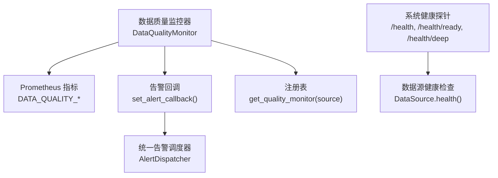
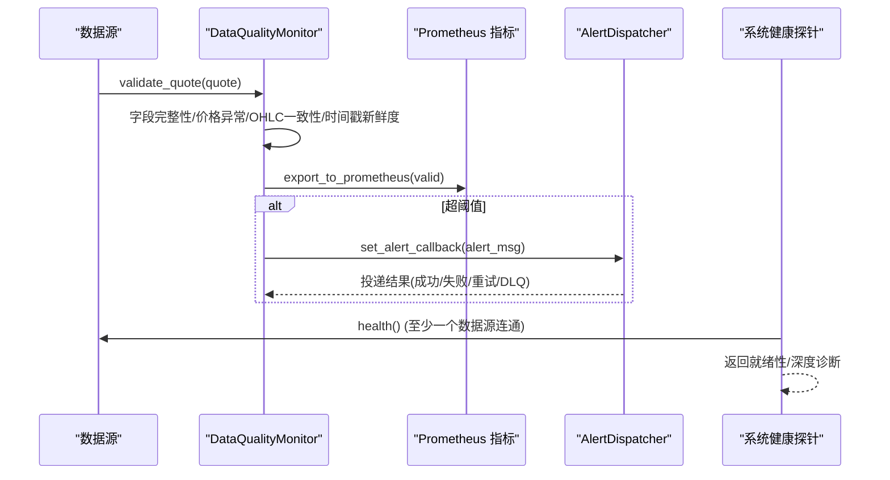
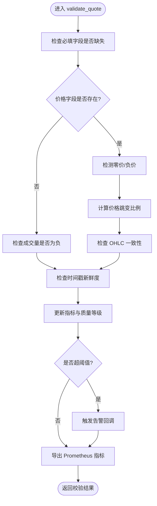
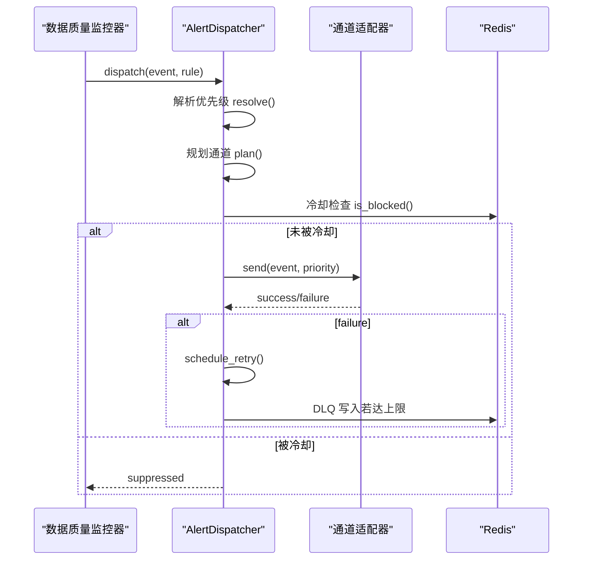
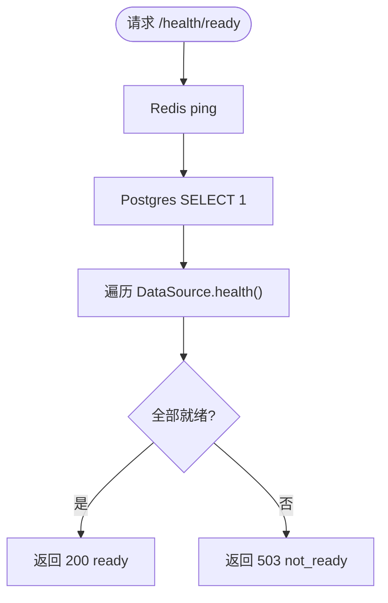
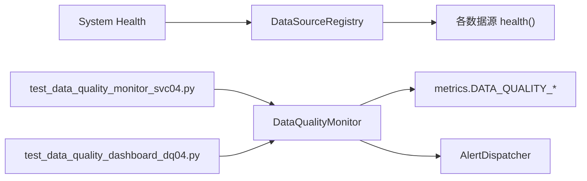

# 数据质量控制

<cite>
**本文引用的文件**
- [monitor.py](file://backend/services/data_quality/monitor.py)
- [metrics.py](file://backend/core/metrics.py)
- [dispatcher.py](file://backend/services/alert/dispatcher.py)
- [system_health.py](file://backend/routers/system_health.py)
- [test_data_quality_monitor_svc04.py](file://backend/tests/test_data_quality_monitor_svc04.py)
- [test_data_quality_dashboard_dq04.py](file://backend/tests/test_data_quality_dashboard_dq04.py)
</cite>

## 目录
1. [简介](#简介)
2. [项目结构](#项目结构)
3. [核心组件](#核心组件)
4. [架构总览](#架构总览)
5. [详细组件分析](#详细组件分析)
6. [依赖关系分析](#依赖关系分析)
7. [性能考量](#性能考量)
8. [故障排查指南](#故障排查指南)
9. [结论](#结论)
10. [附录](#附录)

## 简介
本文件面向 Quant Agent 系统的数据质量控制体系，聚焦以下目标：
- 实时监控与异常检测：对行情数据执行字段完整性、价格异常、时间戳新鲜度等校验。
- 告警机制：基于阈值触发告警，并通过统一告警通道推送。
- 数据验证规则：定义并执行格式、范围、一致性校验。
- 数据完整性检查：缺失值检测、重复时间戳识别、时间序列连续性评估。
- 异常检测与恢复策略：阈值告警、自动重试、降级处理。
- 数据源健康监控：连接状态、响应时间、错误率统计。
- 质量指标体系与评估方法：准确率、完整性、时效性等维度。
- 常见问题诊断与解决方案。

## 项目结构
数据质量控制的核心位于后端服务层，围绕“数据质量监控器”、“Prometheus 指标”、“告警调度器”和“系统健康探针”四个层面组织：
- 数据质量监控器：负责逐条校验、指标聚合、等级判定、阈值告警与 Prometheus 导出。
- 指标层：集中定义数据质量相关指标（脏数据率、完整率、延迟、异常计数等）。
- 告警调度器：提供优先级解析、通道规划、冷却去重、重试与死信队列。
- 健康探针：暴露 /health、/health/ready、/health/deep 等端点，用于就绪性判断与全链路诊断。

图表来源
- [monitor.py:91-378](file://backend/services/data_quality/monitor.py#L91-L378)
- [metrics.py:386-444](file://backend/core/metrics.py#L386-L444)
- [dispatcher.py:357-580](file://backend/services/alert/dispatcher.py#L357-L580)
- [system_health.py:173-355](file://backend/routers/system_health.py#L173-L355)

章节来源
- [monitor.py:1-408](file://backend/services/data_quality/monitor.py#L1-L408)
- [metrics.py:1-641](file://backend/core/metrics.py#L1-L641)
- [dispatcher.py:1-580](file://backend/services/alert/dispatcher.py#L1-L580)
- [system_health.py:1-421](file://backend/routers/system_health.py#L1-L421)

## 核心组件
- DataQualityMonitor：按数据源维度维护 QualityMetrics，执行字段完整性、价格异常、OHLC 一致性、时间戳新鲜度等校验；计算质量等级；触发阈值告警；导出 Prometheus 指标。
- Prometheus 指标：DATA_QUALITY_DIRTY_RATE、DATA_QUALITY_COMPLETENESS、DATA_QUALITY_TOTAL_RECORDS、DATA_QUALITY_ANOMALY_COUNT、DATA_QUALITY_MISSING_FIELDS、DATA_QUALITY_PRICE_ANOMALY、DATA_QUALITY_STALE_COUNT、DATA_QUALITY_LATENCY_MS、DATA_QUALITY_LEVEL、DATA_QUALITY_CHECKS。
- AlertDispatcher：统一告警出口，支持优先级解析、通道规划、冷却门控、重试队列与死信队列。
- 系统健康探针：/health（liveness）、/health/ready（readiness）、/health/deep（deep），以及数据源健康探测。

章节来源
- [monitor.py:91-378](file://backend/services/data_quality/monitor.py#L91-L378)
- [metrics.py:386-444](file://backend/core/metrics.py#L386-L444)
- [dispatcher.py:357-580](file://backend/services/alert/dispatcher.py#L357-L580)
- [system_health.py:173-355](file://backend/routers/system_health.py#L173-L355)

## 架构总览
数据从数据源进入后，经 DataQualityMonitor 进行实时校验，产出质量等级与异常明细；同时更新 Prometheus 指标供 Grafana 展示；当超过阈值时，通过 set_alert_callback 调用统一告警调度器进行多通道推送；系统健康探针对外暴露就绪性与深度诊断能力，辅助运维定位问题。

图表来源
- [monitor.py:112-350](file://backend/services/data_quality/monitor.py#L112-L350)
- [metrics.py:386-444](file://backend/core/metrics.py#L386-L444)
- [dispatcher.py:396-527](file://backend/services/alert/dispatcher.py#L396-L527)
- [system_health.py:82-123](file://backend/routers/system_health.py#L82-L123)

## 详细组件分析

### 数据质量监控器（DataQualityMonitor）
职责与流程：
- 字段完整性检查：必填字段缺失视为异常。
- 价格异常检测：零价、负价、价格跳变（相对上次收盘价比例阈值）。
- OHLC 一致性检查：high < low 视为严重异常。
- 时间戳新鲜度检查：计算延迟毫秒，超过阈值记为过期。
- 指标累积：总记录数、有效记录数、脏记录数、异常条目数、平均/最大延迟、过期次数等。
- 质量等级判定：根据脏数据率与连续过期次数映射到 good/degraded/poor/unusable。
- 阈值告警：脏数据率或连续过期达到阈值时触发告警回调。
- Prometheus 导出：按 source 维度写入多个 Gauge/Counter。

图表来源
- [monitor.py:112-350](file://backend/services/data_quality/monitor.py#L112-L350)

章节来源
- [monitor.py:91-378](file://backend/services/data_quality/monitor.py#L91-L378)

### 告警调度器（AlertDispatcher）
职责与流程：
- 优先级解析：根据 severity 与 source 映射到 P0~P3。
- 通道规划：不同优先级对应默认通道组合（in_app、feishu、telegram）。
- 冷却门控：基于 fingerprint + channel 的 Redis/内存冷却，避免风暴。
- 重试队列：按优先级退避序列重试，失败进入 DLQ。
- 投递记录：记录每次投递的状态、延迟、错误信息。

图表来源
- [dispatcher.py:66-157](file://backend/services/alert/dispatcher.py#L66-L157)
- [dispatcher.py:173-220](file://backend/services/alert/dispatcher.py#L173-L220)
- [dispatcher.py:279-350](file://backend/services/alert/dispatcher.py#L279-L350)
- [dispatcher.py:396-527](file://backend/services/alert/dispatcher.py#L396-L527)

章节来源
- [dispatcher.py:1-580](file://backend/services/alert/dispatcher.py#L1-L580)

### 系统健康探针（System Health）
职责与流程：
- /health：进程存活探针，不依赖外部依赖。
- /health/ready：就绪探针，检查 Redis、Postgres、至少一个数据源连通。
- /health/deep：全链路诊断，包含组件健康、数据源就绪、采集器心跳、事件循环延迟、熔断器状态等。
- 数据源健康检查：遍历注册表中的 DataSource，调用 health() 获取状态。

图表来源
- [system_health.py:197-246](file://backend/routers/system_health.py#L197-L246)
- [system_health.py:82-123](file://backend/routers/system_health.py#L82-L123)

章节来源
- [system_health.py:173-355](file://backend/routers/system_health.py#L173-L355)

### 数据质量指标与看板
- 指标定义：脏数据率、完整率、累计记录数、异常计数、缺失字段次数、价格异常次数、过期次数、平均延迟、质量等级、校验次数。
- 看板集成：通过 Prometheus 指标暴露，Grafana 可构建数据质量看板。
- 测试覆盖：单元测试验证指标结构与值正确性，以及 overview API 契约。

章节来源
- [metrics.py:386-444](file://backend/core/metrics.py#L386-L444)
- [test_data_quality_dashboard_dq04.py:30-71](file://backend/tests/test_data_quality_dashboard_dq04.py#L30-L71)
- [test_data_quality_dashboard_dq04.py:73-137](file://backend/tests/test_data_quality_dashboard_dq04.py#L73-L137)

## 依赖关系分析
- DataQualityMonitor 依赖 metrics 模块导出 Prometheus 指标。
- DataQualityMonitor 通过回调与 AlertDispatcher 解耦，实现告警路由。
- 系统健康探针依赖 DataSourceRegistry 与各数据源的 health() 接口。
- 测试用例隔离全局注册表，确保每个用例独立运行。

图表来源
- [monitor.py:315-350](file://backend/services/data_quality/monitor.py#L315-L350)
- [metrics.py:386-444](file://backend/core/metrics.py#L386-L444)
- [system_health.py:82-123](file://backend/routers/system_health.py#L82-L123)
- [test_data_quality_monitor_svc04.py:20-35](file://backend/tests/test_data_quality_monitor_svc04.py#L20-L35)
- [test_data_quality_dashboard_dq04.py:21-28](file://backend/tests/test_data_quality_dashboard_dq04.py#L21-L28)

章节来源
- [monitor.py:384-408](file://backend/services/data_quality/monitor.py#L384-L408)
- [system_health.py:82-123](file://backend/routers/system_health.py#L82-L123)
- [test_data_quality_monitor_svc04.py:1-311](file://backend/tests/test_data_quality_monitor_svc04.py#L1-L311)
- [test_data_quality_dashboard_dq04.py:1-137](file://backend/tests/test_data_quality_dashboard_dq04.py#L1-L137)

## 性能考量
- 校验路径轻量：单条校验仅做必要检查与指标更新，避免阻塞主流程。
- 指标导出异步化：Prometheus 指标写入在 try/except 中保护，失败不影响业务。
- 告警冷却：通道级冷却减少通知风暴，降低下游压力。
- 重试退避：按优先级配置退避序列，避免雪崩。
- 健康探针超时：数据源健康检查设置超时，防止拖慢就绪判断。

[本节为通用指导，无需具体文件引用]

## 故障排查指南
常见数据质量问题与定位步骤：
- 字段缺失：检查上游数据源输出是否包含 open/high/low/close/volume；查看缺失字段计数与异常明细。
- 价格异常：关注零价、负价、价格跳变；核对数据源报价逻辑与单位换算。
- OHLC 不一致：确认 high >= low；检查数据清洗与合并逻辑。
- 时间戳过期：检查数据源时钟同步与传输链路延迟；观察平均/最大延迟与过期次数。
- 告警风暴：检查冷却门控是否生效；调整冷却 TTL 与优先级策略。
- 重试与 DLQ：查看重试队列任务与 DLQ 记录，定位持续失败的通道与错误原因。
- 就绪性失败：通过 /health/ready 与 /health/deep 检查 Redis、Postgres、数据源健康；必要时重启或切换数据源。

章节来源
- [monitor.py:112-350](file://backend/services/data_quality/monitor.py#L112-L350)
- [dispatcher.py:279-350](file://backend/services/alert/dispatcher.py#L279-L350)
- [system_health.py:197-355](file://backend/routers/system_health.py#L197-L355)

## 结论
Quant Agent 的数据质量控制体系以 DataQualityMonitor 为核心，结合 Prometheus 指标与统一告警调度器，形成“校验—度量—告警—恢复”的闭环。系统健康探针提供就绪性与深度诊断能力，保障整体稳定性。通过严格的阈值与冷却策略，系统在高频数据流下仍能保持低开销与高可靠性。

[本节为总结，无需具体文件引用]

## 附录
- 质量指标维度建议：
  - 准确率：价格异常率、OHLC 一致性通过率。
  - 完整性：字段完整率、缺失字段次数。
  - 时效性：平均延迟、最大延迟、过期次数。
  - 可用性：数据源健康状态、错误率、限流次数。
- 评估方法：
  - 基于 Prometheus 指标计算比率与趋势。
  - 结合 Grafana 看板进行可视化分析与阈值告警。
  - 使用单元测试覆盖关键路径，确保回归稳定。

[本节为通用指导，无需具体文件引用]