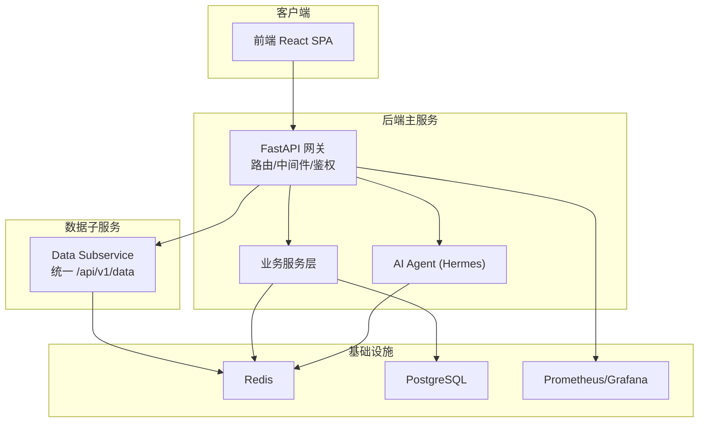
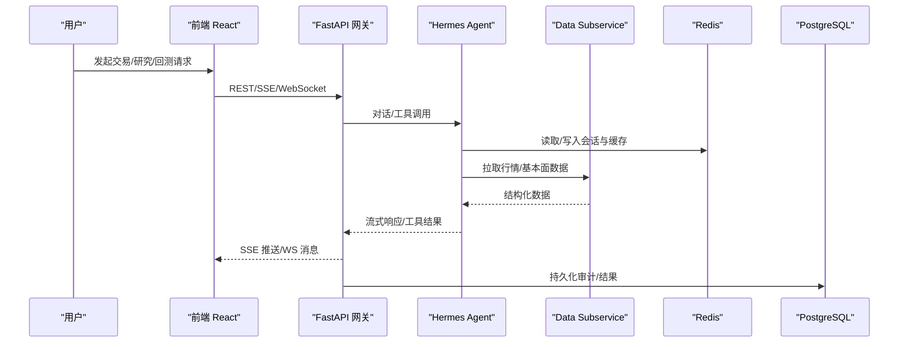
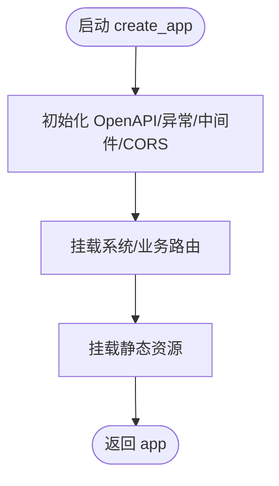
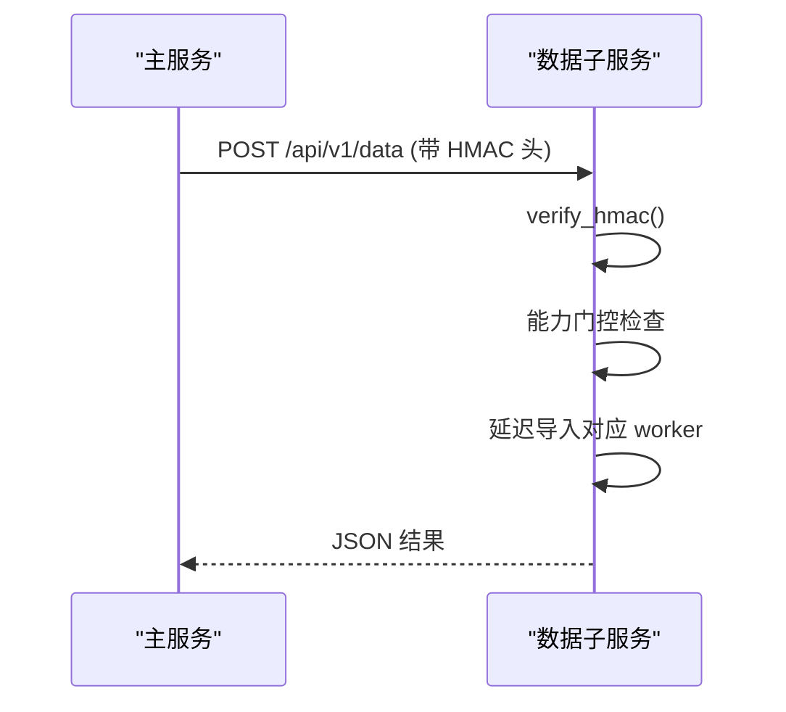
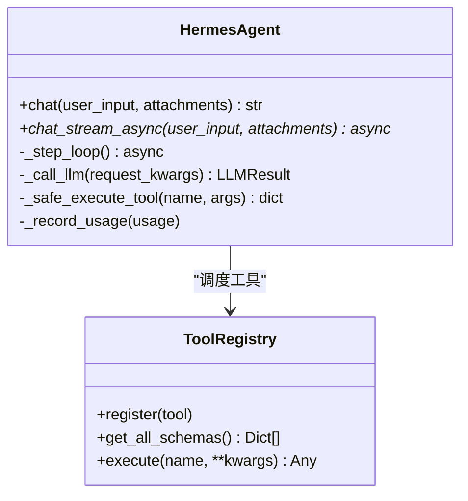
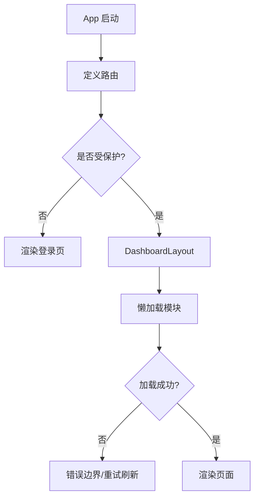
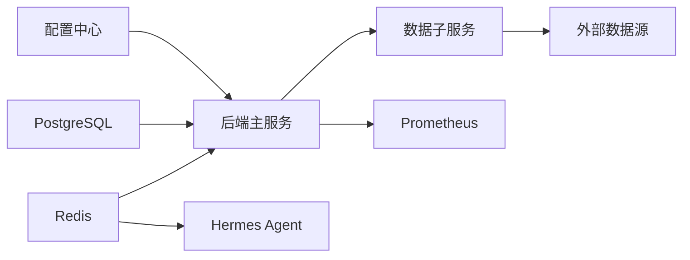
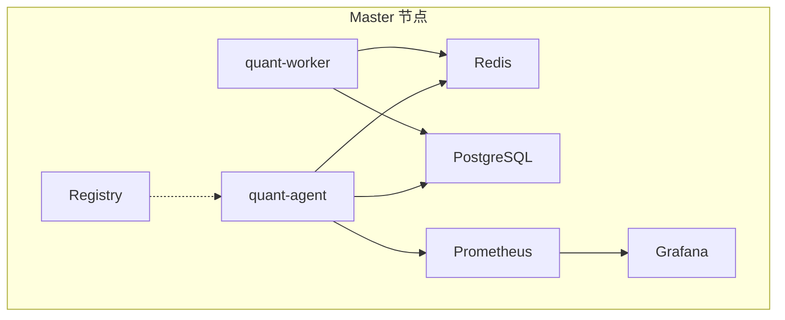

# 整体架构概览

<cite>
**本文引用的文件**
- [backend/main.py](file://backend/main.py)
- [frontend/src/App.tsx](file://frontend/src/App.tsx)
- [hermes_agent/agent.py](file://hermes_agent/agent.py)
- [data_subservice/main.py](file://data_subservice/main.py)
- [docker-compose.master.yml](file://docker-compose.master.yml)
- [backend/core/config.py](file://backend/core/config.py)
- [backend/core/redis_client.py](file://backend/core/redis_client.py)
- [backend/core/database.py](file://backend/core/database.py)
- [hermes_agent/tool_registry.py](file://hermes_agent/tool_registry.py)
- [backend/core/middleware.py](file://backend/core/middleware.py)
- [docs/ARCHITECTURE_REVIEW.md](file://docs/ARCHITECTURE_REVIEW.md)
</cite>

## 目录
1. [引言](#引言)
2. [项目结构](#项目结构)
3. [核心组件](#核心组件)
4. [架构总览](#架构总览)
5. [详细组件分析](#详细组件分析)
6. [依赖关系分析](#依赖关系分析)
7. [性能与可扩展性](#性能与可扩展性)
8. [部署拓扑与基础设施](#部署拓扑与基础设施)
9. [故障排查指南](#故障排查指南)
10. [结论](#结论)

## 引言
本文件面向Quant Agent系统的整体架构，聚焦前后端分离、微服务化与事件驱动的总体布局，解释技术栈选择（FastAPI、React、Redis、PostgreSQL等）的原因与优势，并阐述分层架构、插件化设计与可扩展性的核心理念。文末提供系统上下文图、部署拓扑与关键运维要点，帮助读者快速把握系统全貌。

## 项目结构
仓库采用多模块、多进程协作的单体仓库组织方式：
- 后端主服务：基于 FastAPI 的 API 网关与业务编排层，负责路由、中间件、鉴权、可观测性与外部系统集成。
- 数据子服务：独立运行的数据源 HTTP 服务，按能力声明对外暴露统一接口，支持 HMAC 签名校验与健康检查。
- AI Agent：Hermes Agent 作为“主脑”，通过工具注册表调度工具调用，结合 Redis 记忆与 LLM 流式交互。
- 前端应用：React + Vite SPA，懒加载功能模块，通过 REST/SSE/WebSocket 与后端交互。
- 基础设施：Redis 作为消息总线/缓存/限流；PostgreSQL 作为主数据库；Prometheus/Grafana 用于监控；Docker Compose 编排容器。

图表来源
- [backend/main.py:125-218](file://backend/main.py#L125-L218)
- [data_subservice/main.py:189-234](file://data_subservice/main.py#L189-L234)
- [hermes_agent/agent.py:258-305](file://hermes_agent/agent.py#L258-L305)
- [docker-compose.master.yml:16-130](file://docker-compose.master.yml#L16-L130)

章节来源
- [backend/main.py:125-218](file://backend/main.py#L125-L218)
- [frontend/src/App.tsx:89-124](file://frontend/src/App.tsx#L89-L124)
- [data_subservice/main.py:189-234](file://data_subservice/main.py#L189-L234)
- [docker-compose.master.yml:16-130](file://docker-compose.master.yml#L16-L130)

## 核心组件
- 后端主服务（FastAPI）
  - 职责：创建应用、挂载路由、配置中间件、CORS、OpenAPI、异常处理、静态资源挂载。
  - 关键点：统一 API 版本前缀、健康检查、可观测性初始化、跨域策略。
- 数据子服务（独立 FastAPI）
  - 职责：以节点形式运行，仅依赖内部实现，暴露统一数据获取端点，支持 HMAC 签名、能力门控、心跳注册。
  - 关键点：延迟导入重型 SDK、线程水位探针、Futu 长连接看门狗。
- AI Agent（Hermes）
  - 职责：维护会话上下文、LLM 调用封装、ReAct 循环、工具执行、流式输出、Token 计量、记忆持久化。
  - 关键点：统一请求参数构建、工具结果缓存、熔断恢复、心跳保活。
- 前端（React SPA）
  - 职责：路由与页面组织、懒加载模块、错误边界、全局通知。
  - 关键点：Chunk 加载失败自动重试刷新、按需加载降低首屏体积。
- 基础设施
  - Redis：连接池、异步批量写入、L1 本地缓存、限流、消息总线。
  - PostgreSQL：同步/异步引擎、连接池、扩展与索引。
  - 监控：Prometheus 指标采集、Grafana 可视化。

章节来源
- [backend/main.py:125-218](file://backend/main.py#L125-L218)
- [data_subservice/main.py:67-111](file://data_subservice/main.py#L67-L111)
- [hermes_agent/agent.py:116-191](file://hermes_agent/agent.py#L116-L191)
- [frontend/src/App.tsx:19-45](file://frontend/src/App.tsx#L19-L45)
- [backend/core/redis_client.py:22-34](file://backend/core/redis_client.py#L22-L34)
- [backend/core/database.py:10-25](file://backend/core/database.py#L10-L25)
- [backend/core/middleware.py:10-38](file://backend/core/middleware.py#L10-L38)

## 架构总览
Quant Agent 采用“前后端分离 + 微服务化 + 事件驱动”的组合架构：
- 前后端分离：前端为纯 SPA，后端提供 REST/SSE/WebSocket；前端通过懒加载与错误边界提升体验与稳定性。
- 微服务化：主服务与数据子服务物理解耦，子服务按能力声明运行，主服务通过 HMAC 安全调用。
- 事件驱动：Redis 作为共享状态与消息通道，Agent 与 Worker 通过 Redis 进行状态同步与任务分发；SSE 流式推送保障实时交互。

图表来源
- [backend/main.py:162-210](file://backend/main.py#L162-L210)
- [hermes_agent/agent.py:503-790](file://hermes_agent/agent.py#L503-L790)
- [data_subservice/main.py:189-234](file://data_subservice/main.py#L189-L234)
- [backend/core/redis_client.py:46-177](file://backend/core/redis_client.py#L46-L177)

## 详细组件分析

### 后端主服务（FastAPI 网关）
- 应用工厂：集中创建 FastAPI 实例，安装 OpenAPI、异常处理、中间件、CORS、路由挂载与静态资源。
- 路由组织：按领域划分路由（市场、策略、回测、OMS、风险、研究、系统等），统一 API 版本前缀。
- 可观测性：集成 Prometheus 指标、访问日志、外部 API 耗时统计。

图表来源
- [backend/main.py:125-218](file://backend/main.py#L125-L218)

章节来源
- [backend/main.py:125-218](file://backend/main.py#L125-L218)
- [backend/core/middleware.py:90-133](file://backend/core/middleware.py#L90-L133)

### 数据子服务（Data Subservice）
- 能力门控：通过环境变量声明可用数据源能力，未声明则拒绝请求。
- 安全校验：HMAC 签名验证时间戳与签名，防止重放与伪造。
- 健康与指标：/health 暴露线程水位与 Futu 连接状态；/metrics 暴露 Prometheus 指标。
- 长连接守护：Futu OpenD 连接看门狗，断线自愈。

图表来源
- [data_subservice/main.py:70-88](file://data_subservice/main.py#L70-L88)
- [data_subservice/main.py:189-234](file://data_subservice/main.py#L189-L234)

章节来源
- [data_subservice/main.py:67-111](file://data_subservice/main.py#L67-L111)
- [data_subservice/main.py:189-234](file://data_subservice/main.py#L189-L234)

### AI Agent（Hermes）
- ReAct 循环：Plan -> Tool -> Verify -> Output，最大迭代次数限制，避免无限循环。
- 工具注册与执行：装饰器自动注册工具，统一执行入口，内置结果缓存与限流。
- 流式交互：SSE 心跳保活，分块推送文本/工具开始/工具结果/图表标注等事件。
- 记忆与 Token 计量：Redis 存储会话，记录 token 使用量，支持强制总结恢复。

图表来源
- [hermes_agent/agent.py:116-191](file://hermes_agent/agent.py#L116-L191)
- [hermes_agent/tool_registry.py:52-123](file://hermes_agent/tool_registry.py#L52-L123)

章节来源
- [hermes_agent/agent.py:258-305](file://hermes_agent/agent.py#L258-L305)
- [hermes_agent/agent.py:503-790](file://hermes_agent/agent.py#L503-L790)
- [hermes_agent/tool_registry.py:52-123](file://hermes_agent/tool_registry.py#L52-L123)

### 前端（React SPA）
- 路由与懒加载：按功能模块懒加载，减少首屏体积；错误边界保护单模块崩溃。
- 健壮性：Chunk 加载失败时自动硬刷新，避免白屏；会话内防抖防止循环刷新。
- 导航：登录页与受保护路由分离，默认跳转数据中心。

图表来源
- [frontend/src/App.tsx:19-45](file://frontend/src/App.tsx#L19-L45)
- [frontend/src/App.tsx:89-124](file://frontend/src/App.tsx#L89-L124)

章节来源
- [frontend/src/App.tsx:89-124](file://frontend/src/App.tsx#L89-L124)

## 依赖关系分析
- 后端主服务依赖：
  - 配置中心：Pydantic Settings 校验必填项与环境变量。
  - 数据库：SQLAlchemy 同步/异步引擎，连接池与预检。
  - Redis：连接池、批量写入、L1 缓存、限流。
  - 监控：Prometheus 计数器与直方图。
- 数据子服务依赖：
  - 内部实现：断路器、日志、指标、Redis 客户端、服务注册。
  - 外部数据源：yfinance、akshare、tushare、futu、finnhub、fmp、fred、dbnomics、rbi、搜索类源。
- Agent 依赖：
  - LLM 客户端：OpenAI 兼容 SDK，支持流式与非流式。
  - Redis：会话记忆、工具结果缓存。
  - 工具注册表：自动发现与执行。

图表来源
- [backend/core/config.py:20-134](file://backend/core/config.py#L20-L134)
- [backend/core/database.py:10-67](file://backend/core/database.py#L10-L67)
- [backend/core/redis_client.py:22-34](file://backend/core/redis_client.py#L22-L34)
- [data_subservice/main.py:189-234](file://data_subservice/main.py#L189-L234)
- [backend/core/middleware.py:10-38](file://backend/core/middleware.py#L10-L38)

章节来源
- [backend/core/config.py:20-134](file://backend/core/config.py#L20-L134)
- [backend/core/database.py:10-67](file://backend/core/database.py#L10-L67)
- [backend/core/redis_client.py:22-34](file://backend/core/redis_client.py#L22-L34)
- [data_subservice/main.py:189-234](file://data_subservice/main.py#L189-L234)
- [backend/core/middleware.py:10-38](file://backend/core/middleware.py#L10-L38)

## 性能与可扩展性
- 高性能缓存：
  - Redis 异步批量写入：聚合 set 操作，降低网络往返与带宽占用。
  - L1 本地短效缓存：消除极高频读取的 TCP 开销，具备容量保护与后台清理。
- 高并发与限流：
  - 连接池上限配置化，防止无上限打满。
  - Agent 工具执行令牌桶限流，避免下游过载。
- 可观测性：
  - 请求计数与时延直方图，外部 API 耗时统计，慢请求告警。
- 可扩展性：
  - 数据子服务按能力声明运行，新增数据源只需实现 handler 并声明能力。
  - Agent 工具通过装饰器自动注册，便于横向扩展。

章节来源
- [backend/core/redis_client.py:46-177](file://backend/core/redis_client.py#L46-L177)
- [backend/core/redis_client.py:180-252](file://backend/core/redis_client.py#L180-L252)
- [hermes_agent/tool_registry.py:10-33](file://hermes_agent/tool_registry.py#L10-L33)
- [backend/core/middleware.py:10-38](file://backend/core/middleware.py#L10-L38)

## 部署拓扑与基础设施
- 容器编排（Master 节点）：
  - Redis：仅绑定 loopback 与 Tailscale 内网，启用 AOF 持久化。
  - PostgreSQL：pgvector 扩展与 trigram 索引，仅内网可达。
  - quant-agent：FastAPI 主服务，限制并发与内存，挂载报告与数据目录。
  - quant-worker：后台任务进程，消费队列与执行长任务。
  - Registry：私有镜像中转，仅内网访问，加速国内节点拉取。
  - Prometheus/Grafana：可选 profile 启动，仅内网访问。
- 环境变量与安全：
  - 数据库 URL、Redis 密码、LLM API Key 等通过 .env 注入。
  - 数据子服务间通信使用 HMAC 签名与时间戳校验。
- 健康检查与资源限制：
  - 各服务提供健康检查，Docker 根据健康状态依赖启动。
  - 资源限制与预留确保宿主内存稳定。

图表来源
- [docker-compose.master.yml:16-130](file://docker-compose.master.yml#L16-L130)
- [docker-compose.master.yml:197-251](file://docker-compose.master.yml#L197-L251)

章节来源
- [docker-compose.master.yml:16-130](file://docker-compose.master.yml#L16-L130)
- [docker-compose.master.yml:197-251](file://docker-compose.master.yml#L197-L251)

## 故障排查指南
- 数据子服务健康：
  - 查看 /health 的线程数与 Futu 连接状态，判断是否降级或不可用。
  - 若线程数超过阈值，服务标记为 degraded，需扩容或限流。
- Agent 流式中断：
  - 心跳保活机制每 15 秒发送 heartbeat，防止 Cloudflare/Nginx 空闲超时断开。
  - 若出现空响应或工具调用不匹配，检查工具执行队列与消息保存时机。
- 外部 API 慢请求：
  - 通过外部 API 指标与日志定位慢服务，必要时启用熔断或降级。
- 数据库与缓存：
  - 确认 DATABASE_URL 与 REDIS_PASSWORD 正确；检查连接池大小与超时。
  - 关注 L1 缓存容量保护与过期清理，避免内存泄漏。

章节来源
- [data_subservice/main.py:91-111](file://data_subservice/main.py#L91-L111)
- [hermes_agent/agent.py:544-587](file://hermes_agent/agent.py#L544-L587)
- [backend/core/middleware.py:44-88](file://backend/core/middleware.py#L44-L88)
- [backend/core/redis_client.py:180-252](file://backend/core/redis_client.py#L180-L252)

## 结论
Quant Agent 以 FastAPI 为主网关、React 为前端、Redis 为消息总线与缓存、PostgreSQL 为主库，构建了前后端分离、微服务化与事件驱动的高性能量化平台。通过数据子服务的能力门控与 HMAC 安全、Agent 的工具注册与流式交互、以及完善的监控与资源限制，系统在可扩展性、稳定性与可观测性方面具备机构级设计。后续可在 API 版本管理、认证规范、灾难恢复与 CI/CD 等方面持续完善，进一步提升工程化水平。
