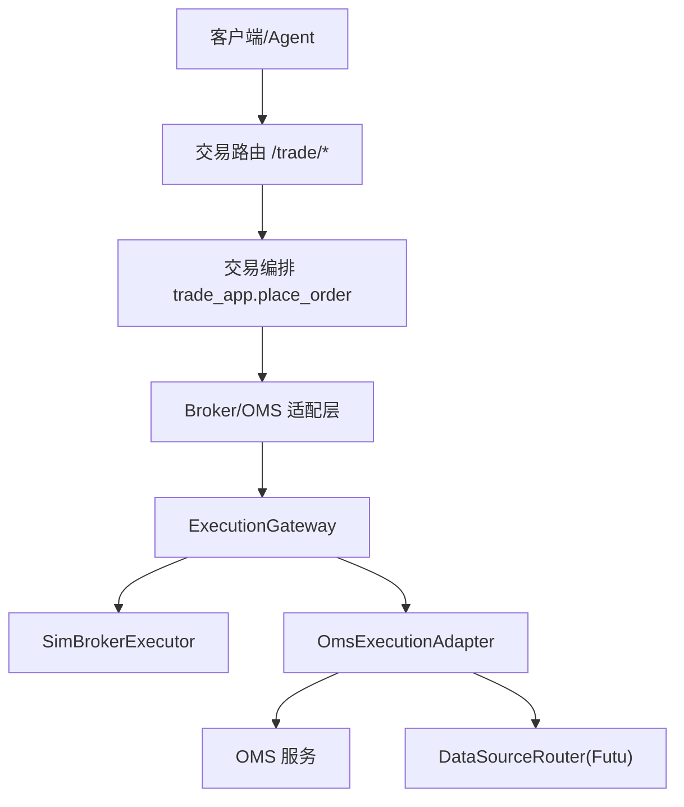
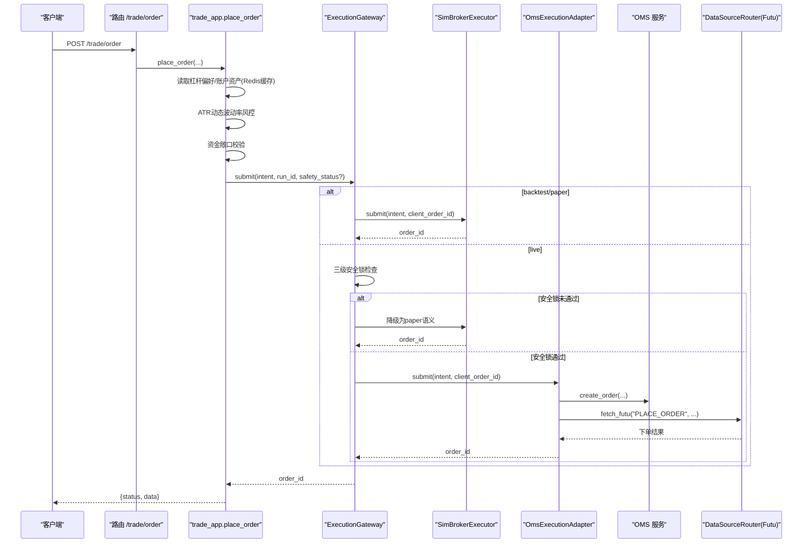
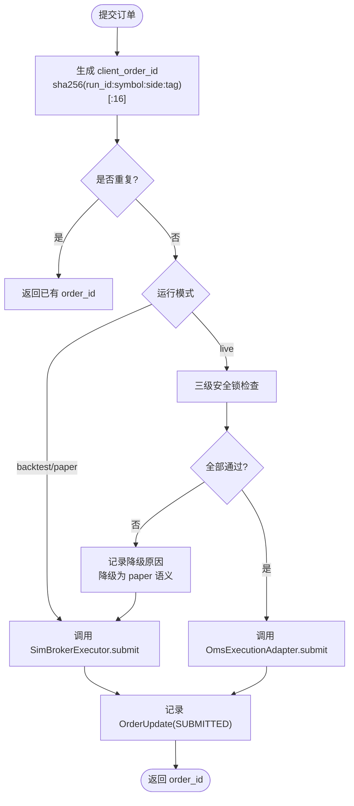
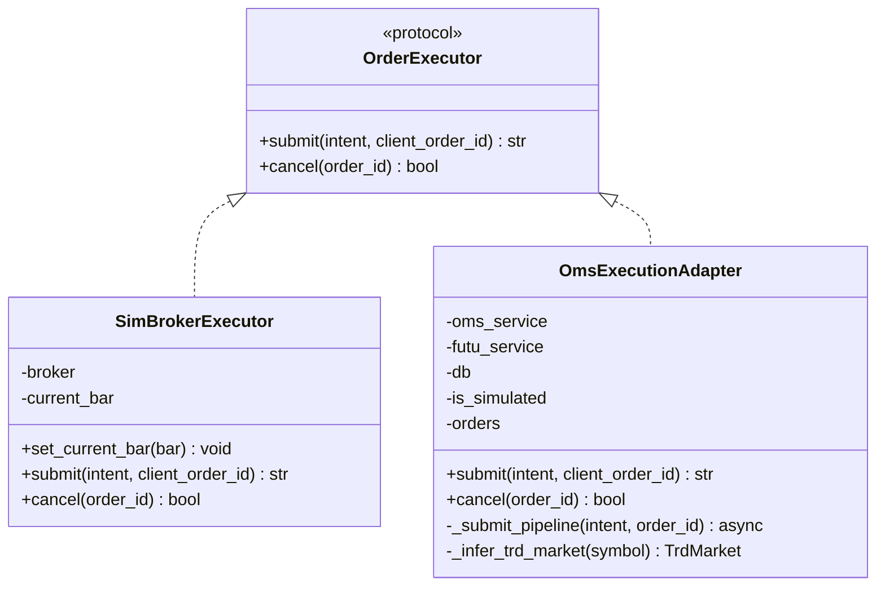
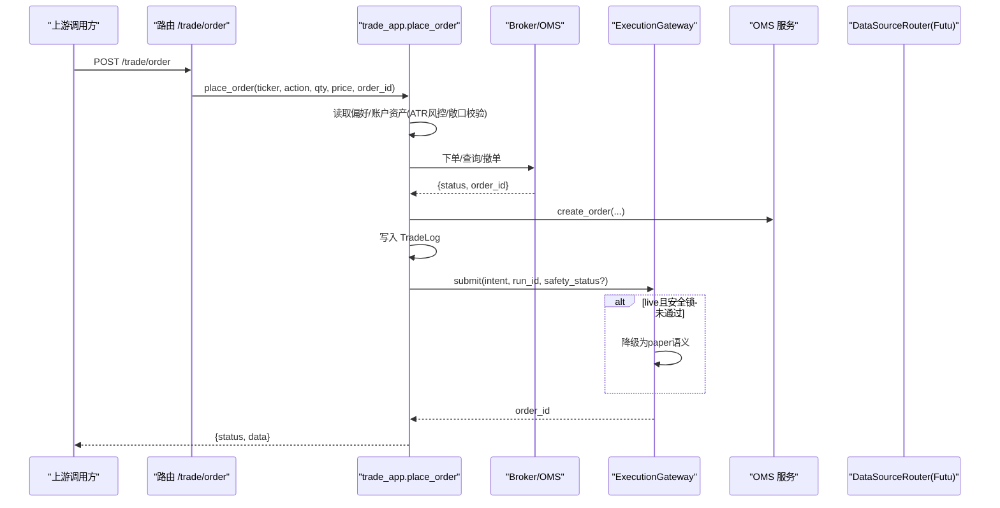
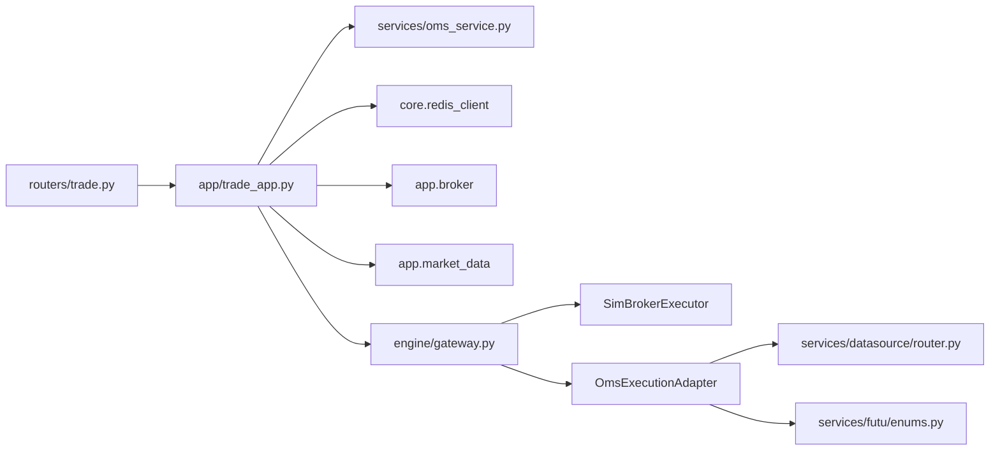

# API网关设计

<cite>
**本文引用的文件**
- [backend/engine/gateway.py](file://backend/engine/gateway.py)
- [backend/routers/trade.py](file://backend/routers/trade.py)
- [backend/app/trade_app.py](file://backend/app/trade_app.py)
- [backend/core/exceptions.py](file://backend/core/exceptions.py)
- [backend/services/oms_service.py](file://backend/services/oms_service.py)
- [backend/services/datasource/router.py](file://backend/services/datasource/router.py)
- [backend/services/futu/enums.py](file://backend/services/futu/enums.py)
- [backend/engine/contracts.py](file://backend/engine/contracts.py)
- [backend/schemas/domain.py](file://backend/schemas/domain.py)
</cite>

## 目录
1. [简介](#简介)
2. [项目结构](#项目结构)
3. [核心组件](#核心组件)
4. [架构总览](#架构总览)
5. [详细组件分析](#详细组件分析)
6. [依赖关系分析](#依赖关系分析)
7. [性能与可靠性](#性能与可靠性)
8. [故障排查指南](#故障排查指南)
9. [结论](#结论)
10. [附录](#附录)

## 简介
本设计文档聚焦于Quant Agent系统的API网关与统一订单出口机制，围绕ExecutionGateway的三种运行模式（backtest/paper/live）、三级安全锁、幂等去重、OrderExecutor协议以及SimBrokerExecutor与OmsExecutionAdapter的差异进行系统化阐述。同时给出完整的订单提交流程图，涵盖client_order_id生成算法、订单状态跟踪、错误处理策略，并总结连接池管理、超时控制、降级与熔断等关键工程实践。

## 项目结构
- 路由层：FastAPI路由仅负责请求校验、鉴权注入与HTTP映射，将交易用例编排委托给应用层。
- 应用层：trade_app实现风控校验、账户信息缓存、下单分发与OMS持久化留痕。
- 执行网关：gateway.py提供ExecutionGateway统一入口，按模式路由到SimBroker或OmsExecutionAdapter，内置安全锁检查与降级逻辑。
- 执行器协议：OrderExecutor定义submit/cancel接口；SimBrokerExecutor用于回测/纸面；OmsExecutionAdapter用于实盘。
- 外部集成：通过DataSourceRouter桥接Futu服务完成实盘下单；OMS服务负责订单落库与状态回写。

**图表来源**
- [backend/routers/trade.py:30-39](file://backend/routers/trade.py#L30-L39)
- [backend/app/trade_app.py:35-187](file://backend/app/trade_app.py#L35-L187)
- [backend/engine/gateway.py:98-207](file://backend/engine/gateway.py#L98-L207)
- [backend/engine/gateway.py:215-359](file://backend/engine/gateway.py#L215-L359)

**章节来源**
- [backend/routers/trade.py:1-57](file://backend/routers/trade.py#L1-L57)
- [backend/app/trade_app.py:1-232](file://backend/app/trade_app.py#L1-L232)
- [backend/engine/gateway.py:1-359](file://backend/engine/gateway.py#L1-L359)

## 核心组件
- ExecutionGateway：统一订单出口，负责模式路由、安全锁检查、幂等去重与降级。
- OrderExecutor协议：抽象提交与取消接口，屏蔽后端差异。
- SimBrokerExecutor：面向回测/纸面的本地撮合执行器。
- OmsExecutionAdapter：面向实盘的适配器，封装OMS落库与券商下单流程。
- 安全锁状态：REAL_TRADE_EXECUTE + trading_mode + kill_switch 三级判定。
- 幂等键：基于run_id、symbol、side、tag的哈希前缀作为client_order_id。

**章节来源**
- [backend/engine/gateway.py:35-77](file://backend/engine/gateway.py#L35-L77)
- [backend/engine/gateway.py:98-207](file://backend/engine/gateway.py#L98-L207)
- [backend/engine/gateway.py:215-359](file://backend/engine/gateway.py#L215-L359)

## 架构总览
下图展示从HTTP请求到订单执行的完整链路，包括风控、OMS持久化、网关路由与安全锁检查。

**图表来源**
- [backend/routers/trade.py:30-39](file://backend/routers/trade.py#L30-L39)
- [backend/app/trade_app.py:35-187](file://backend/app/trade_app.py#L35-L187)
- [backend/engine/gateway.py:116-186](file://backend/engine/gateway.py#L116-L186)
- [backend/engine/gateway.py:239-326](file://backend/engine/gateway.py#L239-L326)

## 详细组件分析

### ExecutionGateway：统一订单出口与三级安全锁
- 模式路由
  - backtest/paper → 走SimBrokerExecutor
  - live → 走OmsExecutionAdapter
- 三级安全锁
  - REAL_TRADE_EXECUTE 环境变量
  - trading_mode == LIVE（来自配置/Redis）
  - kill_switch 未触发
  - 任一不满足则记录原因并自动降级为paper语义
- 幂等去重
  - client_order_id = sha256(run_id:symbol:side:tag)[:16]
  - 内存中维护已提交订单映射，重复提交直接返回已有order_id
- 状态跟踪
  - 提交后记录OrderUpdate(order_id, intent_tag, status=SUBMITTED)
  - 支持cancel转发至对应执行器

**图表来源**
- [backend/engine/gateway.py:116-207](file://backend/engine/gateway.py#L116-L207)
- [backend/engine/gateway.py:198-202](file://backend/engine/gateway.py#L198-L202)

**章节来源**
- [backend/engine/gateway.py:35-77](file://backend/engine/gateway.py#L35-L77)
- [backend/engine/gateway.py:98-207](file://backend/engine/gateway.py#L98-L207)

### OrderExecutor协议与实现差异
- 协议
  - submit(intent, client_order_id) -> order_id
  - cancel(order_id) -> bool
- SimBrokerExecutor
  - 适用于回测/纸面，需要当前bar以支持市价单
  - 直接委托底层SimBroker执行
- OmsExecutionAdapter
  - 适用于实盘，内部流程：
    - 生成OMS侧order_id并登记为SUBMITTED
    - 调用OMS服务create_order落库
    - 非模拟盘时通过DataSourceRouter.fetch_futu发起真实下单
    - 异步协程隔离执行，兼容无事件循环场景
  - 市场推断：根据symbol前缀推断TrdMarket(HK/CN/US)

**图表来源**
- [backend/engine/gateway.py:67-96](file://backend/engine/gateway.py#L67-L96)
- [backend/engine/gateway.py:215-359](file://backend/engine/gateway.py#L215-L359)
- [backend/services/futu/enums.py](file://backend/services/futu/enums.py)

**章节来源**
- [backend/engine/gateway.py:67-96](file://backend/engine/gateway.py#L67-L96)
- [backend/engine/gateway.py:215-359](file://backend/engine/gateway.py#L215-L359)

### 订单提交流程（含风控、OMS持久化与降级）
- 路由层接收POST /trade/order，参数包含ticker、action、qty、price、order_id
- 应用层：
  - 读取用户杠杆偏好（Redis）
  - 获取账户总资产（Redis缓存+并发锁防穿透）
  - ATR动态波动率风控：高波动强制降杠杆至1.0，计算建议止损位
  - 资金敞口校验：order_value <= total_assets * max_leverage
  - 调用底层broker下单或查询/撤单
  - OMS持久化：create_order写入PostgreSQL，并追加TradeLog留痕
- 网关层：
  - 生成client_order_id并做幂等检查
  - 模式路由与安全锁检查，失败自动降级为paper语义
  - 记录OrderUpdate状态

**图表来源**
- [backend/routers/trade.py:30-39](file://backend/routers/trade.py#L30-L39)
- [backend/app/trade_app.py:35-187](file://backend/app/trade_app.py#L35-L187)
- [backend/engine/gateway.py:116-186](file://backend/engine/gateway.py#L116-L186)

**章节来源**
- [backend/routers/trade.py:1-57](file://backend/routers/trade.py#L1-L57)
- [backend/app/trade_app.py:35-187](file://backend/app/trade_app.py#L35-L187)
- [backend/engine/gateway.py:116-186](file://backend/engine/gateway.py#L116-L186)

### 安全锁状态检查与安全降级机制
- 安全锁三要素
  - REAL_TRADE_EXECUTE：环境变量开关
  - trading_mode：配置项/Redis值需为LIVE
  - kill_switch：未触发
- 降级策略
  - 任一条件不满足即记录failure_reason并降级为paper语义
  - 使用SimBrokerExecutor执行，避免误发实盘订单
  - 统计degraded_count便于监控告警

**章节来源**
- [backend/engine/gateway.py:43-64](file://backend/engine/gateway.py#L43-L64)
- [backend/engine/gateway.py:161-186](file://backend/engine/gateway.py#L161-L186)

### 幂等去重与订单状态跟踪
- client_order_id生成：基于run_id、symbol、side、tag的SHA256前16位
- 去重：内存字典维护client_order_id -> OrderUpdate，重复提交直接返回已有order_id
- 状态跟踪：提交后记录OrderUpdate(status=SUBMITTED)，后续可由上层更新

**章节来源**
- [backend/engine/gateway.py:116-159](file://backend/engine/gateway.py#L116-L159)
- [backend/engine/gateway.py:198-202](file://backend/engine/gateway.py#L198-L202)

## 依赖关系分析
- 路由层依赖应用层编排函数，解耦HTTP与业务逻辑
- 应用层依赖：
  - Redis：偏好与账户信息缓存
  - Broker：账户信息与下单能力
  - MarketData：技术指标（ATR）
  - OMS：订单持久化
- 网关层依赖：
  - SimBrokerExecutor：回测/纸面执行
  - OmsExecutionAdapter：实盘执行
  - DataSourceRouter：桥接Futu服务
  - Futu枚举：市场与买卖方向映射

**图表来源**
- [backend/routers/trade.py:10-27](file://backend/routers/trade.py#L10-L27)
- [backend/app/trade_app.py:11-25](file://backend/app/trade_app.py#L11-L25)
- [backend/engine/gateway.py:23-31](file://backend/engine/gateway.py#L23-L31)
- [backend/engine/gateway.py:215-359](file://backend/engine/gateway.py#L215-L359)

**章节来源**
- [backend/routers/trade.py:1-57](file://backend/routers/trade.py#L1-L57)
- [backend/app/trade_app.py:1-232](file://backend/app/trade_app.py#L1-L232)
- [backend/engine/gateway.py:1-359](file://backend/engine/gateway.py#L1-L359)

## 性能与可靠性
- 连接池管理
  - 数据库会话：在OmsExecutionAdapter._submit_pipeline中按需创建SessionLocal并在finally关闭，避免长连接泄漏
  - 外部服务：通过DataSourceRouter统一接入，建议在下游实现连接复用与池化
- 超时控制
  - 建议在DataSourceRouter与OMS服务调用处增加超时与重试策略，防止长尾阻塞
  - 对高频读（账户信息）采用Redis缓存+并发锁降低穿透
- 幂等与一致性
  - client_order_id保证重复提交幂等
  - OMS落库与TradeLog写入在同一事务内（由上层DB session管理），确保一致性
- 降级与熔断
  - 安全锁未通过自动降级为paper语义，避免误发实盘
  - 建议在OMS与券商调用处引入熔断器，异常快速失败并回退
- 可观测性
  - 记录degraded_count、异常日志与订单状态变更，便于监控与审计

[本节为通用指导，无需特定文件引用]

## 故障排查指南
- 常见错误与定位
  - 安全锁未通过：检查REAL_TRADE_EXECUTE、trading_mode、kill_switch配置与状态
  - 重复订单：确认client_order_id生成一致性与上游幂等策略
  - 下单失败：查看OMS落库返回与DataSourceRouter调用结果
  - 账户信息穿透：检查Redis缓存与并发锁是否生效
- 日志与指标
  - 关注Gateway与OmsAdapter的警告与错误日志
  - 监控degraded_count与下单成功率
- 恢复步骤
  - 修正安全锁配置后重试
  - 清理异常订单状态并重新提交
  - 扩容或修复下游服务后重试

**章节来源**
- [backend/engine/gateway.py:161-186](file://backend/engine/gateway.py#L161-L186)
- [backend/engine/gateway.py:239-326](file://backend/engine/gateway.py#L239-L326)
- [backend/app/trade_app.py:47-74](file://backend/app/trade_app.py#L47-L74)

## 结论
ExecutionGateway作为统一订单出口，实现了跨模式的订单路由、严格的安全锁控制与幂等保障，并通过安全降级机制有效规避实盘风险。OrderExecutor协议抽象了执行后端差异，使回测、纸面与实盘具备一致的调用体验。结合Redis缓存、并发锁、OMS持久化与DataSourceRouter桥接，系统在性能与可靠性方面具备良好基础。建议进一步补充超时、重试与熔断策略，完善可观测性与自动化测试覆盖。

[本节为总结性内容，无需特定文件引用]

## 附录
- 关键数据模型与状态
  - OrderIntent：订单意图（symbol、side、order_type、limit_price、tag等）
  - OrderUpdate：订单更新（order_id、intent_tag、status）
  - OrderStatus：订单状态枚举（如SUBMITTED、CANCELLED等）
- 参考路径
  - 协议与模型：backend/engine/contracts.py、backend/schemas/domain.py
  - 路由与编排：backend/routers/trade.py、backend/app/trade_app.py
  - 网关与执行器：backend/engine/gateway.py
  - 外部集成：backend/services/datasource/router.py、backend/services/futu/enums.py

**章节来源**
- [backend/engine/contracts.py](file://backend/engine/contracts.py)
- [backend/schemas/domain.py](file://backend/schemas/domain.py)
- [backend/routers/trade.py:30-39](file://backend/routers/trade.py#L30-L39)
- [backend/app/trade_app.py:35-187](file://backend/app/trade_app.py#L35-L187)
- [backend/engine/gateway.py:98-207](file://backend/engine/gateway.py#L98-L207)
- [backend/engine/gateway.py:215-359](file://backend/engine/gateway.py#L215-L359)
- [backend/services/datasource/router.py](file://backend/services/datasource/router.py)
- [backend/services/futu/enums.py](file://backend/services/futu/enums.py)
