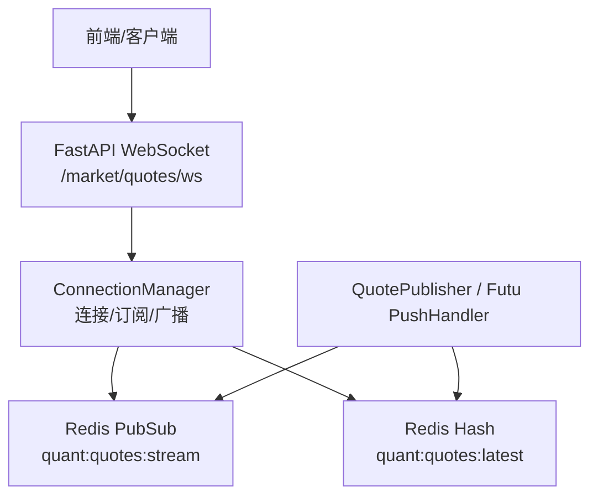
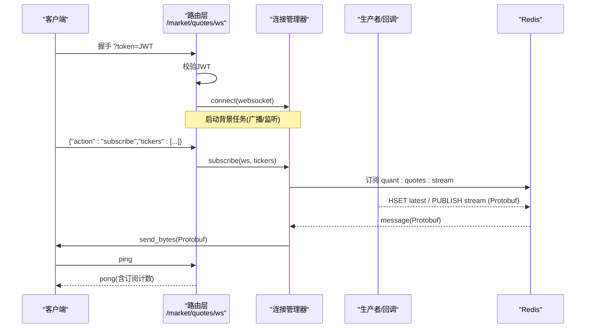
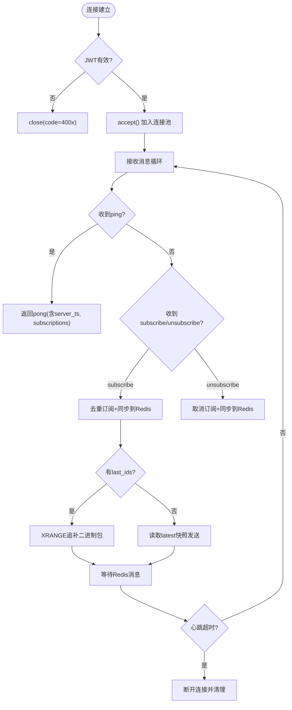
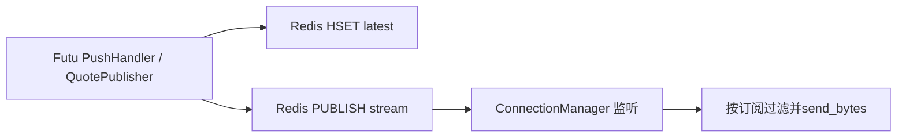
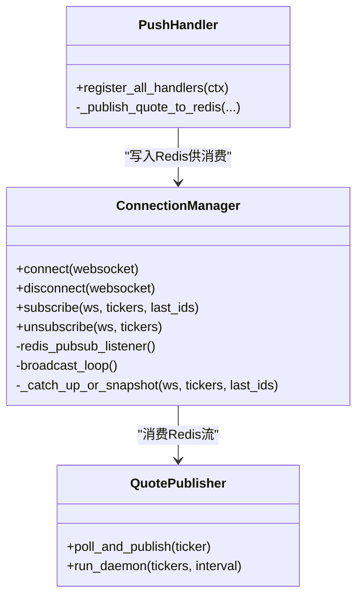
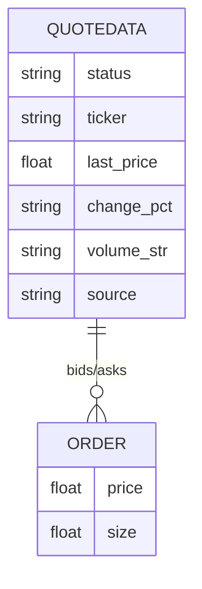
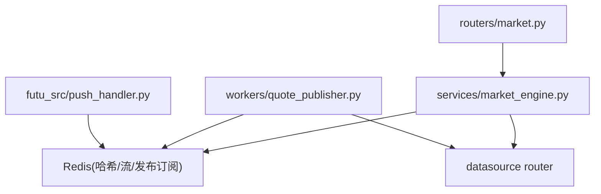

# WebSocket推送服务

<cite>
**本文引用的文件**
- [backend/routers/market.py](file://backend/routers/market.py)
- [backend/services/market_engine.py](file://backend/services/market_engine.py)
- [backend/workers/quote_publisher.py](file://backend/workers/quote_publisher.py)
- [data_subservice/futu_src/push_handler.py](file://data_subservice/futu_src/push_handler.py)
- [backend/core/proto/market_pb2.py](file://backend/core/proto/market_pb2.py)
- [shared/proto/market.proto](file://shared/proto/market.proto)
- [backend/routers/alert.py](file://backend/routers/alert.py)
</cite>

## 目录
1. [简介](#简介)
2. [项目结构](#项目结构)
3. [核心组件](#核心组件)
4. [架构总览](#架构总览)
5. [详细组件分析](#详细组件分析)
6. [依赖关系分析](#依赖关系分析)
7. [性能与扩展性](#性能与扩展性)
8. [故障排查指南](#故障排查指南)
9. [结论](#结论)
10. [附录](#附录)

## 简介
本文件面向生产环境，系统性说明 Quant Agent 的 WebSocket 实时行情推送服务。内容覆盖连接管理、订阅机制、消息广播、心跳检测、断线重连策略、消息格式与压缩、协议版本兼容、以及扩展新通道与消息类型的方法。同时给出连接数限制、带宽控制与安全认证等部署建议。

## 项目结构
WebSocket 推送由“路由层 + 连接管理器 + 数据生产者/消费者 + Redis 总线”构成：
- 路由层：FastAPI 暴露 /market/quotes/ws 端点，负责鉴权、心跳、订阅指令解析与转发。
- 连接管理器：维护活跃连接、订阅集合、Redis PubSub 监听、追补与快照、背景轮询与指标埋点。
- 数据生产者：后台守护进程或子服务回调将行情写入 Redis（最新快照与流）。
- 数据消费者：连接管理器从 Redis 订阅并定向推送给对应客户端。

**图示来源**
- [backend/routers/market.py:73-226](file://backend/routers/market.py#L73-L226)
- [backend/services/market_engine.py:115-331](file://backend/services/market_engine.py#L115-L331)
- [backend/workers/quote_publisher.py:22-165](file://backend/workers/quote_publisher.py#L22-L165)
- [data_subservice/futu_src/push_handler.py:58-90](file://data_subservice/futu_src/push_handler.py#L58-L90)

**章节来源**
- [backend/routers/market.py:73-226](file://backend/routers/market.py#L73-L226)
- [backend/services/market_engine.py:115-331](file://backend/services/market_engine.py#L115-L331)
- [backend/workers/quote_publisher.py:22-165](file://backend/workers/quote_publisher.py#L22-L165)
- [data_subservice/futu_src/push_handler.py:58-90](file://data_subservice/futu_src/push_handler.py#L58-L90)

## 核心组件
- 行情 WebSocket 路由：提供鉴权、心跳、订阅/退订、错误处理与指标统计。
- 连接管理器：维护连接池、订阅映射、Redis 监听、追补/快照、背景任务与指标。
- 行情生产者：后台轮询或外部源回调，统一序列化为 Protobuf 写入 Redis。
- 数据桥接：Futu 推送处理器将底层实时数据桥接到 Redis 主流。
- 告警 WebSocket：独立的路由实现，用于告警事件推送（可作为参考）。

**章节来源**
- [backend/routers/market.py:73-226](file://backend/routers/market.py#L73-L226)
- [backend/services/market_engine.py:115-331](file://backend/services/market_engine.py#L115-L331)
- [backend/workers/quote_publisher.py:22-165](file://backend/workers/quote_publisher.py#L22-L165)
- [data_subservice/futu_src/push_handler.py:140-249](file://data_subservice/futu_src/push_handler.py#L140-L249)
- [backend/routers/alert.py:148-211](file://backend/routers/alert.py#L148-L211)

## 架构总览
下图展示端到端的数据流：客户端通过 WebSocket 建立连接并完成鉴权；发送订阅指令后，连接管理器记录订阅；后台生产者或子服务回调将行情以 Protobuf 二进制写入 Redis；连接管理器订阅 Redis 并将匹配的消息定向推送给客户端；支持断线追补与快照回灌。

**图示来源**
- [backend/routers/market.py:73-226](file://backend/routers/market.py#L73-L226)
- [backend/services/market_engine.py:160-331](file://backend/services/market_engine.py#L160-L331)
- [backend/workers/quote_publisher.py:133-165](file://backend/workers/quote_publisher.py#L133-L165)
- [data_subservice/futu_src/push_handler.py:58-90](file://data_subservice/futu_src/push_handler.py#L58-L90)

## 详细组件分析

### 连接管理与订阅机制
- 连接建立与鉴权：路由层从查询参数提取 JWT，解码校验用户名，失败返回特定关闭码。
- 心跳保活：客户端定时发送 ping，服务端响应包含服务器时间戳与当前订阅数量；服务端维护心跳超时阈值，超过则主动断开。
- 订阅去重：对同一 ticker 重复订阅会过滤，避免重复注册。
- 订阅同步：连接管理器在 subscribe/unsubscribe 时，将当前所有连接的订阅集合同步到 Redis 集合键，供生产者动态跟随前端自选列表推送。
- 断线追补与快照：新订阅时，若携带 last_ids，则通过 Redis Stream XRANGE 追补遗漏的二进制包；否则直接发送 quant:quotes:latest 中的最新快照。

**图示来源**
- [backend/routers/market.py:73-226](file://backend/routers/market.py#L73-L226)
- [backend/services/market_engine.py:174-251](file://backend/services/market_engine.py#L174-L251)
- [backend/services/market_engine.py:201-244](file://backend/services/market_engine.py#L201-L244)

**章节来源**
- [backend/routers/market.py:73-226](file://backend/routers/market.py#L73-L226)
- [backend/services/market_engine.py:174-251](file://backend/services/market_engine.py#L174-L251)
- [backend/services/market_engine.py:201-244](file://backend/services/market_engine.py#L201-L244)

### 消息广播与Redis总线
- 生产者职责：后台守护进程或子服务回调将行情封装为 Protobuf，双写至 Redis：
  - HSET quant:quotes:latest 保存最新快照
  - PUBLISH quant:quotes:stream 发布实时流
- 消费者职责：连接管理器订阅 quant:quotes:stream，解析 Protobuf 获取 ticker，仅推送给订阅了该标的的连接。
- 逐笔成交：使用 Redis Stream 持久化最近 N 条，支持 XRANGE 断线追补。

**图示来源**
- [backend/workers/quote_publisher.py:133-165](file://backend/workers/quote_publisher.py#L133-L165)
- [data_subservice/futu_src/push_handler.py:58-90](file://data_subservice/futu_src/push_handler.py#L58-L90)
- [backend/services/market_engine.py:296-331](file://backend/services/market_engine.py#L296-L331)

**章节来源**
- [backend/workers/quote_publisher.py:133-165](file://backend/workers/quote_publisher.py#L133-L165)
- [data_subservice/futu_src/push_handler.py:58-90](file://data_subservice/futu_src/push_handler.py#L58-L90)
- [backend/services/market_engine.py:296-331](file://backend/services/market_engine.py#L296-L331)

### 实时行情推送实现原理
- 数据源接入：
  - 子服务侧：Futu OpenD 推送回调经线程安全调度到主事件循环，写入 Redis。
  - 主服务侧：后台轮询兜底（YFinance）与指标缓存更新，最终也写入 Redis。
- 序列化与传输：统一使用 Protobuf 二进制帧，减少体积与解析开销；批量追补时采用 zlib 压缩与自定义二进制打包格式提升吞吐。
- 订阅驱动：生产者根据 Redis 集合动态决定推送标的，确保与前端自选一致。

**图示来源**
- [backend/services/market_engine.py:115-331](file://backend/services/market_engine.py#L115-L331)
- [backend/workers/quote_publisher.py:22-165](file://backend/workers/quote_publisher.py#L22-L165)
- [data_subservice/futu_src/push_handler.py:140-249](file://data_subservice/futu_src/push_handler.py#L140-L249)

**章节来源**
- [backend/services/market_engine.py:115-331](file://backend/services/market_engine.py#L115-L331)
- [backend/workers/quote_publisher.py:22-165](file://backend/workers/quote_publisher.py#L22-L165)
- [data_subservice/futu_src/push_handler.py:140-249](file://data_subservice/futu_src/push_handler.py#L140-L249)

### 消息格式定义与协议兼容
- 二进制消息：基于 Protobuf 的 QuoteData/Order 结构，字段包括状态、标的、最新价、涨跌幅、成交量字符串、数据源、买卖盘口等。
- 文本控制消息：JSON 信封，包含 code/msg/data/ts 等字段；动作包括 subscribe、unsubscribe、ping。
- 压缩模式：批量追补时使用自定义二进制帧头标识压缩模式，并使用 zlib 压缩多包以减少网络开销。
- 版本兼容：路由层对 tickers 进行格式化归一；对未知 action 返回错误码；对 JSON 解析失败返回明确错误。

**图示来源**
- [backend/core/proto/market_pb2.py](file://backend/core/proto/market_pb2.py)
- [shared/proto/market.proto](file://shared/proto/market.proto)
- [backend/routers/market.py:103-214](file://backend/routers/market.py#L103-L214)
- [backend/services/market_engine.py:201-244](file://backend/services/market_engine.py#L201-L244)

**章节来源**
- [backend/routers/market.py:103-214](file://backend/routers/market.py#L103-L214)
- [backend/services/market_engine.py:201-244](file://backend/services/market_engine.py#L201-L244)
- [backend/core/proto/market_pb2.py](file://backend/core/proto/market_pb2.py)
- [shared/proto/market.proto](file://shared/proto/market.proto)

### 扩展机制：新增推送通道与消息类型
- 新增数据源回调：在 data_subservice 中实现新的 Handler，将数据转换为统一的 Protobuf 结构并写入 Redis 相应频道。
- 新增业务通道：在 routers 下新增 WebSocket 端点，复用 ConnectionManager 的连接/订阅能力，或基于 Redis PubSub 自建轻量广播。
- 新增消息类型：扩展 Protobuf 定义并在各端（生产者、消费者、路由层）同步适配；保持向后兼容，旧客户端忽略未知字段。

**章节来源**
- [data_subservice/futu_src/push_handler.py:394-432](file://data_subservice/futu_src/push_handler.py#L394-L432)
- [backend/routers/market.py:73-226](file://backend/routers/market.py#L73-L226)
- [backend/services/market_engine.py:296-331](file://backend/services/market_engine.py#L296-L331)

## 依赖关系分析
- 路由层依赖连接管理器与 Redis 客户端、指标模块、数据源路由。
- 连接管理器依赖 Redis（PubSub/Stream/Hash）、指标、数据源路由、K线仓库、通知服务。
- 生产者依赖 Redis、数据源路由、质量监控。
- 子服务推送处理器依赖 Redis、Futu SDK、Protobuf。

**图示来源**
- [backend/routers/market.py:73-226](file://backend/routers/market.py#L73-L226)
- [backend/services/market_engine.py:115-331](file://backend/services/market_engine.py#L115-L331)
- [backend/workers/quote_publisher.py:22-165](file://backend/workers/quote_publisher.py#L22-L165)
- [data_subservice/futu_src/push_handler.py:58-90](file://data_subservice/futu_src/push_handler.py#L58-L90)

**章节来源**
- [backend/routers/market.py:73-226](file://backend/routers/market.py#L73-L226)
- [backend/services/market_engine.py:115-331](file://backend/services/market_engine.py#L115-L331)
- [backend/workers/quote_publisher.py:22-165](file://backend/workers/quote_publisher.py#L22-L165)
- [data_subservice/futu_src/push_handler.py:58-90](file://data_subservice/futu_src/push_handler.py#L58-L90)

## 性能与扩展性
- 心跳与背压：路由层设置心跳超时阈值，避免僵尸连接；连接管理器在发送大量追补消息时采用批量压缩降低带宽占用。
- 订阅去重与同步：防止重复订阅与资源浪费；通过 Redis 集合保证生产者与前端一致。
- 指标埋点：连接数、消息发送量、行情延迟与陈旧度等指标便于观测与告警。
- 可扩展性：通过 Redis 解耦生产与消费，新增数据源只需写入标准频道；新增通道可复用现有连接管理器能力。

[本节为通用指导，不直接分析具体文件]

## 故障排查指南
- 鉴权失败：检查 token 是否缺失或无效；确认服务端密钥配置正确。
- 无行情推送：确认生产者是否正常写入 Redis；检查连接管理器是否订阅对应频道；查看日志中 Redis 监听异常。
- 心跳超时：检查客户端是否按时发送 ping；调整心跳超时阈值。
- 订阅未生效：确认 tickers 格式是否正确；检查连接管理器是否成功同步到 Redis 集合。
- 告警通道异常：参考告警 WebSocket 的实现路径，检查 Redis 订阅与消息格式。

**章节来源**
- [backend/routers/market.py:73-226](file://backend/routers/market.py#L73-L226)
- [backend/services/market_engine.py:296-331](file://backend/services/market_engine.py#L296-L331)
- [backend/routers/alert.py:148-211](file://backend/routers/alert.py#L148-L211)

## 结论
Quant Agent 的 WebSocket 推送服务以 Redis 为核心总线，结合 FastAPI 路由与连接管理器，实现了高吞吐、低延迟、可观测的实时行情推送。通过 Protobuf 二进制传输、批量压缩、订阅去重与断线追补，满足生产级稳定性与性能要求。系统具备良好的扩展性，便于接入新数据源与消息类型。

[本节为总结，不直接分析具体文件]

## 附录
- 生产部署建议
  - 连接数限制：在网关或反向代理层限制单 IP 并发连接数；应用层可通过指标监控连接数并触发告警。
  - 带宽控制：启用批量压缩与最小化 payload；对慢客户端实施丢弃最旧消息策略。
  - 安全认证：强制 JWT 鉴权；密钥集中管理；必要时增加 IP 白名单与速率限制。
  - 容灾与降级：Redis 不可用时降级为 HTTP 拉取；数据源不可用时自动切换兜底源。
  - 可观测性：采集连接数、消息量、延迟、陈旧度等指标；结合日志与链路追踪定位问题。

[本节为通用指导，不直接分析具体文件]