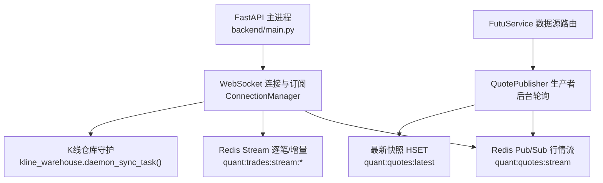
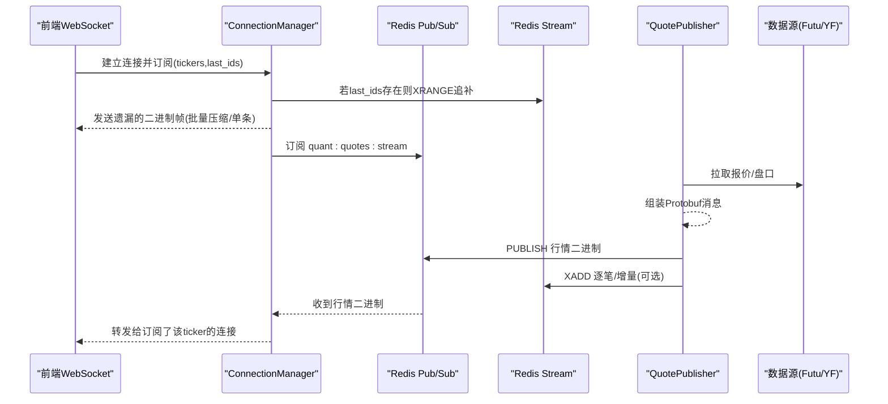
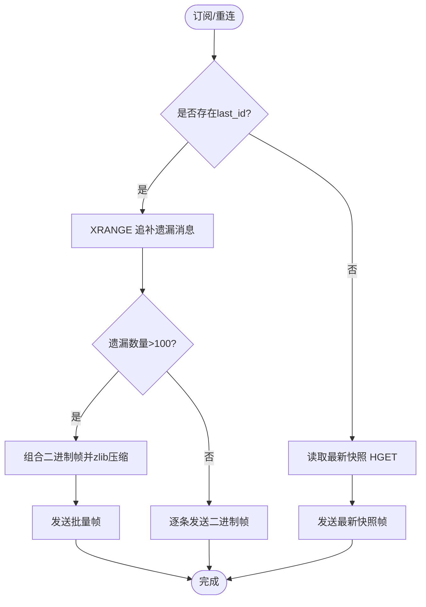
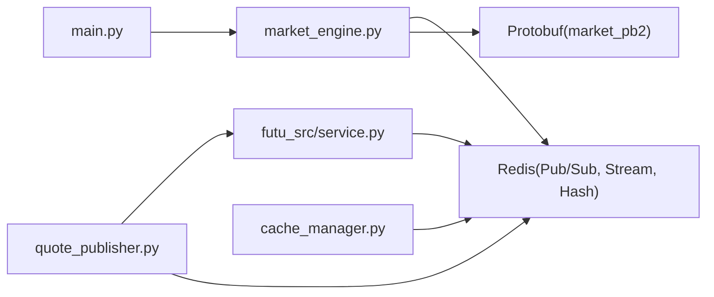

# 实时数据处理

<cite>
**本文引用的文件**
- [backend/main.py](file://backend/main.py)
- [backend/services/market_engine.py](file://backend/services/market_engine.py)
- [backend/workers/quote_publisher.py](file://backend/workers/quote_publisher.py)
- [data_subservice/futu_src/service.py](file://data_subservice/futu_src/service.py)
- [backend/core/cache_manager.py](file://backend/core/cache_manager.py)
</cite>

## 目录
1. [简介](#简介)
2. [项目结构](#项目结构)
3. [核心组件](#核心组件)
4. [架构总览](#架构总览)
5. [详细组件分析](#详细组件分析)
6. [依赖关系分析](#依赖关系分析)
7. [性能与内存管理](#性能与内存管理)
8. [数据质量、异常与容错](#数据质量异常与容错)
9. [扩展机制](#扩展机制)
10. [故障排查指南](#故障排查指南)
11. [结论](#结论)

## 简介
本文件面向 Quant Agent 的实时数据处理子系统，聚焦市场数据的实时采集、解析、标准化、分发与缓存。系统通过 WebSocket 连接管理、Redis 消息总线（Pub/Sub + Stream）、后台轮询生产者与消费者协作，实现低延迟、高吞吐的行情推送；同时提供 K 线增量更新、历史同步、完整性校验与降级兜底策略，确保在外部源不稳定时仍能提供可用数据。文档还涵盖内存管理、性能优化、扩展点设计以及数据质量监控与容错恢复机制。

## 项目结构
后端主入口负责应用装配、路由挂载与中间件注册；实时行情由 market_engine 中的 ConnectionManager 维护 WebSocket 连接与订阅，并通过 Redis Pub/Sub 将 Protobuf 序列化后的行情广播给前端；独立的 QuotePublisher 作为后台生产者，拉取外部数据源并写入 Redis；FutuService 封装富途数据源访问，支持本地/远程路由与统一接口；缓存清理工具集中保护交易态数据不被误删。

图表来源
- [backend/main.py:125-218](file://backend/main.py#L125-L218)
- [backend/services/market_engine.py:115-331](file://backend/services/market_engine.py#L115-L331)
- [backend/workers/quote_publisher.py:22-164](file://backend/workers/quote_publisher.py#L22-L164)
- [data_subservice/futu_src/service.py:31-116](file://data_subservice/futu_src/service.py#L31-L116)

章节来源
- [backend/main.py:125-218](file://backend/main.py#L125-L218)

## 核心组件
- WebSocket 连接与订阅管理：维护活跃连接、订阅集合、订阅变更同步到 Redis，供生产者动态跟随前端自选列表推送盘口。
- Redis 消息总线：使用 Pub/Sub 进行实时广播，使用 Stream 做断线追补与增量事件持久化。
- 行情生产者：后台独立轮询外部数据源，组装 Protobuf 消息，双写最新快照与实时流。
- 数据源路由：统一接入 Futu/远程节点/YFinance 等，提供一致接口与降级策略。
- K 线仓库守护：启动一次后持续同步 K 线增量与历史，支撑 K 线增量更新与历史补齐。
- 缓存清理：按前缀安全清理业务缓存，保护交易态数据。

章节来源
- [backend/services/market_engine.py:115-331](file://backend/services/market_engine.py#L115-L331)
- [backend/workers/quote_publisher.py:22-164](file://backend/workers/quote_publisher.py#L22-L164)
- [data_subservice/futu_src/service.py:31-116](file://data_subservice/futu_src/service.py#L31-L116)
- [backend/core/cache_manager.py:19-75](file://backend/core/cache_manager.py#L19-L75)

## 架构总览
实时数据从外部数据源进入系统，经 QuotePublisher 拉取并标准化为 Protobuf 消息，写入 Redis 最新快照与实时流；market_engine 的 ConnectionManager 监听该流，仅向订阅了对应标的的前端连接发送二进制帧；当客户端重连或首次订阅时，通过 Redis Stream 追补遗漏消息或拉取最新快照；K 线仓库守护任务在后台持续同步增量与历史数据，保证 K 线完整性和一致性。

图表来源
- [backend/services/market_engine.py:191-244](file://backend/services/market_engine.py#L191-L244)
- [backend/services/market_engine.py:296-331](file://backend/services/market_engine.py#L296-L331)
- [backend/workers/quote_publisher.py:90-164](file://backend/workers/quote_publisher.py#L90-L164)

## 详细组件分析

### WebSocket 连接与订阅管理（ConnectionManager）
- 职责
  - 管理活跃连接与订阅集合，统计指标（连接数、订阅数、消息发送量）。
  - 订阅变更同步到 Redis 集合，使生产者动态跟随前端自选列表推送盘口。
  - 首次订阅或重连时，基于 last_ids 通过 XRANGE 追补遗漏消息，或拉取最新快照。
  - 监听 Redis Pub/Sub，过滤并定向推送给本机订阅了相应 ticker 的连接。
  - 启动背景任务：广播循环、指标缓存刷新、资金流低频刷新、账户快照、风控预警等。
- 关键流程
  - connect/disconnect：维护连接计数与订阅映射。
  - subscribe/unsubscribe：更新订阅集合并触发 Redis 同步与追补。
  - redis_pubsub_listener：解析 Protobuf 获取 ticker，仅推送给订阅者。
  - broadcast_loop：定时刷新技术指标缓存、资金流缓存、富途快照补漏、YFinance 兜底轮询、风控报警。
- 错误处理
  - 捕获异常并记录日志，避免影响主循环；对失败标的进行退避与标记，防止请求风暴。
- 性能优化
  - 批量追补采用 zlib 压缩与自定义二进制帧格式，减少网络开销。
  - 技术面与资金流采用节流水位与退避策略，降低外部 API 压力。
  - 防封控串行调用 YFinance，避免触发 429。

图表来源
- [backend/services/market_engine.py:201-244](file://backend/services/market_engine.py#L201-L244)

章节来源
- [backend/services/market_engine.py:115-331](file://backend/services/market_engine.py#L115-L331)

### 行情生产者（QuotePublisher）
- 职责
  - 后台独立轮询外部数据源（优先富途），清洗并组装 Protobuf 消息。
  - 双写策略：写入最新快照（HSET）与发布实时流（PUBLISH）。
  - 数据质量校验：按数据源维度验证报价字段，暴露 Prometheus 指标。
- 关键流程
  - poll_and_publish：拉取报价与盘口，组装消息，写入 Redis。
  - run_daemon：动态解析前端订阅标的池（Redis 集合）与兜底常驻池，限流并发拉取。
- 错误处理
  - 超时与异常不注入假数据，避免污染行情总线；记录日志并跳过推送。
- 性能优化
  - 使用信号量限制并发，避免打满连接池或触发外部限速。
  - 释放锁后微小错峰休眠，提高吞吐。

章节来源
- [backend/workers/quote_publisher.py:22-164](file://backend/workers/quote_publisher.py#L22-L164)
- [backend/workers/quote_publisher.py:166-223](file://backend/workers/quote_publisher.py#L166-L223)

### 数据源路由（FutuService）
- 职责
  - 统一封装富途数据源访问，提供本地/远程/自动模式的路由能力。
  - 对外暴露一致的异步接口（报价、历史、盘口、资金流、期权、基本面等）。
- 关键流程
  - _route：委托给 FutuSourceRouter 编排执行，根据模式选择本地 OpenD 或远程 slave。
  - 各功能方法（get_quote/get_history/get_order_book 等）传入 action 与参数，交由对应 Handler 处理。
- 错误处理
  - 未连接或无可用远程节点时返回不可用状态；不支持的标的通过 is_futu_unsupported 快速判断。
- 集成点
  - 被 QuotePublisher 与 market_engine 的广播循环调用，作为首选数据源；失败时回退至 YFinance。

章节来源
- [data_subservice/futu_src/service.py:31-116](file://data_subservice/futu_src/service.py#L31-L116)
- [data_subservice/futu_src/service.py:126-197](file://data_subservice/futu_src/service.py#L126-L197)

### K 线仓库守护（增量更新与历史同步）
- 职责
  - 启动一次后持续同步 K 线增量与历史数据，支撑前端 K 线图展示与计算。
- 关键流程
  - ConnectionManager.start_background_tasks 中调用 kline_warehouse.daemon_sync_task()，确保只启动一次。
- 数据完整性
  - 通过守护任务周期性同步，结合 Redis Stream 的断线追补，保障 K 线连续性与一致性。
- 性能考虑
  - 守护任务独立运行，避免阻塞 WebSocket 主循环；按需增量更新，减少重复计算。

章节来源
- [backend/services/market_engine.py:160-172](file://backend/services/market_engine.py#L160-L172)

### 缓存清理（CacheManager）
- 职责
  - 按前缀模式清理业务缓存，保护交易态数据不被误删。
- 关键流程
  - clear_cache：扫描匹配前缀的 key，过滤受保护前缀后批量删除。
- 安全性
  - 受保护前缀包括 OMS 活动订单、状态、持仓等，确保实盘状态不受影响。

章节来源
- [backend/core/cache_manager.py:19-75](file://backend/core/cache_manager.py#L19-L75)

## 依赖关系分析
- 主进程（main.py）装配 FastAPI 应用，挂载路由与中间件，初始化可观测性与日志。
- market_engine 的 ConnectionManager 依赖 Redis（Pub/Sub、Stream、Hash）与 Protobuf 模型，协调前端连接与数据总线。
- QuotePublisher 依赖数据源路由（FutuService）与 Redis，负责生产行情消息。
- FutuService 封装富途 SDK 与路由逻辑，提供统一接口供上层调用。
- CacheManager 提供安全的缓存清理能力，保护交易态数据。

图表来源
- [backend/main.py:125-218](file://backend/main.py#L125-L218)
- [backend/services/market_engine.py:115-331](file://backend/services/market_engine.py#L115-L331)
- [backend/workers/quote_publisher.py:22-164](file://backend/workers/quote_publisher.py#L22-L164)
- [data_subservice/futu_src/service.py:31-116](file://data_subservice/futu_src/service.py#L31-L116)
- [backend/core/cache_manager.py:19-75](file://backend/core/cache_manager.py#L19-L75)

章节来源
- [backend/main.py:125-218](file://backend/main.py#L125-L218)
- [backend/services/market_engine.py:115-331](file://backend/services/market_engine.py#L115-L331)
- [backend/workers/quote_publisher.py:22-164](file://backend/workers/quote_publisher.py#L22-L164)
- [data_subservice/futu_src/service.py:31-116](file://data_subservice/futu_src/service.py#L31-L116)
- [backend/core/cache_manager.py:19-75](file://backend/core/cache_manager.py#L19-L75)

## 性能与内存管理
- 二进制帧与压缩
  - 批量追补超过阈值时，组合二进制帧并使用 zlib 压缩，显著降低网络带宽占用。
- 节流与退避
  - 技术指标与资金流采用节流水位与退避间隔，避免高频全量刷新导致外部 API 被封禁。
  - YFinance 兜底串行调用，防止 429 封 IP。
- 并发控制
  - QuotePublisher 使用信号量限制并发拉取，避免打满连接池。
- 内存回收
  - 及时释放大对象与任务组引用，防止休眠期内成为幽灵内存。
  - 清理不在监控列表中的缓存条目，避免内存泄漏。
- 指标埋点
  - 记录行情延迟、陈旧度、总量、连接数、订阅数、消息发送量等，便于性能分析与告警。

章节来源
- [backend/services/market_engine.py:332-601](file://backend/services/market_engine.py#L332-L601)
- [backend/workers/quote_publisher.py:166-223](file://backend/workers/quote_publisher.py#L166-L223)

## 数据质量、异常与容错
- 数据质量校验
  - 生产者对报价字段进行基础校验，并按数据源维度暴露质量指标。
- 异常检测与降级
  - 富途不可用时自动降级至 YFinance；失败标的动态标记为不支持，后续循环跳过。
  - 风控预警：监控宽基指数主力资金流出，达到阈值时发出分布式防抖报警。
- 容错恢复
  - Redis Stream 用于断线追补，确保客户端重连后能补齐遗漏消息。
  - 最新快照 HSET 用于首开页面瞬间获取当前盘口，提升用户体验。
- 安全清理
  - 缓存清理工具保护交易态数据，避免误删导致实盘状态丢失。

章节来源
- [backend/workers/quote_publisher.py:90-164](file://backend/workers/quote_publisher.py#L90-L164)
- [backend/services/market_engine.py:470-491](file://backend/services/market_engine.py#L470-L491)
- [backend/core/cache_manager.py:19-75](file://backend/core/cache_manager.py#L19-L75)

## 扩展机制
- 新增数据类型
  - 在 QuotePublisher 中扩展拉取逻辑，组装新的 Protobuf 消息并写入 Redis 流。
  - 在 ConnectionManager 的广播循环中添加对应的处理分支，解析并分发新类型。
- 新增处理逻辑
  - 通过 data_source_router 注册新的数据源适配器，保持统一接口。
  - 在 market_engine 的背景任务中加入新的节流水位与退避策略，避免请求风暴。
- 数据质量与监控
  - 为新数据类型添加质量校验规则与指标埋点，便于监控与告警。
- 缓存策略
  - 根据需要设置缓存键与前缀，使用 CacheManager 进行安全清理。

章节来源
- [backend/workers/quote_publisher.py:22-164](file://backend/workers/quote_publisher.py#L22-L164)
- [backend/services/market_engine.py:332-601](file://backend/services/market_engine.py#L332-L601)
- [backend/core/cache_manager.py:19-75](file://backend/core/cache_manager.py#L19-L75)

## 故障排查指南
- 行情不更新
  - 检查 Redis Pub/Sub 是否正常工作，确认 ConnectionManager 已订阅流。
  - 查看 QuotePublisher 是否成功拉取数据并写入 Redis。
  - 检查数据源路由是否可用，富途/远程节点是否在线。
- 客户端重连丢数据
  - 确认 last_ids 是否正确传递，Redis Stream 是否保留足够历史。
  - 检查批量追补逻辑是否生效，二进制帧是否成功发送。
- 外部 API 被封禁
  - 检查节流与退避策略是否生效，避免高频请求。
  - 观察 YFinance 兜底是否启用，串行调用是否生效。
- 缓存误删风险
  - 使用 CacheManager 清理缓存，确保不会误删交易态数据。

章节来源
- [backend/services/market_engine.py:191-244](file://backend/services/market_engine.py#L191-L244)
- [backend/workers/quote_publisher.py:90-164](file://backend/workers/quote_publisher.py#L90-L164)
- [backend/core/cache_manager.py:19-75](file://backend/core/cache_manager.py#L19-L75)

## 结论
Quant Agent 的实时数据处理系统通过 WebSocket、Redis 消息总线与后台生产者协作，实现了高效、可靠的市场数据采集与分发。系统在数据质量、异常检测、容错恢复与性能优化方面具备完善机制，支持 K 线增量更新与历史同步，并提供安全的缓存清理能力。通过统一的扩展机制，可以便捷地添加新的数据类型与处理逻辑，满足不断变化的业务需求。