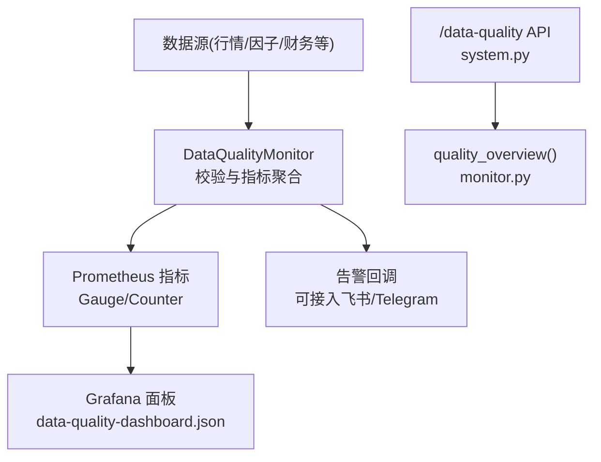
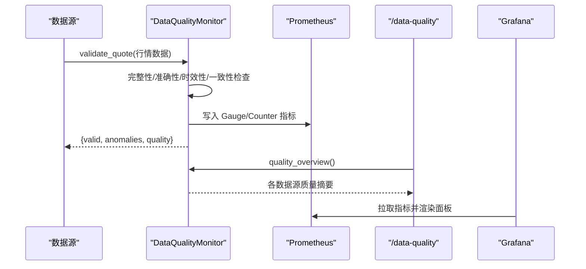
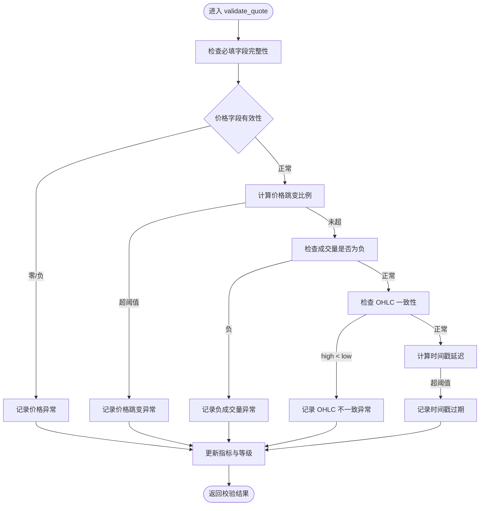
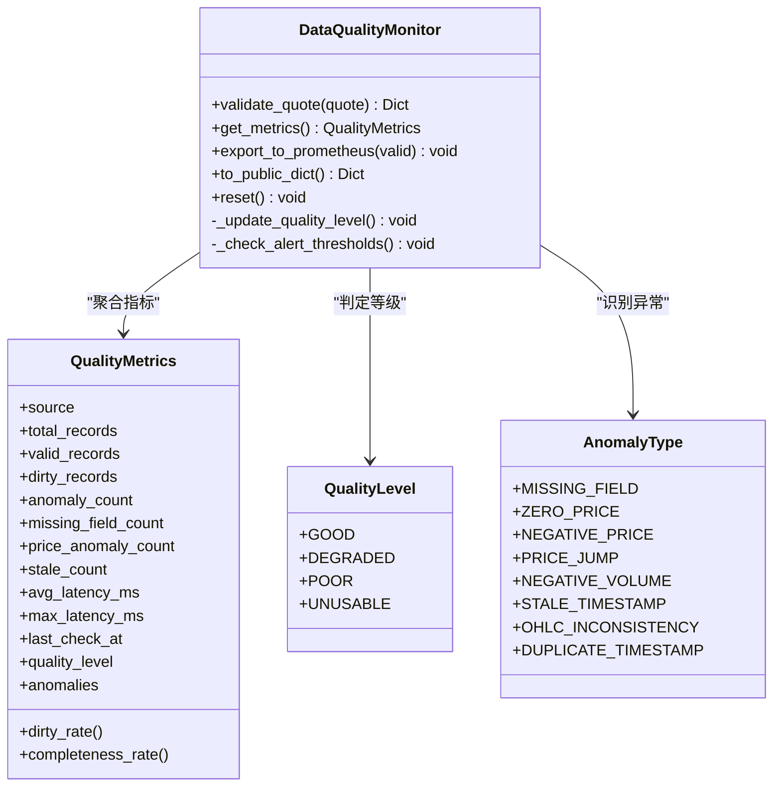
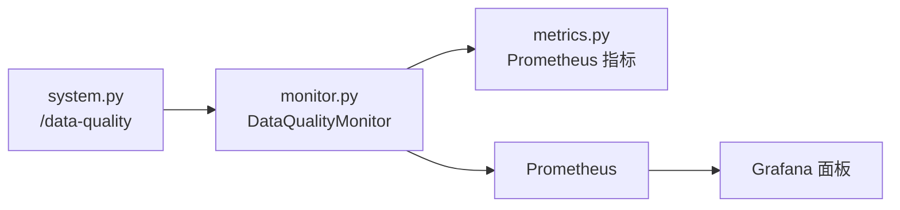

# 数据质量监控

<cite>
**本文引用的文件**
- [backend/services/data_quality/monitor.py](file://backend/services/data_quality/monitor.py)
- [backend/core/metrics.py](file://backend/core/metrics.py)
- [backend/routers/system.py](file://backend/routers/system.py)
- [grafana/provisioning/dashboards/data-quality-dashboard.json](file://grafana/provisioning/dashboards/data-quality-dashboard.json)
- [backend/tests/test_data_quality_monitor_svc04.py](file://backend/tests/test_data_quality_monitor_svc04.py)
</cite>

## 目录
1. [简介](#简介)
2. [项目结构](#项目结构)
3. [核心组件](#核心组件)
4. [架构总览](#架构总览)
5. [详细组件分析](#详细组件分析)
6. [依赖关系分析](#依赖关系分析)
7. [性能考量](#性能考量)
8. [故障排查指南](#故障排查指南)
9. [结论](#结论)
10. [附录](#附录)

## 简介
本文件面向 Quant Agent 的数据质量监控系统，系统性阐述评估指标体系、实时监控机制、规则配置与管理、报告与趋势分析、以及可视化与历史追溯。系统围绕完整性检查、准确性验证、时效性监控、一致性校验四大维度构建，通过进程内监控器聚合指标并暴露至 Prometheus，配合 Grafana 面板实现可视化与告警联动。

## 项目结构
数据质量监控相关代码主要分布在以下位置：
- 服务层：backend/services/data_quality/monitor.py（监控引擎、指标计算、告警触发）
- 指标定义：backend/core/metrics.py（Prometheus Gauge/Counter 定义）
- 接口层：backend/routers/system.py（/data-quality 汇总接口）
- 可视化：grafana/provisioning/dashboards/data-quality-dashboard.json（Grafana 面板）
- 测试：backend/tests/test_data_quality_monitor_svc04.py（覆盖关键路径）

图表来源
- [backend/services/data_quality/monitor.py:91-350](file://backend/services/data_quality/monitor.py#L91-L350)
- [backend/core/metrics.py:386-444](file://backend/core/metrics.py#L386-L444)
- [backend/routers/system.py:138-161](file://backend/routers/system.py#L138-L161)
- [grafana/provisioning/dashboards/data-quality-dashboard.json:1-200](file://grafana/provisioning/dashboards/data-quality-dashboard.json#L1-L200)

章节来源
- [backend/services/data_quality/monitor.py:1-408](file://backend/services/data_quality/monitor.py#L1-L408)
- [backend/core/metrics.py:380-444](file://backend/core/metrics.py#L380-L444)
- [backend/routers/system.py:138-161](file://backend/routers/system.py#L138-L161)
- [grafana/provisioning/dashboards/data-quality-dashboard.json:1-200](file://grafana/provisioning/dashboards/data-quality-dashboard.json#L1-L200)

## 核心组件
- 质量等级与异常类型枚举：定义 GOOD/DEGRADED/POOR/UNUSABLE 等级及缺失字段、零价、负价、价格跳变、负成交量、时间戳过期、OHLC 不一致、重复时间戳等异常类型。
- 质量指标模型：按数据源维度聚合总记录数、有效记录数、脏记录数、异常计数、缺失字段次数、价格异常次数、过期次数、平均/最大延迟、最后检查时间、质量等级与最近异常列表。
- 监控器 DataQualityMonitor：单条行情数据的实时校验入口，执行完整性、准确性、时效性、一致性检查，更新指标并输出到 Prometheus，支持告警回调。
- 全局注册表与概览：按数据源维护监控器实例，提供 quality_overview() 用于 API 与自检。

章节来源
- [backend/services/data_quality/monitor.py:26-64](file://backend/services/data_quality/monitor.py#L26-L64)
- [backend/services/data_quality/monitor.py:91-110](file://backend/services/data_quality/monitor.py#L91-L110)
- [backend/services/data_quality/monitor.py:384-408](file://backend/services/data_quality/monitor.py#L384-L408)

## 架构总览
数据从数据源进入后，由 DataQualityMonitor 对每条数据进行多维度校验，累计指标并通过 export_to_prometheus 写入 Prometheus；Grafana 订阅这些指标进行可视化展示；当指标超过阈值时，触发告警回调（可扩展为飞书/Telegram）。同时，/data-quality 接口提供当前各数据源的质量概览。

图表来源
- [backend/services/data_quality/monitor.py:112-256](file://backend/services/data_quality/monitor.py#L112-L256)
- [backend/services/data_quality/monitor.py:315-350](file://backend/services/data_quality/monitor.py#L315-L350)
- [backend/routers/system.py:138-161](file://backend/routers/system.py#L138-L161)
- [backend/core/metrics.py:386-444](file://backend/core/metrics.py#L386-L444)

## 详细组件分析

### 数据质量评估指标体系
- 完整性检查：校验 OHLCV 必填字段是否齐全且非空，统计缺失字段次数。
- 准确性验证：检测零价、负价、负成交量、价格跳变（相对上次收盘价超过阈值），统计价格异常次数。
- 时效性监控：基于 timestamp/ts 计算延迟毫秒，统计平均/最大延迟与过期次数。
- 一致性校验：校验 OHLC 逻辑（如 high < low），标记为严重异常。
- 质量等级：根据脏数据率与连续过期次数动态判定 GOOD/DEGRADED/POOR/UNUSABLE。

图表来源
- [backend/services/data_quality/monitor.py:112-256](file://backend/services/data_quality/monitor.py#L112-L256)

章节来源
- [backend/services/data_quality/monitor.py:84-89](file://backend/services/data_quality/monitor.py#L84-L89)
- [backend/services/data_quality/monitor.py:126-241](file://backend/services/data_quality/monitor.py#L126-L241)
- [backend/services/data_quality/monitor.py:258-295](file://backend/services/data_quality/monitor.py#L258-L295)

### 实时监控机制
- 数据流监控：每条行情数据进入 validate_quote，逐条更新 total_records、valid_records、dirty_records、anomaly_count 等。
- 异常检测：内置多种异常类型检测，记录到 anomalies 列表并限制保留最近若干条。
- 告警触发：当脏数据率或连续过期次数超过阈值，调用告警回调（可对接飞书/Telegram）。
- 指标导出：export_to_prometheus 将脏数据率、完整率、总记录数、异常计数、缺失字段次数、价格异常次数、过期次数、平均延迟、质量等级、校验次数写入 Prometheus。

图表来源
- [backend/services/data_quality/monitor.py:26-64](file://backend/services/data_quality/monitor.py#L26-L64)
- [backend/services/data_quality/monitor.py:91-377](file://backend/services/data_quality/monitor.py#L91-L377)

章节来源
- [backend/services/data_quality/monitor.py:112-350](file://backend/services/data_quality/monitor.py#L112-L350)
- [backend/core/metrics.py:386-444](file://backend/core/metrics.py#L386-L444)

### 数据质量规则的配置与管理
- 规则常量：REQUIRED_FIELDS、MAX_PRICE_JUMP_PCT、STALE_THRESHOLD_SECONDS、ALERT_DIRTY_RATE_THRESHOLD、ALERT_STALE_COUNT_THRESHOLD。
- 动态更新：可通过修改上述常量实现规则调整；如需运行时热更新，可在外部注入新阈值并重新初始化监控器或扩展配置加载逻辑。
- 优先级：校验顺序为完整性→价格准确性→成交量→OHLC一致性→时效性；严重异常（如 OHLC 不一致、零/负价）优先于一般异常。
- 依赖关系：价格跳变依赖上一时刻收盘价；时间戳新鲜度依赖系统时间与数据时间戳；告警阈值依赖脏数据率与连续过期次数。

章节来源
- [backend/services/data_quality/monitor.py:84-89](file://backend/services/data_quality/monitor.py#L84-L89)
- [backend/services/data_quality/monitor.py:156-176](file://backend/services/data_quality/monitor.py#L156-L176)
- [backend/services/data_quality/monitor.py:205-231](file://backend/services/data_quality/monitor.py#L205-L231)
- [backend/services/data_quality/monitor.py:270-295](file://backend/services/data_quality/monitor.py#L270-L295)

### 报告生成、趋势分析与问题定位
- 报告接口：/data-quality 返回各数据源的脏数据率、完整率、异常计数、过期计数、质量等级与最近异常摘要。
- 趋势分析：Grafana 面板订阅 quant_data_quality_dirty_rate、quant_data_quality_completeness_rate、quant_data_quality_price_anomaly_count、quant_data_quality_stale_count 等指标，支持多数据源对比与阈值可视化。
- 问题定位：通过 anomalies 列表中的 type、ticker、field、value、severity 等字段快速定位异常来源与原因；结合延迟指标与过期计数判断数据源健康状态。

章节来源
- [backend/routers/system.py:138-161](file://backend/routers/system.py#L138-L161)
- [grafana/provisioning/dashboards/data-quality-dashboard.json:1-200](file://grafana/provisioning/dashboards/data-quality-dashboard.json#L1-L200)
- [backend/services/data_quality/monitor.py:352-370](file://backend/services/data_quality/monitor.py#L352-L370)

### 自动修复机制说明
当前仓库未包含自动修复（清洗、填充、异常值处理）的实现。建议在数据写入下游前增加修复管线，例如：
- 缺失值填充：使用前一时刻有效值或插值方法填充缺失的 OHLCV 字段。
- 异常值处理：对价格跳变采用平滑或回退策略；对负成交量置零或剔除。
- 数据清洗：在入库前统一执行校验与修复，确保下游分析使用干净数据。
该部分可作为后续增强项引入，与现有监控指标联动，形成“检测—告警—修复”闭环。

[本节为概念性内容，不直接分析具体文件]

### 可视化展示、历史追溯与性能影响评估
- 可视化：Grafana 面板已配置脏数据率、完整率、质量等级、异常分类与延迟等指标，支持阈值着色与多数据源对比。
- 历史追溯：Prometheus 存储时序指标，可回溯任意时间段的数据质量变化；/data-quality 接口提供当前快照。
- 性能影响：validate_quote 为轻量 CPU 操作，指标写入 Prometheus 为异步 I/O；建议在高吞吐场景下评估批量写入与采样频率，避免对主链路造成阻塞。

章节来源
- [grafana/provisioning/dashboards/data-quality-dashboard.json:1-200](file://grafana/provisioning/dashboards/data-quality-dashboard.json#L1-L200)
- [backend/services/data_quality/monitor.py:315-350](file://backend/services/data_quality/monitor.py#L315-L350)

## 依赖关系分析
- 模块耦合：DataQualityMonitor 依赖 core.metrics 定义的 Prometheus 指标；routers.system 通过 quality_overview 聚合各监控器状态。
- 外部依赖：Prometheus 作为指标存储与查询后端；Grafana 作为可视化前端；告警回调可扩展至飞书/Telegram。
- 循环依赖：无直接循环导入；监控器与指标模块解耦良好。

图表来源
- [backend/services/data_quality/monitor.py:315-350](file://backend/services/data_quality/monitor.py#L315-L350)
- [backend/core/metrics.py:386-444](file://backend/core/metrics.py#L386-L444)
- [backend/routers/system.py:138-161](file://backend/routers/system.py#L138-L161)

章节来源
- [backend/services/data_quality/monitor.py:315-350](file://backend/services/data_quality/monitor.py#L315-L350)
- [backend/core/metrics.py:386-444](file://backend/core/metrics.py#L386-L444)
- [backend/routers/system.py:138-161](file://backend/routers/system.py#L138-L161)

## 性能考量
- 校验开销：每条记录的校验为常数级复杂度，内存占用主要为 last_prices 缓存与 anomalies 列表（限制长度）。
- 指标写入：Prometheus 写入为轻量操作，建议合理设置采集间隔与批量化策略。
- 高吞吐优化：可考虑在数据入湖前进行批量校验与修复，减少在线路径压力；对高频数据源启用采样或降采样策略。
- 资源隔离：监控器按数据源维度独立，便于横向扩展与故障隔离。

[本节提供通用指导，不直接分析具体文件]

## 故障排查指南
- 脏数据率升高：检查缺失字段、价格异常与 OHLC 一致性；确认数据源上游是否异常。
- 时间戳过期增多：核对数据源时钟与系统时间同步；检查网络延迟与采集链路。
- 告警频繁触发：调整 ALERT_DIRTY_RATE_THRESHOLD 与 ALERT_STALE_COUNT_THRESHOLD；确认业务波动是否属于预期范围。
- 指标未更新：确认 export_to_prometheus 是否被调用；检查 Prometheus 抓取配置与 Grafana 数据源连通性。

章节来源
- [backend/services/data_quality/monitor.py:270-295](file://backend/services/data_quality/monitor.py#L270-L295)
- [backend/services/data_quality/monitor.py:315-350](file://backend/services/data_quality/monitor.py#L315-L350)
- [backend/routers/system.py:138-161](file://backend/routers/system.py#L138-L161)

## 结论
Quant Agent 的数据质量监控系统以简洁可靠的进程内监控器为核心，覆盖完整性、准确性、时效性与一致性四大维度，并通过 Prometheus 与 Grafana 实现可视化与告警联动。当前版本聚焦于检测与观测，未来可引入自动修复能力，形成完整的“检测—告警—修复”闭环，进一步提升数据可靠性与运维效率。

[本节为总结性内容，不直接分析具体文件]

## 附录
- 单元测试覆盖：test_data_quality_monitor_svc04.py 验证了字段完整性、价格异常、OHLC 一致性、时间戳新鲜度、质量等级与告警回调等关键路径。
- 指标命名规范：所有数据质量指标均以 quant_data_quality_ 前缀命名，便于统一管理与检索。
- 面板配置：data-quality-dashboard.json 提供了脏数据率、完整率、质量等级、异常分类与延迟等可视化模板，可直接部署使用。

章节来源
- [backend/tests/test_data_quality_monitor_svc04.py:1-200](file://backend/tests/test_data_quality_monitor_svc04.py#L1-L200)
- [backend/core/metrics.py:386-444](file://backend/core/metrics.py#L386-L444)
- [grafana/provisioning/dashboards/data-quality-dashboard.json:1-200](file://grafana/provisioning/dashboards/data-quality-dashboard.json#L1-L200)
