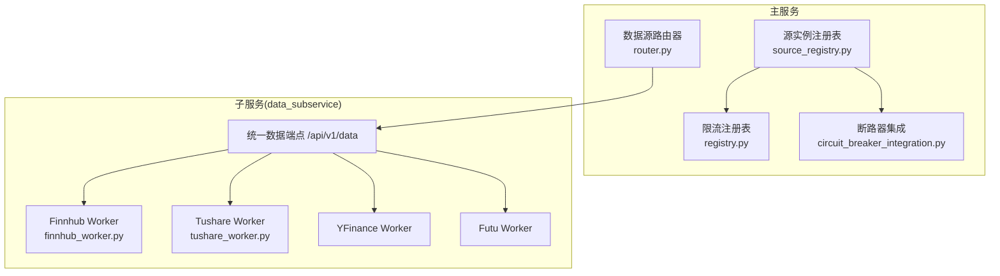
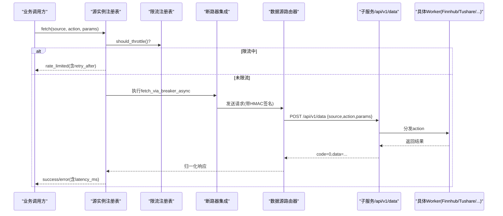
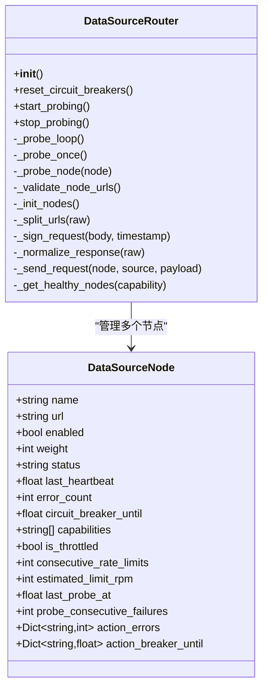
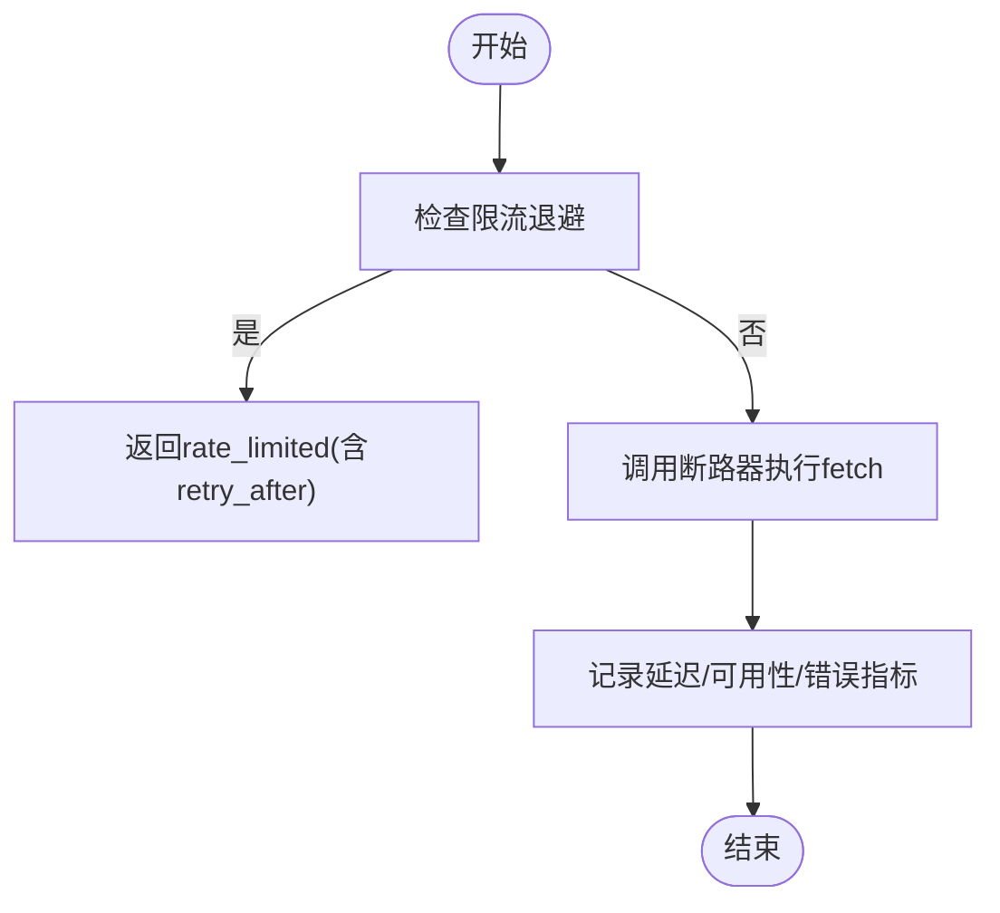
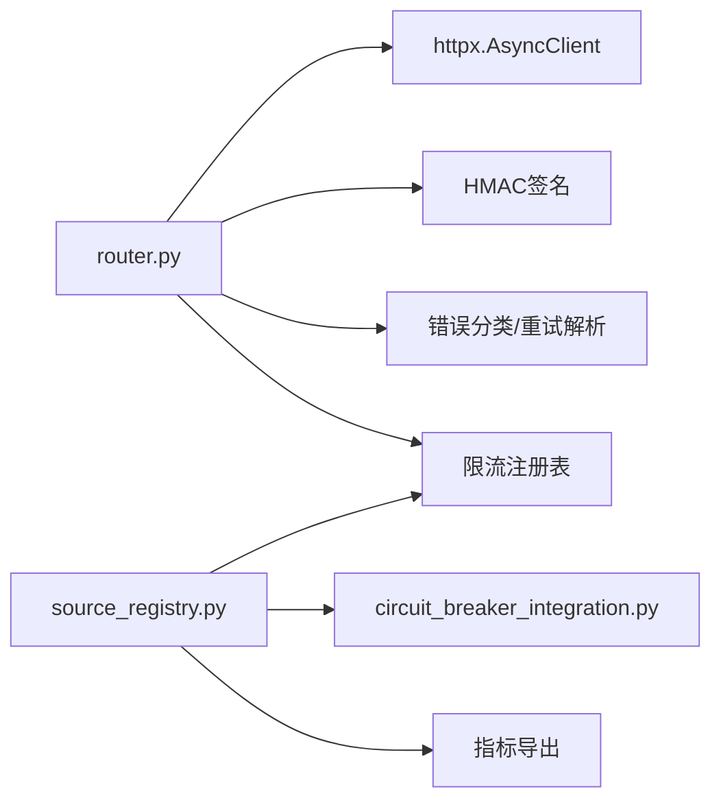
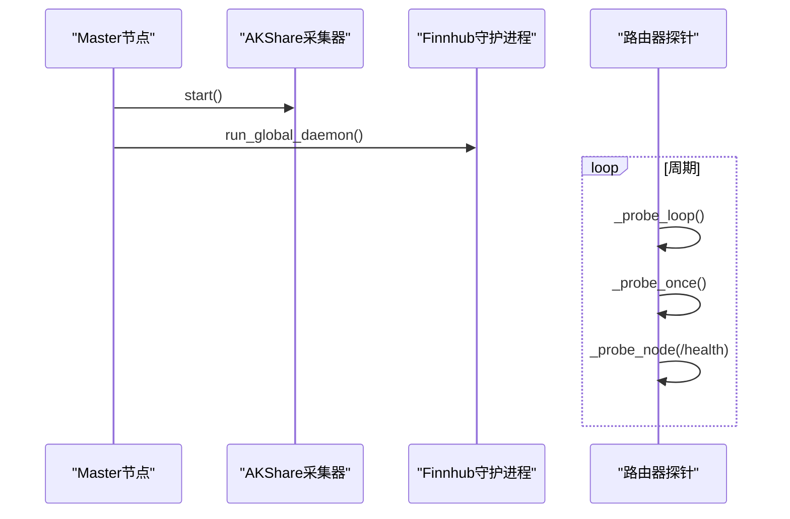

# 数据采集管道

<cite>
**本文引用的文件**
- [backend/services/datasource/router.py](file://backend/services/datasource/router.py)
- [backend/services/datasource/registry.py](file://backend/services/datasource/registry.py)
- [backend/services/datasource/source_registry.py](file://backend/services/datasource/source_registry.py)
- [backend/workers/collectors/akshare.py](file://backend/workers/collectors/akshare.py)
- [backend/workers/collectors/finnhub.py](file://backend/workers/collectors/finnhub.py)
- [backend/services/datasource/throttler.py](file://backend/services/datasource/throttler.py)
- [backend/core/circuit_breaker.py](file://backend/core/circuit_breaker.py)
- [backend/core/circuit_breaker_integration.py](file://backend/core/circuit_breaker_integration.py)
- [data_subservice/_internal/finnhub/__init__.py](file://data_subservice/_internal/finnhub/__init__.py)
- [data_subservice/_internal/tushare/service.py](file://data_subservice/_internal/tushare/service.py)
- [data_subservice/finnhub_worker.py](file://data_subservice/finnhub_worker.py)
- [data_subservice/tushare_worker.py](file://data_subservice/tushare_worker.py)
</cite>

## 目录
1. [简介](#简介)
2. [项目结构](#项目结构)
3. [核心组件](#核心组件)
4. [架构总览](#架构总览)
5. [详细组件分析](#详细组件分析)
6. [依赖关系分析](#依赖关系分析)
7. [性能与限流](#性能与限流)
8. [故障转移与熔断](#故障转移与熔断)
9. [守护进程与后台任务](#守护进程与后台任务)
10. [新数据源接入指南](#新数据源接入指南)
11. [质量监控与指标](#质量监控与指标)
12. [排错指南](#排错指南)
13. [结论](#结论)

## 简介
本文件面向 Quant Agent 的数据采集管道，系统性说明市场数据的统一接入、调度、路由、限流、熔断与自愈机制，覆盖 Finnhub、AKShare、Tushare、YFinance、Futu、FMP、宏观数据等数据源的集中治理。文档同时给出守护进程（新闻轮询、财报监控、内幕交易跟踪）的设计要点，以及新增数据源的适配器规范与标准化流程。

## 项目结构
- 主服务侧负责：
  - 数据源路由器：将请求按能力映射到远程子服务节点，实现多活、负载均衡与故障转移。
  - 注册表与限流：维护数据源实例与全局限流状态，统计指标并驱动退避。
  - 熔断集成：通过断路器保护下游，避免雪崩。
- 子服务侧（data_subservice）负责：
  - 各数据源的具体连接与采集（如 Finnhub REST/WS、Tushare、YFinance、Futu OpenD、宏观源）。
  - 对外暴露统一数据端点 /api/v1/data，供主服务路由调用。
- 采集器工厂（workers/collectors）：
  - 启动特定采集守护进程（如 AKShare Redis 中继、Finnhub 全局守护），由节点类型控制是否启用。

**图表来源**
- [backend/services/datasource/router.py:58-159](file://backend/services/datasource/router.py#L58-L159)
- [backend/services/datasource/source_registry.py:140-255](file://backend/services/datasource/source_registry.py#L140-L255)
- [data_subservice/finnhub_worker.py](file://data_subservice/finnhub_worker.py)
- [data_subservice/tushare_worker.py](file://data_subservice/tushare_worker.py)

**章节来源**
- [backend/services/datasource/router.py:1-159](file://backend/services/datasource/router.py#L1-L159)
- [backend/services/datasource/source_registry.py:1-259](file://backend/services/datasource/source_registry.py#L1-L259)

## 核心组件
- 数据源路由器（DataSourceRouter）
  - 维护多个远程节点（yf_primary/yf_backup_*/akshare_remote/tushare_remote/futu_master/fmp_master/finnhub_master/fred_master/dbnomics_master/rbi_master/search_master）。
  - 提供 action 映射（如 FINANCIALS、INSIDER_TRADING、ECONOMIC_CALENDAR 等），将主服务内部 fetch_type 归一为子服务 action。
  - 支持 HMAC 签名校验、健康探针、半开自愈、动作级熔断隔离、限流压力感知。
- 源实例注册表（DataSourceRegistry）
  - 管理 DataSourceInterface 实例，提供按名称与能力过滤的获取与 fetch 路径。
  - 与限流注册表联动，记录成功/失败/限流指标，驱动 Prometheus 指标导出。
- 限流注册表（RateLimitRegistry）
  - 每个数据源名称对应 Throttler + Analyzer，线程安全地管理限流状态与分析统计。
- 断路器集成（CircuitBreakerIntegration）
  - 在注册表 fetch 路径中包装调用，对异常或错误分类进行熔断保护，支持豁免动作集。

**章节来源**
- [backend/services/datasource/router.py:222-579](file://backend/services/datasource/router.py#L222-L579)
- [backend/services/datasource/source_registry.py:41-259](file://backend/services/datasource/source_registry.py#L41-L259)
- [backend/services/datasource/registry.py:18-99](file://backend/services/datasource/registry.py#L18-L99)
- [backend/core/circuit_breaker_integration.py](file://backend/core/circuit_breaker_integration.py)

## 架构总览
主服务通过数据源路由器将业务请求转发至子服务的统一数据端点，子服务根据 source/action 分发给具体 worker（Finnhub/Tushare/YFinance/Futu/宏观等）。路由器具备多活节点、负载均衡、限流压力感知、动作级熔断与健康探针自愈；注册表负责限流与指标统计；断路器保护关键通道不被误杀。

**图表来源**
- [backend/services/datasource/source_registry.py:140-255](file://backend/services/datasource/source_registry.py#L140-L255)
- [backend/services/datasource/router.py:669-748](file://backend/services/datasource/router.py#L669-L748)

## 详细组件分析

### 数据源路由器（DataSourceRouter）
- 节点初始化与能力声明
  - 从环境变量读取各远程 URL（支持逗号分隔多活），构造 DataSourceNode，声明 capabilities（如 yfinance、akshare、tushare、futu、finnhub、macro 系列）。
- Action 映射
  - 针对 YFinance、Tushare、Futu、Finnhub 分别定义内部 fetch_type 到子服务 action 的映射，确保请求语义一致。
- 请求发送与响应归一化
  - 使用 httpx 异步客户端，携带 X-Timestamp/X-Signature 进行 HMAC-SHA256 签名。
  - 将子服务 {"code":0,"data":...} 响应归一为主服务风格 {"status":"success","data":...}，并透传 error_category。
- 健康探针与自愈
  - 后台任务周期性探测 unhealthy 或处于熔断冷却期的节点，调用 /health 或轻量 PING，成功则复位 healthy。
- 动作级熔断隔离
  - 每个节点的每个 action 独立计数连续普通失败，达到阈值仅熔断该 action，避免整节点误杀。
  - 节点级兜底阈值动态计算：max(下限, ceil(capabilities规模×比例))，适配不同节点能力规模。
- 限流压力感知
  - 节点标记 is_throttled、consecutive_rate_limits、estimated_limit_rpm，影响选择优先级。

**图表来源**
- [backend/services/datasource/router.py:222-579](file://backend/services/datasource/router.py#L222-L579)
- [backend/services/datasource/router.py:669-748](file://backend/services/datasource/router.py#L669-L748)

**章节来源**
- [backend/services/datasource/router.py:1-159](file://backend/services/datasource/router.py#L1-L159)
- [backend/services/datasource/router.py:222-579](file://backend/services/datasource/router.py#L222-L579)
- [backend/services/datasource/router.py:669-748](file://backend/services/datasource/router.py#L669-L748)

### 源实例注册表与限流注册表
- 源实例注册表（DataSourceRegistry）
  - 注册 DataSourceInterface 实例，支持同名多实例；按名称与 capability 严格匹配获取。
  - fetch 路径：先检查限流退避，再经断路器执行，最后记录指标（延迟、可用性、错误类别）。
  - 豁免动作集：对 Futu 扩展行情类动作不污染全局熔断，避免误杀核心通道。
- 限流注册表（RateLimitRegistry）
  - 每个数据源名称对应 Throttler + Analyzer，线程安全；提供 get_or_create/get_throttler/get_analyzer/list_names/reset_all/clear 等方法。
  - 用于在主路径快速判断是否应退避，避免加剧限流。

**图表来源**
- [backend/services/datasource/source_registry.py:140-255](file://backend/services/datasource/source_registry.py#L140-L255)
- [backend/services/datasource/registry.py:18-99](file://backend/services/datasource/registry.py#L18-L99)

**章节来源**
- [backend/services/datasource/source_registry.py:41-259](file://backend/services/datasource/source_registry.py#L41-L259)
- [backend/services/datasource/registry.py:18-99](file://backend/services/datasource/registry.py#L18-L99)

### 子服务与数据源适配器
- Finnhub
  - 子服务层包含 Finnhub 连接与 WS tick 订阅，主服务通过 router 调用 source=finnhub。
  - 子服务 worker 处理公司消息、市场消息、财报、经济日历、内幕交易等 action。
- Tushare
  - 子服务 service 提供财务、股东、资金流向、股票历史/报价、基本面、列表、低频历史、宏观等能力。
  - 主服务通过 _TS_ACTION_MAP 映射 action，远程不可实现的 action 会降级本地适配器以避免无效请求。
- YFinance
  - 纯 yfinance 子服务节点（US-YF-A/B）承担全部 YFinance 流量，主服务不再本地执行。
  - 节点限流时自动 failover 至备用/远程 yfinance 节点。

**章节来源**
- [data_subservice/_internal/finnhub/__init__.py](file://data_subservice/_internal/finnhub/__init__.py)
- [data_subservice/_internal/tushare/service.py](file://data_subservice/_internal/tushare/service.py)
- [backend/services/datasource/router.py:61-140](file://backend/services/datasource/router.py#L61-L140)

## 依赖关系分析
- 路由器依赖：
  - HTTP 客户端（httpx）、HMAC 签名、错误分类与重试时间解析、离线模式、限流注册表。
  - 环境变量配置（DATA_SOURCE_ROUTER_ENABLED、*_REMOTE_URL、DATA_SOURCE_HMAC_SECRET）。
- 注册表依赖：
  - 断路器集成、限流注册表、指标导出（Prometheus）。
- 子服务依赖：
  - 各数据源 SDK/REST/WS 客户端，worker 分发逻辑。

**图表来源**
- [backend/services/datasource/router.py:42-56](file://backend/services/datasource/router.py#L42-L56)
- [backend/services/datasource/source_registry.py:16-23](file://backend/services/datasource/source_registry.py#L16-L23)

**章节来源**
- [backend/services/datasource/router.py:42-56](file://backend/services/datasource/router.py#L42-L56)
- [backend/services/datasource/source_registry.py:16-23](file://backend/services/datasource/source_registry.py#L16-L23)

## 性能与限流
- 限流策略
  - 基于 RateLimitRegistry 的 Throttler + Analyzer，按数据源名称维度管理退避与分析。
  - 注册表在 fetch 前检查 should_throttle，若处于退避期直接返回 rate_limited，避免加剧限流。
- 指标收集
  - 成功/失败/限流三类事件均记录 latency_ms，并导出 DATASOURCE_LATENCY/DATASOURCE_RATE_LIMITS/DATASOURCE_ERRORS/DATASOURCE_AVAILABILITY。
- 性能优化建议
  - 合理设置子服务并发与连接池（路由器已配置 max_connections=20）。
  - 利用动作级熔断隔离，减少无关 action 对核心通道的干扰。
  - 健康探针周期可调（DATASOURCE_PROBE_INTERVAL），平衡恢复速度与探测开销。

**章节来源**
- [backend/services/datasource/registry.py:18-99](file://backend/services/datasource/registry.py#L18-L99)
- [backend/services/datasource/source_registry.py:140-255](file://backend/services/datasource/source_registry.py#L140-L255)
- [backend/services/datasource/router.py:662-667](file://backend/services/datasource/router.py#L662-L667)

## 故障转移与熔断
- 负载均衡与故障转移
  - 多活节点：YFinance 主备节点（逗号分隔 URL），按权重与限流压力选择。
  - 单点节点：AKShare/Tushare 北京节点（当前拓扑为单点），需关注单点风险。
  - 能力匹配：仅选择声明了所需 capability 的健康节点。
- 熔断机制
  - 动作级熔断：每 action 独立计数连续普通失败，达到阈值仅熔断该 action。
  - 节点级兜底：当熔断 action 数达到动态阈值（min_threshold 或 capabilities×ratio），判定进程级故障。
  - 豁免动作：Futu 扩展行情类动作不污染全局熔断，避免误杀 QUOTE/HEALTH 等核心通道。
- 自愈与探针
  - 后台探针周期性探测 unhealthy 或熔断冷却中的节点，调用 /health 成功则复位 healthy。
  - 部署重置：进程启动时清空所有节点熔断残留，防止历史状态污染。

**章节来源**
- [backend/services/datasource/router.py:150-175](file://backend/services/datasource/router.py#L150-L175)
- [backend/services/datasource/router.py:310-410](file://backend/services/datasource/router.py#L310-L410)
- [backend/services/datasource/source_registry.py:170-200](file://backend/services/datasource/source_registry.py#L170-L200)

## 守护进程与后台任务
- AKShare 采集器
  - 工厂模块启动 Redis 中继 daemon，作为北京节点的中继采集器。
- Finnhub 守护进程
  - 仅在 master 节点启用全局守护（run_global_daemon），slave 节点仅做数据拉取。
- 后台任务内容
  - 新闻轮询：通过 Finnhub market/company news 能力定时抓取。
  - 财报监控：定时拉取 earnings 日历与明细。
  - 内幕交易跟踪：定期抓取 insider_trading 数据。
  - 健康探针：路由器内置探针循环，保障节点自愈。

**图表来源**
- [backend/workers/collectors/akshare.py:9-13](file://backend/workers/collectors/akshare.py#L9-L13)
- [backend/workers/collectors/finnhub.py:10-19](file://backend/workers/collectors/finnhub.py#L10-L19)
- [backend/services/datasource/router.py:310-410](file://backend/services/datasource/router.py#L310-L410)

**章节来源**
- [backend/workers/collectors/akshare.py:1-14](file://backend/workers/collectors/akshare.py#L1-L14)
- [backend/workers/collectors/finnhub.py:1-20](file://backend/workers/collectors/finnhub.py#L1-L20)
- [backend/services/datasource/router.py:310-410](file://backend/services/datasource/router.py#L310-L410)

## 新数据源接入指南
- 适配器接口规范
  - 实现 DataSourceInterface（name、capabilities、is_available、fetch），并在注册表中注册。
  - 在路由器中声明对应的 action 映射与节点能力，确保请求可被正确路由。
- 数据格式标准化
  - 子服务返回 {"code":0,"data":...}，路由器会归一化为 {"status":"success","data":...}，上层无需关心信封差异。
  - 错误体需携带 error_category（如 RATE_LIMIT、QUOTA_EXHAUSTED、IP_BLOCKED），以便限流与熔断正确处理。
- 接入步骤
  - 在 data_subservice 中实现 worker/service，暴露 /api/v1/data 的 source/action。
  - 在主服务 router._init_nodes 中添加节点与 capabilities。
  - 在注册表中注册实例，确保限流条目预热。
  - 配置环境变量（REMOTE_URL、HMAC_SECRET 等），并进行端到端测试。

**章节来源**
- [backend/services/datasource/source_registry.py:55-73](file://backend/services/datasource/source_registry.py#L55-L73)
- [backend/services/datasource/router.py:446-579](file://backend/services/datasource/router.py#L446-L579)
- [backend/services/datasource/router.py:603-660](file://backend/services/datasource/router.py#L603-L660)

## 质量监控与指标
- 指标项
  - DATASOURCE_LATENCY：按 source/action 维度记录延迟。
  - DATASOURCE_RATE_LIMITS：按 source/category 维度记录限流次数。
  - DATASOURCE_ERRORS：按 source/error_type 维度记录错误次数。
  - DATASOURCE_AVAILABILITY：按 source 维度标记可用性。
- 监控面板
  - Grafana 提供分布式节点与数据源监控面板，便于观察健康度与限流情况。
- 异常处理策略
  - 错误分类：HTTP 状态码与响应头推断错误类别，区分限流、配额耗尽、IP 封禁与普通错误。
  - 重试策略：根据 Retry-After 与错误类别决定是否重试及等待时间。
  - 熔断保护：动作级熔断与节点级兜底，避免雪崩。

**章节来源**
- [backend/services/datasource/source_registry.py:205-253](file://backend/services/datasource/source_registry.py#L205-L253)
- [backend/services/datasource/router.py:717-784](file://backend/services/datasource/router.py#L717-L784)

## 排错指南
- 常见问题
  - HMAC 密钥不一致：启动时报错 DATA_SOURCE_HMAC_SECRET 未配置或前后端不一致，导致 403。
  - 端口误配：*_REMOTE_URL 指向主服务自身端口而非子服务 8001，启动期会告警。
  - 限流误判：子服务未携带 error_category 时，路由器通过文本特征兜底识别限流。
  - 数据不可用：标的层面无数据（no data/yahoo error）会被识别为 DATA_UNAVAILABLE，不计入熔断。
- 诊断步骤
  - 检查环境变量与节点 URL 配置。
  - 查看路由器日志中的 [DIAG-SEC] 与 [DIAG-REQ] 采样信息。
  - 确认子服务 /health 端点可达，探针是否成功恢复节点。
  - 核对动作映射与能力声明是否匹配。

**章节来源**
- [backend/services/datasource/router.py:250-284](file://backend/services/datasource/router.py#L250-L284)
- [backend/services/datasource/router.py:411-445](file://backend/services/datasource/router.py#L411-L445)
- [backend/services/datasource/router.py:177-219](file://backend/services/datasource/router.py#L177-L219)

## 结论
Quant Agent 的数据采集管道通过“主服务路由 + 子服务 worker”的分层架构，实现了多数据源的统一接入、智能路由、限流与熔断自愈。注册表与限流注册表协同工作，确保在高负载与外部限制下的稳定性。守护进程负责新闻、财报与内幕交易的持续采集。新增数据源只需遵循适配器接口与标准化协议，即可快速融入现有体系。整体设计兼顾可扩展性、可观测性与容错能力，适合大规模量化场景。