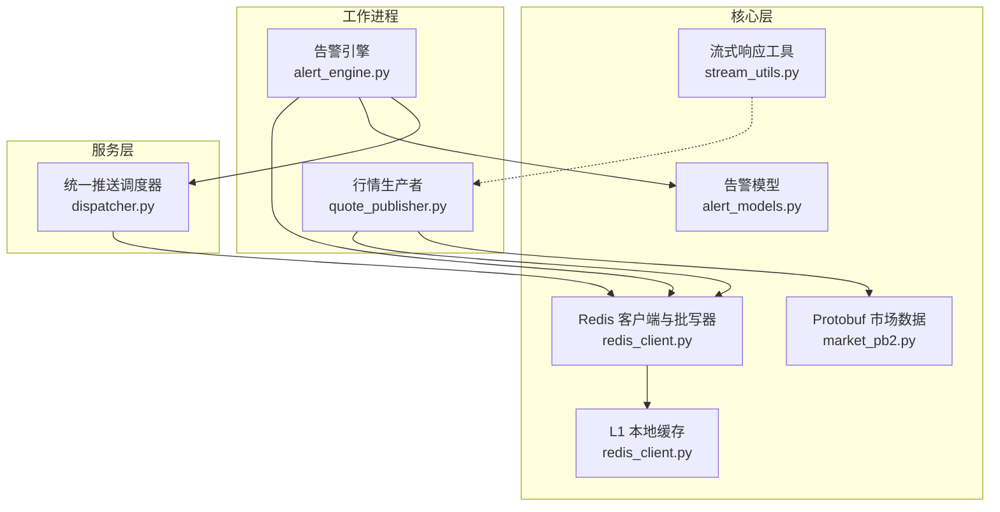
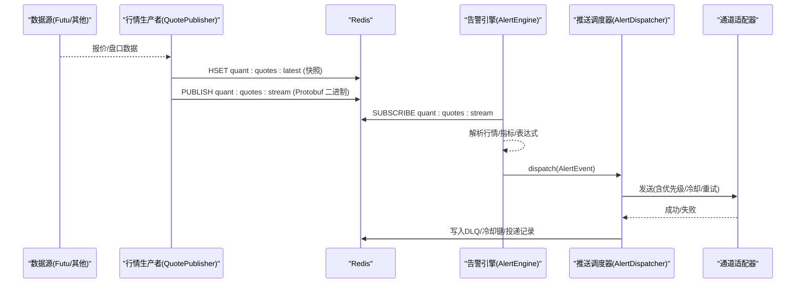
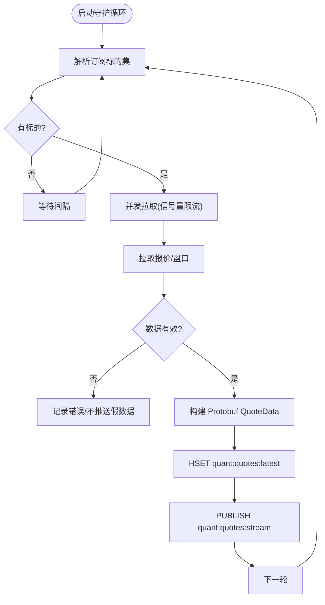
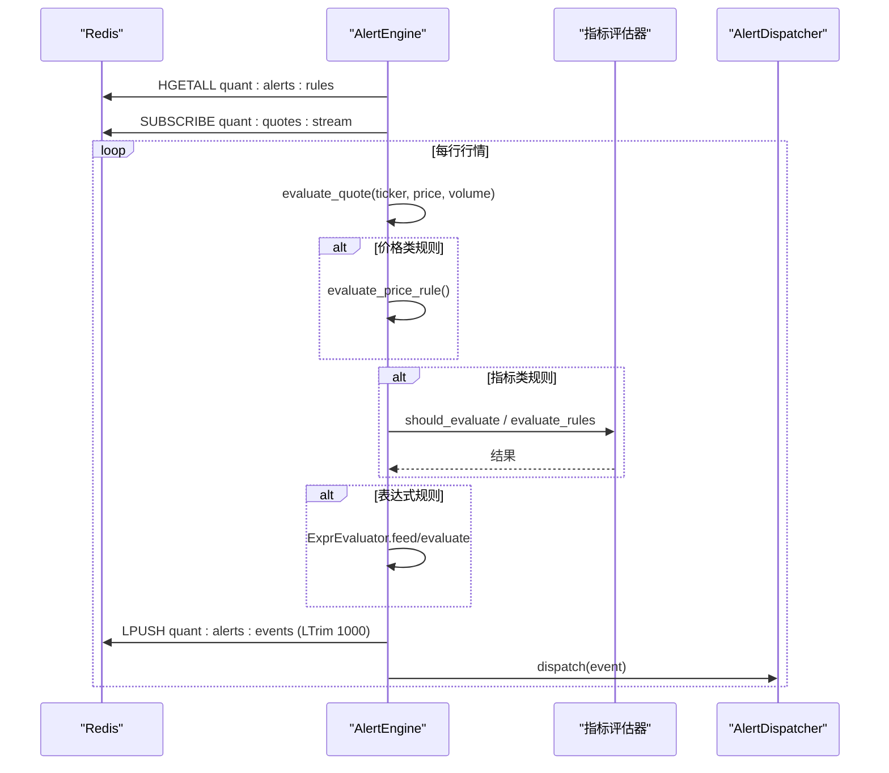
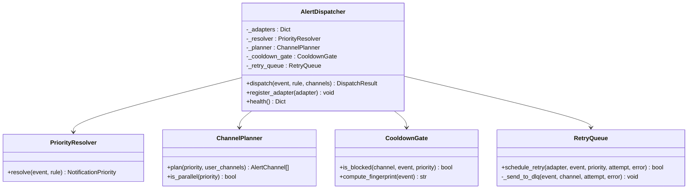
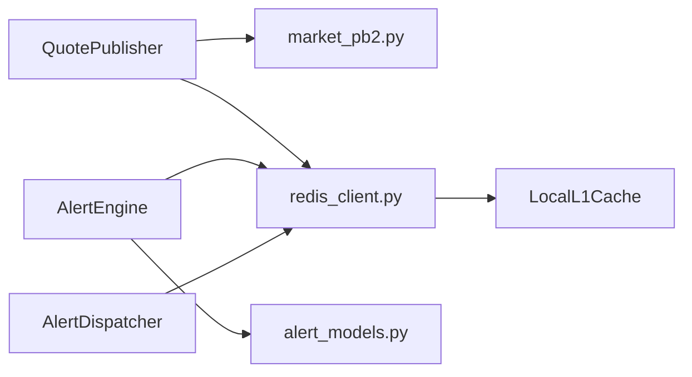

# 消息队列处理

<cite>
**本文引用的文件**
- [backend/core/redis_client.py](file://backend/core/redis_client.py)
- [backend/workers/quote_publisher.py](file://backend/workers/quote_publisher.py)
- [backend/workers/alert_engine.py](file://backend/workers/alert_engine.py)
- [backend/services/alert/dispatcher.py](file://backend/services/alert/dispatcher.py)
- [backend/core/alert_models.py](file://backend/core/alert_models.py)
- [backend/core/proto/market_pb2.py](file://backend/core/proto/market_pb2.py)
- [backend/core/stream_utils.py](file://backend/core/stream_utils.py)
</cite>

## 目录
1. [简介](#简介)
2. [项目结构](#项目结构)
3. [核心组件](#核心组件)
4. [架构总览](#架构总览)
5. [详细组件分析](#详细组件分析)
6. [依赖关系分析](#依赖关系分析)
7. [性能与内存管理](#性能与内存管理)
8. [监控与调试](#监控与调试)
9. [可靠性与一致性](#可靠性与一致性)
10. [故障排查指南](#故障排查指南)
11. [结论](#结论)

## 简介
本文件系统性梳理 Quant Agent 基于 Redis 的消息队列与事件总线，覆盖以下关键能力：
- Pub/Sub 实时通信：行情流、告警事件广播
- ZSET 有序集合：用于优先级重试与死信队列（DLQ）等场景的有序化存储
- Hash 结构的键值管理：规则、快照、状态等结构化数据
- 生产者-消费者模式：行情数据发布、告警消息分发、系统事件通知
- 序列化与版本兼容：Protobuf 二进制 + JSON 双格式兼容
- 错误重试机制：按优先级的退避重试与 DLQ 持久化
- 持久化策略与内存管理：批量写入、L1 本地缓存、优雅关闭
- 幂等性、顺序性与并发安全：冷却门控、去重指纹、并行/串行投递
- 监控与调试：健康检查、投递记录、指标埋点

## 项目结构
围绕消息队列的核心代码分布在后端 workers、services、core 三层：
- core：Redis 连接池、批量写入器、L1 缓存、流式响应工具、模型定义、Protobuf 生成代码
- workers：行情生产者（QuotePublisher）、告警引擎（AlertEngine）
- services：统一推送调度器（AlertDispatcher），负责通道路由、冷却、重试、DLQ

图表来源
- [backend/core/redis_client.py:1-252](file://backend/core/redis_client.py#L1-L252)
- [backend/workers/quote_publisher.py:1-234](file://backend/workers/quote_publisher.py#L1-L234)
- [backend/workers/alert_engine.py:1-502](file://backend/workers/alert_engine.py#L1-L502)
- [backend/services/alert/dispatcher.py:1-580](file://backend/services/alert/dispatcher.py#L1-L580)
- [backend/core/alert_models.py:1-278](file://backend/core/alert_models.py#L1-L278)
- [backend/core/proto/market_pb2.py:1-34](file://backend/core/proto/market_pb2.py#L1-L34)
- [backend/core/stream_utils.py:1-77](file://backend/core/stream_utils.py#L1-L77)

章节来源
- [backend/core/redis_client.py:1-252](file://backend/core/redis_client.py#L1-L252)
- [backend/workers/quote_publisher.py:1-234](file://backend/workers/quote_publisher.py#L1-L234)
- [backend/workers/alert_engine.py:1-502](file://backend/workers/alert_engine.py#L1-L502)
- [backend/services/alert/dispatcher.py:1-580](file://backend/services/alert/dispatcher.py#L1-L580)
- [backend/core/alert_models.py:1-278](file://backend/core/alert_models.py#L1-L278)
- [backend/core/proto/market_pb2.py:1-34](file://backend/core/proto/market_pb2.py#L1-L34)
- [backend/core/stream_utils.py:1-77](file://backend/core/stream_utils.py#L1-L77)

## 核心组件
- Redis 连接池与异步批写器：统一连接管理、Pipeline 批量写入、优雅停机
- L1 本地短效缓存：消除极高频读取的网络开销，带容量保护与后台清理
- 行情生产者（QuotePublisher）：拉取外部数据源，序列化为 Protobuf，双写最新快照与实时流
- 告警引擎（AlertEngine）：订阅行情流，评估价格/指标/表达式规则，触发告警并持久化
- 统一推送调度器（AlertDispatcher）：优先级解析、通道规划、冷却门控、重试与 DLQ、投递记录
- 流式响应工具（heartbeat_wrap）：SSE/NDJSON 心跳保活、断开检测、超时熔断

章节来源
- [backend/core/redis_client.py:1-252](file://backend/core/redis_client.py#L1-L252)
- [backend/workers/quote_publisher.py:1-234](file://backend/workers/quote_publisher.py#L1-L234)
- [backend/workers/alert_engine.py:1-502](file://backend/workers/alert_engine.py#L1-L502)
- [backend/services/alert/dispatcher.py:1-580](file://backend/services/alert/dispatcher.py#L1-L580)
- [backend/core/stream_utils.py:1-77](file://backend/core/stream_utils.py#L1-L77)

## 架构总览
系统采用“生产者-消费者”+“Pub/Sub 广播”的混合架构：
- 生产者：QuotePublisher 定时轮询数据源，将行情以 Protobuf 二进制形式写入 Redis
- 实时总线：通过 Redis Pub/Sub 频道 quant:quotes:stream 广播行情
- 消费者：AlertEngine 订阅行情流，匹配规则并产生告警事件；前端或其他订阅者也可消费该流
- 推送路由：AlertDispatcher 作为唯一出口，根据优先级选择通道（应用内、飞书、Telegram），实现冷却、重试与 DLQ

图表来源
- [backend/workers/quote_publisher.py:1-234](file://backend/workers/quote_publisher.py#L1-L234)
- [backend/workers/alert_engine.py:1-502](file://backend/workers/alert_engine.py#L1-L502)
- [backend/services/alert/dispatcher.py:1-580](file://backend/services/alert/dispatcher.py#L1-L580)

## 详细组件分析

### 行情生产者（QuotePublisher）
职责：
- 从数据源拉取报价与盘口，进行质量校验
- 使用 Protobuf 构造 QuoteData，序列化为紧凑二进制
- 双写策略：HSET 最新快照 + PUBLISH 实时流
- 动态标的池：结合前端订阅集合与兜底常驻池，限流并发拉取

关键流程（流程图）：

图表来源
- [backend/workers/quote_publisher.py:90-222](file://backend/workers/quote_publisher.py#L90-L222)

章节来源
- [backend/workers/quote_publisher.py:1-234](file://backend/workers/quote_publisher.py#L1-L234)
- [backend/core/proto/market_pb2.py:1-34](file://backend/core/proto/market_pb2.py#L1-L34)

### 告警引擎（AlertEngine）
职责：
- 从 Redis Hash 加载活跃规则，维护本地规则表
- 订阅行情流，解析行情并评估三类规则：价格类、指标类、自由表达式
- 触发后创建 AlertEvent，持久化到 Redis List（最近 1000 条），并通过 AlertDispatcher 推送
- 支持冷却期、节流、指标获取降级

关键流程（时序图）：

图表来源
- [backend/workers/alert_engine.py:89-502](file://backend/workers/alert_engine.py#L89-L502)

章节来源
- [backend/workers/alert_engine.py:1-502](file://backend/workers/alert_engine.py#L1-L502)
- [backend/core/alert_models.py:1-278](file://backend/core/alert_models.py#L1-L278)

### 统一推送调度器（AlertDispatcher）
职责：
- 优先级解析：severity + source → P0~P3
- 通道规划：P0 强制全开，P1/P2/P3 默认不同组合，用户可指定
- 冷却门控：基于 fingerprint 的通道级冷却（in_app 不受限）
- 重试与 DLQ：按优先级退避重试，超限进入 DLQ（Redis List）
- 投递记录：记录每次投递的状态、延迟、错误

关键流程（类图）：

图表来源
- [backend/services/alert/dispatcher.py:66-580](file://backend/services/alert/dispatcher.py#L66-L580)

章节来源
- [backend/services/alert/dispatcher.py:1-580](file://backend/services/alert/dispatcher.py#L1-L580)
- [backend/core/alert_models.py:1-278](file://backend/core/alert_models.py#L1-L278)

### 流式响应工具（heartbeat_wrap）
职责：
- 为 SSE/NDJSON 提供心跳保活，避免反向代理中断长连接
- 检测客户端断开，及时取消下游任务
- 支持超时熔断，防止资源泄露

章节来源
- [backend/core/stream_utils.py:1-77](file://backend/core/stream_utils.py#L1-L77)

## 依赖关系分析
- QuotePublisher 依赖 Protobuf market_pb2 生成代码进行高效序列化
- AlertEngine 依赖 alert_models 中的规则与事件模型，以及指标评估器
- AlertDispatcher 依赖 redis 进行冷却键、DLQ 与投递记录的持久化
- Redis 客户端提供连接池、批写器与 L1 缓存，降低网络开销与提升吞吐

图表来源
- [backend/workers/quote_publisher.py:1-234](file://backend/workers/quote_publisher.py#L1-L234)
- [backend/workers/alert_engine.py:1-502](file://backend/workers/alert_engine.py#L1-L502)
- [backend/services/alert/dispatcher.py:1-580](file://backend/services/alert/dispatcher.py#L1-L580)
- [backend/core/redis_client.py:1-252](file://backend/core/redis_client.py#L1-L252)
- [backend/core/alert_models.py:1-278](file://backend/core/alert_models.py#L1-L278)
- [backend/core/proto/market_pb2.py:1-34](file://backend/core/proto/market_pb2.py#L1-L34)

章节来源
- [backend/workers/quote_publisher.py:1-234](file://backend/workers/quote_publisher.py#L1-L234)
- [backend/workers/alert_engine.py:1-502](file://backend/workers/alert_engine.py#L1-L502)
- [backend/services/alert/dispatcher.py:1-580](file://backend/services/alert/dispatcher.py#L1-L580)
- [backend/core/redis_client.py:1-252](file://backend/core/redis_client.py#L1-L252)
- [backend/core/alert_models.py:1-278](file://backend/core/alert_models.py#L1-L278)
- [backend/core/proto/market_pb2.py:1-34](file://backend/core/proto/market_pb2.py#L1-L34)

## 性能与内存管理
- 批量写入：RedisAsyncBatchWriter 使用 asyncio.Queue 与 Pipeline 批量 set，减少 RTT 与带宽占用
- L1 本地缓存：LocalL1Cache 对高频读做内存缓存，带 TTL 与容量上限保护，避免内存泄漏
- 优雅关闭：stop(timeout_s) 确保队列清空与数据刷新，避免丢数据
- 并发控制：QuotePublisher 使用信号量限制并发拉取，避免外部 API 封禁
- 流式保活：heartbeat_wrap 提供心跳与断开检测，避免无效计算

优化建议：
- 合理设置 batch_size 与 flush_interval，平衡延迟与吞吐
- 根据负载调整 L1_CACHE_MAX_SIZE 与 default_ttl
- 在高并发场景下，考虑分片或分区键，避免热点 Key 竞争

章节来源
- [backend/core/redis_client.py:46-177](file://backend/core/redis_client.py#L46-L177)
- [backend/core/redis_client.py:184-252](file://backend/core/redis_client.py#L184-L252)
- [backend/workers/quote_publisher.py:166-222](file://backend/workers/quote_publisher.py#L166-L222)
- [backend/core/stream_utils.py:21-77](file://backend/core/stream_utils.py#L21-L77)

## 监控与调试
- 告警引擎统计：stats 包含运行状态、规则数、评估次数、触发次数、追踪标的数、推送通道
- 调度器健康：health 返回适配器状态、待重试任务数
- 投递记录：DeliveryRecord 记录 delivery_id、event_id、channel、priority、status、attempt、latency_ms、error
- 死信队列：quant:alerts:dlq 保存失败投递，便于离线分析与重放

使用方式：
- 定期查询 stats 与 health，观察系统健康度
- 查看 DLQ 列表，定位失败原因并人工干预
- 结合日志与指标（Prometheus）进行根因分析

章节来源
- [backend/workers/alert_engine.py:491-502](file://backend/workers/alert_engine.py#L491-L502)
- [backend/services/alert/dispatcher.py:227-259](file://backend/services/alert/dispatcher.py#L227-L259)
- [backend/services/alert/dispatcher.py:558-580](file://backend/services/alert/dispatcher.py#L558-L580)

## 可靠性与一致性
- 幂等性保证：
  - 通道级冷却基于 fingerprint（source + rule_id + ticker + severity），避免重复推送
  - in_app 通道不受冷却限制，确保前端即时可见
- 顺序性控制：
  - 指标评估节流：IndicatorEvaluator.should_evaluate 控制盘中评估频率
  - 价格穿越检测依赖 prev_price，确保上穿/下穿逻辑正确
- 并发安全：
  - 并发拉取使用信号量限流，避免外部 API 过载
  - 批量写入使用 Pipeline，原子执行，减少竞态
- 错误重试与降级：
  - 按优先级退避重试，超限进入 DLQ
  - 指标获取失败时跳过评估，不影响价格类规则
- 持久化策略：
  - 规则与事件持久化至 Redis Hash/List，保障重启恢复
  - 最新快照 HSET，供前端快速加载当前盘口

章节来源
- [backend/services/alert/dispatcher.py:164-219](file://backend/services/alert/dispatcher.py#L164-L219)
- [backend/workers/alert_engine.py:249-318](file://backend/workers/alert_engine.py#L249-L318)
- [backend/workers/quote_publisher.py:133-158](file://backend/workers/quote_publisher.py#L133-L158)
- [backend/core/redis_client.py:155-177](file://backend/core/redis_client.py#L155-L177)

## 故障排查指南
常见问题与定位步骤：
- 行情未推送：
  - 检查数据源拉取是否超时或异常
  - 确认 Redis 连接与频道是否存在
  - 查看日志中“Futu 拉取失败/超时”相关条目
- 告警未触发：
  - 检查规则是否启用且匹配 ticker
  - 确认指标获取是否成功
  - 查看冷却期是否导致抑制
- 推送失败：
  - 检查通道适配器是否注册且 enabled
  - 查看 DLQ 中失败记录与错误信息
  - 根据优先级与冷却策略判断是否被抑制

操作建议：
- 使用 stats 与 health 接口观察引擎与调度器状态
- 导出 DLQ 列表进行分析与重放
- 调整冷却 TTL 与重试策略，平衡实时性与稳定性

章节来源
- [backend/workers/quote_publisher.py:90-165](file://backend/workers/quote_publisher.py#L90-L165)
- [backend/workers/alert_engine.py:137-247](file://backend/workers/alert_engine.py#L137-L247)
- [backend/services/alert/dispatcher.py:279-350](file://backend/services/alert/dispatcher.py#L279-L350)

## 结论
Quant Agent 的消息队列系统以 Redis 为核心，结合 Protobuf 高效序列化、Pub/Sub 实时广播、Hash/ZSET/List 多数据结构，实现了高吞吐、低延迟的行情与告警流水线。通过统一推送调度器，系统在优先级、冷却、重试与 DLQ 方面提供了完善的可靠性保障。配合 L1 缓存与批量写入，系统在内存与网络层面进行了深度优化。未来可进一步引入分区键、水平扩展与更细粒度的指标观测，以支撑更大规模的生产环境。
