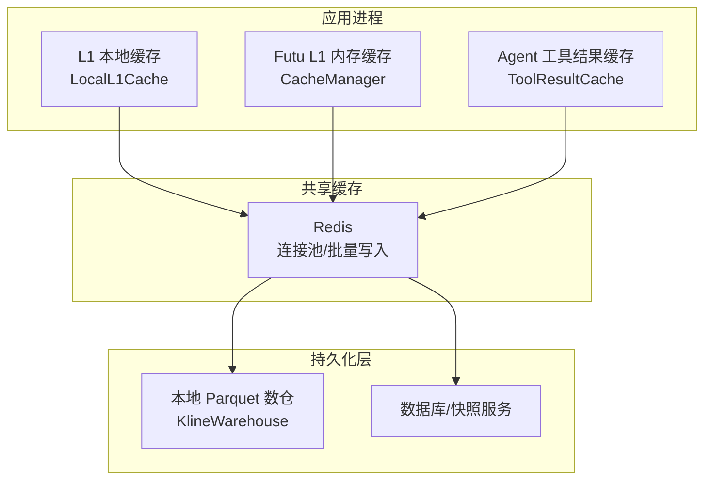
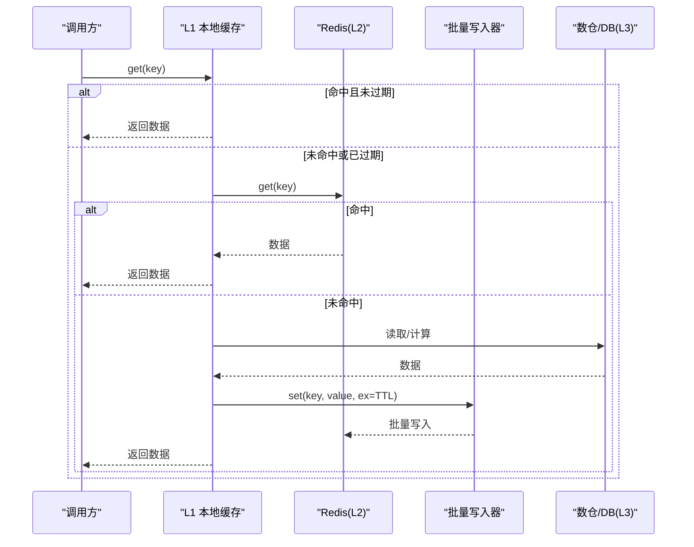
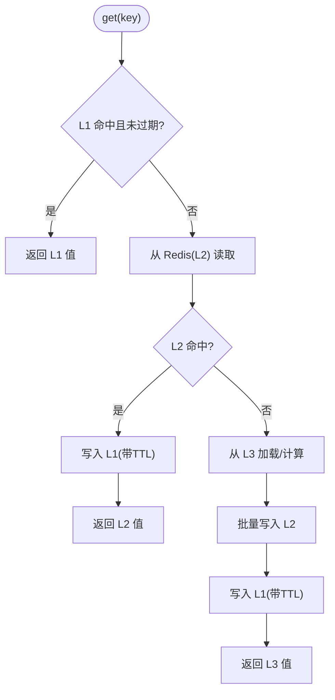
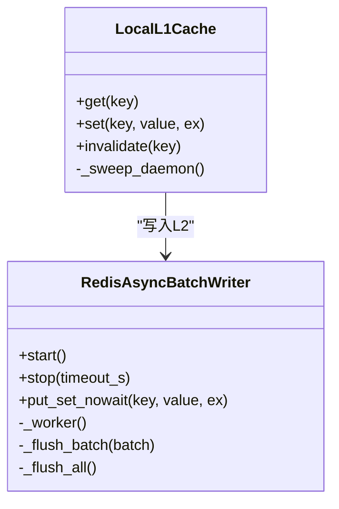
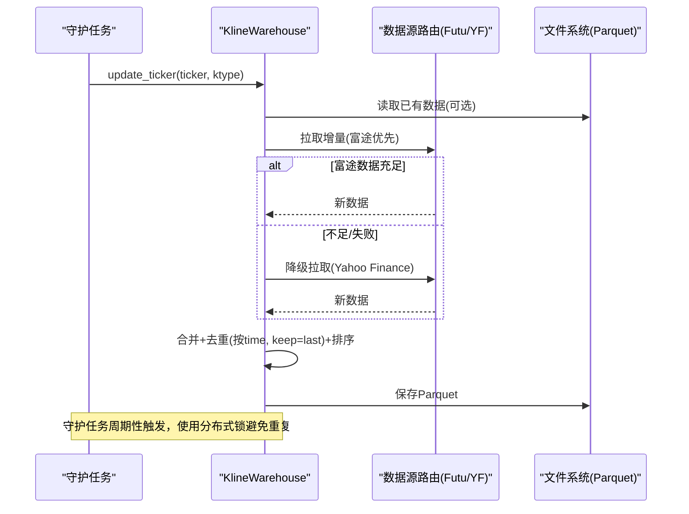
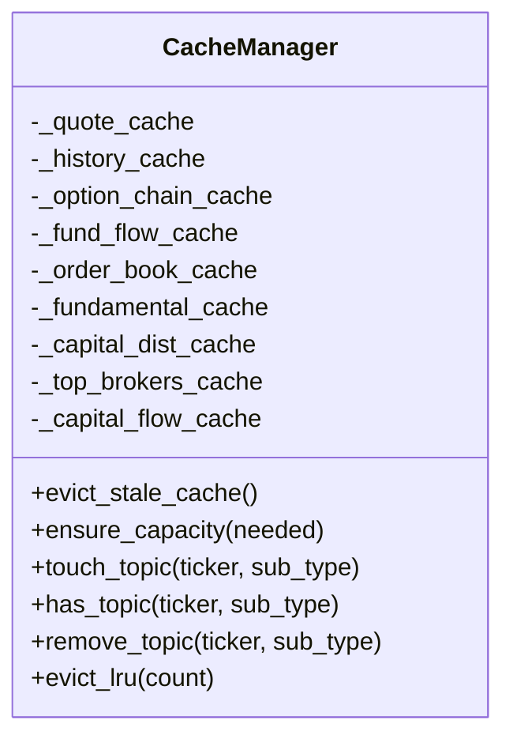
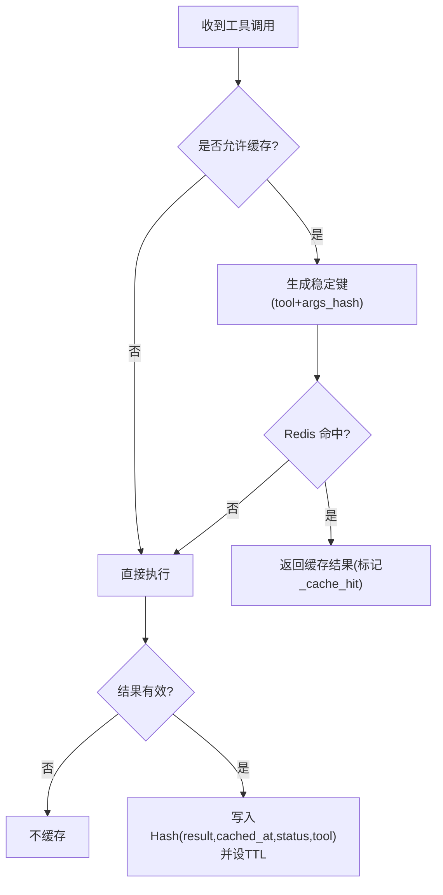
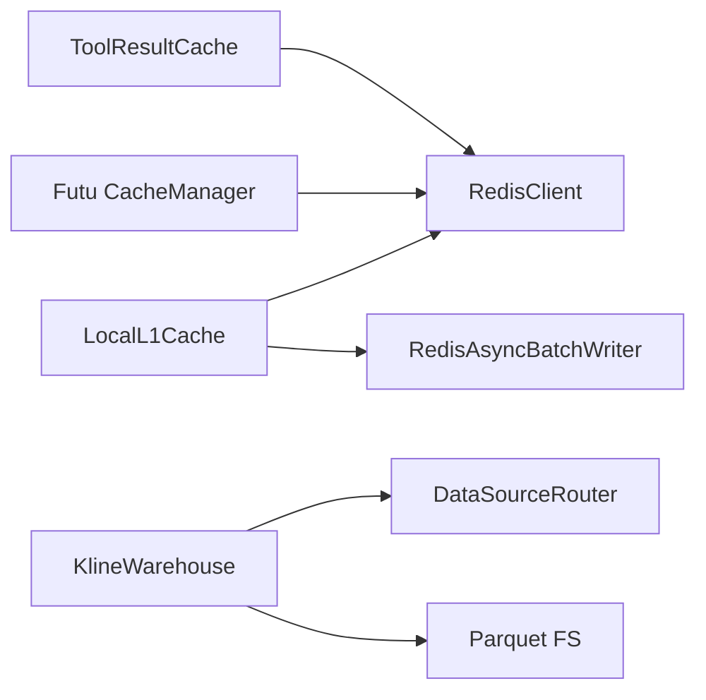

# 缓存策略

<cite>
**本文引用的文件**
- [backend/core/redis_client.py](file://backend/core/redis_client.py)
- [backend/core/cache_manager.py](file://backend/core/cache_manager.py)
- [backend/services/datalake/kline_warehouse.py](file://backend/services/datalake/kline_warehouse.py)
- [data_subservice/futu_src/cache_manager.py](file://data_subservice/futu_src/cache_manager.py)
- [hermes_agent/tool_result_cache.py](file://hermes_agent/tool_result_cache.py)
</cite>

## 目录
1. [简介](#简介)
2. [项目结构](#项目结构)
3. [核心组件](#核心组件)
4. [架构总览](#架构总览)
5. [详细组件分析](#详细组件分析)
6. [依赖关系分析](#依赖关系分析)
7. [性能考量](#性能考量)
8. [故障排查指南](#故障排查指南)
9. [结论](#结论)
10. [附录](#附录)

## 简介
本文件系统性阐述 Quant Agent 的多级缓存策略与 K 线数据增量更新机制，覆盖 L1 本地缓存、L2 Redis 缓存、L3 数据库/数仓存储的分层设计；说明时间序列合并算法、冲突解决与一致性保证；解释 TTL、LRU、热点保护等失效策略；并给出预热、批量优化、内存监控、命中率优化、延迟降低、分布式同步与故障恢复等实践建议。

## 项目结构
围绕缓存与 K 线数据的关键代码分布在以下模块：
- Redis 客户端与进程内 L1 缓存、异步批量写入器：backend/core/redis_client.py
- 统一缓存清理工具（业务前缀保护）：backend/core/cache_manager.py
- 本地 K 线数仓（Parquet）与增量同步守护任务：backend/services/datalake/kline_warehouse.py
- Futu 数据源的 L1 内存缓存与订阅池管理：data_subservice/futu_src/cache_manager.py
- Agent 工具结果缓存（Redis Hash + TTL）：hermes_agent/tool_result_cache.py

图表来源
- [backend/core/redis_client.py:180-251](file://backend/core/redis_client.py#L180-L251)
- [data_subservice/futu_src/cache_manager.py:30-149](file://data_subservice/futu_src/cache_manager.py#L30-L149)
- [hermes_agent/tool_result_cache.py:107-190](file://hermes_agent/tool_result_cache.py#L107-L190)
- [backend/services/datalake/kline_warehouse.py:16-173](file://backend/services/datalake/kline_warehouse.py#L16-L173)

章节来源
- [backend/core/redis_client.py:1-252](file://backend/core/redis_client.py#L1-L252)
- [backend/core/cache_manager.py:1-75](file://backend/core/cache_manager.py#L1-L75)
- [backend/services/datalake/kline_warehouse.py:1-258](file://backend/services/datalake/kline_warehouse.py#L1-L258)
- [data_subservice/futu_src/cache_manager.py:1-373](file://data_subservice/futu_src/cache_manager.py#L1-L373)
- [hermes_agent/tool_result_cache.py:1-195](file://hermes_agent/tool_result_cache.py#L1-L195)

## 核心组件
- L1 本地短效缓存（进程内字典 + 后台清理）：用于极高频读取的键，默认短 TTL，容量超限安全熔断清空，命中则零网络开销。
- L2 Redis 缓存（连接池 + 异步批量写入）：作为共享缓存与数据总线，支持 Pipeline 批量写、TTL 过期、扫描清理。
- L3 本地数仓（Parquet）与数据库/快照：K 线历史以列式 Parquet 持久化，提供回测极速读取；配合日快照发布与保留策略。
- Futu 数据源 L1 缓存：按数据类型分桶，带 TTL 与容量熔断，结合 LRU 订阅池控制资源。
- Agent 工具结果缓存：基于 Redis Hash，按工具名与参数哈希生成稳定键，支持按工具维度 TTL 与黑名单。

章节来源
- [backend/core/redis_client.py:180-251](file://backend/core/redis_client.py#L180-L251)
- [backend/core/redis_client.py:37-177](file://backend/core/redis_client.py#L37-L177)
- [backend/services/datalake/kline_warehouse.py:16-173](file://backend/services/datalake/kline_warehouse.py#L16-L173)
- [data_subservice/futu_src/cache_manager.py:30-149](file://data_subservice/futu_src/cache_manager.py#L30-L149)
- [hermes_agent/tool_result_cache.py:107-190](file://hermes_agent/tool_result_cache.py#L107-L190)

## 架构总览
Quant Agent 采用“进程内 L1 → 共享 L2 → 持久化 L3”的三级缓存体系，兼顾低延迟与高吞吐：
- 读路径：优先命中 L1；未命中穿透至 L2；必要时从 L3（Parquet/DB）加载并回填 L1/L2。
- 写路径：通过异步批量写入器聚合写操作，减少 RTT；同时更新 L1 与 L2，确保强一致。
- 失效策略：L1 使用短 TTL + 容量熔断；L2 使用 TTL + 模式扫描清理；L3 通过增量合并与日快照版本化。
- 一致性：写时先落 L2 再入 L1；L3 增量合并去重保序；分布式锁避免重复拉取。

图表来源
- [backend/core/redis_client.py:180-251](file://backend/core/redis_client.py#L180-L251)
- [backend/core/redis_client.py:37-177](file://backend/core/redis_client.py#L37-L177)
- [backend/services/datalake/kline_warehouse.py:55-173](file://backend/services/datalake/kline_warehouse.py#L55-L173)

## 详细组件分析

### L1 本地缓存（LocalL1Cache）
- 设计要点
  - 进程内 dict 存储 (key -> (value, expire_time))，默认短 TTL，降低网络开销。
  - 后台定时清理过期条目，防止冷门 key 堆积导致内存泄漏。
  - 容量保护：当字典大小达到上限时，安全清空，下次访问自动重建。
  - 写路径：先写 Redis（L2），再更新 L1，保证绝对一致。
- 复杂度与性能
  - 读 O(1)，写 O(1)；后台清理周期固定，整体对事件循环无阻塞。
- 适用场景
  - 配置项、系统开关、热点查询等极低延迟要求的场景。

图表来源
- [backend/core/redis_client.py:180-251](file://backend/core/redis_client.py#L180-L251)

章节来源
- [backend/core/redis_client.py:180-251](file://backend/core/redis_client.py#L180-L251)

### L2 Redis 缓存与批量写入
- 设计要点
  - 全局连接池统一管理，限制最大连接数，避免资源耗尽。
  - 异步批量写入队列：将高频 set 请求聚合为 Pipeline 批量提交，显著降低 RTT 与带宽占用。
  - 优雅关闭：停止时等待队列排空并 flush，确保不丢数据。
- 适用场景
  - 跨进程共享缓存、限流、会话态、热点数据等。

图表来源
- [backend/core/redis_client.py:37-177](file://backend/core/redis_client.py#L37-L177)
- [backend/core/redis_client.py:180-251](file://backend/core/redis_client.py#L180-L251)

章节来源
- [backend/core/redis_client.py:37-177](file://backend/core/redis_client.py#L37-L177)
- [backend/core/redis_client.py:180-251](file://backend/core/redis_client.py#L180-L251)

### L3 本地 K 线数仓（Parquet）与增量更新
- 设计要点
  - 按周期分目录存储 Parquet，列式引擎读取速度极快，适合回测。
  - 增量更新：根据本地最后一条时间戳计算需拉取数量，优先富途高质量数据，不足时降级雅虎财经兜底。
  - 合并与去重：按 time 字段去重并 keep='last'，最新复权覆盖旧数据，排序后落盘。
  - 守护任务：每日凌晨执行增量同步，使用分布式锁避免集群重复拉取；成功后发布日快照与保留策略。
- 复杂度与性能
  - 合并阶段 O(N log N) 排序 + O(N) 去重；I/O 集中在落盘，读取走线程池避免阻塞事件循环。
- 一致性
  - 单 ticker 并发写加锁；分布式锁防多机重复；失败降级与日志可观测。

图表来源
- [backend/services/datalake/kline_warehouse.py:55-173](file://backend/services/datalake/kline_warehouse.py#L55-L173)
- [backend/services/datalake/kline_warehouse.py:175-254](file://backend/services/datalake/kline_warehouse.py#L175-L254)

章节来源
- [backend/services/datalake/kline_warehouse.py:16-173](file://backend/services/datalake/kline_warehouse.py#L16-L173)
- [backend/services/datalake/kline_warehouse.py:175-254](file://backend/services/datalake/kline_warehouse.py#L175-L254)

### Futu 数据源 L1 缓存与订阅池
- 设计要点
  - 多类数据独立缓存字典，各自 TTL 不同（行情、K线、期权链、资金流向、盘口、基本面等）。
  - 容量熔断：超过阈值时清理最旧一半，防止内存无限增长。
  - LRU 订阅池：维护 (ticker, sub_type) 最近访问时间，按需淘汰最久未用订阅，释放资源。
- 适用场景
  - 高频推送与查询场景，降低下游压力，提升响应速度。

图表来源
- [data_subservice/futu_src/cache_manager.py:30-149](file://data_subservice/futu_src/cache_manager.py#L30-L149)

章节来源
- [data_subservice/futu_src/cache_manager.py:30-149](file://data_subservice/futu_src/cache_manager.py#L30-L149)

### Agent 工具结果缓存（Redis Hash）
- 设计要点
  - 键：tool:cache:{tool_name}:{args_hash}，参数经 JSON 序列化并哈希，保证稳定性。
  - 字段：result、cached_at、status、tool；按工具维度设置 TTL，支持环境变量覆盖。
  - 过滤规则：错误、限流、空结果、显式 skip_cache 不落缓存；支持黑名单工具。
- 适用场景
  - 工具调用结果复用，降低重复计算与外部调用成本。

图表来源
- [hermes_agent/tool_result_cache.py:79-190](file://hermes_agent/tool_result_cache.py#L79-L190)

章节来源
- [hermes_agent/tool_result_cache.py:79-190](file://hermes_agent/tool_result_cache.py#L79-L190)

## 依赖关系分析
- 组件耦合
  - L1 缓存依赖 Redis 客户端与批量写入器；K 线数仓依赖数据源路由与 Redis 分布式锁；Futu 缓存与订阅池相对独立但共享内存。
- 外部依赖
  - Redis 连接池、PyArrow/Parquet、数据源接口（富途/雅虎）、数据库/快照服务。
- 潜在风险
  - 批量写入异常、Redis 不可用、数据源限流、Parquet 读写异常；已通过超时、降级、日志与分布式锁缓解。

图表来源
- [backend/core/redis_client.py:180-251](file://backend/core/redis_client.py#L180-L251)
- [backend/services/datalake/kline_warehouse.py:55-173](file://backend/services/datalake/kline_warehouse.py#L55-L173)
- [data_subservice/futu_src/cache_manager.py:30-149](file://data_subservice/futu_src/cache_manager.py#L30-L149)
- [hermes_agent/tool_result_cache.py:107-190](file://hermes_agent/tool_result_cache.py#L107-L190)

章节来源
- [backend/core/redis_client.py:180-251](file://backend/core/redis_client.py#L180-L251)
- [backend/services/datalake/kline_warehouse.py:55-173](file://backend/services/datalake/kline_warehouse.py#L55-L173)
- [data_subservice/futu_src/cache_manager.py:30-149](file://data_subservice/futu_src/cache_manager.py#L30-L149)
- [hermes_agent/tool_result_cache.py:107-190](file://hermes_agent/tool_result_cache.py#L107-L190)

## 性能考量
- 缓存命中率优化
  - 合理设置 L1 默认 TTL 与容量上限，避免频繁穿透；对热点 key 使用短 TTL 提高新鲜度。
  - 工具结果缓存按工具维度 TTL，避免长尾冷数据污染。
- 延迟降低技巧
  - 使用异步批量写入器聚合写操作，减少 RTT；读路径尽量命中 L1。
  - K 线读取走线程池与 Parquet 列式引擎，避免阻塞事件循环。
- 内存使用监控
  - L1 容量熔断与后台清理；Futu 缓存容量熔断与过期清理；定期统计工具缓存命中率。
- 预热策略
  - 每日凌晨守护任务对重点标的进行增量同步；启动时可预加载热门指标与配置。
- 批量操作优化
  - Pipeline 批量写入；按天/周期批量合并与落盘；退订队列异步处理。

[本节为通用指导，无需特定文件引用]

## 故障排查指南
- 缓存清理误删防护
  - 统一清理工具仅针对业务前缀，交易态前缀受保护，避免误删活动挂单/持仓/OMS 状态。
- 常见问题定位
  - Redis 连接池耗尽：检查连接数上限与批量写入队列积压；观察优雅关闭是否完成。
  - K 线增量失败：查看数据源降级逻辑与分布式锁状态；确认 Parquet 读写权限与磁盘空间。
  - 工具缓存未命中：检查 TTL 配置、黑名单与结果过滤规则；核对参数哈希稳定性。

章节来源
- [backend/core/cache_manager.py:19-75](file://backend/core/cache_manager.py#L19-L75)
- [backend/core/redis_client.py:37-177](file://backend/core/redis_client.py#L37-L177)
- [backend/services/datalake/kline_warehouse.py:55-173](file://backend/services/datalake/kline_warehouse.py#L55-L173)
- [hermes_agent/tool_result_cache.py:89-190](file://hermes_agent/tool_result_cache.py#L89-L190)

## 结论
Quant Agent 的多级缓存体系通过 L1 本地短效缓存、L2 Redis 共享缓存与 L3 Parquet/数据库持久化的分层设计，实现了低延迟、高吞吐与强一致性的平衡。K 线增量更新采用智能时间差判断与多源降级，结合去重保序与分布式锁，确保数据一致性与可靠性。配合 TTL、LRU、容量熔断与批量写入等机制，系统在大规模数据与高并发场景下具备良好可扩展性与鲁棒性。

[本节为总结性内容，无需特定文件引用]

## 附录
- 关键配置项与环境变量
  - L1 缓存容量：L1_CACHE_MAX_SIZE
  - Redis 连接池：REDIS_HOST、REDIS_PORT、REDIS_PASSWORD、REDIS_MAX_CONNECTIONS
  - 工具缓存：TOOL_CACHE_ENABLED、TOOL_CACHE_DEFAULT_TTL、TOOL_CACHE_TTL_{NAME}、TOOL_CACHE_NO_CACHE
  - Futu 订阅上限：FUTU_MAX_SUBSCRIPTIONS

[本节为配置参考，无需特定文件引用]
