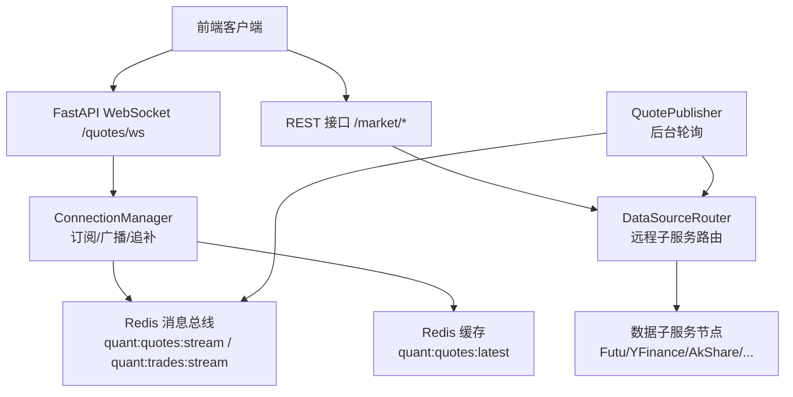
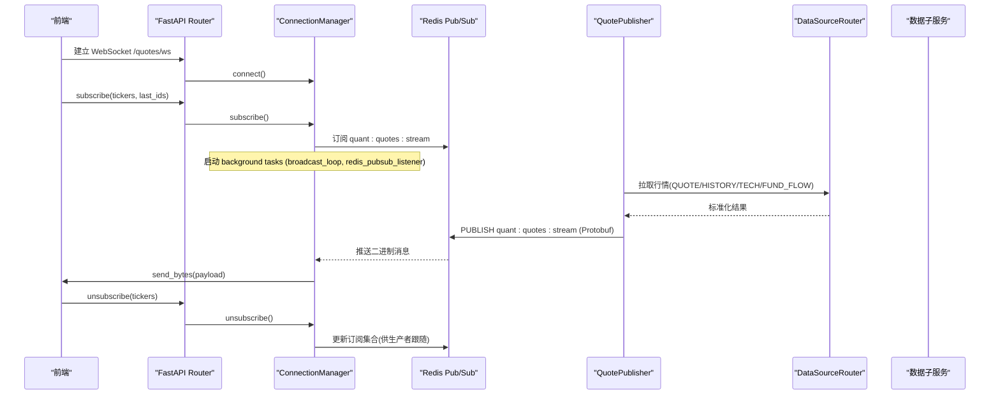
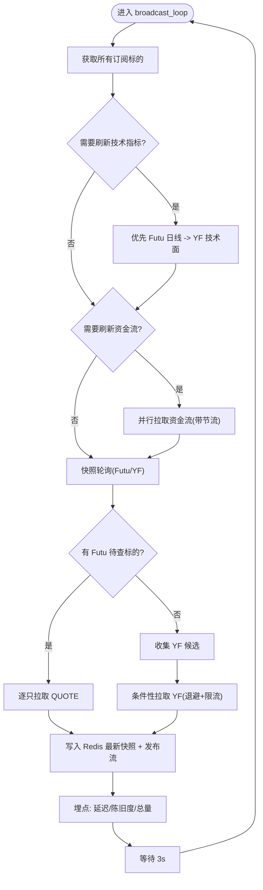
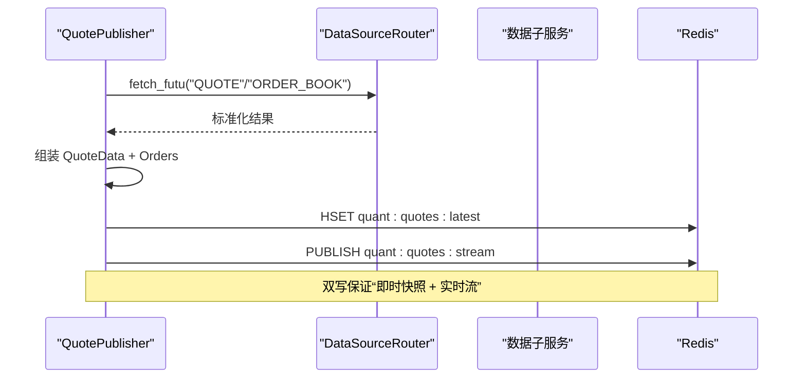
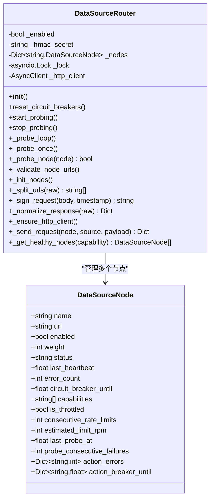
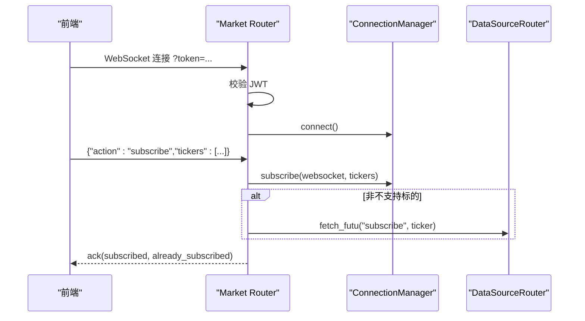
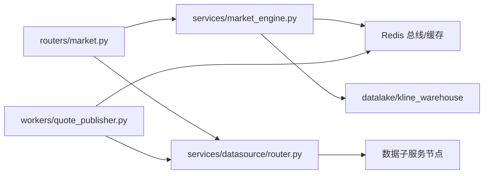

# 市场引擎架构

<cite>
**本文引用的文件**
- [backend/services/market_engine.py](file://backend/services/market_engine.py)
- [backend/workers/quote_publisher.py](file://backend/workers/quote_publisher.py)
- [backend/routers/market.py](file://backend/routers/market.py)
- [backend/services/datasource/router.py](file://backend/services/datasource/router.py)
- [backend/app/market_data.py](file://backend/app/market_data.py)
- [shared/proto/market.proto](file://shared/proto/market.proto)
</cite>

## 目录
1. [简介](#简介)
2. [项目结构](#项目结构)
3. [核心组件](#核心组件)
4. [架构总览](#架构总览)
5. [详细组件分析](#详细组件分析)
6. [依赖关系分析](#依赖关系分析)
7. [性能考量](#性能考量)
8. [故障排查指南](#故障排查指南)
9. [结论](#结论)
10. [附录](#附录)

## 简介
本文件面向 Quant Agent 的“市场引擎”，系统性阐述市场数据的采集、处理与分发机制，覆盖实时行情订阅、历史数据获取、数据标准化与缓存、WebSocket 推送、多数据源集成（Futu、YFinance、AkShare 等）以及扩展新数据源的方案。文档同时给出关键流程图与时序图，帮助读者从端到端理解数据生命周期：从数据源到前端展示。

## 项目结构
市场引擎由以下层次构成：
- 接入层：FastAPI Router 暴露 REST 与 WebSocket 接口，负责鉴权、协议解析与路由。
- 引擎层：ConnectionManager 管理 WebSocket 连接、订阅、Redis Pub/Sub 监听与广播、指标与告警。
- 生产者层：QuotePublisher 后台轮询数据源，组装 Protobuf 消息并双写 Redis（最新快照 + 流式广播）。
- 数据源层：DataSourceRouter 统一调度远程子服务（Futu/YFinance/AkShare/Tushare/FMP/Finnhub/宏观等），实现负载均衡、熔断、限流与自愈。
- 存储与总线：Redis 作为消息总线与缓存（最新报价、交易流水、订阅集合等）。
- 协议层：Protobuf 定义统一的 QuoteData/Order 结构，确保跨进程/节点高效传输。

图表来源
- [backend/routers/market.py:73-225](file://backend/routers/market.py#L73-L225)
- [backend/services/market_engine.py:115-331](file://backend/services/market_engine.py#L115-L331)
- [backend/workers/quote_publisher.py:22-223](file://backend/workers/quote_publisher.py#L22-L223)
- [backend/services/datasource/router.py:249-800](file://backend/services/datasource/router.py#L249-L800)

章节来源
- [backend/routers/market.py:73-225](file://backend/routers/market.py#L73-L225)
- [backend/services/market_engine.py:115-331](file://backend/services/market_engine.py#L115-L331)
- [backend/workers/quote_publisher.py:22-223](file://backend/workers/quote_publisher.py#L22-L223)
- [backend/services/datasource/router.py:249-800](file://backend/services/datasource/router.py#L249-L800)

## 核心组件
- WebSocket 接入与连接管理：负责连接建立、心跳、订阅/退订、订阅集同步至 Redis、断线追补与批量压缩帧发送。
- 行情生产者：后台守护任务，按标的池并发拉取数据，组装 Protobuf 并双写 Redis（最新快照 + 流式广播）。
- 数据源路由：将内部 fetch_type/action 映射为子服务调用，支持多活、熔断、限流、半开自愈探针与健康探测。
- 缓存与总线：Redis 提供 HSET/HGET 最新快照、XADD/XRANGE 事件追补、PUBLISH/SUBSCRIBE 实时广播、SADD/SMEMBERS 动态订阅集合。
- 指标与告警：埋点统计（延迟、陈旧度、消息计数）、价格突破/跌破报警、宏观资金流出预警。

章节来源
- [backend/services/market_engine.py:39-113](file://backend/services/market_engine.py#L39-L113)
- [backend/services/market_engine.py:115-331](file://backend/services/market_engine.py#L115-L331)
- [backend/workers/quote_publisher.py:22-223](file://backend/workers/quote_publisher.py#L22-L223)
- [backend/services/datasource/router.py:249-800](file://backend/services/datasource/router.py#L249-L800)

## 架构总览
市场引擎采用“生产者-消费者”解耦模式：
- 生产者（QuotePublisher）定时拉取外部数据，标准化为 Protobuf，写入 Redis 最新快照并发布到流通道。
- 消费者（ConnectionManager）订阅 Redis 流，过滤并推送给本机 WebSocket 连接；同时支持断线 XRANGE 追补与批量压缩帧。
- 数据源路由屏蔽底层差异，统一通过 HTTP 调用子服务，具备熔断、限流、健康探测与自愈能力。

图表来源
- [backend/routers/market.py:73-225](file://backend/routers/market.py#L73-L225)
- [backend/services/market_engine.py:160-331](file://backend/services/market_engine.py#L160-L331)
- [backend/workers/quote_publisher.py:90-223](file://backend/workers/quote_publisher.py#L90-L223)
- [backend/services/datasource/router.py:669-748](file://backend/services/datasource/router.py#L669-L748)

## 详细组件分析

### 组件A：WebSocket 接入与连接管理（ConnectionManager）
职责
- 管理活跃连接与订阅集合，维护订阅集到 Redis 的同步键。
- 启动后台任务：广播循环（技术指标/资金流兜底轮询）、Redis Pub/Sub 监听。
- 断线追补：基于 XRANGE 获取错过的事件，超过阈值时以 zlib 压缩批量帧发送。
- 指标与告警：写入最新报价后触发价格突破/跌破报警与宏观资金流出预警。

关键流程
- 连接建立：accept 连接、记录连接数、启动后台任务。
- 订阅/退订：去重注册、同步订阅集合、异步追补或发送快照。
- 广播循环：周期性拉取技术指标与资金流，失败退避与防风暴控制。
- Redis 监听：解析 Protobuf ticker 过滤，仅推送给关注该标的的连接。

图表来源
- [backend/services/market_engine.py:332-601](file://backend/services/market_engine.py#L332-L601)

章节来源
- [backend/services/market_engine.py:115-331](file://backend/services/market_engine.py#L115-L331)
- [backend/services/market_engine.py:332-601](file://backend/services/market_engine.py#L332-L601)

### 组件B：行情生产者（QuotePublisher）
职责
- 后台守护任务，按标的池并发拉取数据（限制并发度），组装 Protobuf 并双写 Redis。
- 数据质量校验：对价格/成交量进行基础校验并上报质量监控。
- 盘口深度：合并报价与订单簿，输出 bids/asks。

关键流程
- 拉取数据：优先 Futu（QUOTE + ORDER_BOOK），超时或异常不注入假数据。
- 组装消息：构造 QuoteData 与 Order 列表，序列化二进制。
- 双写策略：HSET 最新快照 + PUBLISH 流式广播。
- 守护循环：动态读取前端订阅集合（与前端一致），限流并发与休眠错峰。

图表来源
- [backend/workers/quote_publisher.py:45-164](file://backend/workers/quote_publisher.py#L45-L164)
- [backend/workers/quote_publisher.py:166-223](file://backend/workers/quote_publisher.py#L166-L223)

章节来源
- [backend/workers/quote_publisher.py:22-223](file://backend/workers/quote_publisher.py#L22-L223)

### 组件C：数据源路由（DataSourceRouter）
职责
- 将内部 action/fetch_type 映射为子服务 action，统一 POST 到 /api/v1/data。
- 多活与容灾：支持逗号分隔的多 URL，权重与能力集（capabilities）配置。
- 熔断与限流：action 级熔断隔离、节点级兜底阈值、半开自愈探针、限流识别与重试间隔。
- 健康探测：启动期校验 URL 端口、定期探活 /health，恢复 healthy 状态。

关键流程
- 初始化：加载环境变量、构建节点表、验证 URL、重置熔断、启动探针。
- 请求发送：HMAC 签名、HTTP 发送、响应归一化、错误分类与日志。
- 健康检查：周期探活，成功则复位 error_count/circuit_breaker_until。

图表来源
- [backend/services/datasource/router.py:222-247](file://backend/services/datasource/router.py#L222-L247)
- [backend/services/datasource/router.py:249-800](file://backend/services/datasource/router.py#L249-L800)

章节来源
- [backend/services/datasource/router.py:249-800](file://backend/services/datasource/router.py#L249-L800)

### 组件D：WebSocket 接入路由（/quotes/ws）
职责
- 连接鉴权（JWT）、心跳保活、订阅/退订协议处理。
- 订阅去重、自动格式化 ticker、回传子服务进行真实订阅/退订。
- 系统消息与错误码封装，WS 消息计数埋点。

关键流程
- 连接建立：校验 token，接受连接，记录用户与连接。
- 订阅：去重注册，调用 ConnectionManager.subscribe，必要时通知子服务订阅。
- 退订：清理本地订阅，通知子服务释放槽位。
- 心跳：ping/pong，超时断开。

图表来源
- [backend/routers/market.py:73-225](file://backend/routers/market.py#L73-L225)

章节来源
- [backend/routers/market.py:73-225](file://backend/routers/market.py#L73-L225)

### 组件E：历史数据与 K 线仓库
职责
- 提供历史数据接口，优先走 Futu（经 DataSourceRouter），失败降级到 Facade（YF/AKShare）。
- 支持手动触发 K 线仓库同步，增量追加或全量降级拉取。

关键流程
- 历史查询：判断是否 Futu 标的，优先拉取 HISTORY，否则走 Facade。
- 同步接口：根据周期映射 ktype，调用 K 线仓库更新方法。

章节来源
- [backend/routers/market.py:463-545](file://backend/routers/market.py#L463-L545)

## 依赖关系分析
- 模块耦合
  - Router 依赖 market_engine.ConnectionManager 与 data_source_router。
  - market_engine 依赖 Redis、Protobuf、data_source_router、kline_warehouse、metrics。
  - quote_publisher 依赖 data_source_router 与 Redis。
  - router 依赖 DataSourceRouter 与业务 Facade（option/history/quote 等）。
- 外部依赖
  - Redis：消息总线与缓存。
  - 数据子服务：Futu/YFinance/AkShare/Tushare/FMP/Finnhub/宏观等。
  - Protobuf：统一数据结构。

图表来源
- [backend/routers/market.py:73-225](file://backend/routers/market.py#L73-L225)
- [backend/services/market_engine.py:115-331](file://backend/services/market_engine.py#L115-L331)
- [backend/workers/quote_publisher.py:22-223](file://backend/workers/quote_publisher.py#L22-L223)
- [backend/services/datasource/router.py:249-800](file://backend/services/datasource/router.py#L249-L800)

章节来源
- [backend/routers/market.py:73-225](file://backend/routers/market.py#L73-L225)
- [backend/services/market_engine.py:115-331](file://backend/services/market_engine.py#L115-L331)
- [backend/workers/quote_publisher.py:22-223](file://backend/workers/quote_publisher.py#L22-L223)
- [backend/services/datasource/router.py:249-800](file://backend/services/datasource/router.py#L249-L800)

## 性能考量
- 数据缓存
  - Redis HSET/HGET 最新报价快照，前端打开页面可瞬间获取当前盘口。
  - XRANGE 事件追补，避免丢失历史包；批量超阈时以 zlib 压缩帧发送，降低带宽与延迟。
- 批量处理
  - QuotePublisher 使用信号量限制并发拉取，防止打满外部连接或触发限流。
  - 资金流与技术指标按节流水位与退避时间刷新，避免每 3 秒全量请求。
- 连接池与超时
  - DataSourceRouter 使用 httpx.AsyncClient 设置连接上限与超时，避免资源耗尽。
  - 子服务健康探测与熔断冷却，减少无效请求。
- 限流与退避
  - 识别限流关键词与 HTTP 头，推断错误类别，配合重试间隔与熔断。
  - YFinance 兜底拉取加入退避与开关控制，防止 IP 封禁。
- 内存安全
  - 后台任务强引用集合持有，防止 GC 回收导致协程静默停止。
  - 及时释放任务组与闭包结果，避免幽灵内存。

章节来源
- [backend/services/market_engine.py:191-244](file://backend/services/market_engine.py#L191-L244)
- [backend/services/market_engine.py:332-601](file://backend/services/market_engine.py#L332-L601)
- [backend/workers/quote_publisher.py:166-223](file://backend/workers/quote_publisher.py#L166-L223)
- [backend/services/datasource/router.py:662-748](file://backend/services/datasource/router.py#L662-L748)

## 故障排查指南
- WebSocket 连接问题
  - 检查 JWT 鉴权与心跳超时逻辑，确认连接建立与 ping/pong 正常。
  - 查看订阅集合同步是否生效（Redis quant:ws:subscribed_tickers）。
- 数据缺失或延迟
  - 检查 Redis 最新快照是否存在（quant:quotes:latest），确认生产者是否双写成功。
  - 核查 XRANGE 追补是否命中，批量帧是否发送。
- 数据源不可用
  - 查看 DataSourceRouter 节点健康状态与熔断情况，确认 URL 配置正确。
  - 检查 HMAC 密钥与子服务通信是否正常，关注 403/429 等错误分类。
- 告警与指标
  - 观察埋点指标（延迟、陈旧度、消息计数），定位瓶颈。
  - 检查价格突破/跌破与宏观资金流出告警是否触发。

章节来源
- [backend/routers/market.py:73-225](file://backend/routers/market.py#L73-L225)
- [backend/services/market_engine.py:39-113](file://backend/services/market_engine.py#L39-L113)
- [backend/services/datasource/router.py:310-410](file://backend/services/datasource/router.py#L310-L410)

## 结论
Quant Agent 市场引擎通过“生产者-消费者”解耦、Redis 消息总线与 Protobuf 统一协议，实现了高吞吐、低延迟的实时行情分发。DataSourceRouter 提供了多数据源的统一接入与健壮性保障（熔断、限流、自愈）。结合缓存、批量处理与连接池优化，系统在大规模订阅场景下仍保持稳定。未来可通过扩展新的数据子服务与适配层，快速接入更多数据源。

## 附录

### 数据模型（Protobuf）
- QuoteData：包含状态、标的、最新价、涨跌幅、成交量字符串、数据源、买卖盘口等字段。
- Order：表示盘口的价格与数量。

章节来源
- [shared/proto/market.proto](file://shared/proto/market.proto)

### 应用入口与门面
- 应用层入口导出稳定的 MarketDataGateway，便于上层模块依赖注入。

章节来源
- [backend/app/market_data.py:1-16](file://backend/app/market_data.py#L1-L16)