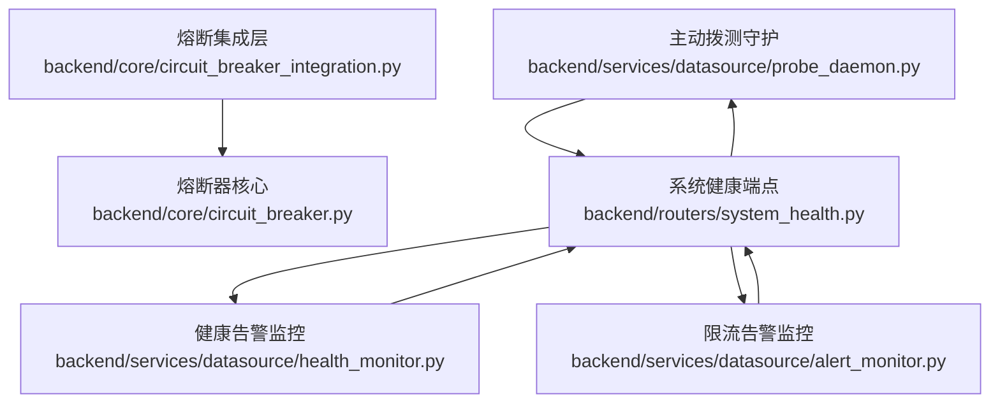
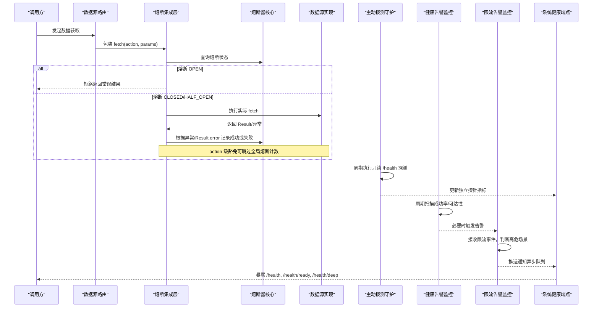
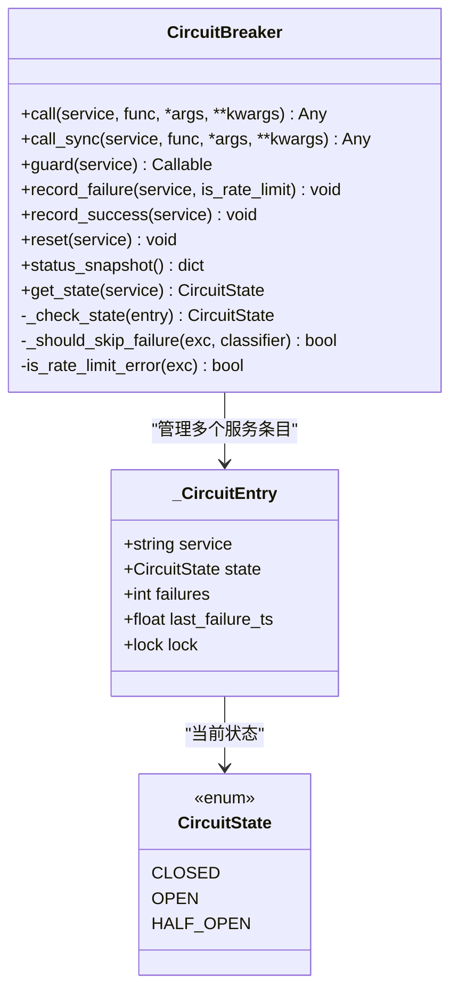
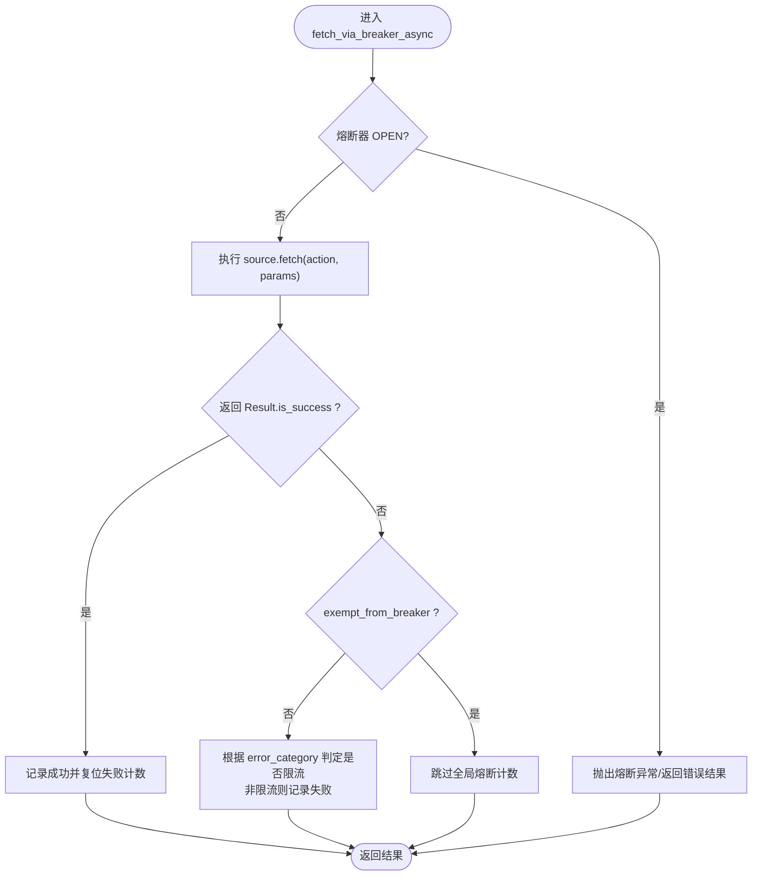
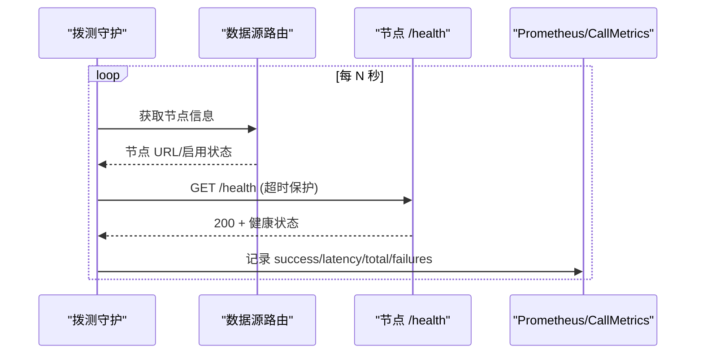
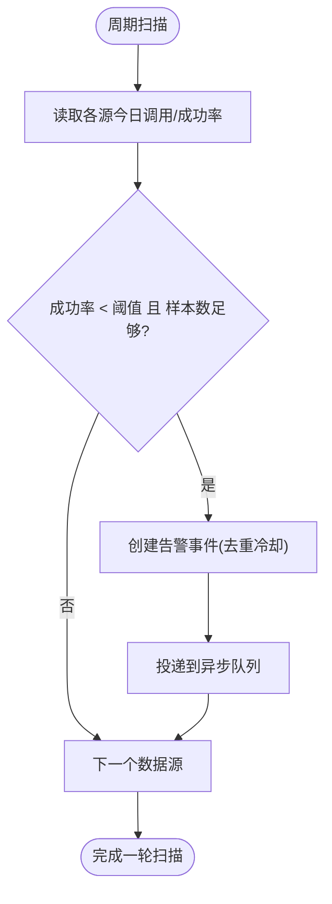
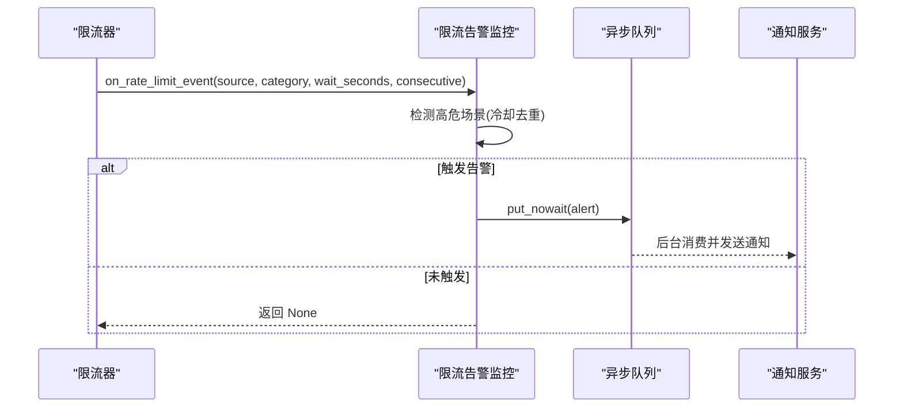
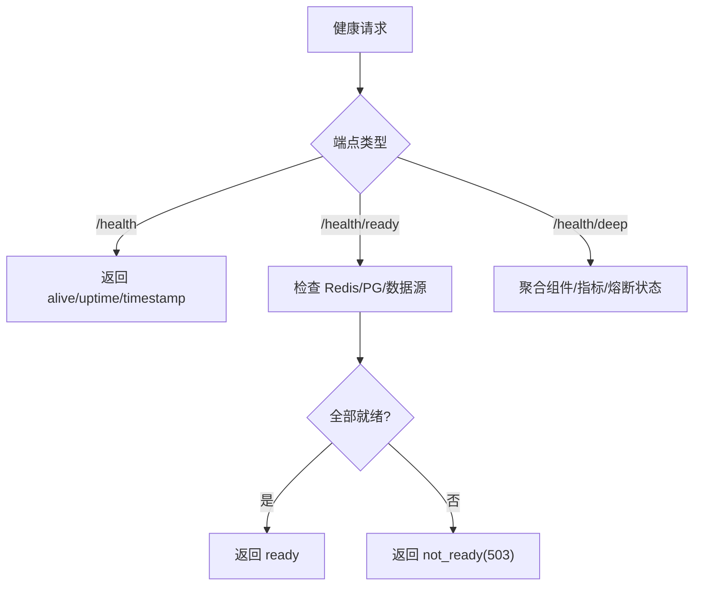
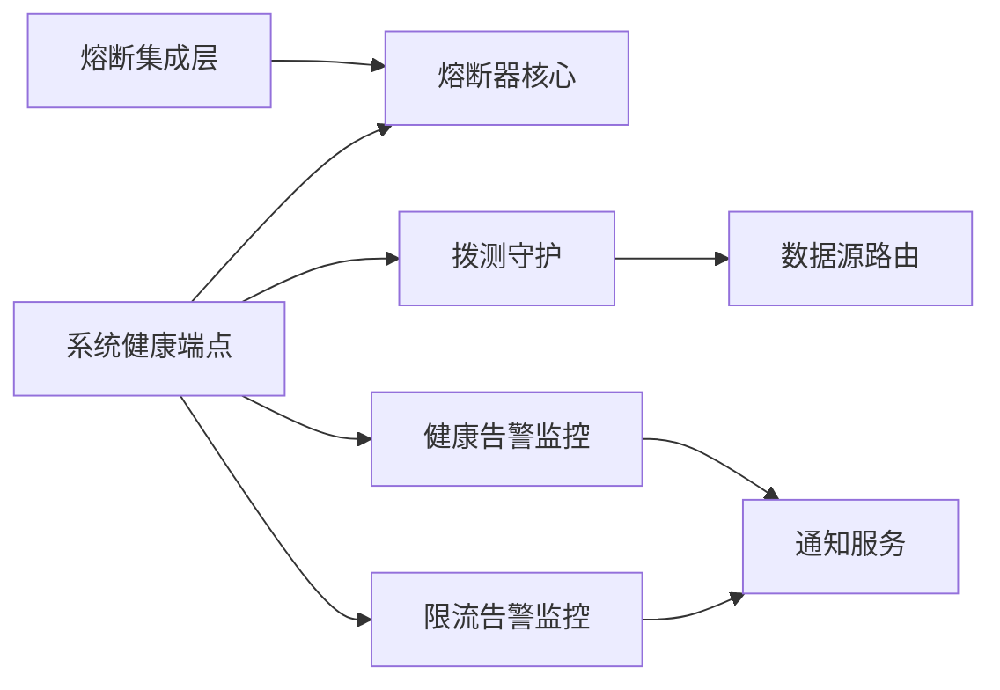

# 健康监控与熔断

<cite>
**本文引用的文件**
- [backend/core/circuit_breaker.py](file://backend/core/circuit_breaker.py)
- [backend/core/circuit_breaker_integration.py](file://backend/core/circuit_breaker_integration.py)
- [backend/services/datasource/probe_daemon.py](file://backend/services/datasource/probe_daemon.py)
- [backend/services/datasource/health_monitor.py](file://backend/services/datasource/health_monitor.py)
- [backend/services/datasource/alert_monitor.py](file://backend/services/datasource/alert_monitor.py)
- [backend/routers/system_health.py](file://backend/routers/system_health.py)
</cite>

## 目录
1. [简介](#简介)
2. [项目结构](#项目结构)
3. [核心组件](#核心组件)
4. [架构总览](#架构总览)
5. [详细组件分析](#详细组件分析)
6. [依赖关系分析](#依赖关系分析)
7. [性能考量](#性能考量)
8. [故障诊断指南](#故障诊断指南)
9. [结论](#结论)
10. [附录](#附录)

## 简介
本文件面向 Quant Agent 的数据源健康监控与熔断机制，系统性阐述主动健康检查、被动故障检测、半开自愈探针等策略；说明熔断器的分级控制（action 级豁免、节点级熔断、进程级熔断）与动态阈值调整；解释限流压力感知、速率限制检测与自适应降级；覆盖探针任务调度、健康状态同步、故障恢复策略；并提供监控指标定义、告警规则配置与故障诊断工具建议，以及性能调优、容量规划与应急预案指导。

## 项目结构
围绕数据源健康与熔断的关键代码分布在以下模块：
- 熔断器核心：统一的状态机、调用包装、失败计数与半开探测
- 熔断集成层：将熔断接入数据源 fetch 主路径，支持 action 级豁免
- 主动拨测：周期性对数据源与 LLM 节点发起只读 /health 探测，记录独立指标
- 健康告警：周期扫描成功率与可达性，触发飞书告警并去重冷却
- 限流告警：在 Throttler 回调中识别高危限流场景并推送告警
- 系统健康端点：暴露 liveness/readiness/deep 诊断与 Prometheus 指标

图表来源
- [backend/core/circuit_breaker.py:64-359](file://backend/core/circuit_breaker.py#L64-L359)
- [backend/core/circuit_breaker_integration.py:40-72](file://backend/core/circuit_breaker_integration.py#L40-L72)
- [backend/services/datasource/probe_daemon.py:71-221](file://backend/services/datasource/probe_daemon.py#L71-L221)
- [backend/services/datasource/health_monitor.py:55-256](file://backend/services/datasource/health_monitor.py#L55-L256)
- [backend/services/datasource/alert_monitor.py:42-291](file://backend/services/datasource/alert_monitor.py#L42-L291)
- [backend/routers/system_health.py:173-355](file://backend/routers/system_health.py#L173-L355)

章节来源
- [backend/core/circuit_breaker.py:64-359](file://backend/core/circuit_breaker.py#L64-L359)
- [backend/core/circuit_breaker_integration.py:40-72](file://backend/core/circuit_breaker_integration.py#L40-L72)
- [backend/services/datasource/probe_daemon.py:71-221](file://backend/services/datasource/probe_daemon.py#L71-L221)
- [backend/services/datasource/health_monitor.py:55-256](file://backend/services/datasource/health_monitor.py#L55-L256)
- [backend/services/datasource/alert_monitor.py:42-291](file://backend/services/datasource/alert_monitor.py#L42-L291)
- [backend/routers/system_health.py:173-355](file://backend/routers/system_health.py#L173-L355)

## 核心组件
- 熔断器核心：提供 CLOSED/OPEN/HALF_OPEN 状态机，支持异步/同步调用包装、装饰器、手动记录成功/失败、状态快照与重置；通过环境变量配置连续失败阈值与冷却时间，避免硬编码。
- 熔断集成层：在数据源 fetch 主路径上统一包裹，OPEN 时直接短路返回错误结果；异常或 Result.error 时按 error_category 判定是否计入失败；支持 exempt_from_breaker 实现 action 级豁免，避免“能力缺失型”扩展 action 污染共享熔断器。
- 主动拨测守护：周期性对数据源节点与 LLM 路由发起只读 /health 探测，写入独立 Prometheus 指标与 call_metrics 探针字段，不写业务熔断/退避计数，避免对已故障源施压。
- 健康告警监控：周期扫描各数据源成功率与可达性，低于阈值且满足最小样本数时触发告警；内置同数据源+类型去重冷却；通过异步队列解耦通知发送。
- 限流告警监控：在 Throttler 回调中识别 IP 封禁、配额耗尽、长时间退避、限流频率飙升等高危场景，推送到异步队列并由后台消费器发送通知；具备冷却去重。
- 系统健康端点：提供 /health（liveness）、/health/ready（readiness）、/health/deep（全链路诊断），聚合 Redis/PG/数据源就绪、采集器心跳、事件循环延迟、线程池使用率、熔断器状态等。

章节来源
- [backend/core/circuit_breaker.py:64-359](file://backend/core/circuit_breaker.py#L64-L359)
- [backend/core/circuit_breaker_integration.py:40-72](file://backend/core/circuit_breaker_integration.py#L40-L72)
- [backend/services/datasource/probe_daemon.py:71-221](file://backend/services/datasource/probe_daemon.py#L71-L221)
- [backend/services/datasource/health_monitor.py:55-256](file://backend/services/datasource/health_monitor.py#L55-L256)
- [backend/services/datasource/alert_monitor.py:42-291](file://backend/services/datasource/alert_monitor.py#L42-L291)
- [backend/routers/system_health.py:173-355](file://backend/routers/system_health.py#L173-L355)

## 架构总览
下图展示从请求进入数据源到熔断、拨测与健康告警的交互流程。

图表来源
- [backend/core/circuit_breaker_integration.py:40-72](file://backend/core/circuit_breaker_integration.py#L40-L72)
- [backend/core/circuit_breaker.py:147-218](file://backend/core/circuit_breaker.py#L147-L218)
- [backend/services/datasource/probe_daemon.py:95-171](file://backend/services/datasource/probe_daemon.py#L95-L171)
- [backend/services/datasource/health_monitor.py:101-147](file://backend/services/datasource/health_monitor.py#L101-L147)
- [backend/services/datasource/alert_monitor.py:77-153](file://backend/services/datasource/alert_monitor.py#L77-L153)
- [backend/routers/system_health.py:173-355](file://backend/routers/system_health.py#L173-L355)

## 详细组件分析

### 熔断器核心（状态机与调用包装）
- 状态机：CLOSED → OPEN（连续失败达到阈值）→ HALF_OPEN（超过冷却时间）→ CLOSED（探测成功）或回 OPEN（探测失败）。
- 调用包装：call()/call_sync() 在 OPEN 时抛出熔断异常；异常处理中通过 error_classifier 或 is_rate_limit_error 钩子区分限流类错误，不计入失败计数。
- 半开自愈：HALF_OPEN 下首次成功即回到 CLOSED，失败则重回 OPEN。
- 可观测性：暴露状态快照、转换指标、冷却时间由环境变量配置。

图表来源
- [backend/core/circuit_breaker.py:45-359](file://backend/core/circuit_breaker.py#L45-L359)

章节来源
- [backend/core/circuit_breaker.py:64-359](file://backend/core/circuit_breaker.py#L64-L359)

### 熔断集成层（数据源主路径接入与 action 级豁免）
- 在 fetch_via_breaker_async 中，若熔断器 OPEN 则直接短路；否则执行 source.fetch，并根据异常或 Result.error 记录失败/成功。
- 支持 exempt_from_breaker=True，用于“能力缺失型”扩展 action 失败不计入全局熔断计数，避免误伤同源核心通道（如 QUOTE/HEALTH）。
- 限流类错误通过 error_category 判定，不计入失败计数，避免被限流误判为故障。

图表来源
- [backend/core/circuit_breaker_integration.py:40-72](file://backend/core/circuit_breaker_integration.py#L40-L72)

章节来源
- [backend/core/circuit_breaker_integration.py:40-72](file://backend/core/circuit_breaker_integration.py#L40-L72)

### 主动拨测守护（只读 /health 探测）
- 周期对数据源节点与 LLM 路由发起只读 /health 探测，仅反映进程存活，不修改节点状态，不污染业务熔断/退避计数。
- 写入独立 Prometheus 指标（success/latency/total/failures）与 call_metrics 探针字段，供健康告警与 Grafana 面板消费。
- 支持注入 node_health_fn 与 llm_health_fn，便于测试与替换。

图表来源
- [backend/services/datasource/probe_daemon.py:95-171](file://backend/services/datasource/probe_daemon.py#L95-L171)
- [backend/services/datasource/probe_daemon.py:183-203](file://backend/services/datasource/probe_daemon.py#L183-L203)

章节来源
- [backend/services/datasource/probe_daemon.py:71-221](file://backend/services/datasource/probe_daemon.py#L71-L221)

### 健康告警监控（成功率与可达性）
- 周期扫描各数据源的成功率与可达性，当成功率低于阈值且满足最小样本数时触发告警；Down 判定基于“已挂载且有调用但成功率极低”近似失联。
- 内置同数据源+类型去重冷却，防止告警风暴；通过异步队列投递通知，避免阻塞扫描主循环。
- 暴露 is_healthy/get_status 用于 /health/deep 诊断。

图表来源
- [backend/services/datasource/health_monitor.py:101-147](file://backend/services/datasource/health_monitor.py#L101-L147)
- [backend/services/datasource/health_monitor.py:187-213](file://backend/services/datasource/health_monitor.py#L187-L213)

章节来源
- [backend/services/datasource/health_monitor.py:55-256](file://backend/services/datasource/health_monitor.py#L55-L256)

### 限流告警监控（速率限制检测与自适应降级）
- 在 Throttler.on_rate_limit() 回调中实时检测高危限流场景：IP 封禁、配额耗尽、长时间退避、限流频率飙升。
- 通过异步队列解耦通知发送，具备冷却去重；支持 is_healthy 暴露运行态。
- 与熔断器协同：限流类错误不计入熔断失败计数，避免误判。

图表来源
- [backend/services/datasource/alert_monitor.py:77-153](file://backend/services/datasource/alert_monitor.py#L77-L153)
- [backend/services/datasource/alert_monitor.py:185-210](file://backend/services/datasource/alert_monitor.py#L185-L210)
- [backend/services/datasource/alert_monitor.py:255-271](file://backend/services/datasource/alert_monitor.py#L255-L271)

章节来源
- [backend/services/datasource/alert_monitor.py:42-291](file://backend/services/datasource/alert_monitor.py#L42-L291)

### 系统健康端点（liveness/readiness/deep）
- /health：进程存活即 200，不依赖外部依赖，适合 K8s livenessProbe。
- /health/ready：Redis + Postgres + 至少一个数据源连通才返回 200，否则 503，适合 readinessProbe。
- /health/deep：聚合组件健康、PG/数据源就绪、采集器心跳、WS 连接数、线程池使用率、事件循环延迟、熔断器状态等，便于全链路诊断。

图表来源
- [backend/routers/system_health.py:173-246](file://backend/routers/system_health.py#L173-L246)
- [backend/routers/system_health.py:249-355](file://backend/routers/system_health.py#L249-L355)

章节来源
- [backend/routers/system_health.py:173-355](file://backend/routers/system_health.py#L173-L355)

## 依赖关系分析
- 熔断器核心依赖日志、指标与异常类型；集成层依赖熔断器与数据源 Result 形态；拨测守护依赖路由节点信息与 HTTP 客户端；健康/限流告警监控依赖通知服务与异步队列；系统健康端点聚合各组件状态。
- 关键耦合点：
  - 集成层与熔断器：通过 error_category 与 is_rate_limit_error 解耦限流与故障判定。
  - 拨测守护与路由：只读 /health 探测，不修改节点状态，避免副作用。
  - 健康/限流告警与通知服务：通过异步队列解耦 IO，保证热路径稳定。
  - 系统健康端点与各组件：以只读方式聚合状态，异常时降级为 unknown。

图表来源
- [backend/core/circuit_breaker_integration.py:40-72](file://backend/core/circuit_breaker_integration.py#L40-L72)
- [backend/services/datasource/probe_daemon.py:138-171](file://backend/services/datasource/probe_daemon.py#L138-L171)
- [backend/services/datasource/health_monitor.py:101-147](file://backend/services/datasource/health_monitor.py#L101-L147)
- [backend/services/datasource/alert_monitor.py:77-153](file://backend/services/datasource/alert_monitor.py#L77-L153)
- [backend/routers/system_health.py:249-355](file://backend/routers/system_health.py#L249-L355)

章节来源
- [backend/core/circuit_breaker_integration.py:40-72](file://backend/core/circuit_breaker_integration.py#L40-L72)
- [backend/services/datasource/probe_daemon.py:138-171](file://backend/services/datasource/probe_daemon.py#L138-L171)
- [backend/services/datasource/health_monitor.py:101-147](file://backend/services/datasource/health_monitor.py#L101-L147)
- [backend/services/datasource/alert_monitor.py:77-153](file://backend/services/datasource/alert_monitor.py#L77-L153)
- [backend/routers/system_health.py:249-355](file://backend/routers/system_health.py#L249-L355)

## 性能考量
- 熔断器：
  - 通过环境变量配置连续失败阈值与冷却时间，避免硬编码导致的不灵活；半开探测减少无效重试，降低雪崩风险。
  - 限流类错误不计入失败计数，避免误判；支持 per-call 动态分类器，提升判定精度。
- 拨测守护：
  - 只读 /health 探测，超时保护，不写业务状态；独立指标维度，不影响业务吞吐。
- 健康/限流告警：
  - 异步队列解耦通知 IO，避免阻塞扫描/回调；冷却去重防止告警风暴。
- 系统健康端点：
  - 深度诊断聚合各组件状态，异常时降级为 unknown，不阻断诊断接口；事件循环延迟测量辅助定位拥塞。

[本节为通用性能指导，无需特定文件引用]

## 故障诊断指南
- 快速定位：
  - 访问 /health/liveness 确认进程存活；/health/ready 确认基础设施就绪；/health/deep 查看组件健康、熔断状态、事件循环延迟等。
- 熔断相关：
  - 通过 status_snapshot 或 /health/deep 中的 circuit_breaker_states 查看各服务熔断状态；若频繁 OPEN，检查 error_category 与 is_rate_limit_error 判定逻辑。
- 拨测相关：
  - 检查 DATASOURCE_PROBE_* 指标与 call_metrics 探针字段，确认节点 /health 可达性与延迟。
- 告警相关：
  - 健康告警监控：查看成功率劣化与 Down 判定；限流告警监控：关注 IP 封禁、配额耗尽、长时间退避、限流频率飙升。
- 恢复策略：
  - 手动 reset 熔断器（运维恢复）；调整冷却时间与失败阈值；修复数据源网络或权限问题后观察自动恢复。

章节来源
- [backend/routers/system_health.py:173-355](file://backend/routers/system_health.py#L173-L355)
- [backend/core/circuit_breaker.py:341-359](file://backend/core/circuit_breaker.py#L341-L359)
- [backend/services/datasource/probe_daemon.py:122-136](file://backend/services/datasource/probe_daemon.py#L122-L136)
- [backend/services/datasource/health_monitor.py:101-147](file://backend/services/datasource/health_monitor.py#L101-L147)
- [backend/services/datasource/alert_monitor.py:77-153](file://backend/services/datasource/alert_monitor.py#L77-L153)

## 结论
Quant Agent 的健康监控与熔断机制通过“主动拨测 + 被动检测 + 半开自愈”的组合策略，实现了高可用的数据源访问；熔断器与限流告警协同，避免限流误判与告警风暴；系统健康端点提供分层诊断能力，便于快速定位与恢复。结合指标、告警与工具链，可在复杂环境下保障数据源的稳定性与可观测性。

[本节为总结性内容，无需特定文件引用]

## 附录

### 监控指标定义（节选）
- 熔断器指标：
  - CIRCUIT_BREAKER_STATE：服务熔断状态（0=closed, 1=half_open, 2=open）
  - CIRCUIT_BREAKER_TRANSITIONS：状态转换计数（from_state/to_state）
- 拨测指标：
  - DATASOURCE_PROBE_SUCCESS：探针成功（0/1）
  - DATASOURCE_PROBE_LATENCY：探针延迟（毫秒）
  - DATASOURCE_PROBE_TOTAL：探针总次数（按 status 标签）
  - DATASOURCE_PROBE_FAILURES：探针失败次数（按 error_type 标签）
- 系统健康：
  - ws_connections/ws_messages_sent/ws_messages_dropped/ws_subscriptions：WebSocket 连接与消息统计
  - event_loop_lag_seconds：事件循环延迟
  - redis_queue_depth：Redis 队列深度

章节来源
- [backend/core/circuit_breaker.py:36-37](file://backend/core/circuit_breaker.py#L36-L37)
- [backend/services/datasource/probe_daemon.py:38-43](file://backend/services/datasource/probe_daemon.py#L38-L43)
- [backend/routers/system_health.py:342-354](file://backend/routers/system_health.py#L342-L354)

### 告警规则配置（建议）
- 健康告警：
  - 成功率 < 95% 且当日调用 ≥ 20 次触发；Down 判定基于“已挂载且有调用但成功率极低”。
  - 冷却期：同数据源+类型 15 分钟内不重复告警。
- 限流告警：
  - IP 封禁/配额耗尽立即告警；退避 > 2 分钟警告；5 分钟内限流 > 10 次告警。
  - 冷却期：同数据源+类型 15 分钟内不重复告警。

章节来源
- [backend/services/datasource/health_monitor.py:37-42](file://backend/services/datasource/health_monitor.py#L37-L42)
- [backend/services/datasource/alert_monitor.py:50-56](file://backend/services/datasource/alert_monitor.py#L50-L56)

### 性能调优建议
- 熔断器：
  - 合理设置连续失败阈值与冷却时间，避免过于敏感或迟钝；利用 error_classifier 精确区分限流与故障。
- 拨测守护：
  - 调整 PROBE_INTERVAL_SECONDS 平衡观测粒度与开销；确保 /health 端点轻量高效。
- 告警：
  - 优化冷却期与阈值，避免告警风暴；确保通知服务可用性与幂等性。
- 系统健康：
  - 定期评估事件循环延迟与线程池使用率，及时扩容或优化热点路径。

[本节为通用指导，无需特定文件引用]

### 容量规划指导
- 数据源节点：
  - 根据拨测延迟与成功率规划节点数量与地域分布；考虑峰值 QPS 与超时策略。
- 告警与通知：
  - 评估通知服务吞吐与队列深度，避免堆积；设置合理的队列大小与丢弃策略。
- 熔断与限流：
  - 结合业务 SLA 设定阈值；监控限流频率与退避时间，动态调整。

[本节为通用指导，无需特定文件引用]

### 应急预案制定
- 熔断误判：
  - 立即 reset 熔断器；排查 error_category 与 is_rate_limit_error 判定；临时放宽阈值。
- 数据源不可用：
  - 切换备用节点或降级策略；检查网络与认证；观察拨测指标恢复情况。
- 告警风暴：
  - 提高冷却期；检查通知服务可用性；临时屏蔽非关键告警。
- 系统过载：
  - 降低拨测频率；暂停非核心功能；扩容资源或限流。

[本节为通用指导，无需特定文件引用]