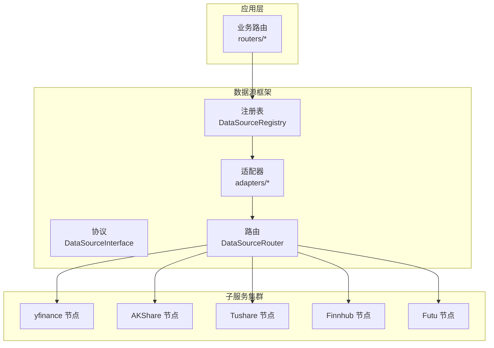
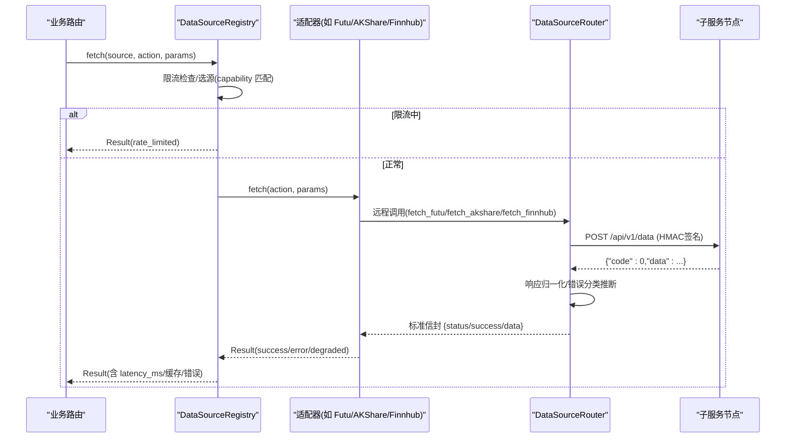
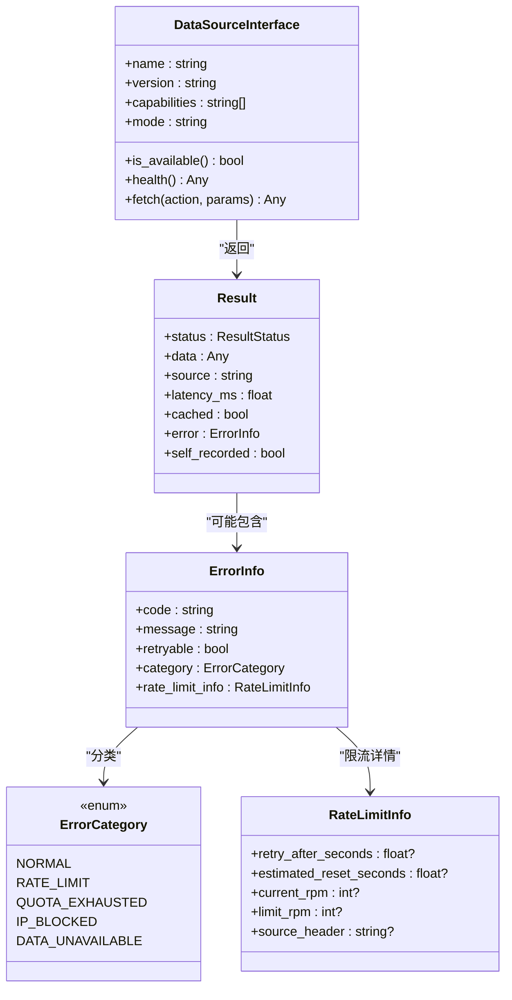
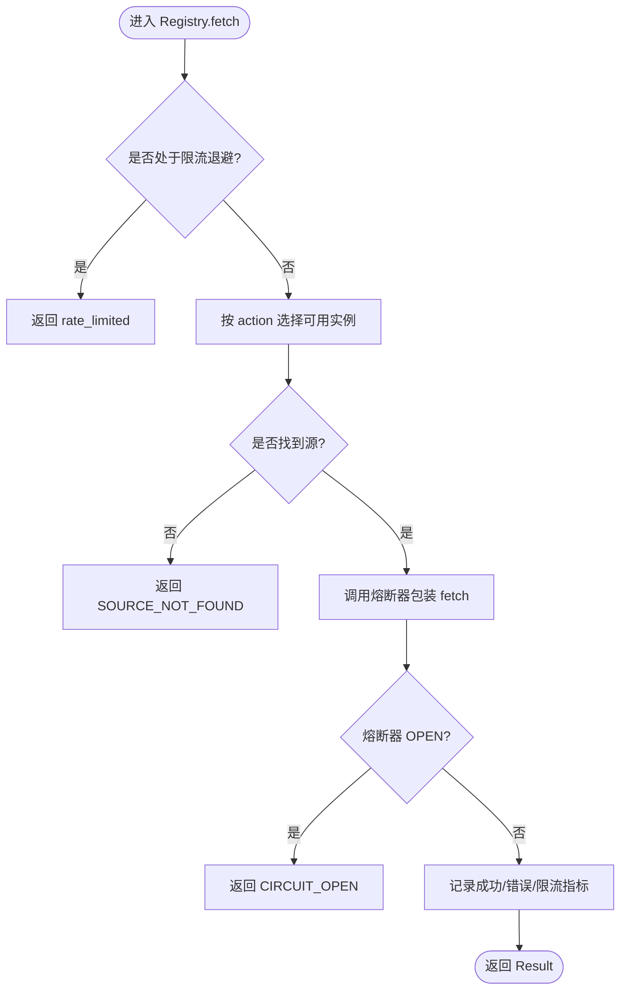
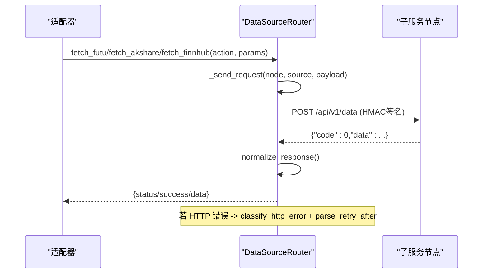
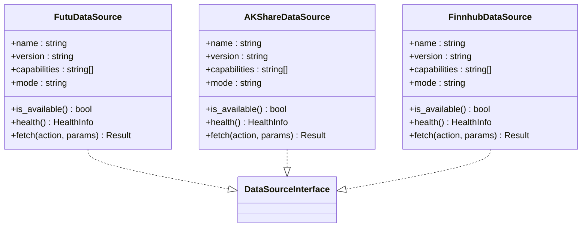
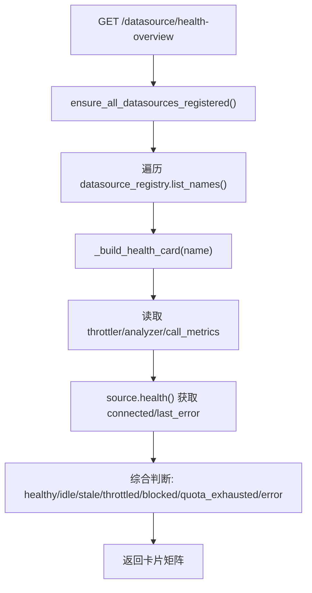
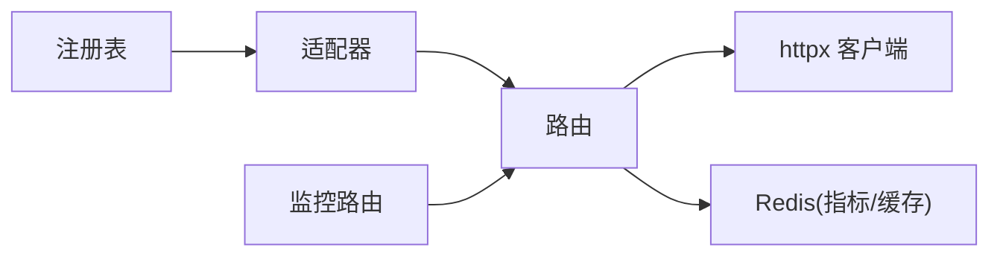

# 协议标准化处理

<cite>
**本文引用的文件**
- [backend/services/datasource/__init__.py](file://backend/services/datasource/__init__.py)
- [backend/services/datasource/protocol.py](file://backend/services/datasource/protocol.py)
- [backend/services/datasource/source_registry.py](file://backend/services/datasource/source_registry.py)
- [backend/services/datasource/router.py](file://backend/services/datasource/router.py)
- [backend/routers/datasource.py](file://backend/routers/datasource.py)
- [backend/services/datasource/adapters/akshare.py](file://backend/services/datasource/adapters/akshare.py)
- [backend/services/datasource/adapters/futu.py](file://backend/services/datasource/adapters/futu.py)
- [backend/services/datasource/adapters/finnhub.py](file://backend/services/datasource/adapters/finnhub.py)
</cite>

## 目录
1. [简介](#简介)
2. [项目结构](#项目结构)
3. [核心组件](#核心组件)
4. [架构总览](#架构总览)
5. [详细组件分析](#详细组件分析)
6. [依赖关系分析](#依赖关系分析)
7. [性能与缓存](#性能与缓存)
8. [故障排查指南](#故障排查指南)
9. [结论](#结论)
10. [附录：协议扩展指南](#附录协议扩展指南)

## 简介
本文件面向 Quant Agent 的数据源协议标准化，聚焦统一数据接口抽象、协议转换机制、多数据源适配层（REST API、WebSocket、SDK调用）的规范化实现。文档覆盖请求参数标准化、响应数据归一化、错误信息统一化处理；并说明数据源能力探测、版本协商与向后兼容性保证；最后提供协议扩展指南（新数据源接入、接口契约定义、测试用例编写）以及性能优化策略（缓存、批量、限流退避与熔断）。

## 项目结构
数据源协议标准化由“统一协议 + 注册表 + 适配器 + 路由 + 监控/健康”五层构成：
- 统一协议：DataSourceInterface 定义所有数据源必须实现的接口（name/version/capabilities/mode/is_available/health/fetch）。
- 注册表：DataSourceRegistry 负责实例注册、按 action 选择可用实例、主路径 fetch 编排（限流检查、熔断、指标记录）。
- 适配器：各数据源（Futu/AKShare/Finnhub/Tushare/Macro/Search 等）以 DataSourceInterface 形式接入，内部通过 data_source_router 远程调用子服务。
- 路由：DataSourceRouter 维护节点拓扑、HMAC 签名、action 映射、错误分类推断、半开自愈探针、节点级/动作级熔断。
- 监控与健康：routers/datasource.py 暴露限流分析、健康看板、延迟分布、错误率趋势、可用性时间线、WS 实时推送等观测能力。

图表来源
- [backend/services/datasource/protocol.py:12-46](file://backend/services/datasource/protocol.py#L12-L46)
- [backend/services/datasource/source_registry.py:41-259](file://backend/services/datasource/source_registry.py#L41-L259)
- [backend/services/datasource/router.py:249-579](file://backend/services/datasource/router.py#L249-L579)
- [backend/services/datasource/adapters/akshare.py:25-144](file://backend/services/datasource/adapters/akshare.py#L25-L144)
- [backend/services/datasource/adapters/futu.py:34-199](file://backend/services/datasource/adapters/futu.py#L34-L199)
- [backend/services/datasource/adapters/finnhub.py:29-170](file://backend/services/datasource/adapters/finnhub.py#L29-L170)

章节来源
- [backend/services/datasource/protocol.py:12-46](file://backend/services/datasource/protocol.py#L12-L46)
- [backend/services/datasource/source_registry.py:41-259](file://backend/services/datasource/source_registry.py#L41-L259)
- [backend/services/datasource/router.py:249-579](file://backend/services/datasource/router.py#L249-L579)
- [backend/routers/datasource.py:65-153](file://backend/routers/datasource.py#L65-L153)

## 核心组件
- 统一返回模型与错误体系
  - Result/ResultStatus：统一成功/错误/降级/限流状态，携带 source、latency_ms、cached、error 等元信息。
  - ErrorInfo/ErrorCategory：区分普通错误与限流类错误（rate_limit/quota_exhausted/ip_blocked/data_unavailable），并提供快捷构造方法。
  - RateLimitInfo/RateLimitStatus/HealthInfo：限流详情、限流状态与健康信息，用于监控与决策。
- 统一协议
  - DataSourceInterface：强制 name/version/capabilities/mode/is_available/health/fetch，确保所有数据源可被统一调度。
- 注册表与主路径
  - DataSourceRegistry.fetch：限流检查 → 选源（按 capability 严格匹配）→ 熔断器包装 → 结果统计（成功率/延迟/限流/可用性）。
- 路由与协议转换
  - DataSourceRouter：维护节点、action 映射、HMAC 签名、响应归一化、错误分类推断、半开自愈探针、动作级熔断隔离。
- 适配器
  - Futu/AKShare/Finnhub 等适配器仅远程调用 data_source_router，不持有本地 SDK 兜底；将子服务信封解包为 Result。
- 监控与健康
  - routers/datasource.py：限流分析、健康概览、延迟分布、错误率趋势、可用性时间线、WS 实时推送与链路探测。

章节来源
- [backend/services/datasource/__init__.py:23-467](file://backend/services/datasource/__init__.py#L23-L467)
- [backend/services/datasource/protocol.py:12-46](file://backend/services/datasource/protocol.py#L12-L46)
- [backend/services/datasource/source_registry.py:140-259](file://backend/services/datasource/source_registry.py#L140-L259)
- [backend/services/datasource/router.py:59-220](file://backend/services/datasource/router.py#L59-L220)
- [backend/services/datasource/adapters/akshare.py:25-144](file://backend/services/datasource/adapters/akshare.py#L25-L144)
- [backend/services/datasource/adapters/futu.py:34-199](file://backend/services/datasource/adapters/futu.py#L34-L199)
- [backend/services/datasource/adapters/finnhub.py:29-170](file://backend/services/datasource/adapters/finnhub.py#L29-L170)
- [backend/routers/datasource.py:65-153](file://backend/routers/datasource.py#L65-L153)

## 架构总览
下图展示从业务路由到数据源的完整调用链，包括参数标准化、协议转换、错误分类与限流/熔断控制。

图表来源
- [backend/services/datasource/source_registry.py:140-259](file://backend/services/datasource/source_registry.py#L140-L259)
- [backend/services/datasource/router.py:669-748](file://backend/services/datasource/router.py#L669-L748)
- [backend/services/datasource/adapters/futu.py:130-180](file://backend/services/datasource/adapters/futu.py#L130-L180)
- [backend/services/datasource/adapters/akshare.py:98-129](file://backend/services/datasource/adapters/akshare.py#L98-L129)
- [backend/services/datasource/adapters/finnhub.py:95-156](file://backend/services/datasource/adapters/finnhub.py#L95-L156)

## 详细组件分析

### 统一协议与返回模型
- DataSourceInterface：强制 name/version/capabilities/mode/is_available/health/fetch，确保所有数据源具备能力声明与统一入口。
- Result/ResultStatus：统一成功/错误/降级/限流状态，附带 source、latency_ms、cached、self_recorded 等元信息，便于上层一致处理。
- ErrorInfo/ErrorCategory：将错误分为 normal 与限流类（rate_limit/quota_exhausted/ip_blocked/data_unavailable），限流类错误触发独立退避机制，不计入熔断失败计数。
- HealthInfo/RateLimitStatus：健康信息与限流状态，嵌入监控与看板。

图表来源
- [backend/services/datasource/protocol.py:12-46](file://backend/services/datasource/protocol.py#L12-L46)
- [backend/services/datasource/__init__.py:218-307](file://backend/services/datasource/__init__.py#L218-L307)
- [backend/services/datasource/__init__.py:100-211](file://backend/services/datasource/__init__.py#L100-L211)
- [backend/services/datasource/__init__.py:54-93](file://backend/services/datasource/__init__.py#L54-L93)

章节来源
- [backend/services/datasource/protocol.py:12-46](file://backend/services/datasource/protocol.py#L12-L46)
- [backend/services/datasource/__init__.py:23-467](file://backend/services/datasource/__init__.py#L23-L467)

### 注册表与主路径编排
- 能力严格匹配：get(source_name, action) 按 capabilities 精确匹配，避免静默回退导致“按 action 选源”语义失效。
- 限流前置：在 should_throttle 时直接返回 rate_limited，不调用具体源，避免加剧限流。
- 熔断保护：通过 fetch_via_breaker_async 包装，OPEN 时短路返回错误，减少雪崩风险。
- 指标与统计：成功/错误/限流均记录延迟、成功率、可用性、Prometheus 指标，支持监控与告警。

图表来源
- [backend/services/datasource/source_registry.py:98-133](file://backend/services/datasource/source_registry.py#L98-L133)
- [backend/services/datasource/source_registry.py:140-259](file://backend/services/datasource/source_registry.py#L140-L259)

章节来源
- [backend/services/datasource/source_registry.py:98-259](file://backend/services/datasource/source_registry.py#L98-L259)

### 路由与协议转换
- Action 映射：_YF_ACTION_MAP/_TS_ACTION_MAP/_FUTU_ACTION_MAP/_FINNHUB_ACTION_MAP 将主服务内部 action 转换为子服务 action。
- HMAC 签名：对实际发送 body 做 HMAC-SHA256 签名，与子服务 verify_hmac 严格一致，防止 403。
- 响应归一化：_normalize_response 将子服务的 code/data 信封转换为 status/success/data 格式，并剥除内层嵌套信封。
- 错误分类推断：_infer_error_category 优先采用 error_category，否则基于 message 文本特征识别限流/配额耗尽/IP封禁/数据不可用。
- 半开自愈探针：周期性对 unhealthy/熔断中的节点发起轻量探活，恢复后重置状态。
- 动作级熔断隔离：单 action 连续失败达到阈值仅熔断该 action，避免整节点误杀。

图表来源
- [backend/services/datasource/router.py:59-140](file://backend/services/datasource/router.py#L59-L140)
- [backend/services/datasource/router.py:586-660](file://backend/services/datasource/router.py#L586-L660)
- [backend/services/datasource/router.py:669-748](file://backend/services/datasource/router.py#L669-L748)
- [backend/services/datasource/router.py:190-220](file://backend/services/datasource/router.py#L190-L220)

章节来源
- [backend/services/datasource/router.py:59-220](file://backend/services/datasource/router.py#L59-L220)
- [backend/services/datasource/router.py:586-748](file://backend/services/datasource/router.py#L586-L748)

### 适配器实现（REST/WS/SDK）
- Futu 适配器：仅远程，通过 data_source_router.fetch_futu 调用 OpenD 宿主；解包多层信封；识别限流/配额/封禁并返回 Result。
- AKShare 适配器：仅远程，经 data_source_router.fetch_akshare；校验 action 是否在 capabilities；将子服务信封转为 Result。
- Finnhub 适配器：仅远程，经 data_source_router.fetch_finnhub；根据 error_category 或消息文本识别限流/配额/IP封禁；标记 self_recorded 避免重复记录。

图表来源
- [backend/services/datasource/adapters/futu.py:34-199](file://backend/services/datasource/adapters/futu.py#L34-L199)
- [backend/services/datasource/adapters/akshare.py:25-144](file://backend/services/datasource/adapters/akshare.py#L25-L144)
- [backend/services/datasource/adapters/finnhub.py:29-170](file://backend/services/datasource/adapters/finnhub.py#L29-L170)
- [backend/services/datasource/protocol.py:12-46](file://backend/services/datasource/protocol.py#L12-L46)

章节来源
- [backend/services/datasource/adapters/futu.py:34-199](file://backend/services/datasource/adapters/futu.py#L34-L199)
- [backend/services/datasource/adapters/akshare.py:25-144](file://backend/services/datasource/adapters/akshare.py#L25-L144)
- [backend/services/datasource/adapters/finnhub.py:29-170](file://backend/services/datasource/adapters/finnhub.py#L29-L170)

### 监控与健康（限流/延迟/可用性）
- 限流分析：/datasource/{name}/rate-limit-analysis 返回估计 RPM、推荐间隔、高峰时段、平均恢复时间与置信度。
- 健康概览：/datasource/health-overview 聚合各源状态（healthy/idle/stale/throttled/blocked/quota_exhausted/error），并显示延迟分位、成功率、限流次数。
- 延迟分布：/datasource/{name}/latency-distribution 读取 Redis 样本并按桶统计直方图。
- 错误率趋势：/datasource/{name}/error-rate-trend 返回过去 N 小时错误率时间序列。
- 可用性时间线：/datasource/{name}/availability-timeline 返回过去 N 小时可用性状态序列。
- WS 实时推送：/datasource/ws/health 每 15s 推送 overview，并在状态由非 STALE 转为 STALE 时推送 alert。

图表来源
- [backend/routers/datasource.py:196-300](file://backend/routers/datasource.py#L196-L300)
- [backend/routers/datasource.py:354-455](file://backend/routers/datasource.py#L354-L455)
- [backend/routers/datasource.py:645-707](file://backend/routers/datasource.py#L645-L707)

章节来源
- [backend/routers/datasource.py:65-153](file://backend/routers/datasource.py#L65-L153)
- [backend/routers/datasource.py:196-300](file://backend/routers/datasource.py#L196-L300)
- [backend/routers/datasource.py:354-455](file://backend/routers/datasource.py#L354-L455)
- [backend/routers/datasource.py:645-707](file://backend/routers/datasource.py#L645-L707)

## 依赖关系分析
- 耦合与内聚
  - 适配器与路由强耦合：适配器仅调用 data_source_router，不直连外部 SDK，提升内聚性。
  - 注册表与协议强内聚：DataSourceInterface 约束所有适配器行为，注册表负责编排与统计。
  - 路由与子服务弱耦合：通过统一端点与 HMAC 签名通信，屏蔽子服务差异。
- 循环依赖
  - 适配器通过延迟导入 router，避免启动期循环导入。
- 外部依赖
  - httpx 异步客户端用于子服务通信；Redis 用于指标持久化；Prometheus 指标导出。

图表来源
- [backend/services/datasource/adapters/akshare.py:62-68](file://backend/services/datasource/adapters/akshare.py#L62-L68)
- [backend/services/datasource/adapters/futu.py:85-97](file://backend/services/datasource/adapters/futu.py#L85-L97)
- [backend/services/datasource/adapters/finnhub.py:59-65](file://backend/services/datasource/adapters/finnhub.py#L59-L65)
- [backend/services/datasource/router.py:662-668](file://backend/services/datasource/router.py#L662-L668)

章节来源
- [backend/services/datasource/router.py:662-668](file://backend/services/datasource/router.py#L662-L668)
- [backend/services/datasource/adapters/akshare.py:62-68](file://backend/services/datasource/adapters/akshare.py#L62-L68)
- [backend/services/datasource/adapters/futu.py:85-97](file://backend/services/datasource/adapters/futu.py#L85-L97)
- [backend/services/datasource/adapters/finnhub.py:59-65](file://backend/services/datasource/adapters/finnhub.py#L59-L65)

## 性能与缓存
- 限流退避与熔断
  - 注册表在 fetch 前进行限流检查，避免雪崩；熔断器 OPEN 时短路返回错误。
  - 动作级熔断隔离：小节点（如 search_master）需全部 action 熔断才整节点熔断，避免误杀。
- 缓存机制
  - AKShare 热点数据缓存：_AK_CACHE_PREFIX/_AK_CACHE_TTL 配置，减少上游压力。
  - AKShare STALE 缓存：_AK_STALE_PREFIX/_AK_STALE_TTL 配置，避免频繁探测不可用数据。
- 批量处理
  - yfinance 支持 BATCH_QUOTE 动作，降低多次请求开销。
- 延迟统计与可视化
  - 延迟样本写入 Redis，按桶统计直方图；P50/P95 等分位数用于性能评估。
- 并发控制
  - 链接测试并发上限：TEST_LINK_MAX_CONCURRENT 限制同时在飞的上游探测数，避免事件循环阻塞。

章节来源
- [backend/services/datasource/router.py:142-159](file://backend/services/datasource/router.py#L142-L159)
- [backend/services/datasource/router.py:603-660](file://backend/services/datasource/router.py#L603-L660)
- [backend/routers/datasource.py:458-474](file://backend/routers/datasource.py#L458-L474)
- [backend/routers/datasource.py:354-413](file://backend/routers/datasource.py#L354-L413)

## 故障排查指南
- 常见错误与分类
  - 429 频率限流：归类为 rate_limit，触发独立退避；解析 Retry-After。
  - 403 封禁：若 header 含 block reason 含 rate/limit/throttl 则视为 ip_blocked。
  - 402 配额耗尽：归类为 quota_exhausted，带 estimated_reset。
  - 数据不可用：如指数/停牌股，归类为 data_unavailable，不计入熔断失败。
- 健康看板诊断
  - 使用 /datasource/health-overview 查看各源状态；关注 connected、latency_p95、success_rate、rate_limit_count。
  - 使用 /datasource/{name}/latency-distribution 与 /error-rate-trend 定位异常时段。
- 主动链路探测
  - 使用 /datasource/{name}/test-link 进行真实链路探测；若处于退避冷却期会跳过探测并返回剩余时间。
- 熔断与自愈
  - 路由启动时 reset_circuit_breakers 清空残留；半开探针周期性恢复 healthy。
  - 动作级熔断隔离避免小节点误杀。

章节来源
- [backend/services/datasource/__init__.py:379-424](file://backend/services/datasource/__init__.py#L379-L424)
- [backend/routers/datasource.py:196-300](file://backend/routers/datasource.py#L196-L300)
- [backend/routers/datasource.py:487-643](file://backend/routers/datasource.py#L487-L643)
- [backend/services/datasource/router.py:293-387](file://backend/services/datasource/router.py#L293-L387)

## 结论
Quant Agent 的数据源协议标准化通过统一接口、注册表、适配器与路由实现了跨 REST/WS/SDK 的多数据源接入与治理。错误分类、限流退避、熔断隔离与监控健康构成了高可用的数据访问基座。通过能力声明与 action 映射，系统具备良好的可扩展性与向后兼容性。建议在新数据源接入时严格遵循 DataSourceInterface，完善 capabilities 与错误分类，并通过监控与测试保障稳定性。

## 附录：协议扩展指南
- 新数据源接入步骤
  - 实现 DataSourceInterface：定义 name/version/capabilities/mode/is_available/health/fetch。
  - 注册适配器：通过 ensure_xxx_registered() 幂等注册到 DataSourceRegistry。
  - 添加 action 映射：在 DataSourceRouter 中添加 _XXX_ACTION_MAP，将内部 action 映射到子服务 action。
  - 错误分类：在适配器或路由中正确设置 ErrorCategory（rate_limit/quota_exhausted/ip_blocked/data_unavailable）。
  - 监控接入：确保 health() 返回 HealthInfo，支持 /health-overview 与 WS 推送。
- 接口契约定义
  - 请求参数标准化：params 字典键名与类型需稳定；必要时在适配器层做校验与转换。
  - 响应数据归一化：子服务返回 {code,data} 将被路由归一化为 {status,success,data}；适配器需解包多层信封。
  - 错误信息统一化：ErrorInfo.code/message/retryable/category 必须填充，便于上层一致处理。
- 测试用例编写
  - 单元测试：验证 capabilities 匹配、action 不支持时的错误码、限流返回 rate_limited。
  - 集成测试：模拟子服务响应（成功/错误/限流/配额耗尽/封禁），验证 Result 结构与指标记录。
  - 健康测试：调用 /datasource/{name}/test-link 验证连通性与延迟；检查 WS 推送是否正常。
- 性能优化建议
  - 启用批量动作（如 BATCH_QUOTE）减少请求次数。
  - 合理配置 AKShare 热点缓存与 STALE TTL，降低上游压力。
  - 调整动作级熔断阈值（DATASOURCE_ACTION_MAX_FAILURES/DATASOURCE_ACTION_NODE_RATIO）以适应不同节点规模。
  - 使用延迟分布与错误率趋势监控定位瓶颈。

章节来源
- [backend/services/datasource/protocol.py:12-46](file://backend/services/datasource/protocol.py#L12-L46)
- [backend/services/datasource/source_registry.py:55-73](file://backend/services/datasource/source_registry.py#L55-L73)
- [backend/services/datasource/router.py:61-140](file://backend/services/datasource/router.py#L61-L140)
- [backend/services/datasource/router.py:150-175](file://backend/services/datasource/router.py#L150-L175)
- [backend/routers/datasource.py:487-643](file://backend/routers/datasource.py#L487-L643)