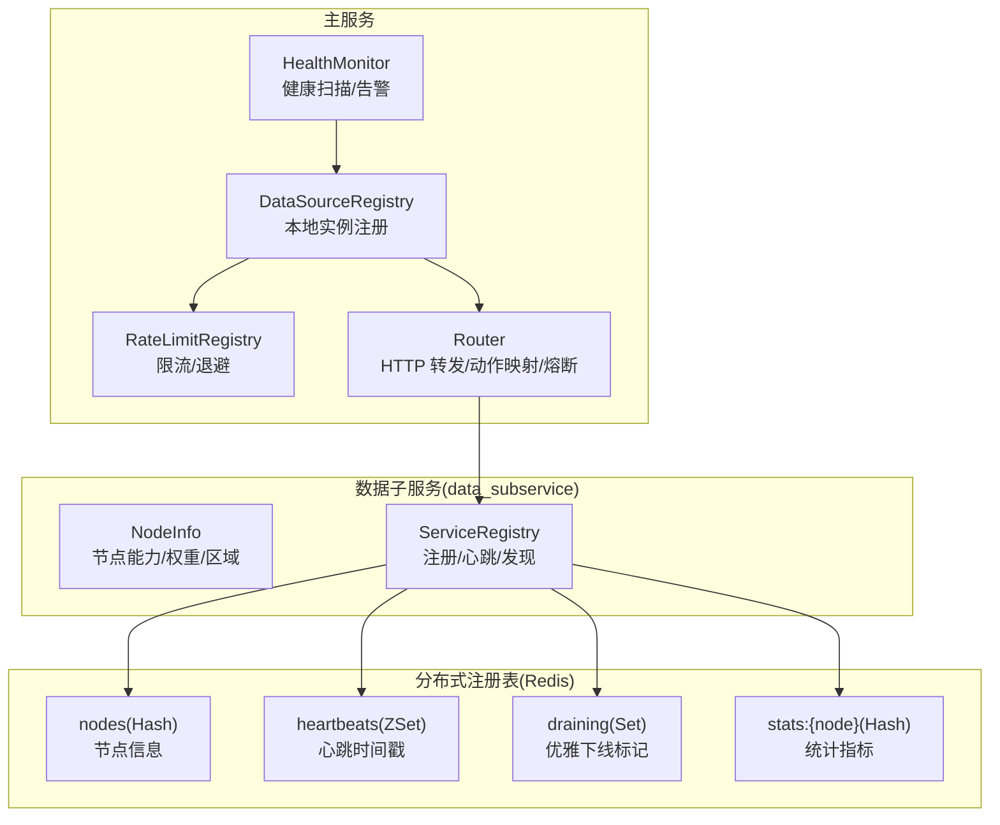
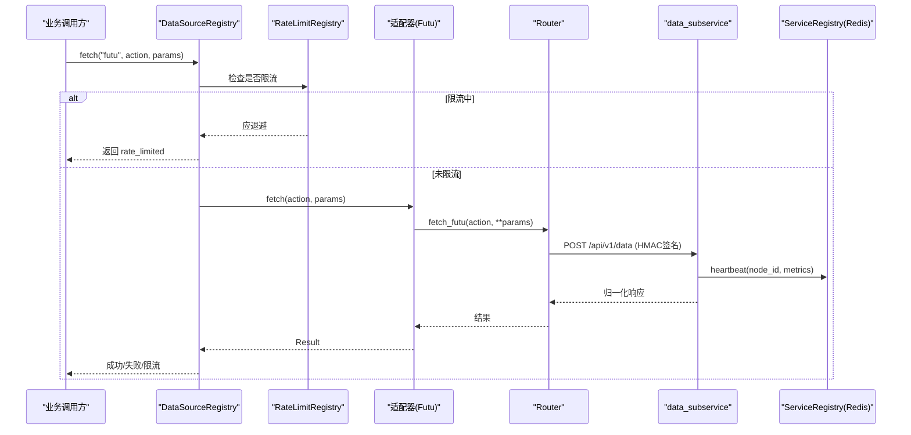
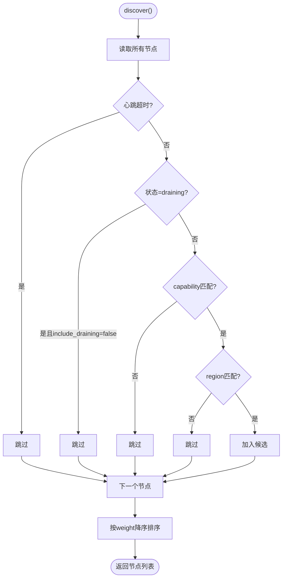
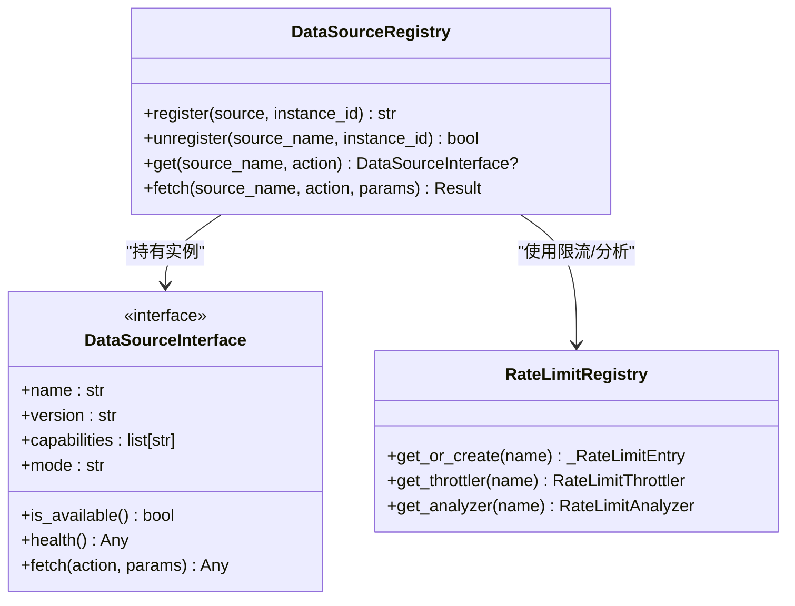
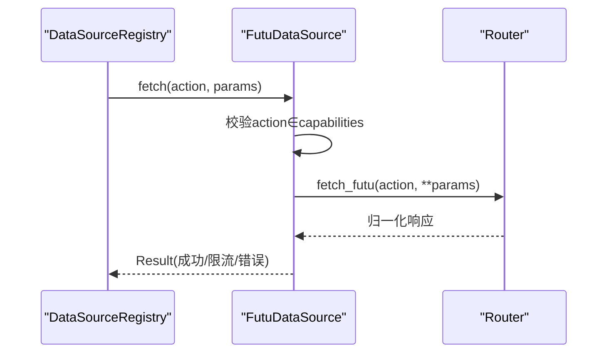
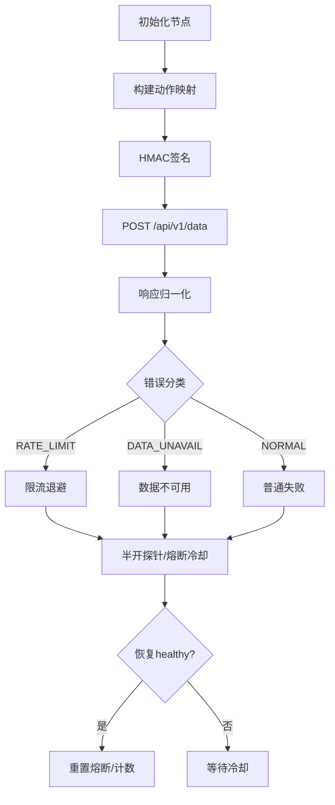
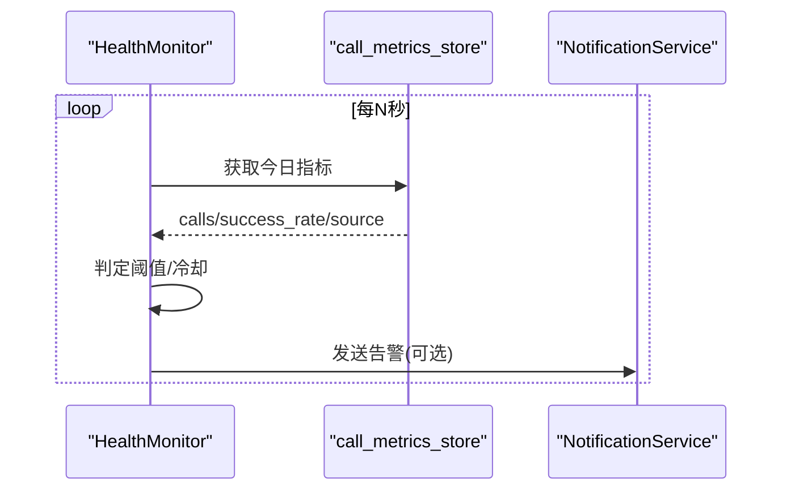
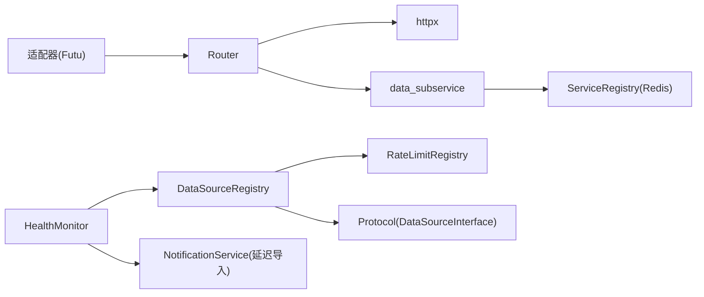

# 数据源注册中心

<cite>
**本文引用的文件**
- [backend/core/service_registry.py](file://backend/core/service_registry.py)
- [data_subservice/_internal/service_registry.py](file://data_subservice/_internal/service_registry.py)
- [data_subservice/nodeinfo.py](file://data_subservice/nodeinfo.py)
- [backend/services/datasource/protocol.py](file://backend/services/datasource/protocol.py)
- [backend/services/datasource/source_registry.py](file://backend/services/datasource/source_registry.py)
- [backend/services/datasource/registry.py](file://backend/services/datasource/registry.py)
- [backend/services/datasource/adapters/__init__.py](file://backend/services/datasource/adapters/__init__.py)
- [backend/services/datasource/adapters/futu.py](file://backend/services/datasource/adapters/futu.py)
- [backend/services/datasource/router.py](file://backend/services/datasource/router.py)
- [backend/services/datasource/health_monitor.py](file://backend/services/datasource/health_monitor.py)
</cite>

## 目录
1. [简介](#简介)
2. [项目结构](#项目结构)
3. [核心组件](#核心组件)
4. [架构总览](#架构总览)
5. [详细组件分析](#详细组件分析)
6. [依赖关系分析](#依赖关系分析)
7. [性能与可用性](#性能与可用性)
8. [故障排查指南](#故障排查指南)
9. [结论](#结论)
10. [附录：新数据源集成指南](#附录新数据源集成指南)

## 简介
本文件面向 Quant Agent 的“数据源注册中心”，系统性阐述数据源的动态发现、注册与管理机制，覆盖以下主题：
- 分布式节点服务注册表（基于 Redis）与本地实例注册表（进程内）的职责分工
- 支持的数据源类型与能力声明（Futu、YFinance、AkShare、Tushare、FMP、Finnhub 等）
- 生命周期管理：注册、心跳、健康检查、优雅下线、死节点清理
- 权重配置与优先级排序：按能力过滤、区域过滤、权重降序
- 热插拔、版本兼容性与扩展点设计
- 监控指标、错误处理策略与降级方案
- 新数据源接入规范与测试验证流程

## 项目结构
数据源注册中心由“分布式注册表 + 本地注册表 + 适配器 + 路由 + 健康监控”构成。关键路径如下：
- 分布式注册表：跨进程/跨节点维护节点元信息、心跳、状态与统计，用于多节点拓扑下的发现与路由
- 本地注册表：进程内维护 DataSourceInterface 实例，提供按名称获取、能力匹配、限流与熔断的统一入口
- 适配器：将具体数据源（如 Futu 远程调用）适配为统一接口，声明 name/version/capabilities/mode/is_available/health/fetch
- 路由：负责子服务 HTTP 转发、HMAC 签名、动作映射、节点选择与熔断自愈
- 健康监控：周期性扫描成功率/可达性，触发告警并输出可观测指标

图表来源
- [backend/services/datasource/source_registry.py:41-259](file://backend/services/datasource/source_registry.py#L41-L259)
- [backend/services/datasource/registry.py:29-99](file://backend/services/datasource/registry.py#L29-L99)
- [backend/services/datasource/router.py:249-579](file://backend/services/datasource/router.py#L249-L579)
- [data_subservice/_internal/service_registry.py:69-320](file://data_subservice/_internal/service_registry.py#L69-L320)
- [data_subservice/nodeinfo.py:10-34](file://data_subservice/nodeinfo.py#L10-L34)

章节来源
- [backend/services/datasource/source_registry.py:41-259](file://backend/services/datasource/source_registry.py#L41-L259)
- [backend/services/datasource/registry.py:29-99](file://backend/services/datasource/registry.py#L29-L99)
- [backend/services/datasource/router.py:249-579](file://backend/services/datasource/router.py#L249-L579)
- [data_subservice/_internal/service_registry.py:69-320](file://data_subservice/_internal/service_registry.py#L69-L320)
- [data_subservice/nodeinfo.py:10-34](file://data_subservice/nodeinfo.py#L10-L34)

## 核心组件
- 分布式服务注册表（ServiceRegistry）
  - 使用 Redis Hash/ZSet/Set 存储节点信息与心跳，支持按能力/区域发现、权重排序、优雅下线与死节点清理
- 本地数据源注册表（DataSourceRegistry）
  - 持有 DataSourceInterface 实例，按名称与能力匹配返回可用实例；统一执行限流、熔断、指标记录
- 限流注册表（RateLimitRegistry）
  - 每个数据源名对应 Throttler + Analyzer，集中管理退避与频率分析
- 适配器（Adapters）
  - 实现 DataSourceInterface，声明 capabilities，封装 fetch 逻辑（如 Futu 通过 Router 远程调用）
- 路由（Router）
  - 维护节点拓扑、动作映射、HMAC 签名、健康探针与熔断自愈
- 健康监控（HealthMonitor）
  - 周期扫描成功率/可达性，触发告警并暴露监控指标

章节来源
- [backend/core/service_registry.py:69-417](file://backend/core/service_registry.py#L69-L417)
- [data_subservice/_internal/service_registry.py:69-320](file://data_subservice/_internal/service_registry.py#L69-L320)
- [backend/services/datasource/source_registry.py:41-259](file://backend/services/datasource/source_registry.py#L41-L259)
- [backend/services/datasource/registry.py:29-99](file://backend/services/datasource/registry.py#L29-L99)
- [backend/services/datasource/adapters/futu.py:34-199](file://backend/services/datasource/adapters/futu.py#L34-L199)
- [backend/services/datasource/router.py:249-800](file://backend/services/datasource/router.py#L249-L800)
- [backend/services/datasource/health_monitor.py:55-257](file://backend/services/datasource/health_monitor.py#L55-L257)

## 架构总览
数据源请求从业务侧进入 DataSourceRegistry，经限流与熔断后，若为本地适配器则直接执行；若为远程适配器（如 Futu），则通过 Router 向 data_subservice 发起 HTTP 请求，并由 ServiceRegistry 在子服务侧完成节点注册与心跳。

图表来源
- [backend/services/datasource/source_registry.py:140-259](file://backend/services/datasource/source_registry.py#L140-L259)
- [backend/services/datasource/adapters/futu.py:130-180](file://backend/services/datasource/adapters/futu.py#L130-L180)
- [backend/services/datasource/router.py:669-748](file://backend/services/datasource/router.py#L669-L748)
- [data_subservice/_internal/service_registry.py:129-152](file://data_subservice/_internal/service_registry.py#L129-L152)

## 详细组件分析

### 分布式服务注册表（ServiceRegistry）
- 职责
  - 节点注册/注销、心跳更新、节点发现（按 capability/region/status）、优雅下线、死节点清理、统计指标聚合与集群总览
- 数据结构
  - nodes(Hash): {node_id: NodeInfo JSON}
  - heartbeats(ZSet): {node_id: last_heartbeat_ts}
  - draining(Set): {node_id}
  - stats:{node_id}(Hash): 原子递增指标
- 关键行为
  - discover() 过滤 dead/draining，按 weight 降序排序
  - cleanup_dead_nodes() 定期清理超时节点
  - get_cluster_overview() 汇总 active/drain/dead 与区域分布

图表来源
- [backend/core/service_registry.py:188-229](file://backend/core/service_registry.py#L188-L229)
- [data_subservice/_internal/service_registry.py:157-178](file://data_subservice/_internal/service_registry.py#L157-L178)

章节来源
- [backend/core/service_registry.py:69-417](file://backend/core/service_registry.py#L69-L417)
- [data_subservice/_internal/service_registry.py:69-320](file://data_subservice/_internal/service_registry.py#L69-L320)

### 本地数据源注册表（DataSourceRegistry）
- 职责
  - 注册 DataSourceInterface 实例，按名称与能力严格匹配获取实例
  - 统一执行限流检查、熔断器包装、指标记录与错误分类
- 能力匹配原则
  - 当传入 action 时，仅返回声明包含该 action 的实例；不匹配时不再静默回退首个实例（可通过环境变量宽松模式过渡）
- 限流与熔断
  - 通过 RateLimitRegistry 获取 Throttler/Analyzer
  - 使用 fetch_via_breaker_async 包装调用，区分普通失败与限流类错误
  - 对部分 Futu 扩展行情能力豁免全局熔断，避免误杀核心通道

图表来源
- [backend/services/datasource/source_registry.py:41-259](file://backend/services/datasource/source_registry.py#L41-L259)
- [backend/services/datasource/registry.py:29-99](file://backend/services/datasource/registry.py#L29-L99)
- [backend/services/datasource/protocol.py:12-47](file://backend/services/datasource/protocol.py#L12-L47)

章节来源
- [backend/services/datasource/source_registry.py:41-259](file://backend/services/datasource/source_registry.py#L41-L259)
- [backend/services/datasource/registry.py:29-99](file://backend/services/datasource/registry.py#L29-L99)
- [backend/services/datasource/protocol.py:12-47](file://backend/services/datasource/protocol.py#L12-L47)

### 适配器与能力声明（以 Futu 为例）
- 适配器职责
  - 实现 DataSourceInterface，声明 name/version/capabilities/mode
  - is_available() 判断远程节点是否可调用
  - health() 返回远程节点诊断信息
  - fetch() 校验 action 是否在 capabilities 中，调用 Router 进行远程请求，解析嵌套信封并返回 Result
- 能力声明
  - 必须与实际子服务能力对齐，确保 Facade 按 action 选源语义正确

图表来源
- [backend/services/datasource/adapters/futu.py:34-199](file://backend/services/datasource/adapters/futu.py#L34-L199)
- [backend/services/datasource/router.py:669-748](file://backend/services/datasource/router.py#L669-L748)

章节来源
- [backend/services/datasource/adapters/futu.py:34-199](file://backend/services/datasource/adapters/futu.py#L34-L199)

### 路由（Router）
- 职责
  - 初始化节点拓扑（yf_primary/backups、akshare_remote、tushare_remote、futu_master、fmp_master、finnhub_master、宏观源、搜索源）
  - 动作映射（内部 fetch_type → 子服务 action）
  - HMAC 签名与请求发送，响应归一化
  - 健康探针与熔断自愈（半开探测、按 action 级熔断隔离）
- 关键特性
  - 启动期 URL 校验，防止误指向主服务自身端口
  - 限流压力感知与节点优先级调整
  - 错误分类兜底（文本特征识别 RATE_LIMIT/DATA_UNAVAILABLE）

图表来源
- [backend/services/datasource/router.py:446-579](file://backend/services/datasource/router.py#L446-L579)
- [backend/services/datasource/router.py:669-748](file://backend/services/datasource/router.py#L669-L748)
- [backend/services/datasource/router.py:786-800](file://backend/services/datasource/router.py#L786-L800)

章节来源
- [backend/services/datasource/router.py:249-800](file://backend/services/datasource/router.py#L249-L800)

### 健康监控（HealthMonitor）
- 职责
  - 周期扫描各数据源成功率/可达性，低于阈值或疑似 Down 时推送告警
  - 内置去重冷却，避免告警风暴
- 指标与阈值
  - 成功率阈值、最小样本数、扫描间隔、冷却时长
  - 通过 call_metrics_store 获取当日指标

图表来源
- [backend/services/datasource/health_monitor.py:101-148](file://backend/services/datasource/health_monitor.py#L101-L148)
- [backend/services/datasource/health_monitor.py:187-236](file://backend/services/datasource/health_monitor.py#L187-L236)

章节来源
- [backend/services/datasource/health_monitor.py:55-257](file://backend/services/datasource/health_monitor.py#L55-L257)

## 依赖关系分析
- 组件耦合
  - DataSourceRegistry 依赖 RateLimitRegistry 与 Protocol；Adapter 依赖 Router；Router 依赖 httpx 与外部子服务；ServiceRegistry 依赖 Redis
- 外部依赖
  - Redis（分布式注册表）、httpx（HTTP 客户端）、通知服务（告警）
- 循环依赖规避
  - 健康监控延迟导入 NotificationService；适配器延迟导入 Router

图表来源
- [backend/services/datasource/source_registry.py:41-259](file://backend/services/datasource/source_registry.py#L41-L259)
- [backend/services/datasource/adapters/futu.py:34-199](file://backend/services/datasource/adapters/futu.py#L34-L199)
- [backend/services/datasource/router.py:249-800](file://backend/services/datasource/router.py#L249-L800)
- [data_subservice/_internal/service_registry.py:69-320](file://data_subservice/_internal/service_registry.py#L69-L320)
- [backend/services/datasource/health_monitor.py:55-257](file://backend/services/datasource/health_monitor.py#L55-L257)

章节来源
- [backend/services/datasource/source_registry.py:41-259](file://backend/services/datasource/source_registry.py#L41-L259)
- [backend/services/datasource/adapters/futu.py:34-199](file://backend/services/datasource/adapters/futu.py#L34-L199)
- [backend/services/datasource/router.py:249-800](file://backend/services/datasource/router.py#L249-L800)
- [data_subservice/_internal/service_registry.py:69-320](file://data_subservice/_internal/service_registry.py#L69-L320)
- [backend/services/datasource/health_monitor.py:55-257](file://backend/services/datasource/health_monitor.py#L55-L257)

## 性能与可用性
- 限流与退避
  - 通过 RateLimitRegistry 的 Throttler/Analyzer 控制请求速率，避免加剧第三方限流
- 熔断与自愈
  - 按 action 级熔断隔离，避免单 action 失败影响同节点其它能力；半开探针自动恢复 healthy
- 权重与优先级
  - 分布式注册表 discover() 按 weight 降序；Router 根据健康与限流压力调整节点优先级
- 指标与可观测性
  - Prometheus 指标：延迟、可用性、限流次数、错误类型
  - 健康监控：成功率阈值告警、冷却去重

[本节为通用指导，无需特定文件引用]

## 故障排查指南
- 常见问题定位
  - 子服务 URL 误配：Router 启动期会检测端口是否指向主服务自身，给出明确日志
  - HMAC 密钥缺失或不一致：启用路由时必须配置 DATA_SOURCE_HMAC_SECRET，否则全部请求 403
  - 能力不匹配：DataSourceRegistry.get() 严格匹配 action，未声明将返回 None 并记录警告
  - 限流与配额耗尽：错误分类与文本兜底识别 RATE_LIMIT/QUOTA_EXHAUSTED/IP_BLOCKED
  - 数据不可用：识别 "no data"/"yahoo error" 等关键词，避免误判为普通失败
- 健康与告警
  - HealthMonitor 周期扫描成功率，低于阈值触发告警；冷却期内不重复告警
- 建议步骤
  - 查看 Router 日志中的错误分类与节点状态
  - 检查 ServiceRegistry 的节点心跳与 draining 状态
  - 核对 Adapter 的 capabilities 与实际子服务 action 映射

章节来源
- [backend/services/datasource/router.py:249-579](file://backend/services/datasource/router.py#L249-L579)
- [backend/services/datasource/router.py:669-748](file://backend/services/datasource/router.py#L669-L748)
- [backend/services/datasource/source_registry.py:98-133](file://backend/services/datasource/source_registry.py#L98-L133)
- [backend/services/datasource/health_monitor.py:101-148](file://backend/services/datasource/health_monitor.py#L101-L148)

## 结论
Quant Agent 的数据源注册中心通过“分布式注册表 + 本地注册表 + 适配器 + 路由 + 健康监控”的分层设计，实现了数据源的动态发现、能力匹配、权重路由、限流熔断与健康治理。其扩展点清晰（DataSourceInterface）、监控完备（Prometheus + 告警）、容错稳健（action 级熔断与半开自愈），为新数据源接入提供了稳定可靠的基座。

[本节为总结，无需特定文件引用]

## 附录：新数据源集成指南

### 适配器开发规范
- 实现 DataSourceInterface
  - 定义 name/version/capabilities/mode
  - 实现 is_available()/health()/fetch(action, params)
- 能力声明
  - capabilities 必须与实际可实现的 action 严格对齐，确保按 action 选源语义正确
- 远程调用
  - 若通过 data_subservice 远程调用，需在 Router 中补充动作映射与节点配置
- 注册入口
  - 在 adapters/__init__.py 的 ensure_all_datasources_registered() 中添加 ensure_* 注册函数，保证应用启动时幂等注册

章节来源
- [backend/services/datasource/protocol.py:12-47](file://backend/services/datasource/protocol.py#L12-L47)
- [backend/services/datasource/adapters/__init__.py:14-101](file://backend/services/datasource/adapters/__init__.py#L14-L101)
- [backend/services/datasource/router.py:446-579](file://backend/services/datasource/router.py#L446-L579)

### 接口定义与契约
- 统一协议
  - fetch() 返回 Result（success/rate_limited/error），携带 latency_ms、source、error_info
- 子服务契约
  - POST /api/v1/data，body 含 source/action/params，headers 含 X-Timestamp/X-Signature
  - 响应归一化为 status/success/data，错误透传 error_category

章节来源
- [backend/services/datasource/source_registry.py:140-259](file://backend/services/datasource/source_registry.py#L140-L259)
- [backend/services/datasource/router.py:669-748](file://backend/services/datasource/router.py#L669-L748)

### 测试验证流程
- 单元测试
  - 验证 capabilities 与 action 匹配、限流与熔断行为、错误分类与指标记录
- 集成测试
  - 验证 Router 到 data_subservice 的端到端调用、HMAC 签名与响应归一化
- 健康与告警
  - 模拟低成功率场景，验证 HealthMonitor 告警触发与冷却去重

[本节为通用指导，无需特定文件引用]

### 生命周期管理与扩展点
- 生命周期
  - 注册：ensure_all_datasources_registered() 启动时调用
  - 心跳：子服务 ServiceRegistry 定期 heartbeat，主服务 Router 健康探针
  - 优雅下线：mark_draining/unmark_draining 控制节点状态
  - 清理：cleanup_dead_nodes() 定期清理超时节点
- 扩展点
  - 新增数据源：实现适配器 + 注册 + Router 动作映射 + 能力声明
  - 新增能力：在 capabilities 中声明，并确保子服务支持

章节来源
- [backend/services/datasource/adapters/__init__.py:14-101](file://backend/services/datasource/adapters/__init__.py#L14-L101)
- [data_subservice/_internal/service_registry.py:269-320](file://data_subservice/_internal/service_registry.py#L269-L320)
- [backend/services/datasource/router.py:310-410](file://backend/services/datasource/router.py#L310-L410)