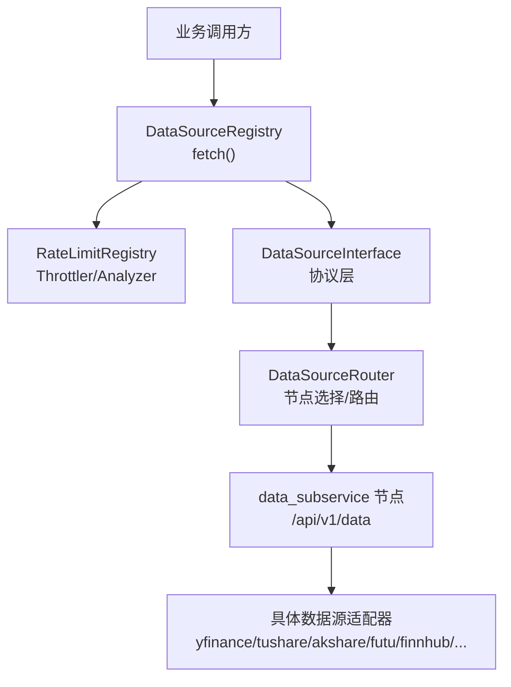
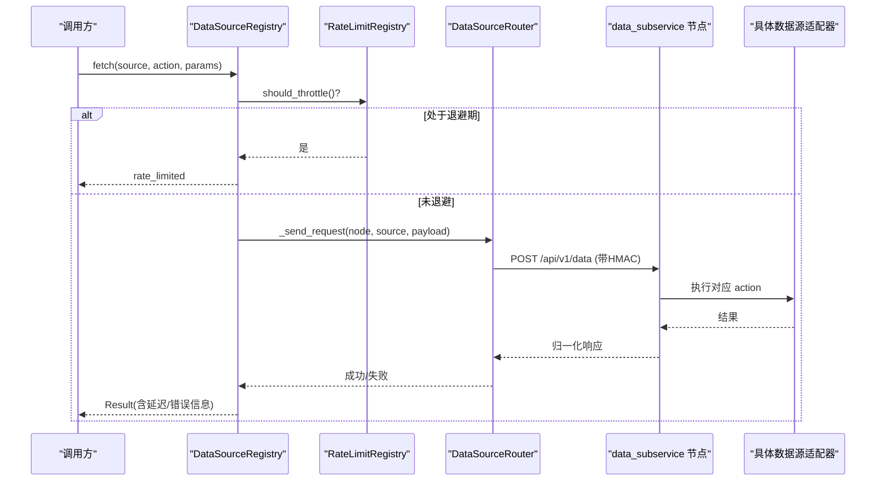
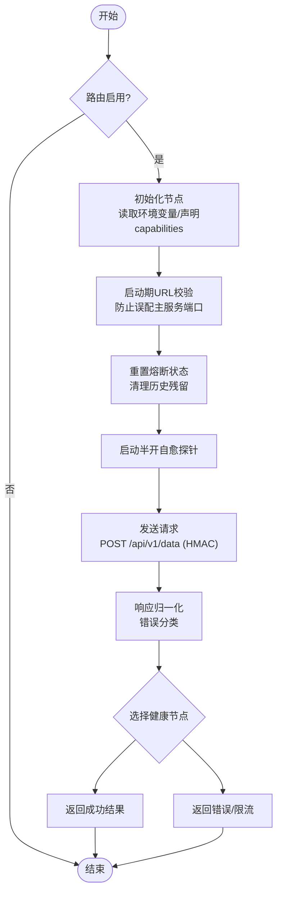
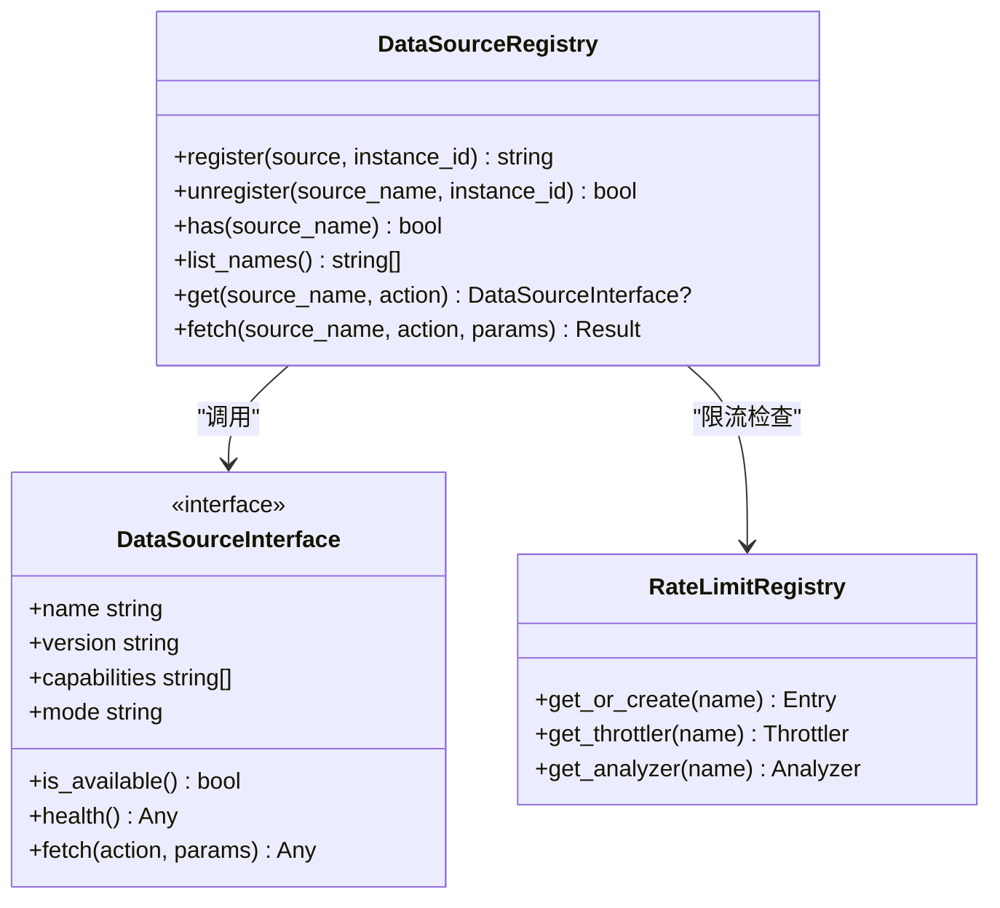
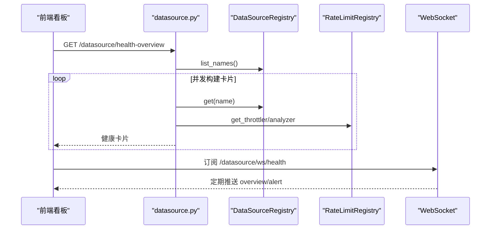
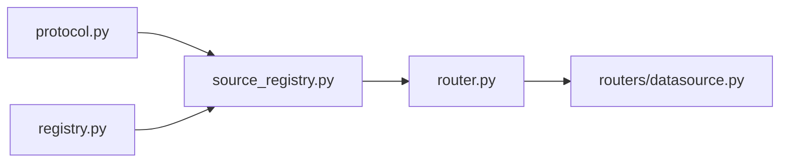

# 数据源管理

<cite>
**本文引用的文件**
- [backend/services/datasource/router.py](file://backend/services/datasource/router.py)
- [backend/services/datasource/registry.py](file://backend/services/datasource/registry.py)
- [backend/services/datasource/source_registry.py](file://backend/services/datasource/source_registry.py)
- [backend/services/datasource/protocol.py](file://backend/services/datasource/protocol.py)
- [backend/routers/datasource.py](file://backend/routers/datasource.py)
</cite>

## 目录
1. [简介](#简介)
2. [项目结构](#项目结构)
3. [核心组件](#核心组件)
4. [架构总览](#架构总览)
5. [详细组件分析](#详细组件分析)
6. [依赖关系分析](#依赖关系分析)
7. [性能与可靠性](#性能与可靠性)
8. [故障排查指南](#故障排查指南)
9. [结论](#结论)
10. [附录：新数据源接入指南](#附录新数据源接入指南)

## 简介
本文件面向 Quant Agent 的数据源管理系统，聚焦多数据源统一接入架构与治理能力。系统通过 DataSourceRouter 实现跨节点路由、负载均衡与故障转移；通过 DataSourceRegistry 维护数据源实例注册表；通过 RateLimitRegistry 提供限流退避与频率分析；并通过统一的 DataSourceInterface 协议对各类数据源（Futu、YFinance、AkShare、Tushare、Finnhub、宏观源等）进行标准化封装。同时提供健康检查、连接测试、延迟分布、错误率趋势、可用性时间线等可观测能力，以及熔断自愈、动作级隔离、半开探针等关键机制，确保高可用与稳定性。

## 项目结构
后端数据源子系统位于 backend/services/datasource，核心文件包括：
- router.py：数据源路由服务，负责远程子服务调用、节点管理、负载均衡、熔断自愈与健康探测。
- source_registry.py：数据源实例注册表，负责按名称获取实例、执行 fetch 并记录指标。
- registry.py：限流注册表，维护每个数据源的 Throttler 与 Analyzer。
- protocol.py：统一接口协议，定义 name/version/capabilities/mode/is_available/health/fetch。
- routers/datasource.py：对外暴露的 HTTP/WebSocket 接口，提供健康看板、链路测试、延迟与错误率可视化等。

图表来源
- [backend/services/datasource/source_registry.py:140-255](file://backend/services/datasource/source_registry.py#L140-L255)
- [backend/services/datasource/registry.py:29-99](file://backend/services/datasource/registry.py#L29-L99)
- [backend/services/datasource/router.py:249-579](file://backend/services/datasource/router.py#L249-L579)
- [backend/services/datasource/protocol.py:12-47](file://backend/services/datasource/protocol.py#L12-L47)

章节来源
- [backend/services/datasource/router.py:1-160](file://backend/services/datasource/router.py#L1-L160)
- [backend/services/datasource/source_registry.py:1-139](file://backend/services/datasource/source_registry.py#L1-L139)
- [backend/services/datasource/registry.py:1-99](file://backend/services/datasource/registry.py#L1-L99)
- [backend/services/datasource/protocol.py:1-47](file://backend/services/datasource/protocol.py#L1-L47)
- [backend/routers/datasource.py:1-120](file://backend/routers/datasource.py#L1-L120)

## 核心组件
- 统一协议（DataSourceInterface）
  - 所有数据源必须实现 name、version、capabilities、mode、is_available、health、fetch。
  - 保证上层以一致方式访问不同数据源，屏蔽差异。
- 数据源实例注册表（DataSourceRegistry）
  - 维护数据源实例集合，支持按名称与 capability 精确匹配获取实例。
  - 主路径 fetch 流程：先查限流退避，再调用断路器包装的 fetch，最后记录指标与状态。
- 限流注册表（RateLimitRegistry）
  - 为每个数据源提供 Throttler（退避控制）与 Analyzer（频率分析）。
  - 提供 get_or_create、get_throttler、get_analyzer、list_names 等能力。
- 数据源路由（DataSourceRouter）
  - 维护多个远程节点（yf_primary/yf_backup_N、akshare_remote、tushare_remote、futu_master、fmp_master、finnhub_master、fred_master、dbnomics_master、rbi_master、search_master）。
  - 支持 HMAC 签名、请求归一化、错误分类、动作级熔断隔离、半开自愈探针、启动期 URL 校验。
  - 将内部 action 映射到子服务 action（如 yfinance、tushare、futu、finnhub 等）。
- 健康与可观测（routers/datasource.py）
  - 提供健康总览、单源健康详情、链接测试、延迟分布、错误率趋势、可用性时间线、WebSocket 实时推送。
  - 链接测试具备并发防护、退避期跳过、真实上游探测与延迟采样。

章节来源
- [backend/services/datasource/protocol.py:12-47](file://backend/services/datasource/protocol.py#L12-L47)
- [backend/services/datasource/source_registry.py:41-255](file://backend/services/datasource/source_registry.py#L41-L255)
- [backend/services/datasource/registry.py:18-99](file://backend/services/datasource/registry.py#L18-L99)
- [backend/services/datasource/router.py:222-579](file://backend/services/datasource/router.py#L222-L579)
- [backend/routers/datasource.py:186-456](file://backend/routers/datasource.py#L186-L456)

## 架构总览
系统采用“主服务 + data_subservice 子服务”的分布式架构。主服务不再直接持有各数据源 SDK，而是通过 DataSourceRouter 将请求转发至子服务节点，由子服务承载具体数据源连接与采集逻辑。路由层负责：
- 节点发现与配置（环境变量驱动）
- 负载均衡（权重、健康状态、限流压力感知）
- 故障转移（熔断冷却、半开自愈探针）
- 安全通信（HMAC-SHA256 签名）
- 响应归一化与错误分类

图表来源
- [backend/services/datasource/source_registry.py:140-255](file://backend/services/datasource/source_registry.py#L140-L255)
- [backend/services/datasource/router.py:669-748](file://backend/services/datasource/router.py#L669-L748)

章节来源
- [backend/services/datasource/router.py:1-160](file://backend/services/datasource/router.py#L1-L160)
- [backend/services/datasource/source_registry.py:140-255](file://backend/services/datasource/source_registry.py#L140-L255)

## 详细组件分析

### 数据源路由（DataSourceRouter）
- 节点初始化与拓扑
  - 从环境变量读取各数据源远程地址，构建 DataSourceNode，声明 capabilities。
  - 支持逗号分隔的多活 URL（如 YF_BACKUP_NODE_URL），用于负载均衡与容灾。
- 请求发送与安全
  - 使用 httpx.AsyncClient 发起 POST /api/v1/data，携带 X-Timestamp 与 X-Signature（HMAC-SHA256）。
  - 对原始 body 字节签名，避免重序列化导致验签失败。
- 响应归一化与错误分类
  - 将子服务的 {code,data} 信封转换为内部 {status,success,data} 格式。
  - 识别 error_category（RATE_LIMIT、QUOTA_EXHAUSTED、IP_BLOCKED、DATA_UNAVAILABLE、NORMAL），用于限流与熔断分流。
- 负载均衡与故障转移
  - 仅选择 enabled、capability 匹配、healthy 且不在熔断冷却期的节点。
  - 支持动作级熔断隔离：单个 action 连续失败触发该 action 熔断，不波及同节点其它 action。
  - 节点级兜底阈值动态计算：基于 capabilities 规模与比例，避免小节点误杀。
- 半开自愈探针
  - 后台任务周期性对 unhealthy 或熔断中的节点发起 /health 探活，成功则恢复 healthy。
- 启动期自检
  - 校验 REMOTE_URL 端口是否误指向主服务自身，提前暴露配置错误。

图表来源
- [backend/services/datasource/router.py:249-579](file://backend/services/datasource/router.py#L249-L579)
- [backend/services/datasource/router.py:669-748](file://backend/services/datasource/router.py#L669-L748)

章节来源
- [backend/services/datasource/router.py:222-579](file://backend/services/datasource/router.py#L222-L579)
- [backend/services/datasource/router.py:669-748](file://backend/services/datasource/router.py#L669-L748)

### 数据源实例注册表（DataSourceRegistry）
- 注册与查找
  - register(source, instance_id) 支持同名多实例；get(name, action) 支持按 capability 严格匹配。
  - 当 action 不匹配时，默认不再静默回退首实例，避免语义失效（可通过 DATASOURCE_LOOSE_CAPABILITY=1 过渡兼容）。
- 主路径 fetch
  - 先查询 RateLimitRegistry 判断是否处于退避期；若是则返回 rate_limited。
  - 通过 fetch_via_breaker_async 调用具体源，捕获 CircuitBreakerOpenError 并返回明确错误。
  - 记录延迟、成功率、限流次数、可用性指标，区分限流与非限流错误处理。
- 熔断豁免
  - 针对 Futu 扩展行情类 action（如 CAPITAL_DISTRIBUTION、HEAT_MAP 等）豁免 per-source 熔断，避免误杀核心通道。

图表来源
- [backend/services/datasource/source_registry.py:41-255](file://backend/services/datasource/source_registry.py#L41-L255)
- [backend/services/datasource/protocol.py:12-47](file://backend/services/datasource/protocol.py#L12-L47)
- [backend/services/datasource/registry.py:29-99](file://backend/services/datasource/registry.py#L29-L99)

章节来源
- [backend/services/datasource/source_registry.py:41-255](file://backend/services/datasource/source_registry.py#L41-L255)
- [backend/services/datasource/protocol.py:12-47](file://backend/services/datasource/protocol.py#L12-L47)
- [backend/services/datasource/registry.py:29-99](file://backend/services/datasource/registry.py#L29-L99)

### 限流注册表（RateLimitRegistry）
- 职责分离
  - 仅管理限流状态（Throttler 与 Analyzer），不持有 DataSourceInterface 实例。
- 功能
  - get_or_create(name) 自动创建条目；get_throttler/get_analyzer 获取对应实例。
  - list_names/list_all 提供只读快照；reset_all/clear 用于测试与运维。
- 与注册表协作
  - DataSourceRegistry.register 会预热限流条目，确保首次调用即有状态。

章节来源
- [backend/services/datasource/registry.py:18-99](file://backend/services/datasource/registry.py#L18-L99)
- [backend/services/datasource/source_registry.py:55-73](file://backend/services/datasource/source_registry.py#L55-L73)

### 健康与可观测（HTTP/WebSocket）
- 健康总览与单源详情
  - /datasource/health-overview 聚合所有已注册数据源的健康卡片。
  - /datasource/{name}/health 返回单源详情（connected、latency、today_calls、success_rate、rate_limit_count 等）。
- 链接测试
  - /datasource/{name}/test-link 支持主动探测与真实上游延迟测量，具备全局最小间隔、per-source 串行锁、并发信号量限制。
  - 尊重 throttler 退避：退避期内跳过真实请求，直接返回当前退避状态。
- 延迟分布、错误率趋势、可用性时间线
  - 从 Redis 读取样本与统计，输出直方图与时间序列，便于前端可视化。
- WebSocket 实时推送
  - /datasource/ws/health 每 15s 推送 overview，并在状态转为 stale 时推送 alert。

图表来源
- [backend/routers/datasource.py:287-309](file://backend/routers/datasource.py#L287-L309)
- [backend/routers/datasource.py:487-642](file://backend/routers/datasource.py#L487-L642)
- [backend/routers/datasource.py:645-707](file://backend/routers/datasource.py#L645-L707)

章节来源
- [backend/routers/datasource.py:186-456](file://backend/routers/datasource.py#L186-L456)
- [backend/routers/datasource.py:487-707](file://backend/routers/datasource.py#L487-L707)

## 依赖关系分析
- 模块耦合
  - DataSourceRegistry 依赖 Protocol 与 RateLimitRegistry，解耦具体实现。
  - DataSourceRouter 依赖 httpx、CircuitBreaker、ErrorCategory 等，承担网络与安全职责。
  - routers/datasource.py 依赖上述三者，提供对外 API。
- 外部依赖
  - data_subservice 节点提供 /api/v1/data 与 /health 端点。
  - Redis 用于延迟样本与今日聚合计数持久化。
- 潜在循环依赖
  - 通过分层设计（协议/注册表/路由/路由层API）避免循环导入。

图表来源
- [backend/services/datasource/protocol.py:12-47](file://backend/services/datasource/protocol.py#L12-L47)
- [backend/services/datasource/source_registry.py:1-139](file://backend/services/datasource/source_registry.py#L1-L139)
- [backend/services/datasource/registry.py:18-99](file://backend/services/datasource/registry.py#L18-L99)
- [backend/services/datasource/router.py:249-579](file://backend/services/datasource/router.py#L249-L579)
- [backend/routers/datasource.py:1-120](file://backend/routers/datasource.py#L1-L120)

章节来源
- [backend/services/datasource/router.py:249-579](file://backend/services/datasource/router.py#L249-L579)
- [backend/services/datasource/source_registry.py:1-139](file://backend/services/datasource/source_registry.py#L1-L139)
- [backend/services/datasource/registry.py:18-99](file://backend/services/datasource/registry.py#L18-L99)
- [backend/routers/datasource.py:1-120](file://backend/routers/datasource.py#L1-L120)

## 性能与可靠性
- 连接池优化
  - 使用 httpx.AsyncClient 设置超时与连接上限，避免资源耗尽。
- 限流控制
  - 基于 RateLimitRegistry 的 Throttler 与 Analyzer，支持退避策略与频率分析。
  - 支持文本兜底识别限流关键词，弥补子服务未携带 error_category 的情况。
- 熔断与自愈
  - 动作级熔断隔离，避免单 action 失败影响同节点其它 action。
  - 节点级兜底阈值动态计算，适配不同规模节点。
  - 半开自愈探针周期性探活，自动恢复健康节点。
- 降级方案
  - 离线模式（offline_stub）与缓存（AKShare 热点缓存、STALE 缓存）提升可用性。
  - 链接测试在退避期跳过真实请求，避免雪崩。
- 可观测性
  - 延迟分布、错误率趋势、可用性时间线、限流热力图等可视化指标。
  - Prometheus 指标导出（DATASOURCE_LATENCY、DATASOURCE_RATE_LIMITS、DATASOURCE_ERRORS、DATASOURCE_AVAILABILITY）。

章节来源
- [backend/services/datasource/router.py:150-175](file://backend/services/datasource/router.py#L150-L175)
- [backend/services/datasource/router.py:177-219](file://backend/services/datasource/router.py#L177-L219)
- [backend/services/datasource/source_registry.py:170-255](file://backend/services/datasource/source_registry.py#L170-L255)
- [backend/routers/datasource.py:354-456](file://backend/routers/datasource.py#L354-L456)

## 故障排查指南
- 常见错误与定位
  - 403 签名失败：检查 DATA_SOURCE_HMAC_SECRET 是否与子服务一致；确认对最终 body 字节签名。
  - 端口误配：启动期日志会提示 *_REMOTE_URL 指向主服务自身而非子服务 8001。
  - 限流与配额耗尽：查看 /datasource/{name}/rate-limit-status 与 rate-limit-analysis。
  - 节点熔断：观察节点状态与动作级熔断冷却时间；等待自愈探针恢复或手动重置。
- 诊断工具
  - 链接测试：/datasource/{name}/test-link 支持真实上游延迟测量与并发防护。
  - 健康总览：/datasource/health-overview 与 WebSocket 实时推送。
  - 延迟分布与错误率趋势：/datasource/{name}/latency-distribution、/datasource/{name}/error-rate-trend。
- 日志与监控
  - 关注 [Router]、[DIAG-REQ]、[DIAG-SEC] 等日志标签。
  - 结合 Prometheus 指标与 Grafana 看板进行趋势分析。

章节来源
- [backend/services/datasource/router.py:257-284](file://backend/services/datasource/router.py#L257-L284)
- [backend/services/datasource/router.py:411-445](file://backend/services/datasource/router.py#L411-L445)
- [backend/routers/datasource.py:65-152](file://backend/routers/datasource.py#L65-L152)
- [backend/routers/datasource.py:487-642](file://backend/routers/datasource.py#L487-L642)

## 结论
Quant Agent 数据源管理系统通过统一协议、注册表、路由与限流治理，实现了多数据源的稳定接入与高效调度。路由层承担跨节点通信、负载均衡与故障转移，注册表保障实例管理与指标记录，限流注册表提供退避与频率分析。配合健康检查、链接测试、延迟与错误率可视化，系统在复杂环境下具备高可用性与强韧性。新增数据源只需遵循协议与适配规范，即可快速集成并纳入统一治理体系。

## 附录：新数据源接入指南
- 适配器开发规范
  - 实现 DataSourceInterface：提供 name、version、capabilities、mode、is_available、health、fetch。
  - capabilities 需准确声明支持的 action，以便注册表按 action 精确匹配。
  - health 应返回 connected、healthy、last_error 等字段，便于健康看板展示。
  - fetch 返回 Result（含 status、success、data、latency_ms、error 等），并尽量透传 error_category。
- 接口定义
  - 参考 protocol.py 中 DataSourceInterface 的定义。
  - 若走远程子服务，需在 router.py 中补充 action 映射（如 _TS_ACTION_MAP、_FINNHUB_ACTION_MAP 等）。
- 测试验证流程
  - 单元测试：覆盖 is_available、health、fetch 正常与异常路径。
  - 集成测试：通过 DataSourceRegistry.fetch 验证限流、熔断、指标记录。
  - 链路测试：使用 /datasource/{name}/test-link 验证真实上游延迟与连通性。
  - 可观测性：检查延迟分布、错误率趋势、可用性时间线是否正确上报。
- 部署与配置
  - 在环境变量中配置 *_REMOTE_URL（如 TUSHARE_REMOTE_URL、AKSHARE_REMOTE_URL）。
  - 确保 DATA_SOURCE_ROUTER_ENABLED=true 且 DATA_SOURCE_HMAC_SECRET 正确。
  - 启动后观察路由日志，确认节点初始化与 URL 校验通过。

章节来源
- [backend/services/datasource/protocol.py:12-47](file://backend/services/datasource/protocol.py#L12-L47)
- [backend/services/datasource/router.py:61-140](file://backend/services/datasource/router.py#L61-L140)
- [backend/services/datasource/router.py:446-579](file://backend/services/datasource/router.py#L446-L579)
- [backend/routers/datasource.py:487-642](file://backend/routers/datasource.py#L487-L642)