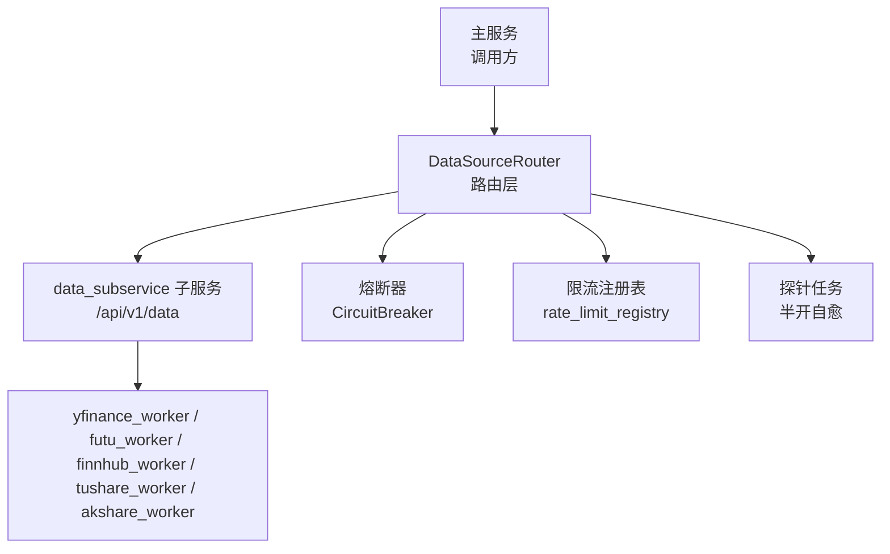
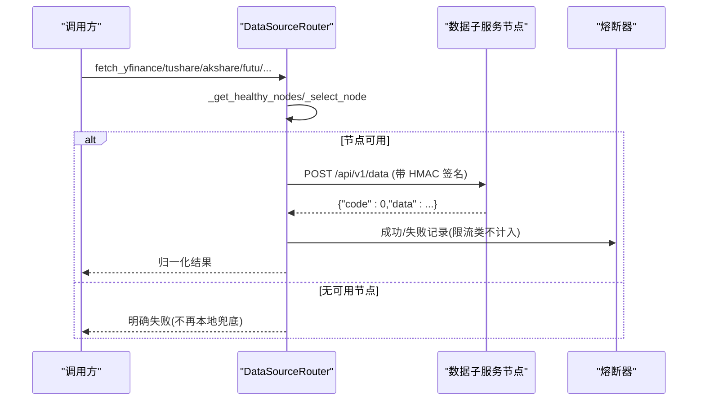
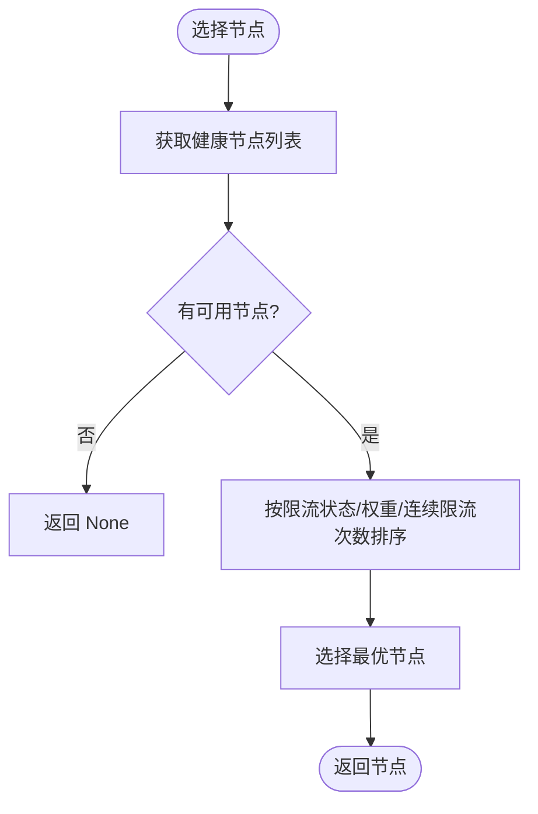
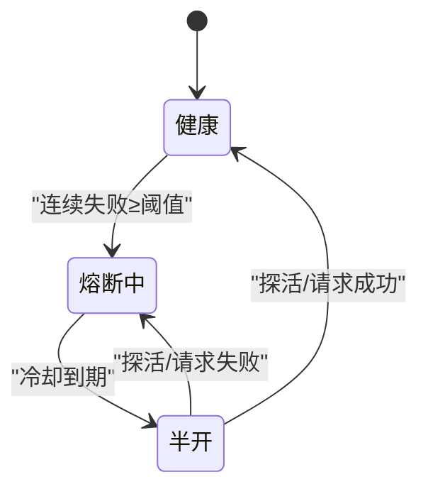
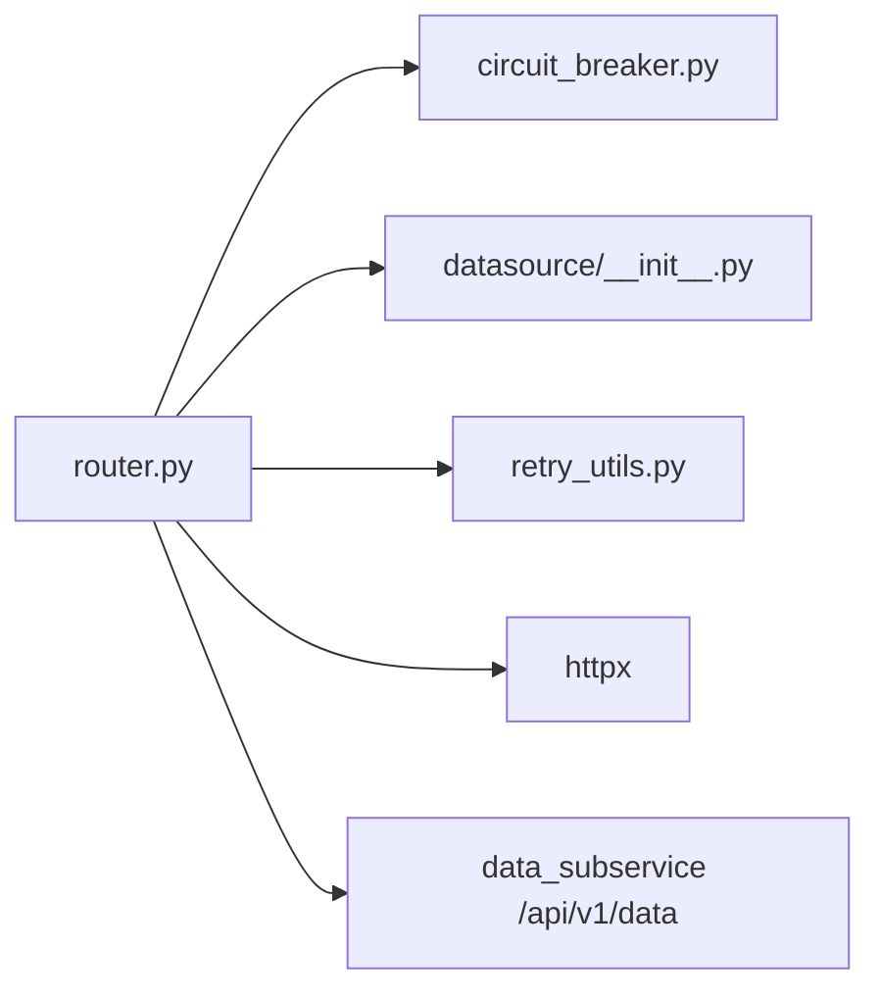
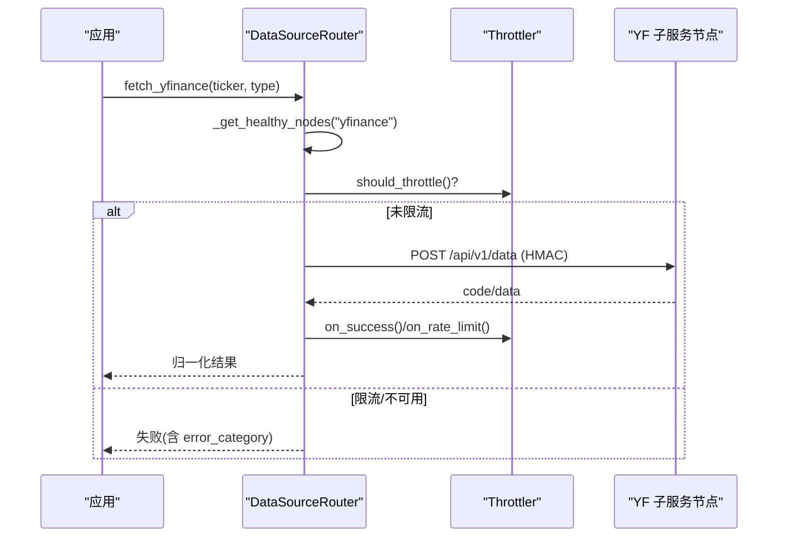

# 数据源路由机制

<cite>
**本文引用的文件**
- [backend/services/datasource/router.py](file://backend/services/datasource/router.py)
- [backend/core/circuit_breaker.py](file://backend/core/circuit_breaker.py)
- [backend/services/datasource/__init__.py](file://backend/services/datasource/__init__.py)
- [backend/core/retry_utils.py](file://backend/core/retry_utils.py)
- [backend/tests/test_data_source_router.py](file://backend/tests/test_data_source_router.py)
</cite>

## 目录
1. [简介](#简介)
2. [项目结构](#项目结构)
3. [核心组件](#核心组件)
4. [架构总览](#架构总览)
5. [详细组件分析](#详细组件分析)
6. [依赖关系分析](#依赖关系分析)
7. [性能考量](#性能考量)
8. [故障排查指南](#故障排查指南)
9. [结论](#结论)
10. [附录](#附录)

## 简介
本文件系统性阐述 Quant Agent 的数据源路由机制，聚焦 DataSourceRouter 类的多节点拓扑管理、请求路由策略、负载均衡算法与故障转移机制。文档覆盖五节点拓扑（主节点 VPS_S1、北京 VPS_BJ、美西 US-YF-A/B 等）的职责分工；详述 HMAC 签名验证、请求重试策略、熔断器集成；解释 YFinance 流量外移、Tushare/AKShare 远程化、Futu/FMP/Finnhub 统一接入的架构决策；并提供路由配置示例、性能优化建议与故障排查指南。

## 项目结构
- 路由核心位于后端服务模块：backend/services/datasource/router.py
- 熔断器通用实现：backend/core/circuit_breaker.py
- 错误分类/限流模型与工具：backend/services/datasource/__init__.py
- 全局重试装饰器与可重试判定：backend/core/retry_utils.py
- 路由行为与边界用例测试：backend/tests/test_data_source_router.py

图表来源
- [backend/services/datasource/router.py:249-580](file://backend/services/datasource/router.py#L249-L580)
- [backend/core/circuit_breaker.py:64-218](file://backend/core/circuit_breaker.py#L64-L218)
- [backend/services/datasource/__init__.py:23-47](file://backend/services/datasource/__init__.py#L23-L47)

章节来源
- [backend/services/datasource/router.py:1-30](file://backend/services/datasource/router.py#L1-L30)

## 核心组件
- DataSourceNode：节点元信息（名称、URL、权重、能力集、健康状态、熔断冷却时间、action 级熔断隔离等）
- DataSourceRouter：路由中枢，负责节点初始化、HMAC 签名、请求发送、响应归一化、健康探测、负载均衡、熔断与退避、离线模式拦截
- CircuitBreaker：通用熔断器（CLOSED/OPEN/HALF_OPEN），提供失败计数、冷却恢复、限流错误过滤
- ErrorCategory/ErrorInfo/RateLimitStatus：错误分类与限流详情，用于区分普通错误与限流/配额/IP封禁等
- retry_utils：全局重试装饰器 with_global_retry，定义可重试异常集合与指数退避

章节来源
- [backend/services/datasource/router.py:222-248](file://backend/services/datasource/router.py#L222-L248)
- [backend/services/datasource/router.py:249-580](file://backend/services/datasource/router.py#L249-L580)
- [backend/core/circuit_breaker.py:64-218](file://backend/core/circuit_breaker.py#L64-L218)
- [backend/services/datasource/__init__.py:23-47](file://backend/services/datasource/__init__.py#L23-L47)
- [backend/core/retry_utils.py:10-58](file://backend/core/retry_utils.py#L10-L58)

## 架构总览
- 五节点拓扑与职责
  - 主节点 VPS_S1：承载 Futu OpenD、FMP、Finnhub、宏观源（FRED/DBnomics/RBI）、搜索抓取代理（Tavily/Bocha/Jina）等，通过 data_subservice 暴露 HTTP 接口
  - 北京 VPS_BJ：承载 Tushare 与 AKShare 远程节点（当前为单节点）
  - 美西 US-YF-A/B：纯 yfinance 子服务节点，作为 YFinance 流量唯一出口，支持多活与容灾
- 统一入口
  - 所有数据源仅远程访问，移除本地 SDK 降级通道；源失效在监控中如实显示
- 通信协议
  - POST {node.url}/api/v1/data，body={"source","action","params"}，headers 包含 X-Timestamp/X-Signature（HMAC-SHA256）
  - 子服务返回 {"code":0,"data":...}，由路由层归一化为内部 {"status":"success","data":...}

图表来源
- [backend/services/datasource/router.py:669-748](file://backend/services/datasource/router.py#L669-L748)
- [backend/core/circuit_breaker.py:147-218](file://backend/core/circuit_breaker.py#L147-L218)

章节来源
- [backend/services/datasource/router.py:446-579](file://backend/services/datasource/router.py#L446-L579)
- [backend/services/datasource/router.py:669-748](file://backend/services/datasource/router.py#L669-L748)

## 详细组件分析

### 多节点拓扑管理与能力路由
- 节点初始化
  - yf_primary/yf_backup_*：YFinance 主备节点，能力集包含 quote/history/tech 等
  - akshare_remote/tushare_remote：北京节点，分别承载 AKShare/Tushare
  - futu_master/fmp_master/finnhub_master：主节点承载对应数据源连接层
  - fred_master/dbnomics_master/rbi_master：宏观数据源
  - search_master：搜索/抓取代理
- 能力匹配
  - 根据 capability 筛选健康节点，结合限流状态进行优先级排序
- URL 校验
  - 启动期检测误指向主服务自身端口或本地非子服务端口的风险

章节来源
- [backend/services/datasource/router.py:446-579](file://backend/services/datasource/router.py#L446-L579)
- [backend/services/datasource/router.py:411-445](file://backend/services/datasource/router.py#L411-L445)

### 请求路由策略与负载均衡
- 健康节点选择
  - 优先未被限流的节点；同状态下按 weight 降序；再按连续限流次数升序
- 限流压力感知
  - 从 rate_limit_registry 同步各节点的 is_throttled、consecutive_rate_limits、estimated_limit_rpm
- 动作级熔断隔离
  - 单 action 连续失败达到阈值 → 仅熔断该 action；当同时熔断的 action 数达到动态阈值 → 整节点熔断兜底

图表来源
- [backend/services/datasource/router.py:786-909](file://backend/services/datasource/router.py#L786-L909)

章节来源
- [backend/services/datasource/router.py:786-909](file://backend/services/datasource/router.py#L786-L909)

### 熔断器集成与半开自愈探针
- 节点级熔断
  - 普通错误累计触发节点级熔断（冷却期内禁止业务请求）
  - 部署重置时清空所有节点熔断残留
- Action 级熔断
  - 针对单 action 连续失败进行独立熔断，避免误伤同节点其它 action
- 半开自愈探针
  - 后台任务周期性对 unhealthy 或熔断冷却中的节点发起 /health 探活
  - 探活成功则复位 healthy；失败则维持状态并继续等待冷却到期

图表来源
- [backend/services/datasource/router.py:293-409](file://backend/services/datasource/router.py#L293-L409)
- [backend/core/circuit_breaker.py:45-98](file://backend/core/circuit_breaker.py#L45-L98)

章节来源
- [backend/services/datasource/router.py:293-409](file://backend/services/datasource/router.py#L293-L409)
- [backend/core/circuit_breaker.py:64-218](file://backend/core/circuit_breaker.py#L64-L218)

### HMAC 签名验证
- 签名契约
  - message = f"{timestamp}:{body}"
  - signature = HMAC-SHA256(HMAC_SECRET, message).hexdigest()
- 发送流程
  - 固定序列化 payload 一次，以 content= 字节发送，确保与子服务验签一致
  - headers 携带 X-Timestamp 与 X-Signature
- 启动期诊断
  - 打印密钥前缀长度，便于定位密钥注入时序问题

章节来源
- [backend/services/datasource/router.py:586-600](file://backend/services/datasource/router.py#L586-L600)
- [backend/services/datasource/router.py:669-708](file://backend/services/datasource/router.py#L669-L708)

### 请求重试策略
- 全局重试装饰器
  - with_global_retry：基于 tenacity，指数退避+随机抖动，最多重试 3 次
  - 可重试异常包括：429/403/5xx、网络超时、Futu 频率限制等
- 路由层重试
  - 路由层不直接封装重试，而是通过错误分类与熔断/退避配合上层重试策略

章节来源
- [backend/core/retry_utils.py:10-58](file://backend/core/retry_utils.py#L10-L58)

### YFinance 流量外移与容灾
- 流量外移
  - 后端进程不再本地执行 yfinance，全部经 data_subservice 子服务处理
- 容灾与自愈
  - 主备节点多活；限流/不可用时自动 failover 到备份节点
  - 节点级退避保护，避免打爆上游；冷却后自动重试
  - 无健康节点时返回明确失败，不再降级本地

章节来源
- [backend/services/datasource/router.py:953-1095](file://backend/services/datasource/router.py#L953-L1095)

### Tushare/AKShare 远程化
- 仅远程
  - 移除本地适配器降级；远程不支持的 action 直接返回失败
- 缓存与降级
  - 成功响应存档 STALE/热点缓存，供监控侧识别降级；远程失败时可尝试 STALE 缓存降级（不返回裸错）

章节来源
- [backend/services/datasource/router.py:1097-1165](file://backend/services/datasource/router.py#L1097-L1165)
- [backend/services/datasource/router.py:1167-1200](file://backend/services/datasource/router.py#L1167-L1200)

### Futu/FMP/Finnhub 统一接入
- 统一接入点
  - 通过 data_subservice 暴露 HTTP 接口，主服务不再持有 SDK/WS 订阅
- 能力映射
  - 内部 fetch_type/action 与子服务 action 一一映射，保证语义一致

章节来源
- [backend/services/datasource/router.py:498-577](file://backend/services/datasource/router.py#L498-L577)

## 依赖关系分析
- 路由层依赖
  - httpx：异步 HTTP 客户端
  - circuit_breaker：熔断器状态机与冷却恢复
  - datasource.__init__：错误分类、限流详情、健康信息
  - retry_utils：全局重试装饰器
- 外部依赖
  - data_subservice：统一数据端点 /api/v1/data
  - 各 worker：yfinance/futu/finnhub/tushare/akshare/fred/dbnomics/rbi/search

图表来源
- [backend/services/datasource/router.py:32-56](file://backend/services/datasource/router.py#L32-L56)
- [backend/core/circuit_breaker.py:64-218](file://backend/core/circuit_breaker.py#L64-L218)
- [backend/services/datasource/__init__.py:23-47](file://backend/services/datasource/__init__.py#L23-L47)
- [backend/core/retry_utils.py:10-58](file://backend/core/retry_utils.py#L10-L58)

章节来源
- [backend/services/datasource/router.py:32-56](file://backend/services/datasource/router.py#L32-L56)

## 性能考量
- 连接池与超时
  - httpx.AsyncClient 设置连接上限与超时，避免资源耗尽
- 采样诊断
  - 每 N 个请求采样调用栈，定位高频请求来源（如 market_engine/前端/WS 推送）
- 限流压力感知
  - 同步 registry 的 throttler 状态，优先选择低压力节点
- 缓存与 STALE
  - AKShare 热点缓存与 STALE 缓存降低重复请求与提升可用性

章节来源
- [backend/services/datasource/router.py:662-667](file://backend/services/datasource/router.py#L662-L667)
- [backend/services/datasource/router.py:681-697](file://backend/services/datasource/router.py#L681-L697)
- [backend/services/datasource/router.py:786-808](file://backend/services/datasource/router.py#L786-L808)

## 故障排查指南
- 启动期检查
  - DATA_SOURCE_ROUTER_ENABLED=true 时必须配置 DATA_SOURCE_HMAC_SECRET，否则抛出运行时错误
  - 检查 *_REMOTE_URL 是否误指向主服务端口或非子服务端口
- 常见错误
  - 403 签名失败：确认 timestamp/body 字节一致、密钥前后端一致
  - 429/配额耗尽：错误分类为 RATE_LIMIT/QUOTA_EXHAUSTED，不计入熔断，走独立退避
  - IP 封禁：403 + 特定 header，归类为 IP_BLOCKED
- 熔断与自愈
  - 观察节点状态与冷却时间；半开探针会周期探活并恢复
  - 部署重启会重置熔断状态，避免历史状态污染
- 日志与指标
  - 关注 [Router]/[CircuitBreaker]/[RateLimit] 日志
  - 使用 /health 或监控面板查看节点健康与限流状态

章节来源
- [backend/services/datasource/router.py:257-284](file://backend/services/datasource/router.py#L257-L284)
- [backend/services/datasource/router.py:411-445](file://backend/services/datasource/router.py#L411-L445)
- [backend/services/datasource/router.py:717-784](file://backend/services/datasource/router.py#L717-L784)
- [backend/services/datasource/router.py:293-409](file://backend/services/datasource/router.py#L293-L409)

## 结论
DataSourceRouter 实现了跨节点数据源的统一路由与治理，通过能力匹配、限流感知、action 级熔断与半开自愈探针，保障高可用与弹性伸缩。YFinance 流量外移与 Tushare/AKShare 远程化简化了后端依赖，Futu/FMP/Finnhub 统一接入提升了可维护性。配合 HMAC 签名、重试策略与熔断器，系统具备强韧性与可观测性。

## 附录

### 路由配置示例
- 启用路由与密钥
  - DATA_SOURCE_ROUTER_ENABLED=true
  - DATA_SOURCE_HMAC_SECRET=<与子服务一致的密钥>
- 节点 URL
  - YF_PRIMARY_NODE_URL=http://yf-a:8001
  - YF_BACKUP_NODE_URL=http://yf-b:8001
  - AKSHARE_REMOTE_URL=http://bj:8001
  - TUSHARE_REMOTE_URL=http://bj:8001
  - FUTU_REMOTE_URL=http://localhost:8001
  - FMP_REMOTE_URL=http://localhost:8001
  - FINNHUB_REMOTE_URL=http://localhost:8001
  - FRED_REMOTE_URL=http://localhost:8001
  - DBNOMICS_REMOTE_URL=http://localhost:8001
  - RBI_REMOTE_URL=http://localhost:8001
  - SEARCH_REMOTE_URL=http://localhost:8001
- 熔断与探针
  - CIRCUIT_BREAKER_MAX_FAILURES=3
  - CIRCUIT_BREAKER_COOLDOWN_S=60
  - DATASOURCE_PROBE_INTERVAL=30
  - DATASOURCE_ACTION_MAX_FAILURES=3
  - DATASOURCE_ACTION_NODE_MIN_THRESHOLD=3
  - DATASOURCE_ACTION_NODE_RATIO=0.6

章节来源
- [backend/services/datasource/router.py:17-29](file://backend/services/datasource/router.py#L17-L29)
- [backend/services/datasource/router.py:150-175](file://backend/services/datasource/router.py#L150-L175)
- [backend/core/circuit_breaker.py:40-43](file://backend/core/circuit_breaker.py#L40-L43)

### 关键流程图：YFinance 请求路径

图表来源
- [backend/services/datasource/router.py:953-1095](file://backend/services/datasource/router.py#L953-L1095)

### 单元测试要点
- 默认禁用路由
- 节点初始化包含 yf_primary
- HMAC 签名与子服务契约一致
- 健康节点选择与无能力匹配场景
- 更新节点状态：成功/普通错误/限流错误
- 路由禁用或无健康节点时的失败返回

章节来源
- [backend/tests/test_data_source_router.py:48-200](file://backend/tests/test_data_source_router.py#L48-L200)
