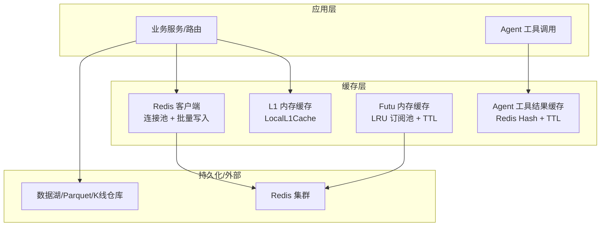
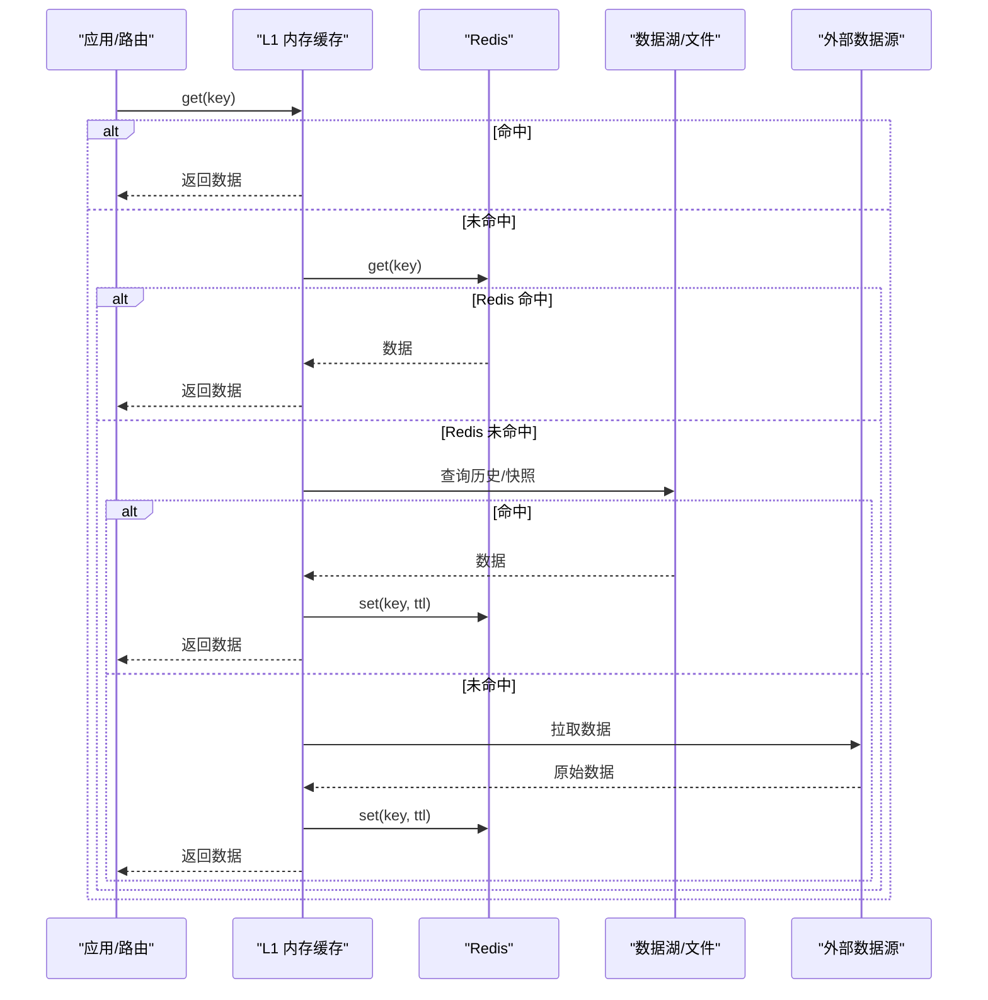
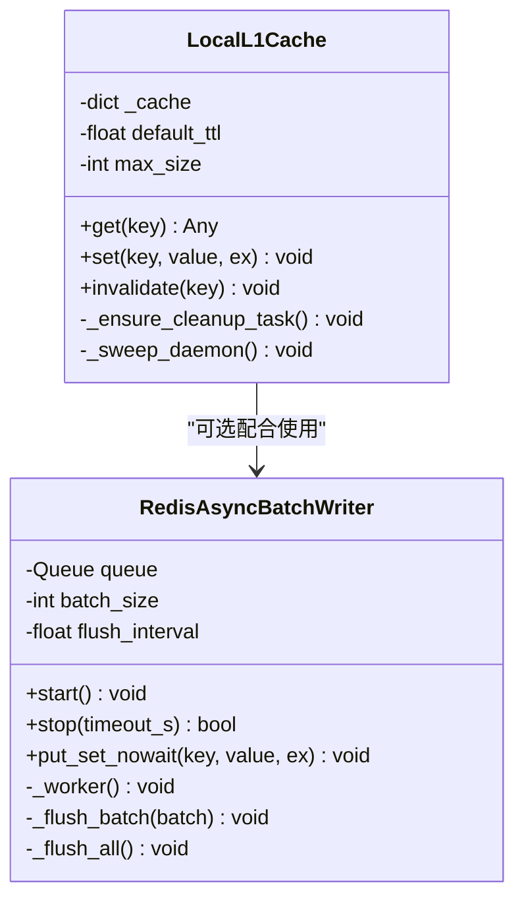
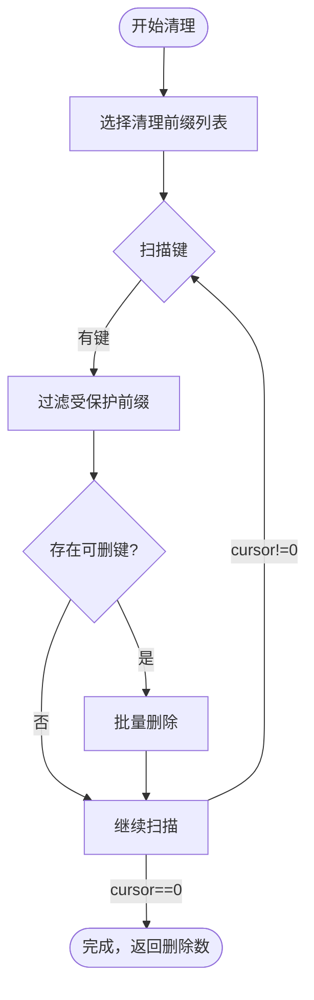
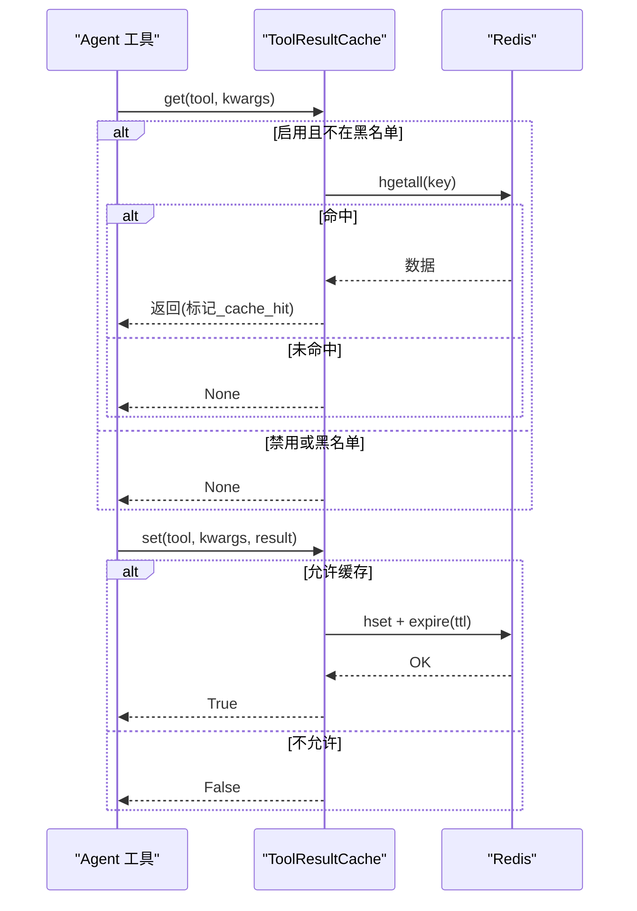
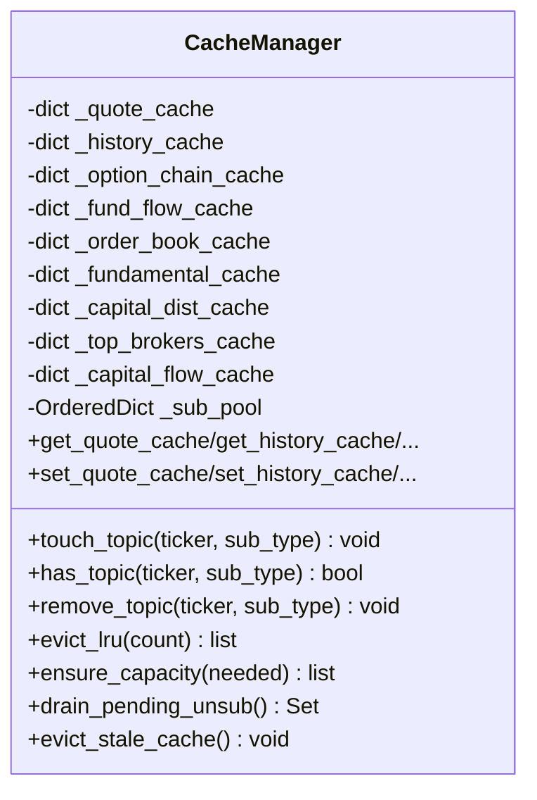
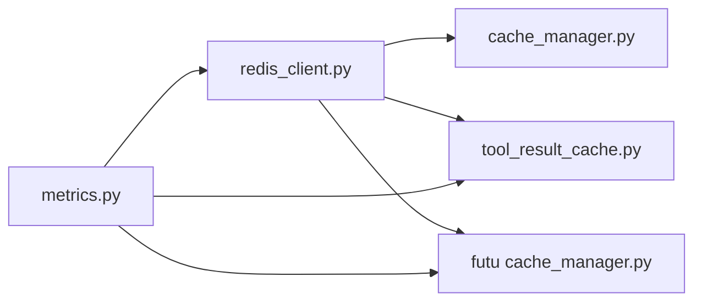

# 缓存机制

<cite>
**本文引用的文件**
- [backend/core/redis_client.py](file://backend/core/redis_client.py)
- [backend/core/cache_manager.py](file://backend/core/cache_manager.py)
- [hermes_agent/tool_result_cache.py](file://hermes_agent/tool_result_cache.py)
- [data_subservice/futu_src/cache_manager.py](file://data_subservice/futu_src/cache_manager.py)
- [backend/core/metrics.py](file://backend/core/metrics.py)
- [scripts/check_cache_status.py](file://scripts/check_cache_status.py)
- [scripts/debug_cache_hit.py](file://scripts/debug_cache_hit.py)
</cite>

## 目录
1. [简介](#简介)
2. [项目结构](#项目结构)
3. [核心组件](#核心组件)
4. [架构总览](#架构总览)
5. [详细组件分析](#详细组件分析)
6. [依赖关系分析](#依赖关系分析)
7. [性能考量与优化](#性能考量与优化)
8. [故障排查指南](#故障排查指南)
9. [结论](#结论)
10. [附录](#附录)

## 简介
本文件系统性梳理 Quant Agent 的多级缓存体系，覆盖 Redis 分布式缓存、进程内 L1 内存缓存、本地文件/数据湖快照等协同策略；说明 LRU 淘汰、TTL 过期、缓存预热、一致性保证、穿透防护、热点识别、批量写入与压缩存储等关键能力；并给出监控指标、命中率统计与容量管理实践。

## 项目结构
Quant Agent 的缓存相关代码主要分布在以下位置：
- 通用 Redis 客户端与 L1 内存缓存、异步批量写入器：backend/core/redis_client.py
- 统一业务缓存清理（保护交易态 key）：backend/core/cache_manager.py
- Agent 工具结果缓存（Redis Hash + TTL 策略）：hermes_agent/tool_result_cache.py
- Futu 子服务内存缓存与 LRU 订阅池：data_subservice/futu_src/cache_manager.py
- Prometheus 指标定义（含 K 线缓存命中、延迟等）：backend/core/metrics.py
- 诊断脚本：scripts/check_cache_status.py、scripts/debug_cache_hit.py

图表来源
- [backend/core/redis_client.py:184-251](file://backend/core/redis_client.py#L184-L251)
- [data_subservice/futu_src/cache_manager.py:30-149](file://data_subservice/futu_src/cache_manager.py#L30-L149)
- [hermes_agent/tool_result_cache.py:107-187](file://hermes_agent/tool_result_cache.py#L107-L187)
- [backend/core/metrics.py:287-301](file://backend/core/metrics.py#L287-L301)

章节来源
- [backend/core/redis_client.py:1-252](file://backend/core/redis_client.py#L1-L252)
- [backend/core/cache_manager.py:1-75](file://backend/core/cache_manager.py#L1-L75)
- [hermes_agent/tool_result_cache.py:1-195](file://hermes_agent/tool_result_cache.py#L1-L195)
- [data_subservice/futu_src/cache_manager.py:1-373](file://data_subservice/futu_src/cache_manager.py#L1-L373)
- [backend/core/metrics.py:1-641](file://backend/core/metrics.py#L1-L641)
- [scripts/check_cache_status.py:1-90](file://scripts/check_cache_status.py#L1-L90)
- [scripts/debug_cache_hit.py:1-243](file://scripts/debug_cache_hit.py#L1-L243)

## 核心组件
- Redis 客户端与连接池：集中配置 host/port/password/max_connections，统一作为数据总线与共享缓存。
- 异步批量写入器：将高频 set 操作入队，按批次通过 pipeline 写入，降低 RTT 与带宽占用。
- 进程内 L1 缓存：短 TTL 字典，get 时先查内存，未命中再回源 Redis；写时同步更新 L1/L2，具备容量熔断与后台清理任务。
- 统一缓存清理：按前缀扫描删除业务缓存，保护交易态 key（OMS 状态、持仓、活动挂单）。
- Agent 工具结果缓存：基于 Redis Hash 的 tool:cache:{tool}:{args_hash}，支持按工具 TTL、黑名单、错误/限流不缓存。
- Futu 内存缓存：多类数据独立缓存字典，带 TTL 与容量熔断；LRU 订阅池用于控制订阅数量并退订最久未用项。
- 指标观测：K 线缓存命中/延迟、Redis 队列深度/操作延迟、数据源可用性/拨测等。

章节来源
- [backend/core/redis_client.py:11-34](file://backend/core/redis_client.py#L11-L34)
- [backend/core/redis_client.py:46-177](file://backend/core/redis_client.py#L46-L177)
- [backend/core/redis_client.py:184-251](file://backend/core/redis_client.py#L184-L251)
- [backend/core/cache_manager.py:19-75](file://backend/core/cache_manager.py#L19-L75)
- [hermes_agent/tool_result_cache.py:20-87](file://hermes_agent/tool_result_cache.py#L20-L87)
- [hermes_agent/tool_result_cache.py:107-187](file://hermes_agent/tool_result_cache.py#L107-L187)
- [data_subservice/futu_src/cache_manager.py:12-20](file://data_subservice/futu_src/cache_manager.py#L12-L20)
- [data_subservice/futu_src/cache_manager.py:30-149](file://data_subservice/futu_src/cache_manager.py#L30-L149)
- [backend/core/metrics.py:287-301](file://backend/core/metrics.py#L287-L301)

## 架构总览
多级缓存从“最快到最慢”的访问路径如下：
- L1 内存缓存（进程内字典，默认 10s TTL，容量上限可配）
- Redis 缓存（共享、跨进程/节点）
- 数据湖/本地文件（K 线 Parquet、历史快照）
- 外部数据源（交易所/第三方 API）

图表来源
- [backend/core/redis_client.py:184-251](file://backend/core/redis_client.py#L184-L251)
- [backend/core/metrics.py:287-301](file://backend/core/metrics.py#L287-L301)

## 详细组件分析

### 组件一：Redis 客户端与 L1 内存缓存
- 连接池：统一 host/port/password，max_connections 限制防打满。
- 异步批量写入：RedisAsyncBatchWriter 使用 asyncio.Queue + pipeline，支持优雅停机 flush_all。
- L1 缓存：LocalL1Cache 提供 get/set/invalidate，默认 TTL 10s，容量超限安全清空；后台定时清理过期条目。

图表来源
- [backend/core/redis_client.py:184-251](file://backend/core/redis_client.py#L184-L251)
- [backend/core/redis_client.py:46-177](file://backend/core/redis_client.py#L46-L177)

章节来源
- [backend/core/redis_client.py:11-34](file://backend/core/redis_client.py#L11-L34)
- [backend/core/redis_client.py:46-177](file://backend/core/redis_client.py#L46-L177)
- [backend/core/redis_client.py:184-251](file://backend/core/redis_client.py#L184-L251)

### 组件二：统一缓存清理（保护交易态）
- 受保护前缀：quant:oms:*（活动订单、状态、持仓）在清理时被跳过。
- 默认清理前缀：quant:kline:*、quant:cache:*、quant:news:*、quant:macro:*、quant:insider*、yf_macro_cache_*。
- 实现：scan 模式匹配，过滤后批量 delete，记录日志与计数。

图表来源
- [backend/core/cache_manager.py:19-75](file://backend/core/cache_manager.py#L19-L75)

章节来源
- [backend/core/cache_manager.py:1-75](file://backend/core/cache_manager.py#L1-L75)

### 组件三：Agent 工具结果缓存（Redis Hash + TTL）
- Key 设计：tool:cache:{tool_name}:{args_hash}，字段包含 result/cached_at/status/tool。
- TTL 策略：环境变量覆盖 > 内置表 > 全局默认；可按工具名单独设置。
- 过滤规则：空结果、错误/限流/失败、显式 skip_cache 不缓存。
- 统计：进程内 hits/misses 计数。

图表来源
- [hermes_agent/tool_result_cache.py:20-87](file://hermes_agent/tool_result_cache.py#L20-L87)
- [hermes_agent/tool_result_cache.py:107-187](file://hermes_agent/tool_result_cache.py#L107-L187)

章节来源
- [hermes_agent/tool_result_cache.py:1-195](file://hermes_agent/tool_result_cache.py#L1-L195)

### 组件四：Futu 内存缓存与 LRU 订阅池
- 多类缓存：quote/history/option_chain/fund_flow/order_book/fundamental/capital_dist/top_brokers/capital_flow，各自 TTL 不同。
- 容量保护：单类最大条目数，超过则按时间排序清理一半；定期清理过期条目。
- LRU 订阅池：OrderedDict 维护 (ticker, sub_type) 最近访问时间；确保容量时淘汰最久未用订阅，并放入待退订队列由调用方执行实际退订。

图表来源
- [data_subservice/futu_src/cache_manager.py:30-149](file://data_subservice/futu_src/cache_manager.py#L30-L149)
- [data_subservice/futu_src/cache_manager.py:150-220](file://data_subservice/futu_src/cache_manager.py#L150-L220)

章节来源
- [data_subservice/futu_src/cache_manager.py:1-373](file://data_subservice/futu_src/cache_manager.py#L1-L373)

### 组件五：K 线缓存命中与延迟指标
- 指标：KLINE_CACHE_HIT（按 tier: redis/parquet/miss）、KLINE_CACHE_QUERY_LATENCY（按 tier）。
- 用途：评估三级缓存命中率与端到端查询延迟，指导容量与 TTL 调优。

章节来源
- [backend/core/metrics.py:287-301](file://backend/core/metrics.py#L287-L301)

## 依赖关系分析
- backend/core/redis_client.py 为所有缓存组件提供底层 Redis 能力（连接池、批量写入、L1 缓存）。
- backend/core/cache_manager.py 依赖 redis_client 进行 scan/delete。
- hermes_agent/tool_result_cache.py 依赖 redis_client 进行 Hash 读写与 TTL。
- data_subservice/futu_src/cache_manager.py 为进程内缓存，通常与 Redis 配合（如落盘/回源）。
- backend/core/metrics.py 提供统一的 Prometheus 指标，供各模块埋点。

图表来源
- [backend/core/redis_client.py:11-34](file://backend/core/redis_client.py#L11-L34)
- [backend/core/cache_manager.py:15-16](file://backend/core/cache_manager.py#L15-L16)
- [hermes_agent/tool_result_cache.py:118-120](file://hermes_agent/tool_result_cache.py#L118-L120)
- [backend/core/metrics.py:1-16](file://backend/core/metrics.py#L1-L16)

章节来源
- [backend/core/redis_client.py:1-252](file://backend/core/redis_client.py#L1-L252)
- [backend/core/cache_manager.py:1-75](file://backend/core/cache_manager.py#L1-L75)
- [hermes_agent/tool_result_cache.py:1-195](file://hermes_agent/tool_result_cache.py#L1-L195)
- [data_subservice/futu_src/cache_manager.py:1-373](file://data_subservice/futu_src/cache_manager.py#L1-L373)
- [backend/core/metrics.py:1-641](file://backend/core/metrics.py#L1-L641)

## 性能考量与优化
- 批量写入：使用 RedisAsyncBatchWriter 将高频 set 合并为 pipeline，减少网络往返与带宽占用；支持优雅停机 flush_all。
- L1 内存缓存：对极高频读取（如配置、开关）提供零阻塞访问；默认 TTL 短、容量上限触发安全清空，避免内存泄漏。
- 压缩存储：Futu 缓存提供 compress_quote_data/compress_chain_data，提取关键字段、截断过大结果，降低 Redis 体积与序列化开销。
- 热点识别：结合 metrics 中的 K 线缓存命中/延迟、Redis 队列深度、数据源拨测延迟等指标，定位热点与瓶颈。
- 容量管理：Futu 缓存单类最大条目与 TTL 清理；L1 缓存容量上限；Redis 连接池上限防止资源耗尽。
- 预热建议：启动后对热点标的/指标发起一次拉取，填充 L1/L2，降低冷启动抖动。

章节来源
- [backend/core/redis_client.py:46-177](file://backend/core/redis_client.py#L46-L177)
- [backend/core/redis_client.py:184-251](file://backend/core/redis_client.py#L184-L251)
- [data_subservice/futu_src/cache_manager.py:222-373](file://data_subservice/futu_src/cache_manager.py#L222-L373)
- [backend/core/metrics.py:287-301](file://backend/core/metrics.py#L287-L301)

## 故障排查指南
- 检查 L1 缓存状态与命中：使用 scripts/check_cache_status.py 查看 L1 条目数、TTL 剩余、YFinance 内存缓存与 Redis 调用计数。
- 深入诊断缓存命中路径：scripts/debug_cache_hit.py 可模拟 test-link 探测，验证是否绕过缓存以及指标隔离是否正确。
- 常见异常处理：
  - Redis 连接池耗尽：调整 REDIS_MAX_CONNECTIONS，观察 REDIS_QUEUE_DEPTH 与 REDIS_ERRORS。
  - L1 容量溢出：关注 L1 安全熔断日志，必要时增大 L1_CACHE_MAX_SIZE。
  - 误删风险：统一清理仅针对业务前缀，交易态 key 受保护；若需扩展保护前缀，请在 cache_manager 中追加。
  - Agent 工具缓存未命中：确认 TOOL_CACHE_ENABLED、TOOL_CACHE_TTL_{NAME}、no_cache_tools 配置与 should_cache_result 条件。

章节来源
- [scripts/check_cache_status.py:1-90](file://scripts/check_cache_status.py#L1-L90)
- [scripts/debug_cache_hit.py:1-243](file://scripts/debug_cache_hit.py#L1-L243)
- [backend/core/cache_manager.py:19-75](file://backend/core/cache_manager.py#L19-L75)
- [hermes_agent/tool_result_cache.py:53-104](file://hermes_agent/tool_result_cache.py#L53-L104)

## 结论
Quant Agent 的缓存体系以“L1 内存 + Redis + 数据湖/文件”的多级架构为核心，结合批量写入、压缩存储、LRU 与 TTL 策略，兼顾低延迟与高吞吐；通过统一清理与保护前缀保障数据安全；借助 Prometheus 指标实现可视化监控与容量治理。建议在上线前完成热点预热、容量阈值与 TTL 校准，并结合诊断脚本持续验证命中率与延迟分布。

## 附录
- 关键环境变量参考：
  - REDIS_HOST/REDIS_PORT/REDIS_PASSWORD/REDIS_MAX_CONNECTIONS
  - L1_CACHE_MAX_SIZE
  - TOOL_CACHE_ENABLED / TOOL_CACHE_DEFAULT_TTL / TOOL_CACHE_TTL_{NAME} / TOOL_CACHE_NO_CACHE
  - FUTU_MAX_SUBSCRIPTIONS
- 监控面板与指标：
  - K 线缓存命中/延迟：quant_kline_cache_hit_total、quant_kline_cache_query_seconds
  - Redis 队列深度/操作延迟：quant_redis_queue_depth、quant_redis_operation_latency_seconds
  - 数据源拨测/可用性：quant_datasource_probe_success、quant_datasource_availability

章节来源
- [backend/core/redis_client.py:11-34](file://backend/core/redis_client.py#L11-L34)
- [backend/core/metrics.py:74-94](file://backend/core/metrics.py#L74-L94)
- [backend/core/metrics.py:287-301](file://backend/core/metrics.py#L287-L301)
- [backend/core/metrics.py:184-217](file://backend/core/metrics.py#L184-L217)