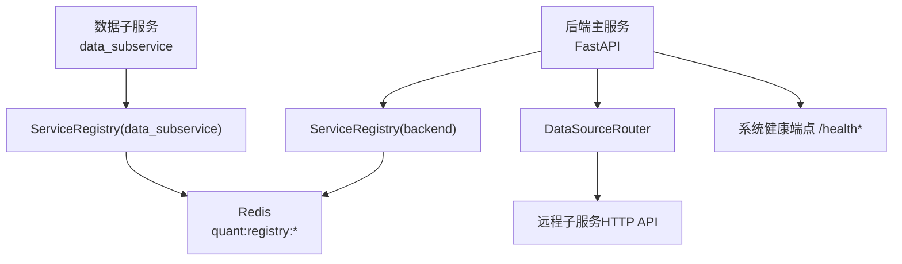
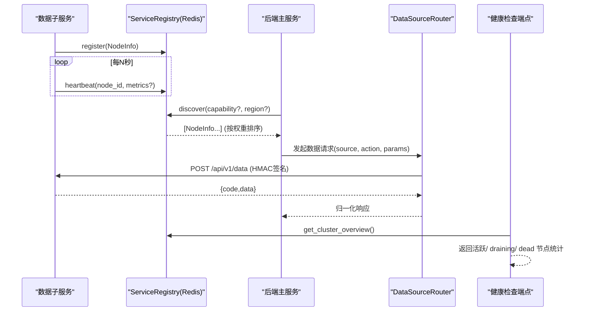
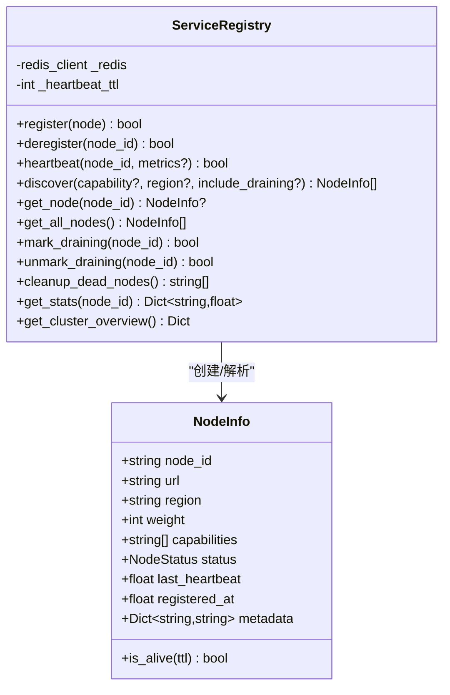
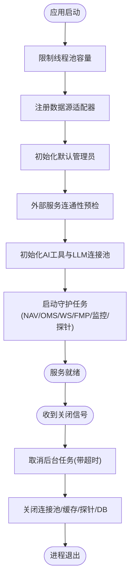
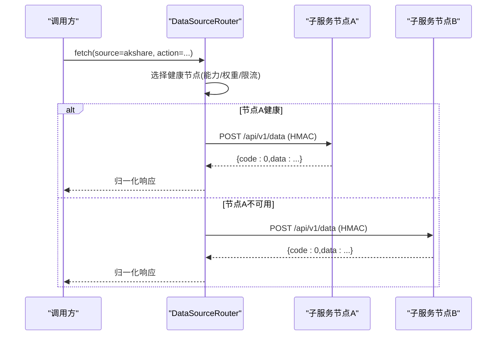
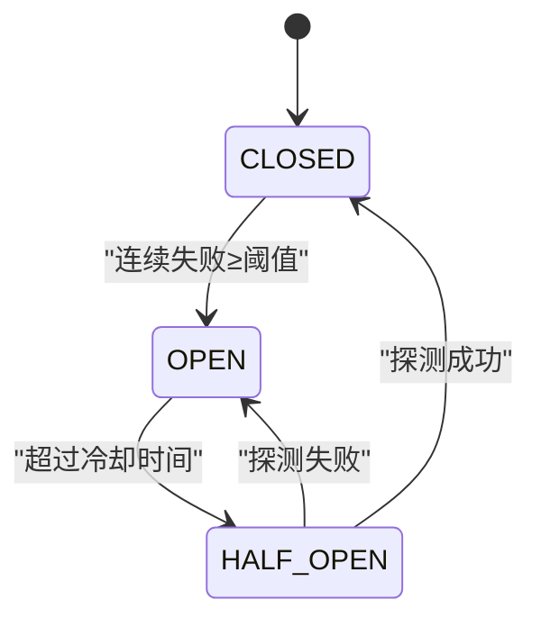
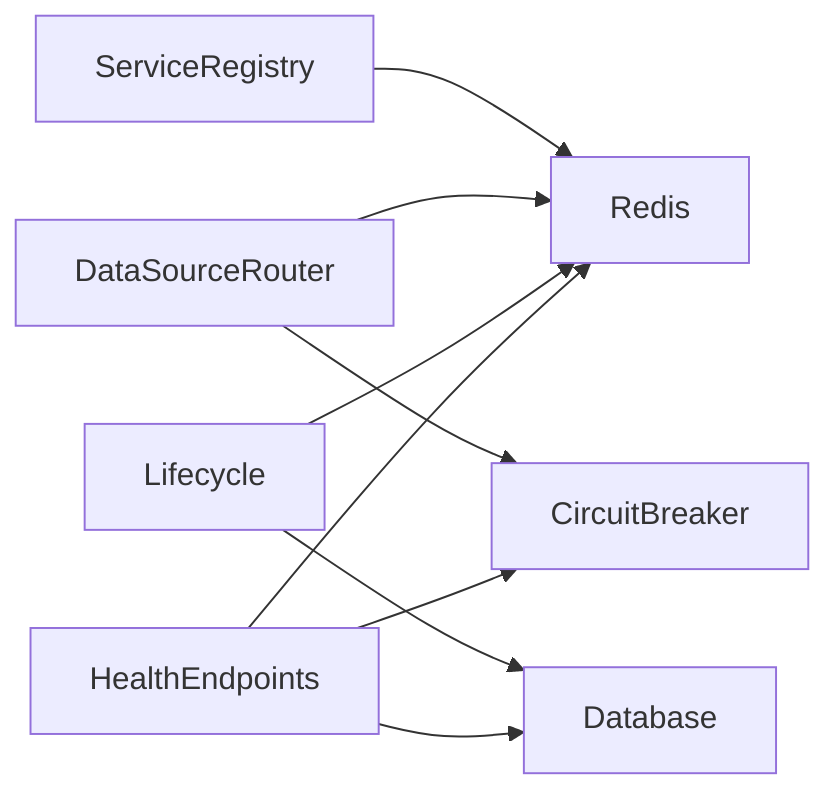

# 服务注册与发现

<cite>
**本文引用的文件**
- [backend/core/service_registry.py](file://backend/core/service_registry.py)
- [data_subservice/_internal/service_registry.py](file://data_subservice/_internal/service_registry.py)
- [backend/bootstrap/lifecycle.py](file://backend/bootstrap/lifecycle.py)
- [backend/core/config.py](file://backend/core/config.py)
- [backend/core/redis_client.py](file://backend/core/redis_client.py)
- [backend/services/datasource/router.py](file://backend/services/datasource/router.py)
- [backend/routers/system_health.py](file://backend/routers/system_health.py)
- [backend/core/circuit_breaker.py](file://backend/core/circuit_breaker.py)
</cite>

## 目录
1. [简介](#简介)
2. [项目结构](#项目结构)
3. [核心组件](#核心组件)
4. [架构总览](#架构总览)
5. [详细组件分析](#详细组件分析)
6. [依赖关系分析](#依赖关系分析)
7. [性能考量](#性能考量)
8. [故障排查指南](#故障排查指南)
9. [结论](#结论)
10. [附录](#附录)

## 简介
本设计文档围绕 Quant Agent 的“服务注册与发现”能力展开，重点阐述 ServiceRegistry 的核心功能（动态注册、健康检查、依赖注入）、服务生命周期管理（启动顺序、依赖解析、优雅关闭）、服务发现原理（本地与分布式）、配置管理机制（环境变量、配置文件、运行时更新）以及服务间通信模式（同步调用、异步消息、事件总线）。同时给出监控与容错机制（降级、熔断、重试）的设计与实践。

## 项目结构
Quant Agent 将“服务注册与发现”能力以 Redis 为中心实现：
- backend 侧提供分布式节点注册表、应用生命周期管理、Redis 客户端、数据源路由与健康检查端点。
- data_subservice 侧复制了 ServiceRegistry 的实现，用于子服务进程独立运行时的注册与发现。
- 通过统一键空间约定，主从节点共享同一份注册信息，支撑跨进程/跨机器的服务发现。

图表来源
- [backend/core/service_registry.py:1-417](file://backend/core/service_registry.py#L1-L417)
- [data_subservice/_internal/service_registry.py:1-320](file://data_subservice/_internal/service_registry.py#L1-L320)
- [backend/services/datasource/router.py:1-800](file://backend/services/datasource/router.py#L1-L800)
- [backend/routers/system_health.py:1-421](file://backend/routers/system_health.py#L1-L421)

章节来源
- [backend/core/service_registry.py:1-417](file://backend/core/service_registry.py#L1-L417)
- [data_subservice/_internal/service_registry.py:1-320](file://data_subservice/_internal/service_registry.py#L1-L320)
- [backend/bootstrap/lifecycle.py:1-492](file://backend/bootstrap/lifecycle.py#L1-L492)
- [backend/core/config.py:1-134](file://backend/core/config.py#L1-L134)
- [backend/core/redis_client.py:1-252](file://backend/core/redis_client.py#L1-L252)
- [backend/services/datasource/router.py:1-800](file://backend/services/datasource/router.py#L1-L800)
- [backend/routers/system_health.py:1-421](file://backend/routers/system_health.py#L1-L421)

## 核心组件
- ServiceRegistry（backend/data_subservice 双实现）
  - 基于 Redis Hash/ZSet/Set 三结构协同，维护节点信息与心跳，支持按能力/区域过滤的发现、优雅下线、死节点清理与统计指标。
- DataSourceRouter（数据源路由）
  - 负责将业务请求路由到远程数据子服务，具备节点权重、能力匹配、限流感知、半开自愈探针与 action 级熔断隔离。
- 应用生命周期管理器（lifespan）
  - 编排启动顺序（数据源适配器注册、后台任务拉起、探针启动），并在关闭阶段有序取消任务、释放资源。
- Redis 客户端与批量写入器
  - 提供连接池、高频批量写入队列与 L1 内存缓存，降低网络开销并保障优雅停机。
- 系统健康检查端点
  - 提供 liveness/readiness/deep 分级健康检查，聚合组件状态、数据源就绪情况与熔断状态。
- 熔断器
  - 提供 CLOSED/OPEN/HALF_OPEN 状态机，支持限流错误过滤、手动记录成功/失败、状态快照等。

章节来源
- [backend/core/service_registry.py:1-417](file://backend/core/service_registry.py#L1-L417)
- [data_subservice/_internal/service_registry.py:1-320](file://data_subservice/_internal/service_registry.py#L1-L320)
- [backend/services/datasource/router.py:1-800](file://backend/services/datasource/router.py#L1-L800)
- [backend/bootstrap/lifecycle.py:1-492](file://backend/bootstrap/lifecycle.py#L1-L492)
- [backend/core/redis_client.py:1-252](file://backend/core/redis_client.py#L1-L252)
- [backend/routers/system_health.py:1-421](file://backend/routers/system_health.py#L1-L421)
- [backend/core/circuit_breaker.py:1-379](file://backend/core/circuit_breaker.py#L1-L379)

## 架构总览
下图展示了服务注册与发现的整体交互：子服务启动时向 Redis 注册自身信息并定时心跳；主服务通过 ServiceRegistry 或 DataSourceRouter 发现可用节点，并以 HTTP 方式调用子服务接口；健康检查端点对外暴露集群与组件状态；熔断器保护外部依赖，避免雪崩。

图表来源
- [backend/core/service_registry.py:92-229](file://backend/core/service_registry.py#L92-L229)
- [data_subservice/_internal/service_registry.py:91-178](file://data_subservice/_internal/service_registry.py#L91-L178)
- [backend/services/datasource/router.py:669-748](file://backend/services/datasource/router.py#L669-L748)
- [backend/routers/system_health.py:173-355](file://backend/routers/system_health.py#L173-L355)

## 详细组件分析

### ServiceRegistry（分布式节点注册表）
- 关键数据结构
  - Hash quant:registry:nodes：存储节点 JSON（node_id、url、region、weight、capabilities、status、last_heartbeat、registered_at、metadata）。
  - ZSet quant:registry:heartbeats：{node_id: last_heartbeat_ts}，用于快速定位超时节点。
  - Set quant:registry:draining：标记优雅下线中的节点。
  - Hash quant:registry:stats:{node_id}：原子递增统计指标（如 success_count、error_count、avg_latency_ms）。
- 核心能力
  - 动态注册/注销：register/deregister 使用 pipeline 原子写入 nodes + heartbeats，注销时清理所有相关键。
  - 心跳与健康：heartbeat 更新 ZSet score 与 Hash 中 last_heartbeat，可选附带 metrics。
  - 服务发现：discover 支持 capability/region 过滤，排除 dead 与 draining（可选项），按 weight 降序返回。
  - 优雅下线：mark_draining/unmark_draining 修改 status 并加入 draining set。
  - 死节点清理：cleanup_dead_nodes 基于 ZSet 范围查询，批量删除过期节点。
  - 统计与总览：get_stats/get_cluster_overview 提供节点指标与集群视图。
- 复杂度与性能
  - 注册/心跳/发现均为 O(1)~O(log N) 的 Redis 操作；discover 在内存中对结果排序为 O(N log N)。
  - 使用 pipeline 减少 RTT，提升吞吐。
- 错误处理
  - 异常捕获并记录日志，返回布尔或空集合，保证调用方稳定。

图表来源
- [backend/core/service_registry.py:51-417](file://backend/core/service_registry.py#L51-L417)
- [data_subservice/_internal/service_registry.py:51-320](file://data_subservice/_internal/service_registry.py#L51-L320)

章节来源
- [backend/core/service_registry.py:92-417](file://backend/core/service_registry.py#L92-L417)
- [data_subservice/_internal/service_registry.py:91-320](file://data_subservice/_internal/service_registry.py#L91-L320)

### 服务生命周期管理（启动顺序、依赖解析、优雅关闭）
- 启动阶段
  - 初始化全局线程池限制，防止 OOM。
  - 注册数据源适配器（确保 Facade 经 Registry 选源）。
  - 初始化默认管理员账号。
  - 预检外部服务连通性（通知、宏观数据），超时则降级跳过。
  - 初始化 AI Tools 注册表与大模型连接池。
  - 启动各类守护任务：NAV 快照、OMS 持仓同步、MarketEngine 广播、Finnhub WS tick 回灌、FMP 盘后采集、限流告警消费器、数据源健康告警监控器、配额与成本监控器、可用性拨测 daemon、熔断自愈探针。
- 关闭阶段
  - 取消后台任务并等待完成（带超时保护）。
  - 关闭线程池、LLM 客户端、Redis 批量队列、临时缓存、数据源探针、外部 API 长连接、数据库连接池。
- 依赖解析
  - 通过导入时机与显式启动顺序控制依赖关系，例如先启动数据源适配器再启用路由与探针。

图表来源
- [backend/bootstrap/lifecycle.py:42-322](file://backend/bootstrap/lifecycle.py#L42-L322)
- [backend/bootstrap/lifecycle.py:324-492](file://backend/bootstrap/lifecycle.py#L324-L492)

章节来源
- [backend/bootstrap/lifecycle.py:42-492](file://backend/bootstrap/lifecycle.py#L42-L492)

### 服务发现原理（本地与分布式）
- 本地服务发现
  - 通过 ServiceRegistry 的 get_all_nodes/discover 获取当前 Redis 中的节点列表，适用于单进程或共享 Redis 的多进程场景。
- 分布式服务发现
  - 基于 Redis 作为共享状态存储，跨 VPS 节点共享注册信息；节点通过心跳维持存活状态，支持按能力/区域过滤与权重排序。
- 数据源路由
  - DataSourceRouter 根据环境变量配置多个远程节点（逗号分隔多活），结合能力匹配、权重、限流压力感知与半开自愈探针进行路由选择。
  - 请求通过 HMAC 签名发送至子服务统一入口 /api/v1/data，子服务处理后返回标准信封，主服务归一化为内部格式。

图表来源
- [backend/services/datasource/router.py:446-579](file://backend/services/datasource/router.py#L446-L579)
- [backend/services/datasource/router.py:669-748](file://backend/services/datasource/router.py#L669-L748)

章节来源
- [backend/services/datasource/router.py:1-800](file://backend/services/datasource/router.py#L1-L800)
- [backend/core/service_registry.py:188-229](file://backend/core/service_registry.py#L188-L229)

### 配置管理机制（环境变量、配置文件、运行时更新）
- 环境变量优先
  - Settings 类使用 pydantic-settings 加载 .env，支持大小写不敏感与额外字段忽略。
  - 关键配置包括数据库、Redis、LLM、数据源密钥、Futu OpenD、告警通道、内部通信安全、Meilisearch 等。
- 校验与约束
  - 对 DATABASE_URL、EMBEDDING_API_KEY 等必填字段进行强校验；实盘交易开启时必须配置 Futu 解锁密码。
- 运行时更新
  - 部分行为通过环境变量控制（如 DATA_SOURCE_ROUTER_ENABLED、CIRCUIT_BREAKER_COOLDOWN_S、DATASOURCE_PROBE_INTERVAL），重启生效；部分后台任务支持动态参数（如探针间隔）。

章节来源
- [backend/core/config.py:20-134](file://backend/core/config.py#L20-L134)
- [backend/services/datasource/router.py:343-350](file://backend/services/datasource/router.py#L343-L350)
- [backend/core/circuit_breaker.py:40-43](file://backend/core/circuit_breaker.py#L40-L43)

### 服务间通信模式（同步调用、异步消息、事件总线）
- 同步调用
  - 主服务通过 httpx 异步客户端向子服务发送 REST 请求（POST /api/v1/data），并进行 HMAC 签名与响应归一化。
- 异步消息
  - Redis 批量写入队列（RedisAsyncBatchWriter）采用 fire-and-forget 模式，后台协程批量 flush，降低网络开销。
- 事件总线
  - 通过 Redis Pub/Sub 与订阅服务（subscription_service）实现实时行情推送回灌（tick/broker/kline），主服务消费子服务桥接的消息。

章节来源
- [backend/services/datasource/router.py:669-748](file://backend/services/datasource/router.py#L669-L748)
- [backend/core/redis_client.py:46-177](file://backend/core/redis_client.py#L46-L177)
- [backend/bootstrap/lifecycle.py:235-258](file://backend/bootstrap/lifecycle.py#L235-L258)

### 监控与故障处理（降级、熔断、重试）
- 健康检查
  - /health 仅验证进程存活；/health/ready 检查 Redis、Postgres 与至少一个数据源连通；/health/deep 聚合组件、数据源、采集器、熔断状态、事件循环延迟等。
- 熔断器
  - 状态机 CLOSED→OPEN→HALF_OPEN→CLOSED，支持限流错误过滤、手动记录成功/失败、状态快照；冷却时间由环境变量控制。
- 重试策略
  - 数据源路由层根据 HTTP 状态码与响应头推断错误分类（限流、配额耗尽、IP封禁、普通错误），并结合 Retry-After 头进行退避；action 级熔断隔离避免误杀整节点。
- 降级
  - 当远程数据源不可用时，可通过离线 stub 构建降级响应；健康检查中若任一数据源连通即视为 ready。

图表来源
- [backend/core/circuit_breaker.py:45-97](file://backend/core/circuit_breaker.py#L45-L97)
- [backend/core/circuit_breaker.py:147-218](file://backend/core/circuit_breaker.py#L147-L218)

章节来源
- [backend/routers/system_health.py:173-355](file://backend/routers/system_health.py#L173-L355)
- [backend/core/circuit_breaker.py:45-379](file://backend/core/circuit_breaker.py#L45-L379)
- [backend/services/datasource/router.py:190-219](file://backend/services/datasource/router.py#L190-L219)

## 依赖关系分析
- ServiceRegistry 依赖 Redis 客户端，使用 pipeline 保证原子性与性能。
- DataSourceRouter 依赖 httpx 与 Redis（用于缓存/限流），并与熔断器集成。
- 生命周期管理器依赖各子系统（数据库、Redis、通知、市场引擎、监控器等），按顺序启动与关闭。
- 健康检查端点依赖数据库、Redis、数据源注册表与熔断器状态。

图表来源
- [backend/core/service_registry.py:84-119](file://backend/core/service_registry.py#L84-L119)
- [backend/services/datasource/router.py:249-288](file://backend/services/datasource/router.py#L249-L288)
- [backend/bootstrap/lifecycle.py:42-322](file://backend/bootstrap/lifecycle.py#L42-L322)
- [backend/routers/system_health.py:173-355](file://backend/routers/system_health.py#L173-L355)
- [backend/core/circuit_breaker.py:64-97](file://backend/core/circuit_breaker.py#L64-L97)

章节来源
- [backend/core/service_registry.py:84-119](file://backend/core/service_registry.py#L84-L119)
- [backend/services/datasource/router.py:249-288](file://backend/services/datasource/router.py#L249-L288)
- [backend/bootstrap/lifecycle.py:42-322](file://backend/bootstrap/lifecycle.py#L42-L322)
- [backend/routers/system_health.py:173-355](file://backend/routers/system_health.py#L173-L355)
- [backend/core/circuit_breaker.py:64-97](file://backend/core/circuit_breaker.py#L64-L97)

## 性能考量
- Redis 批量写入队列
  - 后台协程批量 flush，显著降低 RTT 与带宽占用；优雅关闭时确保队列清空。
- L1 内存缓存
  - 对高频读取的配置/开关进行本地缓存，设置 TTL 与容量上限，避免内存泄漏。
- 连接池与限流
  - Redis 连接池上限配置化，httpx 客户端设置连接数限制，避免资源耗尽。
- 事件循环保护
  - 全局线程池容量限制，防止阻塞导致事件循环拥塞。

章节来源
- [backend/core/redis_client.py:46-177](file://backend/core/redis_client.py#L46-L177)
- [backend/core/redis_client.py:184-252](file://backend/core/redis_client.py#L184-L252)
- [backend/bootstrap/lifecycle.py:51-66](file://backend/bootstrap/lifecycle.py#L51-L66)

## 故障排查指南
- 启动失败
  - 检查环境变量是否完整（DATABASE_URL、EMBEDDING_API_KEY、FUTU_PWD_UNLOCK 等），确认 Redis/Postgres 连通性。
  - 查看生命周期日志，确认数据源适配器注册与守护任务启动是否成功。
- 服务不可用
  - 通过 /health/ready 检查 Redis、Postgres 与数据源就绪情况；通过 /health/deep 查看组件详情与熔断状态。
  - 检查 ServiceRegistry 的集群总览，确认节点状态（active/draining/dead）与心跳是否正常。
- 熔断频繁
  - 查看熔断器状态快照，确认是否因限流或配额耗尽触发；调整 CIRCUIT_BREAKER_COOLDOWN_S 或 DATASOURCE_ACTION_MAX_FAILURES。
- 优雅关闭问题
  - 关注 shutdown 阶段的超时日志，确认后台任务是否能及时取消；检查 Redis 批量队列是否完全排空。

章节来源
- [backend/routers/system_health.py:173-355](file://backend/routers/system_health.py#L173-L355)
- [backend/core/service_registry.py:385-417](file://backend/core/service_registry.py#L385-L417)
- [backend/core/circuit_breaker.py:341-352](file://backend/core/circuit_breaker.py#L341-L352)
- [backend/bootstrap/lifecycle.py:324-492](file://backend/bootstrap/lifecycle.py#L324-L492)

## 结论
Quant Agent 的服务注册与发现系统以 Redis 为核心，实现了跨进程/跨机器的节点注册、心跳与健康检查、按能力与区域的发现、优雅下线与死节点清理。配合 DataSourceRouter 的远程路由、限流感知与半开自愈探针，以及熔断器与多级健康检查，形成了高可用的服务治理体系。生命周期管理器确保了启动与关闭的顺序与资源释放，配置管理通过环境变量与校验保证了部署一致性。整体设计兼顾了可扩展性、可观测性与容错能力。

## 附录
- 键空间约定
  - quant:registry:nodes、quant:registry:heartbeats、quant:registry:draining、quant:registry:stats:{node_id}
- 环境变量参考
  - REDIS_HOST/PORT/PASSWORD、DATA_SOURCE_ROUTER_ENABLED、CIRCUIT_BREAKER_COOLDOWN_S、DATASOURCE_PROBE_INTERVAL、*_REMOTE_URL 等

章节来源
- [backend/core/service_registry.py:31-40](file://backend/core/service_registry.py#L31-L40)
- [backend/core/config.py:31-92](file://backend/core/config.py#L31-L92)
- [backend/services/datasource/router.py:17-30](file://backend/services/datasource/router.py#L17-L30)
