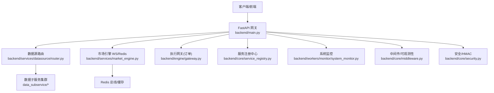
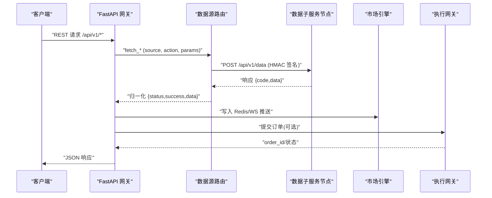
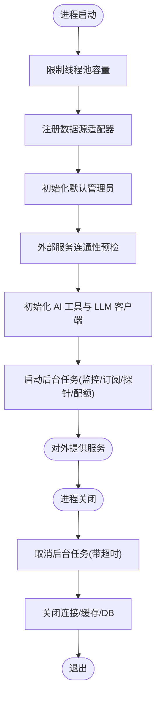
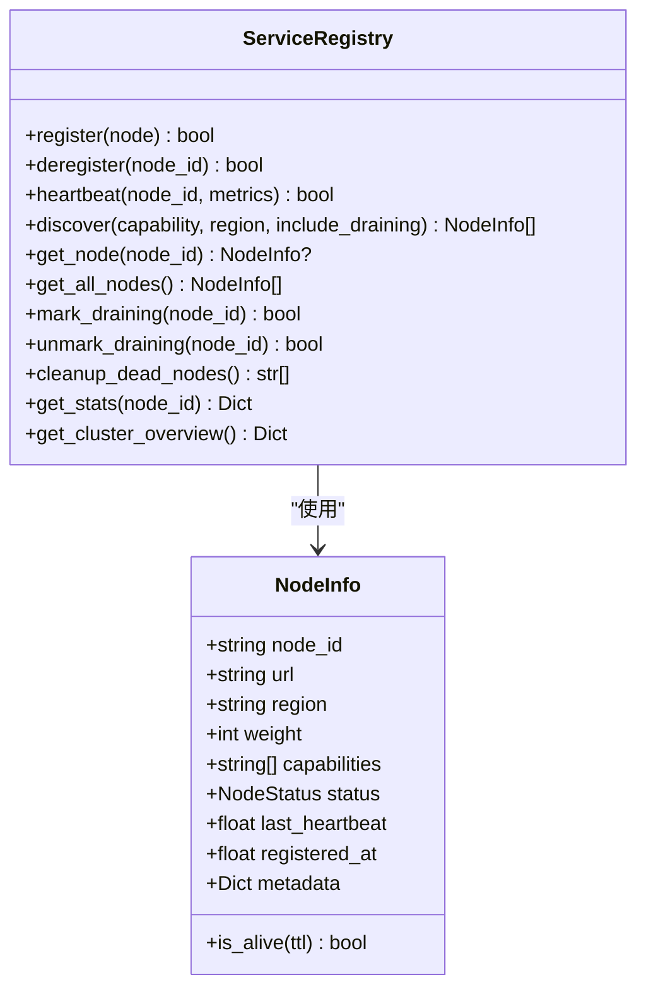
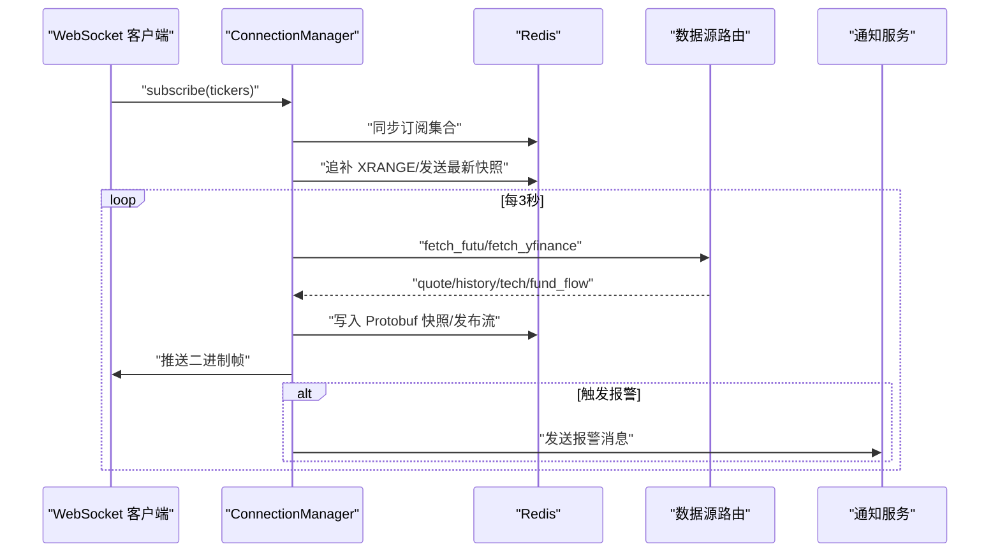
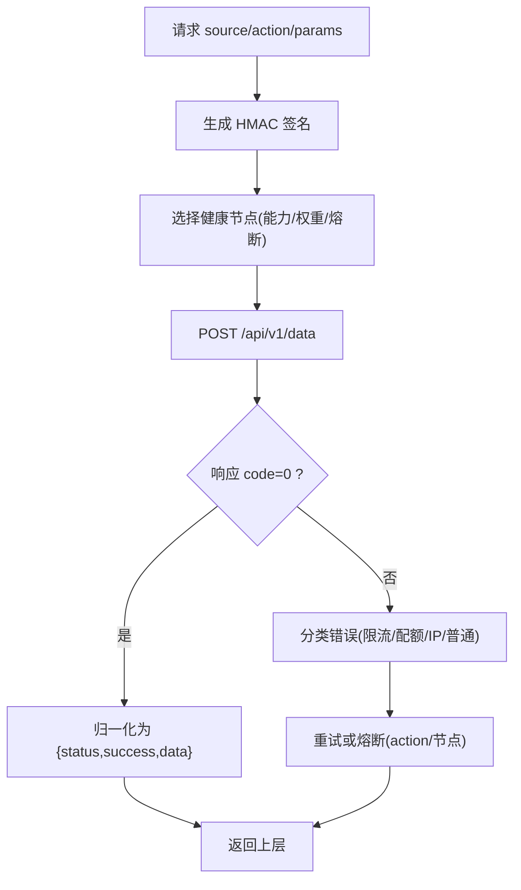
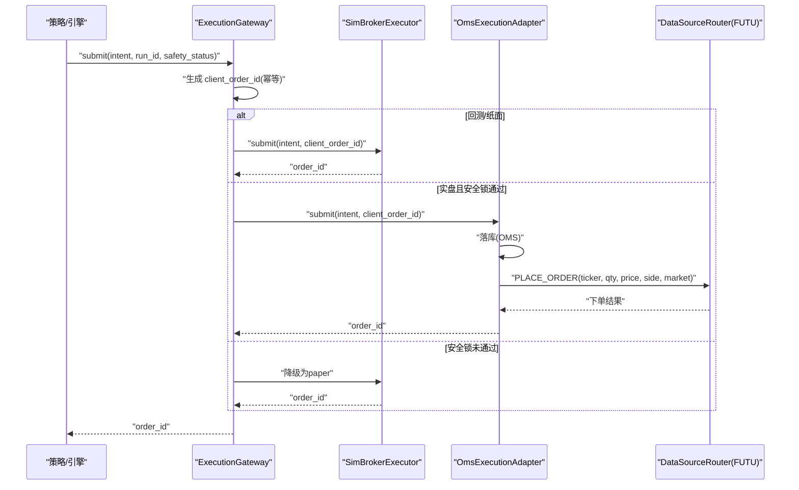
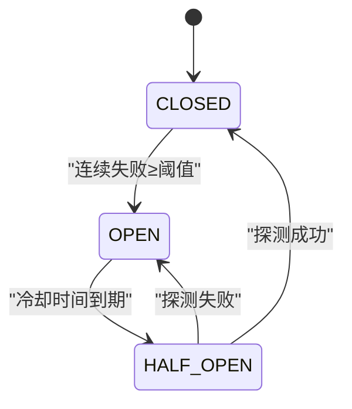
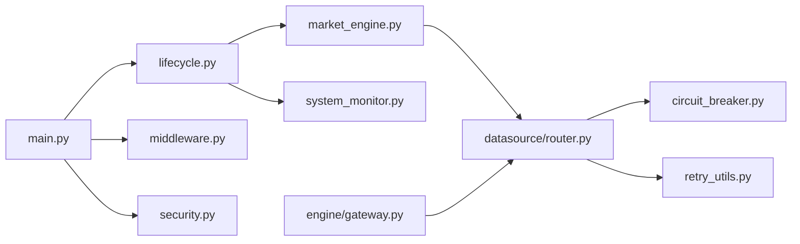

# 核心组件设计

<cite>
**本文引用的文件**
- [backend/main.py](file://backend/main.py)
- [backend/bootstrap/lifecycle.py](file://backend/bootstrap/lifecycle.py)
- [backend/core/service_registry.py](file://backend/core/service_registry.py)
- [backend/services/market_engine.py](file://backend/services/market_engine.py)
- [backend/engine/gateway.py](file://backend/engine/gateway.py)
- [backend/core/circuit_breaker.py](file://backend/core/circuit_breaker.py)
- [backend/core/retry_utils.py](file://backend/core/retry_utils.py)
- [backend/services/datasource/router.py](file://backend/services/datasource/router.py)
- [backend/workers/monitor/system_monitor.py](file://backend/workers/monitor/system_monitor.py)
- [backend/core/middleware.py](file://backend/core/middleware.py)
- [backend/core/security.py](file://backend/core/security.py)
</cite>

## 目录
1. [简介](#简介)
2. [项目结构](#项目结构)
3. [核心组件](#核心组件)
4. [架构总览](#架构总览)
5. [详细组件分析](#详细组件分析)
6. [依赖关系分析](#依赖关系分析)
7. [性能考量](#性能考量)
8. [故障排查指南](#故障排查指南)
9. [结论](#结论)

## 简介
本设计文档聚焦 Quant Agent 系统的核心组件与协作机制，覆盖 API 网关、市场引擎、服务注册中心、生命周期管理、数据源路由、熔断与重试等关键能力。文档以代码级为依据，给出组件职责、通信协议（REST、WebSocket、gRPC/Protobuf）、启动顺序、依赖注入、优雅关闭、服务发现与健康检查、负载均衡、错误处理与容错策略，并通过序列图与状态图说明复杂业务流程中的协作模式。

## 项目结构
后端采用 FastAPI 作为 API 网关，通过 lifespan 统一编排启动与关闭流程；市场引擎负责 WebSocket 行情推送与 Redis 总线；数据源路由将请求转发至分布式子服务节点；服务注册中心基于 Redis 实现跨节点注册与发现；执行网关提供回测/纸面/实盘统一的订单出口；系统监控守护事件循环健康；中间件提供访问日志与外部 API 观测；安全模块提供内部 HMAC 签名与密码哈希。

**图表来源**
- [backend/main.py:125-218](file://backend/main.py#L125-L218)
- [backend/services/datasource/router.py:249-289](file://backend/services/datasource/router.py#L249-L289)
- [backend/services/market_engine.py:115-170](file://backend/services/market_engine.py#L115-L170)
- [backend/engine/gateway.py:98-146](file://backend/engine/gateway.py#L98-L146)
- [backend/core/service_registry.py:69-119](file://backend/core/service_registry.py#L69-L119)
- [backend/workers/monitor/system_monitor.py:10-40](file://backend/workers/monitor/system_monitor.py#L10-L40)
- [backend/core/middleware.py:90-133](file://backend/core/middleware.py#L90-L133)
- [backend/core/security.py:37-118](file://backend/core/security.py#L37-L118)

**章节来源**
- [backend/main.py:125-218](file://backend/main.py#L125-L218)

## 核心组件
- API 网关：FastAPI 应用工厂集中挂载路由、中间件、OpenAPI、CORS、静态资源，暴露 /api/v1/* 业务接口。
- 生命周期管理：lifespan 统一完成线程池限制、数据源适配器注册、默认管理员初始化、后台任务拉起（NAV/OMS/MarketEngine/订阅回灌/探针/配额监控等），以及优雅关闭。
- 服务注册中心：基于 Redis Hash/ZSet/Set 的分布式节点注册表，支持心跳、发现、优雅下线、死节点清理与统计。
- 市场引擎：WebSocket 连接管理、Redis Pub/Sub 广播、Protobuf 序列化、技术指标与资金流轮询兜底、实时报警与风控。
- 数据源路由：统一 HTTP 调用 data_subservice，HMAC 签名鉴权，多节点负载均衡、限流感知、action 级熔断隔离、半开自愈探针。
- 执行网关：统一订单入口，支持 backtest/paper/live 三种模式，三级安全锁（环境变量/交易模式/熔断开关）与幂等去重，失败降级为纸面语义。
- 熔断与重试：通用熔断器（CLOSED/OPEN/HALF_OPEN），可配置冷却时间；十次重试装饰器按指数退避+随机抖动对网络/限流类错误自动重试。
- 系统监控：高频探测事件循环阻塞，超过阈值触发告警并落库，避免同步阻塞拖垮主循环。
- 中间件与安全：访问日志与 Prometheus 指标；外部 API 出站观测；内部服务间 HMAC 签名校验。

**章节来源**
- [backend/bootstrap/lifecycle.py:42-150](file://backend/bootstrap/lifecycle.py#L42-L150)
- [backend/core/service_registry.py:69-119](file://backend/core/service_registry.py#L69-L119)
- [backend/services/market_engine.py:115-170](file://backend/services/market_engine.py#L115-L170)
- [backend/services/datasource/router.py:249-289](file://backend/services/datasource/router.py#L249-L289)
- [backend/engine/gateway.py:98-146](file://backend/engine/gateway.py#L98-L146)
- [backend/core/circuit_breaker.py:64-119](file://backend/core/circuit_breaker.py#L64-L119)
- [backend/core/retry_utils.py:50-58](file://backend/core/retry_utils.py#L50-L58)
- [backend/workers/monitor/system_monitor.py:40-79](file://backend/workers/monitor/system_monitor.py#L40-L79)
- [backend/core/middleware.py:90-133](file://backend/core/middleware.py#L90-L133)
- [backend/core/security.py:37-118](file://backend/core/security.py#L37-L118)

## 架构总览
Quant Agent 采用“网关 + 引擎 + 路由 + 注册”的分层架构：
- 网关层：FastAPI 暴露 REST API，承载认证、限流、审计、可观测性等横切关注点。
- 引擎层：市场引擎维护 WebSocket 长连接与 Redis 总线，驱动行情与指标更新；执行网关统一订单路由。
- 路由层：数据源路由聚合多个数据子服务节点，提供负载均衡、熔断、重试、限流感知与自愈。
- 基础设施：服务注册中心、系统监控、中间件与安全模块提供支撑能力。

**图表来源**
- [backend/services/datasource/router.py:669-748](file://backend/services/datasource/router.py#L669-L748)
- [backend/services/market_engine.py:39-113](file://backend/services/market_engine.py#L39-L113)
- [backend/engine/gateway.py:116-186](file://backend/engine/gateway.py#L116-L186)
- [backend/core/security.py:37-118](file://backend/core/security.py#L37-L118)

## 详细组件分析

### API 网关（FastAPI）
- 职责：创建应用、安装 OpenAPI、注册异常处理器与中间件、挂载所有业务路由、提供静态资源。
- 关键点：
  - 全局 socket 超时防御，防止底层阻塞导致线程死锁。
  - 数据库扩展与索引在启动时自动创建。
  - CORS 与访问日志中间件顺序严格保证 OPTIONS 预检不被误拦截。
  - 路由统一前缀 /api/v1，便于版本化管理。

**章节来源**
- [backend/main.py:25-57](file://backend/main.py#L25-L57)
- [backend/main.py:125-218](file://backend/main.py#L125-L218)

### 生命周期管理（Startup/Shutdown）
- 启动阶段：
  - 限制全局线程池容量，防止 OOM。
  - 注册数据源适配器，初始化默认管理员账号。
  - 外部服务连通性预检（通知/FRED），超时降级跳过。
  - 初始化 AI 工具注册表与大模型客户端。
  - 启动后台任务：系统监控、MarketEngine 广播、订阅回灌（Finnhub/Futu broker/kline）、FMP 财报缓存、限流告警消费器、数据源健康监控、配额成本监控、可用性拨测、熔断自愈探针。
- 关闭阶段：
  - 有序取消后台任务，等待最多 30s。
  - 关闭 LLM 客户端、Redis 批量队列、临时缓存、数据源探针、HTTP 连接池、数据库连接池。
  - 记录关闭耗时与各步骤时间线。

**图表来源**
- [backend/bootstrap/lifecycle.py:42-150](file://backend/bootstrap/lifecycle.py#L42-L150)
- [backend/bootstrap/lifecycle.py:324-492](file://backend/bootstrap/lifecycle.py#L324-L492)

**章节来源**
- [backend/bootstrap/lifecycle.py:42-150](file://backend/bootstrap/lifecycle.py#L42-L150)
- [backend/bootstrap/lifecycle.py:324-492](file://backend/bootstrap/lifecycle.py#L324-L492)

### 服务注册中心（分布式节点注册表）
- 数据结构：
  - Hash quant:registry:nodes：节点信息 JSON。
  - ZSet quant:registry:heartbeats：按心跳时间排序。
  - Set quant:registry:draining：优雅下线中节点。
  - Hash quant:registry:stats:{node_id}：节点统计指标。
- 能力：
  - 注册/注销节点，原子管道操作。
  - 心跳更新与存活判定（TTL）。
  - 发现可用节点（按能力/区域过滤，权重排序）。
  - 优雅下线标记与恢复。
  - 清理死节点（后台周期任务）。
  - 获取集群总览与节点统计。

**图表来源**
- [backend/core/service_registry.py:51-67](file://backend/core/service_registry.py#L51-L67)
- [backend/core/service_registry.py:69-119](file://backend/core/service_registry.py#L69-L119)
- [backend/core/service_registry.py:188-229](file://backend/core/service_registry.py#L188-L229)
- [backend/core/service_registry.py:269-314](file://backend/core/service_registry.py#L269-L314)
- [backend/core/service_registry.py:320-353](file://backend/core/service_registry.py#L320-L353)
- [backend/core/service_registry.py:385-417](file://backend/core/service_registry.py#L385-L417)

**章节来源**
- [backend/core/service_registry.py:69-119](file://backend/core/service_registry.py#L69-L119)
- [backend/core/service_registry.py:188-229](file://backend/core/service_registry.py#L188-L229)
- [backend/core/service_registry.py:269-314](file://backend/core/service_registry.py#L269-L314)
- [backend/core/service_registry.py:320-353](file://backend/core/service_registry.py#L320-L353)
- [backend/core/service_registry.py:385-417](file://backend/core/service_registry.py#L385-L417)

### 市场引擎（WebSocket/Redis/Protobuf）
- 职责：
  - WebSocket 连接管理与订阅/反订阅。
  - Redis Pub/Sub 监听与定向推送。
  - Protobuf 序列化行情数据，写入 latest 快照与流式通道。
  - 技术指标与资金流轮询兜底（优先 Futu，失败走 YFinance）。
  - 实时价格突破/跌破报警与宏观风控预警。
  - 账户资产快照与持仓同步守护进程。
- 关键优化：
  - 追补断线数据（XRANGE）与批量压缩帧发送。
  - 防请求风暴：技术面指标与资金流刷新节流、失败退避。
  - 动态 GC 富途订阅槽位，释放闲置标的。
  - 熔断与降级：Futu 全面断连时自动切换 YFinance 兜底并报警。

**图表来源**
- [backend/services/market_engine.py:115-170](file://backend/services/market_engine.py#L115-L170)
- [backend/services/market_engine.py:191-244](file://backend/services/market_engine.py#L191-L244)
- [backend/services/market_engine.py:296-331](file://backend/services/market_engine.py#L296-L331)
- [backend/services/market_engine.py:332-598](file://backend/services/market_engine.py#L332-L598)
- [backend/services/market_engine.py:39-113](file://backend/services/market_engine.py#L39-L113)

**章节来源**
- [backend/services/market_engine.py:115-170](file://backend/services/market_engine.py#L115-L170)
- [backend/services/market_engine.py:191-244](file://backend/services/market_engine.py#L191-L244)
- [backend/services/market_engine.py:296-331](file://backend/services/market_engine.py#L296-L331)
- [backend/services/market_engine.py:332-598](file://backend/services/market_engine.py#L332-L598)
- [backend/services/market_engine.py:39-113](file://backend/services/market_engine.py#L39-L113)

### 数据源路由（分布式子服务聚合）
- 职责：
  - 统一 POST /api/v1/data 到各数据子服务节点。
  - HMAC-SHA256 签名与验签，防止内网横向渗透。
  - 多节点负载均衡与权重选择，支持逗号分隔多活 URL。
  - 限流压力感知与 action 级熔断隔离，节点级兜底阈值。
  - 半开自愈探针周期性探活，恢复 healthy 节点。
  - 响应归一化，兼容不同子服务信封格式。
- 关键特性：
  - 启动期校验 REMOTE_URL 端口，避免误指向主服务自身。
  - 部署重置熔断状态，避免历史残留污染新进程。
  - 识别限流/配额耗尽/IP 封禁等错误类别，配合重试与熔断。

**图表来源**
- [backend/services/datasource/router.py:586-600](file://backend/services/datasource/router.py#L586-L600)
- [backend/services/datasource/router.py:669-748](file://backend/services/datasource/router.py#L669-L748)
- [backend/services/datasource/router.py:786-800](file://backend/services/datasource/router.py#L786-L800)
- [backend/services/datasource/router.py:310-387](file://backend/services/datasource/router.py#L310-L387)
- [backend/services/datasource/router.py:249-289](file://backend/services/datasource/router.py#L249-L289)

**章节来源**
- [backend/services/datasource/router.py:249-289](file://backend/services/datasource/router.py#L249-L289)
- [backend/services/datasource/router.py:586-600](file://backend/services/datasource/router.py#L586-L600)
- [backend/services/datasource/router.py:669-748](file://backend/services/datasource/router.py#L669-L748)
- [backend/services/datasource/router.py:786-800](file://backend/services/datasource/router.py#L786-L800)
- [backend/services/datasource/router.py:310-387](file://backend/services/datasource/router.py#L310-L387)

### 执行网关（订单出口）
- 职责：
  - 统一 OrderIntent 路由到 SimBroker（回测/纸面）或 OMS 实盘执行。
  - 三级安全锁：REAL_TRADE_EXECUTE 环境变量、trading_mode=LIVE、kill_switch 未触发。
  - 幂等去重：client_order_id = hash(run_id:symbol:side:tag)。
  - 降级路径：安全锁未通过时降级为 paper 语义，保障策略运行不中断。
- 实盘适配：
  - 通过 OMS 落库，非模拟盘经 DataSourceRouter 调用 futu PLACE_ORDER。
  - 异步桥接：兼容无事件循环上下文调用。

**图表来源**
- [backend/engine/gateway.py:98-146](file://backend/engine/gateway.py#L98-L146)
- [backend/engine/gateway.py:148-186](file://backend/engine/gateway.py#L148-L186)
- [backend/engine/gateway.py:215-359](file://backend/engine/gateway.py#L215-L359)

**章节来源**
- [backend/engine/gateway.py:98-146](file://backend/engine/gateway.py#L98-L146)
- [backend/engine/gateway.py:148-186](file://backend/engine/gateway.py#L148-L186)
- [backend/engine/gateway.py:215-359](file://backend/engine/gateway.py#L215-L359)

### 熔断与重试（容错设计）
- 熔断器：
  - 状态机：CLOSED → OPEN（连续失败≥阈值）→ HALF_OPEN（冷却后探测）→ CLOSED（成功）/OPEN（失败）。
  - 限流错误过滤：可通过 error_classifier 或 is_rate_limit_error 钩子排除限流类错误计入失败计数。
  - 指标埋点：状态与转换次数上报。
- 重试：
  - 指数退避+随机抖动，针对网络错误、限流、服务端崩溃等可重试场景。
  - 日志钩子记录每次重试尝试。

**图表来源**
- [backend/core/circuit_breaker.py:45-97](file://backend/core/circuit_breaker.py#L45-L97)
- [backend/core/circuit_breaker.py:147-218](file://backend/core/circuit_breaker.py#L147-L218)
- [backend/core/retry_utils.py:50-58](file://backend/core/retry_utils.py#L50-L58)

**章节来源**
- [backend/core/circuit_breaker.py:45-97](file://backend/core/circuit_breaker.py#L45-L97)
- [backend/core/circuit_breaker.py:147-218](file://backend/core/circuit_breaker.py#L147-L218)
- [backend/core/retry_utils.py:50-58](file://backend/core/retry_utils.py#L50-L58)

### 系统监控与可观测性
- 事件循环监控：高频探测阻塞延迟，超过阈值触发告警并落库，避免同步代码阻塞主循环。
- 中间件：
  - 访问日志与 Prometheus 指标（请求数、延迟直方图）。
  - 外部 API 出站观测（服务名、方法、状态码、耗时）。
- 安全：
  - 内部服务间 HMAC 签名生成与验证，防止未授权访问。
  - 密码哈希与验证（bcrypt）。

**章节来源**
- [backend/workers/monitor/system_monitor.py:40-79](file://backend/workers/monitor/system_monitor.py#L40-L79)
- [backend/core/middleware.py:90-133](file://backend/core/middleware.py#L90-L133)
- [backend/core/security.py:37-118](file://backend/core/security.py#L37-L118)

## 依赖关系分析
- 耦合度：
  - 网关与路由强耦合：所有数据请求经路由转发，解耦具体数据源实现。
  - 市场引擎与 Redis 强耦合：依赖 Redis 进行快照、流式广播与订阅集合同步。
  - 执行网关与 OMS/DataSourceRouter 松耦合：通过协议与适配器抽象，支持模拟/实盘切换。
- 外部依赖：
  - Redis：注册中心、缓存、Pub/Sub、队列。
  - PostgreSQL：持久化（NavSnapshot、PerformanceLog 等）。
  - 数据子服务：YFinance/Tushare/AKShare/Futu/FMP/Finnhub/Macro 等。
- 潜在环依赖：
  - 通过分层与模块化导入（如 lifespan 中延迟导入）避免循环依赖。
  - 数据源路由与熔断器解耦，熔断器仅关注状态机与指标。

**图表来源**
- [backend/main.py:125-218](file://backend/main.py#L125-L218)
- [backend/bootstrap/lifecycle.py:42-150](file://backend/bootstrap/lifecycle.py#L42-L150)
- [backend/services/market_engine.py:115-170](file://backend/services/market_engine.py#L115-L170)
- [backend/services/datasource/router.py:249-289](file://backend/services/datasource/router.py#L249-L289)
- [backend/engine/gateway.py:98-146](file://backend/engine/gateway.py#L98-L146)

**章节来源**
- [backend/main.py:125-218](file://backend/main.py#L125-L218)
- [backend/bootstrap/lifecycle.py:42-150](file://backend/bootstrap/lifecycle.py#L42-L150)
- [backend/services/market_engine.py:115-170](file://backend/services/market_engine.py#L115-L170)
- [backend/services/datasource/router.py:249-289](file://backend/services/datasource/router.py#L249-L289)
- [backend/engine/gateway.py:98-146](file://backend/engine/gateway.py#L98-L146)

## 性能考量
- 线程池限制：全局最大 64 线程，防止 OOM。
- 请求追踪：Prometheus 指标细粒度桶，P99/P95 计算。
- 外部 API 观测：出站请求耗时与状态码统计，慢请求告警。
- 行情推送优化：
  - Protobuf 二进制传输，减少序列化开销。
  - 批量压缩帧发送，降低网络带宽占用。
  - 技术指标与资金流刷新节流，避免请求风暴。
- 熔断与重试：
  - 动作级熔断隔离，避免单 action 失败影响整节点。
  - 指数退避+随机抖动，缓解瞬时拥塞。
- 事件循环保护：高频阻塞检测，及时告警并落库。

[本节为通用性能指导，无需特定文件引用]

## 故障排查指南
- 启动失败：
  - 检查 REMOTE_URL 是否误指向主服务自身端口（路由启动期会告警）。
  - 确认 DATA_SOURCE_HMAC_SECRET 已配置，否则远程请求 403。
  - 查看外部服务连通性预检日志（通知/FRED 超时降级）。
- 行情异常：
  - 观察 MarketEngine 日志，确认 Futu/YFinance 切换与报警。
  - 检查 Redis 键 quant:quotes:latest 与 quant:ws:subscribed_tickers。
  - 确认 WebSocket 连接与订阅集合同步。
- 数据源不可用：
  - 查看路由节点状态与熔断冷却时间，确认半开探针是否恢复。
  - 检查 action 级熔断与节点级兜底阈值。
- 订单失败：
  - 检查执行网关安全锁状态（环境变量/交易模式/熔断开关）。
  - 确认 OMS 落库与 Futu 下单链路。
- 性能问题：
  - 通过 Prometheus 指标定位慢接口与外部 API。
  - 关注事件循环阻塞告警与性能日志。

**章节来源**
- [backend/services/datasource/router.py:411-444](file://backend/services/datasource/router.py#L411-L444)
- [backend/services/datasource/router.py:310-387](file://backend/services/datasource/router.py#L310-L387)
- [backend/services/market_engine.py:332-598](file://backend/services/market_engine.py#L332-L598)
- [backend/engine/gateway.py:116-186](file://backend/engine/gateway.py#L116-L186)
- [backend/workers/monitor/system_monitor.py:40-79](file://backend/workers/monitor/system_monitor.py#L40-L79)

## 结论
Quant Agent 通过清晰的层次划分与严格的容错设计，实现了高可用的量化交易系统：
- API 网关统一入口，生命周期管理确保服务就绪与优雅关闭。
- 市场引擎提供低延迟行情推送与智能兜底，保障前端体验。
- 数据源路由聚合多节点，具备负载均衡、限流感知、action 级熔断与自愈能力。
- 执行网关提供安全的订单出口，支持回测/纸面/实盘无缝切换。
- 熔断与重试机制提升系统韧性，监控与中间件保障可观测性。
该设计在复杂业务场景中展现出良好的扩展性与稳定性，适合大规模分布式部署与持续演进。
