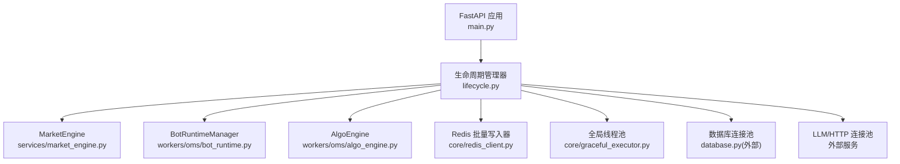
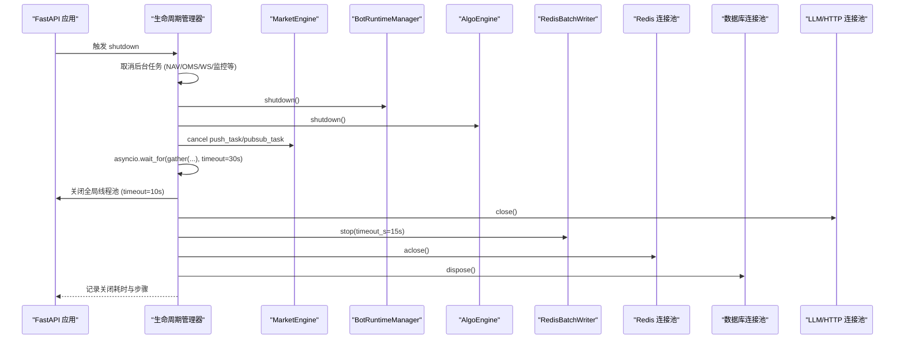
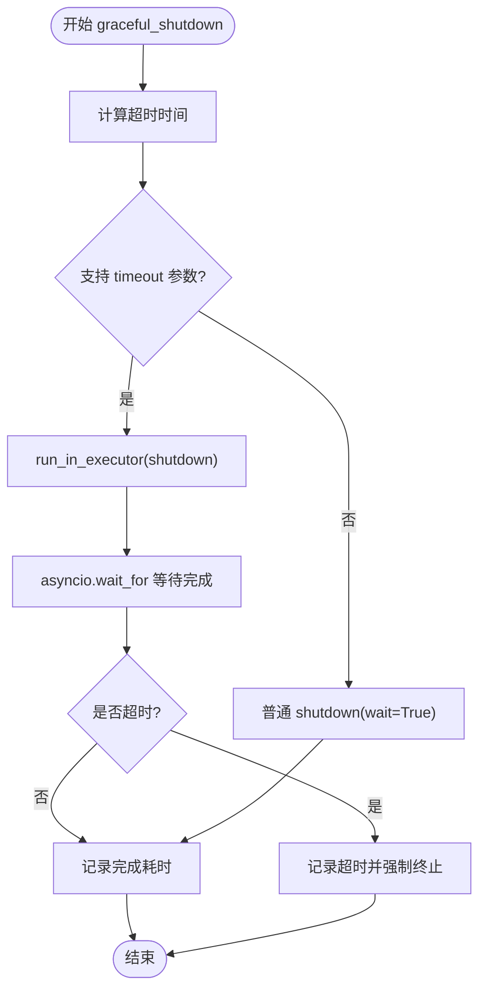
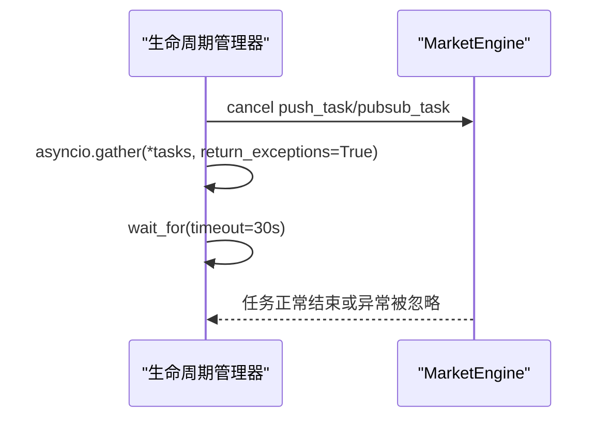
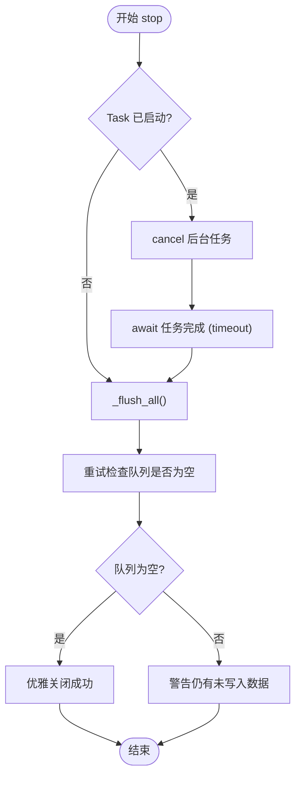
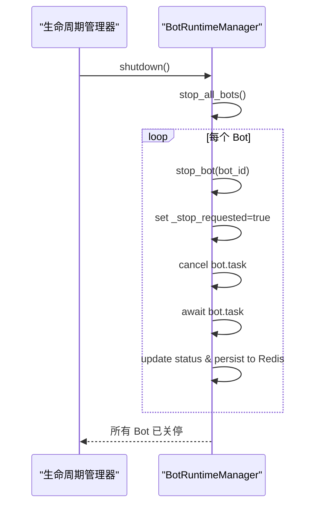
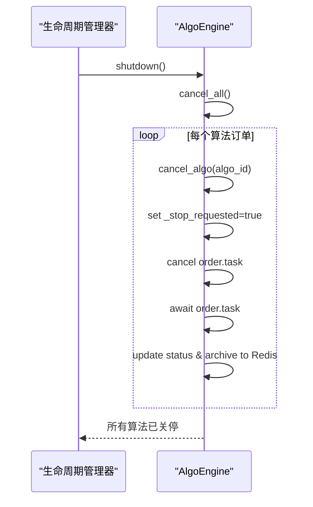
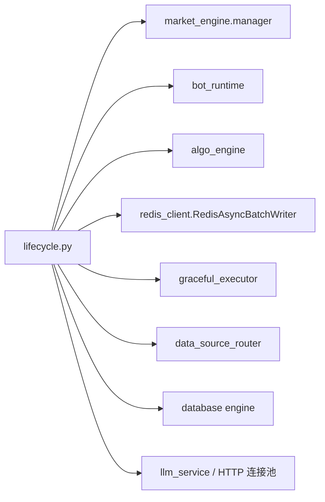

# 优雅关闭机制

<cite>
**本文引用的文件**
- [backend/core/graceful_executor.py](file://backend/core/graceful_executor.py)
- [backend/bootstrap/lifecycle.py](file://backend/bootstrap/lifecycle.py)
- [backend/main.py](file://backend/main.py)
- [backend/services/market_engine.py](file://backend/services/market_engine.py)
- [backend/core/redis_client.py](file://backend/core/redis_client.py)
- [backend/workers/oms/bot_runtime.py](file://backend/workers/oms/bot_runtime.py)
- [backend/workers/oms/algo_engine.py](file://backend/workers/oms/algo_engine.py)
</cite>

## 目录
1. [引言](#引言)
2. [项目结构](#项目结构)
3. [核心组件](#核心组件)
4. [架构总览](#架构总览)
5. [详细组件分析](#详细组件分析)
6. [依赖关系分析](#依赖关系分析)
7. [性能与超时保护](#性能与超时保护)
8. [故障排查指南](#故障排查指南)
9. [结论](#结论)
10. [附录：容器化环境下的优雅关闭最佳实践](#附录容器化环境下的优雅关闭最佳实践)

## 引言
本设计文档聚焦于 Quant Agent 的优雅关闭机制，覆盖应用关闭阶段的完整流程：后台任务取消、资源释放、状态保存、连接池关闭等。重点阐述 GracefulExecutor 的优雅执行机制（任务调度、异常处理、超时控制），并明确各组件的关闭顺序（BotRuntimeManager、AlgoEngine、MarketEngine、Redis 连接池等）。同时提供关闭过程的超时保护、监控与诊断能力，以及容器化环境下的最佳实践建议。

## 项目结构
Quant Agent 的优雅关闭由 FastAPI 生命周期管理器统一编排，结合各子系统提供的 shutdown 接口，形成“先停业务、再停基础设施”的有序关闭链。关键入口与职责如下：
- 应用入口 main.py：创建 FastAPI 应用并挂载路由，通过 lifespan 注入生命周期管理。
- 生命周期 lifecycle.py：集中实现启动与销毁阶段逻辑，协调后台任务、服务、连接池的关闭。
- 市场引擎 services/market_engine.py：负责行情广播、Redis Pub/Sub 监听等后台协程的生命周期管理。
- Redis 客户端 core/redis_client.py：提供批量写入队列与 L1 缓存，支持优雅停止与数据排空。
- OMS 运行时 workers/oms/bot_runtime.py：策略 Bot 运行时的生命周期管理，支持恢复与关停。
- 算法拆单引擎 workers/oms/algo_engine.py：算法订单生命周期管理，支持暂停、恢复、取消与归档。
- 线程池封装 core/graceful_executor.py：为系统级线程池提供异步优雅关闭能力。

**图表来源**
- [backend/main.py:125-133](file://backend/main.py#L125-L133)
- [backend/bootstrap/lifecycle.py:42-322](file://backend/bootstrap/lifecycle.py#L42-L322)
- [backend/bootstrap/lifecycle.py:324-492](file://backend/bootstrap/lifecycle.py#L324-L492)

**章节来源**
- [backend/main.py:125-222](file://backend/main.py#L125-L222)
- [backend/bootstrap/lifecycle.py:42-322](file://backend/bootstrap/lifecycle.py#L42-L322)

## 核心组件
- GracefulExecutor：基于 ThreadPoolExecutor 的增强封装，提供异步优雅关闭、统计指标、超时控制，避免默认 shutdown(wait=False) 的中断问题。
- Lifecycle 管理器：在 FastAPI 的 lifespan 中组织关闭流程，按顺序取消后台任务、调用各组件 shutdown、关闭 Redis 队列与连接池、释放数据库与外部连接。
- MarketEngine：维护 push_task、pubsub_task 等后台协程，支持 cancel + await 优雅退出；内部包含 Redis Pub/Sub 监听与广播循环。
- RedisAsyncBatchWriter：高频写队列，stop(timeout_s) 确保队列清空与任务完成，防止数据丢失。
- BotRuntimeManager：管理 Bot 实例的任务与状态，shutdown 时 stop_all_bots 并等待任务结束。
- AlgoEngine：管理算法订单任务，shutdown 时 cancel_all 并归档状态。

**章节来源**
- [backend/core/graceful_executor.py:26-173](file://backend/core/graceful_executor.py#L26-L173)
- [backend/bootstrap/lifecycle.py:324-492](file://backend/bootstrap/lifecycle.py#L324-L492)
- [backend/services/market_engine.py:115-173](file://backend/services/market_engine.py#L115-L173)
- [backend/core/redis_client.py:46-177](file://backend/core/redis_client.py#L46-L177)
- [backend/workers/oms/bot_runtime.py:81-186](file://backend/workers/oms/bot_runtime.py#L81-L186)
- [backend/workers/oms/algo_engine.py:251-356](file://backend/workers/oms/algo_engine.py#L251-L356)

## 架构总览
关闭流程遵循“先业务后基础设施”的原则：
1. 取消后台任务：NAV 快照、OMS 持仓同步、Loop Monitor、Finnhub WS tick 回灌、限流告警、健康监控、配额监控、探针等。
2. 调用子系统 shutdown：BotRuntimeManager、AlgoEngine。
3. 取消 MarketEngine 的 push_task 与 pubsub_task，并设置全局超时保护。
4. 关闭全局线程池（带 timeout）。
5. 关闭 AI 客户端与 LLM 服务。
6. 停止 Redis 批量写入队列并清理临时缓存，关闭 Redis 连接池。
7. 停止数据源路由器探测任务，关闭外部 HTTP 连接池（如 FRED）。
8. 释放数据库连接池。
9. 记录关闭总耗时与各步骤时间线。

**图表来源**
- [backend/bootstrap/lifecycle.py:324-492](file://backend/bootstrap/lifecycle.py#L324-L492)
- [backend/services/market_engine.py:160-173](file://backend/services/market_engine.py#L160-L173)
- [backend/core/redis_client.py:59-110](file://backend/core/redis_client.py#L59-L110)

**章节来源**
- [backend/bootstrap/lifecycle.py:324-492](file://backend/bootstrap/lifecycle.py#L324-L492)

## 详细组件分析

### GracefulExecutor 优雅执行机制
- 任务提交：重写 submit，返回 asyncio.Future，便于 lifespan 统一管理；内部使用线程安全计数器跟踪 submitted/completed/active_tasks。
- 优雅关闭：graceful_shutdown(timeout_s) 使用 asyncio.wait_for 包装 run_in_executor(shutdown)，支持 Python 3.9+ 的 shutdown(wait=True, timeout=X)；捕获 TimeoutError 与异常，返回成功或失败标志。
- 全局单例：get_global_executor 提供系统级线程池；shutdown_global_executor 用于统一关闭。

**图表来源**
- [backend/core/graceful_executor.py:114-165](file://backend/core/graceful_executor.py#L114-L165)

**章节来源**
- [backend/core/graceful_executor.py:26-173](file://backend/core/graceful_executor.py#L26-L173)

### MarketEngine 关闭流程
- 后台任务：push_task（广播循环）、pubsub_task（Redis Pub/Sub 监听）；start_background_tasks 确保仅启动一次。
- 关闭策略：在 lifecycle 中 cancel 这两个 task，并通过 asyncio.gather(return_exceptions=True) 等待完成，设置 30s 超时保护。
- 内部健壮性：PubSub 监听捕获 CancelledError 并安全退出，finally 中关闭 pubsub。

**图表来源**
- [backend/services/market_engine.py:160-173](file://backend/services/market_engine.py#L160-L173)
- [backend/bootstrap/lifecycle.py:401-422](file://backend/bootstrap/lifecycle.py#L401-L422)

**章节来源**
- [backend/services/market_engine.py:115-173](file://backend/services/market_engine.py#L115-L173)
- [backend/bootstrap/lifecycle.py:401-422](file://backend/bootstrap/lifecycle.py#L401-L422)

### Redis 批量写入队列优雅关闭
- stop(timeout_s)：取消后台消费协程，等待其完成或超时；随后强制 flush_all 排空队列；多次检查队列是否为空，确保无数据丢失。
- worker 协程：在 CancelledError 时继续取走队列剩余数据并批量写入，避免丢数据。
- pipeline 批量：使用 redis.pipeline 减少网络往返，提升关闭效率。

**图表来源**
- [backend/core/redis_client.py:59-110](file://backend/core/redis_client.py#L59-L110)
- [backend/core/redis_client.py:116-173](file://backend/core/redis_client.py#L116-L173)

**章节来源**
- [backend/core/redis_client.py:46-177](file://backend/core/redis_client.py#L46-L177)

### BotRuntimeManager 关闭流程
- shutdown：调用 stop_all_bots，逐个停止运行中的 Bot，设置 _stop_requested 并取消对应 Task。
- 每个 Bot 主循环：检查 _pause_event 与 _stop_requested，遇到 CancelledError 或异常时记录日志并更新状态。
- 持久化：每次状态变更写入 Redis，保障重启后可恢复。

**图表来源**
- [backend/workers/oms/bot_runtime.py:155-186](file://backend/workers/oms/bot_runtime.py#L155-L186)
- [backend/workers/oms/bot_runtime.py:202-259](file://backend/workers/oms/bot_runtime.py#L202-L259)
- [backend/bootstrap/lifecycle.py:346-358](file://backend/bootstrap/lifecycle.py#L346-L358)

**章节来源**
- [backend/workers/oms/bot_runtime.py:81-186](file://backend/workers/oms/bot_runtime.py#L81-L186)
- [backend/bootstrap/lifecycle.py:346-358](file://backend/bootstrap/lifecycle.py#L346-L358)

### AlgoEngine 关闭流程
- shutdown：调用 cancel_all，逐个取消运行中的算法订单，设置 _stop_requested 并取消对应 Task。
- 算法主循环：根据算法类型执行 TWAP/VWAP/ICEBERG/POV/IS，遇 CancelledError 或异常记录状态并归档。
- 持久化：活动状态写入 Redis Hash，已完成/取消/错误归档到 List，支持重启恢复。

**图表来源**
- [backend/workers/oms/algo_engine.py:326-356](file://backend/workers/oms/algo_engine.py#L326-L356)
- [backend/workers/oms/algo_engine.py:369-399](file://backend/workers/oms/algo_engine.py#L369-L399)
- [backend/bootstrap/lifecycle.py:353-358](file://backend/bootstrap/lifecycle.py#L353-L358)

**章节来源**
- [backend/workers/oms/algo_engine.py:251-356](file://backend/workers/oms/algo_engine.py#L251-L356)
- [backend/bootstrap/lifecycle.py:353-358](file://backend/bootstrap/lifecycle.py#L353-L358)

## 依赖关系分析
- lifecycle.py 作为关闭编排中心，依赖 market_engine.manager、bot_runtime、algo_engine、redis_client、data_source_router、llm_service、fred_service、database 等。
- market_engine.manager 持有 push_task 与 pubsub_task，需在其关闭前取消。
- redis_client.RedisAsyncBatchWriter 需在关闭前 stop，确保队列排空。
- graceful_executor 提供系统级线程池优雅关闭，避免阻塞。

**图表来源**
- [backend/bootstrap/lifecycle.py:324-492](file://backend/bootstrap/lifecycle.py#L324-L492)

**章节来源**
- [backend/bootstrap/lifecycle.py:324-492](file://backend/bootstrap/lifecycle.py#L324-L492)

## 性能与超时保护
- 后台任务取消：使用 asyncio.gather(return_exceptions=True) 并行取消多个任务，降低关闭延迟。
- 全局超时保护：对后台任务取消设置 30s 超时，防止无法响应 cancel 导致阻塞。
- 线程池关闭：使用 executor.shutdown(wait=True, timeout=10) 限制等待时间。
- Redis 队列关闭：stop(timeout_s=15.0) 保证队列排空，避免数据丢失。
- 关闭时间统计：lifecycle 记录每一步耗时与总耗时，便于监控与诊断。

**章节来源**
- [backend/bootstrap/lifecycle.py:411-422](file://backend/bootstrap/lifecycle.py#L411-L422)
- [backend/bootstrap/lifecycle.py:425-432](file://backend/bootstrap/lifecycle.py#L425-L432)
- [backend/core/redis_client.py:59-110](file://backend/core/redis_client.py#L59-L110)
- [backend/bootstrap/lifecycle.py:488-492](file://backend/bootstrap/lifecycle.py#L488-L492)

## 故障排查指南
- 关闭超时：关注日志中的 “[Shutdown] Task 取消超时”，检查是否存在无法响应 cancel 的长耗时任务。
- Redis 队列未清空：若出现 “关闭后仍有 N 条未写入”，检查 Redis 连接与 pipeline 写入是否异常。
- MarketEngine 任务未结束：确认 push_task 与 pubsub_task 是否正确 cancel，并查看是否有未处理的异常。
- Bot/Algo 任务挂起：检查 _stop_requested 与 _pause_event 的状态，确认任务循环是否正确处理 CancelledError。
- 线程池关闭异常：查看全局线程池关闭日志，必要时调整 max_wait_s 或增加超时。

**章节来源**
- [backend/bootstrap/lifecycle.py:411-422](file://backend/bootstrap/lifecycle.py#L411-L422)
- [backend/core/redis_client.py:97-110](file://backend/core/redis_client.py#L97-L110)
- [backend/services/market_engine.py:296-330](file://backend/services/market_engine.py#L296-L330)
- [backend/workers/oms/bot_runtime.py:202-259](file://backend/workers/oms/bot_runtime.py#L202-L259)
- [backend/workers/oms/algo_engine.py:369-399](file://backend/workers/oms/algo_engine.py#L369-L399)

## 结论
Quant Agent 的优雅关闭机制通过 FastAPI 生命周期管理器统一编排，采用“先业务后基础设施”的关闭顺序，结合超时保护与统计追踪，确保后台任务安全取消、资源正确释放、状态持久化与连接池关闭。GracefulExecutor 提供了系统级线程池的优雅关闭能力，Redis 批量写入队列确保数据不丢失，MarketEngine/BotRuntimeManager/AlgoEngine 各自提供完善的 shutdown 接口，共同构成稳健的关闭流程。

## 附录：容器化环境下的优雅关闭最佳实践
- 信号处理：容器发送 SIGTERM 时，FastAPI 会触发 lifespan shutdown；确保应用能正确处理信号并在超时前完成关闭。
- 优雅停机窗口：配置合理的 terminationGracePeriodSeconds，给 lifecycle 足够时间完成关闭流程（参考 30s 任务取消超时 + 10s 线程池关闭 + 15s Redis 队列关闭）。
- 健康检查：在关闭过程中将就绪探针置为 false，避免新请求进入；在关闭完成后退出进程。
- 日志与可观测性：记录关闭时间线与步骤，上报至监控系统；对异常进行告警，便于快速定位问题。
- 资源限制：合理设置线程池大小与 Redis 连接池上限，避免关闭时资源争用导致延迟。

[本节为通用指导，不直接分析具体文件]
