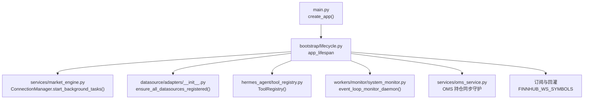
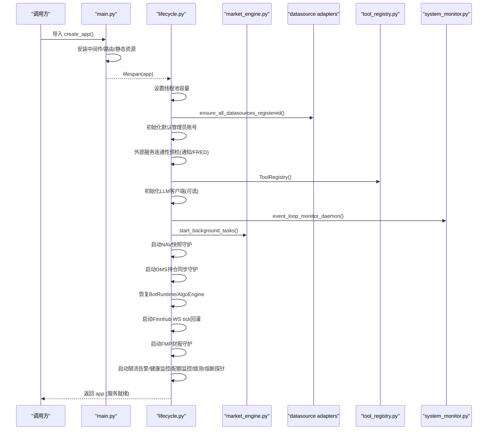
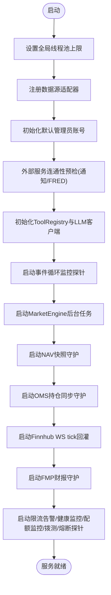
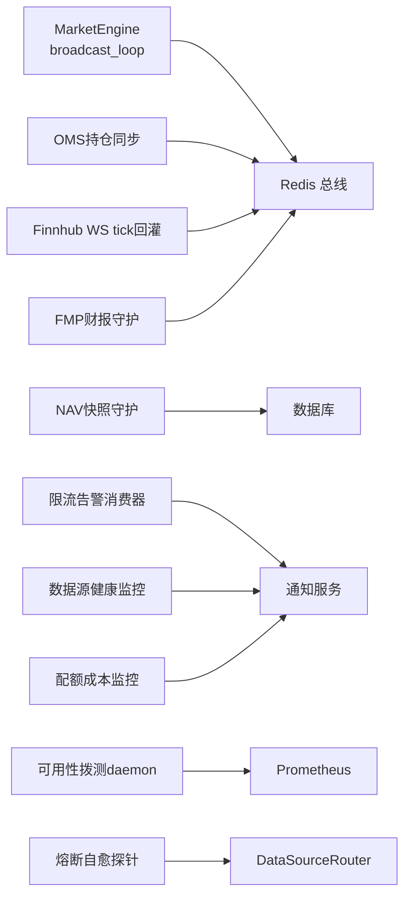
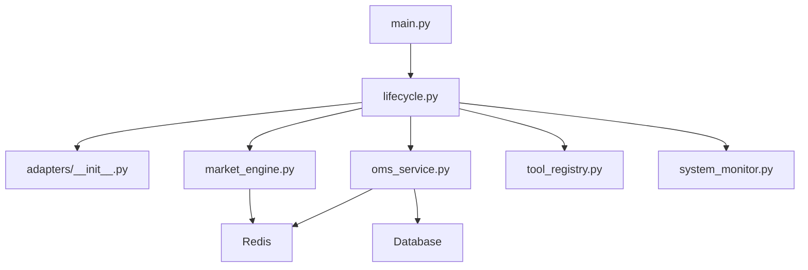

# 应用启动流程

<cite>
**本文引用的文件**
- [backend/main.py](file://backend/main.py)
- [backend/bootstrap/lifecycle.py](file://backend/bootstrap/lifecycle.py)
- [backend/core/config.py](file://backend/core/config.py)
- [backend/services/market_engine.py](file://backend/services/market_engine.py)
- [backend/services/oms_service.py](file://backend/services/oms_service.py)
- [hermes_agent/tool_registry.py](file://hermes_agent/tool_registry.py)
- [backend/services/datasource/adapters/__init__.py](file://backend/services/datasource/adapters/__init__.py)
- [backend/workers/monitor/system_monitor.py](file://backend/workers/monitor/system_monitor.py)
</cite>

## 目录
1. [简介](#简介)
2. [项目结构](#项目结构)
3. [核心组件](#核心组件)
4. [架构总览](#架构总览)
5. [详细组件分析](#详细组件分析)
6. [依赖关系分析](#依赖关系分析)
7. [性能考量](#性能考量)
8. [故障排查指南](#故障排查指南)
9. [结论](#结论)

## 简介
本文面向Quant Agent的FastAPI后端，系统化梳理从进程启动到对外提供服务的完整流程。重点覆盖：
- 线程池与全局资源限制配置
- 数据源适配器注册（Futu、YFinance、Finnhub、FMP、AKShare、Tushare、宏观与搜索）
- 默认管理员账号初始化与密码重置策略
- 外部服务连通性预检（通知、FRED等）及降级策略
- AI智能代理系统初始化（ToolRegistry加载、LLM连接池建立、全局共享资源管理）
- 后台任务启动顺序与依赖（NAV快照守护、OMS持仓同步、MarketEngine广播循环、Finnhub WebSocket回灌、限流告警消费器、数据源健康监控、配额成本监控、可用性拨测、熔断自愈探针）
- 错误处理、可观测性与优雅关闭
- 启动性能优化建议与排障清单

## 项目结构
FastAPI应用由入口工厂函数创建并挂载路由，生命周期管理器负责启动与销毁阶段的核心编排。关键路径：
- 应用工厂：创建FastAPI实例、安装中间件、挂载路由、静态资源
- 生命周期：app_lifespan 在启动时执行数据库扩展与索引、数据源注册、默认管理员初始化、外部服务连通性测试、AI工具与LLM初始化、后台任务拉起；在关闭时有序释放资源

图表来源
- [backend/main.py:125-218](file://backend/main.py#L125-L218)
- [backend/bootstrap/lifecycle.py:42-322](file://backend/bootstrap/lifecycle.py#L42-L322)
- [backend/services/market_engine.py:160-172](file://backend/services/market_engine.py#L160-L172)
- [backend/services/datasource/adapters/__init__.py:14-101](file://backend/services/datasource/adapters/__init__.py#L14-L101)
- [hermes_agent/tool_registry.py:66-84](file://hermes_agent/tool_registry.py#L66-L84)
- [backend/workers/monitor/system_monitor.py:40-75](file://backend/workers/monitor/system_monitor.py#L40-L75)
- [backend/services/oms_service.py:155-182](file://backend/services/oms_service.py#L155-L182)

章节来源
- [backend/main.py:125-218](file://backend/main.py#L125-L218)
- [backend/bootstrap/lifecycle.py:42-322](file://backend/bootstrap/lifecycle.py#L42-L322)

## 核心组件
- 应用工厂与路由挂载：统一API前缀、CORS、访问日志、OpenAPI定制、异常处理器、所有业务路由挂载
- 生命周期管理器：线程池限制、数据源注册、默认管理员初始化、外部服务连通性测试、AI工具与LLM初始化、后台任务启动、优雅关闭
- MarketEngine：WebSocket连接管理、Redis总线监听、技术指标缓存与资金流轮询、行情推送、风控预警
- OMS服务：订单持久化、状态同步、持仓同步、活动挂单缓存与广播
- ToolRegistry：工具自动注册、Schema导出、中间件管线（熔断）、结果缓存
- 系统监控：事件循环阻塞探测、慢请求落盘、防抖报警

章节来源
- [backend/main.py:125-218](file://backend/main.py#L125-L218)
- [backend/bootstrap/lifecycle.py:42-322](file://backend/bootstrap/lifecycle.py#L42-L322)
- [backend/services/market_engine.py:115-172](file://backend/services/market_engine.py#L115-L172)
- [backend/services/oms_service.py:29-182](file://backend/services/oms_service.py#L29-L182)
- [hermes_agent/tool_registry.py:66-84](file://hermes_agent/tool_registry.py#L66-L84)
- [backend/workers/monitor/system_monitor.py:10-75](file://backend/workers/monitor/system_monitor.py#L10-L75)

## 架构总览
启动时序概览（按实际代码执行顺序）：
1. 创建FastAPI实例并安装中间件、OpenAPI、异常处理
2. 数据库扩展与索引创建（PostgreSQL pgvector/pg_trgm）
3. 设置全局线程池上限（asyncio + AnyIO）
4. 注册数据源适配器（Futu/YFinance/Finnhub/FMP/AKShare/Tushare/宏观/搜索）
5. 初始化默认管理员账号（支持强制重置）
6. 外部服务连通性预检（通知、FRED），超时或失败则降级跳过
7. 初始化AI工具注册表与LLM客户端（可选）
8. 启动事件循环健康监控探针
9. 启动MarketEngine后台任务（broadcast_loop、pubsub_listener）
10. 启动NAV快照守护（每5分钟）
11. 启动OMS持仓同步守护（每30秒）
12. 恢复BotRuntime与AlgoEngine状态
13. 启动Finnhub WS tick回灌（基于FINNHUB_WS_SYMBOLS）
14. 启动FMP盘后批量财报缓存守护
15. 启动限流告警消费器、数据源健康监控器、配额成本监控器、可用性拨测daemon、熔断自愈探针
16. 进入运行态，对外提供服务

图表来源
- [backend/main.py:125-218](file://backend/main.py#L125-L218)
- [backend/bootstrap/lifecycle.py:42-322](file://backend/bootstrap/lifecycle.py#L42-L322)
- [backend/services/market_engine.py:160-172](file://backend/services/market_engine.py#L160-L172)
- [backend/services/datasource/adapters/__init__.py:14-101](file://backend/services/datasource/adapters/__init__.py#L14-L101)
- [hermes_agent/tool_registry.py:66-84](file://hermes_agent/tool_registry.py#L66-L84)
- [backend/workers/monitor/system_monitor.py:40-75](file://backend/workers/monitor/system_monitor.py#L40-L75)

## 详细组件分析

### 应用工厂与中间件装配
- 创建FastAPI实例，注入OpenAPI描述、版本、标签
- 安装可观测性（OTEL）、结构化日志（structlog）
- 注册异常处理器、访问日志中间件、CORS中间件（注意Starlette逆序执行）
- 挂载系统基础设施路由与全部业务路由（chat、settings、market、trade、macro、calendars、auth、backtest、datalake、screener、search、strategy、oms、audit、client、system、risk、paper、futu_admin、alert、ai_narrator、logs、eval、earnings、research、factor、alpha158、options、portfolio、internal、data_source、datasource_rl、datasource_vote、expert_team）
- 挂载前端静态资源（assets）

章节来源
- [backend/main.py:125-218](file://backend/main.py#L125-L218)

### 生命周期管理与启动阶段
- 线程池限制：为asyncio与AnyIO设置最大物理线程数，防止OOM
- 数据源适配器注册：幂等注册Futu、YFinance、Finnhub、FMP、AKShare、Tushare、宏观、搜索等，失败仅记录警告
- 默认管理员账号：若不存在则创建admin/admin；若存在但密码不匹配且环境变量允许则重置
- 外部服务连通性预检：通知服务与FRED接口，超时或异常则降级跳过，避免容器启动死循环
- AI智能代理初始化：
  - ToolRegistry：自动扫描并注册所有工具，构建中间件管线（熔断器）
  - LLM客户端：根据环境变量初始化AsyncOpenAI连接池，未配置则跳过
- 事件循环健康监控：启动高频心跳探针，检测主事件循环阻塞并报警
- 后台任务启动：MarketEngine广播循环、NAV快照守护、OMS持仓同步、Finnhub WS tick回灌、FMP财报守护、限流告警消费器、数据源健康监控、配额成本监控、可用性拨测、熔断自愈探针

图表来源
- [backend/bootstrap/lifecycle.py:42-322](file://backend/bootstrap/lifecycle.py#L42-L322)

章节来源
- [backend/bootstrap/lifecycle.py:42-322](file://backend/bootstrap/lifecycle.py#L42-L322)

### 数据源适配器注册
- 统一入口：ensure_all_datasources_registered()
- 注册顺序即权重参考（实际选源由Facade业务权重决定）
- 各适配器注册失败仅记录警告，不影响整体启动
- 涵盖：Futu、YFinance、Finnhub、FMP、AKShare、Tushare、宏观（FRED/DBnomics/RBI）、搜索

章节来源
- [backend/services/datasource/adapters/__init__.py:14-101](file://backend/services/datasource/adapters/__init__.py#L14-L101)

### 默认管理员账号初始化
- 首次启动创建admin用户，密码哈希存储
- 若已存在但密码不匹配，支持通过环境变量强制重置
- 失败时记录错误，提示数据库可能未就绪

章节来源
- [backend/bootstrap/lifecycle.py:77-105](file://backend/bootstrap/lifecycle.py#L77-L105)

### 外部服务连通性测试与降级
- 通知服务与FRED接口进行预检，超时或异常则降级跳过
- 保证主服务不因外部依赖不可用而卡住启动

章节来源
- [backend/bootstrap/lifecycle.py:107-122](file://backend/bootstrap/lifecycle.py#L107-L122)

### AI智能代理系统初始化
- ToolRegistry：
  - 自动注册所有工具类（装饰器触发）
  - 构建中间件管线（熔断器）
  - 支持按场景过滤工具Schema
  - 执行结果缓存（Redis Hash）
- LLM连接池：
  - 根据环境变量初始化AsyncOpenAI客户端
  - 未配置时跳过并记录警告

章节来源
- [hermes_agent/tool_registry.py:66-84](file://hermes_agent/tool_registry.py#L66-L84)
- [backend/bootstrap/lifecycle.py:125-144](file://backend/bootstrap/lifecycle.py#L125-L144)

### 后台任务启动机制与依赖关系
- MarketEngine：
  - 启动Redis PubSub监听与broadcast_loop
  - 拉取技术指标与资金流，写入Redis并推送给前端
  - 富途断连时自动降级至YFinance轮询兜底
- NAV快照守护：
  - 每5分钟拉取账户资产，写入Redis与数据库
- OMS持仓同步守护：
  - 每30秒从Futu拉取持仓，写入Redis并广播
- Finnhub WS tick回灌：
  - 基于FINNHUB_WS_SYMBOLS启动订阅与回灌
- FMP财报守护：
  - 盘后批量财报缓存守护（业务编排在主服务，REST经子服务）
- 限流告警消费器：
  - 异步队列消费限流回调，解耦飞书推送IO
- 数据源健康监控器：
  - 周期扫描成功率与Down状态，触发飞书告警
- 配额与成本监控器：
  - LLM token预算逼近与Finnhub配额耗尽告警
- 可用性拨测daemon：
  - 周期探活Futu/YF/Finnhub/FMP/FRED/OpenAI/Ollama，指标写入Prometheus
- 熔断自愈探针：
  - 半开自愈探针，确保后台任务一定拉起

图表来源
- [backend/bootstrap/lifecycle.py:146-322](file://backend/bootstrap/lifecycle.py#L146-L322)
- [backend/services/market_engine.py:160-172](file://backend/services/market_engine.py#L160-L172)
- [backend/services/oms_service.py:155-182](file://backend/services/oms_service.py#L155-L182)

章节来源
- [backend/bootstrap/lifecycle.py:146-322](file://backend/bootstrap/lifecycle.py#L146-L322)
- [backend/services/market_engine.py:160-172](file://backend/services/market_engine.py#L160-L172)
- [backend/services/oms_service.py:155-182](file://backend/services/oms_service.py#L155-L182)

### MarketEngine广播循环与降级策略
- 优先使用Futu获取历史与报价，失败或不受支持标的走YFinance兜底
- 技术指标缓存与资金流低频刷新，避免请求风暴
- 富途全面断连时发出风控报警，并切换至YFinance轮询
- 实时价格突破/跌破触发用户专属报警

章节来源
- [backend/services/market_engine.py:332-598](file://backend/services/market_engine.py#L332-L598)

### OMS持仓同步与订单持久化
- 订单创建与状态更新持久化到数据库，并同步到Redis活动挂单缓存
- 持仓同步从Futu拉取，写入Redis并广播变更
- 熔断时将活动订单标记为CANCELLED

章节来源
- [backend/services/oms_service.py:29-182](file://backend/services/oms_service.py#L29-L182)

### 系统监控与事件循环健康
- 高频心跳探针检测主事件循环阻塞，超过阈值触发报警并落盘
- 报警防抖，避免频繁通知

章节来源
- [backend/workers/monitor/system_monitor.py:10-75](file://backend/workers/monitor/system_monitor.py#L10-L75)

## 依赖关系分析
- main.py依赖bootstrap/lifecycle.py的生命周期管理
- lifecycle.py依赖：
  - 数据源适配器注册（adapters/__init__.py）
  - MarketEngine（services/market_engine.py）
  - OMS服务（services/oms_service.py）
  - ToolRegistry（hermes_agent/tool_registry.py）
  - 系统监控（workers/monitor/system_monitor.py）
- MarketEngine依赖Redis总线与数据源路由（通过router.fetch_*远程调用）
- OMS服务依赖数据库与Redis缓存
- ToolRegistry依赖工具模块与结果缓存

图表来源
- [backend/main.py:125-218](file://backend/main.py#L125-L218)
- [backend/bootstrap/lifecycle.py:42-322](file://backend/bootstrap/lifecycle.py#L42-L322)
- [backend/services/datasource/adapters/__init__.py:14-101](file://backend/services/datasource/adapters/__init__.py#L14-L101)
- [backend/services/market_engine.py:160-172](file://backend/services/market_engine.py#L160-L172)
- [backend/services/oms_service.py:29-182](file://backend/services/oms_service.py#L29-L182)
- [hermes_agent/tool_registry.py:66-84](file://hermes_agent/tool_registry.py#L66-L84)
- [backend/workers/monitor/system_monitor.py:40-75](file://backend/workers/monitor/system_monitor.py#L40-L75)

章节来源
- [backend/main.py:125-218](file://backend/main.py#L125-L218)
- [backend/bootstrap/lifecycle.py:42-322](file://backend/bootstrap/lifecycle.py#L42-L322)

## 性能考量
- 线程池限制：全局物理线程池上限设置为64，防止OOM与过度并发
- 技术指标与资金流刷新频率控制：技术面每小时全量更新，资金流5分钟粒度刷新，避免打爆子服务线程池
- YFinance兜底节流：对失败标的采用退避间隔，避免请求风暴
- Redis二进制协议与压缩传输：WebSocket重连时使用zlib压缩批量帧，减少网络开销
- 事件循环阻塞监控：高频探针检测阻塞并报警，辅助定位同步阻塞点
- 优雅关闭：后台任务取消与资源释放带超时保护，防止长时间阻塞

章节来源
- [backend/bootstrap/lifecycle.py:51-66](file://backend/bootstrap/lifecycle.py#L51-L66)
- [backend/services/market_engine.py:367-424](file://backend/services/market_engine.py#L367-L424)
- [backend/services/market_engine.py:222-234](file://backend/services/market_engine.py#L222-L234)
- [backend/workers/monitor/system_monitor.py:40-75](file://backend/workers/monitor/system_monitor.py#L40-L75)
- [backend/bootstrap/lifecycle.py:411-422](file://backend/bootstrap/lifecycle.py#L411-L422)

## 故障排查指南
- 启动失败常见原因：
  - 数据库未就绪：检查DATABASE_URL与PostgreSQL扩展创建是否成功
  - 数据源适配器注册失败：查看对应适配器日志，确认远程节点可达
  - 外部服务连通性预检超时：检查通知服务与FRED配置与网络
  - LLM客户端未初始化：确认LLM_API_KEY与LLM_BASE_URL配置
- 后台任务异常：
  - MarketEngine广播循环异常：检查Redis连接与订阅标的
  - NAV快照守护失败：检查Futu账户信息与数据库写入权限
  - OMS持仓同步失败：检查Futu远程调用与Redis缓存键空间
  - Finnhub WS tick回灌失败：检查FINNHUB_WS_SYMBOLS配置与子服务WebSocket能力
- 性能问题：
  - 事件循环阻塞：查看系统监控报警与性能日志，定位同步阻塞代码
  - 请求风暴：检查技术指标与资金流刷新频率，确认退避逻辑生效
- 降级与熔断：
  - 富途断连：确认YFinance兜底开关与子服务可用性
  - 数据源健康监控：查看成功率与Down状态，调整重试与熔断阈值

章节来源
- [backend/bootstrap/lifecycle.py:42-322](file://backend/bootstrap/lifecycle.py#L42-L322)
- [backend/services/market_engine.py:332-598](file://backend/services/market_engine.py#L332-L598)
- [backend/services/oms_service.py:155-182](file://backend/services/oms_service.py#L155-L182)
- [backend/workers/monitor/system_monitor.py:40-75](file://backend/workers/monitor/system_monitor.py#L40-L75)

## 结论
Quant Agent的启动流程以FastAPI生命周期为核心，通过严格的线程池限制、数据源适配器注册、默认管理员初始化、外部服务连通性预检、AI工具与LLM初始化，以及一系列后台任务的有序启动，构建了高可用、可扩展、可观测的量化交易网关。MarketEngine与OMS服务提供了实时行情与订单管理能力，配合系统监控与熔断自愈探针，确保系统在复杂外部依赖下的稳定运行。通过合理的性能优化与故障排查策略，可有效提升系统的鲁棒性与可维护性。