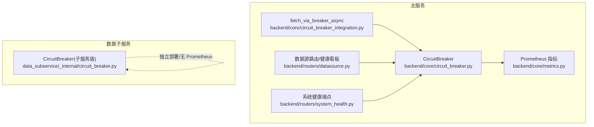
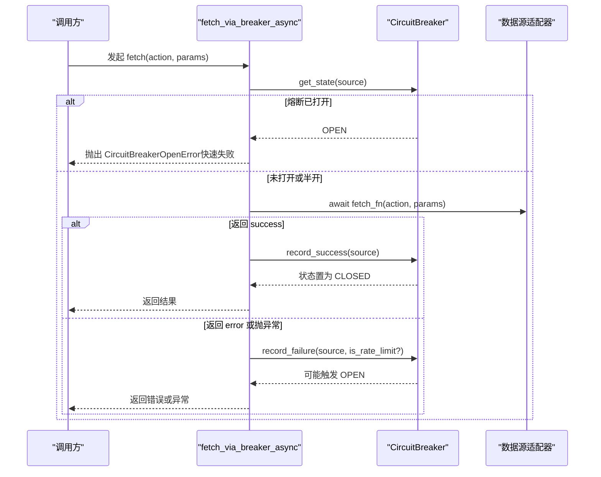
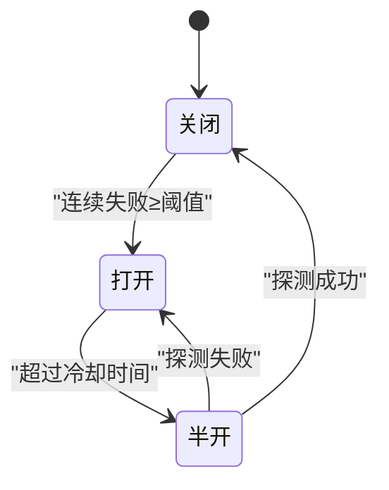
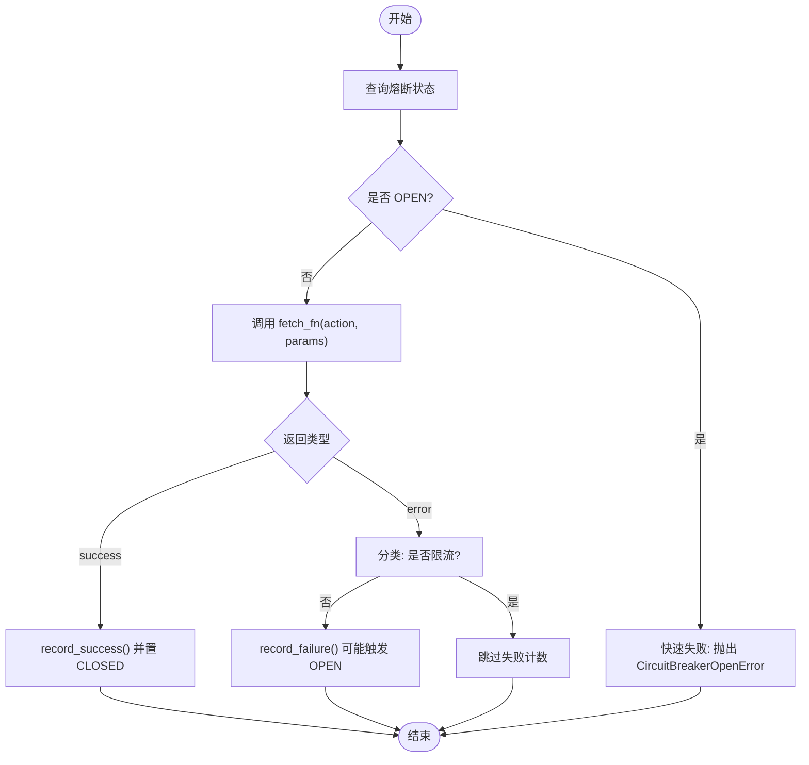
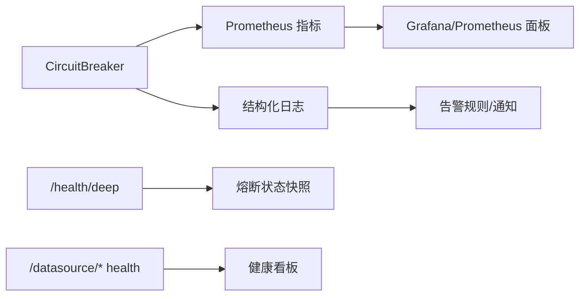
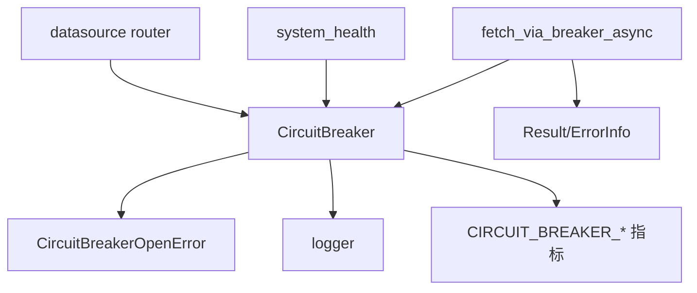

# 熔断器设计

<cite>
**本文引用的文件**
- [backend/core/circuit_breaker.py](file://backend/core/circuit_breaker.py)
- [backend/core/circuit_breaker_integration.py](file://backend/core/circuit_breaker_integration.py)
- [data_subservice/_internal/circuit_breaker.py](file://data_subservice/_internal/circuit_breaker.py)
- [backend/core/metrics.py](file://backend/core/metrics.py)
- [backend/routers/datasource.py](file://backend/routers/datasource.py)
- [backend/routers/system_health.py](file://backend/routers/system_health.py)
- [backend/tests/test_circuit_breaker_direct.py](file://backend/tests/test_circuit_breaker_direct.py)
- [backend/tests/test_circuit_breaker_integration.py](file://backend/tests/test_circuit_breaker_integration.py)
</cite>

## 目录
1. [简介](#简介)
2. [项目结构](#项目结构)
3. [核心组件](#核心组件)
4. [架构总览](#架构总览)
5. [详细组件分析](#详细组件分析)
6. [依赖关系分析](#依赖关系分析)
7. [性能考量](#性能考量)
8. [故障排查指南](#故障排查指南)
9. [结论](#结论)
10. [附录](#附录)

## 简介
本技术文档聚焦 Quant Agent 的熔断器设计与落地，覆盖状态机（关闭→打开→半开）、阈值与恢复策略、数据源路由集成（自动故障检测、快速失败、重试退避配合）、监控告警（状态变更日志、Prometheus 指标、健康检查接口）、配置管理（环境变量驱动、差异化能力）以及测试与故障模拟方法。目标是帮助读者在不深入源码的情况下理解熔断器的整体机制与使用方式，并在生产环境中进行排障与优化。

## 项目结构
熔断器在项目中分为“主服务”和“数据子服务”两套实现：
- 主服务：backend/core/circuit_breaker.py 提供统一的 CircuitBreaker 实现，并通过 backend/core/circuit_breaker_integration.py 接入数据源异步 fetch 主路径。
- 数据子服务：data_subservice/_internal/circuit_breaker.py 为独立节点复制的实现，metrics 降级为 no-op，避免上报主集群 Prometheus。

**图表来源**
- [backend/core/circuit_breaker.py:64-379](file://backend/core/circuit_breaker.py#L64-L379)
- [backend/core/circuit_breaker_integration.py:40-73](file://backend/core/circuit_breaker_integration.py#L40-L73)
- [backend/core/metrics.py:100-110](file://backend/core/metrics.py#L100-L110)
- [backend/routers/datasource.py:196-309](file://backend/routers/datasource.py#L196-L309)
- [backend/routers/system_health.py:173-355](file://backend/routers/system_health.py#L173-L355)
- [data_subservice/_internal/circuit_breaker.py:64-296](file://data_subservice/_internal/circuit_breaker.py#L64-L296)

**章节来源**
- [backend/core/circuit_breaker.py:1-379](file://backend/core/circuit_breaker.py#L1-L379)
- [backend/core/circuit_breaker_integration.py:1-73](file://backend/core/circuit_breaker_integration.py#L1-L73)
- [data_subservice/_internal/circuit_breaker.py:1-296](file://data_subservice/_internal/circuit_breaker.py#L1-L296)

## 核心组件
- CircuitBreaker（主服务）：实现 CLOSED/OPEN/HALF_OPEN 状态机，支持异步/同步调用包装、装饰器、手动记录成功/失败、重置、状态快照等。
- 数据源集成层：fetch_via_breaker_async 将统一熔断器接入 DataSourceInterface.fetch，区分异常与 Result.error，并支持豁免 action 不计入全局熔断计数。
- 数据子服务熔断器：与主服务一致逻辑，但 metrics 为 no-op，仅打日志。
- 监控指标：CIRCUIT_BREAKER_STATE、CIRCUIT_BREAKER_TRANSITIONS 等 Prometheus 指标；健康端点暴露熔断状态。
- 配置与环境：通过环境变量 CIRCUIT_BREAKER_MAX_FAILURES、CIRCUIT_BREAKER_COOLDOWN_S 控制阈值与冷却时间。

**章节来源**
- [backend/core/circuit_breaker.py:40-79](file://backend/core/circuit_breaker.py#L40-L79)
- [backend/core/circuit_breaker_integration.py:25-73](file://backend/core/circuit_breaker_integration.py#L25-L73)
- [data_subservice/_internal/circuit_breaker.py:40-70](file://data_subservice/_internal/circuit_breaker.py#L40-L70)
- [backend/core/metrics.py:100-110](file://backend/core/metrics.py#L100-L110)

## 架构总览
熔断器在主服务中作为“外部 API 保护伞”，被数据源路由层包裹在 fetch 主路径上。当目标数据源连续失败达到阈值时进入 OPEN，阻断后续请求（快速失败），等待 recovery_timeout 后进入 HALF_OPEN 探测一次；若探测成功则回到 CLOSED，否则再次进入 OPEN。限流类错误（如 429/配额耗尽/IP 封禁）不计入失败计数，避免误杀。

**图表来源**
- [backend/core/circuit_breaker_integration.py:40-73](file://backend/core/circuit_breaker_integration.py#L40-L73)
- [backend/core/circuit_breaker.py:147-218](file://backend/core/circuit_breaker.py#L147-L218)

**章节来源**
- [backend/core/circuit_breaker_integration.py:1-73](file://backend/core/circuit_breaker_integration.py#L1-L73)
- [backend/core/circuit_breaker.py:147-218](file://backend/core/circuit_breaker.py#L147-L218)

## 详细组件分析

### 状态机与阈值配置
- 状态转换：
  - CLOSED → OPEN：连续失败次数 ≥ max_failures 触发。
  - OPEN → HALF_OPEN：超过 recovery_timeout 秒后自动转入，允许一次探测。
  - HALF_OPEN → CLOSED：探测成功，重置失败计数。
  - HALF_OPEN → OPEN：探测失败，重新进入 OPEN。
- 阈值与恢复：
  - max_failures：默认 3，可通过环境变量 CIRCUIT_BREAKER_MAX_FAILURES 调整。
  - recovery_timeout：默认 60s，可通过 CIRCUIT_BREAKER_COOLDOWN_S 调整。
- 限流错误过滤：
  - 支持 per-call error_classifier 回调与全局 is_rate_limit_error 钩子，用于识别限流类错误（如 429、配额耗尽、IP 封禁），不计入失败计数。

**图表来源**
- [backend/core/circuit_breaker.py:45-97](file://backend/core/circuit_breaker.py#L45-L97)
- [backend/core/circuit_breaker.py:181-216](file://backend/core/circuit_breaker.py#L181-L216)

**章节来源**
- [backend/core/circuit_breaker.py:40-97](file://backend/core/circuit_breaker.py#L40-L97)
- [backend/core/circuit_breaker.py:181-216](file://backend/core/circuit_breaker.py#L181-L216)

### 数据源路由集成
- 集成点：fetch_via_breaker_async 包裹 source.fetch，统一处理异常与 Result.error。
- 豁免动作：exempt_from_breaker=True 时，该 action 失败不计入全局熔断计数，适用于“能力缺失型”扩展行情，避免污染核心通道（如 QUOTE/HEALTH）。
- 限流判定：根据 result.error_category 或异常标记判断是否限流类错误，避免误触发熔断。

**图表来源**
- [backend/core/circuit_breaker_integration.py:40-73](file://backend/core/circuit_breaker_integration.py#L40-L73)
- [backend/core/circuit_breaker.py:104-145](file://backend/core/circuit_breaker.py#L104-L145)

**章节来源**
- [backend/core/circuit_breaker_integration.py:25-73](file://backend/core/circuit_breaker_integration.py#L25-L73)
- [backend/core/circuit_breaker.py:104-145](file://backend/core/circuit_breaker.py#L104-L145)

### 监控与告警
- 指标采集：
  - CIRCUIT_BREAKER_STATE：当前状态（0=closed, 1=half_open, 2=open）。
  - CIRCUIT_BREAKER_TRANSITIONS：状态转换次数（from_state → to_state）。
- 健康检查：
  - /health/deep 暴露 circuit_breaker_states 快照。
  - /datasource/{name}/health-overview 聚合各数据源健康卡片（含限流、延迟、成功率等）。
  - /datasource/router/health 暴露 YFinance 主/备节点级健康（含熔断冷却、限流退避、action 级熔断）。
- 日志：
  - 状态转换与关键事件均输出结构化日志（进入半开、触发熔断、恢复等）。

**图表来源**
- [backend/core/metrics.py:100-110](file://backend/core/metrics.py#L100-L110)
- [backend/routers/system_health.py:249-355](file://backend/routers/system_health.py#L249-L355)
- [backend/routers/datasource.py:196-351](file://backend/routers/datasource.py#L196-L351)

**章节来源**
- [backend/core/metrics.py:97-110](file://backend/core/metrics.py#L97-L110)
- [backend/routers/system_health.py:249-355](file://backend/routers/system_health.py#L249-L355)
- [backend/routers/datasource.py:196-351](file://backend/routers/datasource.py#L196-L351)

### 配置管理
- 环境变量：
  - CIRCUIT_BREAKER_MAX_FAILURES：连续失败阈值（默认 3）。
  - CIRCUIT_BREAKER_COOLDOWN_S：冷却时间（默认 60s）。
- 动态能力：
  - 通过 get_circuit_breaker(max_failures, recovery_timeout) 按需创建不同配置的实例。
  - reset(service=None) 支持单服务或全部重置，便于运维恢复。
- 差异化：
  - exempt_from_breaker 参数对特定 action 豁免全局熔断计数，适配不同数据源的能力差异。

**章节来源**
- [backend/core/circuit_breaker.py:40-43](file://backend/core/circuit_breaker.py#L40-L43)
- [backend/core/circuit_breaker.py:355-379](file://backend/core/circuit_breaker.py#L355-L379)
- [backend/core/circuit_breaker_integration.py:40-73](file://backend/core/circuit_breaker_integration.py#L40-L73)

### 测试方法与故障模拟
- 单元测试覆盖：
  - 状态机：CLOSED→OPEN→HALF_OPEN→CLOSED 全路径。
  - 方法：call/call_sync/guard/reset/status_snapshot。
  - 集成：fetch_via_breaker_async 的成功/失败/熔断场景。
- 故障模拟建议：
  - 网络异常：让 fetch_fn 抛出网络异常，验证失败计数与熔断触发。
  - 超时错误：设置长耗时或超时异常，观察 HALF_OPEN 探测行为。
  - 服务不可用：持续返回 Result.error，验证 OPEN 状态与快速失败。
  - 限流场景：注入带 ErrorCategory 的异常或 result.error_category，验证不计入失败计数。

**章节来源**
- [backend/tests/test_circuit_breaker_direct.py:1-323](file://backend/tests/test_circuit_breaker_direct.py#L1-L323)
- [backend/tests/test_circuit_breaker_integration.py:1-72](file://backend/tests/test_circuit_breaker_integration.py#L1-L72)

## 依赖关系分析
- 主服务 CircuitBreaker 依赖：
  - 异常：CircuitBreakerOpenError。
  - 日志：logger。
  - 指标：CIRCUIT_BREAKER_STATE、CIRCUIT_BREAKER_TRANSITIONS。
- 集成层依赖：
  - 熔断器实例：circuit_breaker。
  - 数据源 Result/ErrorInfo：用于判定 success/error。
- 健康端点依赖：
  - 数据源注册表与探针：获取各源健康状态。
  - 指标快照：包含熔断器状态。

**图表来源**
- [backend/core/circuit_breaker.py:34-37](file://backend/core/circuit_breaker.py#L34-L37)
- [backend/core/circuit_breaker_integration.py:22-23](file://backend/core/circuit_breaker_integration.py#L22-L23)
- [backend/routers/system_health.py:249-355](file://backend/routers/system_health.py#L249-L355)
- [backend/routers/datasource.py:196-351](file://backend/routers/datasource.py#L196-L351)

**章节来源**
- [backend/core/circuit_breaker.py:34-37](file://backend/core/circuit_breaker.py#L34-L37)
- [backend/core/circuit_breaker_integration.py:22-23](file://backend/core/circuit_breaker_integration.py#L22-L23)

## 性能考量
- 锁粒度：每个服务条目持有 asyncio.Lock，避免并发竞争；同步路径使用 call_sync 供线程池调用。
- 指标开销：状态转换与状态值更新轻量，适合高频调用。
- 限流解耦：限流错误不计入失败计数，减少误熔断导致的雪崩风险。
- 子服务隔离：数据子服务 metrics 为 no-op，避免上报主集群造成额外负载。

[本节为通用指导，不直接分析具体文件]

## 故障排查指南
- 现象：频繁出现 CircuitBreakerOpenError
  - 检查：对应服务的连续失败次数是否达到阈值；查看日志中的“触发熔断”信息。
  - 定位：确认是否为真实故障还是限流类错误（应不计入失败计数）。
- 现象：长时间处于 OPEN
  - 检查：recovery_timeout 是否过短；HALF_OPEN 探测是否持续失败。
  - 操作：必要时使用 reset(service) 手动恢复。
- 现象：健康看板显示某源“失联”
  - 检查：/datasource/{name}/health 与 /health/deep 的熔断状态；确认连接与 key 配置。
  - 注意：主动探测受 throttler 退避保护，避免雪上加霜。

**章节来源**
- [backend/core/circuit_breaker.py:181-216](file://backend/core/circuit_breaker.py#L181-L216)
- [backend/routers/datasource.py:487-643](file://backend/routers/datasource.py#L487-L643)
- [backend/routers/system_health.py:249-355](file://backend/routers/system_health.py#L249-L355)

## 结论
Quant Agent 的熔断器以清晰的状态机为核心，结合环境变量驱动的阈值与恢复策略，实现了对外部数据源的稳定保护。通过数据源路由层的集成，实现了自动故障检测、快速失败与限流解耦；借助 Prometheus 指标与健康端点，提供了完善的监控与可观测性。测试覆盖完整，便于在生产环境进行故障模拟与排障。建议在多数据源场景中合理配置阈值与豁免策略，并结合健康看板与告警规则，形成闭环的稳定性保障体系。

[本节为总结，不直接分析具体文件]

## 附录
- 环境变量参考：
  - CIRCUIT_BREAKER_MAX_FAILURES：连续失败阈值（默认 3）。
  - CIRCUIT_BREAKER_COOLDOWN_S：冷却时间（默认 60s）。
- 关键接口：
  - call/call_sync/guard：异步/同步调用包装与装饰器。
  - record_failure/record_success：手动记录失败/成功。
  - reset：手动重置熔断状态。
  - status_snapshot：获取所有服务熔断状态快照。

**章节来源**
- [backend/core/circuit_breaker.py:40-43](file://backend/core/circuit_breaker.py#L40-L43)
- [backend/core/circuit_breaker.py:220-352](file://backend/core/circuit_breaker.py#L220-L352)
