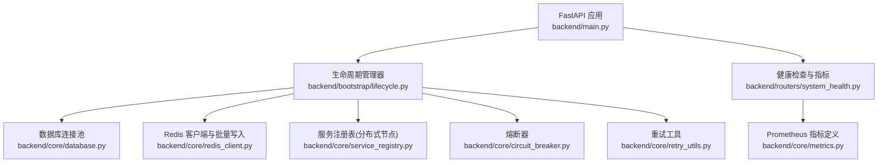
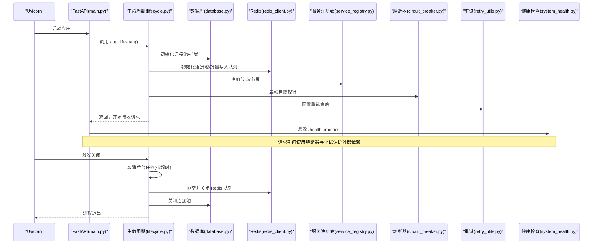
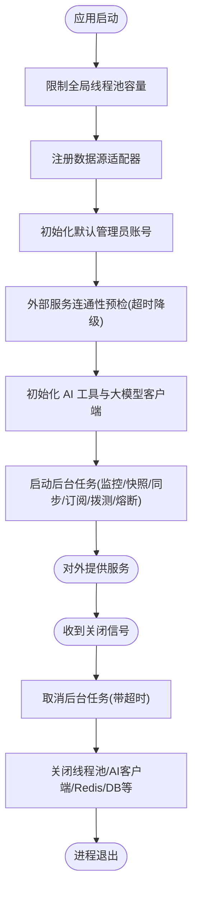
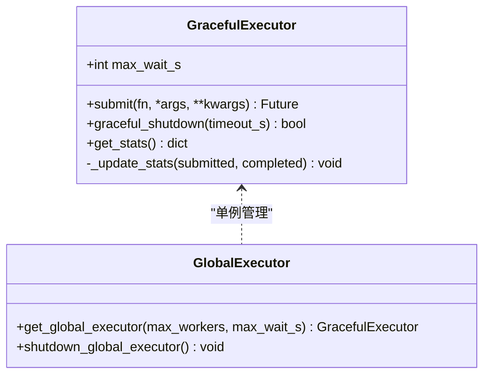
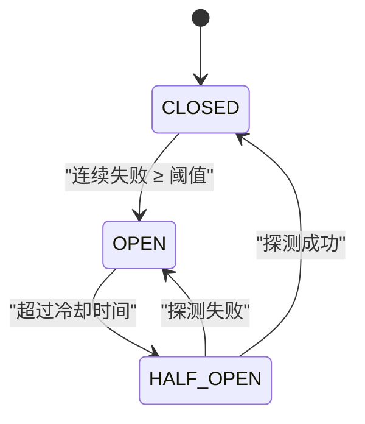
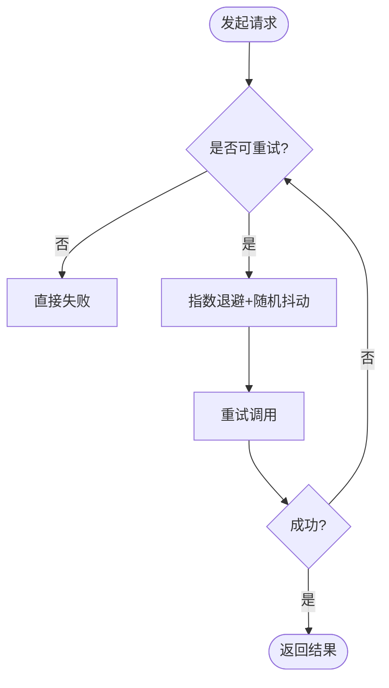
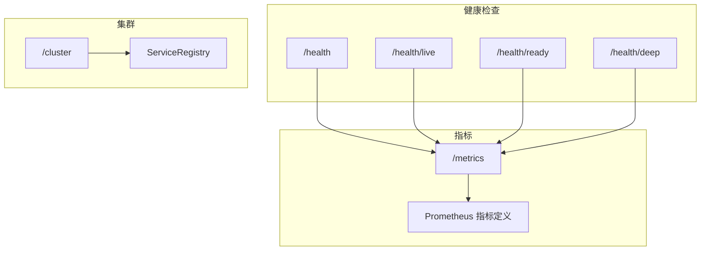
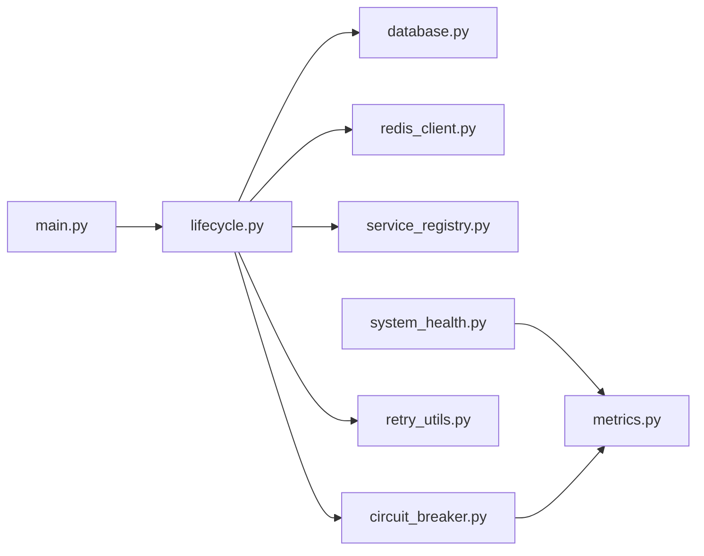

# 生命周期管理

<cite>
**本文引用的文件**
- [backend/main.py](file://backend/main.py)
- [backend/bootstrap/lifecycle.py](file://backend/bootstrap/lifecycle.py)
- [backend/core/graceful_executor.py](file://backend/core/graceful_executor.py)
- [backend/core/circuit_breaker.py](file://backend/core/circuit_breaker.py)
- [backend/core/retry_utils.py](file://backend/core/retry_utils.py)
- [backend/core/metrics.py](file://backend/core/metrics.py)
- [backend/routers/system_health.py](file://backend/routers/system_health.py)
- [backend/core/service_registry.py](file://backend/core/service_registry.py)
- [backend/core/redis_client.py](file://backend/core/redis_client.py)
- [backend/core/database.py](file://backend/core/database.py)
- [backend/core/config.py](file://backend/core/config.py)
</cite>

## 目录
1. [简介](#简介)
2. [项目结构](#项目结构)
3. [核心组件](#核心组件)
4. [架构总览](#架构总览)
5. [详细组件分析](#详细组件分析)
6. [依赖关系分析](#依赖关系分析)
7. [性能考量](#性能考量)
8. [故障排查指南](#故障排查指南)
9. [结论](#结论)
10. [附录](#附录)

## 简介
本设计文档聚焦 Quant Agent 系统的生命周期管理，覆盖应用启动与关闭的完整流程、优雅执行机制（GracefulExecutor）、熔断器（CircuitBreaker）实现原理、重试机制（RetryUtils）设计、系统监控与诊断工具，以及部署相关的配置管理。目标是帮助读者理解系统在启动阶段如何完成依赖初始化与服务注册、在关闭阶段如何安全释放资源；并掌握关键稳定性组件的设计要点与使用方式。

## 项目结构
Quant Agent 后端以 FastAPI 为网关入口，通过 lifespan 钩子集中管理生命周期；核心基础设施位于 backend/core，业务路由位于 backend/routers，后台任务与守护进程在 bootstrap/lifecycle 中统一拉起；可观测性指标集中在 backend/core/metrics，健康检查端点位于 backend/routers/system_health。

图表来源
- [backend/main.py:125-218](file://backend/main.py#L125-L218)
- [backend/bootstrap/lifecycle.py:42-322](file://backend/bootstrap/lifecycle.py#L42-L322)
- [backend/core/database.py:1-67](file://backend/core/database.py#L1-L67)
- [backend/core/redis_client.py:1-252](file://backend/core/redis_client.py#L1-L252)
- [backend/core/service_registry.py:1-417](file://backend/core/service_registry.py#L1-L417)
- [backend/core/circuit_breaker.py:1-379](file://backend/core/circuit_breaker.py#L1-L379)
- [backend/core/retry_utils.py:1-58](file://backend/core/retry_utils.py#L1-L58)
- [backend/routers/system_health.py:1-421](file://backend/routers/system_health.py#L1-L421)
- [backend/core/metrics.py:1-641](file://backend/core/metrics.py#L1-L641)

章节来源
- [backend/main.py:125-218](file://backend/main.py#L125-L218)
- [backend/bootstrap/lifecycle.py:42-322](file://backend/bootstrap/lifecycle.py#L42-L322)

## 核心组件
- 应用工厂与路由挂载：创建 FastAPI 实例，挂载中间件、异常处理、OpenAPI、各业务路由，并注入 lifespan。
- 生命周期管理器：负责启动阶段的依赖初始化、服务注册、后台任务拉起；关闭阶段的优雅取消、资源释放、状态保存。
- 优雅执行器：封装线程池，提供异步提交、统计、超时控制的优雅关闭能力。
- 熔断器：按服务维度维护 CLOSED/OPEN/HALF_OPEN 状态机，支持限流错误过滤、手动记录成功/失败、状态快照。
- 重试工具：基于 tenacity 的指数退避+随机抖动，针对网络与限流等场景自动重试。
- 健康检查与指标：提供 liveness/readiness/deep 探针，暴露 Prometheus 指标，聚合组件健康与运行态。
- 服务注册表：基于 Redis 的分布式节点注册、心跳、发现与优雅下线。
- 配置管理：Pydantic Settings 校验环境变量，fail-fast 保证关键配置齐全。

章节来源
- [backend/main.py:125-218](file://backend/main.py#L125-L218)
- [backend/bootstrap/lifecycle.py:42-322](file://backend/bootstrap/lifecycle.py#L42-L322)
- [backend/core/graceful_executor.py:1-204](file://backend/core/graceful_executor.py#L1-L204)
- [backend/core/circuit_breaker.py:1-379](file://backend/core/circuit_breaker.py#L1-L379)
- [backend/core/retry_utils.py:1-58](file://backend/core/retry_utils.py#L1-L58)
- [backend/routers/system_health.py:1-421](file://backend/routers/system_health.py#L1-L421)
- [backend/core/service_registry.py:1-417](file://backend/core/service_registry.py#L1-L417)
- [backend/core/config.py:1-134](file://backend/core/config.py#L1-L134)

## 架构总览
下图展示了从应用启动到对外提供服务的关键路径，包括依赖初始化、服务注册、后台任务启动，以及关闭时的任务取消与资源释放。

图表来源
- [backend/main.py:125-218](file://backend/main.py#L125-L218)
- [backend/bootstrap/lifecycle.py:42-492](file://backend/bootstrap/lifecycle.py#L42-L492)
- [backend/core/database.py:1-67](file://backend/core/database.py#L1-L67)
- [backend/core/redis_client.py:1-252](file://backend/core/redis_client.py#L1-L252)
- [backend/core/service_registry.py:1-417](file://backend/core/service_registry.py#L1-L417)
- [backend/core/circuit_breaker.py:1-379](file://backend/core/circuit_breaker.py#L1-L379)
- [backend/core/retry_utils.py:1-58](file://backend/core/retry_utils.py#L1-L58)
- [backend/routers/system_health.py:1-421](file://backend/routers/system_health.py#L1-L421)

## 详细组件分析

### 应用启动与关闭流程
- 启动阶段
  - 设置全局线程池上限，防止 OOM。
  - 数据源适配器统一注册，确保 Facade 路由可用。
  - 初始化默认管理员账号（幂等）。
  - 外部服务连通性预检（通知、宏观数据），超时降级跳过。
  - 初始化 AI 工具注册表与大模型客户端（可选）。
  - 启动事件循环健康监控、MarketEngine 广播、NAV 快照、OMS 持仓同步、BotRuntime/AlgoEngine 恢复、订阅回灌、配额与成本监控、数据源拨测、熔断自愈探针等后台任务。
- 关闭阶段
  - 收集待取消任务列表，统一 await 并设置超时保护。
  - 优雅关闭线程池、AI 客户端、Redis 批量队列、临时缓存、数据源探针、HTTP 连接池、数据库连接池。
  - 记录关闭耗时与各步骤时间线，便于定位慢操作。

图表来源
- [backend/bootstrap/lifecycle.py:42-322](file://backend/bootstrap/lifecycle.py#L42-L322)
- [backend/bootstrap/lifecycle.py:324-492](file://backend/bootstrap/lifecycle.py#L324-L492)

章节来源
- [backend/bootstrap/lifecycle.py:42-322](file://backend/bootstrap/lifecycle.py#L42-L322)
- [backend/bootstrap/lifecycle.py:324-492](file://backend/bootstrap/lifecycle.py#L324-L492)

### GracefulExecutor 优雅执行机制
- 目标：解决 ThreadPoolExecutor 默认 shutdown(wait=False) 中断任务的问题，提供异步提交、统计计数、超时控制。
- 特性
  - submit 重写：将同步任务包装为 asyncio.Future，便于统一管理。
  - 统计：submitted_count、completed_count、active_tasks。
  - graceful_shutdown：等待所有任务完成，支持自定义超时；兼容 Python 版本差异。
  - 全局单例：get_global_executor/shutdown_global_executor。
- 适用场景：后台任务、批处理、IO 密集型任务的优雅关闭。

图表来源
- [backend/core/graceful_executor.py:26-187](file://backend/core/graceful_executor.py#L26-L187)
- [backend/core/graceful_executor.py:176-204](file://backend/core/graceful_executor.py#L176-L204)

章节来源
- [backend/core/graceful_executor.py:1-204](file://backend/core/graceful_executor.py#L1-L204)

### 熔断器 CircuitBreaker 实现原理
- 状态机
  - CLOSED → OPEN：连续失败次数达到阈值。
  - OPEN → HALF_OPEN：超过冷却时间后进入探测。
  - HALF_OPEN → CLOSED：探测成功。
  - HALF_OPEN → OPEN：探测失败。
- 配置
  - 最大失败次数与冷却时间来自环境变量，禁止硬编码。
- 限流错误过滤
  - 支持 per-call error_classifier 与全局 is_rate_limit_error 钩子，限流类错误不计入失败计数。
- 指标与可观测性
  - 状态 Gauge、转换 Counter，便于监控与告警。
- 使用方式
  - 装饰器 guard、call/call_sync 方法、record_failure/record_success/reset/status_snapshot。

图表来源
- [backend/core/circuit_breaker.py:45-97](file://backend/core/circuit_breaker.py#L45-L97)
- [backend/core/circuit_breaker.py:147-218](file://backend/core/circuit_breaker.py#L147-L218)
- [backend/core/circuit_breaker.py:220-379](file://backend/core/circuit_breaker.py#L220-L379)
- [backend/core/metrics.py:100-110](file://backend/core/metrics.py#L100-L110)

章节来源
- [backend/core/circuit_breaker.py:1-379](file://backend/core/circuit_breaker.py#L1-L379)
- [backend/core/metrics.py:100-110](file://backend/core/metrics.py#L100-L110)

### 重试机制 RetryUtils 设计
- 策略
  - 基于 tenacity 的指数退避 + 随机抖动，避免雪崩。
  - 仅对特定异常进行重试：网络错误、限流、封禁、服务端崩溃等。
- 日志
  - 每次重试输出当前尝试次数与异常类型，便于追踪。
- 使用建议
  - 结合熔断器使用：先重试再熔断，或根据业务语义组合。
  - 注意幂等性与副作用，避免重复写库。

图表来源
- [backend/core/retry_utils.py:10-58](file://backend/core/retry_utils.py#L10-L58)

章节来源
- [backend/core/retry_utils.py:1-58](file://backend/core/retry_utils.py#L1-L58)

### 系统监控与诊断工具
- 健康检查
  - /health：liveness，始终 200。
  - /health/live：进程存活探针。
  - /health/ready：就绪探针，检查 Redis、Postgres、至少一个数据源连通。
  - /health/deep：全链路诊断，包含组件健康、数据源就绪、采集器心跳、WS 连接数、线程池使用率、事件循环 lag、熔断器状态等。
- 指标暴露
  - /metrics：Prometheus 指标，Basic Auth 保护。
  - 指标分类：行情延迟、WebSocket、Redis、熔断器、数据源可用性、主动拨测、Agent/LLM、Futu OpenD、K线缓存、数据质量、分布式节点、Web Vitals 等。
- 集群与节点
  - /cluster：节点状态概览。
  - ServiceRegistry：节点注册、心跳、发现、优雅下线、死节点清理、统计指标。

图表来源
- [backend/routers/system_health.py:51-355](file://backend/routers/system_health.py#L51-L355)
- [backend/core/metrics.py:1-641](file://backend/core/metrics.py#L1-L641)
- [backend/core/service_registry.py:69-417](file://backend/core/service_registry.py#L69-L417)

章节来源
- [backend/routers/system_health.py:1-421](file://backend/routers/system_health.py#L1-L421)
- [backend/core/metrics.py:1-641](file://backend/core/metrics.py#L1-L641)
- [backend/core/service_registry.py:1-417](file://backend/core/service_registry.py#L1-L417)

### 部署相关配置管理
- 环境变量与配置校验
  - Pydantic Settings 集中管理数据库、Redis、LLM、数据源 API Key、Futu OpenD、告警通道、内部通信密钥等。
  - 必填字段缺失时 fail-fast，禁止带病启动。
  - 实盘交易开启时需配置 Futu 解锁密码。
- 容器化部署
  - 主服务 Dockerfile、data_subservice Dockerfile、frontend Dockerfile 分别对应不同组件。
  - 通过 .env 注入敏感配置，生产环境建议使用密钥管理服务。
- 运行时参数
  - 数据库连接池大小、溢出、超时、回收周期等均可配置。
  - Redis 连接池上限、批量写入队列参数、L1 缓存容量等可调优。

章节来源
- [backend/core/config.py:20-134](file://backend/core/config.py#L20-L134)
- [backend/core/database.py:1-67](file://backend/core/database.py#L1-L67)
- [backend/core/redis_client.py:1-252](file://backend/core/redis_client.py#L1-L252)

## 依赖关系分析
- 耦合与内聚
  - lifecycle 作为编排中心，耦合多个子系统但职责清晰：启动/关闭、任务调度、资源管理。
  - circuit_breaker 与 retry_utils 解耦于具体业务，通过错误分类与钩子适配不同数据源。
  - metrics 与 system_health 解耦，前者定义指标，后者消费指标并暴露端点。
- 外部依赖
  - 数据库（PostgreSQL/SQLite）、Redis、外部数据源（Futu/YFinance/Finnhub/FMP/FRED/OpenAI 等）。
  - 通过熔断器与重试降低外部依赖不稳定带来的影响。
- 潜在循环依赖
  - 模块导入采用懒加载（如 lifecycle 中按需 import），避免循环依赖与启动阻塞。

图表来源
- [backend/bootstrap/lifecycle.py:42-322](file://backend/bootstrap/lifecycle.py#L42-L322)
- [backend/main.py:125-218](file://backend/main.py#L125-L218)
- [backend/routers/system_health.py:1-421](file://backend/routers/system_health.py#L1-L421)
- [backend/core/metrics.py:1-641](file://backend/core/metrics.py#L1-L641)

章节来源
- [backend/bootstrap/lifecycle.py:42-322](file://backend/bootstrap/lifecycle.py#L42-L322)
- [backend/main.py:125-218](file://backend/main.py#L125-L218)
- [backend/routers/system_health.py:1-421](file://backend/routers/system_health.py#L1-L421)
- [backend/core/metrics.py:1-641](file://backend/core/metrics.py#L1-L641)

## 性能考量
- 线程池限制：全局线程池上限设置为固定值，防止高并发下 OOM。
- Redis 批量写入：异步队列 + Pipeline 批量发送，减少网络往返与带宽占用。
- 本地 L1 缓存：高频读取（配置字典、系统开关）走内存缓存，降低 Redis 压力。
- 熔断与重试：合理配置失败阈值与冷却时间，避免雪崩与无效重试。
- 健康检查：事件循环 lag 测量用于评估事件循环拥塞度，辅助定位性能瓶颈。

[本节提供通用指导，不直接分析具体文件]

## 故障排查指南
- 启动失败
  - 检查数据库与 Redis 连通性，查看 /health/ready 响应。
  - 关注外部服务预检超时与降级日志。
  - 确认环境变量与必填配置是否正确。
- 关闭缓慢
  - 查看关闭时间线与步骤耗时，定位卡住的任务。
  - 检查后台任务是否正确响应 cancel，必要时调整超时。
- 熔断频繁
  - 观察熔断器状态与转换指标，定位问题数据源。
  - 结合重试日志与错误分类，判断是否为限流或网络抖动。
- 健康检查异常
  - 使用 /health/deep 获取组件级详情，结合指标面板定位根因。
  - 检查 ServiceRegistry 节点心跳与存活状态。

章节来源
- [backend/bootstrap/lifecycle.py:324-492](file://backend/bootstrap/lifecycle.py#L324-L492)
- [backend/routers/system_health.py:173-355](file://backend/routers/system_health.py#L173-L355)
- [backend/core/circuit_breaker.py:147-218](file://backend/core/circuit_breaker.py#L147-L218)
- [backend/core/metrics.py:100-110](file://backend/core/metrics.py#L100-L110)

## 结论
Quant Agent 的生命周期管理通过统一的 lifespan 编排，实现了稳定的启动与关闭流程；GracefulExecutor 提供了可靠的优雅关闭能力；CircuitBreaker 与 RetryUtils 共同构建了对外部依赖的弹性保护；系统监控与健康检查提供了全面的可观测性；配置管理确保关键依赖的正确性与安全性。整体设计兼顾了稳定性、可维护性与可扩展性，适合在生产环境中运行。

[本节总结内容，不直接分析具体文件]

## 附录
- 环境变量参考
  - DATABASE_URL、REDIS_HOST、REDIS_PORT、REDIS_PASSWORD、LLM_API_KEY、FINNHUB_API_KEY、FUTU_HOST、FUTU_PORT、REAL_TRADE_EXECUTE、INTERNAL_API_SECRET 等。
- 关键指标
  - 熔断器状态与转换、数据源可用性、主动拨测成功率、WebSocket 连接数、Redis 队列深度、进程线程数等。
- 常用命令
  - 健康检查：curl http://host/health、/health/ready、/health/deep。
  - 指标抓取：curl -u $METRICS_USER:$METRICS_PASS http://host/metrics。

[本节提供补充信息，不直接分析具体文件]
