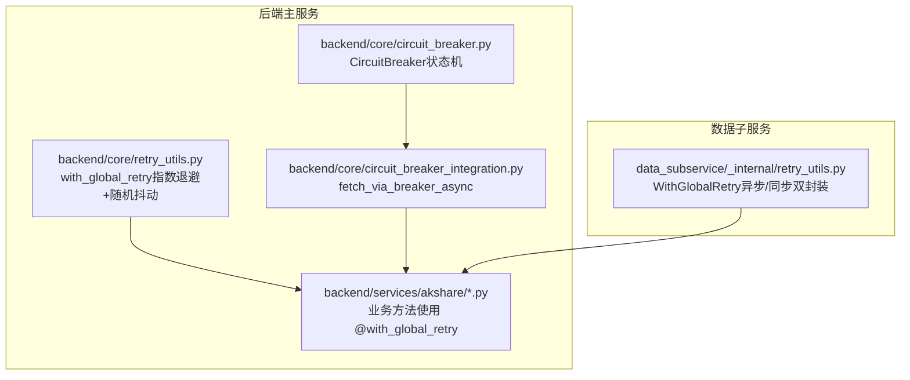
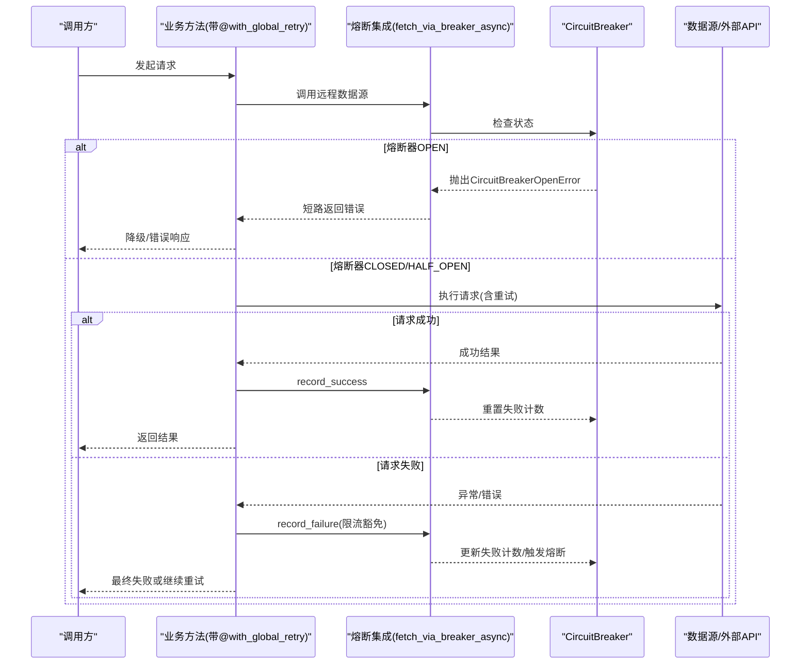
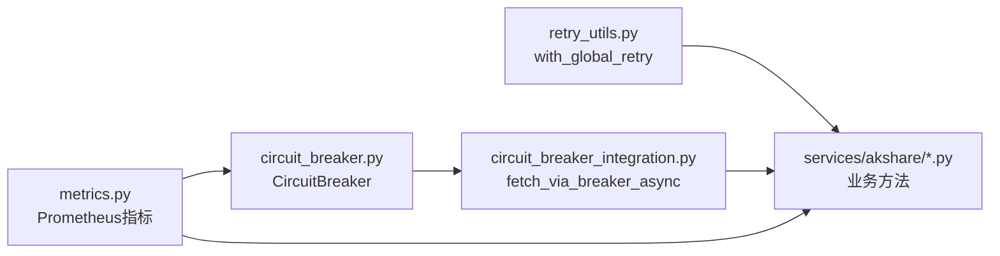

# 重试策略

<cite>
**本文引用的文件**
- [backend/core/retry_utils.py](file://backend/core/retry_utils.py)
- [data_subservice/_internal/retry_utils.py](file://data_subservice/_internal/retry_utils.py)
- [backend/core/circuit_breaker.py](file://backend/core/circuit_breaker.py)
- [backend/core/circuit_breaker_integration.py](file://backend/core/circuit_breaker_integration.py)
- [backend/services/akshare/calendar.py](file://backend/services/akshare/calendar.py)
- [backend/services/akshare/quote.py](file://backend/services/akshare/quote.py)
- [backend/tests/test_retry_utils.py](file://backend/tests/test_retry_utils.py)
- [data_subservice/tests/test_internal_retry_utils.py](file://data_subservice/tests/test_internal_retry_utils.py)
- [backend/core/metrics.py](file://backend/core/metrics.py)
</cite>

## 目录
1. [简介](#简介)
2. [项目结构](#项目结构)
3. [核心组件](#核心组件)
4. [架构总览](#架构总览)
5. [详细组件分析](#详细组件分析)
6. [依赖关系分析](#依赖关系分析)
7. [性能考量](#性能考量)
8. [故障排查指南](#故障排查指南)
9. [结论](#结论)
10. [附录](#附录)

## 简介
本文件系统性梳理 Quant Agent 的重试策略实现，重点围绕 RetryUtils 的设计模式与落地实践，涵盖指数退避、随机抖动、最大重试次数限制、可观测性指标以及与熔断器的协同机制。文档同时给出在 HTTP 请求、数据库操作、外部 API 调用等场景下的应用方式，并提供配置管理、测试方法与性能调优建议，帮助读者在不同服务类型下安全、可控地启用重试，避免雪崩效应。

## 项目结构
Quant Agent 将“重试”能力下沉到通用工具层，并在业务侧以装饰器形式透明接入；同时通过熔断器对不稳定外部依赖进行保护，形成“重试 + 熔断”的组合防御体系。

图表来源
- [backend/core/retry_utils.py:1-58](file://backend/core/retry_utils.py#L1-L58)
- [data_subservice/_internal/retry_utils.py:1-66](file://data_subservice/_internal/retry_utils.py#L1-L66)
- [backend/core/circuit_breaker.py:1-379](file://backend/core/circuit_breaker.py#L1-L379)
- [backend/core/circuit_breaker_integration.py:1-73](file://backend/core/circuit_breaker_integration.py#L1-L73)
- [backend/services/akshare/calendar.py:1-79](file://backend/services/akshare/calendar.py#L1-L79)
- [backend/services/akshare/quote.py:1-200](file://backend/services/akshare/quote.py#L1-L200)

章节来源
- [backend/core/retry_utils.py:1-58](file://backend/core/retry_utils.py#L1-L58)
- [data_subservice/_internal/retry_utils.py:1-66](file://data_subservice/_internal/retry_utils.py#L1-L66)
- [backend/core/circuit_breaker.py:1-379](file://backend/core/circuit_breaker.py#L1-L379)
- [backend/core/circuit_breaker_integration.py:1-73](file://backend/core/circuit_breaker_integration.py#L1-L73)
- [backend/services/akshare/calendar.py:1-79](file://backend/services/akshare/calendar.py#L1-L79)
- [backend/services/akshare/quote.py:1-200](file://backend/services/akshare/quote.py#L1-L200)

## 核心组件
- 重试工具（后端主服务）：提供基于 tenacity 的 with_global_retry 装饰器，内置指数退避与随机抖动，默认最大重试次数为 3，支持可重试异常判定与重试钩子日志。
- 重试工具（数据子服务）：提供 WithGlobalRetry 工厂类，自动识别异步/同步函数并包装，默认指数退避，最大重试次数可配置。
- 熔断器：实现 CLOSED → OPEN → HALF_OPEN 的状态机，支持限流错误不计入失败计数、冷却时间、半开探测恢复、全局状态快照与指标上报。
- 熔断集成：统一包装数据源 fetch 路径，OPEN 时短路返回错误结果，成功/失败分别记录，限流类错误豁免。
- 业务接入：在 AKShare 相关服务方法上以 @with_global_retry 装饰，结合 Redis 缓存与熔断降级，形成稳定链路。

章节来源
- [backend/core/retry_utils.py:1-58](file://backend/core/retry_utils.py#L1-L58)
- [data_subservice/_internal/retry_utils.py:1-66](file://data_subservice/_internal/retry_utils.py#L1-L66)
- [backend/core/circuit_breaker.py:1-379](file://backend/core/circuit_breaker.py#L1-L379)
- [backend/core/circuit_breaker_integration.py:1-73](file://backend/core/circuit_breaker_integration.py#L1-L73)
- [backend/services/akshare/calendar.py:1-79](file://backend/services/akshare/calendar.py#L1-L79)
- [backend/services/akshare/quote.py:1-200](file://backend/services/akshare/quote.py#L1-L200)

## 架构总览
重试与熔断协同工作，确保在不稳定外部依赖下既尝试自愈，又避免放大故障。

图表来源
- [backend/core/circuit_breaker_integration.py:40-73](file://backend/core/circuit_breaker_integration.py#L40-L73)
- [backend/core/circuit_breaker.py:147-218](file://backend/core/circuit_breaker.py#L147-L218)
- [backend/services/akshare/calendar.py:23-79](file://backend/services/akshare/calendar.py#L23-L79)
- [backend/services/akshare/quote.py:36-200](file://backend/services/akshare/quote.py#L36-L200)

## 详细组件分析

### 重试工具（后端主服务）
- 设计要点
  - 基于 tenacity 的 retry 装饰器，采用 wait_random_exponential（指数退避+随机抖动），最小间隔 1s，最大间隔 10s，最大尝试次数 3。
  - 可重试异常判定 is_retryable_http_error：覆盖外部接口限流/封禁关键词、Futu 频率限制与连接异常、httpx 网络异常及特定 HTTP 状态码（403/429/500/502/503/504）。
  - 重试钩子 log_retry_attempt：打印当前重试次数与异常类型，便于定位问题。
- 适用场景
  - HTTP 请求重试：针对网络抖动、临时限流、服务端崩溃等可恢复错误。
  - 外部 API 调用重试：如 Finnhub、AKShare 等第三方数据源，遇到 429/403 或底层超时/断连时自动重试。
- 注意事项
  - 幂等性：仅对幂等请求启用重试，避免重复写入导致副作用。
  - 超时控制：外层需设置合理超时，防止重试放大延迟。
  - 可观测性：配合 metrics 上报重试次数、失败原因、耗时分布。

章节来源
- [backend/core/retry_utils.py:10-58](file://backend/core/retry_utils.py#L10-L58)
- [backend/tests/test_retry_utils.py:14-121](file://backend/tests/test_retry_utils.py#L14-L121)

### 重试工具（数据子服务）
- 设计要点
  - WithGlobalRetry 工厂类，自动识别异步/同步函数并分别包装，默认指数退避，最大重试次数可配置。
  - 物理解耦：零 backend 依赖，仅依赖 tenacity，适合独立部署的子服务。
- 适用场景
  - 子服务内部对外部依赖的通用重试，如 akshare_worker、yfinance_worker 等。
- 注意事项
  - 参数可调：initial_wait、max_wait、retry_on 可按服务特性定制。
  - 测试覆盖：包含同步/异步成功与耗尽路径的单元测试。

章节来源
- [data_subservice/_internal/retry_utils.py:16-66](file://data_subservice/_internal/retry_utils.py#L16-L66)
- [data_subservice/tests/test_internal_retry_utils.py:8-75](file://data_subservice/tests/test_internal_retry_utils.py#L8-L75)

### 熔断器与集成
- 设计要点
  - 状态机：CLOSED → OPEN（连续失败达到阈值）→ HALF_OPEN（冷却后探测）→ CLOSED（探测成功）或 OPEN（探测失败）。
  - 限流豁免：is_rate_limit_error 钩子与 error_classifier 支持按异常动态判定，限流错误不计入失败计数。
  - 集成点：fetch_via_breaker_async 统一包装数据源 fetch，OPEN 时短路，成功/失败分别记录。
- 适用场景
  - 外部 API 不稳定时的快速失败与恢复，避免雪崩。
  - 多源融合场景下，单 action 失败不影响共享熔断器（exempt_from_breaker）。
- 注意事项
  - 冷却时间与环境变量：recovery_timeout 由环境变量控制，禁止硬编码。
  - 指标上报：CIRCUIT_BREAKER_STATE、CIRCUIT_BREAKER_TRANSITIONS 用于监控与告警。

章节来源
- [backend/core/circuit_breaker.py:45-379](file://backend/core/circuit_breaker.py#L45-L379)
- [backend/core/circuit_breaker_integration.py:25-73](file://backend/core/circuit_breaker_integration.py#L25-L73)
- [backend/core/metrics.py:100-110](file://backend/core/metrics.py#L100-L110)

### 业务接入示例（AKShare）
- 设计要点
  - 在 get_economic_calendar、get_company_news、get_stock_quote、get_stock_history 等方法上使用 @with_global_retry。
  - 结合 Redis 缓存与熔断降级：命中缓存直接返回；熔断中短路返回降级结果；失败累计触发熔断休眠。
- 适用场景
  - HTTP 请求重试：对 AKShare 子服务的远程调用进行重试。
  - 外部 API 调用重试：对新浪、雅虎等兜底源进行重试。
- 注意事项
  - 熔断冷却时间：通过 get_cooldown_seconds() 获取统一配置。
  - 错误计数：连续错误达到阈值触发熔断，避免持续施压。

章节来源
- [backend/services/akshare/calendar.py:20-79](file://backend/services/akshare/calendar.py#L20-L79)
- [backend/services/akshare/quote.py:22-200](file://backend/services/akshare/quote.py#L22-L200)

### 重试策略在不同场景的应用
- HTTP 请求重试
  - 使用 with_global_retry 装饰器，自动处理网络异常与限流状态码。
  - 建议：确保请求幂等，设置合理超时，结合缓存减少重试压力。
- 数据库操作重试
  - 对于连接池抖动、死锁等瞬时错误，可在事务边界外包裹重试逻辑。
  - 建议：区分可重试异常（如连接断开、超时）与不可重试异常（如约束冲突），避免无意义重试。
- 外部 API 调用重试
  - 针对第三方数据源（Finnhub、AKShare、Yahoo）的限流与不稳定，启用重试与熔断组合。
  - 建议：按服务类型差异化配置（最大重试次数、退避策略），并结合熔断快速失败。

[本节为概念性说明，不直接分析具体文件]

### 重试与熔断的协同工作机制
- 协同流程
  - 调用前检查熔断状态：OPEN 时短路，避免对不稳定服务继续施压。
  - 调用中重试：在 CLOSED/HALF_OPEN 状态下，允许有限次数的重试以自愈。
  - 调用后记录：成功重置失败计数；失败按是否限流决定是否计入熔断。
- 防雪崩策略
  - 限流错误不计入熔断失败计数，避免误判。
  - 冷却时间内不再尝试，降低系统负载。
  - 半开探测逐步恢复流量，验证服务可用性。

章节来源
- [backend/core/circuit_breaker.py:147-218](file://backend/core/circuit_breaker.py#L147-L218)
- [backend/core/circuit_breaker_integration.py:40-73](file://backend/core/circuit_breaker_integration.py#L40-L73)

### 可观测性支持
- 重试次数统计
  - 通过重试钩子与业务日志记录每次重试的异常类型与次数。
  - 结合 Prometheus 指标（如 DATASOURCE_ERRORS、DATASOURCE_RATE_LIMITS）统计重试与限流情况。
- 失败原因分析
  - 分类统计网络异常、超时、限流、认证失败等错误类型。
  - 利用熔断器指标（CIRCUIT_BREAKER_TRANSITIONS）观察状态转换。
- 性能影响评估
  - 通过延迟直方图（如 DATASOURCE_LATENCY、KLINE_CACHE_QUERY_LATENCY）评估重试对整体延迟的影响。
  - 监控队列深度（REDIS_QUEUE_DEPTH）与连接数（WS_ACTIVE_CONNECTIONS）判断资源占用。

章节来源
- [backend/core/metrics.py:156-183](file://backend/core/metrics.py#L156-L183)
- [backend/core/metrics.py:255-284](file://backend/core/metrics.py#L255-L284)
- [backend/core/metrics.py:326-354](file://backend/core/metrics.py#L326-L354)

### 配置管理
- 差异化配置
  - 针对不同服务类型（HTTP、数据库、外部 API）调整最大重试次数、初始等待时间、最大等待时间。
  - 数据子服务可通过 WithGlobalRetry 的参数化构造实现细粒度控制。
- 动态调整
  - 熔断冷却时间与失败阈值通过环境变量配置，支持运行时调整。
  - 结合配置中心或热更新机制，实现灰度发布中的渐进式重试策略。
- 灰度发布
  - 在新版本上线初期，降低重试次数与退避强度，观察指标后再逐步提升。
  - 利用熔断器快速失败，避免新版本缺陷放大。

章节来源
- [backend/core/circuit_breaker.py:40-43](file://backend/core/circuit_breaker.py#L40-L43)
- [data_subservice/_internal/retry_utils.py:25-35](file://data_subservice/_internal/retry_utils.py#L25-L35)

### 测试方法与性能调优建议
- 测试方法
  - 单元测试：覆盖 is_retryable_http_error 的各种异常路径与重试钩子行为。
  - 集成测试：模拟外部依赖不稳定，验证重试与熔断的协同效果。
  - 性能测试：使用 Locust 或类似工具压测，观察重试对延迟与吞吐的影响。
- 性能调优
  - 调整退避策略：根据服务特性选择合适的初始等待与最大等待时间。
  - 限制重试次数：避免无限重试导致资源耗尽。
  - 结合缓存：命中缓存直接返回，减少重试压力。
  - 监控告警：设置关键指标告警阈值，及时发现异常。

章节来源
- [backend/tests/test_retry_utils.py:14-121](file://backend/tests/test_retry_utils.py#L14-L121)
- [data_subservice/tests/test_internal_retry_utils.py:8-75](file://data_subservice/tests/test_internal_retry_utils.py#L8-L75)

## 依赖关系分析
重试与熔断的依赖关系如下：

图表来源
- [backend/core/retry_utils.py:1-58](file://backend/core/retry_utils.py#L1-L58)
- [backend/core/circuit_breaker_integration.py:1-73](file://backend/core/circuit_breaker_integration.py#L1-L73)
- [backend/core/circuit_breaker.py:1-379](file://backend/core/circuit_breaker.py#L1-L379)
- [backend/core/metrics.py:100-110](file://backend/core/metrics.py#L100-L110)
- [backend/services/akshare/calendar.py:1-79](file://backend/services/akshare/calendar.py#L1-L79)
- [backend/services/akshare/quote.py:1-200](file://backend/services/akshare/quote.py#L1-L200)

章节来源
- [backend/core/retry_utils.py:1-58](file://backend/core/retry_utils.py#L1-L58)
- [backend/core/circuit_breaker_integration.py:1-73](file://backend/core/circuit_breaker_integration.py#L1-L73)
- [backend/core/circuit_breaker.py:1-379](file://backend/core/circuit_breaker.py#L1-L379)
- [backend/core/metrics.py:100-110](file://backend/core/metrics.py#L100-L110)
- [backend/services/akshare/calendar.py:1-79](file://backend/services/akshare/calendar.py#L1-L79)
- [backend/services/akshare/quote.py:1-200](file://backend/services/akshare/quote.py#L1-L200)

## 性能考量
- 重试延迟：指数退避与随机抖动可有效分散重试峰值，但需关注总体延迟增加。
- 资源占用：重试可能增加线程/连接占用，需结合熔断快速失败避免资源耗尽。
- 缓存命中率：高缓存命中率可降低重试压力，提升整体性能。
- 监控指标：关注延迟直方图、错误率、限流次数等指标，及时调整策略。

[本节为一般性讨论，不直接分析具体文件]

## 故障排查指南
- 常见问题
  - 重试过多：检查 is_retryable_http_error 判定逻辑，避免将非重试异常纳入重试。
  - 熔断误触发：确认限流错误是否正确豁免，调整失败阈值与冷却时间。
  - 性能下降：分析重试对延迟的影响，优化缓存与重试策略。
- 排查步骤
  - 查看重试日志与指标，定位失败原因。
  - 检查熔断器状态与转换次数，确认是否误判。
  - 调整配置并观察指标变化，逐步优化。

章节来源
- [backend/core/retry_utils.py:10-58](file://backend/core/retry_utils.py#L10-L58)
- [backend/core/circuit_breaker.py:147-218](file://backend/core/circuit_breaker.py#L147-L218)
- [backend/core/metrics.py:100-110](file://backend/core/metrics.py#L100-L110)

## 结论
Quant Agent 的重试策略通过 with_global_retry 装饰器实现了指数退避与随机抖动，结合熔断器的状态机机制，有效提升了系统在外部依赖不稳定时的鲁棒性。通过可观测性指标与配置管理，团队可以精细化调整重试策略，避免雪崩效应，保障系统稳定性与性能。在实际应用中，应结合业务特性与监控数据，持续优化重试与熔断策略。

[本节为总结性内容，不直接分析具体文件]

## 附录
- 最佳实践
  - 幂等性：仅对幂等请求启用重试。
  - 超时控制：设置合理超时，避免重试放大延迟。
  - 缓存优先：命中缓存直接返回，减少重试压力。
  - 监控告警：设置关键指标告警阈值，及时发现异常。
- 参考实现
  - 后端主服务重试工具：backend/core/retry_utils.py
  - 数据子服务重试工具：data_subservice/_internal/retry_utils.py
  - 熔断器：backend/core/circuit_breaker.py
  - 熔断集成：backend/core/circuit_breaker_integration.py
  - 业务接入示例：backend/services/akshare/calendar.py, quote.py

[本节为补充信息，不直接分析具体文件]