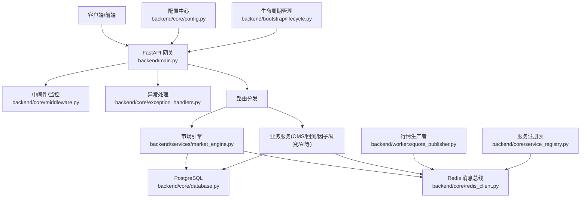
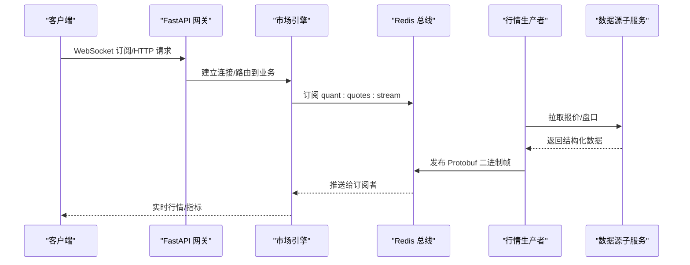
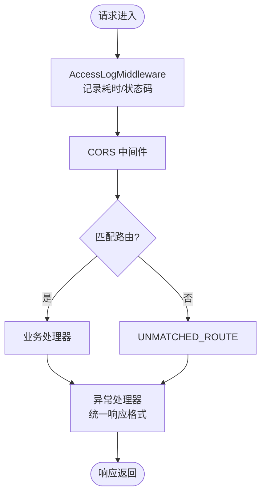
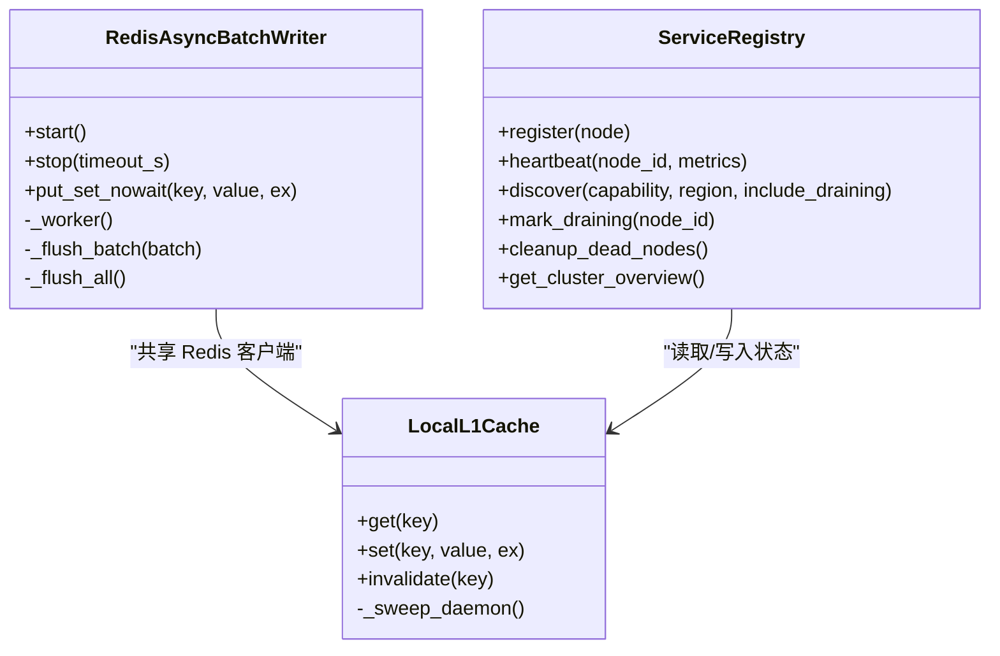
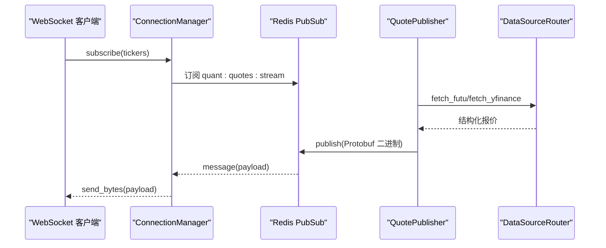
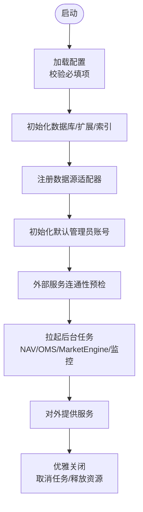
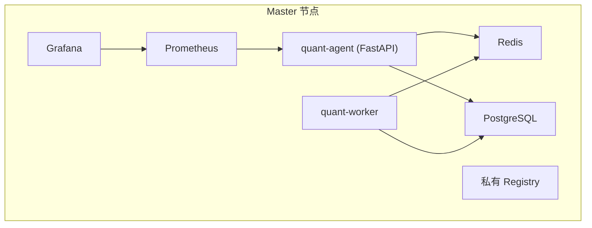
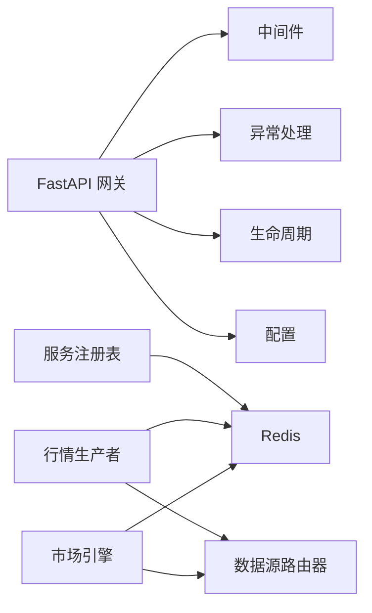

# 系统架构设计

<cite>
**本文引用的文件**
- [backend/main.py](file://backend/main.py)
- [backend/bootstrap/lifecycle.py](file://backend/bootstrap/lifecycle.py)
- [backend/core/config.py](file://backend/core/config.py)
- [backend/core/database.py](file://backend/core/database.py)
- [backend/core/redis_client.py](file://backend/core/redis_client.py)
- [backend/core/service_registry.py](file://backend/core/service_registry.py)
- [backend/core/middleware.py](file://backend/core/middleware.py)
- [backend/core/exception_handlers.py](file://backend/core/exception_handlers.py)
- [backend/services/market_engine.py](file://backend/services/market_engine.py)
- [backend/workers/quote_publisher.py](file://backend/workers/quote_publisher.py)
- [docker-compose.master.yml](file://docker-compose.master.yml)
</cite>

## 目录
1. [简介](#简介)
2. [项目结构](#项目结构)
3. [核心组件](#核心组件)
4. [架构总览](#架构总览)
5. [详细组件分析](#详细组件分析)
6. [依赖关系分析](#依赖关系分析)
7. [性能考量](#性能考量)
8. [故障排查指南](#故障排查指南)
9. [结论](#结论)
10. [附录](#附录)

## 简介
本架构文档面向 Quant Agent 系统，系统性阐述其分层架构、微服务化与事件驱动实现，覆盖 FastAPI 网关、Redis 消息总线、PostgreSQL 数据持久化、分布式节点注册与发现、以及各业务服务之间的通信机制。同时说明技术选型权衡、可扩展性设计、基础设施要求、部署拓扑与监控方案，并给出安全、性能、可靠性等横切关注点的落地策略。

## 项目结构
Quant Agent 采用“网关 + 领域服务 + 后台任务 + 数据源子服务”的分层与模块化组织：
- 网关层：FastAPI 应用作为统一入口，挂载路由、中间件、异常处理、可观测性配置。
- 领域服务层：市场引擎、OMS、回测、因子、研究、AI 叙述等按领域拆分的服务模块。
- 后台任务层：行情生产者、订阅广播、健康探针、配额监控、告警消费器等异步守护进程。
- 数据源子服务：独立进程承载外部数据源连接（如 Futu/YF/Finnhub），主服务通过 HTTP Router 调用，降低耦合与资源占用。
- 基础设施：Redis 作为缓存、消息总线与分布式状态；PostgreSQL 作为持久化存储；Prometheus/Grafana 用于监控。

**图表来源**
- [backend/main.py:125-218](file://backend/main.py#L125-L218)
- [backend/core/middleware.py:90-133](file://backend/core/middleware.py#L90-L133)
- [backend/core/exception_handlers.py:18-102](file://backend/core/exception_handlers.py#L18-L102)
- [backend/services/market_engine.py:39-113](file://backend/services/market_engine.py#L39-L113)
- [backend/core/redis_client.py:11-35](file://backend/core/redis_client.py#L11-L35)
- [backend/core/database.py:1-67](file://backend/core/database.py#L1-L67)
- [backend/workers/quote_publisher.py:22-157](file://backend/workers/quote_publisher.py#L22-L157)
- [backend/core/service_registry.py:69-119](file://backend/core/service_registry.py#L69-L119)
- [backend/core/config.py:20-134](file://backend/core/config.py#L20-L134)
- [backend/bootstrap/lifecycle.py:42-151](file://backend/bootstrap/lifecycle.py#L42-L151)

**章节来源**
- [backend/main.py:125-218](file://backend/main.py#L125-L218)
- [docker-compose.master.yml:16-130](file://docker-compose.master.yml#L16-L130)

## 核心组件
- FastAPI 网关：负责应用装配、路由挂载、CORS、OpenAPI、中间件链、异常处理器、静态资源托管。
- Redis 消息总线与缓存：提供 Pub/Sub 实时推送、Stream 断线追补、批量写入队列、L1 内存缓存、分布式服务注册表。
- PostgreSQL 数据库：同步/异步引擎、连接池、扩展初始化（pgvector/pg_trgm）、模型迁移。
- 市场引擎：WebSocket 连接管理、订阅广播、指标缓存、资金流与账户快照、风控预警。
- 行情生产者：轮询外部数据源，序列化 Protobuf，双写最新快照与实时流。
- 服务注册表：基于 Redis Hash/ZSet/Set 的跨节点注册、心跳、优雅下线、统计与集群总览。
- 配置与生命周期：Pydantic Settings 强校验、启动自检、后台任务拉起、优雅关闭。

**章节来源**
- [backend/core/config.py:20-134](file://backend/core/config.py#L20-L134)
- [backend/bootstrap/lifecycle.py:42-151](file://backend/bootstrap/lifecycle.py#L42-L151)
- [backend/core/database.py:1-67](file://backend/core/database.py#L1-L67)
- [backend/core/redis_client.py:11-35](file://backend/core/redis_client.py#L11-L35)
- [backend/core/service_registry.py:69-119](file://backend/core/service_registry.py#L69-L119)
- [backend/services/market_engine.py:115-199](file://backend/services/market_engine.py#L115-L199)
- [backend/workers/quote_publisher.py:22-157](file://backend/workers/quote_publisher.py#L22-L157)

## 架构总览
Quant Agent 采用分层+微服务+事件驱动的混合架构：
- 分层：网关层（FastAPI）→ 领域服务层（业务编排）→ 数据访问层（DB/Cache）→ 外部数据源适配层（子服务）。
- 微服务：数据源能力下沉至 data_subservice，主服务通过 DataSourceRouter 远程调用，解耦 SDK 与连接资源。
- 事件驱动：以 Redis Pub/Sub 为实时总线，结合 Stream 做可靠投递与断线追补；后台任务持续拉取与广播。

**图表来源**
- [backend/services/market_engine.py:296-330](file://backend/services/market_engine.py#L296-L330)
- [backend/workers/quote_publisher.py:90-157](file://backend/workers/quote_publisher.py#L90-L157)
- [backend/core/redis_client.py:11-35](file://backend/core/redis_client.py#L11-L35)

**章节来源**
- [backend/services/market_engine.py:115-199](file://backend/services/market_engine.py#L115-L199)
- [backend/workers/quote_publisher.py:166-222](file://backend/workers/quote_publisher.py#L166-L222)

## 详细组件分析

### FastAPI 网关与中间件
- 应用工厂 create_app 组装 OpenAPI、生命周期、异常处理、中间件栈、路由挂载与静态资源。
- 中间件链包含访问日志与 Prometheus 指标采集，严格顺序避免 OPTIONS 预检被误拦截。
- 全局异常处理器统一错误响应格式，支持 trace_id 追踪。

**图表来源**
- [backend/main.py:125-218](file://backend/main.py#L125-L218)
- [backend/core/middleware.py:90-133](file://backend/core/middleware.py#L90-L133)
- [backend/core/exception_handlers.py:18-102](file://backend/core/exception_handlers.py#L18-L102)

**章节来源**
- [backend/main.py:125-218](file://backend/main.py#L125-L218)
- [backend/core/middleware.py:90-133](file://backend/core/middleware.py#L90-L133)
- [backend/core/exception_handlers.py:18-102](file://backend/core/exception_handlers.py#L18-L102)

### Redis 消息总线与缓存
- 连接池与协议：使用 redis.asyncio 连接池，强制 RESP2 兼容；支持密码认证与最大连接数限制。
- 批量写入：异步批处理器聚合 set 操作，Pipeline 批量提交，降低 RTT 与带宽压力。
- L1 本地缓存：进程内短效缓存，自动清理过期键，容量上限熔断清空，穿透到 L2 Redis。
- 服务注册表：Hash/ZSet/Set 协同，节点注册、心跳、优雅下线、死节点清理、统计与集群总览。

**图表来源**
- [backend/core/redis_client.py:46-177](file://backend/core/redis_client.py#L46-L177)
- [backend/core/redis_client.py:184-252](file://backend/core/redis_client.py#L184-L252)
- [backend/core/service_registry.py:69-119](file://backend/core/service_registry.py#L69-L119)

**章节来源**
- [backend/core/redis_client.py:11-35](file://backend/core/redis_client.py#L11-L35)
- [backend/core/redis_client.py:46-177](file://backend/core/redis_client.py#L46-L177)
- [backend/core/redis_client.py:184-252](file://backend/core/redis_client.py#L184-L252)
- [backend/core/service_registry.py:69-119](file://backend/core/service_registry.py#L69-L119)

### 市场引擎与 WebSocket 广播
- 连接管理：维护活跃连接与订阅集合，动态同步订阅标的到 Redis，供生产者跟随。
- 实时推送：监听 Redis Pub/Sub，解析 Protobuf，仅向订阅该标的的连接发送二进制帧。
- 指标与风控：埋点行情延迟、陈旧度、消息计数；监控宏观指数资金流出触发风控报警。
- 兜底与降级：Futu 失败时切换 YFinance 兜底，带退避与防风暴控制。

**图表来源**
- [backend/services/market_engine.py:174-199](file://backend/services/market_engine.py#L174-L199)
- [backend/services/market_engine.py:296-330](file://backend/services/market_engine.py#L296-L330)
- [backend/workers/quote_publisher.py:90-157](file://backend/workers/quote_publisher.py#L90-L157)

**章节来源**
- [backend/services/market_engine.py:115-199](file://backend/services/market_engine.py#L115-L199)
- [backend/services/market_engine.py:296-330](file://backend/services/market_engine.py#L296-L330)
- [backend/workers/quote_publisher.py:90-157](file://backend/workers/quote_publisher.py#L90-L157)

### 配置与生命周期管理
- 配置：Pydantic Settings 强校验必填项（DATABASE_URL、EMBEDDING_API_KEY 等），环境变量注入，运行时约束检查。
- 生命周期：启动阶段注册数据源适配器、初始化默认管理员账号、测试外部服务连通性、拉起后台任务（NAV 快照、OMS 持仓同步、MarketEngine 广播、限流告警、健康监控、配额监控、探针）。
- 优雅关闭：取消后台任务、释放线程池、关闭 LLM/Redis/DB 连接、记录关闭耗时。

**图表来源**
- [backend/core/config.py:20-134](file://backend/core/config.py#L20-L134)
- [backend/bootstrap/lifecycle.py:42-151](file://backend/bootstrap/lifecycle.py#L42-L151)
- [backend/bootstrap/lifecycle.py:324-492](file://backend/bootstrap/lifecycle.py#L324-L492)

**章节来源**
- [backend/core/config.py:20-134](file://backend/core/config.py#L20-L134)
- [backend/bootstrap/lifecycle.py:42-151](file://backend/bootstrap/lifecycle.py#L42-L151)
- [backend/bootstrap/lifecycle.py:324-492](file://backend/bootstrap/lifecycle.py#L324-L492)

### 部署拓扑与基础设施
- 容器编排：Master 节点包含 Redis、PostgreSQL、quant-agent、quant-worker、私有 Registry、Prometheus、Grafana。
- 网络与安全：Redis/PG 仅绑定 loopback 与 Tailscale 内网 IP，不暴露公网；量化 API 端口按需开放；镜像仓库内网访问。
- 资源限制：为各服务设置 CPU/内存限制与保留值，防止 OOM；对主服务限制并发与最大请求数以稳定 RSS。

**图表来源**
- [docker-compose.master.yml:16-130](file://docker-compose.master.yml#L16-L130)
- [docker-compose.master.yml:197-251](file://docker-compose.master.yml#L197-L251)

**章节来源**
- [docker-compose.master.yml:16-130](file://docker-compose.master.yml#L16-L130)
- [docker-compose.master.yml:197-251](file://docker-compose.master.yml#L197-L251)

## 依赖关系分析
- 网关依赖：中间件、异常处理、路由、生命周期、配置。
- 市场引擎依赖：Redis（Pub/Sub、Stream、缓存）、数据源路由器（Futu/YF）、通知服务、Kline 仓库。
- 行情生产者依赖：数据源路由器、Redis（双写快照与流）、质量监控。
- 服务注册表依赖：Redis（Hash/ZSet/Set），用于跨节点发现与心跳。
- 配置依赖：环境变量与 .env，强校验关键参数。

**图表来源**
- [backend/main.py:125-218](file://backend/main.py#L125-L218)
- [backend/services/market_engine.py:115-199](file://backend/services/market_engine.py#L115-L199)
- [backend/workers/quote_publisher.py:90-157](file://backend/workers/quote_publisher.py#L90-L157)
- [backend/core/service_registry.py:69-119](file://backend/core/service_registry.py#L69-L119)
- [backend/core/config.py:20-134](file://backend/core/config.py#L20-L134)

**章节来源**
- [backend/main.py:125-218](file://backend/main.py#L125-L218)
- [backend/services/market_engine.py:115-199](file://backend/services/market_engine.py#L115-L199)
- [backend/workers/quote_publisher.py:90-157](file://backend/workers/quote_publisher.py#L90-L157)
- [backend/core/service_registry.py:69-119](file://backend/core/service_registry.py#L69-L119)
- [backend/core/config.py:20-134](file://backend/core/config.py#L20-L134)

## 性能考量
- 高吞吐与低延迟：
  - Redis 批量写入与 Pipeline 减少 RTT；L1 内存缓存消除极高频读的网络开销。
  - WebSocket 二进制帧压缩与批量发送，降低带宽与 CPU 消耗。
  - 指标细粒度桶设计，精准计算 P95/P99 耗时。
- 稳定性与容错：
  - 外部 API 慢请求告警与超时保护；数据源健康探针与熔断自愈。
  - 优雅关闭保证在途任务完成与资源释放。
- 资源治理：
  - 全局线程池上限限制，防止 OOM；容器级 CPU/内存限制。
  - 行情生产者并发信号量控制，避免打爆外部 API 或触发封禁。

[本节为通用性能指导，无需特定文件引用]

## 故障排查指南
- 启动失败：
  - 检查 DATABASE_URL 与 EMBEDDING_API_KEY 是否配置正确；确认 pgvector/pg_trgm 扩展已创建。
  - 查看外部服务连通性预检结果（通知服务、FRED 等），超时将自动降级。
- 行情不更新：
  - 确认 Redis Pub/Sub 通道是否正常；检查订阅标的集合是否同步。
  - 核查数据源子服务可用性（Futu/YF），观察熔断与健康度指标。
- 性能退化：
  - 观察 Prometheus 指标（请求总数、延迟直方图、外部 API 延迟）；定位慢接口与外部依赖瓶颈。
  - 检查 L1 缓存命中率与 Redis 连接池使用情况。
- 优雅关闭问题：
  - 关注关闭阶段任务取消与资源释放日志；必要时调整超时阈值。

**章节来源**
- [backend/core/config.py:94-119](file://backend/core/config.py#L94-L119)
- [backend/bootstrap/lifecycle.py:107-151](file://backend/bootstrap/lifecycle.py#L107-L151)
- [backend/services/market_engine.py:296-330](file://backend/services/market_engine.py#L296-L330)
- [backend/core/middleware.py:10-38](file://backend/core/middleware.py#L10-L38)
- [backend/bootstrap/lifecycle.py:324-492](file://backend/bootstrap/lifecycle.py#L324-L492)

## 结论
Quant Agent 通过 FastAPI 网关统一接入、Redis 事件总线驱动实时与可靠通信、PostgreSQL 持久化保障数据一致性，并以微服务化方式将数据源能力下沉，实现高内聚、低耦合的可扩展架构。系统在安全（内网绑定、密钥管理）、性能（批量写入、缓存、指标）、可靠性（健康探针、熔断、优雅关闭）方面均有明确落地策略，适合多节点部署与持续演进。

[本节为总结性内容，无需特定文件引用]

## 附录
- 监控方案：Prometheus 抓取网关与外部 API 指标，Grafana 可视化；自定义仪表盘与告警规则。
- 安全实践：环境变量注入敏感信息；Redis/PG 仅内网暴露；内部 API 密钥与加密主密钥管理。
- 扩展建议：引入更多数据源子服务节点，利用服务注册表进行区域与能力路由；增加灰度与蓝绿发布流程。

[本节为补充信息，无需特定文件引用]
