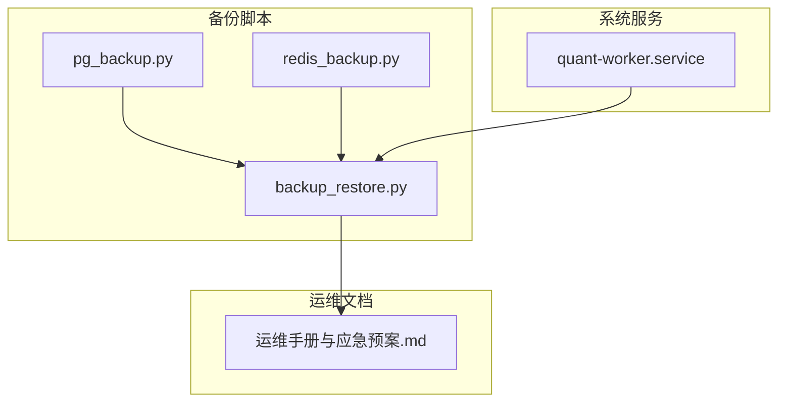
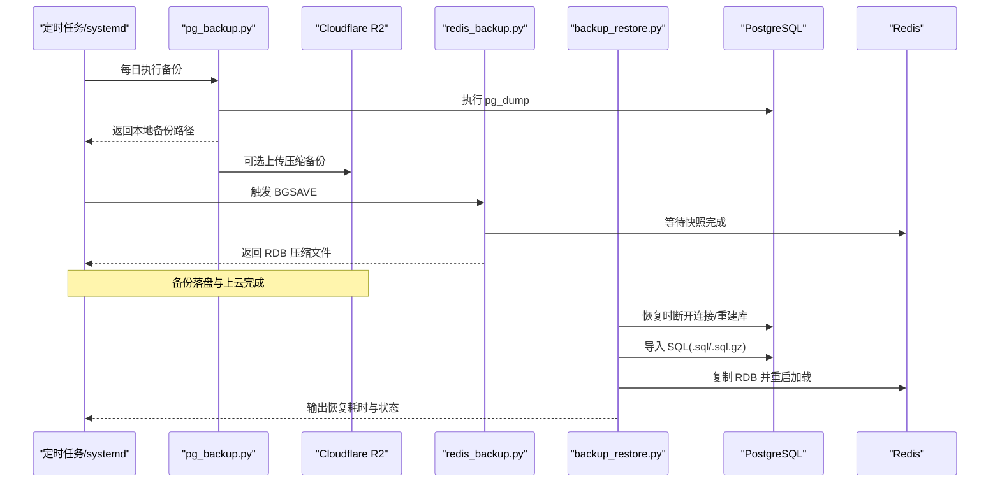
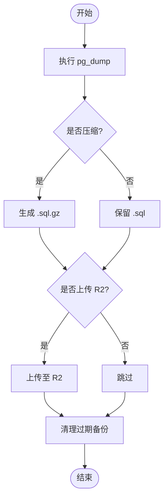
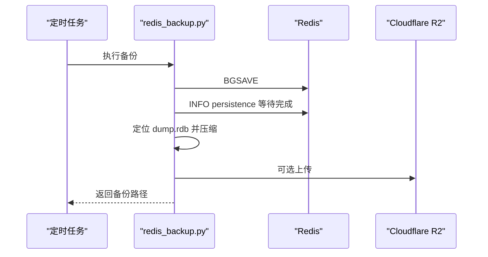
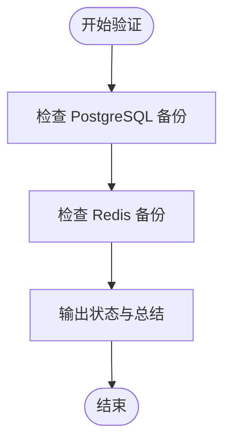
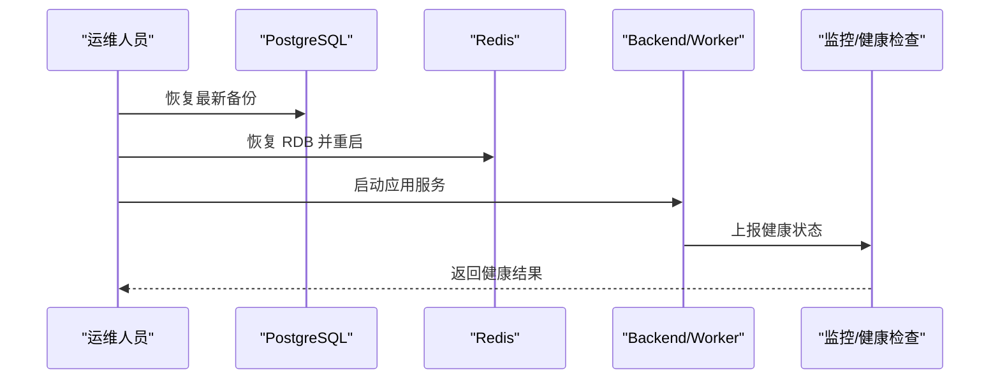
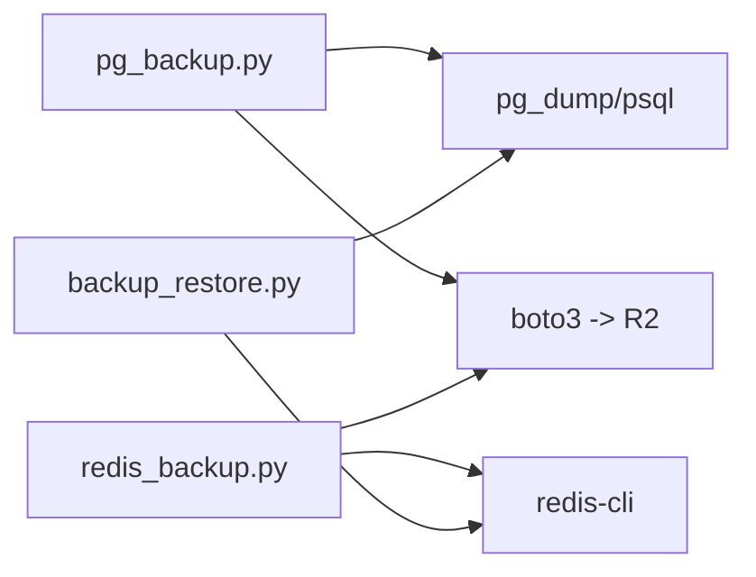

# 备份与恢复

<cite>
**本文引用的文件**
- [backend/scripts/backup_restore.py](file://backend/scripts/backup_restore.py)
- [backend/scripts/pg_backup.py](file://backend/scripts/pg_backup.py)
- [backend/scripts/redis_backup.py](file://backend/scripts/redis_backup.py)
- [docs/12. 运维手册与应急预案.md](file://docs/12. 运维手册与应急预案.md)
- [scripts/deploy/quant-worker.service](file://scripts/deploy/quant-worker.service)
</cite>

## 目录
1. [简介](#简介)
2. [项目结构](#项目结构)
3. [核心组件](#核心组件)
4. [架构总览](#架构总览)
5. [详细组件分析](#详细组件分析)
6. [依赖关系分析](#依赖关系分析)
7. [性能考量](#性能考量)
8. [故障排查指南](#故障排查指南)
9. [结论](#结论)
10. [附录](#附录)

## 简介
本文件面向 Quant Agent 系统的备份与恢复，覆盖以下目标：
- 数据库备份策略：PostgreSQL 全量备份、逻辑备份、增量备份思路与落地方式。
- 缓存数据备份：Redis 持久化（AOF/RDB）、快照管理、数据同步与恢复。
- 文件数据备份：策略文件、报告文件、日志文件的备份策略。
- 灾难恢复流程：数据恢复步骤、服务重启顺序、数据一致性验证。
- 自动化备份脚本：定时任务配置、备份轮转、存储空间管理。
- 备份验证与恢复测试：确保数据完整性与可用性。

## 项目结构
与备份恢复相关的核心脚本与文档位于后端 scripts 与 docs 目录：
- PostgreSQL 备份与恢复：pg_backup.py、backup_restore.py
- Redis 备份与恢复：redis_backup.py、backup_restore.py
- 运维与应急手册：docs/12. 运维手册与应急预案.md
- 系统服务守护：scripts/deploy/quant-worker.service（用于后台任务与采集器）

图表来源
- [backend/scripts/pg_backup.py:1-362](file://backend/scripts/pg_backup.py#L1-L362)
- [backend/scripts/redis_backup.py:1-219](file://backend/scripts/redis_backup.py#L1-L219)
- [backend/scripts/backup_restore.py:1-355](file://backend/scripts/backup_restore.py#L1-L355)
- [docs/12. 运维手册与应急预案.md:384-429](file://docs/12. 运维手册与应急预案.md#L384-L429)
- [scripts/deploy/quant-worker.service:1-61](file://scripts/deploy/quant-worker.service#L1-L61)

章节来源
- [backend/scripts/pg_backup.py:1-362](file://backend/scripts/pg_backup.py#L1-L362)
- [backend/scripts/redis_backup.py:1-219](file://backend/scripts/redis_backup.py#L1-L219)
- [backend/scripts/backup_restore.py:1-355](file://backend/scripts/backup_restore.py#L1-L355)
- [docs/12. 运维手册与应急预案.md:384-429](file://docs/12. 运维手册与应急预案.md#L384-L429)
- [scripts/deploy/quant-worker.service:1-61](file://scripts/deploy/quant-worker.service#L1-L61)

## 核心组件
- PostgreSQL 备份管理器（pg_backup.py）
  - 使用 pg_dump 进行逻辑备份，支持压缩与上传至 Cloudflare R2（S3 兼容）。
  - 提供本地清理策略，按天数删除过期备份。
  - 提供恢复接口，支持 .sql 与 .sql.gz 恢复。
- Redis 备份脚本（redis_backup.py）
  - 触发 BGSAVE 生成 RDB 快照，等待完成并压缩为 .rdb.gz。
  - 可选上传到 R2；支持清理过期备份。
- 统一恢复演练脚本（backup_restore.py）
  - 支持 PostgreSQL 与 Redis 的恢复流程，包含连接断开、重建数据库、导入数据等步骤。
  - 内置 RTO 检查与备份完整性校验。
- 运维手册（docs/12. 运维手册与应急预案.md）
  - 定义完整系统重建流程、RTO/RPO 目标、日常维护清单与灾难恢复步骤。
- 系统服务（quant-worker.service）
  - 通过 systemd 守护 worker 进程，具备自动重启与健康检查能力，适合承载定时备份任务或采集任务。

章节来源
- [backend/scripts/pg_backup.py:49-321](file://backend/scripts/pg_backup.py#L49-L321)
- [backend/scripts/redis_backup.py:51-214](file://backend/scripts/redis_backup.py#L51-L214)
- [backend/scripts/backup_restore.py:43-239](file://backend/scripts/backup_restore.py#L43-L239)
- [docs/12. 运维手册与应急预案.md:364-429](file://docs/12. 运维手册与应急预案.md#L364-L429)
- [scripts/deploy/quant-worker.service:17-58](file://scripts/deploy/quant-worker.service#L17-L58)

## 架构总览
Quant Agent 的备份与恢复由“备份脚本 + 存储 + 恢复工具 + 运维流程”构成：
- 备份阶段：pg_backup.py 执行 pg_dump → 压缩 → 可选上传 R2；redis_backup.py 触发 BGSAVE → 压缩 → 可选上传 R2。
- 存储阶段：本地备份目录与对象存储（R2）双写，便于快速恢复与异地容灾。
- 恢复阶段：backup_restore.py 提供交互式恢复流程，支持 PSQL 与 Redis 恢复，并校验 RTO。
- 运维阶段：依据运维手册执行重建流程，结合 systemd 服务保证关键进程自恢复。

图表来源
- [backend/scripts/pg_backup.py:73-140](file://backend/scripts/pg_backup.py#L73-L140)
- [backend/scripts/pg_backup.py:192-226](file://backend/scripts/pg_backup.py#L192-L226)
- [backend/scripts/redis_backup.py:51-135](file://backend/scripts/redis_backup.py#L51-L135)
- [backend/scripts/backup_restore.py:43-239](file://backend/scripts/backup_restore.py#L43-L239)

## 详细组件分析

### PostgreSQL 备份与恢复
- 备份流程
  - 使用 pg_dump 导出逻辑备份，支持 --no-owner --no-privileges 提升跨环境兼容性。
  - 可选压缩为 .sql.gz，减少传输与存储成本。
  - 可选上传至 Cloudflare R2（S3 兼容），实现异地容灾。
  - 本地清理策略：按保留天数删除过期备份，避免磁盘膨胀。
- 恢复流程
  - 支持 .sql 与 .sql.gz 恢复，内部解压后通过 psql 导入。
  - 在 backup_restore.py 中提供交互式恢复：断开连接、重建数据库、导入数据、统计耗时与 RTO。
- 复杂度与性能
  - pg_dump 时间复杂度近似 O(N)（N 为表行数），压缩与上传为 I/O 密集型。
  - 大库建议分时段备份或使用并行导出工具（如 pg_dumpall 或第三方工具）以降低窗口期。
- 错误处理
  - 捕获 pg_dump/psql 失败并记录 stderr，返回结构化结果以便告警。
  - 超时控制：pg_dump 设置 1 小时超时，psql 恢复设置 2 小时超时。

图表来源
- [backend/scripts/pg_backup.py:73-140](file://backend/scripts/pg_backup.py#L73-L140)
- [backend/scripts/pg_backup.py:192-226](file://backend/scripts/pg_backup.py#L192-L226)
- [backend/scripts/pg_backup.py:231-242](file://backend/scripts/pg_backup.py#L231-L242)

章节来源
- [backend/scripts/pg_backup.py:49-321](file://backend/scripts/pg_backup.py#L49-L321)
- [backend/scripts/backup_restore.py:43-159](file://backend/scripts/backup_restore.py#L43-L159)

### Redis 备份与恢复
- 备份流程
  - 通过 redis-cli 触发 BGSAVE，等待 rdb_bgsave_in_progress=0 表示完成。
  - 定位 dump.rdb 路径（支持容器与本地常见路径），压缩为 .rdb.gz。
  - 可选上传至 R2；支持清理过期备份。
- 恢复流程
  - 将 RDB 复制到 Redis 数据目录（优先 Docker 容器 /data/dump.rdb），重启 Redis 加载数据。
  - 通过 redis-cli DBSIZE 验证数据量。
- 复杂度与性能
  - BGSAVE 为子进程快照，对主进程影响较小；压缩与上传为 I/O 密集。
  - 大内存实例建议调整 BGSAVE 频率与 maxmemory-policy，避免频繁阻塞。
- 错误处理
  - 捕获 redis-cli 命令失败与超时，提示凭证与路径问题。
  - 若无法找到 dump.rdb，尝试从容器复制。

图表来源
- [backend/scripts/redis_backup.py:51-135](file://backend/scripts/redis_backup.py#L51-L135)
- [backend/scripts/redis_backup.py:138-167](file://backend/scripts/redis_backup.py#L138-L167)

章节来源
- [backend/scripts/redis_backup.py:51-214](file://backend/scripts/redis_backup.py#L51-L214)
- [backend/scripts/backup_restore.py:162-239](file://backend/scripts/backup_restore.py#L162-L239)

### 统一恢复演练与验证
- 功能要点
  - 支持 PostgreSQL 与 Redis 两种恢复类型，交互式确认避免误操作。
  - 内置 RTO 检查：PostgreSQL 目标 < 2h，Redis 目标 < 30min。
  - 备份完整性验证：检查最新备份是否存在、可解压、大小与时间戳。
- 使用方式
  - 恢复：python backend/scripts/backup_restore.py --type pg --backup <文件>
  - 恢复：python backend/scripts/backup_restore.py --type redis --backup <文件>
  - 验证：python backend/scripts/backup_restore.py --verify

图表来源
- [backend/scripts/backup_restore.py:242-318](file://backend/scripts/backup_restore.py#L242-L318)

章节来源
- [backend/scripts/backup_restore.py:242-355](file://backend/scripts/backup_restore.py#L242-L355)

### 灾难恢复流程与服务重启顺序
- 重建流程（参考运维手册）
  - 初始化新 VPS，安装必要软件与镜像。
  - 恢复 PostgreSQL：下载最新备份并导入。
  - 恢复 Redis：下载 RDB 并替换数据目录后重启。
  - 启动所有服务，安装 Futu OpenD（如需交易能力）。
  - 验证健康端点与关键指标。
- 服务重启顺序
  - 先启动数据层（PostgreSQL、Redis），再启动应用层（Backend、Worker、前端）。
  - 使用 systemd 守护 Worker，确保自动重启与健康检查。
- 数据一致性验证
  - 通过 health 端点、Grafana 监控、业务查询抽样验证。
  - 对关键表计数与最近时间戳比对，确保数据完整。

图表来源
- [docs/12. 运维手册与应急预案.md:384-429](file://docs/12. 运维手册与应急预案.md#L384-L429)
- [scripts/deploy/quant-worker.service:17-58](file://scripts/deploy/quant-worker.service#L17-L58)

章节来源
- [docs/12. 运维手册与应急预案.md:384-429](file://docs/12. 运维手册与应急预案.md#L384-L429)
- [scripts/deploy/quant-worker.service:17-58](file://scripts/deploy/quant-worker.service#L17-L58)

### 文件数据备份策略
- 策略文件
  - 将关键配置文件（如 .env、docker-compose、registry-config.yml）纳入版本控制与加密备份。
  - 建议在 CI 部署时自动归档到 R2，并设置访问权限与生命周期策略。
- 报告文件
  - 回测报告、评估报告等输出文件应定期归档至对象存储，保留策略按业务需求设定（如 90 天滚动）。
- 日志文件
  - 后端日志采用 journald 或文件轮转，定期压缩并上传至对象存储。
  - 日志保留策略建议按周/月归档，避免本地磁盘占用过高。

[本节为概念性说明，不直接分析具体文件]

## 依赖关系分析
- 外部依赖
  - PostgreSQL 客户端工具：pg_dump、psql、createdb、dropdb。
  - Redis 客户端工具：redis-cli。
  - 对象存储 SDK：boto3（用于 S3/R2 兼容上传）。
- 内部依赖
  - 环境变量：DATABASE_URL、R2_*、REDIS_*、BACKUP_DIR 等。
  - 系统服务：systemd 守护 worker，确保后台任务稳定运行。

图表来源
- [backend/scripts/pg_backup.py:192-226](file://backend/scripts/pg_backup.py#L192-L226)
- [backend/scripts/redis_backup.py:138-167](file://backend/scripts/redis_backup.py#L138-L167)
- [backend/scripts/backup_restore.py:65-150](file://backend/scripts/backup_restore.py#L65-L150)

章节来源
- [backend/scripts/pg_backup.py:192-226](file://backend/scripts/pg_backup.py#L192-L226)
- [backend/scripts/redis_backup.py:138-167](file://backend/scripts/redis_backup.py#L138-L167)
- [backend/scripts/backup_restore.py:65-150](file://backend/scripts/backup_restore.py#L65-L150)

## 性能考量
- 备份窗口
  - 大库 pg_dump 可能耗时较长，建议在低峰期执行，并结合并行导出或分区备份降低影响。
  - Redis BGSAVE 会 fork 子进程，注意内存峰值与 CPU 占用，合理设置 maxmemory 与策略。
- 存储与传输
  - 压缩级别与网络带宽影响备份时长，可根据 RTO 目标调优。
  - 对象存储上传失败重试与断点续传需结合 SDK 与网络稳定性。
- 资源限制
  - 通过 systemd 限制 Worker 进程内存与 CPU，避免备份任务影响在线服务。

[本节提供通用指导，不直接分析具体文件]

## 故障排查指南
- PostgreSQL 备份失败
  - 检查 DATABASE_URL 是否正确，pg_dump 权限是否足够。
  - 查看 stderr 输出，确认网络与认证问题。
- Redis 备份失败
  - 检查 redis-cli 连通性与密码配置。
  - 确认 dump.rdb 路径与容器卷挂载正确。
- 恢复失败
  - 确认备份文件完整性（gzip/rdb 可解压）。
  - 检查目标数据库/Redis 服务状态与端口连通性。
- 监控与告警
  - 通过 Grafana 与 Prometheus 监控备份任务成功率与耗时。
  - 设置告警规则：备份失败、RTO 超标、存储空间不足。

章节来源
- [backend/scripts/pg_backup.py:142-178](file://backend/scripts/pg_backup.py#L142-L178)
- [backend/scripts/redis_backup.py:51-74](file://backend/scripts/redis_backup.py#L51-L74)
- [backend/scripts/backup_restore.py:152-159](file://backend/scripts/backup_restore.py#L152-L159)

## 结论
Quant Agent 的备份与恢复体系以 pg_backup.py、redis_backup.py 与 backup_restore.py 为核心，结合对象存储与运维手册，实现了：
- 可靠的逻辑备份与快照管理。
- 标准化的恢复流程与 RTO 目标。
- 自动化与可观测性支撑的运维实践。
建议在生产环境中：
- 定期演练恢复流程，验证 RTO/RPO 达标。
- 完善文件级备份策略（配置、报告、日志）。
- 强化监控与告警，确保备份任务稳定运行。

[本节为总结性内容，不直接分析具体文件]

## 附录
- 常用命令参考
  - 手动触发 PostgreSQL 备份：python -m backend.scripts.pg_backup --output /tmp/backup
  - 手动触发 Redis 备份：python backend/scripts/redis_backup.py --upload
  - 验证备份完整性：python backend/scripts/backup_restore.py --verify
- 定时任务建议
  - 每日凌晨执行 pg_backup 与 redis_backup，并清理过期备份。
  - 使用 systemd 或 cron 调度，结合日志与告警确保可追踪。

[本节为补充信息，不直接分析具体文件]
