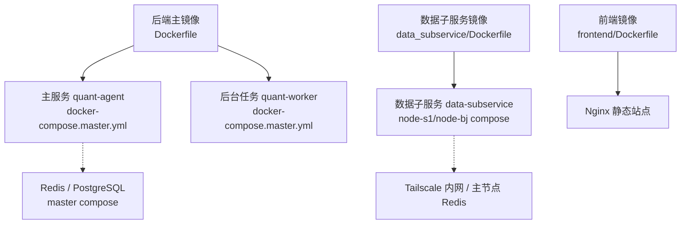
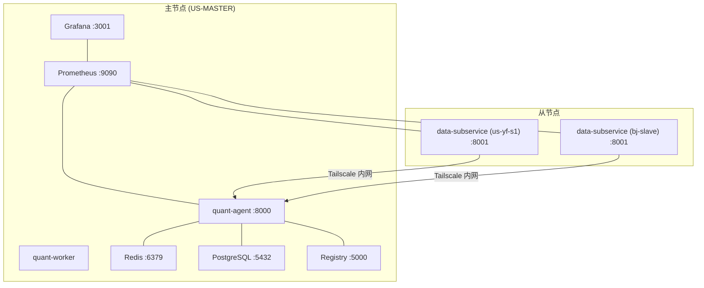
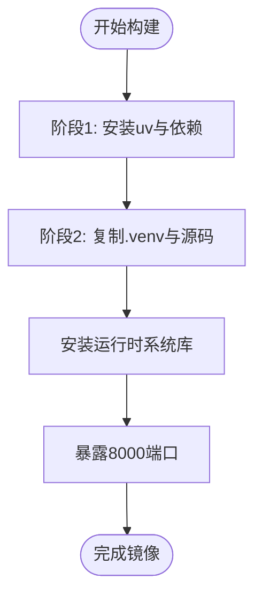
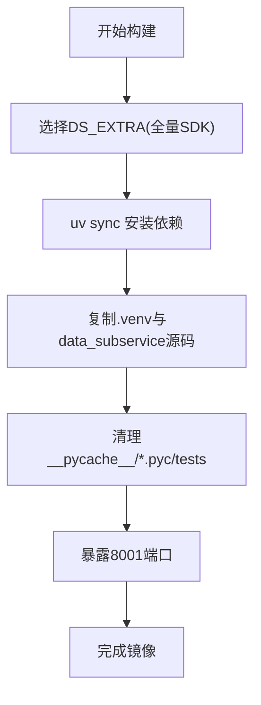
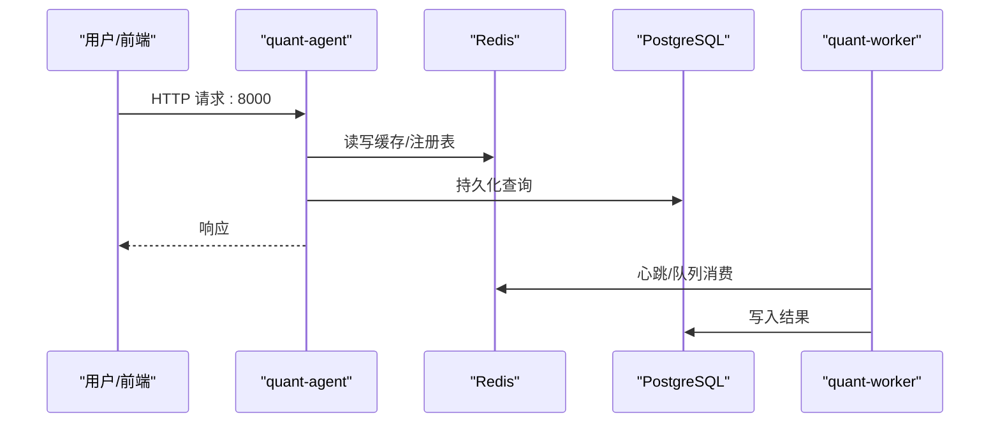
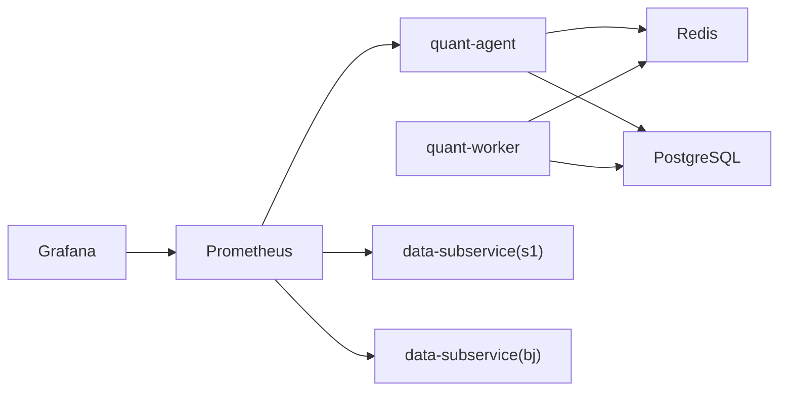

# 容器化部署

<cite>
**本文引用的文件**
- [Dockerfile](file://Dockerfile)
- [data_subservice/Dockerfile](file://data_subservice/Dockerfile)
- [frontend/Dockerfile](file://frontend/Dockerfile)
- [docker-compose.master.yml](file://docker-compose.master.yml)
- [docker-compose.node-s1.yml](file://docker-compose.node-s1.yml)
- [docker-compose.node-bj.yml](file://docker-compose.node-bj.yml)
- [prometheus.yml](file://prometheus.yml)
- [registry-config.yml](file://registry-config.yml)
- [scripts/deploy/init_slave.sh](file://scripts/deploy/init_slave.sh)
- [scripts/deploy/quant-worker.service](file://scripts/deploy/quant-worker.service)
- [docs/06. 工程化配置与部署方案.md](file://docs/06. 工程化配置与部署方案.md)
- [DEPLOYMENT_CHECKLIST.md](file://DEPLOYMENT_CHECKLIST.md)
</cite>

## 目录
1. [简介](#简介)
2. [项目结构](#项目结构)
3. [核心组件](#核心组件)
4. [架构总览](#架构总览)
5. [详细组件分析](#详细组件分析)
6. [依赖关系分析](#依赖关系分析)
7. [性能与资源限制](#性能与资源限制)
8. [启动顺序与依赖管理](#启动顺序与依赖管理)
9. [日志、监控与调试](#日志监控与调试)
10. [部署命令与故障排查](#部署命令与故障排查)
11. [结论](#结论)

## 简介
本文件面向 Quant Agent 系统的容器化部署，覆盖镜像构建（多阶段构建、镜像优化）、编排配置（服务定义、网络、数据卷）、主从节点差异化部署、资源限制与性能调优、启动顺序与健康检查、日志收集与监控集成、以及常见问题的定位与修复。文档基于仓库中的 Dockerfile、Compose 编排、Prometheus 抓取配置、私有 Registry 配置及部署脚本进行说明。

## 项目结构
Quant Agent 的容器化由三类镜像组成：
- 后端主镜像：承载 FastAPI 应用与 Worker，使用 Python 多阶段构建并瘦身。
- 数据子服务镜像：分布式数据源提供者，按 DS_CAPABILITIES 声明能力，独立运行在远程节点。
- 前端静态镜像：Node.js 构建 + Nginx 托管，已独立通过 Cloudflare Pages 发布，但仓库仍保留本地构建产物。

图表来源
- [Dockerfile:1-60](file://Dockerfile#L1-L60)
- [data_subservice/Dockerfile:1-72](file://data_subservice/Dockerfile#L1-L72)
- [frontend/Dockerfile:1-22](file://frontend/Dockerfile#L1-L22)
- [docker-compose.master.yml:16-165](file://docker-compose.master.yml#L16-L165)
- [docker-compose.node-s1.yml:28-143](file://docker-compose.node-s1.yml#L28-L143)
- [docker-compose.node-bj.yml:19-70](file://docker-compose.node-bj.yml#L19-L70)

章节来源
- [Dockerfile:1-60](file://Dockerfile#L1-L60)
- [data_subservice/Dockerfile:1-72](file://data_subservice/Dockerfile#L1-L72)
- [frontend/Dockerfile:1-22](file://frontend/Dockerfile#L1-L22)
- [docker-compose.master.yml:16-165](file://docker-compose.master.yml#L16-L165)
- [docker-compose.node-s1.yml:28-143](file://docker-compose.node-s1.yml#L28-L143)
- [docker-compose.node-bj.yml:19-70](file://docker-compose.node-bj.yml#L19-L70)

## 核心组件
- 后端主镜像（Python 3.11-slim）
  - 多阶段构建：第一阶段安装 uv 与依赖，第二阶段仅复制 .venv 与运行时源码，剔除构建工具与测试代码，显著缩小镜像体积。
  - 运行时暴露端口 8000，默认以 uvicorn 启动，生产参数包含并发与请求上限控制。
- 数据子服务镜像
  - 支持通过构建参数启用全量数据源 SDK，运行时通过 DS_CAPABILITIES 隔离能力；清理 pycache 与构建残留进一步瘦身。
  - 暴露 8001 端口，提供健康检查与指标端点。
- 前端镜像
  - Node.js 构建阶段加大内存限制避免 OOM，最终产物由 Nginx 托管。

章节来源
- [Dockerfile:6-59](file://Dockerfile#L6-L59)
- [data_subservice/Dockerfile:10-71](file://data_subservice/Dockerfile#L10-L71)
- [frontend/Dockerfile:1-22](file://frontend/Dockerfile#L1-L22)

## 架构总览
主节点（Master）承载业务 API、后台任务、缓存与数据库，并提供私有镜像中转 Registry；从节点（Node）作为数据源提供者，仅运行 data-subservice，通过 Tailscale 内网与主节点通信。

图表来源
- [docker-compose.master.yml:16-251](file://docker-compose.master.yml#L16-L251)
- [docker-compose.node-s1.yml:28-143](file://docker-compose.node-s1.yml#L28-L143)
- [docker-compose.node-bj.yml:19-70](file://docker-compose.node-bj.yml#L19-L70)
- [prometheus.yml:16-43](file://prometheus.yml#L16-L43)

章节来源
- [docker-compose.master.yml:16-251](file://docker-compose.master.yml#L16-L251)
- [docker-compose.node-s1.yml:28-143](file://docker-compose.node-s1.yml#L28-L143)
- [docker-compose.node-bj.yml:19-70](file://docker-compose.node-bj.yml#L19-L70)
- [prometheus.yml:16-43](file://prometheus.yml#L16-L43)

## 详细组件分析

### 后端主镜像构建与优化
- 多阶段构建：builder 阶段安装 uv 与依赖；运行阶段仅复制 .venv 与必要系统库，减少攻击面与体积。
- 依赖加速：使用国内 PyPI 镜像与 uv 提升同步速度。
- 运行时最小化：仅安装 libgomp1、libstdc++6 等运行时库，删除包管理器缓存。
- 启动参数：uvicorn 使用 httptools、uvloop，设置 keep-alive、并发与最大请求数，防止内存膨胀。

图表来源
- [Dockerfile:6-59](file://Dockerfile#L6-L59)

章节来源
- [Dockerfile:6-59](file://Dockerfile#L6-L59)

### 数据子服务镜像构建与能力隔离
- 构建参数 DS_EXTRA 控制是否安装全量数据源 SDK；运行时通过 DS_CAPABILITIES 声明可用能力，未声明的能力返回 503。
- 清理 pycache、egg-info、tests 等冗余内容，进一步减小镜像体积。
- 暴露 8001 端口，提供 /health 与 /metrics/circuit 等端点。

图表来源
- [data_subservice/Dockerfile:10-71](file://data_subservice/Dockerfile#L10-L71)

章节来源
- [data_subservice/Dockerfile:10-71](file://data_subservice/Dockerfile#L10-L71)

### 前端镜像构建与托管
- Node.js 构建阶段启用 corepack/pnpm，增大堆内存避免 OOM。
- 产物由 Nginx 托管，暴露 80 端口。

章节来源
- [frontend/Dockerfile:1-22](file://frontend/Dockerfile#L1-L22)

### 主节点编排与服务定义
- 服务清单：redis、postgres、quant-agent、quant-worker、registry、prometheus、grafana。
- 网络：统一 bridge 网络 quant-internal，跨项目共享网络实现主从互通。
- 数据卷：显式 external volume 复用历史数据，避免 orphan 误删。
- 安全：Redis/PG 仅绑定 loopback 与 Tailscale IP，不暴露公网；Registry 仅内网访问。
- 健康检查：各服务均配置 healthcheck，确保依赖就绪后再启动。

图表来源
- [docker-compose.master.yml:16-165](file://docker-compose.master.yml#L16-L165)

章节来源
- [docker-compose.master.yml:16-165](file://docker-compose.master.yml#L16-L165)

### 从节点编排（本地 s1 与远程 bj）
- 本地 s1：与主服务同机部署，监听 127.0.0.1:8001，通过 extra_hosts 将 host.docker.internal 映射到宿主机网关，以便访问宿主 OpenD 与 Redis。
- 远程 bj：仅暴露 Tailscale IP 的 8001 端口，禁止公网暴露；通过 HMAC 鉴权与主节点通信。
- 网络：s1 同时加入 master 项目的 quant-internal 外部网络，使主服务能以服务名直连。

章节来源
- [docker-compose.node-s1.yml:28-143](file://docker-compose.node-s1.yml#L28-L143)
- [docker-compose.node-bj.yml:19-70](file://docker-compose.node-bj.yml#L19-L70)

### 私有镜像中转 Registry
- 仅绑定 loopback 与 Tailscale IP，匿名 push/pull，安全边界由网络层保证。
- 开启 delete 并配合定时 GC 回收空间，避免卷无限增长。

章节来源
- [registry-config.yml:1-22](file://registry-config.yml#L1-L22)
- [docker-compose.master.yml:166-195](file://docker-compose.master.yml#L166-L195)

## 依赖关系分析
- 主节点服务依赖：quant-agent 依赖 redis/postgres 健康；quant-worker 依赖 redis/postgres；monitoring 可选 profile 启动。
- 从节点依赖：data-subservice 通过环境变量连接主节点 Redis（或仅通过 HMAC 回调），不强制依赖 PG。
- 监控依赖：Prometheus 抓取主服务与子服务指标；Grafana 依赖 Prometheus。

图表来源
- [docker-compose.master.yml:76-251](file://docker-compose.master.yml#L76-L251)
- [prometheus.yml:16-43](file://prometheus.yml#L16-L43)

章节来源
- [docker-compose.master.yml:76-251](file://docker-compose.master.yml#L76-L251)
- [prometheus.yml:16-43](file://prometheus.yml#L16-L43)

## 性能与资源限制
- 主节点 quant-agent：限制 CPU 2.0、内存 1.5G，并发 256，每 2000 请求优雅重启释放堆，稳态约 370MB，留足缓冲。
- quant-worker：CPU 1.0、内存 1G，systemd 守护并限制 MemoryMax=1G、CPUQuota=100%。
- Redis/PG：分别限制 512M/1G 内存与相应 CPU，保障基础服务稳定。
- Registry：内存 1G，避免大镜像传输时 OOM。
- 数据子服务：内存 1.5G，按需扩展。

章节来源
- [docker-compose.master.yml:76-165](file://docker-compose.master.yml#L76-L165)
- [docker-compose.master.yml:166-195](file://docker-compose.master.yml#L166-L195)
- [docker-compose.node-s1.yml:123-127](file://docker-compose.node-s1.yml#L123-L127)
- [docker-compose.node-bj.yml:62-66](file://docker-compose.node-bj.yml#L62-L66)
- [scripts/deploy/quant-worker.service:43-46](file://scripts/deploy/quant-worker.service#L43-L46)

## 启动顺序与依赖管理
- 健康检查驱动：compose 中 depends_on 结合 condition: service_healthy，确保依赖就绪。
- 启动顺序建议：
  1) 启动基础设施：Redis、PostgreSQL
  2) 启动主服务：quant-agent、quant-worker
  3) 启动监控（可选）：Prometheus、Grafana
  4) 启动从节点：data-subservice（s1/bj）
- 服务发现：主从通过 Tailscale 内网通信；s1 通过额外网络加入 master 的 quant-internal，实现服务名解析。
- 故障恢复：compose restart 策略 + systemd Watchdog 守护 worker；Registry 提供本地镜像拉取加速。

章节来源
- [docker-compose.master.yml:76-165](file://docker-compose.master.yml#L76-L165)
- [docker-compose.node-s1.yml:116-143](file://docker-compose.node-s1.yml#L116-L143)
- [scripts/deploy/quant-worker.service:30-38](file://scripts/deploy/quant-worker.service#L30-L38)

## 日志、监控与调试
- 指标采集：Prometheus 抓取 fastapi-app 与 data-subservice 指标，路径分别为 /metrics 与 /metrics/circuit。
- 可视化：Grafana 预置 dashboard，通过 provisioning 自动加载。
- 日志：worker 输出至 journal，便于集中查看；容器日志可通过 docker compose logs 查看。
- 调试要点：
  - 确认 Redis/PG 健康检查通过
  - 校验 HMAC 密钥一致与时钟同步（跨节点时间差 > 300s 会导致 403）
  - 检查 Tailscale 连通性与 ACL 策略
  - 验证 Registry 可拉取镜像（必要时配置 insecure-registries）

章节来源
- [prometheus.yml:16-43](file://prometheus.yml#L16-L43)
- [docker-compose.master.yml:197-251](file://docker-compose.master.yml#L197-L251)
- [DEPLOYMENT_CHECKLIST.md:310-347](file://DEPLOYMENT_CHECKLIST.md#L310-L347)

## 部署命令与故障排查

### 常用部署命令
- 主节点（含监控）：
  - docker-compose -f docker-compose.master.yml up -d
  - docker-compose -f docker-compose.master.yml --profile monitoring up -d
- 本地数据子服务（s1）：
  - cd /opt/quant-agent && cp .env.data-node.example .env.data-node
  - docker compose --env-file .env.data-node -f docker-compose.node-s1.yml up -d
- 北京从节点（bj）：
  - cd /opt/quant-agent && cp .env.data-node.example .env.data-node
  - docker compose --env-file .env.data-node -f docker-compose.node-bj.yml up -d
- 从节点一键初始化：
  - bash scripts/deploy/init_slave.sh
  - 如需直接启动：bash scripts/deploy/init_slave.sh --up

章节来源
- [docker-compose.master.yml:1-10](file://docker-compose.master.yml#L1-L10)
- [docker-compose.node-s1.yml:12-23](file://docker-compose.node-s1.yml#L12-L23)
- [docker-compose.node-bj.yml:9-14](file://docker-compose.node-bj.yml#L9-L14)
- [scripts/deploy/init_slave.sh:72-82](file://scripts/deploy/init_slave.sh#L72-L82)

### 常见问题与处理
- 子服务 403（HMAC 校验失败）
  - 检查主从 DATA_SOURCE_HMAC_SECRET 完全一致
  - 检查 .env 末尾换行与变量注入是否正确
  - 校验各节点系统时间差 < 300s
- 子服务镜像拉取慢或被拒
  - 在主节点启动私有 Registry，并在子节点 daemon.json 配置 insecure-registries
  - 通过 .env.data-node 的 DATA_SUB_SERVICE_IMAGE 指向内网 registry
- 前端登录态过期或面板空白
  - 核对 Cloudflare Pages 构建变量 VITE_API_BASE_URL 指向正确 API 域名
- 无法连接宿主 OpenD/Redis
  - s1 需通过 extra_hosts 将 host.docker.internal 映射到宿主机网关
  - 确保 Redis/OpenD 监听地址允许来自 quant-net 网关访问

章节来源
- [DEPLOYMENT_CHECKLIST.md:310-369](file://DEPLOYMENT_CHECKLIST.md#L310-L369)
- [docker-compose.node-s1.yml:70-78](file://docker-compose.node-s1.yml#L70-L78)
- [docker-compose.node-s1.yml:111-117](file://docker-compose.node-s1.yml#L111-L117)

## 结论
Quant Agent 采用“主节点集中业务 + 从节点数据源”的容器化架构，通过多阶段构建与严格资源限制实现高效稳定的运行环境。借助 Tailscale 内网、私有 Registry 与 Prometheus/Grafana 监控体系，实现了跨地域节点的可靠通信与可观测性。遵循本文档的部署步骤与排障指南，可在多节点环境下快速落地并持续演进。