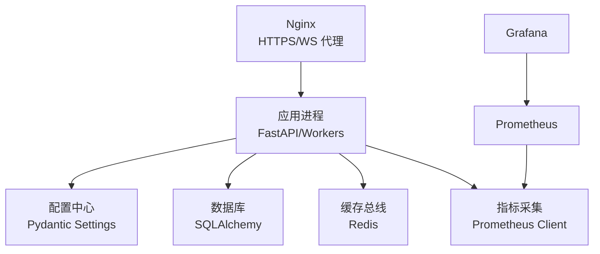
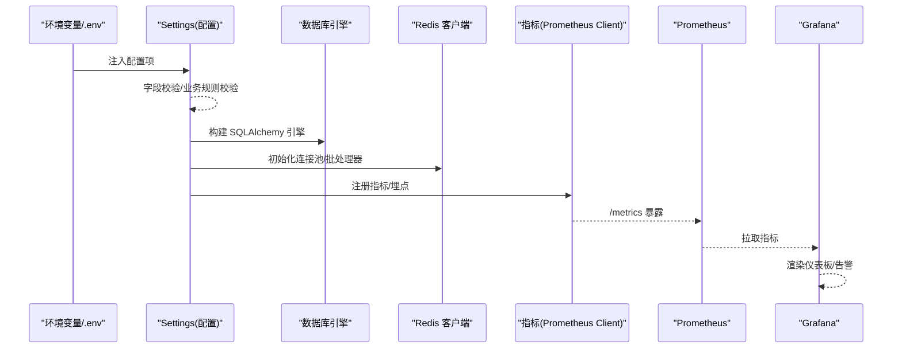
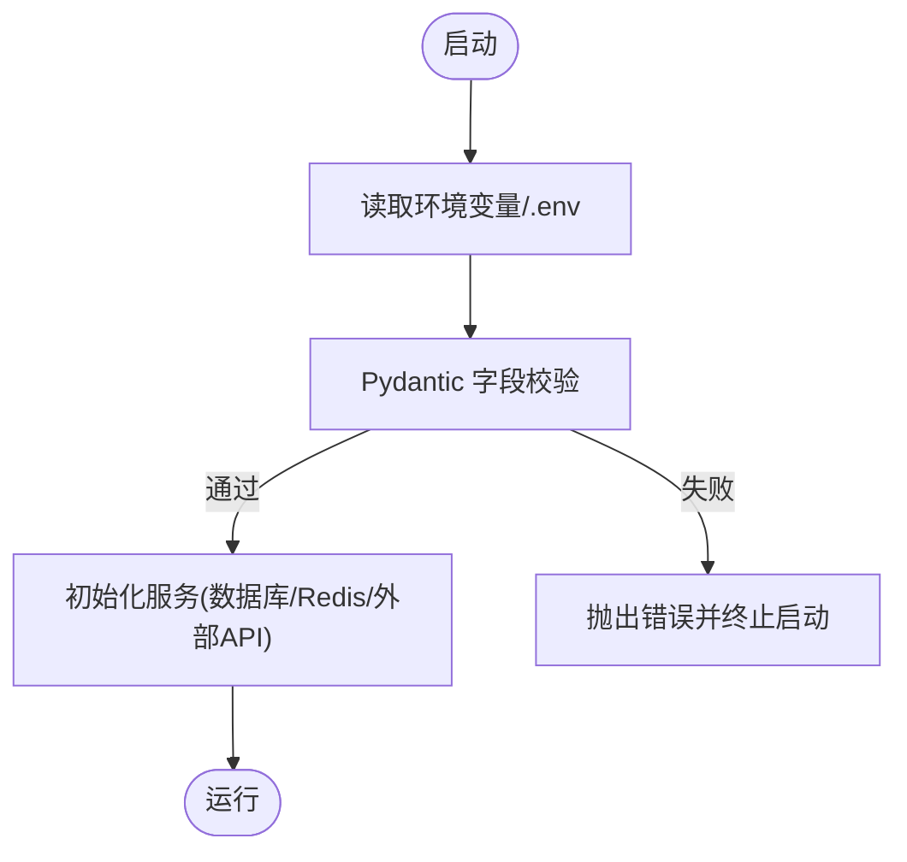
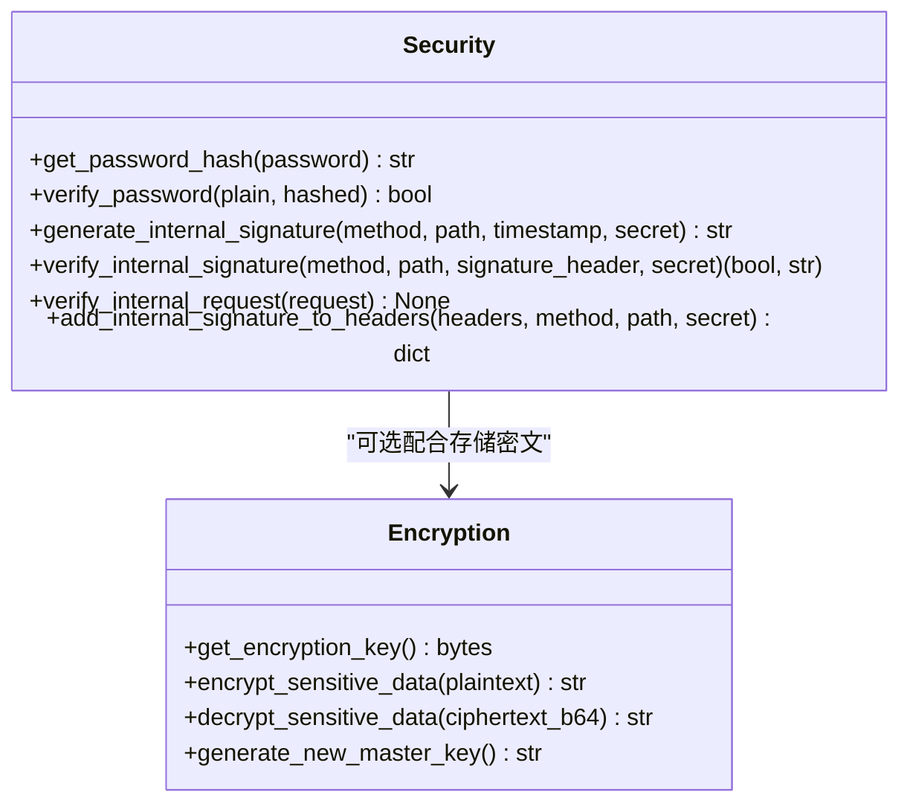
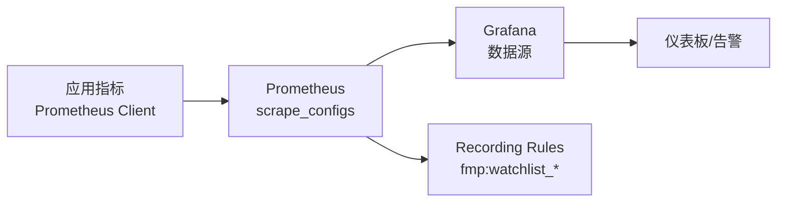
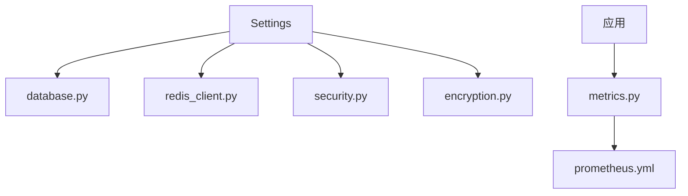

# 环境配置管理

<cite>
**本文引用的文件**
- [backend/core/config.py](file://backend/core/config.py)
- [backend/core/database.py](file://backend/core/database.py)
- [backend/core/redis_client.py](file://backend/core/redis_client.py)
- [backend/core/encryption.py](file://backend/core/encryption.py)
- [backend/core/security.py](file://backend/core/security.py)
- [backend/core/metrics.py](file://backend/core/metrics.py)
- [prometheus.yml](file://prometheus.yml)
- [config/prometheus_rules.yml](file://config/prometheus_rules.yml)
- [grafana/provisioning/datasources/prometheus.yml](file://grafana/provisioning/datasources/prometheus.yml)
- [quant.conf](file://quant.conf)
- [scripts/verify_redis.py](file://scripts/verify_redis.py)
- [scripts/probe_backend_health.py](file://scripts/probe_backend_health.py)
- [backend/tests/test_config.py](file://backend/tests/test_config.py)
</cite>

## 目录
1. [简介](#简介)
2. [项目结构](#项目结构)
3. [核心组件](#核心组件)
4. [架构总览](#架构总览)
5. [详细组件分析](#详细组件分析)
6. [依赖关系分析](#依赖关系分析)
7. [性能考量](#性能考量)
8. [故障排查指南](#故障排查指南)
9. [结论](#结论)
10. [附录](#附录)

## 简介
本文件面向 Quant Agent 系统的环境配置管理，覆盖环境变量与配置文件策略、密钥与安全、监控与告警、配置验证与测试方法，以及常见问题诊断。目标是帮助运维与研发在不同环境中快速、安全地部署和调优系统。

## 项目结构
Quant Agent 的配置体系围绕“集中式配置模型 + 多来源注入 + 运行时校验”展开：
- 统一配置模型：使用 Pydantic Settings 定义全局配置项，强制必填字段与类型校验，支持 .env 与环境变量注入。
- 数据库连接：通过环境变量构建 SQLAlchemy 同步/异步引擎，支持 SQLite 与 PostgreSQL/MySQL，并暴露连接池参数。
- Redis 缓存：集中初始化连接池与批量写入器，提供 L1 内存缓存与 L2 Redis 双层缓存。
- 安全与加密：内部通信 HMAC 签名、密码哈希；敏感数据 AES-256-GCM 透明加解密。
- 监控与告警：Prometheus 指标定义与抓取配置，Grafana 数据源与仪表盘预置，可选 Recording Rules。
- 反向代理：Nginx 配置 HTTPS、WebSocket 透传与超时优化。
- 验证与测试：配置单元测试、Redis 连通性脚本、后端健康探针。

图表来源
- [backend/core/config.py:20-134](file://backend/core/config.py#L20-L134)
- [backend/core/database.py:1-67](file://backend/core/database.py#L1-L67)
- [backend/core/redis_client.py:1-252](file://backend/core/redis_client.py#L1-L252)
- [backend/core/metrics.py:1-641](file://backend/core/metrics.py#L1-L641)
- [prometheus.yml:1-43](file://prometheus.yml#L1-L43)
- [grafana/provisioning/datasources/prometheus.yml:1-10](file://grafana/provisioning/datasources/prometheus.yml#L1-L10)
- [quant.conf:1-81](file://quant.conf#L1-L81)

章节来源
- [backend/core/config.py:20-134](file://backend/core/config.py#L20-L134)
- [backend/core/database.py:1-67](file://backend/core/database.py#L1-L67)
- [backend/core/redis_client.py:1-252](file://backend/core/redis_client.py#L1-L252)
- [backend/core/metrics.py:1-641](file://backend/core/metrics.py#L1-L641)
- [prometheus.yml:1-43](file://prometheus.yml#L1-L43)
- [grafana/provisioning/datasources/prometheus.yml:1-10](file://grafana/provisioning/datasources/prometheus.yml#L1-L10)
- [quant.conf:1-81](file://quant.conf#L1-L81)

## 核心组件
- 配置模型（Settings）：集中声明所有环境变量与默认值，包含数据库、Redis、LLM、数据源 API Key、Futu OpenD、告警通道、内部通信密钥、加密主密钥等。提供必填校验与业务规则校验（如实盘交易需 Futu 解锁密码）。
- 数据库连接：根据 DATABASE_URL 自动选择 SQLite 或 PG/MySQL，并暴露 DB_POOL_SIZE、DB_MAX_OVERFLOW、DB_POOL_TIMEOUT 等连接池参数。
- Redis 客户端：统一连接池、最大连接数、批量写入队列、L1 本地缓存，避免高频写放大与网络抖动。
- 安全模块：HMAC-SHA256 内部请求签名与验签、bcrypt 密码哈希、可配置的 BCRYPT_ROUNDS。
- 加密工具：AES-256-GCM 透明加解密，支持十六进制/Base64 主密钥，提供生成新密钥工具。
- 指标与监控：丰富的 Prometheus 指标（行情延迟、WebSocket、熔断、数据源可用性、Agent/LLM、分布式节点、数据质量等），Prometheus 抓取配置与 Grafana 数据源。
- Nginx 反向代理：HTTPS 强制跳转、WebSocket Upgrade 透传、长连接超时与缓冲关闭。

章节来源
- [backend/core/config.py:20-134](file://backend/core/config.py#L20-L134)
- [backend/core/database.py:1-67](file://backend/core/database.py#L1-L67)
- [backend/core/redis_client.py:1-252](file://backend/core/redis_client.py#L1-L252)
- [backend/core/security.py:1-160](file://backend/core/security.py#L1-L160)
- [backend/core/encryption.py:1-210](file://backend/core/encryption.py#L1-L210)
- [backend/core/metrics.py:1-641](file://backend/core/metrics.py#L1-L641)
- [prometheus.yml:1-43](file://prometheus.yml#L1-L43)
- [grafana/provisioning/datasources/prometheus.yml:1-10](file://grafana/provisioning/datasources/prometheus.yml#L1-L10)
- [quant.conf:1-81](file://quant.conf#L1-L81)

## 架构总览
下图展示配置加载到服务运行的关键路径：环境变量/配置文件 → Settings 校验 → 数据库/Redis/外部服务初始化 → 指标上报 → 被 Prometheus/Grafana 观测。

图表来源
- [backend/core/config.py:20-134](file://backend/core/config.py#L20-L134)
- [backend/core/database.py:1-67](file://backend/core/database.py#L1-L67)
- [backend/core/redis_client.py:1-252](file://backend/core/redis_client.py#L1-L252)
- [backend/core/metrics.py:1-641](file://backend/core/metrics.py#L1-L641)
- [prometheus.yml:1-43](file://prometheus.yml#L1-L43)
- [grafana/provisioning/datasources/prometheus.yml:1-10](file://grafana/provisioning/datasources/prometheus.yml#L1-L10)

## 详细组件分析

### 配置模型与优先级
- 配置来源优先级（从高到低）：
  - 操作系统环境变量（最高）
  - .env 文件（由 Settings 模型配置加载）
  - 代码默认值（最低）
- 必填字段与校验：
  - 数据库 URL 必须非空且以 sqlite:// 或 postgresql:// 开头
  - Embedding API Key 必须配置
  - 开启实盘交易时必须配置 Futu 解锁密码
- 环境标识：
  - quant_env 枚举：development、production、testing
  - is_production/is_development 便捷属性

图表来源
- [backend/core/config.py:20-134](file://backend/core/config.py#L20-L134)

章节来源
- [backend/core/config.py:20-134](file://backend/core/config.py#L20-L134)
- [backend/tests/test_config.py:1-126](file://backend/tests/test_config.py#L1-L126)

### 数据库连接配置
- 连接字符串：DATABASE_URL（sqlite/postgresql/mysql）
- 连接池参数（PG/MySQL）：DB_POOL_SIZE、DB_MAX_OVERFLOW、DB_POOL_TIMEOUT
- 异步引擎：自动将驱动切换为 aiosqlite/asyncpg，复用相同池化参数
- 建议：
  - 生产环境使用 PostgreSQL 并设置合理的池大小与回收时间
  - 高并发场景启用异步会话

章节来源
- [backend/core/database.py:1-67](file://backend/core/database.py#L1-L67)

### Redis 配置与缓存策略
- 连接参数：REDIS_HOST、REDIS_PORT、REDIS_PASSWORD、REDIS_MAX_CONNECTIONS
- 批量写入：RedisAsyncBatchWriter，聚合 set 操作并通过 Pipeline 提交，降低 RTT
- L1/L2 缓存：LocalL1Cache 进程内短效缓存（默认 TTL 10s，容量上限可配），未命中穿透至 Redis
- 建议：
  - 合理设置 REDIS_MAX_CONNECTIONS，防止连接耗尽
  - 对极高频读（如开关、字典）优先走 L1 缓存

章节来源
- [backend/core/redis_client.py:1-252](file://backend/core/redis_client.py#L1-L252)

### 第三方服务与 API 密钥
- LLM：LLM_API_KEY、LLM_BASE_URL、LLM_MODEL、LLM_PRO_MODEL、LLM_LIGHTWEIGHT_MODEL、LLM_OLLAMA_BASE_URL、LLM_FALLBACK_ENABLED、LLM_FALLBACK_THRESHOLD
- Embedding：EMBEDDING_API_KEY、EMBEDDING_BASE_URL、EMBEDDING_MODEL、EMBEDDING_DIM
- 数据源：FINNHUB_API_KEY、AKSHARE_API_KEY、FRED_API_KEY、EM_SOURCE_PRIORITY
- Futu OpenD：FUTU_HOST、FUTU_PORT、FUTU_TRD_ENV、FUTU_PWD_UNLOCK
- 告警通道：TELEGRAM_BOT_TOKEN、TELEGRAM_CHAT_ID、SERVERCHAN_SENDKEY、FEISHU_WEBHOOK_URL
- Meilisearch：MEILISEARCH_HOST、MEILISEARCH_API_KEY

章节来源
- [backend/core/config.py:20-134](file://backend/core/config.py#L20-L134)

### 密钥管理与安全配置
- 内部通信安全：
  - INTERNAL_API_SECRET 用于 HMAC-SHA256 签名生成与验证
  - 提供 FastAPI 依赖 verify_internal_request，拒绝无签名或过期签名
  - 密码哈希：bcrypt，BCRYPT_ROUNDS 可调
- 敏感数据加密：
  - ENCRYPTION_MASTER_KEY 支持十六进制或 Base64，长度≥32 字节
  - encrypt_sensitive_data/decrypt_sensitive_data 实现 AES-256-GCM 透明加解密
  - 开发环境未配置时生成临时密钥并警告（仅开发用）
- 权限与审计：
  - 内部接口需携带 X-Internal-Sig 头
  - 结合审计中间件与日志记录访问行为（审计逻辑在其它模块中集成）

图表来源
- [backend/core/security.py:1-160](file://backend/core/security.py#L1-L160)
- [backend/core/encryption.py:1-210](file://backend/core/encryption.py#L1-L210)

章节来源
- [backend/core/security.py:1-160](file://backend/core/security.py#L1-L160)
- [backend/core/encryption.py:1-210](file://backend/core/encryption.py#L1-L210)

### 监控与告警配置
- Prometheus 抓取：
  - fastapi-app：每 5s 抓取 /metrics
  - data-subservice：/metrics/circuit 与 /metrics 两个 job，覆盖子服务熔断与业务指标
- Grafana 数据源：
  - 预置 Prometheus 数据源，默认地址 http://prometheus:9090
- Recording Rules（可选）：
  - config/prometheus_rules.yml 提供 FMP watchlist 突变检测的预计算规则，用于多副本场景下去重与聚合
- 指标分类（示例）：
  - 行情延迟、WebSocket 连接数、Redis 队列深度、熔断状态、数据源可用性、Agent/LLM 指标、分布式节点心跳、数据质量指标等

图表来源
- [backend/core/metrics.py:1-641](file://backend/core/metrics.py#L1-L641)
- [prometheus.yml:1-43](file://prometheus.yml#L1-L43)
- [config/prometheus_rules.yml:1-95](file://config/prometheus_rules.yml#L1-L95)
- [grafana/provisioning/datasources/prometheus.yml:1-10](file://grafana/provisioning/datasources/prometheus.yml#L1-L10)

章节来源
- [backend/core/metrics.py:1-641](file://backend/core/metrics.py#L1-L641)
- [prometheus.yml:1-43](file://prometheus.yml#L1-L43)
- [config/prometheus_rules.yml:1-95](file://config/prometheus_rules.yml#L1-L95)
- [grafana/provisioning/datasources/prometheus.yml:1-10](file://grafana/provisioning/datasources/prometheus.yml#L1-L10)

### 反向代理与 WebSocket 配置
- Nginx 配置要点：
  - 强制 HTTP→HTTPS 跳转
  - /api/ 与 /ws/ 均透传 Upgrade/Connection 头
  - 长连接超时设置为 3600s，关闭缓冲以降低延迟
- 适用场景：
  - 前端 SPA 静态资源与 API 统一入口
  - 实时行情 WebSocket 低延迟推送

章节来源
- [quant.conf:1-81](file://quant.conf#L1-L81)

## 依赖关系分析
- 配置依赖：
  - Settings 是全局单例，被 database、redis_client、security、encryption 等模块引用
- 运行时依赖：
  - 数据库与 Redis 必须在启动前可用，否则连接失败
  - 外部 API Key 缺失会导致对应功能降级或报错
- 监控依赖：
  - Prometheus 需能访问 /metrics；Grafana 需能访问 Prometheus
  - Recording Rules 仅在启用 rule_files 后生效

图表来源
- [backend/core/config.py:20-134](file://backend/core/config.py#L20-L134)
- [backend/core/database.py:1-67](file://backend/core/database.py#L1-L67)
- [backend/core/redis_client.py:1-252](file://backend/core/redis_client.py#L1-L252)
- [backend/core/security.py:1-160](file://backend/core/security.py#L1-L160)
- [backend/core/encryption.py:1-210](file://backend/core/encryption.py#L1-L210)
- [backend/core/metrics.py:1-641](file://backend/core/metrics.py#L1-L641)
- [prometheus.yml:1-43](file://prometheus.yml#L1-L43)

章节来源
- [backend/core/config.py:20-134](file://backend/core/config.py#L20-L134)
- [backend/core/database.py:1-67](file://backend/core/database.py#L1-L67)
- [backend/core/redis_client.py:1-252](file://backend/core/redis_client.py#L1-L252)
- [backend/core/security.py:1-160](file://backend/core/security.py#L1-L160)
- [backend/core/encryption.py:1-210](file://backend/core/encryption.py#L1-L210)
- [backend/core/metrics.py:1-641](file://backend/core/metrics.py#L1-L641)
- [prometheus.yml:1-43](file://prometheus.yml#L1-L43)

## 性能考量
- 数据库连接池：
  - 根据负载调整 DB_POOL_SIZE、DB_MAX_OVERFLOW、DB_POOL_TIMEOUT
  - 使用异步引擎减少阻塞
- Redis 批处理与缓存：
  - 使用 RedisAsyncBatchWriter 聚合写操作，降低网络开销
  - LocalL1Cache 保护热点键，避免频繁网络往返
- WebSocket 长连接：
  - Nginx 关闭缓冲、延长超时，确保行情 Tick 低延迟
- 指标采样：
  - 针对高频指标使用 Summary/Histogram，合理分桶与标签维度

[本节为通用指导，不直接分析具体文件]

## 故障排查指南
- 配置校验失败：
  - 检查 DATABASE_URL、EMBEDDING_API_KEY 是否配置正确
  - 开启实盘交易时需配置 FUTU_PWD_UNLOCK
- 数据库连接问题：
  - 确认 DATABASE_URL 协议与凭据
  - 检查连接池参数是否合理
- Redis 连通性与数据流：
  - 使用 scripts/verify_redis.py 进行连通性与快照/流式消息验证
- 后端健康与冒烟测试：
  - 使用 scripts/probe_backend_health.py 执行 CI 探针，输出 JSON 便于自动化
- 监控不可用：
  - 检查 prometheus.yml 抓取目标与端口
  - 确认 Grafana 数据源指向 Prometheus 可达地址
- 常见错误定位：
  - 鉴权失败：检查 INTERNAL_API_SECRET 与 X-Internal-Sig 头
  - 加密失败：确认 ENCRYPTION_MASTER_KEY 长度与编码格式

章节来源
- [backend/core/config.py:20-134](file://backend/core/config.py#L20-L134)
- [backend/core/database.py:1-67](file://backend/core/database.py#L1-L67)
- [backend/core/redis_client.py:1-252](file://backend/core/redis_client.py#L1-L252)
- [backend/core/security.py:1-160](file://backend/core/security.py#L1-L160)
- [backend/core/encryption.py:1-210](file://backend/core/encryption.py#L1-L210)
- [scripts/verify_redis.py:1-88](file://scripts/verify_redis.py#L1-L88)
- [scripts/probe_backend_health.py:1-184](file://scripts/probe_backend_health.py#L1-L184)
- [prometheus.yml:1-43](file://prometheus.yml#L1-L43)
- [grafana/provisioning/datasources/prometheus.yml:1-10](file://grafana/provisioning/datasources/prometheus.yml#L1-L10)

## 结论
Quant Agent 采用集中式配置模型与严格的运行时校验，确保不同环境的稳定启动与一致行为。通过 Redis 双层缓存与批量写入提升吞吐，借助 Prometheus/Grafana 实现全链路可观测性，并以 HMAC 与 AES-GCM 保障内部通信与敏感数据安全。配合 Nginx 的 WebSocket 优化与完善的验证脚本，可在生产环境中获得高可靠与高性能的运行体验。

## 附录
- 环境变量清单（部分）
  - 数据库：DATABASE_URL、DB_USER、DB_PASSWORD、DB_NAME、DB_POOL_SIZE、DB_MAX_OVERFLOW、DB_POOL_TIMEOUT
  - Redis：REDIS_HOST、REDIS_PORT、REDIS_PASSWORD、REDIS_MAX_CONNECTIONS、L1_CACHE_MAX_SIZE
  - LLM：LLM_API_KEY、LLM_BASE_URL、LLM_MODEL、LLM_PRO_MODEL、LLM_LIGHTWEIGHT_MODEL、LLM_OLLAMA_BASE_URL、LLM_FALLBACK_ENABLED、LLM_FALLBACK_THRESHOLD
  - Embedding：EMBEDDING_API_KEY、EMBEDDING_BASE_URL、EMBEDDING_MODEL、EMBEDDING_DIM
  - 数据源：FINNHUB_API_KEY、AKSHARE_API_KEY、FRED_API_KEY、EM_SOURCE_PRIORITY
  - Futu：FUTU_HOST、FUTU_PORT、FUTU_TRD_ENV、FUTU_PWD_UNLOCK
  - 告警：TELEGRAM_BOT_TOKEN、TELEGRAM_CHAT_ID、SERVERCHAN_SENDKEY、FEISHU_WEBHOOK_URL
  - 安全：INTERNAL_API_SECRET、ENCRYPTION_MASTER_KEY、BCRYPT_ROUNDS
  - 搜索：MEILISEARCH_HOST、MEILISEARCH_API_KEY
- 推荐实践
  - 生产环境禁用明文密钥，使用 KMS/Vault 管理主密钥
  - 严格区分开发/测试/生产环境变量，禁止跨环境复用
  - 定期轮换 INTERNAL_API_SECRET 与 ENCRYPTION_MASTER_KEY
  - 基于 Recording Rules 在多副本场景统一聚合指标，避免计数放大
  - 使用探针脚本在部署后自动验证关键端点与健康基线

[本节为补充信息，不直接分析具体文件]
