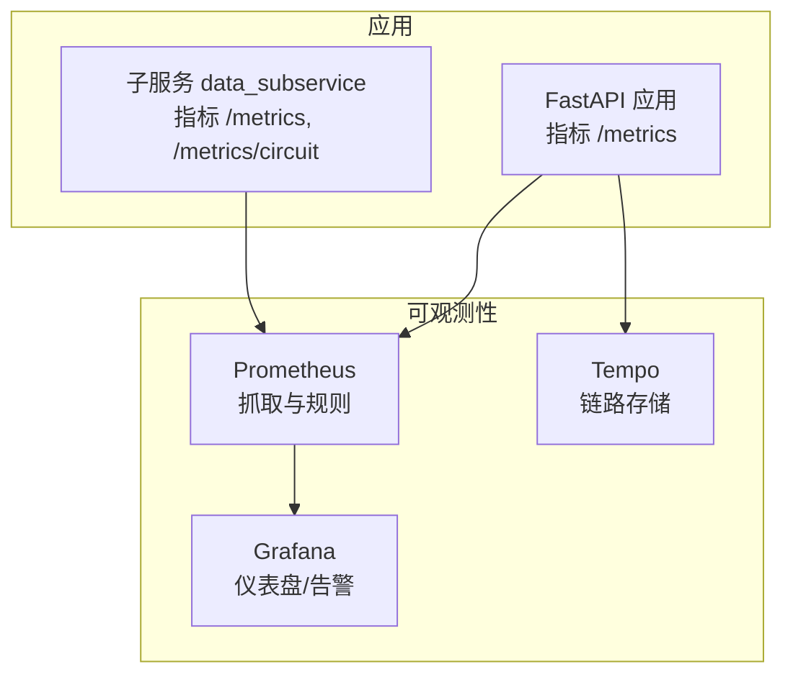
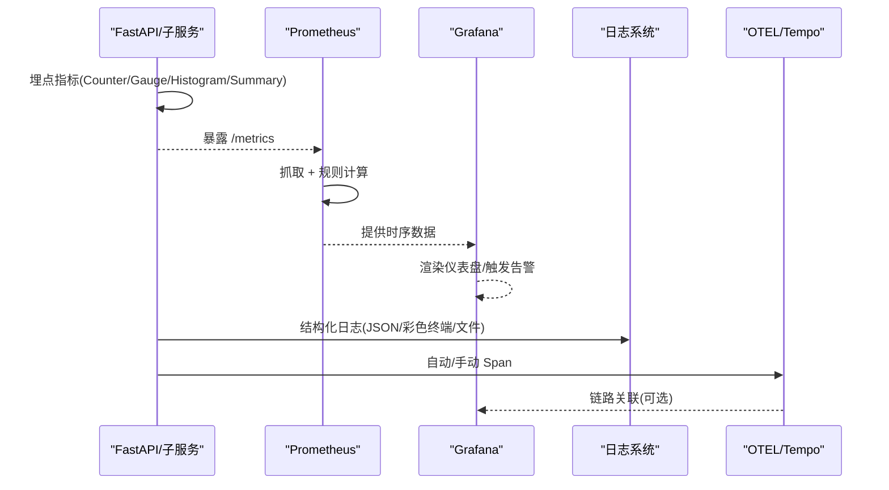
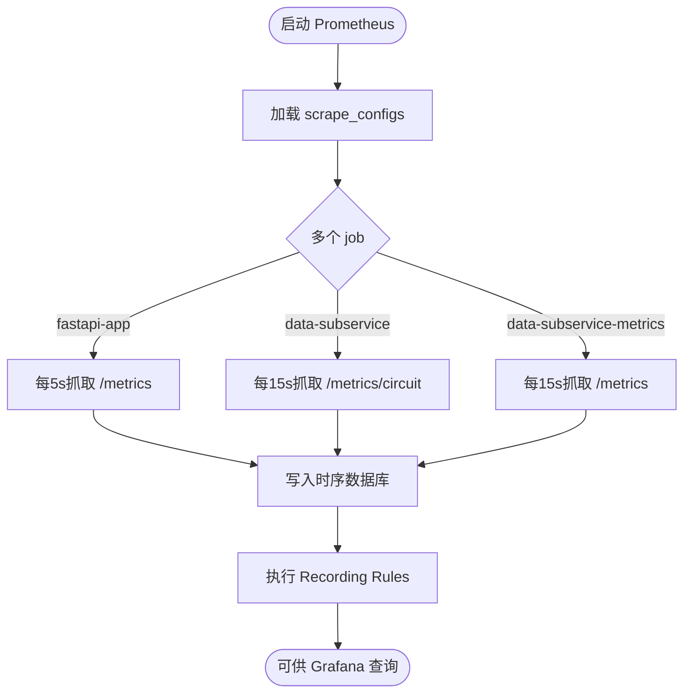
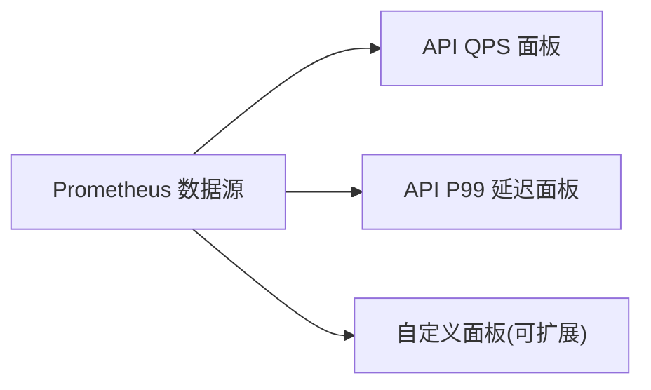
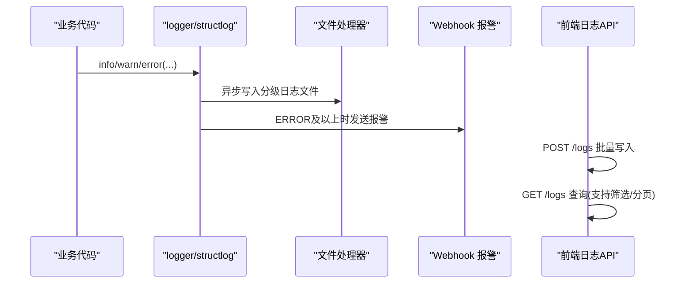
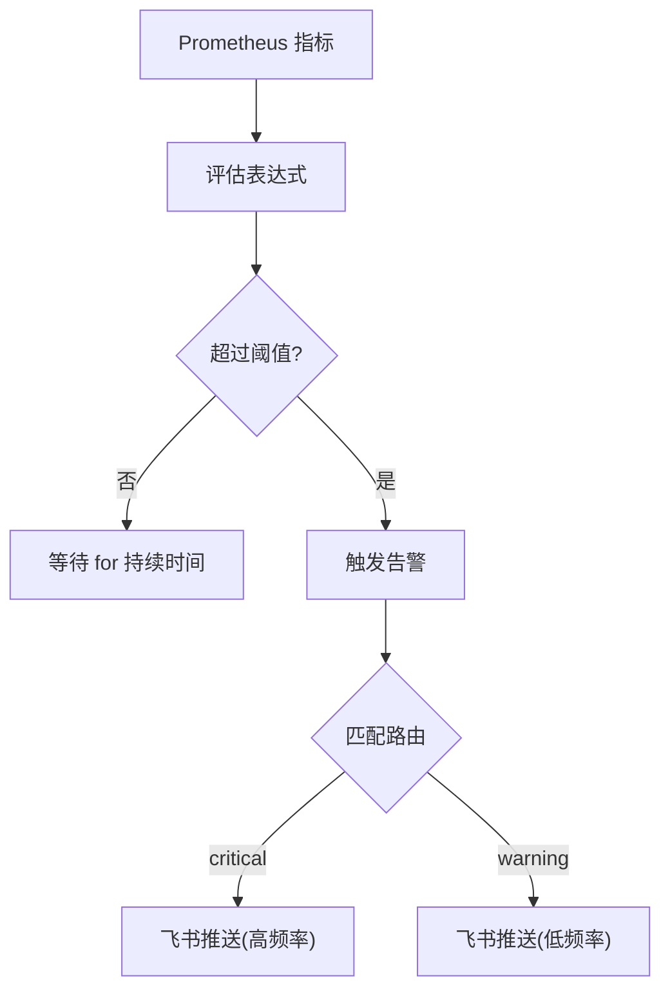
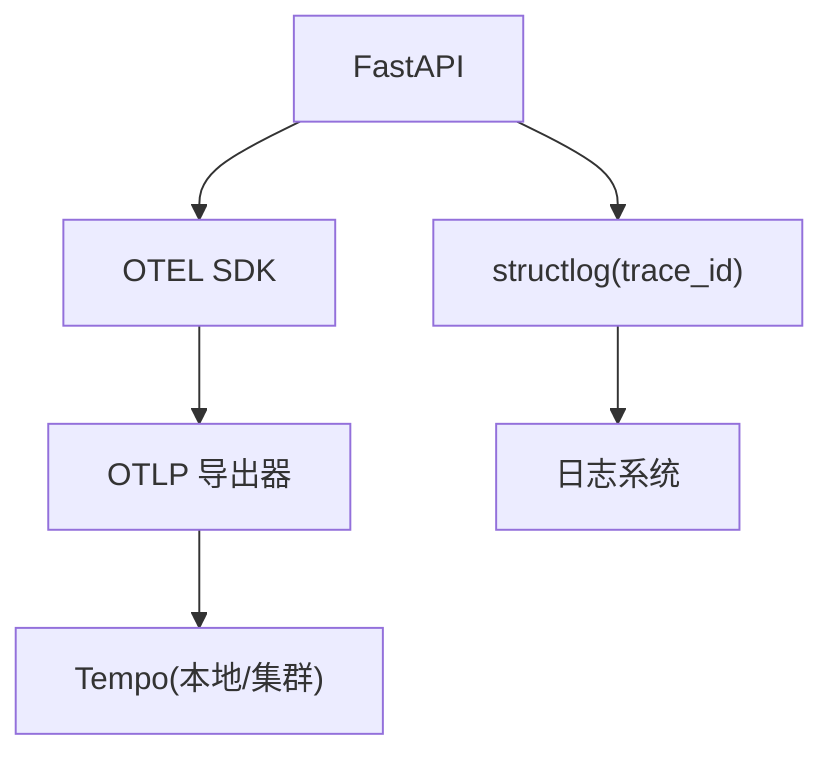
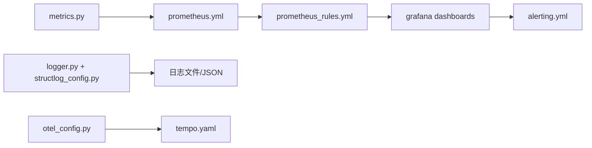

# 监控与日志

<cite>
**本文引用的文件**
- [backend/core/metrics.py](file://backend/core/metrics.py)
- [backend/core/logger.py](file://backend/core/logger.py)
- [backend/core/structlog_config.py](file://backend/core/structlog_config.py)
- [backend/core/otel_config.py](file://backend/core/otel_config.py)
- [prometheus.yml](file://prometheus.yml)
- [config/prometheus_rules.yml](file://config/prometheus_rules.yml)
- [grafana/provisioning/datasources/prometheus.yml](file://grafana/provisioning/datasources/prometheus.yml)
- [grafana/provisioning/alerting/alerting.yml](file://grafana/provisioning/alerting/alerting.yml)
- [grafana/provisioning/dashboards/quant-agent-dashboard.json](file://grafana/provisioning/dashboards/quant-agent-dashboard.json)
- [tempo/tempo.yaml](file://tempo/tempo.yaml)
- [backend/routers/logs.py](file://backend/routers/logs.py)
</cite>

## 目录
1. [简介](#简介)
2. [项目结构](#项目结构)
3. [核心组件](#核心组件)
4. [架构总览](#架构总览)
5. [详细组件分析](#详细组件分析)
6. [依赖关系分析](#依赖关系分析)
7. [性能考量](#性能考量)
8. [故障排查指南](#故障排查指南)
9. [结论](#结论)
10. [附录](#附录)

## 简介
本文件面向 Quant Agent 系统的“监控与日志”能力，覆盖指标采集、时序存储、可视化展示、告警机制、日志收集与分析、以及可观测性（追踪）集成。目标是帮助读者快速理解系统如何采集关键业务指标（交易、性能、资源）、如何结构化记录日志并聚合检索、如何配置告警阈值与通知渠道、以及如何扩展仪表板与自定义图表。

## 项目结构
Quant Agent 的监控与日志由以下部分构成：
- 指标定义与埋点：后端通过 Prometheus 客户端暴露指标端点，涵盖行情、WebSocket、Redis、熔断器、数据源、Agent/LLM、Futu 连接、K线缓存、数据质量、分布式节点等。
- 指标抓取与规则：Prometheus 按 job 抓取主服务与子服务指标，并提供 Recording Rules 进行预计算与聚合。
- 可视化与告警：Grafana 通过 Provisioning 自动注入数据源、仪表盘与告警规则，支持飞书 Webhook 通知。
- 日志体系：标准 logging + Rich 终端输出 + 分级落盘；structlog 提供结构化 JSON 输出；可选 OTEL 链路追踪导出到 Tempo。
- 前端日志：提供 API 接收前端日志并持久化到数据库，支持查询与筛选。

**图示来源**
- [prometheus.yml:16-43](file://prometheus.yml#L16-L43)
- [grafana/provisioning/datasources/prometheus.yml:1-10](file://grafana/provisioning/datasources/prometheus.yml#L1-L10)
- [tempo/tempo.yaml:1-25](file://tempo/tempo.yaml#L1-L25)

**章节来源**
- [prometheus.yml:1-43](file://prometheus.yml#L1-L43)
- [grafana/provisioning/datasources/prometheus.yml:1-10](file://grafana/provisioning/datasources/prometheus.yml#L1-L10)
- [tempo/tempo.yaml:1-25](file://tempo/tempo.yaml#L1-L25)

## 核心组件
- 指标层：集中定义于 metrics 模块，覆盖行情延迟、WebSocket 连接、Redis 队列深度、熔断器状态、数据源延迟/错误/限流/可用性、主动拨测、Facade 融合、Agent/LLM、Futu 连接、K线缓存命中、数据质量、分布式节点心跳与存活、WebScrape 抓取成功率等。
- 采集层：Prometheus 以不同 job 周期抓取 FastAPI 与子服务指标，支持 basic_auth 与多目标。
- 规则层：Recording Rules 用于 watchlist 突变检测、比率计算与统一聚合，降低 exporter 耦合度。
- 可视化层：Grafana 通过 provisioning 注入 Prometheus 数据源、内置仪表盘与告警策略。
- 日志层：结构化日志（JSON）+ 彩色终端 + 分级文件轮转 + 严重错误 Webhook 报警；可选 structlog 增强上下文字段（trace_id、symbol、latency_ms）。
- 追踪层：OpenTelemetry 自动埋点 FastAPI/Redis/HTTP/SQLAlchemy，支持 OTLP 导出到 Tempo。
- 前端日志：REST API 接收前端批量日志并入库，支持分页与时间范围查询。

**章节来源**
- [backend/core/metrics.py:1-641](file://backend/core/metrics.py#L1-L641)
- [prometheus.yml:16-43](file://prometheus.yml#L16-L43)
- [config/prometheus_rules.yml:1-95](file://config/prometheus_rules.yml#L1-L95)
- [grafana/provisioning/alerting/alerting.yml:1-463](file://grafana/provisioning/alerting/alerting.yml#L1-L463)
- [backend/core/logger.py:1-212](file://backend/core/logger.py#L1-L212)
- [backend/core/structlog_config.py:1-225](file://backend/core/structlog_config.py#L1-L225)
- [backend/core/otel_config.py:1-314](file://backend/core/otel_config.py#L1-L314)
- [backend/routers/logs.py:1-183](file://backend/routers/logs.py#L1-L183)

## 架构总览
下图展示了从指标埋点到 Grafana 可视化的完整链路，以及日志与追踪的辅助路径。

**图示来源**
- [backend/core/metrics.py:1-641](file://backend/core/metrics.py#L1-L641)
- [prometheus.yml:16-43](file://prometheus.yml#L1-L43)
- [config/prometheus_rules.yml:53-95](file://config/prometheus_rules.yml#L53-L95)
- [grafana/provisioning/datasources/prometheus.yml:1-10](file://grafana/provisioning/datasources/prometheus.yml#L1-L10)
- [backend/core/otel_config.py:220-302](file://backend/core/otel_config.py#L220-L302)
- [tempo/tempo.yaml:1-25](file://tempo/tempo.yaml#L1-L25)

## 详细组件分析

### 指标体系与关键业务指标
- 交易与行情类
  - 行情快照延迟、新鲜度、总量；K线获取延迟；WebSocket 活跃连接数、消息发送/丢弃、订阅数。
  - Futu OpenD 连接状态、重连次数/失败、重连耗时。
- 性能与资源类
  - Redis 队列深度、操作延迟、错误计数；进程线程水位与告警阈值。
  - K线缓存命中与查询延迟（Redis/Parquet）。
- 数据源与容灾类
  - 数据源请求延迟分布、错误总数、限流次数、可用性；主动拨测成功/延迟/失败分类。
  - Facade 多源融合次数与报价偏差告警；分布式节点心跳/存活、YF/AKShare 降级频率。
- 数据质量类
  - 脏数据率、字段完整率、累计校验记录、异常计数、价格异常、时间戳过期、平均延迟、质量等级、检查次数。
- Agent/LLM 与客户端
  - LLM 请求延迟、Token 消耗；Agent Tool 调用统计；客户端 Web Vitals（LCP/CLS/INP/TTFB）与心跳。

这些指标为后续仪表盘与告警提供了统一的数据基础。

**章节来源**
- [backend/core/metrics.py:20-641](file://backend/core/metrics.py#L20-L641)

### 指标采集与存储
- 采集配置
  - 主服务 job 每 5 秒抓取 /metrics，使用 basic_auth。
  - 子服务两个 job：一个抓取熔断面板 /metrics/circuit，另一个抓取业务指标 /metrics。
  - 目标包含本地与远程节点（Tailscale 域名），适配混合部署。
- 存储与规则
  - Prometheus 默认保留窗口由部署决定；Recording Rules 提供 watchlist 突变检测、比率计算与统一聚合，减少 exporter 侧耦合。

**图示来源**
- [prometheus.yml:16-43](file://prometheus.yml#L16-L43)
- [config/prometheus_rules.yml:53-95](file://config/prometheus_rules.yml#L53-L95)

**章节来源**
- [prometheus.yml:1-43](file://prometheus.yml#L1-L43)
- [config/prometheus_rules.yml:1-95](file://config/prometheus_rules.yml#L1-L95)

### 可视化与仪表盘
- 数据源：Grafana 通过 provisioning 自动注入 Prometheus 数据源（uid: prometheus）。
- 仪表盘：内置 quant-agent-dashboard.json，包含 API QPS、P99 延迟等面板，可按需扩展。
- 扩展方法
  - 新增面板：在 dashboard JSON 中添加 targets，引用现有或新指标。
  - 新增数据源：在 datasources 目录下添加 YAML，重启后生效。
  - 模板变量：可在 dashboard 中引入变量，实现多环境/多标的切换。

**图示来源**
- [grafana/provisioning/datasources/prometheus.yml:1-10](file://grafana/provisioning/datasources/prometheus.yml#L1-L10)
- [grafana/provisioning/dashboards/quant-agent-dashboard.json:1-200](file://grafana/provisioning/dashboards/quant-agent-dashboard.json#L1-L200)

**章节来源**
- [grafana/provisioning/datasources/prometheus.yml:1-10](file://grafana/provisioning/datasources/prometheus.yml#L1-L10)
- [grafana/provisioning/dashboards/quant-agent-dashboard.json:1-200](file://grafana/provisioning/dashboards/quant-agent-dashboard.json#L1-L200)

### 日志收集与分析
- 标准日志
  - 终端彩色输出（Rich），文件按级别分片（debug/info/warning/error），定时轮转并清理历史。
  - 严重错误可通过 Webhook 推送至钉钉/企微/Telegram（环境变量配置）。
- 结构化日志
  - structlog 将 trace_id、symbol、latency_ms 注入每条日志；生产环境输出 JSON 行，便于 ELK/Loki 采集。
  - 与 QueueListener 兼容，确保非阻塞与优雅退出。
- 前端日志
  - POST /logs 接收前端批量日志并入库；GET /logs 支持 level、时间范围、分页查询。

**图示来源**
- [backend/core/logger.py:129-212](file://backend/core/logger.py#L129-L212)
- [backend/core/structlog_config.py:111-197](file://backend/core/structlog_config.py#L111-L197)
- [backend/routers/logs.py:70-183](file://backend/routers/logs.py#L70-L183)

**章节来源**
- [backend/core/logger.py:1-212](file://backend/core/logger.py#L1-L212)
- [backend/core/structlog_config.py:1-225](file://backend/core/structlog_config.py#L1-L225)
- [backend/routers/logs.py:1-183](file://backend/routers/logs.py#L1-L183)

### 告警机制配置
- 通知渠道
  - 飞书 Webhook 作为主要联系人；备用为日志记录（Warning 级别仅记录）。
- 告警分组与路由
  - Critical 快速响应（短等待、高频重复）；Warning 降频重复。
- 典型规则
  - Futu 连接断开（持续 >30s）。
  - API P95 延迟过高（>2s）。
  - Redis 内存使用率 >80%。
  - 熔断器打开。
  - 数据源限流飙升、长时间退避、配额耗尽、IP 封禁。
  - 数据质量脏数据率 >5%。
  - 分布式节点心跳超时、YF 存活节点不足、所有 YF 节点宕机、CN-AKShare 断连、STALE 降级频率过高。

**图示来源**
- [grafana/provisioning/alerting/alerting.yml:1-463](file://grafana/provisioning/alerting/alerting.yml#L1-L463)

**章节来源**
- [grafana/provisioning/alerting/alerting.yml:1-463](file://grafana/provisioning/alerting/alerting.yml#L1-L463)

### 追踪与链路分析
- OpenTelemetry
  - 自动埋点 FastAPI、Redis、HTTP、SQLAlchemy；支持采样率与环境信息注入。
  - 支持 OTLP 导出到 Tempo（默认 HTTP 端口 4318），或 Console 输出调试。
- 链路 ID
  - 通过 response header X-Trace-Id 与 structlog 上下文透传，便于跨服务关联。

**图示来源**
- [backend/core/otel_config.py:220-302](file://backend/core/otel_config.py#L220-L302)
- [tempo/tempo.yaml:1-25](file://tempo/tempo.yaml#L1-L25)

**章节来源**
- [backend/core/otel_config.py:1-314](file://backend/core/otel_config.py#L1-L314)
- [tempo/tempo.yaml:1-25](file://tempo/tempo.yaml#L1-L25)

## 依赖关系分析
- 指标与采集
  - backend/core/metrics.py 定义指标；prometheus.yml 配置抓取目标与周期。
- 规则与可视化
  - config/prometheus_rules.yml 提供预计算指标；grafana/provisioning/datasources/prometheus.yml 注入数据源；dashboard JSON 定义面板。
- 告警与通知
  - grafana/provisioning/alerting/alerting.yml 定义联系人、路由与规则。
- 日志与追踪
  - backend/core/logger.py 与 backend/core/structlog_config.py 构建日志体系；backend/core/otel_config.py 与 tempo/tempo.yaml 支撑链路追踪。

**图示来源**
- [backend/core/metrics.py:1-641](file://backend/core/metrics.py#L1-L641)
- [prometheus.yml:16-43](file://prometheus.yml#L16-L43)
- [config/prometheus_rules.yml:53-95](file://config/prometheus_rules.yml#L53-L95)
- [grafana/provisioning/dashboards/quant-agent-dashboard.json:1-200](file://grafana/provisioning/dashboards/quant-agent-dashboard.json#L1-L200)
- [grafana/provisioning/alerting/alerting.yml:1-463](file://grafana/provisioning/alerting/alerting.yml#L1-L463)
- [backend/core/logger.py:129-212](file://backend/core/logger.py#L129-L212)
- [backend/core/structlog_config.py:111-197](file://backend/core/structlog_config.py#L111-L197)
- [backend/core/otel_config.py:220-302](file://backend/core/otel_config.py#L220-L302)
- [tempo/tempo.yaml:1-25](file://tempo/tempo.yaml#L1-L25)

**章节来源**
- [backend/core/metrics.py:1-641](file://backend/core/metrics.py#L1-L641)
- [prometheus.yml:1-43](file://prometheus.yml#L1-L43)
- [config/prometheus_rules.yml:1-95](file://config/prometheus_rules.yml#L1-L95)
- [grafana/provisioning/dashboards/quant-agent-dashboard.json:1-200](file://grafana/provisioning/dashboards/quant-agent-dashboard.json#L1-L200)
- [grafana/provisioning/alerting/alerting.yml:1-463](file://grafana/provisioning/alerting/alerting.yml#L1-L463)
- [backend/core/logger.py:1-212](file://backend/core/logger.py#L1-L212)
- [backend/core/structlog_config.py:1-225](file://backend/core/structlog_config.py#L1-L225)
- [backend/core/otel_config.py:1-314](file://backend/core/otel_config.py#L1-L314)
- [tempo/tempo.yaml:1-25](file://tempo/tempo.yaml#L1-L25)

## 性能考量
- 指标粒度与桶设计
  - Histogram/Summary 的桶与分位数选择影响查询性能与精度；建议根据业务 SLA 调整（如 API 延迟、K线缓存查询延迟）。
- 采集频率
  - FastAPI 指标 5s 抓取提升实时性；子服务 15s 抓取平衡负载。
- 规则计算
  - Recording Rules 预计算复杂表达式，降低 Grafana 查询压力。
- 日志写入
  - QueueHandler + QueueListener 异步落盘，避免阻塞主流程；文件轮转控制磁盘占用。
- 追踪采样
  - OTEL 采样率可调，生产环境建议合理设置以平衡成本与可观测性。

[本节为通用指导，不直接分析具体文件]

## 故障排查指南
- 行情与 WebSocket
  - 关注 WS_ACTIVE_CONNECTIONS、WS_MESSAGES_DROPPED、MARKET_QUOTE_LATENCY、MARKET_QUOTE_STALENESS。
  - 若 WS 消息丢弃上升，检查慢客户端与背压处理。
- Redis
  - REDIS_QUEUE_DEPTH、REDIS_OPERATION_LATENCY、REDIS_ERRORS 异常时，检查队列积压与操作错误类型。
- 熔断器
  - CIRCUIT_BREAKER_STATE 为 open 时，查看对应 service 的错误率与恢复情况。
- 数据源
  - DATASOURCE_LATENCY、DATASOURCE_ERRORS、DATASOURCE_RATE_LIMITS、DATASOURCE_AVAILABILITY；主动拨测指标 DATASOURCE_PROBE_* 用于独立健康检查。
- 分布式节点
  - DIST_NODE_HEARTBEAT、DIST_NODE_STATUS、DIST_YF_FAILOVER_TOTAL、DIST_AK_STALE_TOTAL；结合告警规则定位节点问题。
- 数据质量
  - DATA_QUALITY_DIRTY_RATE、DATA_QUALITY_COMPLETENESS、DATA_QUALITY_ANOMALY_COUNT；配合告警阈值（如脏数据率 >5%）快速发现异常。
- 日志与追踪
  - 通过 structlog 的 trace_id 关联前后端日志；OTEL trace_id 与 X-Trace-Id 用于跨服务链路定位。

**章节来源**
- [backend/core/metrics.py:20-641](file://backend/core/metrics.py#L20-L641)
- [grafana/provisioning/alerting/alerting.yml:60-463](file://grafana/provisioning/alerting/alerting.yml#L60-L463)
- [backend/core/structlog_config.py:111-197](file://backend/core/structlog_config.py#L111-L197)
- [backend/core/otel_config.py:128-172](file://backend/core/otel_config.py#L128-L172)

## 结论
Quant Agent 的监控与日志体系以 Prometheus 为核心，结合 Grafana 可视化与告警、结构化日志与 OTEL 追踪，形成端到端可观测闭环。通过分层指标定义、灵活的采集与规则、完善的告警策略与通知渠道，以及前后端日志聚合，能够高效支撑交易与数据服务的稳定性与性能优化。建议在生产环境中持续校准指标桶、采集频率与告警阈值，并结合追踪链路进行根因定位。

[本节为总结，不直接分析具体文件]

## 附录
- 常用指标命名空间
  - quant_*：主服务业务指标
  - ds_*：数据源限流相关指标
  - datalake_*：数据湖快照相关指标
  - quant_dist_*：分布式节点相关指标
- 关键配置文件位置
  - 指标抓取：prometheus.yml
  - 规则计算：config/prometheus_rules.yml
  - 数据源与仪表盘：grafana/provisioning/datasources/*.yml、grafana/provisioning/dashboards/*.json
  - 告警策略：grafana/provisioning/alerting/alerting.yml
  - 追踪存储：tempo/tempo.yaml

[本节为补充说明，不直接分析具体文件]
