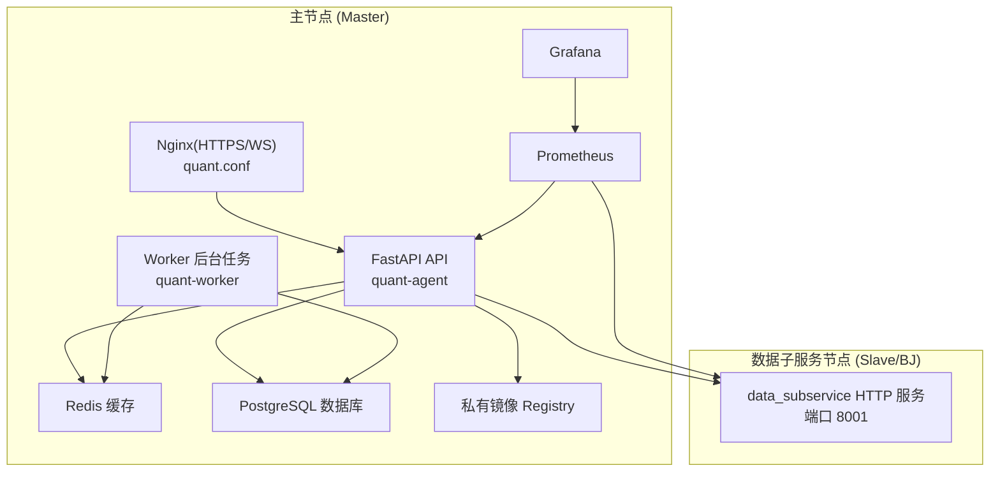
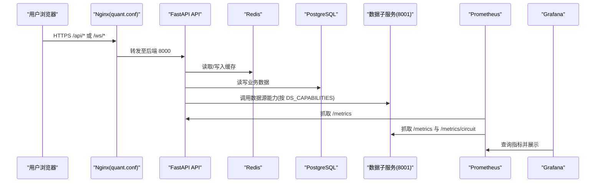
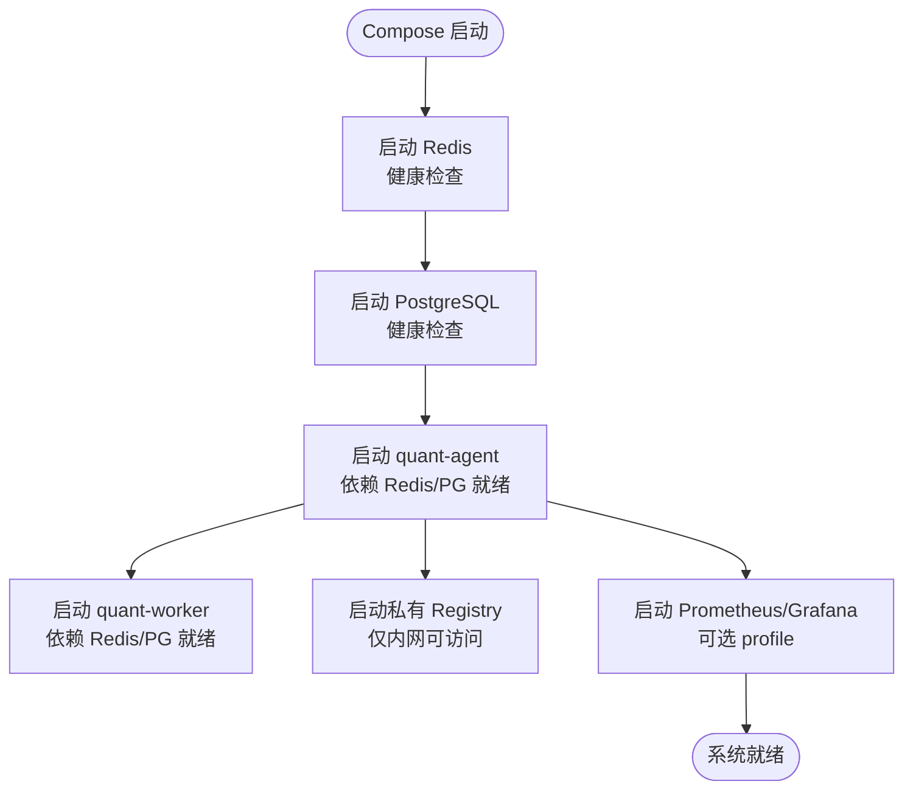
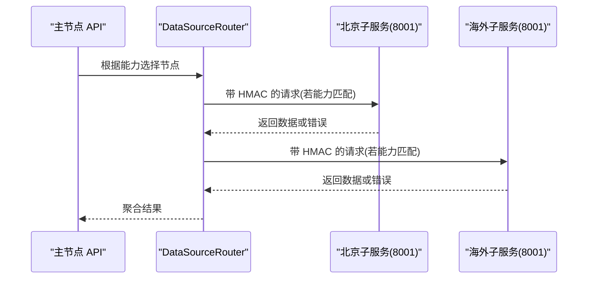
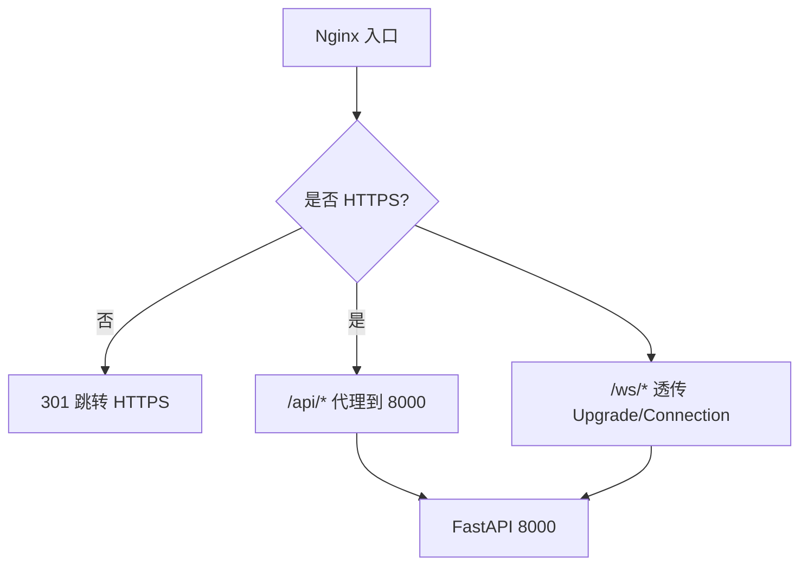
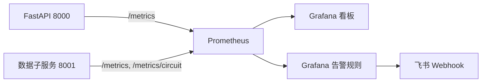
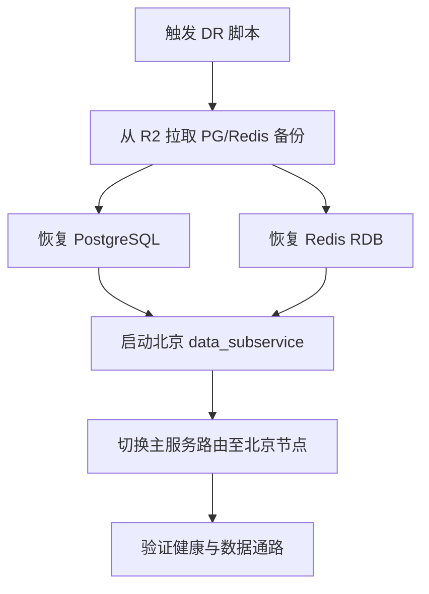
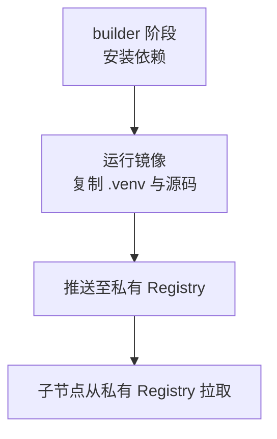
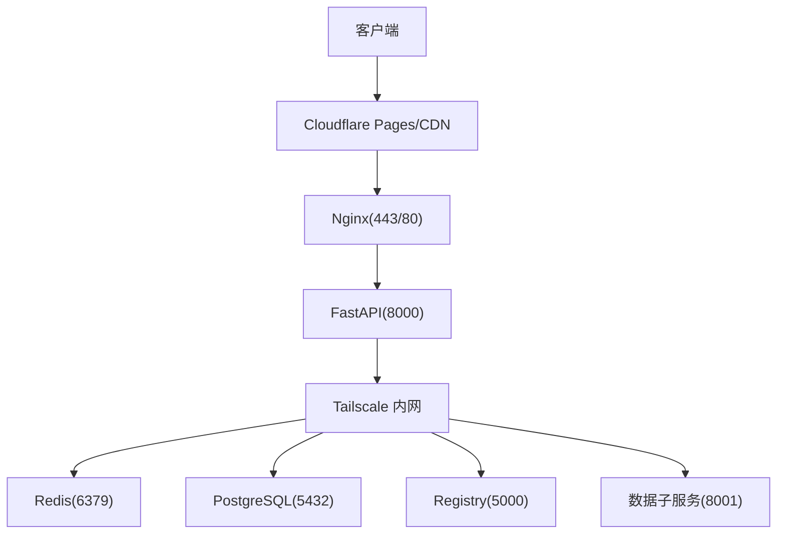
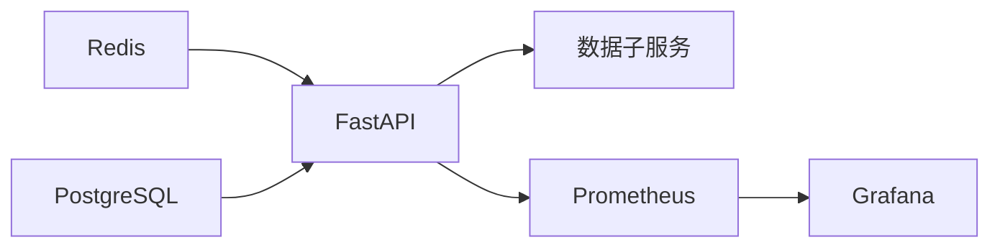

# 部署架构

<cite>
**本文引用的文件**
- [docker-compose.master.yml](file://docker-compose.master.yml)
- [docker-compose.node-bj.yml](file://docker-compose.node-bj.yml)
- [Dockerfile](file://Dockerfile)
- [quant.conf](file://quant.conf)
- [prometheus.yml](file://prometheus.yml)
- [dashboard.yml](file://dashboard.yml)
- [start.sh](file://start.sh)
- [DEPLOYMENT_CHECKLIST.md](file://DEPLOYMENT_CHECKLIST.md)
- [scripts/deploy/init_slave.sh](file://scripts/deploy/init_slave.sh)
- [scripts/deploy/quant-worker.service](file://scripts/deploy/quant-worker.service)
- [scripts/deploy/setup_tailscale.sh](file://scripts/deploy/setup_tailscale.sh)
- [scripts/disaster_recovery/bj_cold_standby.sh](file://scripts/disaster_recovery/bj_cold_standby.sh)
- [grafana/provisioning/datasources/prometheus.yml](file://grafana/provisioning/datasources/prometheus.yml)
- [grafana/provisioning/alerting/alerting.yml](file://grafana/provisioning/alerting/alerting.yml)
- [tempo/tempo.yaml](file://tempo/tempo.yaml)
- [registry-config.yml](file://registry-config.yml)
</cite>

## 目录
1. [简介](#简介)
2. [项目结构](#项目结构)
3. [核心组件](#核心组件)
4. [架构总览](#架构总览)
5. [详细组件分析](#详细组件分析)
6. [依赖关系分析](#依赖关系分析)
7. [性能与资源规划](#性能与资源规划)
8. [故障排查指南](#故障排查指南)
9. [结论](#结论)
10. [附录](#附录)

## 简介
本文件面向生产环境，系统化阐述 Quant Agent 的部署架构与运维方案。内容覆盖主从节点拓扑、负载均衡与高可用设计；容器化镜像构建与编排；环境变量与密钥管理；监控与日志（Prometheus/Grafana/Tempo）；备份与灾难恢复；以及网络拓扑与安全边界。文档中的图示均映射到仓库中实际配置文件，便于落地执行。

## 项目结构
Quant Agent 的生产部署由“主节点 + 数据子服务节点”构成，通过 Tailscale 内网互联，统一对外暴露 API 入口，内部以 Redis 与 PostgreSQL 作为共享状态与持久化存储。

图表来源
- [docker-compose.master.yml:17-251](file://docker-compose.master.yml#L17-L251)
- [docker-compose.node-bj.yml:24-69](file://docker-compose.node-bj.yml#L24-L69)
- [quant.conf:1-81](file://quant.conf#L1-L81)
- [prometheus.yml:16-43](file://prometheus.yml#L16-L43)
- [grafana/provisioning/datasources/prometheus.yml:1-10](file://grafana/provisioning/datasources/prometheus.yml#L1-L10)

章节来源
- [docker-compose.master.yml:1-276](file://docker-compose.master.yml#L1-L276)
- [docker-compose.node-bj.yml:1-70](file://docker-compose.node-bj.yml#L1-L70)
- [quant.conf:1-81](file://quant.conf#L1-L81)

## 核心组件
- 反向代理与 HTTPS：Nginx 提供 HTTPS、WebSocket 透传与静态资源代理，统一对外入口。
- 业务 API：FastAPI 应用承载全部业务路由，单进程模式配合并发限制与优雅重启策略。
- 后台 Worker：采集与定时任务，systemd 守护并具备 Watchdog 健康检查。
- 缓存与数据库：Redis 用于会话/缓存/队列，PostgreSQL 用于结构化数据与向量检索。
- 数据子服务：按能力声明（如 yfinance/tushare/akshare）在远端节点运行，主节点通过 DataSourceRouter 调度。
- 监控与可视化：Prometheus 抓取指标，Grafana 展示看板与告警。
- 私有镜像中转：仅绑定 loopback 与 Tailscale 内网，加速跨域拉取。
- 链路追踪：可选 OpenTelemetry 接入 Tempo。

章节来源
- [quant.conf:1-81](file://quant.conf#L1-L81)
- [docker-compose.master.yml:76-164](file://docker-compose.master.yml#L76-L164)
- [scripts/deploy/quant-worker.service:1-61](file://scripts/deploy/quant-worker.service#L1-L61)
- [docker-compose.master.yml:17-75](file://docker-compose.master.yml#L17-L75)
- [docker-compose.node-bj.yml:24-69](file://docker-compose.node-bj.yml#L24-L69)
- [prometheus.yml:16-43](file://prometheus.yml#L16-L43)
- [grafana/provisioning/datasources/prometheus.yml:1-10](file://grafana/provisioning/datasources/prometheus.yml#L1-L10)
- [registry-config.yml:1-22](file://registry-config.yml#L1-L22)
- [tempo/tempo.yaml:1-25](file://tempo/tempo.yaml#L1-L25)

## 架构总览
下图展示了生产环境的端到端请求路径、数据流向与安全边界。

图表来源
- [quant.conf:17-79](file://quant.conf#L17-L79)
- [docker-compose.master.yml:76-164](file://docker-compose.master.yml#L76-L164)
- [docker-compose.node-bj.yml:24-69](file://docker-compose.node-bj.yml#L24-L69)
- [prometheus.yml:16-43](file://prometheus.yml#L16-L43)
- [grafana/provisioning/datasources/prometheus.yml:1-10](file://grafana/provisioning/datasources/prometheus.yml#L1-L10)

## 详细组件分析

### 主节点容器编排与健康保障
- 服务组成：Redis、PostgreSQL、quant-agent、quant-worker、私有 Registry、Prometheus、Grafana。
- 健康检查：各关键服务配置 healthcheck，确保启动顺序与可用性。
- 资源限制：为每个容器设置 CPU/内存上限与保留值，防止宿主过载。
- 安全绑定：数据库与缓存仅绑定 loopback 与 Tailscale IP，不暴露公网。

图表来源
- [docker-compose.master.yml:17-251](file://docker-compose.master.yml#L17-L251)

章节来源
- [docker-compose.master.yml:17-251](file://docker-compose.master.yml#L17-L251)

### 数据子服务节点（北京/海外）
- 角色定位：仅运行 data_subservice，按 DS_CAPABILITY 暴露数据源能力，不连接 Redis，缓存由主节点统一管理。
- 网络暴露：仅绑定 Tailscale 公网 IP 或本机回环，不对互联网开放 8001。
- 鉴权：主从间通过 HMAC 签名校验，避免非法调用。

图表来源
- [docker-compose.node-bj.yml:24-69](file://docker-compose.node-bj.yml#L24-L69)
- [DEPLOYMENT_CHECKLIST.md:310-347](file://DEPLOYMENT_CHECKLIST.md#L310-L347)

章节来源
- [docker-compose.node-bj.yml:1-70](file://docker-compose.node-bj.yml#L1-L70)
- [DEPLOYMENT_CHECKLIST.md:1-417](file://DEPLOYMENT_CHECKLIST.md#L1-L417)

### 反向代理与 WebSocket 透传
- HTTPS 强制跳转与证书管理。
- /api/* 与 /ws/* 分别处理 REST 与 WebSocket，保持长连接与低延迟。
- 关闭缓冲以提升行情 Tick 实时性。

图表来源
- [quant.conf:1-81](file://quant.conf#L1-L81)

章节来源
- [quant.conf:1-81](file://quant.conf#L1-L81)

### 监控与告警体系
- 指标采集：Prometheus 每 5s 抓取 FastAPI 指标，同时抓取数据子服务的熔断与业务指标。
- 可视化：Grafana 预置数据源与仪表盘，支持多节点视图。
- 告警：基于 PromQL 规则触发飞书 Webhook，覆盖 API 延迟、Redis 内存、熔断器、数据源限流、分布式节点心跳等。

图表来源
- [prometheus.yml:16-43](file://prometheus.yml#L16-L43)
- [grafana/provisioning/datasources/prometheus.yml:1-10](file://grafana/provisioning/datasources/prometheus.yml#L1-L10)
- [grafana/provisioning/alerting/alerting.yml:1-463](file://grafana/provisioning/alerting/alerting.yml#L1-L463)

章节来源
- [prometheus.yml:1-43](file://prometheus.yml#L1-L43)
- [grafana/provisioning/alerting/alerting.yml:1-463](file://grafana/provisioning/alerting/alerting.yml#L1-L463)

### 备份与灾难恢复
- 定期备份：Redis RDB 与 PostgreSQL dump 每日落盘至对象存储（R2）。
- 冷备恢复：脚本自动拉取最新备份，恢复 PG/Redis，启动北京节点 data_subservice，并将主服务路由降级指向北京节点。
- RTO 目标：脚本执行体 < 30 分钟，整体 RTO < 4 小时。

图表来源
- [scripts/disaster_recovery/bj_cold_standby.sh:1-143](file://scripts/disaster_recovery/bj_cold_standby.sh#L1-L143)

章节来源
- [scripts/disaster_recovery/bj_cold_standby.sh:1-143](file://scripts/disaster_recovery/bj_cold_standby.sh#L1-L143)

### 容器镜像构建与分发
- 多阶段构建：使用 python:3.11-slim，安装 uv 与生产依赖，最终镜像仅包含运行时库与源码。
- 国内镜像加速：PyPI/apt 使用阿里云镜像，缩短构建时间。
- 私有中转 Registry：仅内网可访问，解决跨境拉取慢问题；开启 delete 并配合 GC 回收空间。

图表来源
- [Dockerfile:1-60](file://Dockerfile#L1-L60)
- [registry-config.yml:1-22](file://registry-config.yml#L1-L22)

章节来源
- [Dockerfile:1-60](file://Dockerfile#L1-L60)
- [registry-config.yml:1-22](file://registry-config.yml#L1-L22)

### 环境变量与密钥管理
- 主节点：通过 .env 注入数据库、Redis、LLM、数据源 Key 等；敏感项集中管理。
- 子节点：独立 .env.data-node，包含数据源 Token、HMAC 密钥、Tailscale IP 等。
- 安全要求：INTERNAL_API_SECRET 与 ENCRYPTION_MASTER_KEY 在所有节点保持一致；禁止将 .env 提交到仓库。

章节来源
- [DEPLOYMENT_CHECKLIST.md:1-417](file://DEPLOYMENT_CHECKLIST.md#L1-L417)
- [docker-compose.master.yml:90-153](file://docker-compose.master.yml#L90-L153)
- [docker-compose.node-bj.yml:31-46](file://docker-compose.node-bj.yml#L31-L46)

### 网络拓扑与安全边界
- 外网入口：Nginx 暴露 443（HTTPS），80 自动跳转；API 经 Cloudflare Pages 回调需开放 8000。
- 内网通信：Tailscale 建立加密隧道，Redis/PG/Registry 仅绑定 loopback 与 Tailscale IP。
- 防火墙加固：仅放行 SSH 与 API 端口，其他端口对公网屏蔽。

图表来源
- [quant.conf:1-81](file://quant.conf#L1-L81)
- [docker-compose.master.yml:17-251](file://docker-compose.master.yml#L17-L251)
- [docker-compose.node-bj.yml:47-69](file://docker-compose.node-bj.yml#L47-L69)
- [scripts/deploy/setup_tailscale.sh:94-137](file://scripts/deploy/setup_tailscale.sh#L94-L137)

章节来源
- [quant.conf:1-81](file://quant.conf#L1-L81)
- [docker-compose.master.yml:17-251](file://docker-compose.master.yml#L17-L251)
- [docker-compose.node-bj.yml:47-69](file://docker-compose.node-bj.yml#L47-L69)
- [scripts/deploy/setup_tailscale.sh:1-171](file://scripts/deploy/setup_tailscale.sh#L1-L171)

## 依赖关系分析
- 启动顺序：Redis/PostgreSQL 先于 API/Worker；监控组件可选 profile 启动。
- 外部依赖：数据子服务依赖上游数据源（Tushare/AKShare/YFinance/Futu），通过能力声明与路由控制。
- 监控耦合：Prometheus 抓取 FastAPI 与子服务指标；Grafana 依赖 Prometheus 数据源。

图表来源
- [docker-compose.master.yml:76-251](file://docker-compose.master.yml#L76-L251)
- [prometheus.yml:16-43](file://prometheus.yml#L16-L43)

章节来源
- [docker-compose.master.yml:76-251](file://docker-compose.master.yml#L76-L251)
- [prometheus.yml:16-43](file://prometheus.yml#L16-L43)

## 性能与资源规划
- API 并发与内存：主节点采用单 worker 模式，限制并发与最大请求数，设置硬内存上限，稳态约 370MB，留足缓冲。
- 数据库与缓存：PostgreSQL 与 Redis 分别设置 CPU/内存限制，避免争抢宿主资源。
- 监控采样：FastAPI 指标 5s 抓取，提升实时性；子服务熔断面板 15s 抓取。
- 镜像体积：多阶段构建与最小化基础镜像，减少传输与启动开销。
- 建议：
  - 根据 QPS 与峰值内存调整 limit-concurrency 与 workers 数量。
  - 对热点表与索引进行优化，必要时拆分只读副本。
  - 合理设置 Prometheus 保留期与 Grafana 刷新频率，平衡存储与体验。

章节来源
- [docker-compose.master.yml:76-164](file://docker-compose.master.yml#L76-L164)
- [prometheus.yml:16-43](file://prometheus.yml#L16-L43)
- [Dockerfile:1-60](file://Dockerfile#L1-L60)

## 故障排查指南
- 子服务 403 鉴权失败：
  - 检查 DATA_SOURCE_HMAC_SECRET 在主从两侧是否一致且无占位符。
  - 确认跨节点时间同步（NTP），时差超过阈值会拒绝请求。
- 子服务镜像拉取慢或被拒：
  - 使用主节点私有 Registry，并在 Docker daemon 加入 insecure-registries。
  - 注意镜像命名空间与标签一致性。
- 前端超时或空白：
  - 核对 Cloudflare Pages 构建变量 VITE_API_BASE_URL 指向正确的 API 子域。
- 节点离线：
  - 检查 Tailscale 连通性与端口绑定，确认防火墙未误拦截。
- 监控缺失：
  - 确认 Prometheus targets 可达，Grafana 数据源配置正确。

章节来源
- [DEPLOYMENT_CHECKLIST.md:310-387](file://DEPLOYMENT_CHECKLIST.md#L310-L387)
- [docker-compose.node-bj.yml:47-69](file://docker-compose.node-bj.yml#L47-L69)
- [prometheus.yml:16-43](file://prometheus.yml#L16-L43)

## 结论
Quant Agent 的生产部署采用“主节点 + 数据子服务节点”的解耦架构，结合 Tailscale 内网、Nginx 反向代理、Redis/PostgreSQL 共享状态、Prometheus/Grafana 可观测性与私有 Registry 分发，形成高可用、可扩展、易运维的系统。通过严格的密钥与环境管理、完善的监控告警与灾难恢复流程，满足量化交易场景对稳定性与时效性的要求。

## 附录
- 一键启动与停止：使用 start.sh 支持开发模式与 Docker 全栈模式。
- 从节点初始化：init_slave.sh 提供幂等初始化与验证流程。
- 链路追踪：可选启用 OpenTelemetry，接入 Tempo 进行分布式追踪。

章节来源
- [start.sh:1-291](file://start.sh#L1-L291)
- [scripts/deploy/init_slave.sh:1-187](file://scripts/deploy/init_slave.sh#L1-L187)
- [tempo/tempo.yaml:1-25](file://tempo/tempo.yaml#L1-L25)
