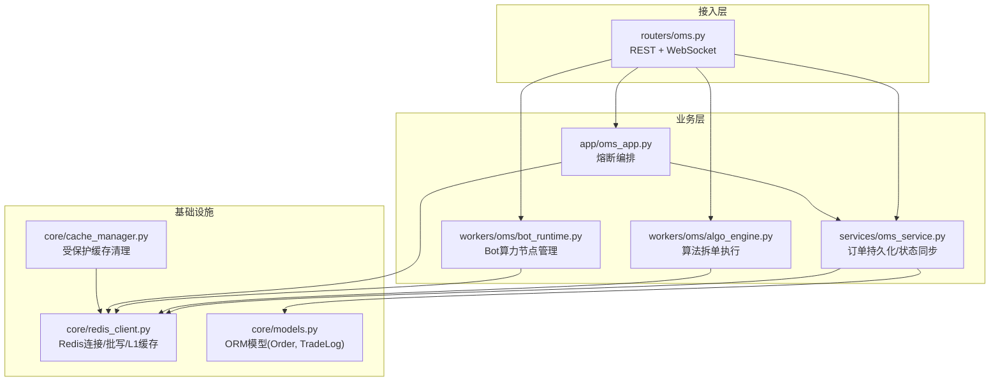
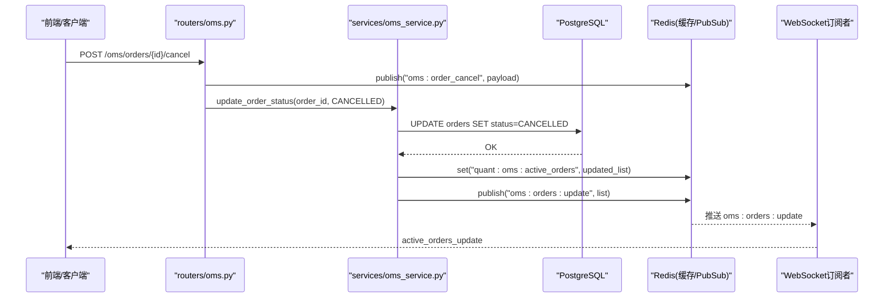
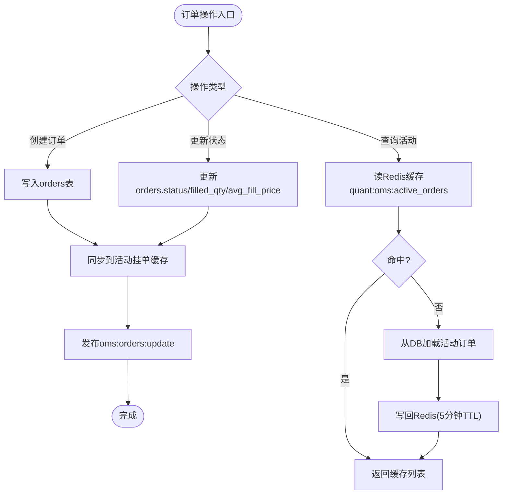
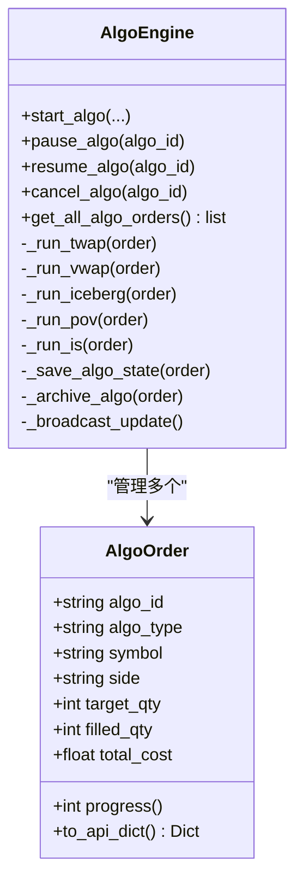
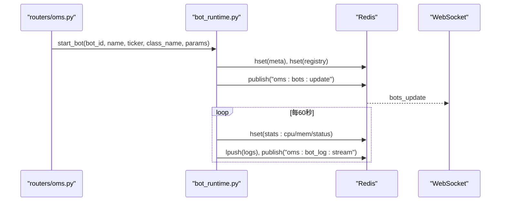
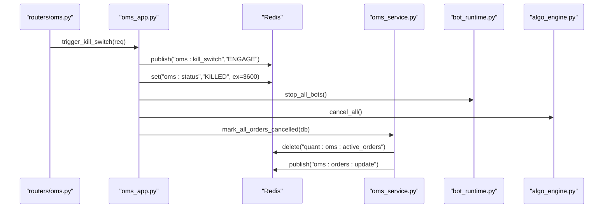
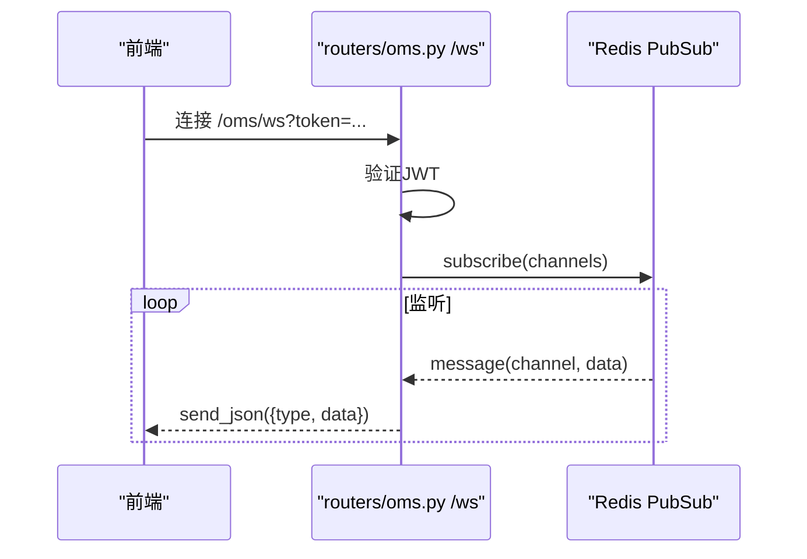
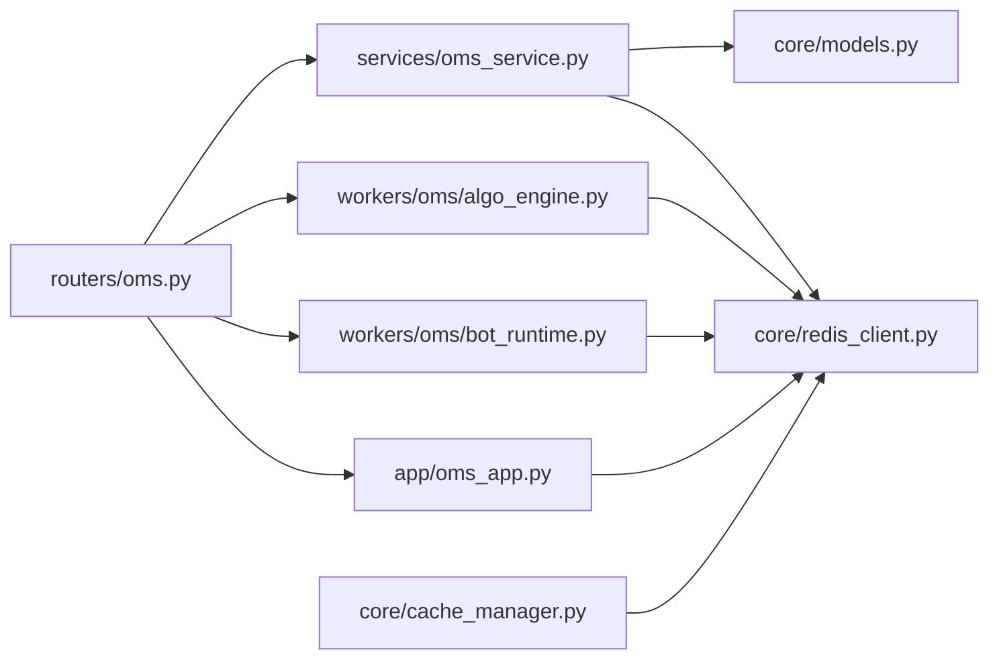

# OMS架构设计

<cite>
**本文引用的文件**
- [backend/app/oms_app.py](file://backend/app/oms_app.py)
- [backend/services/oms_service.py](file://backend/services/oms_service.py)
- [backend/routers/oms.py](file://backend/routers/oms.py)
- [backend/core/cache_manager.py](file://backend/core/cache_manager.py)
- [backend/core/redis_client.py](file://backend/core/redis_client.py)
- [backend/workers/oms/algo_engine.py](file://backend/workers/oms/algo_engine.py)
- [backend/workers/oms/bot_runtime.py](file://backend/workers/oms/bot_runtime.py)
- [backend/core/models.py](file://backend/core/models.py)
</cite>

## 目录
1. [简介](#简介)
2. [项目结构](#项目结构)
3. [核心组件](#核心组件)
4. [架构总览](#架构总览)
5. [详细组件分析](#详细组件分析)
6. [依赖关系分析](#依赖关系分析)
7. [性能考量](#性能考量)
8. [故障排查指南](#故障排查指南)
9. [结论](#结论)
10. [附录：二次开发与扩展点](#附录二次开发与扩展点)

## 简介
本文件面向开发者，系统化阐述 Quant Agent 订单管理系统（OMS）的架构设计与实现要点。重点覆盖：
- 整体架构模式：分层架构、事件驱动、微服务拆分
- 核心组件职责：订单持久化层、状态同步层、缓存管理层、消息广播层
- 数据流向：订单创建→持久化→缓存更新→实时广播的完整链路
- 与 Redis、PostgreSQL、WebSocket 的集成方式
- 系统边界、依赖关系图、扩展点设计
- 二次开发指南与最佳实践

## 项目结构
后端以 FastAPI 为入口，采用“路由层 → 服务层 → 基础设施”的分层组织；OMS 相关能力分布在 routers、services、workers、core 等模块中，通过 Redis 作为共享总线与缓存，PostgreSQL 作为持久化存储，WebSocket 提供实时推送。

图表来源
- [backend/routers/oms.py:1-464](file://backend/routers/oms.py#L1-L464)
- [backend/services/oms_service.py:1-276](file://backend/services/oms_service.py#L1-L276)
- [backend/workers/oms/algo_engine.py:1-785](file://backend/workers/oms/algo_engine.py#L1-L785)
- [backend/workers/oms/bot_runtime.py:1-446](file://backend/workers/oms/bot_runtime.py#L1-L446)
- [backend/app/oms_app.py:1-54](file://backend/app/oms_app.py#L1-L54)
- [backend/core/redis_client.py:1-252](file://backend/core/redis_client.py#L1-L252)
- [backend/core/models.py:269-289](file://backend/core/models.py#L269-L289)
- [backend/core/cache_manager.py:1-75](file://backend/core/cache_manager.py#L1-L75)

章节来源
- [backend/routers/oms.py:1-464](file://backend/routers/oms.py#L1-L464)
- [backend/services/oms_service.py:1-276](file://backend/services/oms_service.py#L1-L276)
- [backend/core/redis_client.py:1-252](file://backend/core/redis_client.py#L1-L252)
- [backend/core/models.py:269-289](file://backend/core/models.py#L269-L289)

## 核心组件
- 订单持久化层（OMS-01/02/03）
  - 负责订单写入 PostgreSQL、成交记录读取、活动挂单查询与状态同步。
  - 关键路径：create_order/update_order_status/get_active_orders/sync_positions_from_futu/mark_all_orders_cancelled。
- 状态同步层（OMS-03/04）
  - 将订单与持仓变更同步到 Redis 缓存，并通过 PubSub 广播给订阅者。
  - 关键键空间：quant:oms:active_orders、quant:oms:positions:{market}、quant:oms:status。
- 缓存管理层（ARCH-04/安全约束）
  - 统一清理业务缓存，保护交易态 key（活动挂单、持仓、OMS状态）不被误删。
  - 提供 L1 本地缓存与异步批量写入，降低 Redis 网络开销。
- 消息广播层（事件驱动）
  - 基于 Redis PubSub 通道：oms:orders:update、oms:positions:update、oms:mode_change、oms:bots:update、oms:algo_executions:update、oms:bot_log:stream 等。
  - WebSocket 端订阅这些通道，向客户端实时推送。

章节来源
- [backend/services/oms_service.py:32-245](file://backend/services/oms_service.py#L32-L245)
- [backend/core/cache_manager.py:19-75](file://backend/core/cache_manager.py#L19-L75)
- [backend/core/redis_client.py:12-34](file://backend/core/redis_client.py#L12-L34)
- [backend/routers/oms.py:379-464](file://backend/routers/oms.py#L379-L464)

## 架构总览
OMS 采用分层+事件驱动的微服务拆分：
- 接入层：FastAPI Router 暴露 REST 与 WebSocket 接口，仅做鉴权、参数校验与任务调度。
- 业务层：OmsService 处理订单生命周期；AlgoEngine 负责算法拆单；BotRuntime 管理策略运行时；OMS App 编排熔断流程。
- 基础设施层：Redis 作为共享缓存与消息总线；PostgreSQL 作为持久化存储；CacheManager 保障缓存安全。

图表来源
- [backend/routers/oms.py:120-147](file://backend/routers/oms.py#L120-L147)
- [backend/services/oms_service.py:79-114](file://backend/services/oms_service.py#L79-L114)
- [backend/core/models.py:269-289](file://backend/core/models.py#L269-L289)
- [backend/core/redis_client.py:12-34](file://backend/core/redis_client.py#L12-L34)

## 详细组件分析

### 订单持久化与状态同步（OmsService）
- 职责
  - 订单创建：写入 orders 表，同步到 Redis 活动挂单缓存，并广播变更。
  - 状态更新：根据 broker/Futu 回调或轮询结果更新订单状态，刷新缓存与广播。
  - 活动挂单查询：优先从 Redis 缓存读取，未命中则回源 DB 并回填缓存。
  - 历史成交：读取 trade_logs 表返回。
  - 持仓同步：从 Futu 拉取持仓写入 Redis，并广播。
  - 熔断标记：将所有活动订单置为 CANCELLED，清空活动挂单缓存并广播。
- 关键数据流
  - create_order → DB commit → _sync_order_to_redis → _publish_orders_update
  - update_order_status → DB commit → _sync_order_to_redis → _publish_orders_update
  - get_active_orders → Redis get → fallback to DB → Redis set(TTL)
  - sync_positions_from_futu → Redis set(positions) → publish("oms:positions:update")
  - mark_all_orders_cancelled → DB update → delete(active_orders) → publish("oms:orders:update")

图表来源
- [backend/services/oms_service.py:34-114](file://backend/services/oms_service.py#L34-L114)
- [backend/services/oms_service.py:118-143](file://backend/services/oms_service.py#L118-L143)
- [backend/services/oms_service.py:218-245](file://backend/services/oms_service.py#L218-L245)

章节来源
- [backend/services/oms_service.py:32-245](file://backend/services/oms_service.py#L32-L245)
- [backend/core/models.py:269-289](file://backend/core/models.py#L269-L289)

### 算法拆单引擎（AlgoEngine）
- 职责
  - 支持 TWAP/VWAP/ICEBERG/POV/IS 多种算法拆单策略。
  - 维护算法订单生命周期（启动/暂停/恢复/取消），状态持久化至 Redis Hash/List，完成后归档。
  - 根据交易模式（SANDBOX/LIVE）选择模拟或真实下单。
  - 计算 lot_size（港股整手），对齐下单数量。
  - 广播算法执行进度到 Redis PubSub。
- 关键点
  - 使用 asyncio.Task 运行各算法主循环，支持优雅停止与恢复。
  - 市场冲击模型（Almgren-Chriss 简化版）用于 IS 最优执行计划。
  - 通过 DataSourceRouter 获取行情与下单（Futu）。

图表来源
- [backend/workers/oms/algo_engine.py:194-365](file://backend/workers/oms/algo_engine.py#L194-L365)
- [backend/workers/oms/algo_engine.py:369-741](file://backend/workers/oms/algo_engine.py#L369-L741)

章节来源
- [backend/workers/oms/algo_engine.py:1-785](file://backend/workers/oms/algo_engine.py#L1-L785)

### Bot算力节点运行时（BotRuntime）
- 职责
  - 管理策略运行时实例（启动/暂停/恢复/终止），每个 Bot 以 asyncio.Task 运行。
  - 采集真实 CPU/MEM 资源指标，写入 Redis Hash 并设置短 TTL。
  - 日志持久化：写入 Redis List（最近 N 条），并通过 PubSub 广播。
  - 元数据持久化：注册到全局 Bot 注册表，支持服务重启后恢复。
- 关键点
  - 使用 psutil 采集进程级资源指标。
  - 动态加载策略文件，调用 on_tick 方法执行策略逻辑。
  - 支持批量关停与优雅关闭。

图表来源
- [backend/workers/oms/bot_runtime.py:95-125](file://backend/workers/oms/bot_runtime.py#L95-L125)
- [backend/workers/oms/bot_runtime.py:319-396](file://backend/workers/oms/bot_runtime.py#L319-L396)
- [backend/routers/oms.py:190-214](file://backend/routers/oms.py#L190-L214)

章节来源
- [backend/workers/oms/bot_runtime.py:1-446](file://backend/workers/oms/bot_runtime.py#L1-L446)
- [backend/routers/oms.py:190-214](file://backend/routers/oms.py#L190-L214)

### 熔断编排（OMS Kill Switch）
- 职责
  - 快速广播熔断信号（Redis PubSub），设置 OMS 状态为 KILLED。
  - 触发 Broker 物理清仓，终止所有 Bot，取消所有算法拆单，并将活动订单标记为 CANCELLED。
- 关键点
  - 热路径极速返回，后台任务执行清仓流程。
  - 审计日志记录。

图表来源
- [backend/routers/oms.py:94-117](file://backend/routers/oms.py#L94-L117)
- [backend/app/oms_app.py:24-54](file://backend/app/oms_app.py#L24-L54)
- [backend/services/oms_service.py:197-214](file://backend/services/oms_service.py#L197-L214)

章节来源
- [backend/app/oms_app.py:24-54](file://backend/app/oms_app.py#L24-L54)
- [backend/routers/oms.py:94-117](file://backend/routers/oms.py#L94-L117)
- [backend/services/oms_service.py:197-214](file://backend/services/oms_service.py#L197-L214)

### WebSocket 实时推送
- 职责
  - 认证通过后接受连接，订阅多个 Redis PubSub 通道，按通道类型包装事件推送给前端。
- 通道
  - oms:bots/update、oms:orders/update、oms:trades/new、oms:bot_log/stream、oms:algo_executions/update、oms:positions/update、oms:mode_change。
- 关键点
  - 使用 JWT 鉴权，异常时关闭连接。
  - 任一协程结束即释放另一个，避免资源泄漏。

图表来源
- [backend/routers/oms.py:379-464](file://backend/routers/oms.py#L379-L464)

章节来源
- [backend/routers/oms.py:379-464](file://backend/routers/oms.py#L379-L464)

## 依赖关系分析
- 组件耦合
  - Router 依赖 Service/Worker/App，低耦合高内聚。
  - Service 依赖 ORM 模型与 Redis，解耦数据库与缓存实现。
  - Worker 通过 Redis 与外部系统交互（Futu、Broker），不直接持有 DB Session。
- 外部依赖
  - Redis：缓存、PubSub、批写队列、L1内存缓存。
  - PostgreSQL：订单、成交、审计等持久化。
  - WebSocket：实时推送。
- 潜在循环依赖
  - 当前未发现明显循环导入；Router→Service/Worker→Redis/DB，层次清晰。

图表来源
- [backend/routers/oms.py:1-464](file://backend/routers/oms.py#L1-L464)
- [backend/services/oms_service.py:1-276](file://backend/services/oms_service.py#L1-L276)
- [backend/workers/oms/algo_engine.py:1-785](file://backend/workers/oms/algo_engine.py#L1-L785)
- [backend/workers/oms/bot_runtime.py:1-446](file://backend/workers/oms/bot_runtime.py#L1-L446)
- [backend/app/oms_app.py:1-54](file://backend/app/oms_app.py#L1-L54)
- [backend/core/models.py:269-289](file://backend/core/models.py#L269-L289)
- [backend/core/redis_client.py:1-252](file://backend/core/redis_client.py#L1-L252)
- [backend/core/cache_manager.py:1-75](file://backend/core/cache_manager.py#L1-L75)

章节来源
- [backend/routers/oms.py:1-464](file://backend/routers/oms.py#L1-L464)
- [backend/core/redis_client.py:1-252](file://backend/core/redis_client.py#L1-L252)

## 性能考量
- Redis 批写队列
  - 高频 set 通过 RedisAsyncBatchWriter 聚合 Pipeline 批量写入，减少 RTT。
  - 优雅停机确保队列清空，防止数据丢失。
- L1 本地缓存
  - LocalL1Cache 对热点配置/开关进行内存缓存，默认 TTL 10s，容量超限自动清空。
- 缓存清理保护
  - CacheManager 明确保护交易态前缀（活动挂单、持仓、OMS状态），避免误删导致状态不一致。
- 连接池上限
  - REDIS_MAX_CONNECTIONS 限制连接数，防止无上限打满。
- 建议
  - 监控 Redis 连接池使用率与队列深度。
  - 合理设置 L1 缓存大小与 TTL，避免内存膨胀。
  - 对高频写入场景评估批写阈值与间隔。

章节来源
- [backend/core/redis_client.py:37-177](file://backend/core/redis_client.py#L37-L177)
- [backend/core/redis_client.py:180-252](file://backend/core/redis_client.py#L180-L252)
- [backend/core/cache_manager.py:19-75](file://backend/core/cache_manager.py#L19-L75)

## 故障排查指南
- 订单状态不同步
  - 检查 Redis 活动挂单缓存是否被清理或过期；确认 _sync_order_to_redis 与 _publish_orders_update 是否执行成功。
  - 查看 DB orders 表状态是否与预期一致。
- WebSocket 无推送
  - 确认 Redis PubSub 通道是否正常；检查订阅通道列表与消息类型映射。
  - 验证 JWT 鉴权是否通过。
- 熔断未生效
  - 检查 oms:kill_switch 是否发布；oms:status 是否设置为 KILLED。
  - 确认 bot_runtime.stop_all_bots 与 algo_engine.cancel_all 是否执行。
- 缓存误删风险
  - 使用 CacheManager 清理缓存，避免直接删除交易态 key。
- 性能问题
  - 观察 Redis 批写队列堆积情况；调整 batch_size 与 flush_interval。
  - 关注 L1 缓存容量与清理任务。

章节来源
- [backend/services/oms_service.py:218-245](file://backend/services/oms_service.py#L218-L245)
- [backend/routers/oms.py:379-464](file://backend/routers/oms.py#L379-L464)
- [backend/app/oms_app.py:24-54](file://backend/app/oms_app.py#L24-L54)
- [backend/core/cache_manager.py:19-75](file://backend/core/cache_manager.py#L19-L75)
- [backend/core/redis_client.py:37-177](file://backend/core/redis_client.py#L37-L177)

## 结论
OMS 通过分层架构与事件驱动设计，实现了订单全生命周期的可靠处理与实时可视化。Redis 作为共享缓存与消息总线，PostgreSQL 提供持久化保障，WebSocket 实现低延迟推送。系统具备熔断机制、算法拆单与 Bot 运行时管理能力，适合在量化交易场景中扩展与二次开发。

## 附录：二次开发与扩展点
- 新增订单状态机
  - 在 OmsService.update_order_status 中扩展状态转换规则，并确保同步缓存与广播。
- 新增算法策略
  - 在 AlgoEngine 中添加新的 _run_xxx 方法与路由分支，遵循整手与交易模式逻辑。
- 新增缓存清理策略
  - 在 CacheManager.DEFAULT_CACHE_PREFIXES 中增加业务前缀，同时确保交易态前缀受保护。
- 新增 WebSocket 事件
  - 在 Redis PubSub 发布新通道，并在 routers/oms.py 的 WebSocket 处理器中订阅与转发。
- 集成第三方数据源
  - 通过 DataSourceRouter 调用外部服务（如 Futu），保持与 OMS 解耦。

章节来源
- [backend/services/oms_service.py:79-114](file://backend/services/oms_service.py#L79-L114)
- [backend/workers/oms/algo_engine.py:369-741](file://backend/workers/oms/algo_engine.py#L369-L741)
- [backend/core/cache_manager.py:26-75](file://backend/core/cache_manager.py#L26-L75)
- [backend/routers/oms.py:379-464](file://backend/routers/oms.py#L379-L464)