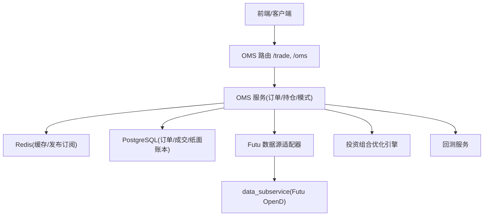
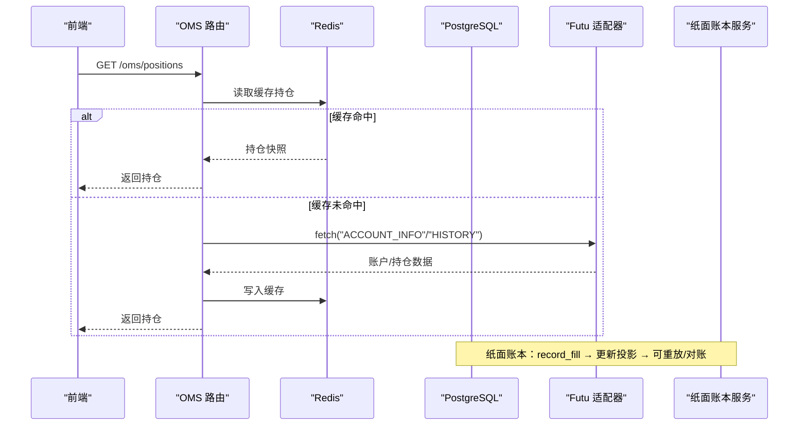
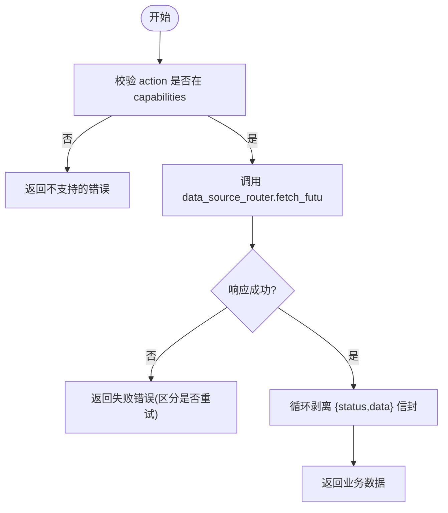
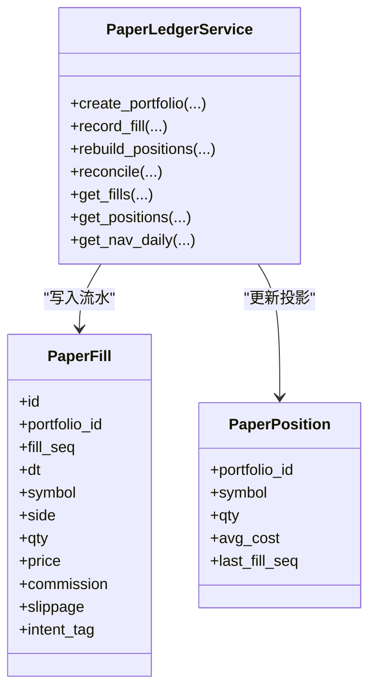
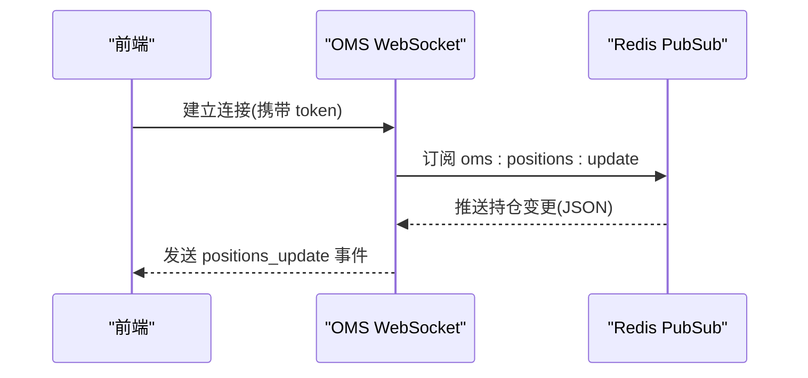
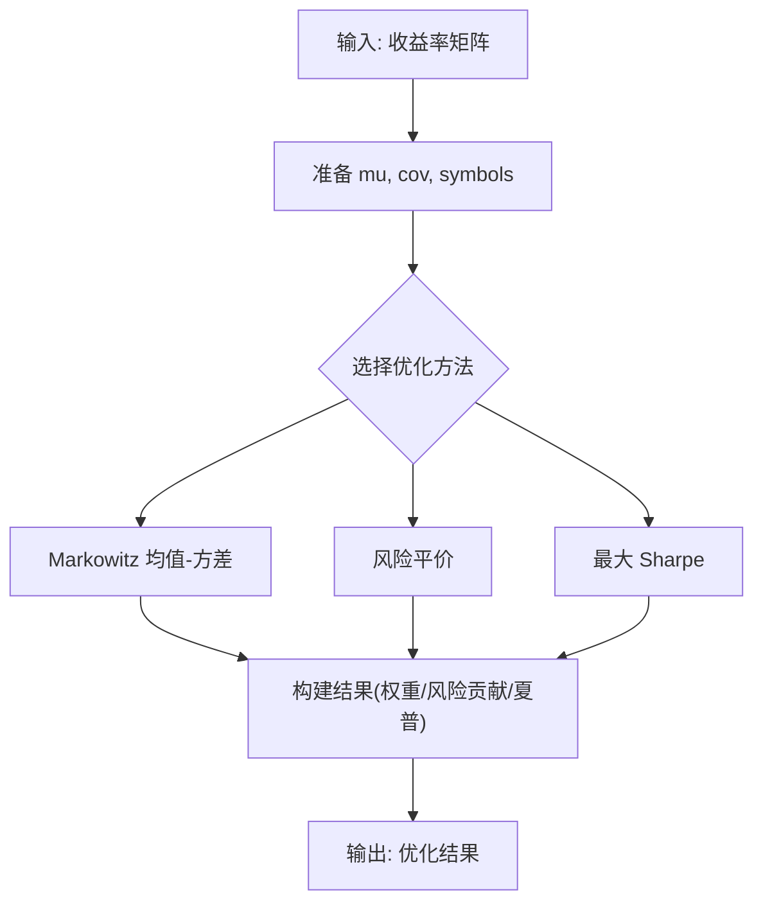
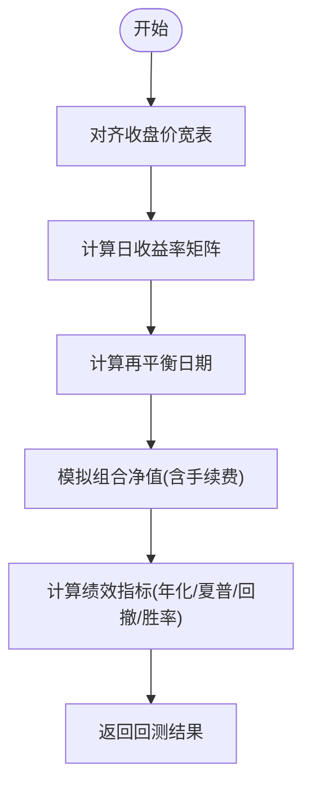
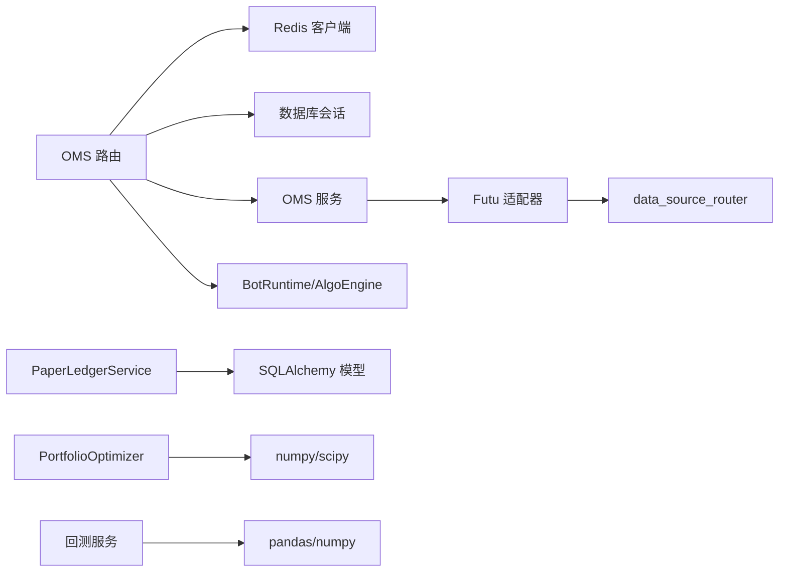

# 仓位管理

<cite>
**本文引用的文件**
- [backend/routers/oms.py](file://backend/routers/oms.py)
- [backend/routers/trade.py](file://backend/routers/trade.py)
- [backend/services/paper_ledger_service.py](file://backend/services/paper_ledger_service.py)
- [backend/domain/portfolio_optimizer.py](file://backend/domain/portfolio_optimizer.py)
- [backend/app/backtest/portfolio_backtest.py](file://backend/app/backtest/portfolio_backtest.py)
- [backend/routers/portfolio.py](file://backend/routers/portfolio.py)
- [backend/services/datasource/adapters/futu.py](file://backend/services/datasource/adapters/futu.py)
- [backend/core/models.py](file://backend/core/models.py)
- [backend/core/redis_client.py](file://backend/core/redis_client.py)
</cite>

## 目录
1. [简介](#简介)
2. [项目结构](#项目结构)
3. [核心组件](#核心组件)
4. [架构总览](#架构总览)
5. [详细组件分析](#详细组件分析)
6. [依赖关系分析](#依赖关系分析)
7. [性能考虑](#性能考虑)
8. [故障排查指南](#故障排查指南)
9. [结论](#结论)
10. [附录](#附录)

## 简介
本文件面向“仓位管理系统”的完整技术文档，覆盖以下目标：
- 持仓数据来源与同步机制：从 Futu 等券商接口拉取真实持仓、本地纸面账本计算持仓。
- 持仓数据结构设计：股票代码、数量、成本价、市值、盈亏等字段含义。
- 持仓更新流程：定时同步、事件触发、增量更新的实现方式。
- 持仓查询优化：Redis 缓存策略、分页查询、批量操作。
- 持仓分析功能：盈亏计算、集中度分析、行业分布统计。
- 持仓监控与告警机制：实时推送、阈值告警、熔断降级。

## 项目结构
与仓位管理相关的后端模块主要分布在以下路径：
- OMS 路由层：提供持仓查询、交易模式切换、WebSocket 实时推送等能力。
- 交易路由层：账户信息、组合资产、成交记录等交易相关接口。
- 纸面账本服务：以不可变流水（paper_fills）构建可重放、可对账的持仓投影（paper_positions）。
- 投资组合优化引擎：用于集中度、风险贡献、有效前沿等分析。
- 回测服务：基于历史 K 线进行等权组合回测与绩效指标计算。
- Futu 数据源适配器：通过 data_source_router 远程调用子服务获取账户与行情数据。
- 模型与 Redis：数据库模型定义与 Redis 客户端封装，支撑缓存与消息通道。

**图表来源**
- [backend/routers/oms.py:56-84](file://backend/routers/oms.py#L56-L84)
- [backend/routers/trade.py:30-56](file://backend/routers/trade.py#L30-L56)
- [backend/services/datasource/adapters/futu.py:130-180](file://backend/services/datasource/adapters/futu.py#L130-L180)

**章节来源**
- [backend/routers/oms.py:56-84](file://backend/routers/oms.py#L56-L84)
- [backend/routers/trade.py:30-56](file://backend/routers/trade.py#L30-L56)
- [backend/services/datasource/adapters/futu.py:130-180](file://backend/services/datasource/adapters/futu.py#L130-L180)

## 核心组件
- 持仓数据源
  - 真实持仓：通过 Futu 数据源适配器经 data_source_router 远程获取账户与持仓信息。
  - 纸面持仓：PaperLedgerService 以 paper_fills 为唯一事实源，维护 paper_positions 投影。
- 持仓更新
  - 事件驱动：OMS WebSocket 订阅 Redis 通道 oms:positions:update，接收持仓变更推送。
  - 增量更新：成交流水写入后即时更新投影；支持按 fill_seq 增量重放。
- 查询与缓存
  - Redis 缓存：OMS 状态与持仓热读；交易模式切换通过 Redis 键值立即生效。
  - 分页查询：纸面账本的成交流水与日终净值支持 offset/limit 分页。
- 分析与优化
  - 集中度与风险贡献：PortfolioOptimizer 提供风险贡献度、有效持仓数、Sharpe 等指标。
  - 回测：等权组合回测，计算净值曲线、最大回撤、月度收益热力图等。

**章节来源**
- [backend/routers/oms.py:180-184](file://backend/routers/oms.py#L180-L184)
- [backend/services/paper_ledger_service.py:84-142](file://backend/services/paper_ledger_service.py#L84-L142)
- [backend/domain/portfolio_optimizer.py:27-37](file://backend/domain/portfolio_optimizer.py#L27-L37)
- [backend/app/backtest/portfolio_backtest.py:103-227](file://backend/app/backtest/portfolio_backtest.py#L103-L227)

## 架构总览
仓位管理的整体数据流如下：
- 真实持仓：OMS 路由调用 oms_service.get_cached_positions 读取 Redis 中的真实持仓快照；底层由 Futu 适配器经 data_source_router 拉取账户与持仓数据。
- 纸面持仓：PaperLedgerService.record_fill 写入不可变流水并更新投影；rebuild_positions/reconcile 支持全量重放与一致性校验。
- 实时更新：OMS WebSocket 订阅 Redis 通道 oms:positions/update，将持仓变动推送至前端。
- 分析：PortfolioOptimizer 基于收益率矩阵计算风险贡献、有效前沿；回测服务基于历史 K 线生成绩效指标。

**图表来源**
- [backend/routers/oms.py:180-184](file://backend/routers/oms.py#L180-L184)
- [backend/services/datasource/adapters/futu.py:130-180](file://backend/services/datasource/adapters/futu.py#L130-L180)
- [backend/services/paper_ledger_service.py:84-142](file://backend/services/paper_ledger_service.py#L84-L142)

## 详细组件分析

### 组件A：真实持仓同步（Futu 数据源适配器）
- 职责：统一通过 data_source_router.fetch_futu(action, **params) 获取账户与持仓数据，屏蔽本地 SDK 直连。
- 关键行为：
  - 能力声明：capabilities 包含 ACCOUNT_INFO、QUOTE、HISTORY 等，确保 action 路由正确。
  - 健康检查：is_available/health 返回远程节点状态与错误计数。
  - 结果解包：循环剥离嵌套信封 {status,data}，直到拿到业务数据。
  - 限流处理：识别 429/限流/Too Many 等错误码，返回 RateLimited。

**图表来源**
- [backend/services/datasource/adapters/futu.py:130-180](file://backend/services/datasource/adapters/futu.py#L130-L180)

**章节来源**
- [backend/services/datasource/adapters/futu.py:34-81](file://backend/services/datasource/adapters/futu.py#L34-L81)
- [backend/services/datasource/adapters/futu.py:91-126](file://backend/services/datasource/adapters/futu.py#L91-L126)
- [backend/services/datasource/adapters/futu.py:130-180](file://backend/services/datasource/adapters/futu.py#L130-L180)

### 组件B：纸面账本与持仓投影（PaperLedgerService）
- 职责：以不可变流水（paper_fills）作为单一事实源，维护纸面持仓投影（paper_positions），支持重建与对账。
- 关键行为：
  - record_fill：分配单调递增 fill_seq，写入流水，更新投影（加权平均成本）。
  - rebuild_positions：按 fill_seq 顺序重放流水，重建持仓。
  - reconcile：比较投影与重放结果，保证一致性与可追溯性。
  - 分页查询：get_fills/get_nav_daily 支持 offset/limit。

**图表来源**
- [backend/services/paper_ledger_service.py:84-142](file://backend/services/paper_ledger_service.py#L84-L142)
- [backend/services/paper_ledger_service.py:189-247](file://backend/services/paper_ledger_service.py#L189-L247)
- [backend/services/paper_ledger_service.py:253-314](file://backend/services/paper_ledger_service.py#L253-L314)

**章节来源**
- [backend/services/paper_ledger_service.py:84-142](file://backend/services/paper_ledger_service.py#L84-L142)
- [backend/services/paper_ledger_service.py:189-247](file://backend/services/paper_ledger_service.py#L189-L247)
- [backend/services/paper_ledger_service.py:253-314](file://backend/services/paper_ledger_service.py#L253-L314)

### 组件C：OMS 持仓查询与实时推送
- 职责：提供持仓查询、交易模式切换、WebSocket 实时推送。
- 关键行为：
  - get_real_positions：从 Redis 缓存读取真实持仓列表。
  - websocket_oms_updates：订阅 oms:positions:update 等通道，将持仓变动推送给前端。
  - trading mode：通过 Redis 键值热切换交易模式，广播模式变更事件。

**图表来源**
- [backend/routers/oms.py:379-464](file://backend/routers/oms.py#L379-L464)

**章节来源**
- [backend/routers/oms.py:180-184](file://backend/routers/oms.py#L180-L184)
- [backend/routers/oms.py:379-464](file://backend/routers/oms.py#L379-L464)
- [backend/routers/oms.py:329-371](file://backend/routers/oms.py#L329-L371)

### 组件D：投资组合优化与集中度分析
- 职责：提供均值-方差优化、风险平价、最大 Sharpe、有效前沿、多模型对比。
- 关键输出：
  - weights：标的权重
  - risk_contributions：风险贡献度（%）
  - effective_n：有效持仓数（1 / sum(w²)）
  - sharpe_ratio：夏普比率
  - expected_return/expected_volatility：预期年化收益/波动率

**图表来源**
- [backend/domain/portfolio_optimizer.py:54-136](file://backend/domain/portfolio_optimizer.py#L54-L136)
- [backend/domain/portfolio_optimizer.py:304-333](file://backend/domain/portfolio_optimizer.py#L304-L333)

**章节来源**
- [backend/domain/portfolio_optimizer.py:27-37](file://backend/domain/portfolio_optimizer.py#L27-L37)
- [backend/domain/portfolio_optimizer.py:54-136](file://backend/domain/portfolio_optimizer.py#L54-L136)
- [backend/domain/portfolio_optimizer.py:304-333](file://backend/domain/portfolio_optimizer.py#L304-L333)

### 组件E：回测与绩效指标
- 职责：等权组合回测，对齐 K 线、计算日收益、再平衡、净值曲线与绩效指标。
- 关键逻辑：
  - _align_kline_frames：多标的收盘价宽表对齐。
  - _compute_rebalance_dates：周/月再平衡日期集合。
  - run_portfolio_backtest：计算组合收益、最大回撤、胜率、月度收益热力图、最长回撤期。

**图表来源**
- [backend/app/backtest/portfolio_backtest.py:26-65](file://backend/app/backtest/portfolio_backtest.py#L26-L65)
- [backend/app/backtest/portfolio_backtest.py:68-100](file://backend/app/backtest/portfolio_backtest.py#L68-L100)
- [backend/app/backtest/portfolio_backtest.py:103-227](file://backend/app/backtest/portfolio_backtest.py#L103-L227)

**章节来源**
- [backend/app/backtest/portfolio_backtest.py:26-65](file://backend/app/backtest/portfolio_backtest.py#L26-L65)
- [backend/app/backtest/portfolio_backtest.py:68-100](file://backend/app/backtest/portfolio_backtest.py#L68-L100)
- [backend/app/backtest/portfolio_backtest.py:103-227](file://backend/app/backtest/portfolio_backtest.py#L103-L227)

## 依赖关系分析
- OMS 路由依赖：
  - Redis 客户端：用于缓存与发布订阅通道。
  - 数据库会话：用于订单状态更新与审计日志。
  - OMS 服务：获取活动订单、历史成交、缓存持仓。
  - BotRuntime/AlgoEngine：Bot 算力节点与算法拆单执行状态。
- 数据源依赖：
  - Futu 适配器依赖 data_source_router，不直接持有 SDK。
- 纸面账本依赖：
  - SQLAlchemy ORM：PaperFill/PaperPosition/PaperNavDaily 模型。
- 优化与回测依赖：
  - numpy/pandas/scipy：数值计算与优化求解。

**图表来源**
- [backend/routers/oms.py:56-84](file://backend/routers/oms.py#L56-L84)
- [backend/services/datasource/adapters/futu.py:130-180](file://backend/services/datasource/adapters/futu.py#L130-L180)
- [backend/services/paper_ledger_service.py:84-142](file://backend/services/paper_ledger_service.py#L84-L142)
- [backend/domain/portfolio_optimizer.py:54-136](file://backend/domain/portfolio_optimizer.py#L54-L136)
- [backend/app/backtest/portfolio_backtest.py:103-227](file://backend/app/backtest/portfolio_backtest.py#L103-L227)

**章节来源**
- [backend/routers/oms.py:56-84](file://backend/routers/oms.py#L56-L84)
- [backend/services/datasource/adapters/futu.py:130-180](file://backend/services/datasource/adapters/futu.py#L130-L180)
- [backend/services/paper_ledger_service.py:84-142](file://backend/services/paper_ledger_service.py#L84-L142)
- [backend/domain/portfolio_optimizer.py:54-136](file://backend/domain/portfolio_optimizer.py#L54-L136)
- [backend/app/backtest/portfolio_backtest.py:103-227](file://backend/app/backtest/portfolio_backtest.py#L103-L227)

## 性能考虑
- 缓存策略
  - 使用 Redis 缓存真实持仓快照，减少频繁远端调用。
  - 交易模式切换通过 Redis 键值热更新，避免重启服务。
- 查询优化
  - 纸面账本的分页查询（offset/limit）降低大结果集传输压力。
  - 回测中对齐 K 线宽表并使用向量化计算，提升性能。
- 并发控制
  - 撤单接口使用 Redis NX 锁保证幂等性，防止重复处理。
- 资源释放
  - WebSocket 在客户端断开时取消监听任务，释放 PubSub 资源。

[本节为通用指导，不直接分析具体文件]

## 故障排查指南
- 真实持仓为空或延迟
  - 检查 Futu 适配器 health 状态与 error_count。
  - 确认 data_source_router 中 futu_master 节点可达。
  - 查看 Redis 缓存是否过期或未写入。
- 纸面账本不一致
  - 使用 reconcile 比较投影与重放结果，定位差异。
  - 检查 fill_seq 是否连续，是否存在并发冲突。
- 实时推送异常
  - 检查 Redis PubSub 通道 oms:positions:update 是否正常。
  - 验证 WebSocket 鉴权 token 是否有效。
- 回测结果异常
  - 检查 K 线数据对齐与缺失值处理。
  - 确认再平衡频率与手续费参数设置合理。

**章节来源**
- [backend/services/datasource/adapters/futu.py:91-126](file://backend/services/datasource/adapters/futu.py#L91-L126)
- [backend/services/paper_ledger_service.py:219-247](file://backend/services/paper_ledger_service.py#L219-L247)
- [backend/routers/oms.py:379-464](file://backend/routers/oms.py#L379-L464)
- [backend/app/backtest/portfolio_backtest.py:26-65](file://backend/app/backtest/portfolio_backtest.py#L26-L65)

## 结论
本仓位管理系统通过“真实持仓（Futu）+ 纸面账本（不可变流水）”双轨设计，实现了高可靠、可追溯的持仓管理与分析能力。结合 Redis 缓存与 WebSocket 实时推送，满足低延迟与高吞吐的业务需求；投资组合优化与回测模块提供集中度、风险贡献与绩效评估工具，支撑策略研究与风控决策。

[本节为总结，不直接分析具体文件]

## 附录

### 持仓数据结构设计说明
- 股票代码（symbol）：唯一标识标的。
- 数量（qty）：当前持仓数量，正数为多头，负数为空头（视市场规则）。
- 成本价（avg_cost）：加权平均成本，买入加仓时重新计算。
- 市值（market_value）：按最新价格计算的持仓市值。
- 盈亏（PnL）：按成本价与现价计算的浮动盈亏。
- 最后成交序号（last_fill_seq）：用于增量更新与重放定位。

[本节为概念说明，不直接分析具体文件]

### 持仓更新流程（定时同步、事件触发、增量更新）
- 定时同步：后台任务定期调用 Futu 适配器拉取账户与持仓，写入 Redis 缓存。
- 事件触发：成交发生后，PaperLedgerService 更新投影并发布 oms:positions:update 事件。
- 增量更新：前端通过 WebSocket 订阅该事件，仅接收变更部分，减少带宽与渲染开销。

**章节来源**
- [backend/routers/oms.py:379-464](file://backend/routers/oms.py#L379-L464)
- [backend/services/paper_ledger_service.py:84-142](file://backend/services/paper_ledger_service.py#L84-L142)

### 持仓查询优化（Redis 缓存、分页、批量）
- Redis 缓存：OMS 持仓查询优先读缓存，未命中再拉取远端数据。
- 分页查询：纸面账本成交流水与净值序列支持 offset/limit。
- 批量操作：回测中对齐多标的 K 线并批量计算收益率矩阵。

**章节来源**
- [backend/routers/oms.py:180-184](file://backend/routers/oms.py#L180-L184)
- [backend/services/paper_ledger_service.py:253-314](file://backend/services/paper_ledger_service.py#L253-L314)
- [backend/app/backtest/portfolio_backtest.py:26-65](file://backend/app/backtest/portfolio_backtest.py#L26-L65)

### 持仓分析功能（盈亏、集中度、行业分布）
- 盈亏计算：基于 avg_cost 与最新价格计算浮动盈亏。
- 集中度分析：使用 PortfolioOptimizer 的风险贡献度与有效持仓数评估集中度。
- 行业分布统计：结合标的行业标签与权重，计算行业暴露（需扩展行业映射）。

**章节来源**
- [backend/domain/portfolio_optimizer.py:304-333](file://backend/domain/portfolio_optimizer.py#L304-L333)

### 持仓监控与告警机制
- 实时监控：OMS WebSocket 推送持仓变动，前端可视化展示。
- 告警规则：基于阈值（如单标权重超限、最大回撤超阈）触发告警。
- 熔断降级：Futu 适配器识别限流与错误，返回 RateLimited 或降级策略。

**章节来源**
- [backend/routers/oms.py:379-464](file://backend/routers/oms.py#L379-L464)
- [backend/services/datasource/adapters/futu.py:170-180](file://backend/services/datasource/adapters/futu.py#L170-L180)
