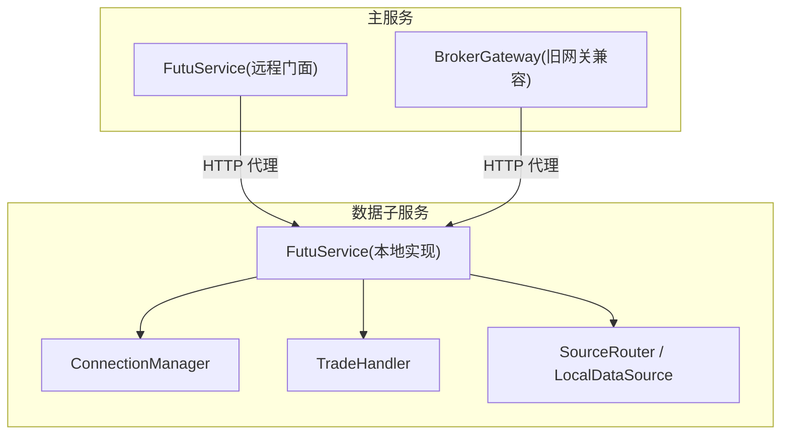
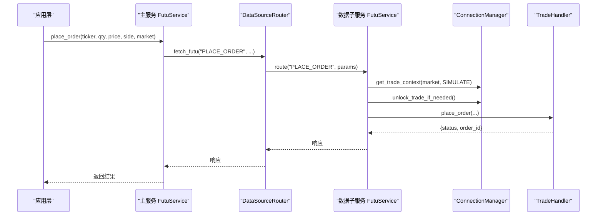
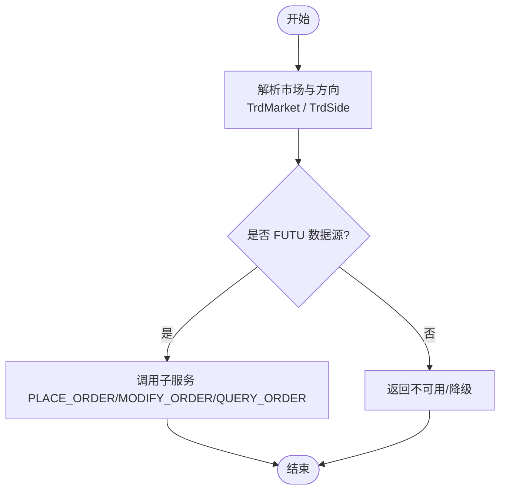
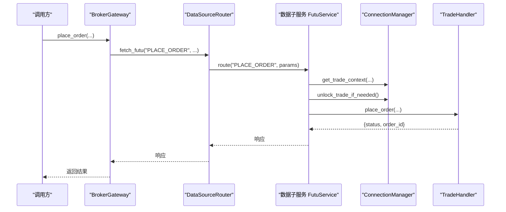
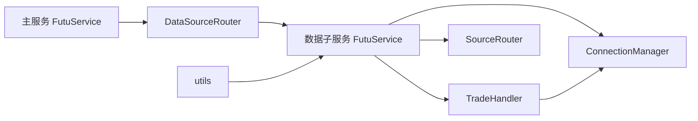

# 券商接口集成

<cite>
**本文引用的文件**
- [backend/services/futu/service.py](file://backend/services/futu/service.py)
- [data_subservice/futu_src/service.py](file://data_subservice/futu_src/service.py)
- [data_subservice/futu_src/connection_manager.py](file://data_subservice/futu_src/connection_manager.py)
- [data_subservice/futu_src/trade_handler.py](file://data_subservice/futu_src/trade_handler.py)
- [data_subservice/futu_src/source_router.py](file://data_subservice/futu_src/source_router.py)
- [data_subservice/futu_src/utils.py](file://data_subservice/futu_src/utils.py)
- [backend/services/adapters/legacy_broker.py](file://backend/services/adapters/legacy_broker.py)
- [backend/app/broker.py](file://backend/app/broker.py)
</cite>

## 目录
1. [简介](#简介)
2. [项目结构](#项目结构)
3. [核心组件](#核心组件)
4. [架构总览](#架构总览)
5. [详细组件分析](#详细组件分析)
6. [依赖关系分析](#依赖关系分析)
7. [性能与稳定性](#性能与稳定性)
8. [故障排查指南](#故障排查指南)
9. [结论](#结论)
10. [附录：新券商接入指南与测试要点](#附录：新券商接入指南与测试要点)

## 简介
本文件面向“券商接口集成”的落地实现，聚焦富途（Futu）在系统中的统一抽象、协议适配层、连接管理、认证授权以及可扩展的新券商接入方案。当前代码库已完整实现富途的数据源与交易通道，并通过主服务与数据子服务的分层设计，将直连富途 OpenD 的能力下沉到 data_subservice，主服务仅保留 HTTP 代理与统一门面。

## 项目结构
- 主服务（backend）
  - 提供统一的 Broker 门面与路由转发，不直接持有富途 SDK 或本地连接。
  - 通过 DataSourceRouter 将请求转发至 data_subservice 的 Futu Worker。
- 数据子服务（data_subservice/futu_src）
  - 封装富途 OpenD 的连接管理、行情/期权/资金流/卖空等数据能力、交易处理、推送桥接与缓存。
  - 提供 LocalDataSource 与 FutuSourceRouter，支持本地直连模式（当前默认）。
- 工具与枚举
  - ticker 格式化与不支持资产快速判断。
  - 订单方向与市场枚举透传。

图表来源
- [backend/services/futu/service.py:74-213](file://backend/services/futu/service.py#L74-L213)
- [data_subservice/futu_src/service.py:31-118](file://data_subservice/futu_src/service.py#L31-L118)
- [data_subservice/futu_src/connection_manager.py:44-159](file://data_subservice/futu_src/connection_manager.py#L44-L159)
- [data_subservice/futu_src/trade_handler.py:19-103](file://data_subservice/futu_src/trade_handler.py#L19-L103)
- [data_subservice/futu_src/source_router.py:18-80](file://data_subservice/futu_src/source_router.py#L18-L80)

章节来源
- [backend/services/futu/service.py:1-213](file://backend/services/futu/service.py#L1-L213)
- [data_subservice/futu_src/service.py:1-440](file://data_subservice/futu_src/service.py#L1-L440)
- [data_subservice/futu_src/connection_manager.py:1-351](file://data_subservice/futu_src/connection_manager.py#L1-L351)
- [data_subservice/futu_src/trade_handler.py:1-254](file://data_subservice/futu_src/trade_handler.py#L1-L254)
- [data_subservice/futu_src/source_router.py:1-80](file://data_subservice/futu_src/source_router.py#L1-L80)

## 核心组件
- 主服务 FutuService（远程门面）
  - 所有方法签名与原本地实现一致，内部通过 DataSourceRouter.fetch_futu(action, **params) 转发。
  - 不再持有本地 SDK 连接；连接状态以占位属性暴露给管理端点。
- 数据子服务 FutuService（本地实现）
  - 组合 ConnectionManager、各 Handler（行情、期权、卖空、选股、交易）、CacheManager。
  - 通过 SourceRouter 编排数据源（当前为 local），对外暴露统一异步 API。
- ConnectionManager
  - 负责 OpenQuoteContext 与 OpenSecTradeContext 的生命周期、跨网络加密握手、线程安全重连、推送回调注册。
  - 提供 switch_host 运行时切换目标、unlock_trade_if_needed 自动解锁。
- TradeHandler
  - 下单、改单/撤单、订单查询、账户信息、紧急清仓（Kill Switch）。
  - 统一使用 with_global_retry 重试策略，避免瞬时抖动导致失败。
- SourceRouter / LocalDataSource
  - 当前固定 local 模式，将 action 路由到具体 handler。
- utils
  - ticker 标准化与富途原生不支持资产的快速判定。

章节来源
- [backend/services/futu/service.py:74-213](file://backend/services/futu/service.py#L74-L213)
- [data_subservice/futu_src/service.py:31-118](file://data_subservice/futu_src/service.py#L31-L118)
- [data_subservice/futu_src/connection_manager.py:44-159](file://data_subservice/futu_src/connection_manager.py#L44-L159)
- [data_subservice/futu_src/trade_handler.py:19-103](file://data_subservice/futu_src/trade_handler.py#L19-L103)
- [data_subservice/futu_src/source_router.py:18-80](file://data_subservice/futu_src/source_router.py#L18-L80)
- [data_subservice/futu_src/utils.py:7-47](file://data_subservice/futu_src/utils.py#L7-L47)

## 架构总览
系统采用“主服务门面 + 数据子服务实现”的分层架构：
- 主服务只负责参数校验、枚举透传、HTTP 转发与兼容占位。
- 数据子服务承载真实连接、协议适配、错误码映射与业务逻辑。
- 通过 SourceRouter 与 Handler 解耦不同能力域，便于扩展新券商。

图表来源
- [backend/services/futu/service.py:179-190](file://backend/services/futu/service.py#L179-L190)
- [data_subservice/futu_src/service.py:409-418](file://data_subservice/futu_src/service.py#L409-L418)
- [data_subservice/futu_src/connection_manager.py:217-279](file://data_subservice/futu_src/connection_manager.py#L217-L279)
- [data_subservice/futu_src/trade_handler.py:25-63](file://data_subservice/futu_src/trade_handler.py#L25-L63)

## 详细组件分析

### 统一接口抽象（订单提交、查询、撤单）
- 主服务侧
  - 提供 place_order、modify_order、query_order、get_account_info 等方法，保持与原本地实现一致的签名。
  - 内部通过 _fetch -> DataSourceRouter.fetch_futu 转发到子服务。
- 子服务侧
  - FutuService 将 action 路由到对应 Handler（如 TradeHandler）。
  - TradeHandler 调用 ConnectionManager 获取交易上下文并执行下单/改单/查询。
- 市场与方向解析
  - BrokerGateway 根据 ticker/market 推断 TrdMarket，并将 side 转换为 TrdSide。

图表来源
- [backend/services/adapters/legacy_broker.py:25-74](file://backend/services/adapters/legacy_broker.py#L25-L74)
- [backend/services/futu/service.py:179-208](file://backend/services/futu/service.py#L179-L208)
- [data_subservice/futu_src/service.py:409-426](file://data_subservice/futu_src/service.py#L409-L426)

章节来源
- [backend/services/adapters/legacy_broker.py:17-109](file://backend/services/adapters/legacy_broker.py#L17-L109)
- [backend/services/futu/service.py:179-208](file://backend/services/futu/service.py#L179-L208)
- [data_subservice/futu_src/service.py:409-426](file://data_subservice/futu_src/service.py#L409-L426)

### 协议适配层（差异处理、格式转换、错误码映射）
- Ticker 标准化
  - 统一将用户输入转为富途标准格式（如 HK.00700、US.TSM、SH.600000）。
  - 对富途原生不支持的大类资产（外汇、加密货币、特定商品）快速拒绝。
- 错误码与异常
  - 子服务将富途 SDK 返回的 RET_OK 与否作为成功/失败依据，统一包装为 {"status":"success"/"error","message":...}。
  - 连接异常时 ConnectionManager 设置 status 与 error_msg，上层据此短路或重试。
- 推送与拉取
  - 连接成功后注册推送处理器，将富途实时推送桥接到 Redis PubSub；若禁用则退化为拉取模式。

章节来源
- [data_subservice/futu_src/utils.py:7-47](file://data_subservice/futu_src/utils.py#L7-L47)
- [data_subservice/futu_src/connection_manager.py:154-197](file://data_subservice/futu_src/connection_manager.py#L154-L197)
- [data_subservice/futu_src/trade_handler.py:25-103](file://data_subservice/futu_src/trade_handler.py#L25-L103)

### 连接管理（连接池、心跳检测、重连机制、负载均衡）
- 连接生命周期
  - ConnectionManager 维护 quote_ctx 与 trade_ctxs，确保线程安全创建与关闭。
  - connect() 中先探测 OpenD 可达性，再创建上下文；失败时设置 ERROR 状态与错误消息。
- 重连与自愈
  - 当 watchdog 标记 DISCONNECTED 后，connect() 会重建上下文并释放旧 ctx 的回调线程，避免线程泄漏。
- 跨网络加密
  - 非本地地址访问 OpenD 时启用 is_encrypt=True；客户端 RSA 私钥通过环境变量注入。
- 交易解锁
  - unlock_trade_if_needed 读取解锁密码环境变量，自动解锁；未配置时提示需手动解锁。
- 负载均衡与多节点
  - 当前 SourceRouter 固定 local 模式；如需多节点可在此扩展为轮询/权重策略。

章节来源
- [data_subservice/futu_src/connection_manager.py:59-159](file://data_subservice/futu_src/connection_manager.py#L59-L159)
- [data_subservice/futu_src/connection_manager.py:217-279](file://data_subservice/futu_src/connection_manager.py#L217-L279)
- [data_subservice/futu_src/connection_manager.py:302-345](file://data_subservice/futu_src/connection_manager.py#L302-L345)
- [data_subservice/futu_src/source_router.py:18-80](file://data_subservice/futu_src/source_router.py#L18-L80)

### 认证授权（API 密钥管理、会话保持、权限控制）
- 富途 OpenD 连接
  - 通过环境变量配置 host/port；跨网络时启用加密，需要客户端 RSA 私钥。
- 交易解锁
  - 通过 FUTU_TRD_UNLOCK_PWD/FUTU_TRADE_PWD 自动解锁；未配置时需人工在 OpenD 界面解锁。
- 权限控制
  - 主服务不持交易上下文，交易能力由子服务 gate 控制；健康检查用于上游门控。

章节来源
- [data_subservice/futu_src/connection_manager.py:31-42](file://data_subservice/futu_src/connection_manager.py#L31-L42)
- [data_subservice/futu_src/connection_manager.py:281-298](file://data_subservice/futu_src/connection_manager.py#L281-L298)
- [backend/services/adapters/legacy_broker.py:76-84](file://backend/services/adapters/legacy_broker.py#L76-L84)

### 关键流程时序图（下单/改单/查询）

图表来源
- [backend/services/adapters/legacy_broker.py:37-56](file://backend/services/adapters/legacy_broker.py#L37-L56)
- [data_subservice/futu_src/service.py:409-418](file://data_subservice/futu_src/service.py#L409-L418)
- [data_subservice/futu_src/connection_manager.py:217-279](file://data_subservice/futu_src/connection_manager.py#L217-L279)
- [data_subservice/futu_src/trade_handler.py:25-63](file://data_subservice/futu_src/trade_handler.py#L25-L63)

## 依赖关系分析
- 主服务 FutuService 依赖 DataSourceRouter，不直接 import futu SDK。
- 数据子服务 FutuService 依赖 ConnectionManager、各 Handler、SourceRouter。
- TradeHandler 依赖 ConnectionManager 获取交易上下文与解锁。
- utils 提供 ticker 格式化与不支持资产判断，被多处复用。

图表来源
- [backend/services/futu/service.py:74-213](file://backend/services/futu/service.py#L74-L213)
- [data_subservice/futu_src/service.py:31-118](file://data_subservice/futu_src/service.py#L31-L118)
- [data_subservice/futu_src/connection_manager.py:44-159](file://data_subservice/futu_src/connection_manager.py#L44-L159)
- [data_subservice/futu_src/trade_handler.py:19-103](file://data_subservice/futu_src/trade_handler.py#L19-L103)
- [data_subservice/futu_src/source_router.py:18-80](file://data_subservice/futu_src/source_router.py#L18-L80)
- [data_subservice/futu_src/utils.py:7-47](file://data_subservice/futu_src/utils.py#L7-L47)

章节来源
- [backend/services/futu/service.py:74-213](file://backend/services/futu/service.py#L74-L213)
- [data_subservice/futu_src/service.py:31-118](file://data_subservice/futu_src/service.py#L31-L118)
- [data_subservice/futu_src/connection_manager.py:44-159](file://data_subservice/futu_src/connection_manager.py#L44-L159)
- [data_subservice/futu_src/trade_handler.py:19-103](file://data_subservice/futu_src/trade_handler.py#L19-L103)
- [data_subservice/futu_src/source_router.py:18-80](file://data_subservice/futu_src/source_router.py#L18-L80)
- [data_subservice/futu_src/utils.py:7-47](file://data_subservice/futu_src/utils.py#L7-L47)

## 性能与稳定性
- 线程安全与防泄漏
  - ConnectionManager 在 connect() 中严格保护重复建连与旧 ctx 释放，防止回调线程累积。
  - 强制将 futu SDK 回调线程设为 daemon，进程退出即回收。
- 快速探测与短路
  - 连接前进行 TCP 可达性探测，避免 SDK 后台无限重试。
  - 交易上下文创建前同样探测，未连接直接拒绝，阻断潜在线程泄漏。
- 重试与熔断
  - TradeHandler 使用 with_global_retry 包裹关键操作，提升抗抖能力。
- 推送优化
  - 可选启用推送模式，减少轮询压力；禁用时退化为拉取。

章节来源
- [data_subservice/futu_src/connection_manager.py:27-42](file://data_subservice/futu_src/connection_manager.py#L27-L42)
- [data_subservice/futu_src/connection_manager.py:59-159](file://data_subservice/futu_src/connection_manager.py#L59-L159)
- [data_subservice/futu_src/connection_manager.py:217-279](file://data_subservice/futu_src/connection_manager.py#L217-L279)
- [data_subservice/futu_src/trade_handler.py:25-103](file://data_subservice/futu_src/trade_handler.py#L25-L103)

## 故障排查指南
- 无法连接 OpenD
  - 检查 FUTU_HOST/FUTU_PORT 配置与网络可达性；查看 ConnectionManager.status 与 error_msg。
- 交易不可用
  - 跨网络环境需配置 FUTU_RSA_PRIVATE_KEY 或 FUTU_TRD_UNLOCK_PWD；否则 get_trade_context 会拒绝创建。
- 线程数飙升
  - 确认每次重建上下文前已 close 旧 ctx；观察日志中的线程诊断输出。
- 推送失效
  - 检查 FUTU_PUSH_ENABLED 与事件循环设置；确认推送处理器注册成功。
- 订单查询为空
  - 确认 order_id 正确且处于查询范围内；TradeHandler 返回明确错误消息。

章节来源
- [data_subservice/futu_src/connection_manager.py:59-159](file://data_subservice/futu_src/connection_manager.py#L59-L159)
- [data_subservice/futu_src/connection_manager.py:217-279](file://data_subservice/futu_src/connection_manager.py#L217-L279)
- [data_subservice/futu_src/trade_handler.py:79-103](file://data_subservice/futu_src/trade_handler.py#L79-L103)

## 结论
当前实现以富途为核心，提供了稳定的连接管理、统一的订单接口、完善的错误与异常处理，并通过主服务与数据子服务的分层设计实现了良好的可扩展性。未来可在 SourceRouter 中引入多数据源路由策略，逐步接入 Interactive Brokers 与国内券商，复用统一的订单抽象与适配层。

## 附录：新券商接入指南与测试要点
- 接入步骤
  - 在 data_subservice 新增券商模块（如 ib/、cn_broker/），实现连接管理器、数据/交易 Handler。
  - 在 SourceRouter 中增加 new_mode 分支，按策略路由到对应实现。
  - 在主服务 FutuService 中增加 action 映射与参数转换（如必要）。
  - 在 BrokerGateway 中扩展市场/方向解析与新券商标识。
- 最小化改动原则
  - 保持外部 API 不变；新增券商仅影响内部路由与 Handler。
  - 复用 utils 中的 ticker 标准化与不支持资产判断。
- 测试要点
  - 连接与重连：模拟 OpenD 断连/恢复，验证状态切换与线程安全。
  - 订单流程：下单、改单、撤单、查询端到端路径；覆盖 RET_OK 与非 OK 分支。
  - 解锁与权限：未配置解锁密码时的行为；跨网络加密握手。
  - 推送与拉取：开启/关闭推送模式，验证数据一致性。
  - 性能与稳定性：高并发下单与查询，监控线程数与内存占用。
  - 错误码映射：验证各券商错误码统一映射为 {"status":"error","message":...}。

章节来源
- [data_subservice/futu_src/source_router.py:18-80](file://data_subservice/futu_src/source_router.py#L18-L80)
- [backend/services/futu/service.py:26-44](file://backend/services/futu/service.py#L26-L44)
- [backend/services/adapters/legacy_broker.py:25-74](file://backend/services/adapters/legacy_broker.py#L25-L74)
- [data_subservice/futu_src/utils.py:7-47](file://data_subservice/futu_src/utils.py#L7-L47)
