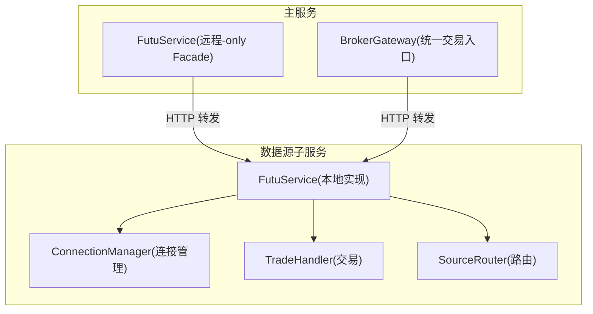
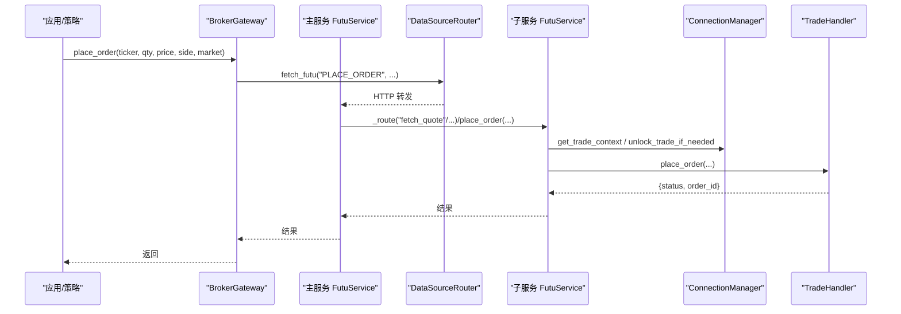
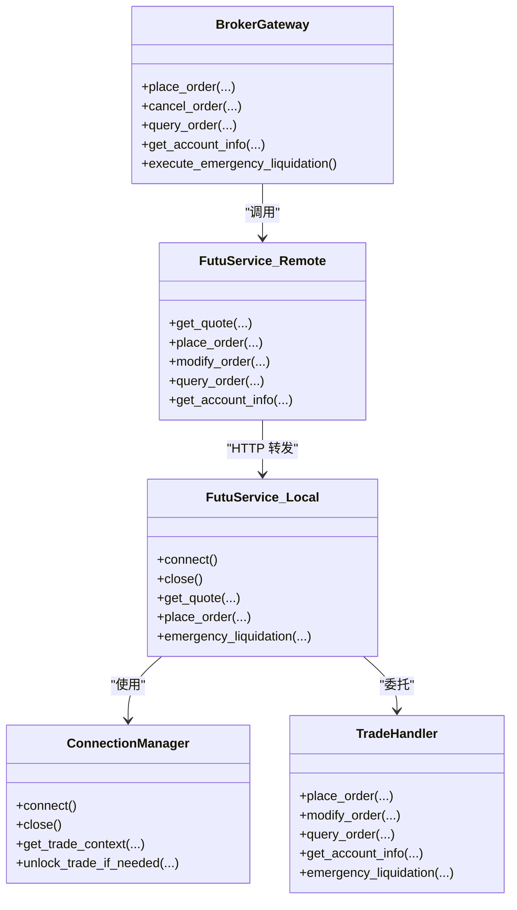
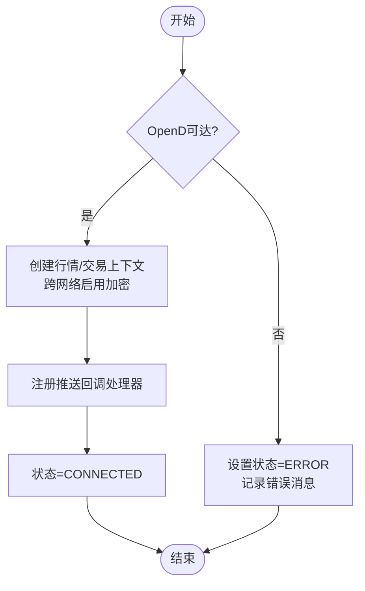
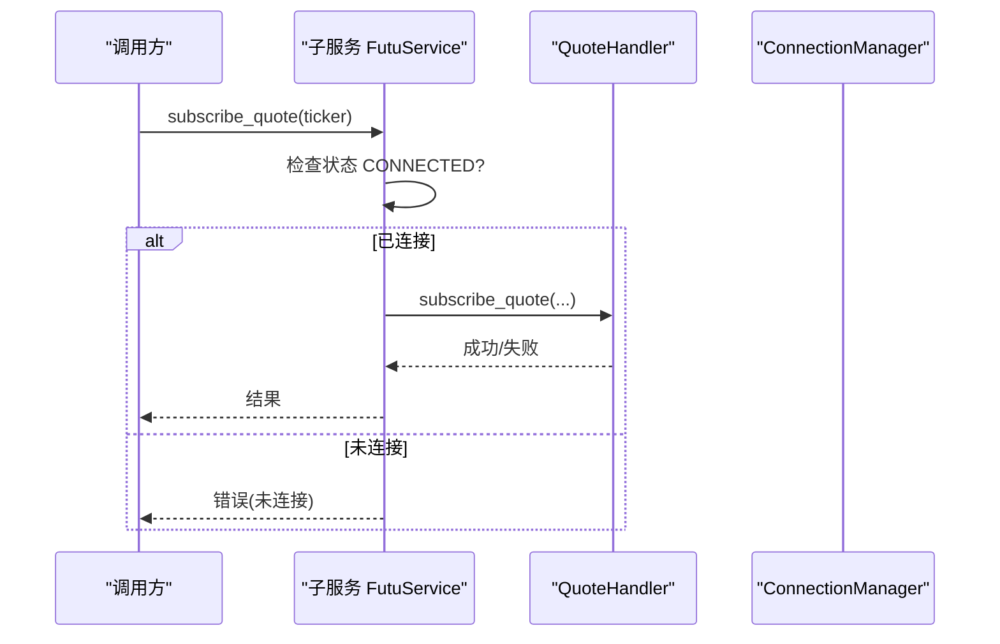
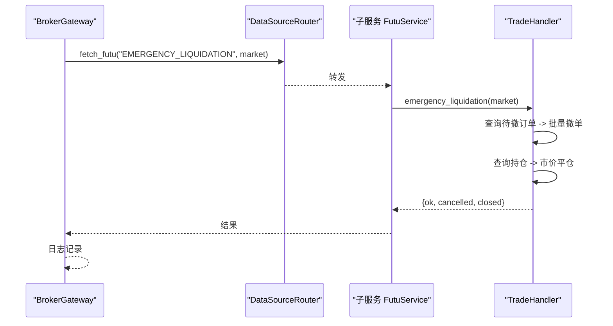
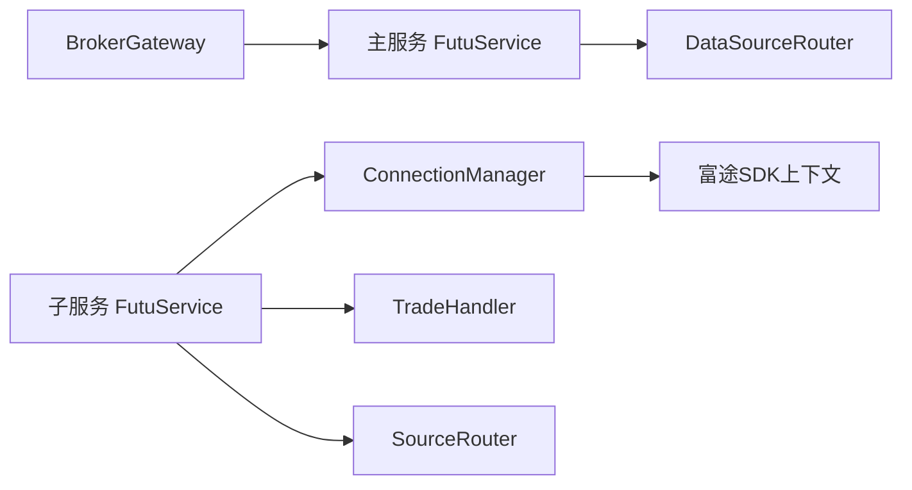

# 券商适配器实现

<cite>
**本文引用的文件**
- [backend/services/futu/service.py](file://backend/services/futu/service.py)
- [backend/services/adapters/legacy_broker.py](file://backend/services/adapters/legacy_broker.py)
- [backend/app/broker.py](file://backend/app/broker.py)
- [data_subservice/futu_src/service.py](file://data_subservice/futu_src/service.py)
- [data_subservice/futu_src/connection_manager.py](file://data_subservice/futu_src/connection_manager.py)
- [data_subservice/futu_src/trade_handler.py](file://data_subservice/futu_src/trade_handler.py)
- [data_subservice/futu_src/source_router.py](file://data_subservice/futu_src/source_router.py)
</cite>

## 目录
1. [简介](#简介)
2. [项目结构](#项目结构)
3. [核心组件](#核心组件)
4. [架构总览](#架构总览)
5. [详细组件分析](#详细组件分析)
6. [依赖关系分析](#依赖关系分析)
7. [性能与稳定性](#性能与稳定性)
8. [故障排查指南](#故障排查指南)
9. [结论](#结论)
10. [附录：新券商接入与测试要点](#附录新券商接入与测试要点)

## 简介
本文件面向“券商适配器”的实现，重点说明富途（Futu）适配器的完整落地方案，包括连接建立、认证解锁、数据订阅、订单管理等核心能力；并解释统一接口抽象设计如何通过适配器模式屏蔽不同券商API差异，提供标准化的下单、查询、撤单等接口。同时给出适配器注册机制、错误处理策略、性能优化方案，以及新券商接入的开发指南与测试要点。

## 项目结构
本项目采用“主服务 + 子服务”的解耦架构：
- 主服务（backend）：不直接持有券商SDK或长连接，仅通过统一的HTTP代理路由到数据源子服务。
- 数据源子服务（data_subservice）：实际对接富途OpenD，封装连接管理、行情/交易处理器、推送桥接等。

图表来源
- [backend/services/futu/service.py:74-108](file://backend/services/futu/service.py#L74-L108)
- [backend/services/adapters/legacy_broker.py:17-74](file://backend/services/adapters/legacy_broker.py#L17-L74)
- [data_subservice/futu_src/service.py:31-115](file://data_subservice/futu_src/service.py#L31-L115)
- [data_subservice/futu_src/connection_manager.py:44-159](file://data_subservice/futu_src/connection_manager.py#L44-L159)
- [data_subservice/futu_src/trade_handler.py:19-103](file://data_subservice/futu_src/trade_handler.py#L19-L103)
- [data_subservice/futu_src/source_router.py:18-67](file://data_subservice/futu_src/source_router.py#L18-L67)

章节来源
- [backend/services/futu/service.py:74-108](file://backend/services/futu/service.py#L74-L108)
- [backend/services/adapters/legacy_broker.py:17-74](file://backend/services/adapters/legacy_broker.py#L17-L74)
- [data_subservice/futu_src/service.py:31-115](file://data_subservice/futu_src/service.py#L31-L115)

## 核心组件
- 主服务侧富途Facade：纯HTTP透传，不持有任何本地SDK或连接，所有方法签名与原本地实现兼容，便于下游零改动迁移。
- BrokerGateway：统一交易入口，屏蔽市场/买卖方向等细节，对外暴露标准化下单、撤单、查询、账户信息、紧急清仓接口。
- 数据源子服务富途服务：整合连接管理、各功能Handler（行情、期权、卖空、选股、交易）、推送桥接与数据源路由。
- 连接管理器：负责OpenD连接生命周期、线程安全、跨网络加密、推送回调注册、运行时切换目标。
- 交易处理器：下单、改单/撤单、订单查询、账户信息与持仓、Kill Switch紧急清仓。
- 数据源路由器：在子服务内将请求路由到本地OpenD（当前为单一节点模式）。

章节来源
- [backend/services/futu/service.py:74-208](file://backend/services/futu/service.py#L74-L208)
- [backend/services/adapters/legacy_broker.py:17-108](file://backend/services/adapters/legacy_broker.py#L17-L108)
- [data_subservice/futu_src/service.py:31-435](file://data_subservice/futu_src/service.py#L31-L435)
- [data_subservice/futu_src/connection_manager.py:44-351](file://data_subservice/futu_src/connection_manager.py#L44-L351)
- [data_subservice/futu_src/trade_handler.py:19-254](file://data_subservice/futu_src/trade_handler.py#L19-L254)
- [data_subservice/futu_src/source_router.py:18-80](file://data_subservice/futu_src/source_router.py#L18-L80)

## 架构总览
整体采用“适配器+门面+路由”的分层设计：
- 上层应用通过broker门面调用统一交易接口。
- 主服务FutuService作为远程-only门面，将所有动作经DataSourceRouter转发至子服务。
- 子服务FutuService组合各Handler并通过SourceRouter选择数据源（当前为local直连OpenD）。
- ConnectionManager统一管理OpenD连接、推送回调、交易上下文与解锁。
- TradeHandler封装下单、改单/撤单、查询、账户信息、紧急清仓等业务逻辑。

图表来源
- [backend/services/adapters/legacy_broker.py:37-74](file://backend/services/adapters/legacy_broker.py#L37-L74)
- [backend/services/futu/service.py:105-108](file://backend/services/futu/service.py#L105-L108)
- [data_subservice/futu_src/service.py:101-115](file://data_subservice/futu_src/service.py#L101-L115)
- [data_subservice/futu_src/connection_manager.py:217-279](file://data_subservice/futu_src/connection_manager.py#L217-L279)
- [data_subservice/futu_src/trade_handler.py:25-63](file://data_subservice/futu_src/trade_handler.py#L25-L63)

## 详细组件分析

### 统一接口抽象与适配器模式
- 主服务FutuService：保持与原本地实现一致的函数签名，内部仅做参数映射与HTTP转发，屏蔽底层差异。
- BrokerGateway：对trd_side、market进行解析与归一化，向上暴露简洁的下单、撤单、查询、账户信息、紧急清仓接口。
- 子服务FutuService：按功能拆分为多个Handler，统一通过_route分发，便于扩展与维护。

图表来源
- [backend/services/adapters/legacy_broker.py:17-108](file://backend/services/adapters/legacy_broker.py#L17-L108)
- [backend/services/futu/service.py:74-208](file://backend/services/futu/service.py#L74-L208)
- [data_subservice/futu_src/service.py:31-435](file://data_subservice/futu_src/service.py#L31-L435)
- [data_subservice/futu_src/connection_manager.py:44-351](file://data_subservice/futu_src/connection_manager.py#L44-L351)
- [data_subservice/futu_src/trade_handler.py:19-254](file://data_subservice/futu_src/trade_handler.py#L19-L254)

章节来源
- [backend/services/adapters/legacy_broker.py:17-108](file://backend/services/adapters/legacy_broker.py#L17-L108)
- [backend/services/futu/service.py:74-208](file://backend/services/futu/service.py#L74-L208)
- [data_subservice/futu_src/service.py:31-435](file://data_subservice/futu_src/service.py#L31-L435)

### 连接建立与认证流程
- 连接建立：
  - 子服务ConnectionManager.connect()负责创建OpenQuoteContext，支持跨网络加密连接，并在成功后注册推送回调处理器。
  - 连接前进行快速可达性探测，避免无谓重试；失败时设置ERROR状态与错误消息。
- 交易认证与解锁：
  - 获取交易上下文时，若跨网络且未配置解锁密码或客户端RSA私钥，则拒绝创建以避免线程泄漏。
  - 交易操作前统一调用unlock_trade_if_needed，自动尝试解锁；若失败则返回锁定状态供上层隔离处理。

图表来源
- [data_subservice/futu_src/connection_manager.py:59-159](file://data_subservice/futu_src/connection_manager.py#L59-L159)
- [data_subservice/futu_src/connection_manager.py:217-279](file://data_subservice/futu_src/connection_manager.py#L217-L279)
- [data_subservice/futu_src/connection_manager.py:281-298](file://data_subservice/futu_src/connection_manager.py#L281-L298)

章节来源
- [data_subservice/futu_src/connection_manager.py:59-159](file://data_subservice/futu_src/connection_manager.py#L59-L159)
- [data_subservice/futu_src/connection_manager.py:217-298](file://data_subservice/futu_src/connection_manager.py#L217-L298)

### 数据订阅与实时推送
- 订阅/退订：
  - 子服务FutuService提供subscribe_quote/unsubscribe_quote，仅在CONNECTED状态下执行。
  - 通过quote_handler完成富途SDK的订阅/退订调用。
- 推送桥接：
  - 连接成功后注册推送处理器，将富途实时推送桥接到系统内部通道（如Redis PubSub），供上层消费。
  - 可通过环境变量控制是否启用推送模式。

图表来源
- [data_subservice/futu_src/service.py:146-156](file://data_subservice/futu_src/service.py#L146-L156)
- [data_subservice/futu_src/connection_manager.py:161-197](file://data_subservice/futu_src/connection_manager.py#L161-L197)

章节来源
- [data_subservice/futu_src/service.py:146-156](file://data_subservice/futu_src/service.py#L146-L156)
- [data_subservice/futu_src/connection_manager.py:161-197](file://data_subservice/futu_src/connection_manager.py#L161-L197)

### 订单管理与紧急清仓
- 下单：
  - BrokerGateway.resolve_market解析市场与买卖方向，调用DataSourceRouter.fetch_futu("PLACE_ORDER")。
  - 子服务TradeHandler.place_order获取交易上下文并下单，返回订单号。
- 改单/撤单：
  - BrokerGateway.cancel_order调用MODIFY_ORDER(CANCEL)。
  - TradeHandler.modify_order执行撤单。
- 订单查询：
  - query_order返回订单状态与成交均价等信息。
- 紧急清仓（Kill Switch）：
  - BrokerGateway.execute_emergency_liquidation触发远程清仓。
  - TradeHandler.emergency_liquidation先查询待撤订单并批量撤单，再查询持仓并以市价平仓，返回执行统计。

图表来源
- [backend/services/adapters/legacy_broker.py:86-105](file://backend/services/adapters/legacy_broker.py#L86-L105)
- [data_subservice/futu_src/trade_handler.py:105-177](file://data_subservice/futu_src/trade_handler.py#L105-L177)

章节来源
- [backend/services/adapters/legacy_broker.py:37-105](file://backend/services/adapters/legacy_broker.py#L37-L105)
- [data_subservice/futu_src/trade_handler.py:25-177](file://data_subservice/futu_src/trade_handler.py#L25-L177)

### 数据源路由与模式
- SourceRouter在当前部署中为单一节点模式，始终路由到本地OpenD。
- 保留switch_mode接口以兼容未来多节点/远程降级场景。

章节来源
- [data_subservice/futu_src/source_router.py:18-80](file://data_subservice/futu_src/source_router.py#L18-L80)

## 依赖关系分析
- 主服务FutuService依赖DataSourceRouter进行HTTP转发，不直接导入富途SDK。
- BrokerGateway依赖FutuService与枚举类型进行参数归一化。
- 子服务FutuService依赖ConnectionManager、各Handler与SourceRouter。
- ConnectionManager依赖富途SDK上下文对象与环境变量配置。
- TradeHandler依赖ConnectionManager提供的交易上下文与解锁能力。

图表来源
- [backend/services/futu/service.py:105-108](file://backend/services/futu/service.py#L105-L108)
- [backend/services/adapters/legacy_broker.py:17-74](file://backend/services/adapters/legacy_broker.py#L17-L74)
- [data_subservice/futu_src/service.py:31-115](file://data_subservice/futu_src/service.py#L31-L115)
- [data_subservice/futu_src/connection_manager.py:44-159](file://data_subservice/futu_src/connection_manager.py#L44-L159)
- [data_subservice/futu_src/trade_handler.py:19-103](file://data_subservice/futu_src/trade_handler.py#L19-L103)
- [data_subservice/futu_src/source_router.py:18-67](file://data_subservice/futu_src/source_router.py#L18-L67)

章节来源
- [backend/services/futu/service.py:105-108](file://backend/services/futu/service.py#L105-L108)
- [backend/services/adapters/legacy_broker.py:17-74](file://backend/services/adapters/legacy_broker.py#L17-L74)
- [data_subservice/futu_src/service.py:31-115](file://data_subservice/futu_src/service.py#L31-L115)
- [data_subservice/futu_src/connection_manager.py:44-159](file://data_subservice/futu_src/connection_manager.py#L44-L159)
- [data_subservice/futu_src/trade_handler.py:19-103](file://data_subservice/futu_src/trade_handler.py#L19-L103)
- [data_subservice/futu_src/source_router.py:18-67](file://data_subservice/futu_src/source_router.py#L18-L67)

## 性能与稳定性
- 线程安全与防泄漏：
  - connect()在已有CONNECTED且ctx存活时跳过重复建连，避免回调线程累积。
  - close()显式释放旧上下文，防止GC前的线程泄漏。
  - 强制将SDK回调线程设为daemon，进程退出即回收。
- 快速探测与降级：
  - 连接前进行TCP可达性探测，不可达时立即返回ERROR，避免SDK内部重试风暴。
  - 子服务SourceRouter当前固定为local模式，简化路径、降低延迟。
- 推送模式开关：
  - 可通过环境变量控制是否启用推送，禁用时退化为拉取模式，减少资源占用。
- 交易上下文保护：
  - 跨网络交易连接需配置解锁密码或客户端RSA私钥，否则拒绝创建以避免无限重试与线程耗尽。
- 重试与容错：
  - 交易操作使用全局重试装饰器，提升弱网环境下的成功率。

章节来源
- [data_subservice/futu_src/connection_manager.py:27-42](file://data_subservice/futu_src/connection_manager.py#L27-L42)
- [data_subservice/futu_src/connection_manager.py:79-159](file://data_subservice/futu_src/connection_manager.py#L79-L159)
- [data_subservice/futu_src/connection_manager.py:199-208](file://data_subservice/futu_src/connection_manager.py#L199-L208)
- [data_subservice/futu_src/connection_manager.py:217-279](file://data_subservice/futu_src/connection_manager.py#L217-L279)
- [data_subservice/futu_src/connection_manager.py:281-298](file://data_subservice/futu_src/connection_manager.py#L281-L298)
- [data_subservice/futu_src/source_router.py:34-41](file://data_subservice/futu_src/source_router.py#L34-L41)
- [data_subservice/futu_src/trade_handler.py:25-103](file://data_subservice/futu_src/trade_handler.py#L25-L103)

## 故障排查指南
- OpenD不可达：
  - 现象：连接失败，状态为ERROR，错误消息包含主机与端口。
  - 排查：检查FUTU_HOST/FUTU_PORT配置与网络连通性。
- 交易连接被屏蔽：
  - 现象：跨网络交易上下文创建失败，提示需要解锁密码或RSA私钥。
  - 排查：配置FUTU_PWD_UNLOCK或FUTU_RSA_PRIVATE_KEY后重启子服务。
- 推送回调不可用：
  - 现象：推送模式未激活，退化为拉取模式。
  - 排查：确认FUTU_PUSH_ENABLED=true，并确保事件循环已设置。
- Kill Switch失败：
  - 现象：远程清仓返回错误或不期望的结构。
  - 排查：检查子服务健康状态与返回结构，查看日志中的错误原因。

章节来源
- [data_subservice/futu_src/connection_manager.py:59-159](file://data_subservice/futu_src/connection_manager.py#L59-L159)
- [data_subservice/futu_src/connection_manager.py:217-279](file://data_subservice/futu_src/connection_manager.py#L217-L279)
- [data_subservice/futu_src/connection_manager.py:161-197](file://data_subservice/futu_src/connection_manager.py#L161-L197)
- [backend/services/adapters/legacy_broker.py:86-105](file://backend/services/adapters/legacy_broker.py#L86-L105)

## 结论
本项目通过“主服务远程-only Facade + 子服务本地实现”的架构，实现了富途适配器的稳定、可扩展与可观测。统一接口抽象屏蔽了底层差异，连接管理与推送桥接保障了高可用与低延迟，交易上下文保护与重试机制提升了鲁棒性。该设计也为后续接入其他券商（如Interactive Brokers FIX协议、国内券商HTTP API）提供了清晰的扩展点。

## 附录：新券商接入与测试要点
- 接入步骤建议：
  - 定义统一适配器接口（下单、撤单、查询、账户信息等），与现有BrokerGateway保持一致。
  - 在子服务新增对应Handler，复用ConnectionManager或新建连接管理器。
  - 在主服务FutuService中增加新的action映射与HTTP转发逻辑。
  - 在SourceRouter中扩展路由策略（如auto模式：本地优先，不可用时降级到远程）。
- 关键测试用例：
  - 连接建立与断开：验证CONNECTED/DISCONNECTED/ERROR状态转换。
  - 推送订阅/退订：验证推送回调注册与事件桥接。
  - 下单/改单/撤单/查询：覆盖正常与异常分支，校验返回结构与重试行为。
  - 紧急清仓：验证撤单与市价平仓的执行统计与日志。
  - 跨网络交易认证：验证解锁失败时的隔离与错误上报。
  - 性能压测：在高并发下观察线程数、内存与延迟指标，确保无泄漏。

[本节为概念性指导，不直接分析具体文件]