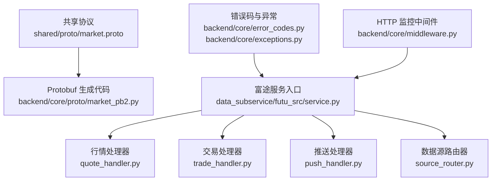
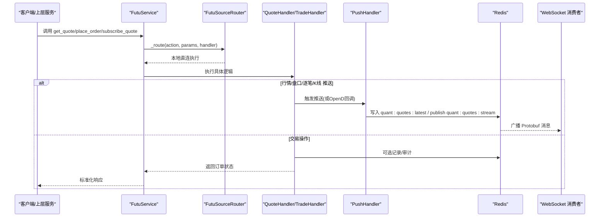
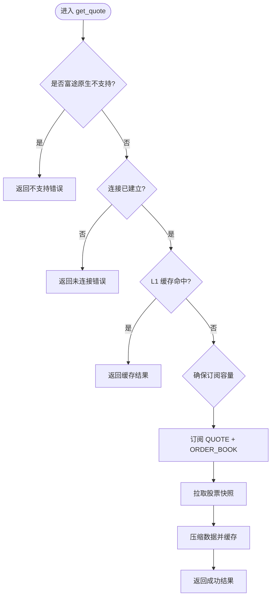
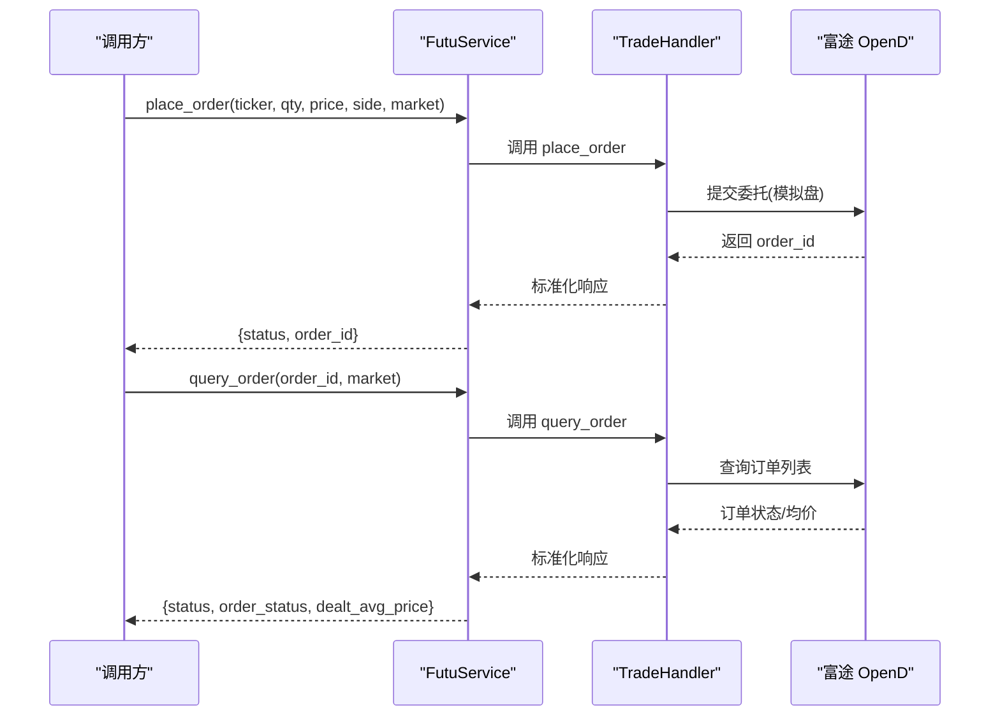
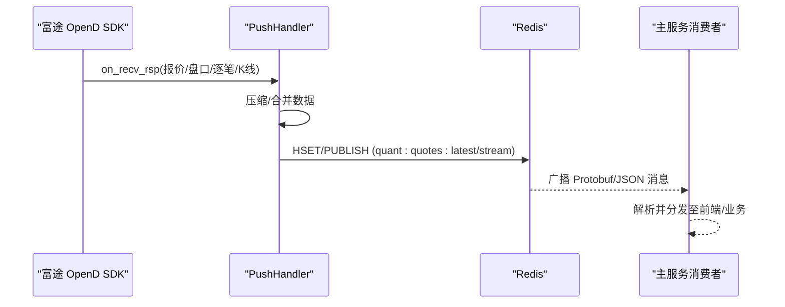
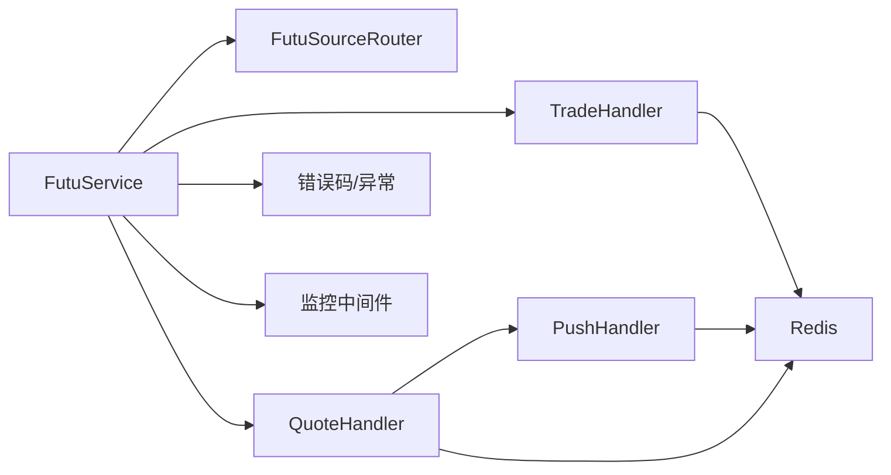

# 协议处理层

<cite>
**本文引用的文件**
- [market.proto](file://shared/proto/market.proto)
- [market_pb2.py](file://backend/core/proto/market_pb2.py)
- [service.py](file://data_subservice/futu_src/service.py)
- [quote_handler.py](file://data_subservice/futu_src/quote_handler.py)
- [trade_handler.py](file://data_subservice/futu_src/trade_handler.py)
- [push_handler.py](file://data_subservice/futu_src/push_handler.py)
- [source_router.py](file://data_subservice/futu_src/source_router.py)
- [error_codes.py](file://backend/core/error_codes.py)
- [exceptions.py](file://backend/core/exceptions.py)
- [middleware.py](file://backend/core/middleware.py)
</cite>

## 目录
1. [简介](#简介)
2. [项目结构](#项目结构)
3. [核心组件](#核心组件)
4. [架构总览](#架构总览)
5. [详细组件分析](#详细组件分析)
6. [依赖关系分析](#依赖关系分析)
7. [性能考量](#性能考量)
8. [故障排查指南](#故障排查指南)
9. [结论](#结论)
10. [附录](#附录)

## 简介
本文件聚焦“协议处理层”，围绕多协议支持架构、富途（Futu）协议处理、协议转换机制、协议验证与错误码映射、异常处理策略，以及协议扩展与调试工具使用进行系统化说明。目标是让读者理解：
- 如何通过统一的内部标准格式屏蔽不同数据源/券商的私有协议差异；
- 如何对富途市场数据、订单状态同步与实时推送消息进行解析与转发；
- 如何在保证一致性的前提下实现可扩展的协议适配与健壮的错误处理。

## 项目结构
协议处理相关的关键位置与职责如下：
- shared/proto/market.proto：定义内部标准行情协议（QuoteData、Order），用于跨进程/服务间序列化传输。
- backend/core/proto/market_pb2.py：由 market.proto 生成的 Python Protobuf 代码，供读写 QuoteData 等消息。
- data_subservice/futu_src/*：富途协议适配层，包含服务入口、行情/交易处理器、推送桥接、数据源路由等。
- backend/core/*：全局错误码、自定义异常、HTTP 中间件监控等基础设施。

图表来源
- [market.proto:1-22](file://shared/proto/market.proto#L1-L22)
- [market_pb2.py:1-34](file://backend/core/proto/market_pb2.py#L1-L34)
- [service.py:31-118](file://data_subservice/futu_src/service.py#L31-L118)
- [quote_handler.py:74-127](file://data_subservice/futu_src/quote_handler.py#L74-L127)
- [trade_handler.py:19-103](file://data_subservice/futu_src/trade_handler.py#L19-L103)
- [push_handler.py:58-98](file://data_subservice/futu_src/push_handler.py#L58-L98)
- [source_router.py:18-80](file://data_subservice/futu_src/source_router.py#L18-L80)
- [error_codes.py:15-55](file://backend/core/error_codes.py#L15-L55)
- [exceptions.py:14-144](file://backend/core/exceptions.py#L14-L144)
- [middleware.py:90-133](file://backend/core/middleware.py#L90-L133)

章节来源
- [market.proto:1-22](file://shared/proto/market.proto#L1-L22)
- [market_pb2.py:1-34](file://backend/core/proto/market_pb2.py#L1-L34)
- [service.py:31-118](file://data_subservice/futu_src/service.py#L31-L118)
- [source_router.py:18-80](file://data_subservice/futu_src/source_router.py#L18-L80)

## 核心组件
- 内部标准协议（Protobuf）
  - 定义 Order（价格、数量）与 QuoteData（状态、标的、最新价、涨跌幅、成交量字符串、买卖盘、来源）。
  - 通过 market_pb2.py 在运行时序列化为二进制，写入 Redis 并广播到流式通道。
- 富途服务入口（FutuService）
  - 统一封装连接管理、缓存、各 Handler（行情/期权/卖空/选股/交易）、数据源路由。
  - 对外暴露一致的异步接口，内部通过 _route 委派给 FutuSourceRouter。
- 行情处理器（QuoteHandler）
  - 负责实时报价、历史K线、盘口深度、板块热力图、资金流向等。
  - 维护订阅槽位（LRU）、缓存（内存+Redis）、降级与重试。
- 交易处理器（TradeHandler）
  - 下单、改单、撤单、订单查询、账户信息、紧急平仓（Kill Switch）。
- 推送处理器（PushHandler）
  - 将富途 OpenD 的实时推送（报价、盘口、逐笔、经纪商队列、K线）桥接到 Redis Pub/Sub，统一以 Protobuf 或 JSON 发布到主服务可消费的频道。
- 数据源路由器（FutuSourceRouter）
  - 当前为本地直连模式，预留切换能力，统一返回结果或不可用响应。
- 错误码与异常体系
  - ErrorCode 枚举与 HTTP 状态码映射；QuantBaseException 及其子类统一业务异常；AppError 兼容编排层。
- HTTP 监控中间件
  - 记录请求计数、延迟直方图、外部 API 调用指标，辅助定位慢请求与异常。

章节来源
- [market.proto:1-22](file://shared/proto/market.proto#L1-L22)
- [market_pb2.py:1-34](file://backend/core/proto/market_pb2.py#L1-L34)
- [service.py:31-118](file://data_subservice/futu_src/service.py#L31-L118)
- [quote_handler.py:74-127](file://data_subservice/futu_src/quote_handler.py#L74-L127)
- [trade_handler.py:19-103](file://data_subservice/futu_src/trade_handler.py#L19-L103)
- [push_handler.py:58-98](file://data_subservice/futu_src/push_handler.py#L58-L98)
- [source_router.py:18-80](file://data_subservice/futu_src/source_router.py#L18-L80)
- [error_codes.py:15-55](file://backend/core/error_codes.py#L15-L55)
- [exceptions.py:14-144](file://backend/core/exceptions.py#L14-L144)
- [middleware.py:90-133](file://backend/core/middleware.py#L90-L133)

## 架构总览
协议处理层采用“适配器 + 转换器”的设计：
- 上游（富途 OpenD SDK）提供私有协议与回调；
- 适配器层（Handlers）将私有协议转换为内部标准模型；
- 转换器（PushHandler）将内部标准模型序列化为 Protobuf 并通过 Redis 广播；
- 下游（主服务 WebSocket/业务逻辑）消费统一格式，屏蔽底层差异。

图表来源
- [service.py:101-118](file://data_subservice/futu_src/service.py#L101-L118)
- [source_router.py:45-80](file://data_subservice/futu_src/source_router.py#L45-L80)
- [quote_handler.py:104-127](file://data_subservice/futu_src/quote_handler.py#L104-L127)
- [push_handler.py:58-98](file://data_subservice/futu_src/push_handler.py#L58-L98)

## 详细组件分析

### 内部标准协议（Protobuf）
- 数据结构
  - Order：price、size，表示买卖盘一档。
  - QuoteData：status、ticker、last_price、change_pct、volume_str、bids、asks、source。
- 序列化与版本兼容
  - 使用 proto3 语法，字段编号稳定，新增字段时保持向后兼容。
  - 通过 market_pb2.py 在 Python 中构建/解析消息，确保跨进程一致性。
- 使用场景
  - 推送处理器将富途推送数据压缩后构造 QuoteData，写入 Redis 并广播到主流。

章节来源
- [market.proto:1-22](file://shared/proto/market.proto#L1-L22)
- [market_pb2.py:1-34](file://backend/core/proto/market_pb2.py#L1-L34)
- [push_handler.py:58-98](file://data_subservice/futu_src/push_handler.py#L58-L98)

### 富途协议处理：市场数据
- 实时报价与盘口
  - QuoteHandler.get_quote：检查不支持资产、开发环境 Mock、连接状态、LRU 容量、同时订阅 QUOTE 与 ORDER_BOOK、拉取快照并缓存。
  - QuoteHandler.get_order_book：获取 Level 2 盘口，合并 bids/asks，设置短 TTL 缓存。
- 历史K线与分页
  - QuoteHandler.get_history：优先 get_cur_kline（num≤370），否则降级 request_history_kline 分页拼接，按时间排序并截取最近 num 根。
- 板块与资金流
  - get_heat_map_data：市场映射（A/CN→SH）、指定 plate_type 提高成功率。
  - get_hk_sector_flow：行业板块列表→龙头成分股→聚合主力净流入，带强缓存与降级。
- 订阅与退订
  - subscribe_quote/unsubscribe_quote：批量退订释放槽位，避免频繁 API 调用。

图表来源
- [quote_handler.py:81-127](file://data_subservice/futu_src/quote_handler.py#L81-L127)

章节来源
- [quote_handler.py:81-127](file://data_subservice/futu_src/quote_handler.py#L81-L127)
- [quote_handler.py:396-530](file://data_subservice/futu_src/quote_handler.py#L396-L530)
- [quote_handler.py:532-604](file://data_subservice/futu_src/quote_handler.py#L532-L604)
- [quote_handler.py:607-656](file://data_subservice/futu_src/quote_handler.py#L607-L656)

### 富途协议处理：订单状态同步
- 下单与改单
  - TradeHandler.place_order：根据价格判断限价/市价，提交模拟盘委托，返回 order_id。
  - TradeHandler.modify_order：支持撤单等操作，返回统一状态。
- 订单查询
  - TradeHandler.query_order：查询订单状态、成交均价，并在关键状态更新时记录日志。
- 紧急平仓（Kill Switch）
  - TradeHandler.emergency_liquidation：先查询待提交/已提交订单并批量撤单，再查询持仓并市价反向平仓，返回统计结果。

图表来源
- [trade_handler.py:25-103](file://data_subservice/futu_src/trade_handler.py#L25-L103)
- [service.py:409-418](file://data_subservice/futu_src/service.py#L409-L418)

章节来源
- [trade_handler.py:25-103](file://data_subservice/futu_src/trade_handler.py#L25-L103)
- [service.py:409-418](file://data_subservice/futu_src/service.py#L409-L418)

### 实时推送消息处理
- 推送桥接
  - PushHandler 接收富途 SDK 回调（报价、盘口、逐笔、经纪商队列、K线），通过事件循环调度安全地写入 Redis。
- 统一发布
  - 报价：构造 QuoteData（Protobuf），写入 quant:quotes:latest 并发布到 quant:quotes:stream。
  - 盘口：读取最新报价，合并 bids/asks 后重新发布主流；若无现有报价则创建仅含盘口的 QuoteData 发布。
  - 逐笔/经纪商/K线：以 JSON 形式发布到专用频道，并桥接到统一 quant:* 旁路，便于主服务集中消费。
- 线程安全
  - 使用 run_coroutine_threadsafe 从 SDK 回调线程切换到主事件循环，避免竞态。

图表来源
- [push_handler.py:58-98](file://data_subservice/futu_src/push_handler.py#L58-L98)
- [push_handler.py:175-249](file://data_subservice/futu_src/push_handler.py#L175-L249)
- [push_handler.py:252-386](file://data_subservice/futu_src/push_handler.py#L252-L386)

章节来源
- [push_handler.py:58-98](file://data_subservice/futu_src/push_handler.py#L58-L98)
- [push_handler.py:175-249](file://data_subservice/futu_src/push_handler.py#L175-L249)
- [push_handler.py:252-386](file://data_subservice/futu_src/push_handler.py#L252-L386)

### 协议转换机制
- 目标
  - 将富途私有协议（SDK 回调/返回值）转换为内部标准格式（QuoteData、统一字典结构），确保上下游一致性。
- 实现要点
  - 行情：将 DataFrame/Dict 行压缩为标准字段（last_price、change_pct、volume_str、bids/asks），并标记 source。
  - 盘口：合并 bids/asks，必要时重建 QuoteData 并发布到主流。
  - 交易：统一返回 {status, message, ...} 结构，隐藏底层差异。
- 优势
  - 上层无需感知富途 SDK 细节；新增数据源只需实现适配器与转换器。

章节来源
- [quote_handler.py:81-127](file://data_subservice/futu_src/quote_handler.py#L81-L127)
- [push_handler.py:58-98](file://data_subservice/futu_src/push_handler.py#L58-L98)
- [trade_handler.py:25-103](file://data_subservice/futu_src/trade_handler.py#L25-L103)

### 协议验证、错误码映射与异常处理
- 错误码
  - ErrorCode 定义成功与各域错误码（认证/鉴权、请求/资源、基础设施、内部未知），并提供 HTTP 状态码映射表。
- 异常体系
  - QuantBaseException 及其子类（DataSourceError、AuthMissingError、TokenExpiredError、ValidationError、ResourceNotFoundError、FutuDisconnectedError、RedisUnavailableError、CircuitBreakerOpenError、AppError）。
- 中间件监控
  - AccessLogMiddleware 记录请求计数、延迟直方图、外部 API 指标，帮助识别慢请求与异常路径。
- 策略
  - 在 Handler 中捕获异常并返回结构化错误；在更高层统一转换为 HTTP 响应；对基础设施错误（如断开、熔断）做快速失败与降级。

章节来源
- [error_codes.py:15-55](file://backend/core/error_codes.py#L15-L55)
- [exceptions.py:14-144](file://backend/core/exceptions.py#L14-L144)
- [middleware.py:90-133](file://backend/core/middleware.py#L90-L133)

### 协议扩展指南
- 新增数据源/券商的步骤
  - 定义适配器：实现与目标协议的交互（连接、订阅、拉取、回调）。
  - 实现转换器：将私有协议转换为内部标准格式（QuoteData、统一字典）。
  - 注册推送处理器：如需实时推送，参照 PushHandler 模式桥接到 Redis。
  - 接入路由：在 FutuSourceRouter 中增加新模式的分支（当前为 local-only，可扩展 remote/auto）。
  - 错误与监控：复用 ErrorCode/Exceptions，并在中间件中观察指标。
- 版本兼容性
  - Protobuf 字段编号稳定，新增字段不影响旧客户端；谨慎修改已有字段语义。
  - 在转换器中保留默认值与兼容逻辑，避免破坏下游。

[本节为概念性指导，不直接分析具体文件]

### 调试工具使用方法
- 开发与测试
  - 开发环境可通过环境变量启用 MockProvider，跳过真实 OpenD 连接，快速验证流程。
  - 使用 with_global_retry 装饰器对易错调用进行重试，降低偶发网络抖动影响。
- 观测与诊断
  - 通过 Prometheus 指标（请求数、延迟、外部 API 耗时）定位瓶颈。
  - 关注 PushHandler 日志与 Redis 频道（quant:quotes:stream、futu:push:*）确认推送链路。
  - 使用 source_router.status() 查看当前模式与本地状态。

章节来源
- [quote_handler.py:81-127](file://data_subservice/futu_src/quote_handler.py#L81-L127)
- [push_handler.py:58-98](file://data_subservice/futu_src/push_handler.py#L58-L98)
- [source_router.py:71-80](file://data_subservice/futu_src/source_router.py#L71-L80)
- [middleware.py:90-133](file://backend/core/middleware.py#L90-L133)

## 依赖关系分析
- 组件耦合
  - FutuService 依赖 ConnectionManager、CacheManager、各 Handler、SourceRouter。
  - QuoteHandler/TradeHandler 依赖 futu SDK 与 Redis（通过 push_handler）。
  - PushHandler 依赖 Redis 与 Protobuf 生成代码。
- 外部依赖
  - futu-api SDK（行情/交易/回调）；Redis（缓存与 Pub/Sub）；Prometheus（监控）。
- 潜在风险
  - SDK 回调线程与异步事件循环的切换需严格保护；
  - 订阅槽位有限，需 LRU 淘汰与批量退订；
  - 外部 API 超时/限流需重试与熔断。

图表来源
- [service.py:31-118](file://data_subservice/futu_src/service.py#L31-L118)
- [quote_handler.py:74-127](file://data_subservice/futu_src/quote_handler.py#L74-L127)
- [trade_handler.py:19-103](file://data_subservice/futu_src/trade_handler.py#L19-L103)
- [push_handler.py:58-98](file://data_subservice/futu_src/push_handler.py#L58-L98)
- [error_codes.py:15-55](file://backend/core/error_codes.py#L15-L55)
- [exceptions.py:14-144](file://backend/core/exceptions.py#L14-L144)
- [middleware.py:90-133](file://backend/core/middleware.py#L90-L133)

章节来源
- [service.py:31-118](file://data_subservice/futu_src/service.py#L31-L118)
- [quote_handler.py:74-127](file://data_subservice/futu_src/quote_handler.py#L74-L127)
- [trade_handler.py:19-103](file://data_subservice/futu_src/trade_handler.py#L19-L103)
- [push_handler.py:58-98](file://data_subservice/futu_src/push_handler.py#L58-L98)
- [error_codes.py:15-55](file://backend/core/error_codes.py#L15-L55)
- [exceptions.py:14-144](file://backend/core/exceptions.py#L14-L144)
- [middleware.py:90-133](file://backend/core/middleware.py#L90-L133)

## 性能考量
- 缓存策略
  - 行情 L1 内存缓存（TTL 秒级）、历史 K 线长周期缓存（小时级）、板块资金流强缓存（分钟级）。
- 订阅优化
  - LRU 容量控制、批量退订、同时订阅 QUOTE 与 ORDER_BOOK 减少往返。
- 网络与重试
  - 使用 with_global_retry 包装易错调用；对大跨度历史数据分页拉取，避免单次超限。
- 监控
  - Prometheus 指标覆盖请求延迟、外部 API 耗时，辅助定位慢路径。

[本节提供通用指导，不直接分析具体文件]

## 故障排查指南
- 常见问题
  - 富途未连接：检查 status 与 conn_mgr 状态，必要时重连。
  - 订阅失败：检查 LRU 容量与退订逻辑，确认 SubType 枚举可用。
  - 推送丢失：确认 PushHandler 已注册，Redis 频道存在且消费者在线。
  - 历史 K 线为空：检查分页参数与 page_req_key，确认时间范围与复权类型。
- 定位方法
  - 查看 Handler 日志与错误信息；
  - 检查 Redis 中的 quant:quotes:latest 与 stream；
  - 通过中间件指标观察接口耗时与错误率。

章节来源
- [quote_handler.py:81-127](file://data_subservice/futu_src/quote_handler.py#L81-L127)
- [push_handler.py:58-98](file://data_subservice/futu_src/push_handler.py#L58-L98)
- [middleware.py:90-133](file://backend/core/middleware.py#L90-L133)

## 结论
本协议处理层通过统一的 Protobuf 标准与适配器模式，有效屏蔽了富途私有协议差异，实现了市场数据、订单状态与实时推送的一致化处理。借助缓存、重试、LRU 订阅管理与完善的错误码/异常体系，系统在稳定性与性能上具备良好保障。未来可按指南扩展更多数据源/券商，并保持向后兼容与可观测性。

[本节为总结性内容，不直接分析具体文件]

## 附录
- 关键流程图参考
  - 行情获取流程（见“详细组件分析”中的 flowchart）
  - 订单状态同步时序（见“详细组件分析”中的 sequence diagram）
  - 推送桥接时序（见“详细组件分析”中的 sequence diagram）

[本节为索引性内容，不直接分析具体文件]