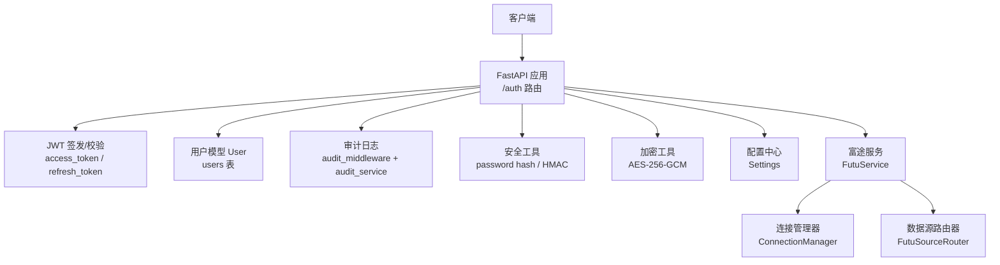
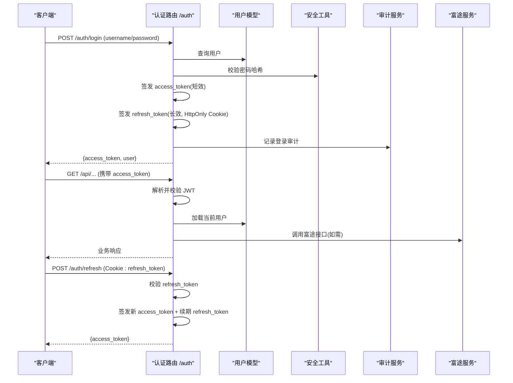
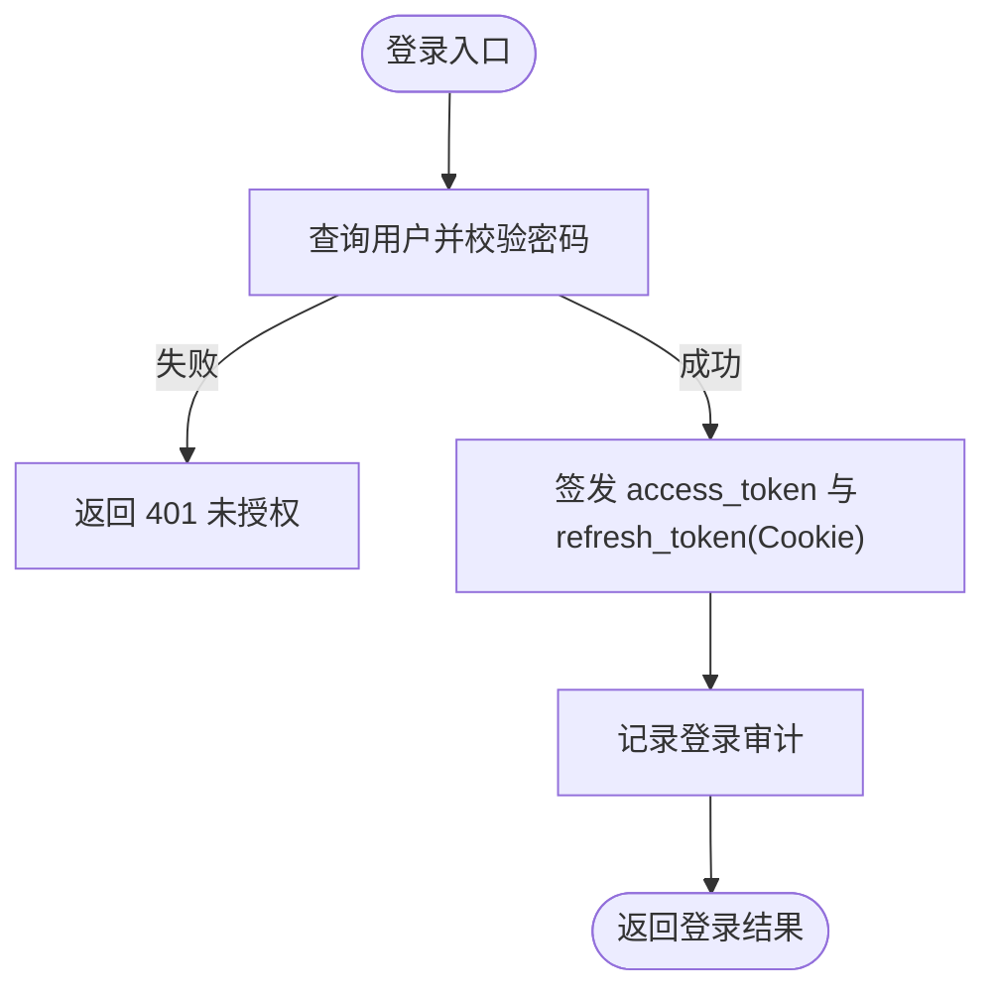
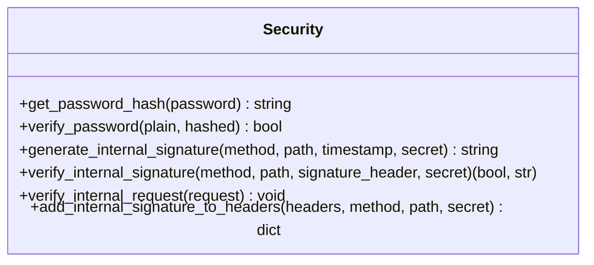
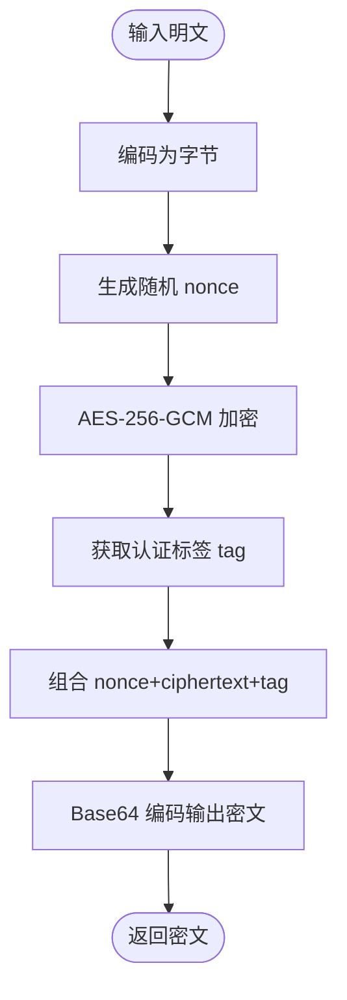
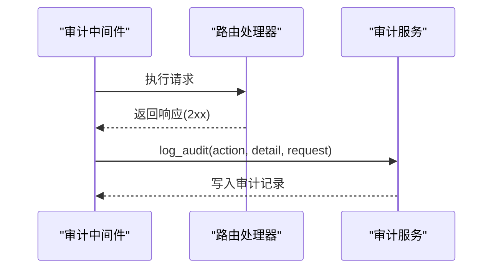
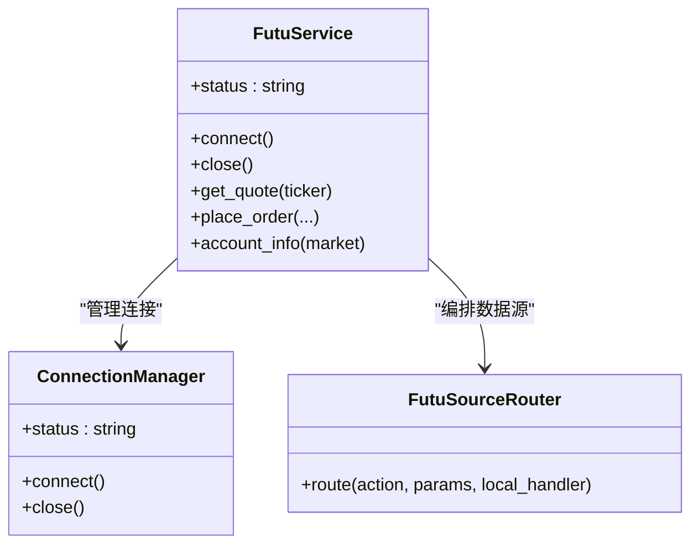
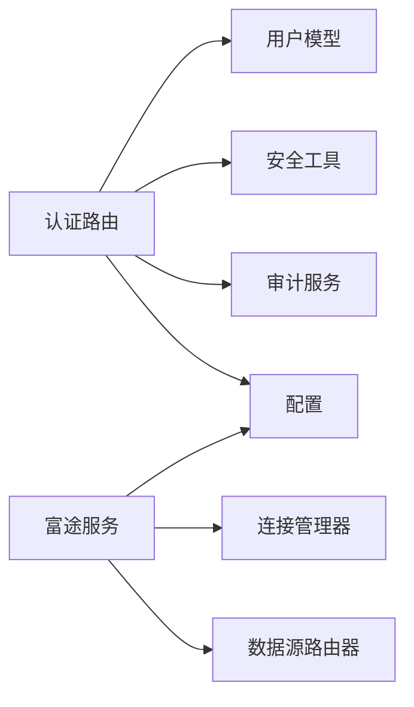

# 认证授权

<cite>
**本文引用的文件**
- [backend/routers/auth.py](file://backend/routers/auth.py)
- [backend/core/security.py](file://backend/core/security.py)
- [backend/core/encryption.py](file://backend/core/encryption.py)
- [backend/middleware/audit_middleware.py](file://backend/middleware/audit_middleware.py)
- [backend/services/audit_service.py](file://backend/services/audit_service.py)
- [backend/core/models.py](file://backend/core/models.py)
- [backend/core/config.py](file://backend/core/config.py)
- [data_subservice/futu_src/service.py](file://data_subservice/futu_src/service.py)
</cite>

## 目录
1. [简介](#简介)
2. [项目结构](#项目结构)
3. [核心组件](#核心组件)
4. [架构总览](#架构总览)
5. [详细组件分析](#详细组件分析)
6. [依赖关系分析](#依赖关系分析)
7. [性能与安全考量](#性能与安全考量)
8. [故障排查指南](#故障排查指南)
9. [结论](#结论)
10. [附录：配置与加固清单](#附录配置与加固清单)

## 简介
本文件系统性说明系统的认证与授权机制，覆盖多券商接入的 API 密钥管理、会话保持（JWT + Refresh Token Cookie）、权限验证与审计；详细描述富途（Futu）认证流程（登录、Token 刷新、权限范围控制）；给出安全最佳实践（密钥加密存储、传输安全、访问审计）；并说明授权模型（基于角色的访问控制与细粒度权限管理）以及认证配置与安全加固建议。

## 项目结构
认证与授权相关代码主要分布在以下模块：
- 认证路由与令牌签发：后端 /auth 路由
- 密码与内部通信签名：安全工具模块
- 敏感数据加密：AES-GCM 加解密
- 审计日志：中间件与服务层
- 用户模型与偏好：数据库模型
- 全局配置：环境变量与校验
- 富途服务：连接管理与数据源路由（本地/远程）

图表来源
- [backend/routers/auth.py:1-386](file://backend/routers/auth.py#L1-L386)
- [backend/core/security.py:1-160](file://backend/core/security.py#L1-L160)
- [backend/core/encryption.py:1-210](file://backend/core/encryption.py#L1-L210)
- [backend/middleware/audit_middleware.py:1-77](file://backend/middleware/audit_middleware.py#L1-L77)
- [backend/services/audit_service.py:1-112](file://backend/services/audit_service.py#L1-L112)
- [backend/core/models.py:37-50](file://backend/core/models.py#L37-L50)
- [backend/core/config.py:20-134](file://backend/core/config.py#L20-L134)
- [data_subservice/futu_src/service.py:31-116](file://data_subservice/futu_src/service.py#L31-L116)

章节来源
- [backend/routers/auth.py:1-386](file://backend/routers/auth.py#L1-L386)
- [backend/core/security.py:1-160](file://backend/core/security.py#L1-L160)
- [backend/core/encryption.py:1-210](file://backend/core/encryption.py#L1-L210)
- [backend/middleware/audit_middleware.py:1-77](file://backend/middleware/audit_middleware.py#L1-L77)
- [backend/services/audit_service.py:1-112](file://backend/services/audit_service.py#L1-L112)
- [backend/core/models.py:37-50](file://backend/core/models.py#L37-L50)
- [backend/core/config.py:20-134](file://backend/core/config.py#L20-L134)
- [data_subservice/futu_src/service.py:31-116](file://data_subservice/futu_src/service.py#L31-L116)

## 核心组件
- 认证路由（/auth）
  - 账号密码登录、Google OAuth 验证、获取当前用户、修改密码、刷新 Access Token、登出清理 Cookie。
  - 使用 JWT（HS256），Access Token 短效（15 分钟），Refresh Token 长效（30 天）并通过 HttpOnly Cookie 跨域传递。
- 安全工具
  - 密码哈希与校验（bcrypt）。
  - 内部服务间调用 HMAC-SHA256 签名与校验，防重放（时间戳过期）。
- 敏感数据加密
  - AES-256-GCM 透明加解密，支持主密钥轮换与生成。
- 审计日志
  - 中间件对关键写操作进行拦截记录；服务层统一写入审计表，包含 IP、追踪 ID、用户 ID、动作与详情。
- 用户模型
  - 用户表含用户名、邮箱、密码哈希、失败次数与锁定截止时间等安全字段。
- 配置
  - 集中式 Settings 管理数据库、Redis、LLM、数据源 API Key、Futu OpenD、内部通信密钥、加密主密钥等。
- 富途服务
  - FutuService 单例封装行情、交易、筛选等能力；通过 ConnectionManager 管理长连接；通过 FutuSourceRouter 在本地/远程之间切换。

章节来源
- [backend/routers/auth.py:1-386](file://backend/routers/auth.py#L1-L386)
- [backend/core/security.py:1-160](file://backend/core/security.py#L1-L160)
- [backend/core/encryption.py:1-210](file://backend/core/encryption.py#L1-L210)
- [backend/middleware/audit_middleware.py:1-77](file://backend/middleware/audit_middleware.py#L1-L77)
- [backend/services/audit_service.py:1-112](file://backend/services/audit_service.py#L1-L112)
- [backend/core/models.py:37-50](file://backend/core/models.py#L37-L50)
- [backend/core/config.py:20-134](file://backend/core/config.py#L20-L134)
- [data_subservice/futu_src/service.py:31-116](file://data_subservice/futu_src/service.py#L31-L116)

## 架构总览
系统采用“前端/客户端 → FastAPI 网关 → 业务路由 → 服务层 → 外部数据源”的分层架构。认证由 /auth 路由统一处理，通过 JWT 维持会话；敏感数据通过 AES-GCM 加密存储；内部服务调用通过 HMAC 签名保障完整性与时效性；所有关键操作均落库审计。

图表来源
- [backend/routers/auth.py:117-162](file://backend/routers/auth.py#L117-L162)
- [backend/routers/auth.py:305-346](file://backend/routers/auth.py#L305-L346)
- [backend/services/audit_service.py:43-80](file://backend/services/audit_service.py#L43-L80)
- [backend/core/security.py:20-30](file://backend/core/security.py#L20-L30)
- [data_subservice/futu_src/service.py:31-116](file://data_subservice/futu_src/service.py#L31-L116)

## 详细组件分析

### 认证路由与令牌管理
- 登录流程
  - 校验用户名与密码，签发短效 Access Token 与长效 Refresh Token（HttpOnly Cookie），记录审计。
- Google OAuth 验证
  - 验证前端传来的 Google ID Token，自动注册或匹配用户，签发系统内 Token，设置 Cookie，记录审计。
- 刷新令牌
  - 从 Cookie 读取 Refresh Token，校验后签发新的 Access Token，并滑动续期 Refresh Token。
- 登出
  - 尝试解析 Cookie 中的用户信息并记录审计，删除 Refresh Token Cookie。

图表来源
- [backend/routers/auth.py:117-162](file://backend/routers/auth.py#L117-L162)
- [backend/services/audit_service.py:43-80](file://backend/services/audit_service.py#L43-L80)

章节来源
- [backend/routers/auth.py:117-162](file://backend/routers/auth.py#L117-L162)
- [backend/routers/auth.py:204-299](file://backend/routers/auth.py#L204-L299)
- [backend/routers/auth.py:305-346](file://backend/routers/auth.py#L305-L346)
- [backend/routers/auth.py:349-386](file://backend/routers/auth.py#L349-L386)

### 安全工具与内部通信签名
- 密码哈希
  - 使用 bcrypt 进行密码哈希与校验，支持可配置的轮数。
- 内部请求签名
  - 生成 HMAC-SHA256 签名（方法+路径+时间戳），服务端校验签名与时效，防止重放与篡改。
  - 提供 FastAPI 依赖用于内部端点保护。

图表来源
- [backend/core/security.py:20-30](file://backend/core/security.py#L20-L30)
- [backend/core/security.py:37-119](file://backend/core/security.py#L37-L119)
- [backend/core/security.py:121-160](file://backend/core/security.py#L121-L160)

章节来源
- [backend/core/security.py:20-30](file://backend/core/security.py#L20-L30)
- [backend/core/security.py:37-119](file://backend/core/security.py#L37-L119)
- [backend/core/security.py:121-160](file://backend/core/security.py#L121-L160)

### 敏感数据加密（AES-256-GCM）
- 主密钥管理
  - 从配置读取主密钥，支持十六进制/Base64/原始字符串（长度校验），开发环境自动生成临时密钥并告警。
- 加密/解密
  - 随机 nonce + AES-GCM 加密，输出 Base64(nonce:ciphertext:tag)，解密时校验标签防止篡改。
- 扩展
  - 提供 SQLAlchemy Mixin 示例，便于未来将敏感字段透明加密存储。

图表来源
- [backend/core/encryption.py:21-55](file://backend/core/encryption.py#L21-L55)
- [backend/core/encryption.py:57-92](file://backend/core/encryption.py#L57-L92)
- [backend/core/encryption.py:95-131](file://backend/core/encryption.py#L95-L131)

章节来源
- [backend/core/encryption.py:21-55](file://backend/core/encryption.py#L21-L55)
- [backend/core/encryption.py:57-92](file://backend/core/encryption.py#L57-L92)
- [backend/core/encryption.py:95-131](file://backend/core/encryption.py#L95-L131)
- [backend/core/encryption.py:139-187](file://backend/core/encryption.py#L139-L187)

### 审计日志与中间件
- 中间件
  - 拦截 POST/PUT/DELETE 请求，匹配需审计的路径前缀，成功后调用审计服务记录。
- 服务层
  - 统一写入审计表，提取客户端 IP（支持代理头）、生成追踪 ID、记录动作与详情。

图表来源
- [backend/middleware/audit_middleware.py:14-77](file://backend/middleware/audit_middleware.py#L14-L77)
- [backend/services/audit_service.py:16-80](file://backend/services/audit_service.py#L16-L80)

章节来源
- [backend/middleware/audit_middleware.py:14-77](file://backend/middleware/audit_middleware.py#L14-L77)
- [backend/services/audit_service.py:16-80](file://backend/services/audit_service.py#L16-L80)

### 富途（Futu）认证与连接管理
- 连接管理
  - FutuService 单例初始化 ConnectionManager，统一管理行情与交易上下文。
- 数据源路由
  - 通过 FutuSourceRouter 选择 local/remote/auto 策略，优先本地 OpenD，不可用时降级到远程节点。
- 权限与范围
  - 交易环境由配置 FUTU_TRD_ENV 控制（模拟/实盘），实盘需配置解锁密码；权限范围由 Futu OpenD 账户与权限决定。

图表来源
- [data_subservice/futu_src/service.py:31-116](file://data_subservice/futu_src/service.py#L31-L116)
- [backend/core/config.py:69-74](file://backend/core/config.py#L69-L74)

章节来源
- [data_subservice/futu_src/service.py:31-116](file://data_subservice/futu_src/service.py#L31-L116)
- [backend/core/config.py:69-74](file://backend/core/config.py#L69-L74)

### 授权模型：基于角色与细粒度权限
- 当前实现
  - 用户模型具备基础身份字段与安全字段（失败次数、锁定时间），尚未内置 RBAC 与细粒度权限表。
- 可扩展设计建议
  - 引入 Role 与 Permission 表，建立用户-角色-权限的多对多关系。
  - 在路由层增加装饰器/依赖，按资源与动作进行细粒度校验（如：订单创建、策略修改、设置变更）。
  - 结合审计日志，记录每次权限决策与结果，便于追溯。

章节来源
- [backend/core/models.py:37-50](file://backend/core/models.py#L37-L50)
- [backend/middleware/audit_middleware.py:14-27](file://backend/middleware/audit_middleware.py#L14-L27)

## 依赖关系分析
- 认证路由依赖：
  - 用户模型（数据库查询）
  - 安全工具（密码校验、HMAC）
  - 审计服务（登录/登出审计）
  - 配置（生产环境判断、密钥）
- 富途服务依赖：
  - 连接管理器（OpenD 长连接）
  - 数据源路由器（local/remote 切换）
  - 配置（交易环境、解锁密码）

图表来源
- [backend/routers/auth.py:1-386](file://backend/routers/auth.py#L1-L386)
- [backend/core/models.py:37-50](file://backend/core/models.py#L37-L50)
- [backend/core/security.py:1-160](file://backend/core/security.py#L1-L160)
- [backend/services/audit_service.py:1-112](file://backend/services/audit_service.py#L1-L112)
- [backend/core/config.py:20-134](file://backend/core/config.py#L20-L134)
- [data_subservice/futu_src/service.py:31-116](file://data_subservice/futu_src/service.py#L31-L116)

章节来源
- [backend/routers/auth.py:1-386](file://backend/routers/auth.py#L1-L386)
- [backend/core/models.py:37-50](file://backend/core/models.py#L37-L50)
- [backend/core/security.py:1-160](file://backend/core/security.py#L1-L160)
- [backend/services/audit_service.py:1-112](file://backend/services/audit_service.py#L1-L112)
- [backend/core/config.py:20-134](file://backend/core/config.py#L20-L134)
- [data_subservice/futu_src/service.py:31-116](file://data_subservice/futu_src/service.py#L31-L116)

## 性能与安全考量
- 令牌有效期
  - Access Token 短效降低泄露风险；Refresh Token 滑动续期提升用户体验。
- Cookie 安全
  - HttpOnly + Secure + SameSite 配置，生产环境启用 Secure 与 SameSite=None 以支持跨域刷新。
- 密码强度
  - bcrypt 可配置轮数，提高暴力破解成本。
- 内部通信
  - HMAC 签名带时间戳，防重放；服务端严格校验格式与时序。
- 敏感数据
  - AES-GCM 提供机密性与完整性；主密钥应通过 KMS/Vault 管理，避免硬编码。
- 审计
  - 关键操作全量审计，支持按动作与用户过滤，便于合规与溯源。
- 富途连接
  - 本地优先、远程降级，保证高可用；交易环境受配置约束，实盘需解锁密码。

[本节为通用指导，不直接分析具体文件]

## 故障排查指南
- 登录失败
  - 检查用户名与密码是否正确；查看审计日志确认登录动作与错误原因。
- Token 刷新失败
  - 确认 Cookie 中是否存在 refresh_token；检查是否已过期或被浏览器策略拦截（SameSite/Secure）。
- 内部接口鉴权失败
  - 检查 X-Internal-Sig 头是否携带；确认时间戳是否在有效期内；核对 INTERNAL_API_SECRET。
- 敏感数据解密失败
  - 确认 ENCRYPTION_MASTER_KEY 配置正确且长度满足要求；检查密文是否被篡改。
- 富途连接异常
  - 检查 FUTU_HOST/FUTU_PORT 与网络连通；确认 FUTU_TRD_ENV 与 FUTU_PWD_UNLOCK 配置；观察状态是否为 CONNECTED。

章节来源
- [backend/routers/auth.py:117-162](file://backend/routers/auth.py#L117-L162)
- [backend/routers/auth.py:305-346](file://backend/routers/auth.py#L305-L346)
- [backend/core/security.py:74-119](file://backend/core/security.py#L74-L119)
- [backend/core/encryption.py:95-131](file://backend/core/encryption.py#L95-L131)
- [data_subservice/futu_src/service.py:68-97](file://data_subservice/futu_src/service.py#L68-L97)
- [backend/core/config.py:69-74](file://backend/core/config.py#L69-L74)

## 结论
系统实现了完善的认证与会话管理机制：基于 JWT 的短效访问令牌与长效刷新令牌，配合安全的 Cookie 策略；通过 bcrypt 与 AES-GCM 保障密码与敏感数据安全；内部服务调用采用 HMAC 签名防篡改与重放；关键操作全面审计。富途服务通过连接管理与数据源路由实现高可用与灵活切换。建议在后续版本中引入 RBAC 与细粒度权限控制，并结合 KMS/Vault 管理密钥，进一步提升安全性与可运维性。

[本节为总结，不直接分析具体文件]

## 附录：配置与加固清单
- 必需配置
  - DATABASE_URL、EMBEDDING_API_KEY、EMBEDDING_BASE_URL（启动校验）
  - INTERNAL_API_SECRET（内部通信签名）
  - ENCRYPTION_MASTER_KEY（敏感数据加密）
  - FUTU_HOST、FUTU_PORT、FUTU_TRD_ENV、FUTU_PWD_UNLOCK（富途连接与交易环境）
- 推荐加固
  - 生产环境 QUANT_ENV=production，启用 Secure/SameSite=None 的 Refresh Token Cookie
  - 限制登录失败次数与锁定时间（已在用户模型预留字段）
  - 使用 KMS/Vault 管理 ENCRYPTION_MASTER_KEY 与 INTERNAL_API_SECRET
  - 对所有写操作启用审计，并定期导出审计报表
  - 对富途交易接口增加二次确认与风控阈值

章节来源
- [backend/core/config.py:20-134](file://backend/core/config.py#L20-L134)
- [backend/core/models.py:37-50](file://backend/core/models.py#L37-L50)
- [backend/middleware/audit_middleware.py:14-27](file://backend/middleware/audit_middleware.py#L14-L27)
- [backend/services/audit_service.py:43-80](file://backend/services/audit_service.py#L43-L80)
