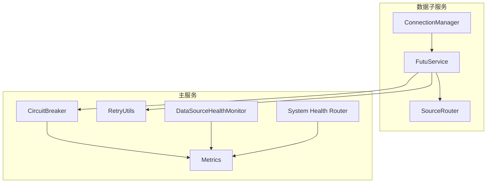
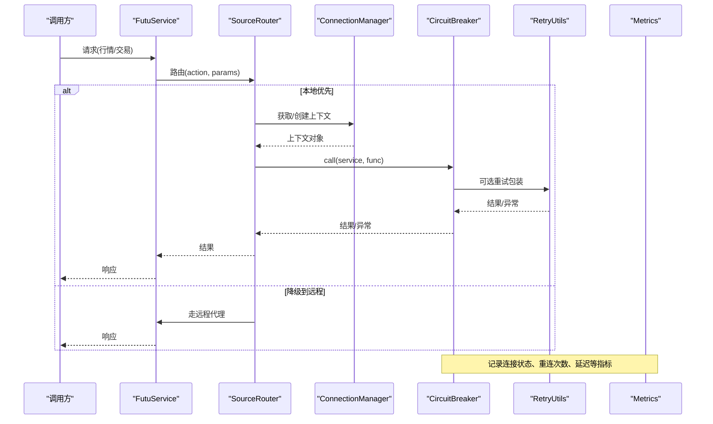
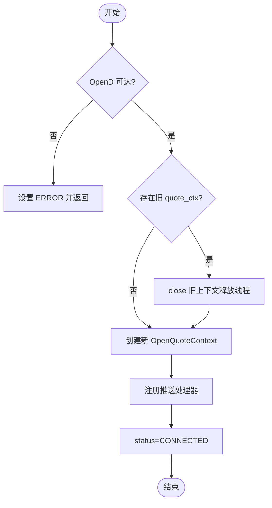
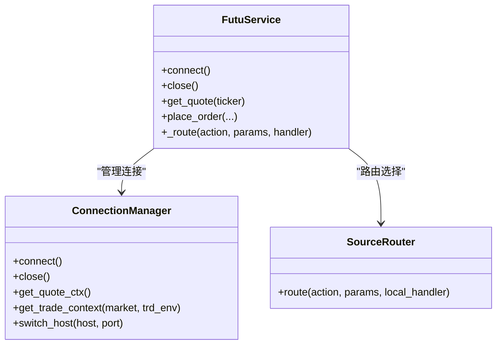
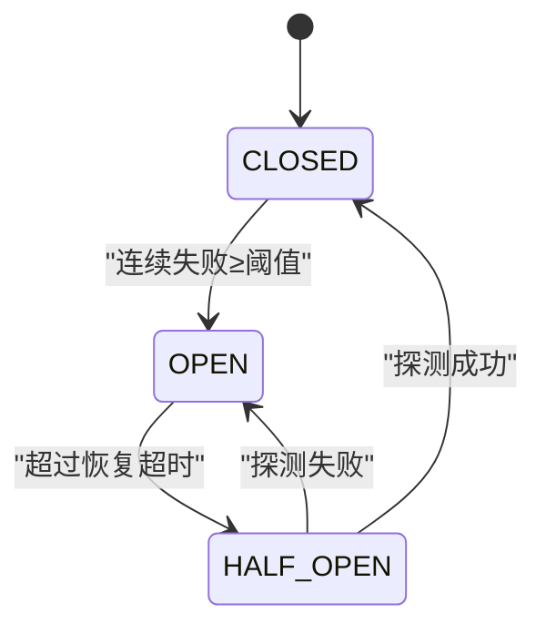
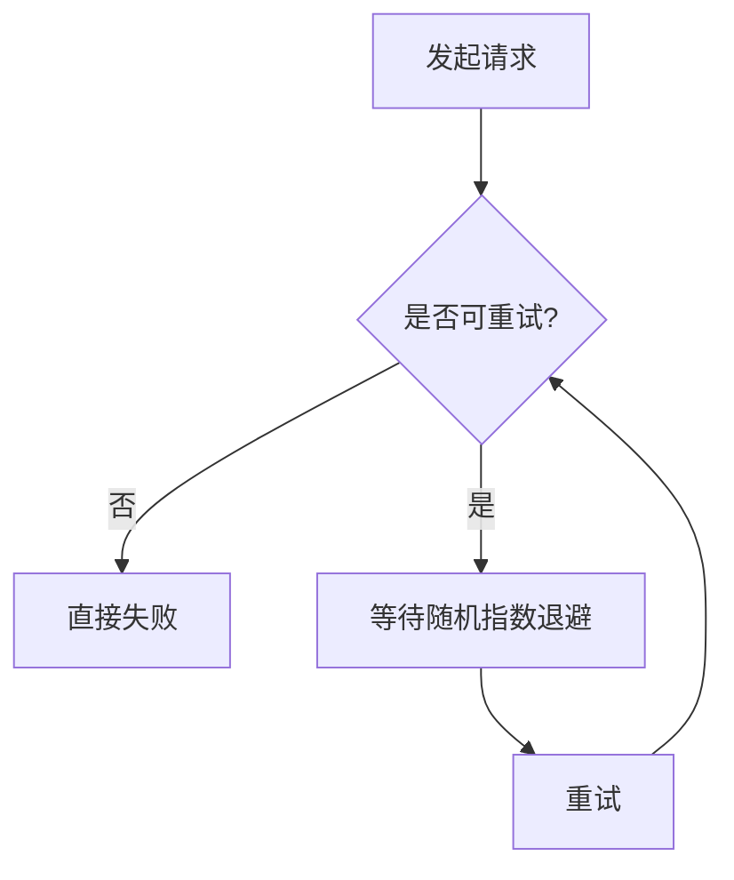
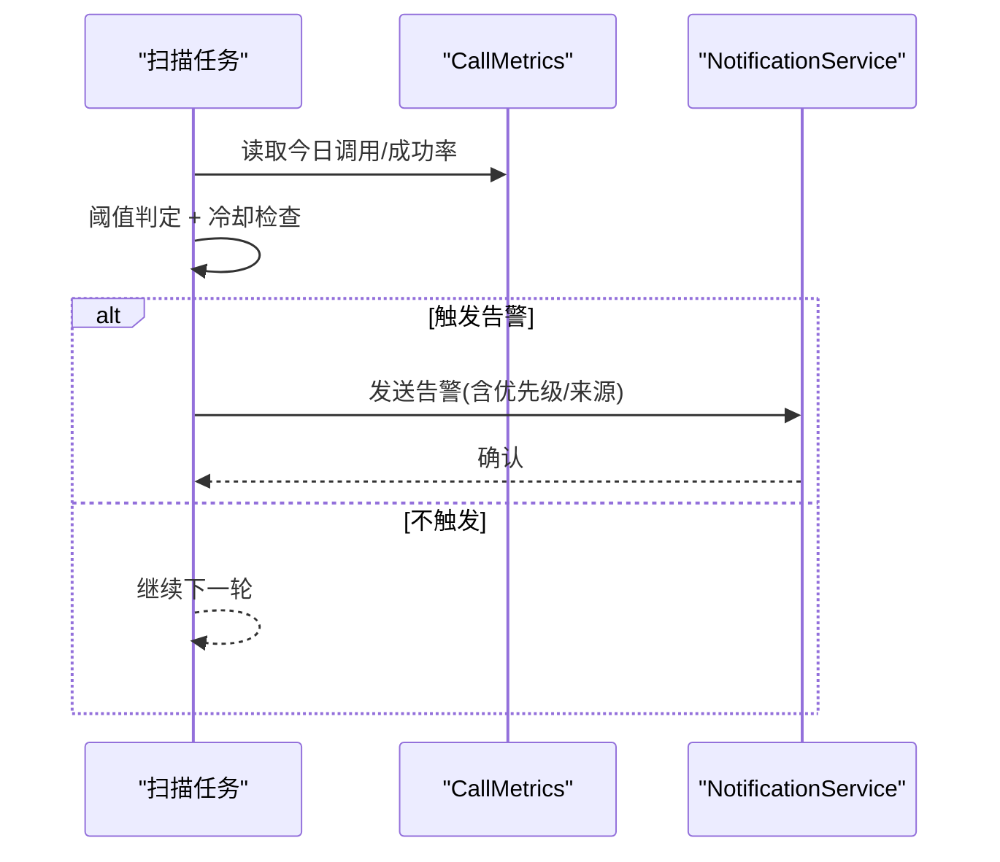
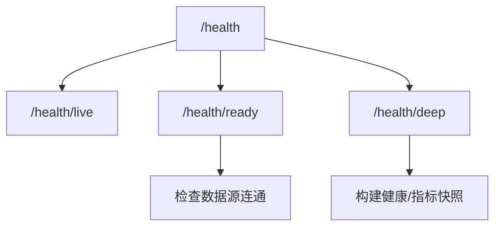
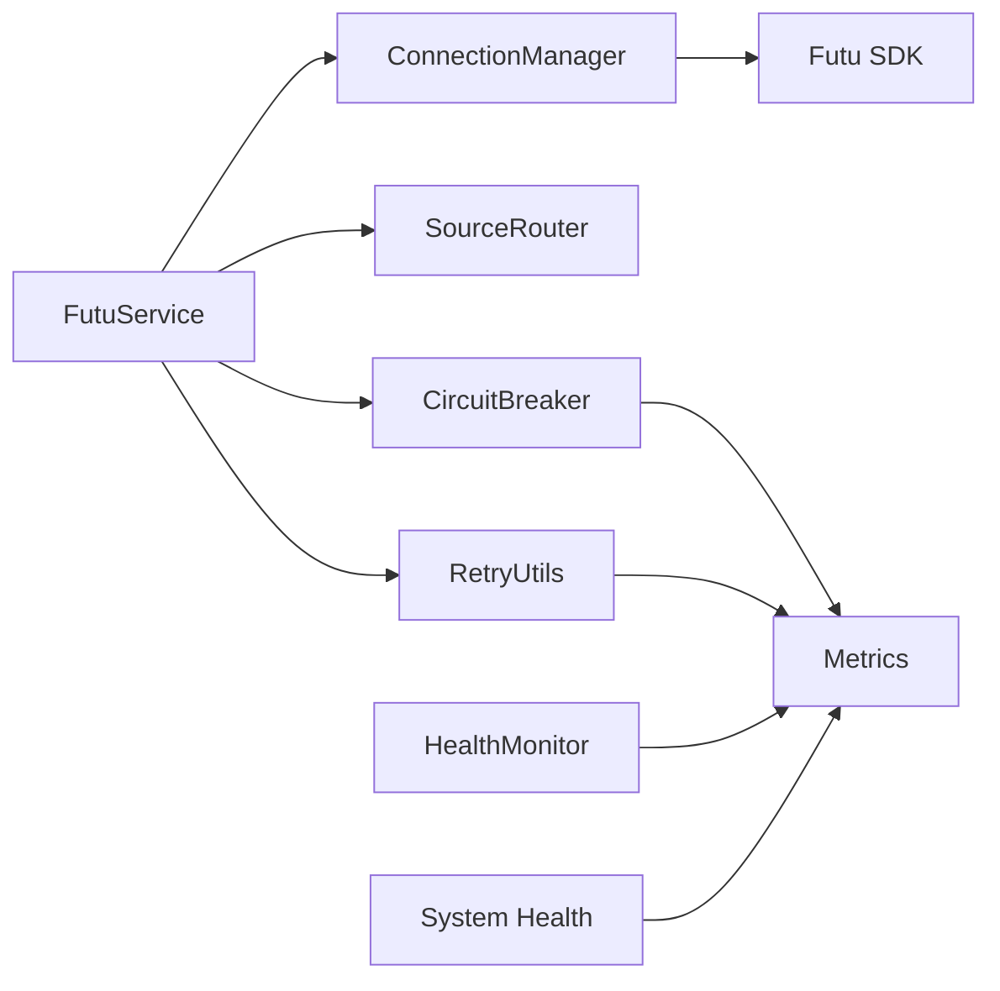

# 连接管理

<cite>
**本文引用的文件**
- [connection_manager.py](file://data_subservice/futu_src/connection_manager.py)
- [service.py](file://data_subservice/futu_src/service.py)
- [circuit_breaker.py](file://backend/core/circuit_breaker.py)
- [retry_utils.py](file://backend/core/retry_utils.py)
- [metrics.py](file://backend/core/metrics.py)
- [health_monitor.py](file://backend/services/datasource/health_monitor.py)
- [system_health.py](file://backend/routers/system_health.py)
</cite>

## 目录
1. [简介](#简介)
2. [项目结构](#项目结构)
3. [核心组件](#核心组件)
4. [架构总览](#架构总览)
5. [详细组件分析](#详细组件分析)
6. [依赖关系分析](#依赖关系分析)
7. [性能与调优](#性能与调优)
8. [故障排查指南](#故障排查指南)
9. [结论](#结论)

## 简介
本文件面向“连接管理”主题，系统化说明连接池设计（复用、资源管理、并发控制）、连接生命周期（建立、心跳检测、自动重连、优雅关闭）、故障恢复机制（断路器、重试、降级）、负载均衡策略（多连接分发、健康检查、故障转移），以及监控指标、性能调优建议与故障排查方法。内容基于仓库中 Futu OpenD 子服务连接管理与主服务可观测性实现进行提炼。

## 项目结构
围绕连接管理的代码主要分布在：
- data_subservice/futu_src：Futu OpenD 连接管理、服务编排与数据源路由
- backend/core：熔断器、重试工具、Prometheus 指标定义
- backend/services/datasource：数据源健康监控与告警
- backend/routers/system_health：系统健康探针与诊断端点

图表来源
- [connection_manager.py:44-351](file://data_subservice/futu_src/connection_manager.py#L44-L351)
- [service.py:31-115](file://data_subservice/futu_src/service.py#L31-L115)
- [circuit_breaker.py:64-379](file://backend/core/circuit_breaker.py#L64-L379)
- [retry_utils.py:10-58](file://backend/core/retry_utils.py#L10-L58)
- [metrics.py:262-284](file://backend/core/metrics.py#L262-L284)
- [health_monitor.py:55-257](file://backend/services/datasource/health_monitor.py#L55-L257)
- [system_health.py:173-355](file://backend/routers/system_health.py#L173-L355)

章节来源
- [connection_manager.py:44-351](file://data_subservice/futu_src/connection_manager.py#L44-L351)
- [service.py:31-115](file://data_subservice/futu_src/service.py#L31-L115)
- [circuit_breaker.py:64-379](file://backend/core/circuit_breaker.py#L64-L379)
- [retry_utils.py:10-58](file://backend/core/retry_utils.py#L10-L58)
- [metrics.py:262-284](file://backend/core/metrics.py#L262-L284)
- [health_monitor.py:55-257](file://backend/services/datasource/health_monitor.py#L55-L257)
- [system_health.py:173-355](file://backend/routers/system_health.py#L173-L355)

## 核心组件
- 连接管理器（ConnectionManager）：负责行情与交易上下文创建、复用、状态维护、跨网络加密握手、推送回调注册、运行时切换目标等。
- 服务编排（FutuService）：统一对外接口，组合各 Handler，并通过 SourceRouter 实现 local/remote/auto 的数据源路由。
- 熔断器（CircuitBreaker）：按服务维度维护 CLOSED/OPEN/HALF_OPEN 状态机，支持限流错误过滤、半开探测、指标上报。
- 重试工具（RetryUtils）：基于 tenacity 的指数退避+随机抖动重试，针对 HTTP/网络/限流类异常。
- 监控指标（Metrics）：定义 Futu 连接重连、延迟、可用性、队列深度、事件循环 lag 等 Prometheus 指标。
- 健康监控（DataSourceHealthMonitor）：周期性扫描数据源成功率与可达性，触发告警并冷却去重。
- 系统健康探针（System Health Router）：提供 /health、/health/ready、/health/deep 等端点，聚合组件健康与指标快照。

章节来源
- [connection_manager.py:44-351](file://data_subservice/futu_src/connection_manager.py#L44-L351)
- [service.py:31-115](file://data_subservice/futu_src/service.py#L31-L115)
- [circuit_breaker.py:64-379](file://backend/core/circuit_breaker.py#L64-L379)
- [retry_utils.py:10-58](file://backend/core/retry_utils.py#L10-L58)
- [metrics.py:262-284](file://backend/core/metrics.py#L262-L284)
- [health_monitor.py:55-257](file://backend/services/datasource/health_monitor.py#L55-L257)
- [system_health.py:173-355](file://backend/routers/system_health.py#L173-L355)

## 架构总览
连接管理采用“单例连接 + 多上下文 + 路由器 + 熔断/重试 + 健康监控”的分层架构：
- 连接层：ConnectionManager 维护一个行情上下文与多个交易上下文，线程安全地创建/复用/关闭。
- 路由层：FutuService 通过 SourceRouter 选择本地 OpenD 或远程 slave 代理，支持 auto 降级。
- 保护层：CircuitBreaker 对下游调用进行快速失败与半开探测；RetryUtils 对瞬时错误进行指数退避重试。
- 观测层：Metrics 暴露连接重连次数、延迟、可用性；Health Monitor 周期扫描成功率并告警；System Health 提供多维探针。

图表来源
- [service.py:101-115](file://data_subservice/futu_src/service.py#L101-L115)
- [connection_manager.py:79-160](file://data_subservice/futu_src/connection_manager.py#L79-L160)
- [circuit_breaker.py:147-218](file://backend/core/circuit_breaker.py#L147-L218)
- [retry_utils.py:50-58](file://backend/core/retry_utils.py#L50-L58)
- [metrics.py:262-284](file://backend/core/metrics.py#L262-L284)

## 详细组件分析

### 连接管理器（ConnectionManager）
- 连接复用与资源管理
  - 行情上下文（quote_ctx）单例化，避免重复创建导致回调线程泄漏；在重建前会先 close 旧上下文释放线程。
  - 交易上下文（trade_ctxs）按 (TrdEnv, TrdMarket) 键缓存，按需创建，跨网络时启用加密握手。
  - 线程锁（threading.Lock）防止并发建连；进程级守护线程配置避免孤儿线程堆积。
- 生命周期
  - 建立连接：先快速探测 OpenD 可达性，再创建上下文并注册推送处理器；成功则标记 CONNECTED。
  - 心跳检测：由外部 watchdog/健康检查驱动状态变更；连接管理器自身不主动轮询，但提供 _is_opend_reachable 用于快速判断。
  - 自动重连：当状态非 CONNECTED 且 OpenD 可达时，connect() 会重建上下文；switch_host() 支持运行时切换目标并重新连接。
  - 优雅关闭：close() 关闭所有上下文并清空缓存，状态置为 DISCONNECTED。
- 并发控制
  - 使用 threading.Lock 包裹 connect()，确保同一时刻仅一次建连。
  - 交易解锁逻辑通过异步线程执行，避免阻塞事件循环。
- 跨网络与安全
  - 跨网络连接强制 is_encrypt=True，客户端 RSA 私钥通过环境变量注入，避免明文握手导致的签名校验失败。
  - 未配置解锁密码或 RSA 私钥时拒绝创建交易上下文，阻断 SDK 后台线程无限重试导致的线程耗尽。

图表来源
- [connection_manager.py:59-160](file://data_subservice/futu_src/connection_manager.py#L59-L160)
- [connection_manager.py:199-215](file://data_subservice/futu_src/connection_manager.py#L199-L215)
- [connection_manager.py:217-279](file://data_subservice/futu_src/connection_manager.py#L217-L279)
- [connection_manager.py:302-345](file://data_subservice/futu_src/connection_manager.py#L302-L345)

章节来源
- [connection_manager.py:44-351](file://data_subservice/futu_src/connection_manager.py#L44-L351)

### 服务编排与数据源路由（FutuService & SourceRouter）
- 统一入口：FutuService 将各业务动作（行情、期权、资金流、筛选、交易等）委托给对应 Handler，并通过 SourceRouter 决定走本地 OpenD 还是远程 slave 代理。
- 路由策略：
  - local：仅本地 OpenD
  - remote：仅远程代理
  - auto：本地优先，不可用时降级到远程
- 状态同步：FutuService.status 直接代理 ConnectionManager.status，避免 watchdog 修改状态后与旧接口不同步的问题。

图表来源
- [service.py:31-115](file://data_subservice/futu_src/service.py#L31-L115)
- [connection_manager.py:44-351](file://data_subservice/futu_src/connection_manager.py#L44-L351)

章节来源
- [service.py:31-115](file://data_subservice/futu_src/service.py#L31-L115)

### 熔断器（CircuitBreaker）
- 状态机：CLOSED → OPEN（连续失败达到阈值）→ HALF_OPEN（超过恢复超时）→ CLOSED（探测成功）。
- 限流错误过滤：可通过 error_classifier 或全局钩子识别限流类错误，不计入失败计数，避免误熔断。
- 指标上报：记录状态与转换次数，便于 Grafana/Prometheus 可视化。
- 使用方式：装饰器 guard、call/call_sync 包装函数调用、record_failure/record_success 手动记录。

图表来源
- [circuit_breaker.py:45-98](file://backend/core/circuit_breaker.py#L45-L98)
- [circuit_breaker.py:147-218](file://backend/core/circuit_breaker.py#L147-L218)
- [circuit_breaker.py:267-379](file://backend/core/circuit_breaker.py#L267-L379)

章节来源
- [circuit_breaker.py:64-379](file://backend/core/circuit_breaker.py#L64-L379)

### 重试策略（RetryUtils）
- 适用场景：HTTP/网络异常、服务端限流/封禁、临时性错误。
- 策略：指数退避 + 随机抖动，最多重试 3 次，记录每次重试日志。
- 可插拔：is_retryable_http_error 定义重试条件，可按需扩展。

图表来源
- [retry_utils.py:10-58](file://backend/core/retry_utils.py#L10-L58)

章节来源
- [retry_utils.py:10-58](file://backend/core/retry_utils.py#L10-L58)

### 健康监控与告警（DataSourceHealthMonitor）
- 周期扫描：每 N 秒扫描各数据源成功率与可达性，低于阈值且样本足够时生成告警。
- 冷却去重：同数据源同类型 15 分钟内不重复告警，避免告警风暴。
- 通知：通过 NotificationService 推送飞书 Webhook，支持优先级与来源标注。

图表来源
- [health_monitor.py:101-147](file://backend/services/datasource/health_monitor.py#L101-L147)
- [health_monitor.py:187-236](file://backend/services/datasource/health_monitor.py#L187-L236)

章节来源
- [health_monitor.py:55-257](file://backend/services/datasource/health_monitor.py#L55-L257)

### 系统健康探针（System Health Router）
- /health：进程存活即 200，不依赖外部依赖。
- /health/ready：Redis + Postgres + 至少一个数据源连通才就绪。
- /health/deep：聚合组件健康、数据源就绪、采集器心跳、WS 连接数、线程池使用率、事件循环 lag、熔断器状态等。

图表来源
- [system_health.py:173-355](file://backend/routers/system_health.py#L173-L355)

章节来源
- [system_health.py:173-355](file://backend/routers/system_health.py#L173-L355)

## 依赖关系分析
- 连接管理器依赖 futu SDK 的行情/交易上下文，受环境变量（主机、端口、RSA 私钥、解锁密码）影响。
- 服务编排依赖 SourceRouter 与各类 Handler，屏蔽底层差异并提供统一 API。
- 熔断器与重试工具作为横切关注点，被上层调用链复用，降低下游不稳定对整体系统的影响。
- 监控指标贯穿连接、路由、熔断、重试各环节，形成可观测闭环。

图表来源
- [connection_manager.py:44-351](file://data_subservice/futu_src/connection_manager.py#L44-L351)
- [service.py:31-115](file://data_subservice/futu_src/service.py#L31-L115)
- [circuit_breaker.py:64-379](file://backend/core/circuit_breaker.py#L64-L379)
- [retry_utils.py:10-58](file://backend/core/retry_utils.py#L10-L58)
- [metrics.py:262-284](file://backend/core/metrics.py#L262-L284)
- [health_monitor.py:55-257](file://backend/services/datasource/health_monitor.py#L55-L257)
- [system_health.py:173-355](file://backend/routers/system_health.py#L173-L355)

章节来源
- [connection_manager.py:44-351](file://data_subservice/futu_src/connection_manager.py#L44-L351)
- [service.py:31-115](file://data_subservice/futu_src/service.py#L31-L115)
- [circuit_breaker.py:64-379](file://backend/core/circuit_breaker.py#L64-L379)
- [retry_utils.py:10-58](file://backend/core/retry_utils.py#L10-L58)
- [metrics.py:262-284](file://backend/core/metrics.py#L262-L284)
- [health_monitor.py:55-257](file://backend/services/datasource/health_monitor.py#L55-L257)
- [system_health.py:173-355](file://backend/routers/system_health.py#L173-L355)

## 性能与调优
- 连接复用与线程安全
  - 复用 quote_ctx 避免频繁创建导致的回调线程泄漏；重建前先 close 旧上下文。
  - 使用 threading.Lock 保护 connect()，防止并发竞态。
- 跨网络连接优化
  - 跨网络启用加密握手，减少因签名校验失败导致的反复断连。
  - 未配置解锁密码或 RSA 私钥时拒绝创建交易上下文，避免 SDK 后台线程无限重试。
- 熔断与重试
  - 合理设置 CIRCUIT_BREAKER_MAX_FAILURES 与 CIRCUIT_BREAKER_COOLDOWN_S，平衡快速失败与恢复速度。
  - 使用指数退避+随机抖动重试，降低雪崩风险。
- 监控与观测
  - 关注 quant_futu_reconnect_total、quant_futu_reconnect_latency_seconds、quant_ws_active_connections、quant_process_thread_count 等指标。
  - 通过 /health/deep 查看事件循环 lag、线程池使用率、熔断器状态等。

[本节为通用指导，不直接分析具体文件]

## 故障排查指南
- 连接不可达
  - 现象：status=ERROR，error_msg 提示 OpenD 不可达。
  - 排查：检查 FUTU_HOST/FUTU_PORT 配置；使用 _is_opend_reachable 快速探测；确认防火墙/网络策略。
- 线程泄漏
  - 现象：进程线程数飙升，futu 回调线程未回收。
  - 排查：确认是否在覆盖 quote_ctx 前 close 旧上下文；检查 switch_host/close 路径是否正确释放；观察 metrics.quant_process_thread_count。
- 交易无法建立
  - 现象：跨网络交易连接需要 RSA 私钥或解锁密码，否则拒绝创建上下文。
  - 排查：配置 FUTU_RSA_PRIVATE_KEY 或 FUTU_PWD_UNLOCK；确认 OpenD 已开启 RSA 加密。
- 熔断触发
  - 现象：调用被快速失败，提示熔断中。
  - 排查：查看 circuit_breaker_states；检查下游错误分类（限流 vs 普通错误）；调整阈值或修复下游问题。
- 健康检查失败
  - 现象：/health/ready 返回 503。
  - 排查：检查 Redis/Postgres 连通性；确认至少一个数据源 health().healthy==True；查看 /health/deep 中的组件详情。

章节来源
- [connection_manager.py:59-160](file://data_subservice/futu_src/connection_manager.py#L59-L160)
- [connection_manager.py:217-279](file://data_subservice/futu_src/connection_manager.py#L217-L279)
- [circuit_breaker.py:147-218](file://backend/core/circuit_breaker.py#L147-L218)
- [system_health.py:197-355](file://backend/routers/system_health.py#L197-L355)

## 结论
本连接管理体系以 ConnectionManager 为核心，结合 FutuService 的路由能力、CircuitBreaker 的保护机制、RetryUtils 的重试策略，以及完善的监控与健康探针，实现了高可用的连接管理。通过连接复用、线程安全、跨网络加密、自动重连与优雅关闭，系统在复杂网络环境下具备较强的鲁棒性。配合健康监控与告警，能够快速发现并定位问题，保障业务连续性。
