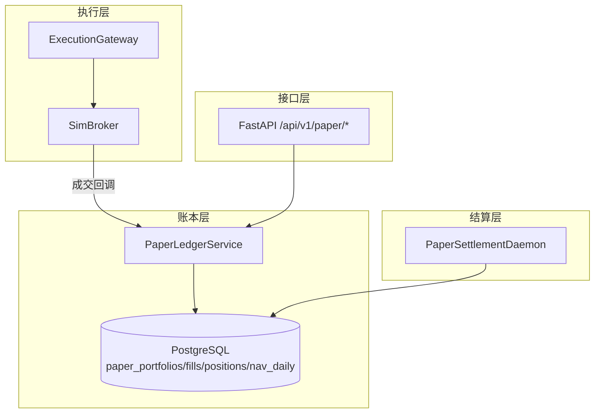
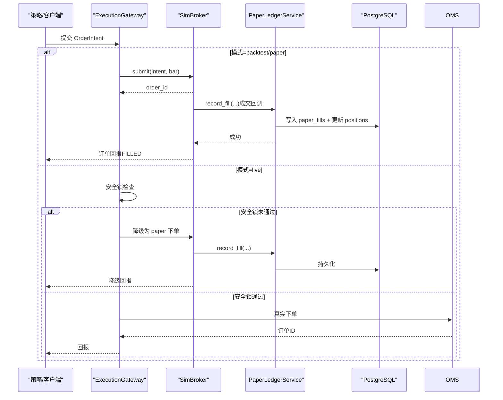
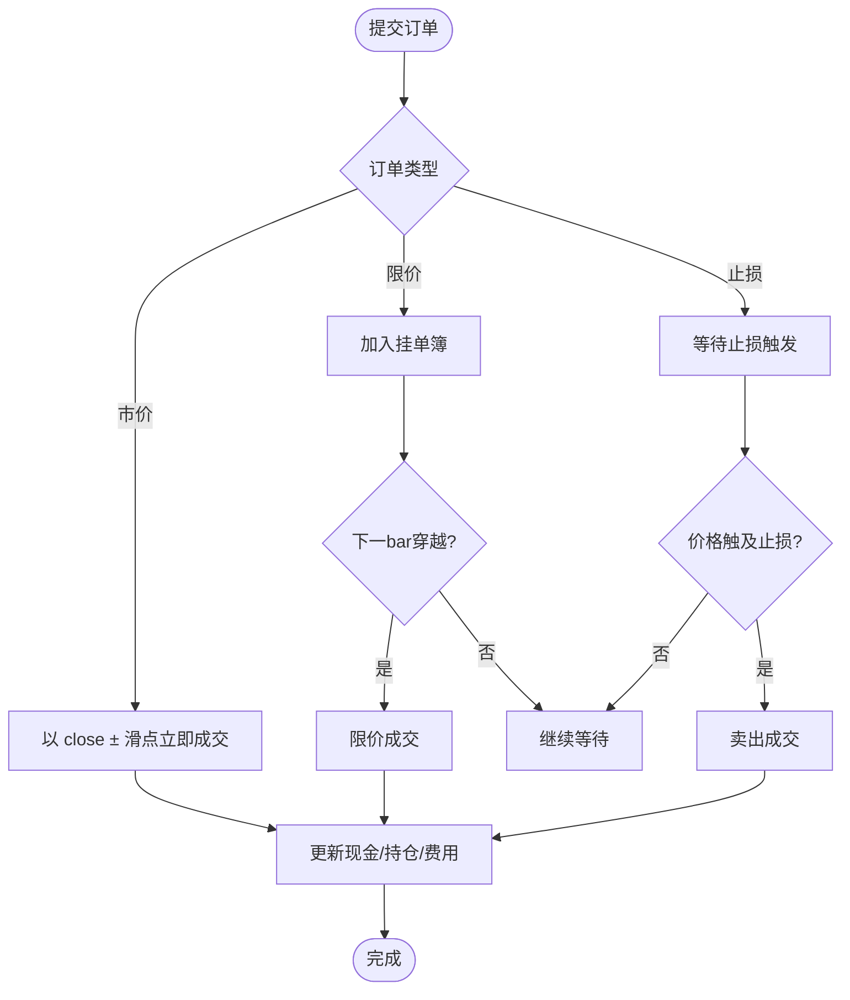
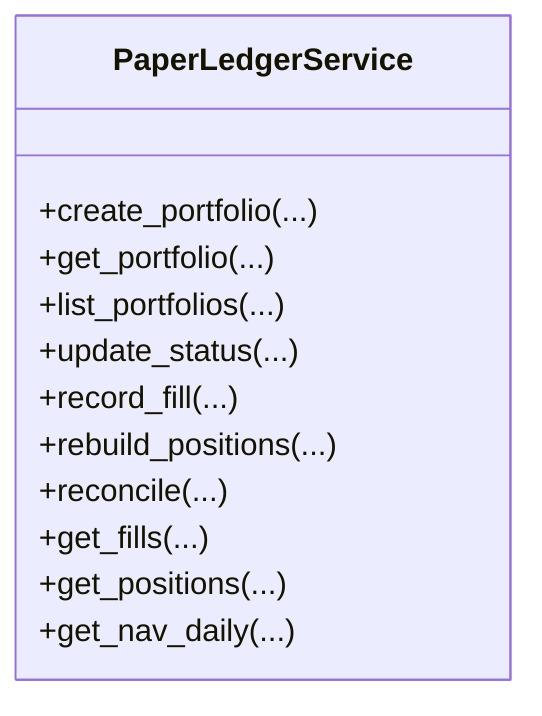
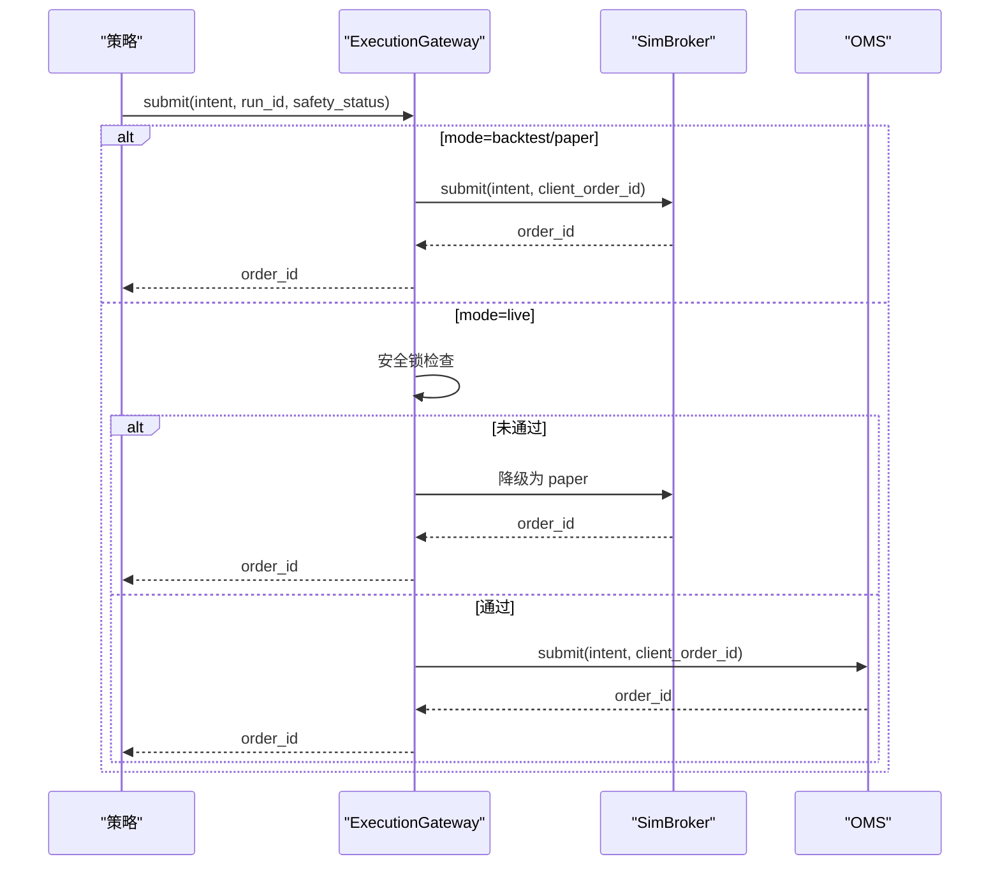
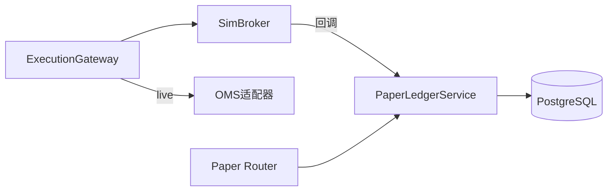

# 纸面交易

<cite>
**本文引用的文件**
- [backend/services/paper_ledger_service.py](file://backend/services/paper_ledger_service.py)
- [backend/engine/drivers/sim_broker.py](file://backend/engine/drivers/sim_broker.py)
- [backend/routers/paper.py](file://backend/routers/paper.py)
- [backend/engine/gateway.py](file://backend/engine/gateway.py)
- [backend/core/models.py](file://backend/core/models.py)
- [backend/alembic/versions/pt01a_add_paper_portfolio_tables.py](file://backend/alembic/versions/pt01a_add_paper_portfolio_tables.py)
- [backend/core/config.py](file://backend/core/config.py)
- [backend/workers/paper/settlement_daemon.py](file://backend/workers/paper/settlement_daemon.py)
- [backend/tests/test_paper_settlement.py](file://backend/tests/test_paper_settlement.py)
- [docs/17. 纸面组合系统架构.md](file://docs/17. 纸面组合系统架构.md)
</cite>

## 目录
1. [简介](#简介)
2. [项目结构](#项目结构)
3. [核心组件](#核心组件)
4. [架构总览](#架构总览)
5. [详细组件分析](#详细组件分析)
6. [依赖关系分析](#依赖关系分析)
7. [性能考量](#性能考量)
8. [故障排查指南](#故障排查指南)
9. [结论](#结论)
10. [附录](#附录)

## 简介
本文件面向“纸面交易系统”的完整实现与使用，覆盖以下目标：
- 解释纸面交易的实现原理：模拟撮合引擎、虚拟资金账户、模拟成交逻辑。
- 说明与实盘交易的切换机制：配置管理、数据隔离、状态同步。
- 描述纸面交易的优势：策略验证、回测对比、无风险测试。
- 给出纸面交易的数据模型：虚拟订单（挂单簿）、模拟持仓、交易记录、日终净值。
- 总结性能优化：内存计算、批量处理、并发控制。
- 提供使用场景与最佳实践。

## 项目结构
纸面交易由“执行底座 + 账本 + 结算 + API + 工作进程”构成：
- 执行底座：SimBroker（模拟撮合）+ ExecutionGateway（统一出口，支持 backtest/paper/live）。
- 账本：PaperLedgerService（PG 流水 SSOT，paper_fills/paper_positions/paper_nav_daily）。
- 结算：PaperSettlementDaemon（收盘后 EOD 结算，产出 NAV）。
- API：/api/v1/paper/* 路由（创建组合、查询持仓/成交流水/NAV、暂停/恢复/关闭、对比）。
- 配置与安全：全局配置（REAL_TRADE_EXECUTE、FUTU_TRD_ENV 等），安全锁与降级。
- 数据模型：Alembric 迁移定义纸面表结构；ORM 模型在 models.py 中引用。

图表来源
- [backend/engine/gateway.py:98-186](file://backend/engine/gateway.py#L98-L186)
- [backend/engine/drivers/sim_broker.py:59-172](file://backend/engine/drivers/sim_broker.py#L59-L172)
- [backend/services/paper_ledger_service.py:19-143](file://backend/services/paper_ledger_service.py#L19-L143)
- [backend/routers/paper.py:51-123](file://backend/routers/paper.py#L51-L123)

章节来源
- [backend/engine/gateway.py:98-186](file://backend/engine/gateway.py#L98-L186)
- [backend/engine/drivers/sim_broker.py:59-172](file://backend/engine/drivers/sim_broker.py#L59-L172)
- [backend/services/paper_ledger_service.py:19-143](file://backend/services/paper_ledger_service.py#L19-L143)
- [backend/routers/paper.py:51-123](file://backend/routers/paper.py#L51-L123)
- [backend/alembic/versions/pt01a_add_paper_portfolio_tables.py:19-82](file://backend/alembic/versions/pt01a_add_paper_portfolio_tables.py#L19-L82)

## 核心组件
- SimBroker：内存撮合引擎，负责限价/市价/止损单撮合、滑点与手续费、现金与持仓维护，并支持 paper_mode 下的拒单规则与成交回调。
- PaperLedgerService：纸面账本服务，维护组合生命周期、成交流水（只增）、持仓投影、对账与重放、日终净值查询。
- ExecutionGateway：统一订单出口，按模式路由到 SimBroker（backtest/paper）或 OMS（live），并提供安全锁与降级能力。
- PaperSettlementDaemon：收盘后结算，基于收盘价计算 NAV、持仓市值与日收益，落库不可变序列。
- FastAPI 路由：提供组合 CRUD、成交流水分页、NAV 序列、对比数据等接口。

章节来源
- [backend/engine/drivers/sim_broker.py:59-172](file://backend/engine/drivers/sim_broker.py#L59-L172)
- [backend/services/paper_ledger_service.py:19-143](file://backend/services/paper_ledger_service.py#L19-L143)
- [backend/engine/gateway.py:98-186](file://backend/engine/gateway.py#L98-L186)
- [backend/routers/paper.py:51-123](file://backend/routers/paper.py#L51-L123)
- [backend/workers/paper/settlement_daemon.py](file://backend/workers/paper/settlement_daemon.py)

## 架构总览
纸面交易以“执行底座 + 账本 + 结算 + 接口”分层设计，保证：
- 可重放：paper_fills 为唯一事实源，positions 可重建。
- 可对比：通过 benchmark_backtest_ref 关联回测基准，输出跟踪误差与累计偏离。
- 可切换：ExecutionGateway 将 live 订单在安全锁不通过时降级为 paper 语义。

图表来源
- [backend/engine/gateway.py:116-186](file://backend/engine/gateway.py#L116-L186)
- [backend/engine/drivers/sim_broker.py:81-172](file://backend/engine/drivers/sim_broker.py#L81-L172)
- [backend/services/paper_ledger_service.py:84-143](file://backend/services/paper_ledger_service.py#L84-L143)

## 详细组件分析

### 模拟撮合引擎（SimBroker）
- 订单类型：市价单立即成交；限价单进入 pending_orders，后续 bar/quote 穿越触发；止损单在 on_bar 开始时检查。
- 摩擦模型：滑点与佣金按配置比例计入成本，影响成交价与可用资金。
- 资金与持仓：买入扣款并加权平均成本；卖出增加现金并清仓时移除均价；不足资金自动缩减数量。
- paper_mode 行为：拒绝 stale 行情与非交易时段订单；成交回调至 PaperLedgerService 落库。

图表来源
- [backend/engine/drivers/sim_broker.py:81-172](file://backend/engine/drivers/sim_broker.py#L81-L172)
- [backend/engine/drivers/sim_broker.py:194-329](file://backend/engine/drivers/sim_broker.py#L194-L329)

章节来源
- [backend/engine/drivers/sim_broker.py:59-172](file://backend/engine/drivers/sim_broker.py#L59-L172)
- [backend/engine/drivers/sim_broker.py:194-329](file://backend/engine/drivers/sim_broker.py#L194-L329)

### 纸面账本（PaperLedgerService）
- 组合生命周期：创建、查询、列表、状态变更（running/paused/closed）。
- 记账核心：record_fill 分配 fill_seq，写入 paper_fills，并增量更新 paper_positions（加权平均成本）。
- 重放与对账：rebuild_positions 从 fills 全量重算；reconcile 比较投影与重放结果，确保一致性。
- 查询：fills 分页、positions 当前持仓、nav_daily 日终净值。

图表来源
- [backend/services/paper_ledger_service.py:19-143](file://backend/services/paper_ledger_service.py#L19-L143)
- [backend/services/paper_ledger_service.py:189-247](file://backend/services/paper_ledger_service.py#L189-L247)
- [backend/services/paper_ledger_service.py:253-314](file://backend/services/paper_ledger_service.py#L253-L314)

章节来源
- [backend/services/paper_ledger_service.py:19-143](file://backend/services/paper_ledger_service.py#L19-L143)
- [backend/services/paper_ledger_service.py:189-247](file://backend/services/paper_ledger_service.py#L189-L247)
- [backend/services/paper_ledger_service.py:253-314](file://backend/services/paper_ledger_service.py#L253-L314)

### 统一订单出口（ExecutionGateway）
- 模式路由：BACKTEST/PAPER → SimBroker；LIVE → OMS。
- 安全锁：三要素（REAL_TRADE_EXECUTE、trading_mode=LIVE、kill_switch 未触发），任一失败则降级为 paper。
- 幂等去重：client_order_id = hash(run_id:symbol:side:tag)，避免重复下单。

图表来源
- [backend/engine/gateway.py:98-186](file://backend/engine/gateway.py#L98-L186)

章节来源
- [backend/engine/gateway.py:98-186](file://backend/engine/gateway.py#L98-L186)

### 结算与净值（PaperSettlementDaemon）
- 触发：每 5 分钟检查市场状态，盘中写 Redis 快照；收盘窗口内对 running 组合进行 EOD 结算。
- 定价：优先用 K_DAY 收盘价；停牌或缺失采用前收并标记 stale_symbols。
- 产出：计算 NAV、cash、market_value、daily_return，写入 paper_nav_daily（复合主键幂等）。

章节来源
- [docs/17. 纸面组合系统架构.md:166-200](file://docs/17. 纸面组合系统架构.md#L166-L200)
- [backend/workers/paper/settlement_daemon.py](file://backend/workers/paper/settlement_daemon.py)

### API 层（/api/v1/paper/*）
- 组合管理：创建、列表、详情、暂停/恢复/关闭。
- 数据查询：成交流水分页、当前持仓、日终净值序列。
- 对比：获取纸面 vs 回测基准的跟踪误差、累计偏离与双曲线数据。

章节来源
- [backend/routers/paper.py:51-123](file://backend/routers/paper.py#L51-L123)
- [backend/routers/paper.py:129-193](file://backend/routers/paper.py#L129-L193)

## 依赖关系分析
- SimBroker 依赖：OrderIntent/Position/Bar 等合约；可选 MarketSession 用于交易时段校验；paper_mode 下回调 PaperLedgerService。
- PaperLedgerService 依赖：SQLAlchemy Session 与 ORM 模型（PaperPortfolio/PaperFill/PaperPosition/PaperNavDaily）。
- Gateway 依赖：SimBrokerExecutor/OmsExecutionAdapter；安全锁状态来自配置与运行时开关。
- 数据模型：Alembic 迁移定义纸面表结构；models.py 引用这些模型。

图表来源
- [backend/engine/drivers/sim_broker.py:59-172](file://backend/engine/drivers/sim_broker.py#L59-L172)
- [backend/services/paper_ledger_service.py:19-143](file://backend/services/paper_ledger_service.py#L19-L143)
- [backend/engine/gateway.py:98-186](file://backend/engine/gateway.py#L98-L186)
- [backend/routers/paper.py:51-123](file://backend/routers/paper.py#L51-L123)

章节来源
- [backend/engine/drivers/sim_broker.py:59-172](file://backend/engine/drivers/sim_broker.py#L59-L172)
- [backend/services/paper_ledger_service.py:19-143](file://backend/services/paper_ledger_service.py#L19-L143)
- [backend/engine/gateway.py:98-186](file://backend/engine/gateway.py#L98-L186)
- [backend/routers/paper.py:51-123](file://backend/routers/paper.py#L51-L123)

## 性能考量
- 内存计算：SimBroker 在内存中维护现金、持仓、挂单簿，撮合复杂度与挂单数线性相关；适合高频 tick 级处理。
- 批量处理：PaperLedgerService 的 rebuild_positions 与 reconcile 支持按 portfolio 维度批量重放，便于对账与恢复。
- 并发控制：EOD 结算使用分布式锁（Redis NX）避免多实例重复结算；网关层通过 client_order_id 去重防止重复下单。
- I/O 分离：盘中 NAV 快照仅入 Redis，PG 仅落日终序列，降低数据库压力。

[本节为通用指导，不直接分析具体文件]

## 故障排查指南
- 成交不一致：调用 reconcile 比较 projected 与 replayed，定位差异标的与 avg_cost。
- 重复记账：检查 fill_seq 是否单调递增；确认幂等 key（intent_tag/run_id）是否正确生成。
- 结算失败：核对当日 K_DAY 是否就绪；若停牌或缺失，检查 stale_symbols 标记与兜底逻辑。
- 实盘降级：查看 Gateway 日志中的 failure_reason，确认 REAL_TRADE_EXECUTE、trading_mode、kill_switch 状态。

章节来源
- [backend/services/paper_ledger_service.py:219-247](file://backend/services/paper_ledger_service.py#L219-L247)
- [backend/engine/gateway.py:161-186](file://backend/engine/gateway.py#L161-L186)
- [backend/tests/test_paper_settlement.py](file://backend/tests/test_paper_settlement.py)

## 结论
纸面交易系统通过“SimBroker 模拟撮合 + PaperLedgerService 账本 + SettlementDaemon 结算 + Gateway 安全切换”形成闭环，具备：
- 高可信度：与回测同构的撮合内核，纸面与回测摩擦模型一致。
- 强一致性：PG 流水 SSOT，positions 可重建，reconcile 保障数据正确性。
- 易切换：安全锁与降级机制确保实盘安全，纸面可作为长期考察期档案。
- 可对比：内置与回测基准的对比指标，支撑策略上线前的纪律性评估。

[本节为总结性内容，不直接分析具体文件]

## 附录

### 数据模型（纸面交易）
- paper_portfolios：组合主档（名称、策略、市场、初始资金、状态等）。
- paper_fills：成交流水（只增，fill_seq 单调，含 symbol/side/qty/price/commission/slippage/intent_tag）。
- paper_positions：持仓现状（qty、avg_cost、last_fill_seq），可重建。
- paper_nav_daily：日终净值（nav、cash、market_value、daily_return、stale_symbols）。

章节来源
- [backend/alembic/versions/pt01a_add_paper_portfolio_tables.py:19-82](file://backend/alembic/versions/pt01a_add_paper_portfolio_tables.py#L19-L82)
- [backend/core/models.py](file://backend/core/models.py)

### 与实盘的切换机制
- 配置管理：REAL_TRADE_EXECUTE、FUTU_TRD_ENV、FUTU_PWD_UNLOCK 等环境变量控制运行模式与安全限制。
- 数据隔离：纸面使用独立表与 Redis 键空间（quant:paper:*），与实盘 OMS 数据零交集。
- 状态同步：Gateway 在 live 模式下若安全锁未通过，自动降级为 paper 语义，避免误发券商指令。

章节来源
- [backend/core/config.py:20-134](file://backend/core/config.py#L20-L134)
- [backend/engine/gateway.py:98-186](file://backend/engine/gateway.py#L98-L186)
- [docs/17. 纸面组合系统架构.md:87-91](file://docs/17. 纸面组合系统架构.md#L87-L91)

### 优势与使用场景
- 策略验证：在真实行情驱动下进行长期纸面运行，检验策略鲁棒性与摩擦模型影响。
- 回测对比：绑定回测基准，输出跟踪误差与累计偏离，识别择时与成交偏差。
- 无风险测试：在不产生真实资金风险的前提下，持续迭代策略参数与风控规则。

章节来源
- [docs/17. 纸面组合系统架构.md:39-51](file://docs/17. 纸面组合系统架构.md#L39-L51)

### 最佳实践
- 始终启用 paper_mode 并在策略中设置合理的 commission_pct 与 slippage_pct。
- 使用 intent_tag 与 run_id 保证幂等，避免重复记账。
- 定期运行 reconcile，确保 positions 与 fills 一致。
- 关注 stale_symbols 与日终结算日志，及时处理停牌或缺数据情况。
- 上线前结合 PT-02 对比报告，满足 Sharpe、偏离阈值等纪律性门槛。

[本节为通用指导，不直接分析具体文件]