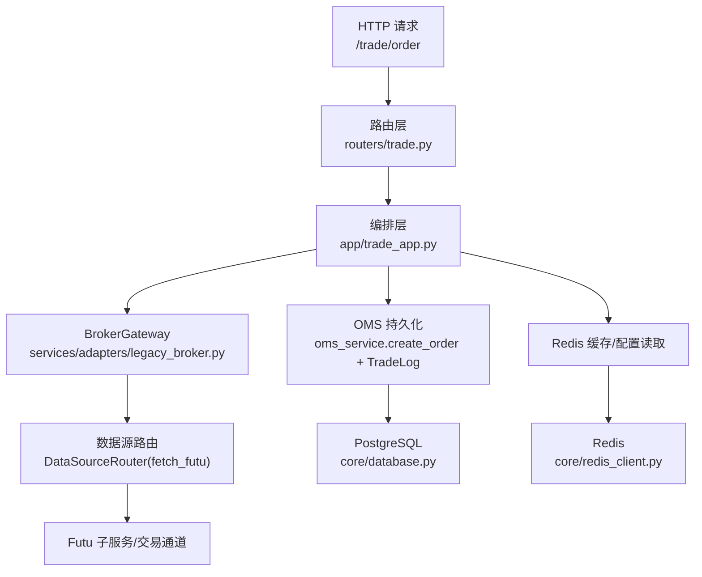
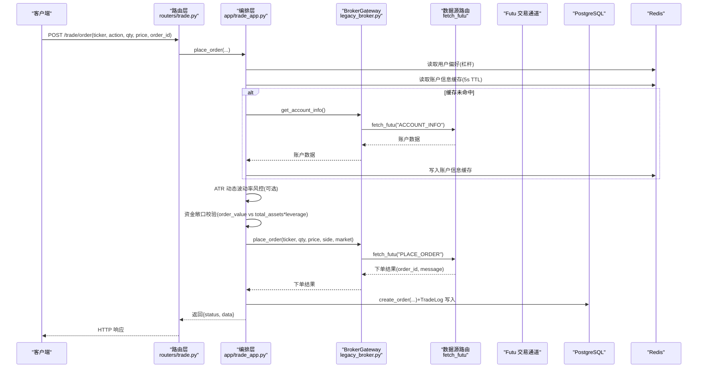
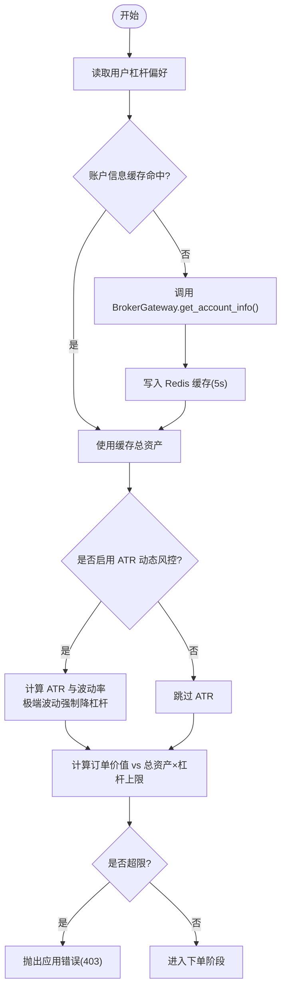
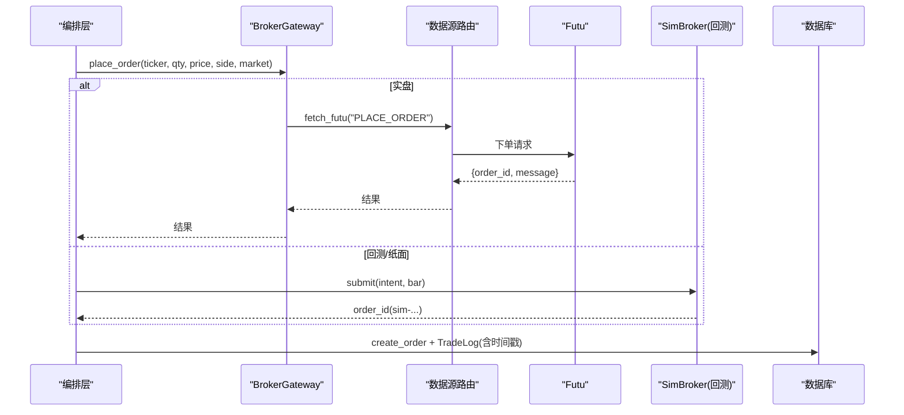
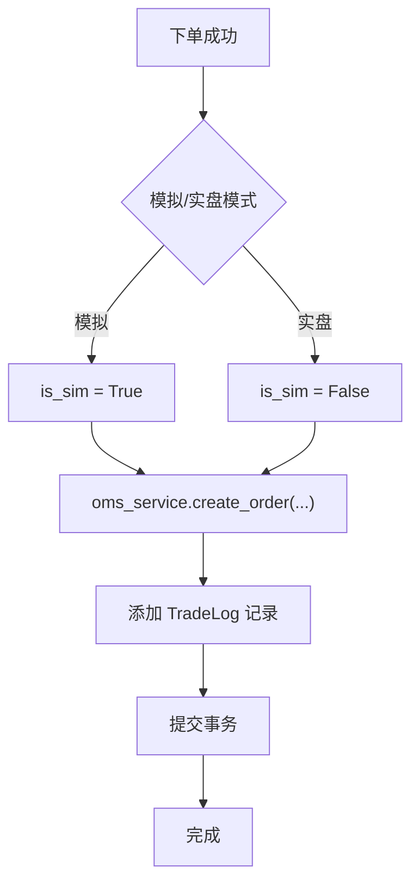
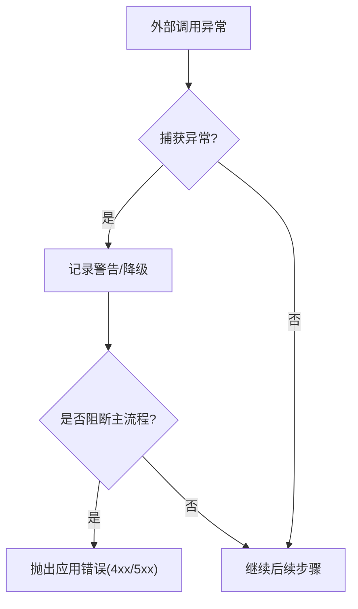
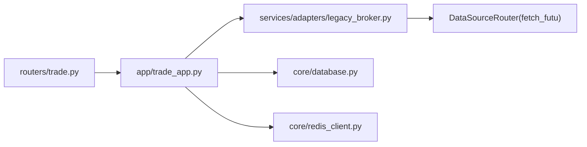

# 订单创建流程

<cite>
**本文引用的文件**
- [backend/routers/trade.py](file://backend/routers/trade.py)
- [backend/app/trade_app.py](file://backend/app/trade_app.py)
- [backend/app/broker.py](file://backend/app/broker.py)
- [backend/services/adapters/legacy_broker.py](file://backend/services/adapters/legacy_broker.py)
- [backend/core/database.py](file://backend/core/database.py)
- [backend/core/redis_client.py](file://backend/core/redis_client.py)
- [backend/engine/drivers/sim_broker.py](file://backend/engine/drivers/sim_broker.py)
</cite>

## 目录
1. [简介](#简介)
2. [项目结构](#项目结构)
3. [核心组件](#核心组件)
4. [架构总览](#架构总览)
5. [详细组件分析](#详细组件分析)
6. [依赖关系分析](#依赖关系分析)
7. [性能考量](#性能考量)
8. [故障排查指南](#故障排查指南)
9. [结论](#结论)
10. [附录](#附录)

## 简介
本文件面向“订单创建”的端到端流程，覆盖从参数校验、风险检查、订单提交到状态持久化的完整链路。重点说明：
- 参数验证机制：股票代码格式、数量范围、价格合理性
- 风险检查流程：账户余额与杠杆限制、持仓与敞口控制、交易权限确认（通过券商可达性）
- 订单提交过程：与券商接口通信、订单号生成、时间戳记录
- 状态持久化：数据库写入、Redis 缓存同步、PubSub 事件广播
- 异常处理策略：网络超时重试、数据一致性保证、事务回滚机制
- 代码示例路径与错误处理演示

## 项目结构
订单创建在 FastAPI 路由层接收请求，交由编排层进行风控与下单编排，再通过 BrokerGateway 调用下游数据源（Futu），最后将订单结果持久化至数据库并落盘日志。

图表来源
- [backend/routers/trade.py:30-39](file://backend/routers/trade.py#L30-L39)
- [backend/app/trade_app.py:35-187](file://backend/app/trade_app.py#L35-L187)
- [backend/services/adapters/legacy_broker.py:37-74](file://backend/services/adapters/legacy_broker.py#L37-L74)
- [backend/core/database.py:1-67](file://backend/core/database.py#L1-L67)
- [backend/core/redis_client.py:1-252](file://backend/core/redis_client.py#L1-L252)

章节来源
- [backend/routers/trade.py:1-57](file://backend/routers/trade.py#L1-L57)
- [backend/app/trade_app.py:1-232](file://backend/app/trade_app.py#L1-L232)

## 核心组件
- 路由层：负责 HTTP 映射与鉴权注入，将发单请求转发给编排层。
- 编排层：聚合风控偏好、账户信息缓存、ATR 动态波动率风控、资金敞口校验、下单分发、OMS 持久化与留痕。
- BrokerGateway：统一封装 Futu 交易上下文与操作（下单、撤单、查询、账户信息、紧急清仓）。
- OMS 持久化：使用独立 DB Session 写入订单与交易日志，支持模拟/实盘模式标记。
- Redis：提供用户偏好、账户信息缓存、交易模式开关等共享状态；具备批量写入与 L1 本地缓存能力。
- 数据库：PostgreSQL/SQLite 连接池与异步会话工厂，供 OMS 与查询使用。

章节来源
- [backend/routers/trade.py:10-57](file://backend/routers/trade.py#L10-L57)
- [backend/app/trade_app.py:11-232](file://backend/app/trade_app.py#L11-L232)
- [backend/services/adapters/legacy_broker.py:17-109](file://backend/services/adapters/legacy_broker.py#L17-L109)
- [backend/core/redis_client.py:1-252](file://backend/core/redis_client.py#L1-L252)
- [backend/core/database.py:1-67](file://backend/core/database.py#L1-L67)

## 架构总览
订单创建的关键阶段与交互如下：

图表来源
- [backend/routers/trade.py:30-39](file://backend/routers/trade.py#L30-L39)
- [backend/app/trade_app.py:35-187](file://backend/app/trade_app.py#L35-L187)
- [backend/services/adapters/legacy_broker.py:37-74](file://backend/services/adapters/legacy_broker.py#L37-L74)
- [backend/core/redis_client.py:1-252](file://backend/core/redis_client.py#L1-L252)
- [backend/core/database.py:1-67](file://backend/core/database.py#L1-L67)

## 详细组件分析

### 参数验证机制
- 股票代码格式验证：通过格式化函数将输入 ticker 转换为 Yahoo Finance 风格，用于后续技术指标获取与风控计算。
- 数量范围检查：由下游 BrokerGateway 与数据源侧执行（如最小交易单位、涨跌停限制等），本层主要做业务前置校验。
- 价格合理性校验：若价格为 0 或负数，则视为市价单；否则为限价单。同时结合 ATR 动态止损建议值作为辅助参考。

章节来源
- [backend/app/trade_app.py:81-104](file://backend/app/trade_app.py#L81-L104)
- [backend/app/trade_app.py:149-159](file://backend/app/trade_app.py#L149-L159)

### 风险检查流程
- 账户余额与杠杆限制：读取用户偏好中的默认杠杆倍数，结合实时总资产计算最大允许订单价值；超限直接拒绝。
- 持仓限制与敞口控制：基于订单价值与总资产×杠杆上限进行敞口校验，避免过度集中与高杠杆风险。
- 交易权限确认：通过 BrokerGateway.has_trade_ctx 探测 Futu 子服务健康状态，确保交易通道可用。

图表来源
- [backend/app/trade_app.py:44-115](file://backend/app/trade_app.py#L44-L115)
- [backend/services/adapters/legacy_broker.py:76-84](file://backend/services/adapters/legacy_broker.py#L76-L84)

章节来源
- [backend/app/trade_app.py:44-115](file://backend/app/trade_app.py#L44-L115)
- [backend/services/adapters/legacy_broker.py:76-84](file://backend/services/adapters/legacy_broker.py#L76-L84)

### 订单提交过程
- 与券商接口通信：通过 BrokerGateway.place_order 调用数据源路由的 fetch_futu("PLACE_ORDER")，完成下单。
- 订单号生成：Futu 返回 order_id；若为模拟撮合引擎（回测/纸面），SimBroker 会生成 sim- 前缀的订单 ID。
- 时间戳记录：下单成功后写入 OMS 订单表与 TradeLog，包含时间戳、标的、方向、价格、数量、状态与消息。

图表来源
- [backend/services/adapters/legacy_broker.py:37-56](file://backend/services/adapters/legacy_broker.py#L37-L56)
- [backend/engine/drivers/sim_broker.py:81-113](file://backend/engine/drivers/sim_broker.py#L81-L113)
- [backend/app/trade_app.py:132-174](file://backend/app/trade_app.py#L132-L174)

章节来源
- [backend/services/adapters/legacy_broker.py:37-74](file://backend/services/adapters/legacy_broker.py#L37-L74)
- [backend/engine/drivers/sim_broker.py:81-113](file://backend/engine/drivers/sim_broker.py#L81-L113)
- [backend/app/trade_app.py:132-174](file://backend/app/trade_app.py#L132-L174)

### 状态持久化
- 数据库写入：使用独立的 SessionLocal 创建订单与交易日志，避免生命周期冲突；支持模拟/实盘模式标记。
- Redis 缓存同步：账户信息缓存 5 秒 TTL；用户偏好与交易模式开关通过 Redis 快速读取。
- PubSub 事件广播：当前实现以 Redis 缓存与日志为主；如需事件广播，可基于 Redis Pub/Sub 扩展（例如订阅 trade 频道推送新订单状态）。

图表来源
- [backend/app/trade_app.py:138-174](file://backend/app/trade_app.py#L138-L174)
- [backend/core/database.py:27-67](file://backend/core/database.py#L27-L67)

章节来源
- [backend/app/trade_app.py:138-174](file://backend/app/trade_app.py#L138-L174)
- [backend/core/database.py:27-67](file://backend/core/database.py#L27-L67)

### 异常处理策略
- 网络超时重试：BrokerGateway 与数据源路由对远程调用进行容错；若失败，返回错误结构，上层根据 status 判断并抛出应用错误。
- 数据一致性保证：OMS 持久化使用独立 DB Session，并在 finally 中关闭；下单失败不阻断主流程，仅记录警告。
- 事务回滚机制：当前 OMS 写入采用显式 commit；若需强一致，可在编排层引入事务边界，失败时回滚。

图表来源
- [backend/app/trade_app.py:129-131](file://backend/app/trade_app.py#L129-L131)
- [backend/app/trade_app.py:173-174](file://backend/app/trade_app.py#L173-L174)
- [backend/services/adapters/legacy_broker.py:97-105](file://backend/services/adapters/legacy_broker.py#L97-L105)

章节来源
- [backend/app/trade_app.py:129-131](file://backend/app/trade_app.py#L129-L131)
- [backend/app/trade_app.py:173-174](file://backend/app/trade_app.py#L173-L174)
- [backend/services/adapters/legacy_broker.py:97-105](file://backend/services/adapters/legacy_broker.py#L97-L105)

## 依赖关系分析
- 路由层依赖编排层：/trade/order 仅做映射与鉴权，逻辑集中在 trade_app。
- 编排层依赖 BrokerGateway：统一抽象券商接口，屏蔽底层细节。
- BrokerGateway 依赖数据源路由：通过 fetch_futu 调用 Futu 子服务，解耦主进程与交易通道。
- 持久化依赖数据库与 Redis：数据库用于订单与日志持久化；Redis 用于缓存与配置。

图表来源
- [backend/routers/trade.py:10-57](file://backend/routers/trade.py#L10-L57)
- [backend/app/trade_app.py:11-232](file://backend/app/trade_app.py#L11-L232)
- [backend/services/adapters/legacy_broker.py:17-109](file://backend/services/adapters/legacy_broker.py#L17-L109)
- [backend/core/database.py:1-67](file://backend/core/database.py#L1-L67)
- [backend/core/redis_client.py:1-252](file://backend/core/redis_client.py#L1-L252)

章节来源
- [backend/routers/trade.py:10-57](file://backend/routers/trade.py#L10-L57)
- [backend/app/trade_app.py:11-232](file://backend/app/trade_app.py#L11-L232)
- [backend/services/adapters/legacy_broker.py:17-109](file://backend/services/adapters/legacy_broker.py#L17-L109)

## 性能考量
- 账户信息缓存：Redis 缓存 5 秒 TTL，配合并发锁防止穿透，显著降低高频下单时的券商 API 压力。
- Redis 批量写入：RedisAsyncBatchWriter 使用 Pipeline 批量发送，减少 RTT 与带宽占用。
- L1 本地缓存：LocalL1Cache 提供进程内短效缓存，消除极高频读取的网络开销。
- 数据库连接池：PostgreSQL/MySQL 连接池参数可配置，提升并发写入能力。

章节来源
- [backend/app/trade_app.py:53-74](file://backend/app/trade_app.py#L53-L74)
- [backend/core/redis_client.py:46-177](file://backend/core/redis_client.py#L46-L177)
- [backend/core/redis_client.py:184-252](file://backend/core/redis_client.py#L184-L252)
- [backend/core/database.py:14-25](file://backend/core/database.py#L14-L25)

## 故障排查指南
- 无法获取账户信息：检查 BrokerGateway.has_trade_ctx 与数据源路由健康检查；确认 Futu 子服务可用。
- 风控拦截：核对用户偏好中的杠杆设置与总资产；关注 ATR 动态风控导致的强制降杠杆。
- 下单失败：查看 BrokerGateway 返回的错误结构与消息；必要时增加日志级别定位。
- 持久化异常：检查数据库连接与权限；确认 oms_service 与 TradeLog 写入逻辑正常。
- Redis 问题：确认连接池大小与密码配置；监控批量写入队列深度与 flush 成功率。

章节来源
- [backend/services/adapters/legacy_broker.py:76-84](file://backend/services/adapters/legacy_broker.py#L76-L84)
- [backend/app/trade_app.py:69-74](file://backend/app/trade_app.py#L69-L74)
- [backend/app/trade_app.py:129-131](file://backend/app/trade_app.py#L129-L131)
- [backend/app/trade_app.py:173-174](file://backend/app/trade_app.py#L173-L174)
- [backend/core/redis_client.py:14-34](file://backend/core/redis_client.py#L14-L34)

## 结论
本系统通过分层设计将订单创建流程清晰解耦：路由层专注 HTTP 映射，编排层承担风控与编排，BrokerGateway 统一券商接口，OMS 负责持久化与留痕。借助 Redis 缓存与批量写入、数据库连接池优化，系统在并发与延迟方面具备良好表现。异常处理与降级策略保障了稳定性与可观测性。

## 附录
- 代码示例路径（按功能）：
  - 路由层发单入口：[backend/routers/trade.py:30-39](file://backend/routers/trade.py#L30-L39)
  - 编排层下单与风控：[backend/app/trade_app.py:35-187](file://backend/app/trade_app.py#L35-L187)
  - BrokerGateway 下单/查询/账户：[backend/services/adapters/legacy_broker.py:37-74](file://backend/services/adapters/legacy_broker.py#L37-L74)
  - 模拟撮合引擎订单提交：[backend/engine/drivers/sim_broker.py:81-113](file://backend/engine/drivers/sim_broker.py#L81-L113)
  - 数据库会话与连接池：[backend/core/database.py:27-67](file://backend/core/database.py#L27-L67)
  - Redis 缓存与批量写入：[backend/core/redis_client.py:46-177](file://backend/core/redis_client.py#L46-L177)
