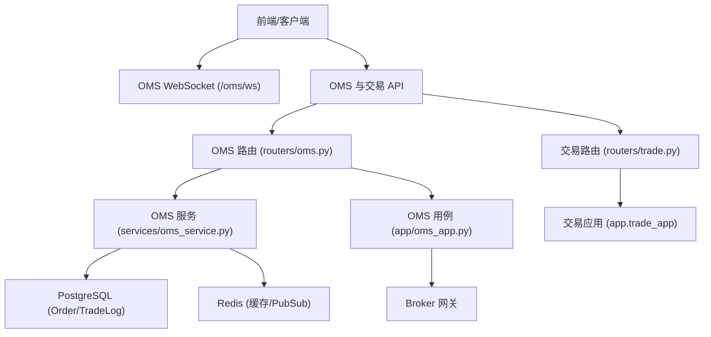
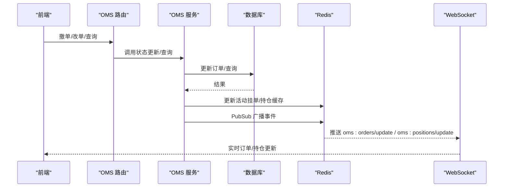
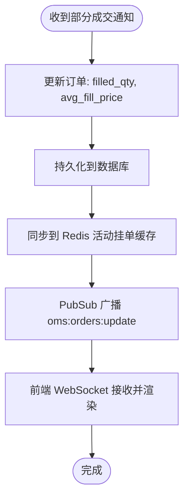
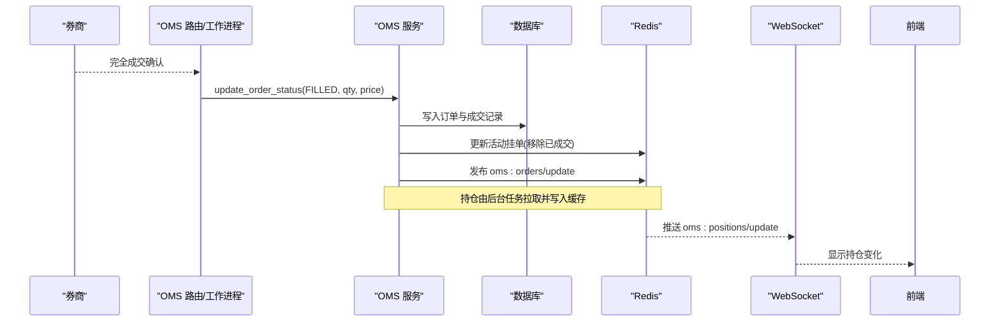
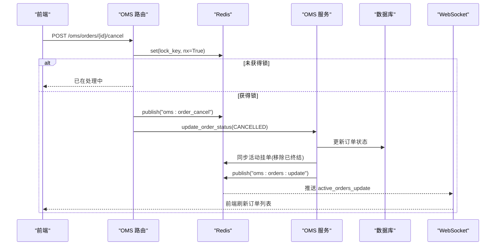
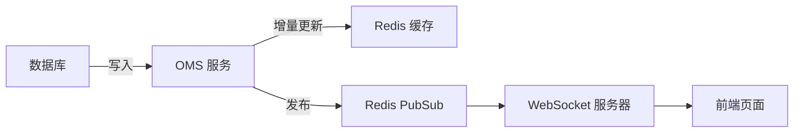
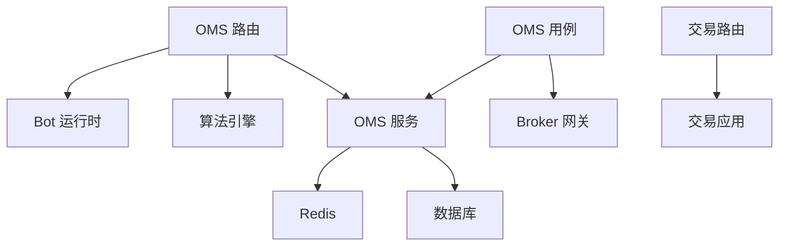

# 订单更新机制

<cite>
**本文引用的文件**
- [backend/services/oms_service.py](file://backend/services/oms_service.py)
- [backend/routers/oms.py](file://backend/routers/oms.py)
- [backend/app/oms_app.py](file://backend/app/oms_app.py)
- [backend/routers/trade.py](file://backend/routers/trade.py)
</cite>

## 目录
1. [简介](#简介)
2. [项目结构](#项目结构)
3. [核心组件](#核心组件)
4. [架构总览](#架构总览)
5. [详细组件分析](#详细组件分析)
6. [依赖关系分析](#依赖关系分析)
7. [性能考虑](#性能考虑)
8. [故障排查指南](#故障排查指南)
9. [结论](#结论)
10. [附录：API 与 WebSocket 事件示例](#附录api-与-websocket-事件示例)

## 简介
本文件面向“订单更新机制”的完整说明，覆盖以下关键主题：
- 触发场景：部分成交通知、完全成交确认、撤单请求、状态同步。
- 部分成交处理：成交量累加、平均成交价计算、剩余数量更新。
- 完全成交确认：订单状态变更、成交记录生成、持仓调整。
- 撤单处理逻辑：活动订单查找、状态更新、缓存清理。
- 状态同步机制：数据库更新、Redis 缓存刷新、前端实时推送。
- 并发控制：订单更新锁、数据一致性保证、冲突解决策略。
- API 接口与 WebSocket 事件示例，便于前后端联调与集成。

## 项目结构
围绕订单更新的核心代码分布在服务层、路由层与应用编排层：
- 服务层（OMS 服务）：负责订单持久化、状态更新、活动挂单缓存同步、持仓同步与广播。
- 路由层（OMS 路由、交易路由）：提供 HTTP 接口与 WebSocket 通道，承载下单、改单、撤单、模式切换等能力。
- 应用编排层（OMS 用例）：实现熔断清仓等跨组件编排流程。

图表来源
- [backend/routers/oms.py:56-84](file://backend/routers/oms.py#L56-L84)
- [backend/routers/oms.py:120-177](file://backend/routers/oms.py#L120-L177)
- [backend/routers/oms.py:379-464](file://backend/routers/oms.py#L379-L464)
- [backend/services/oms_service.py:34-114](file://backend/services/oms_service.py#L34-L114)
- [backend/app/oms_app.py:24-53](file://backend/app/oms_app.py#L24-L53)
- [backend/routers/trade.py:30-56](file://backend/routers/trade.py#L30-L56)

章节来源
- [backend/routers/oms.py:56-84](file://backend/routers/oms.py#L56-L84)
- [backend/services/oms_service.py:34-114](file://backend/services/oms_service.py#L34-L114)
- [backend/app/oms_app.py:24-53](file://backend/app/oms_app.py#L24-L53)
- [backend/routers/trade.py:30-56](file://backend/routers/trade.py#L30-L56)

## 核心组件
- OMS 服务（OmsService）
  - 订单创建与持久化、状态更新、活动挂单缓存同步、历史成交查询、持仓同步与缓存读取、熔断批量取消。
  - 通过 Redis PubSub 广播订单与持仓变更，供前端 WebSocket 消费。
- OMS 路由（/oms/*）
  - 提供获取初始状态、撤单、改单、持仓查询、算法拆单控制、交易模式切换、WebSocket 实时推送等能力。
  - 使用 Redis 分布式锁保障撤单的幂等性。
- 交易路由（/trade/*）
  - 对外暴露下单、账户信息、组合资产、交易日志等接口，内部调用交易应用编排。
- OMS 用例（app/oms_app.py）
  - 熔断信号广播与紧急清仓编排，联动 Broker、Bot、Algo 与 OMS 服务。

章节来源
- [backend/services/oms_service.py:29-276](file://backend/services/oms_service.py#L29-L276)
- [backend/routers/oms.py:56-464](file://backend/routers/oms.py#L56-L464)
- [backend/routers/trade.py:30-56](file://backend/routers/trade.py#L30-L56)
- [backend/app/oms_app.py:24-53](file://backend/app/oms_app.py#L24-L53)

## 架构总览
订单更新的端到端路径包括：
- 外部事件（券商回调/轮询/人工操作）进入路由层或工作进程。
- 路由层校验并调用 OMS 服务进行状态更新与缓存同步。
- OMS 服务写入数据库并更新 Redis 缓存，同时通过 PubSub 广播事件。
- 前端通过 WebSocket 订阅对应频道，接收实时推送。

图表来源
- [backend/routers/oms.py:120-177](file://backend/routers/oms.py#L120-L177)
- [backend/services/oms_service.py:79-114](file://backend/services/oms_service.py#L79-L114)
- [backend/services/oms_service.py:218-244](file://backend/services/oms_service.py#L218-L244)
- [backend/routers/oms.py:379-464](file://backend/routers/oms.py#L379-L464)

## 详细组件分析

### 部分成交处理（成交量累加、平均成交价计算、剩余数量更新）
- 触发来源：券商回调或定时轮询将部分成交通知送达系统。
- 处理要点：
  - 在 OMS 服务中通过“更新订单状态”方法更新已成交量与平均成交价，并持久化到数据库。
  - 同步更新 Redis 中的活动挂单列表，确保前端能立即看到最新成交进度。
  - 通过 PubSub 广播活动订单变更，前端 WebSocket 实时更新 UI。
- 注意：
  - 若需要精确的“成交量累加”和“加权平均成交价”，应在上游回调中传入累计值或由服务层基于历史成交记录计算后统一写回；当前服务层支持直接设置 filled_qty 与 avg_fill_price。
  - 对于 PARTIALLY_FILLED 状态的订单，后续仍可继续成交直至 FILLED 或 CANCELLED。

图表来源
- [backend/services/oms_service.py:79-114](file://backend/services/oms_service.py#L79-L114)
- [backend/services/oms_service.py:218-244](file://backend/services/oms_service.py#L218-L244)
- [backend/routers/oms.py:379-464](file://backend/routers/oms.py#L379-L464)

章节来源
- [backend/services/oms_service.py:79-114](file://backend/services/oms_service.py#L79-L114)
- [backend/services/oms_service.py:218-244](file://backend/services/oms_service.py#L218-L244)

### 完全成交确认（订单状态变更、成交记录生成、持仓调整）
- 触发来源：券商确认订单完全成交。
- 处理要点：
  - 将订单状态更新为 FILLED，并写入最终成交量与均价。
  - 生成/关联成交记录（TradeLog），用于历史成交查询与报表。
  - 持仓由后台任务从券商拉取并写入 Redis 缓存，随后通过 PubSub 推送至前端。
- 注意：
  - 持仓数据采用独立同步流程（定时或事件驱动），避免阻塞订单主链路。

图表来源
- [backend/services/oms_service.py:79-114](file://backend/services/oms_service.py#L79-L114)
- [backend/services/oms_service.py:155-182](file://backend/services/oms_service.py#L155-L182)
- [backend/routers/oms.py:379-464](file://backend/routers/oms.py#L379-L464)

章节来源
- [backend/services/oms_service.py:79-114](file://backend/services/oms_service.py#L79-L114)
- [backend/services/oms_service.py:155-182](file://backend/services/oms_service.py#L155-L182)

### 撤单处理逻辑（活动订单查找、状态更新、缓存清理）
- 触发来源：用户主动撤单或风控熔断。
- 处理要点：
  - 路由层使用 Redis 分布式锁（基于幂等键）防止重复撤单。
  - 通过 PubSub 下发撤单指令给底层网关，同时将订单状态更新为 CANCELLED。
  - 服务层在同步缓存时自动移除已终结订单（CANCELLED/FILLED/REJECTED/EXPIRED）。
  - 熔断场景下，批量标记所有活动订单为 CANCELLED，并清空活动挂单缓存。

图表来源
- [backend/routers/oms.py:120-147](file://backend/routers/oms.py#L120-L147)
- [backend/services/oms_service.py:79-114](file://backend/services/oms_service.py#L79-L114)
- [backend/services/oms_service.py:218-244](file://backend/services/oms_service.py#L218-L244)

章节来源
- [backend/routers/oms.py:120-147](file://backend/routers/oms.py#L120-L147)
- [backend/services/oms_service.py:218-244](file://backend/services/oms_service.py#L218-L244)

### 状态同步机制（数据库更新、Redis 缓存刷新、前端实时推送）
- 数据库更新：所有订单状态与成交记录均通过 SQLAlchemy Session 持久化。
- Redis 缓存刷新：
  - 活动挂单列表：每次订单状态变更后增量更新，带 TTL 过期保护。
  - 持仓列表：后台任务从券商拉取并写入市场维度缓存，附带短 TTL。
- 前端实时推送：
  - 通过 Redis PubSub 频道（如 oms:orders/update、oms:positions/update）广播。
  - 前端 WebSocket 订阅多个频道，按类型分发事件。

图表来源
- [backend/services/oms_service.py:79-114](file://backend/services/oms_service.py#L79-L114)
- [backend/services/oms_service.py:155-182](file://backend/services/oms_service.py#L155-L182)
- [backend/routers/oms.py:379-464](file://backend/routers/oms.py#L379-L464)

章节来源
- [backend/services/oms_service.py:79-114](file://backend/services/oms_service.py#L79-L114)
- [backend/services/oms_service.py:155-182](file://backend/services/oms_service.py#L155-L182)
- [backend/routers/oms.py:379-464](file://backend/routers/oms.py#L379-L464)

### 并发控制（订单更新锁、数据一致性保证、冲突解决策略）
- 幂等性与防重：
  - 撤单接口使用 Redis 分布式锁（NX + TTL），基于 idempotency_key 保证同一请求只处理一次。
- 数据一致性：
  - 订单状态更新在同一事务内完成（提交或回滚），失败时回滚数据库。
  - 缓存与数据库不一致时，优先以数据库为准，并通过 PubSub 广播修正前端视图。
- 冲突解决：
  - 对活动挂单列表采用“读当前缓存 → 增删改 → 写回”的原子替换策略，避免并发覆盖。
  - 持仓缓存设置短 TTL，定期从券商刷新，减少脏读风险。

章节来源
- [backend/routers/oms.py:120-147](file://backend/routers/oms.py#L120-L147)
- [backend/services/oms_service.py:79-114](file://backend/services/oms_service.py#L79-L114)
- [backend/services/oms_service.py:218-244](file://backend/services/oms_service.py#L218-L244)

## 依赖关系分析
- 路由层依赖：
  - OMS 路由依赖 OMS 服务、审计服务、算法引擎与 Bot 运行时。
  - 交易路由依赖交易应用编排。
- 服务层依赖：
  - OMS 服务依赖数据库会话、Redis 客户端、数据源路由（用于持仓同步）。
- 应用编排层依赖：
  - OMS 用例依赖 Broker 网关、Bot 运行时、算法引擎与 OMS 服务。

图表来源
- [backend/routers/oms.py:56-464](file://backend/routers/oms.py#L56-L464)
- [backend/routers/trade.py:30-56](file://backend/routers/trade.py#L30-L56)
- [backend/services/oms_service.py:29-276](file://backend/services/oms_service.py#L29-L276)
- [backend/app/oms_app.py:24-53](file://backend/app/oms_app.py#L24-L53)

章节来源
- [backend/routers/oms.py:56-464](file://backend/routers/oms.py#L56-L464)
- [backend/routers/trade.py:30-56](file://backend/routers/trade.py#L30-L56)
- [backend/services/oms_service.py:29-276](file://backend/services/oms_service.py#L29-L276)
- [backend/app/oms_app.py:24-53](file://backend/app/oms_app.py#L24-L53)

## 性能考虑
- 缓存优先：活动挂单与持仓优先从 Redis 读取，降低数据库压力。
- 短 TTL：持仓缓存设置较短过期时间，保证数据新鲜度。
- 异步广播：通过 PubSub 解耦写入与推送，提升吞吐。
- 幂等锁：撤单使用分布式锁，避免重复处理带来的额外开销。
- 批处理：熔断场景批量更新订单状态，减少多次往返。

[本节为通用指导，不直接分析具体文件]

## 故障排查指南
- 订单状态未更新：
  - 检查数据库事务是否成功提交，查看日志中的错误回滚信息。
  - 确认 Redis 活动挂单缓存是否被正确同步。
- 前端未收到推送：
  - 检查 WebSocket 连接是否鉴权通过，订阅频道是否正确。
  - 确认 Redis PubSub 频道是否有消息产出。
- 撤单重复或丢失：
  - 核对 idempotency_key 是否唯一且有效。
  - 检查分布式锁是否超时或被提前释放。
- 持仓数据陈旧：
  - 确认后台持仓同步任务是否正常运行。
  - 检查 Redis 持仓缓存 TTL 与数据源返回状态。

章节来源
- [backend/routers/oms.py:120-147](file://backend/routers/oms.py#L120-L147)
- [backend/routers/oms.py:379-464](file://backend/routers/oms.py#L379-L464)
- [backend/services/oms_service.py:79-114](file://backend/services/oms_service.py#L79-L114)
- [backend/services/oms_service.py:155-182](file://backend/services/oms_service.py#L155-L182)

## 结论
该订单更新机制通过“服务层统一处理 + 路由层接口暴露 + 应用编排协同”的方式，实现了订单状态变更、成交记录生成、持仓同步与前端实时推送的闭环。借助 Redis 缓存与 PubSub，系统在一致性与实时性之间取得平衡；通过分布式锁与事务回滚，保障了并发安全与数据一致性。熔断与紧急清仓提供了强韧的风控兜底能力。

[本节为总结性内容，不直接分析具体文件]

## 附录：API 与 WebSocket 事件示例
- 订单相关 API
  - 获取 OMS 初始状态：GET /oms/state
  - 撤单：POST /oms/orders/{order_id}/cancel
  - 改单：POST /oms/orders/{order_id}/modify
  - 查询持仓：GET /oms/positions?market=HK
  - 交易模式切换：POST /oms/mode/switch
- 交易相关 API
  - 下单：POST /trade/order
  - 账户信息：GET /trade/account?market=HK
  - 组合资产：GET /trade/portfolio
  - 交易日志：GET /trade/trades?limit=100
- WebSocket 事件
  - 连接：WS /oms/ws?token=...
  - 订阅频道：oms:bots/update、oms:orders/update、oms:trades/new、oms:bot_log:stream、oms:algo_executions/update、oms:positions/update、oms:mode_change
  - 事件类型：bots_update、active_orders_update、new_trade、bot_log、algo_executions_update、positions_update、mode_change

章节来源
- [backend/routers/oms.py:56-84](file://backend/routers/oms.py#L56-L84)
- [backend/routers/oms.py:120-177](file://backend/routers/oms.py#L120-L177)
- [backend/routers/oms.py:180-371](file://backend/routers/oms.py#L180-L371)
- [backend/routers/oms.py:379-464](file://backend/routers/oms.py#L379-L464)
- [backend/routers/trade.py:30-56](file://backend/routers/trade.py#L30-L56)
