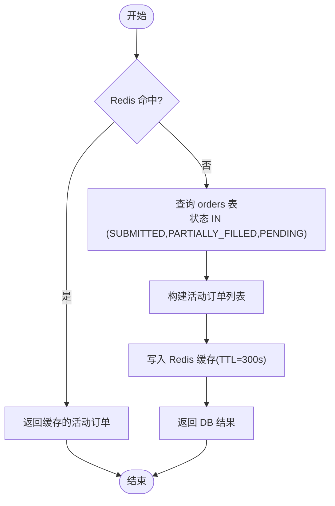
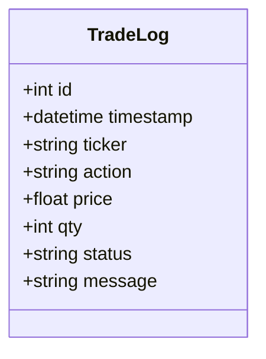
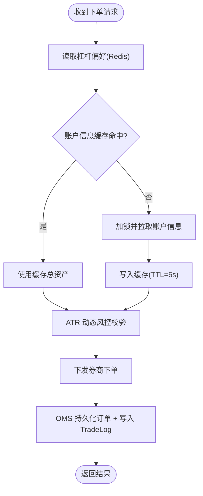
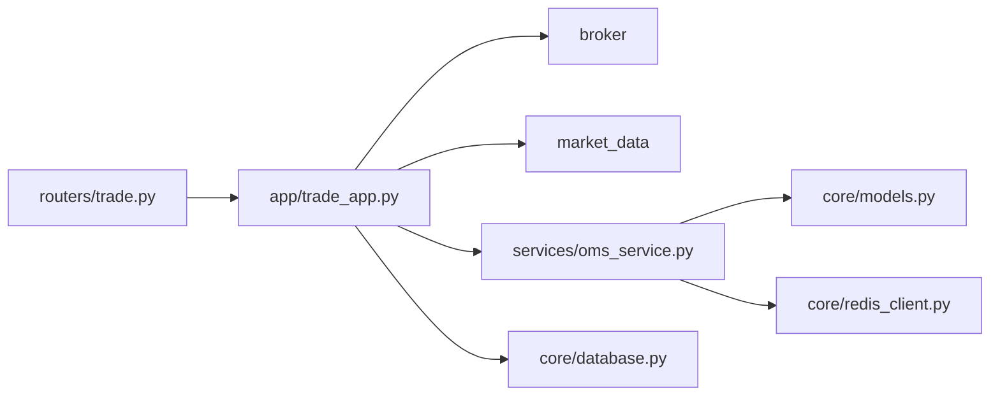

# 订单查询管理

<cite>
**本文引用的文件**
- [backend/routers/trade.py](file://backend/routers/trade.py)
- [backend/app/trade_app.py](file://backend/app/trade_app.py)
- [backend/services/oms_service.py](file://backend/services/oms_service.py)
- [backend/core/models.py](file://backend/core/models.py)
- [backend/core/redis_client.py](file://backend/core/redis_client.py)
- [backend/core/database.py](file://backend/core/database.py)
- [backend/routers/auth.py](file://backend/routers/auth.py)
- [backend/tests/test_router_trade.py](file://backend/tests/test_router_trade.py)
</cite>

## 目录
1. [简介](#简介)
2. [项目结构](#项目结构)
3. [核心组件](#核心组件)
4. [架构总览](#架构总览)
5. [详细组件分析](#详细组件分析)
6. [依赖关系分析](#依赖关系分析)
7. [性能考虑](#性能考虑)
8. [故障排查指南](#故障排查指南)
9. [结论](#结论)
10. [附录：接口规范与示例](#附录接口规范与示例)

## 简介
本文件面向“订单查询管理”能力，覆盖以下目标：
- 活动挂单查询：实时获取 SUBMITTED、PARTIALLY_FILLED 状态的订单列表，支持分页与过滤。
- 历史订单查询：按时间范围、订单状态、股票代码筛选历史交易记录。
- 成交记录获取：TradeLog 表的数据结构、成交详情展示、PnL 计算说明。
- 查询优化策略：Redis 缓存机制、数据库索引优化、查询性能监控。
- 实时数据同步：WebSocket 推送、增量更新、数据一致性保证。
- 查询接口设计：RESTful API 规范、请求参数说明、响应格式定义。
- 使用示例与性能测试数据：提供调用示例与基准指标建议。

## 项目结构
围绕订单查询的核心代码分布在路由层、应用编排层、OMS 服务层与数据模型层：
- 路由层：暴露 HTTP 接口，负责鉴权与参数映射。
- 应用编排层：风控校验、账户信息缓存、下单分发、订单持久化与留痕。
- OMS 服务层：订单持久化、活动挂单缓存、历史成交读取、持仓同步、PubSub 广播。
- 数据模型层：订单表 orders、成交日志表 trade_logs 等。
- 基础设施：Redis 客户端、数据库会话、认证依赖。

```mermaid
graph TB
Client["前端/客户端"] --> Router["交易路由 /trade/*"]
Router --> App["交易编排 trade_app"]
App --> Broker["券商网关 broker"]
App --> OMS["OMS 服务 oms_service"]
OMS --> DB["PostgreSQL (orders, trade_logs)"]
OMS --> Redis["Redis (活动挂单/持仓缓存 + PubSub)"]
Client <-- WS["WebSocket 推送(oms:orders/update)"]
```

图表来源
- [backend/routers/trade.py:23-56](file://backend/routers/trade.py#L23-L56)
- [backend/app/trade_app.py:35-187](file://backend/app/trade_app.py#L35-L187)
- [backend/services/oms_service.py:29-244](file://backend/services/oms_service.py#L29-L244)
- [backend/core/models.py:269-289](file://backend/core/models.py#L269-L289)
- [backend/core/models.py:53-63](file://backend/core/models.py#L53-L63)

章节来源
- [backend/routers/trade.py:23-56](file://backend/routers/trade.py#L23-L56)
- [backend/app/trade_app.py:35-187](file://backend/app/trade_app.py#L35-L187)
- [backend/services/oms_service.py:29-244](file://backend/services/oms_service.py#L29-L244)
- [backend/core/models.py:53-63](file://backend/core/models.py#L53-L63)
- [backend/core/models.py:269-289](file://backend/core/models.py#L269-L289)

## 核心组件
- 交易路由（/trade）：提供发单、账户信息、组合概览、最新交易日志查询等端点。
- 交易编排（place_order/get_trades）：风控校验、账户信息缓存、下单分发、订单持久化与 TradeLog 留痕。
- OMS 服务：订单持久化、活动挂单缓存、历史成交读取、持仓同步、熔断标记、PubSub 广播。
- 数据模型：Order（订单）、TradeLog（成交日志）。
- 基础设施：Redis 客户端（缓存与消息）、数据库会话（SQLAlchemy Session）。

章节来源
- [backend/routers/trade.py:30-56](file://backend/routers/trade.py#L30-L56)
- [backend/app/trade_app.py:35-232](file://backend/app/trade_app.py#L35-L232)
- [backend/services/oms_service.py:29-276](file://backend/services/oms_service.py#L29-L276)
- [backend/core/models.py:53-63](file://backend/core/models.py#L53-L63)
- [backend/core/models.py:269-289](file://backend/core/models.py#L269-L289)

## 架构总览
订单查询的端到端流程包括：
- 活动挂单查询：优先从 Redis 缓存读取活动订单，未命中则回源 DB 并写回缓存；变更通过 PubSub 广播。
- 历史成交查询：从 trade_logs 表按时间倒序拉取，可结合索引与分页优化。
- 实时同步：订单状态更新时，同步到 Redis 并广播，前端通过 WebSocket 订阅增量更新。
- 一致性保障：DB 事务提交后更新缓存并广播；并发场景下对账户信息读取加锁防穿透。

```mermaid
sequenceDiagram
participant FE as "前端"
participant RT as "交易路由"
participant TA as "交易编排"
participant OM as "OMS 服务"
participant DB as "PostgreSQL"
participant RS as "Redis"
FE->>RT : GET /trade/trades?limit=...
RT->>TA : get_trades(limit)
TA->>DB : 查询 trade_logs (按时间倒序)
DB-->>TA : 成交记录列表
TA-->>FE : 返回成交记录
Note over OM,RS : 订单状态变更时
OM->>DB : 更新订单状态
OM->>RS : 写入活动挂单缓存
OM->>RS : 发布 oms : orders : update
FE--|>FE : WebSocket 接收增量更新
```

图表来源
- [backend/routers/trade.py:53-56](file://backend/routers/trade.py#L53-L56)
- [backend/app/trade_app.py:216-232](file://backend/app/trade_app.py#L216-L232)
- [backend/services/oms_service.py:79-143](file://backend/services/oms_service.py#L79-L143)
- [backend/services/oms_service.py:218-244](file://backend/services/oms_service.py#L218-L244)

## 详细组件分析

### 活动挂单查询（SUBMITTED/PARTIALLY_FILLED）
- 数据来源：优先 Redis 缓存键 quant:oms:active_orders；未命中则从 orders 表查询状态为 SUBMITTED、PARTIALLY_FILLED、PENDING 的记录，并按创建时间倒序排序。
- 缓存策略：查询结果以 JSON 形式写入 Redis，设置 TTL（例如 300 秒），降低 DB 压力。
- 增量更新：订单状态变更后，通过 _sync_order_to_redis 维护活动列表，并通过 _publish_orders_update 发布 oms:orders:update 事件。
- 前端消费：WebSocket 订阅该频道，实现增量刷新。



图表来源
- [backend/services/oms_service.py:118-143](file://backend/services/oms_service.py#L118-L143)
- [backend/services/oms_service.py:218-244](file://backend/services/oms_service.py#L218-L244)

章节来源
- [backend/services/oms_service.py:118-143](file://backend/services/oms_service.py#L118-L143)
- [backend/services/oms_service.py:218-244](file://backend/services/oms_service.py#L218-L244)

### 历史订单查询（按时间范围、状态、股票代码）
- 当前实现：get_trades 从 trade_logs 表按 timestamp 倒序取最近 N 条。
- 扩展建议：增加 time_range（start/end）、status、symbol 等过滤条件；利用 trade_logs 表的 timestamp、ticker、status 索引提升查询效率；采用分页（offset/limit）避免大结果集。
- 数据结构：trade_logs 包含 id、timestamp、ticker、action、price、qty、status、message。



图表来源
- [backend/core/models.py:53-63](file://backend/core/models.py#L53-L63)

章节来源
- [backend/app/trade_app.py:216-232](file://backend/app/trade_app.py#L216-L232)
- [backend/core/models.py:53-63](file://backend/core/models.py#L53-L63)

### 成交记录获取（TradeLog 结构与 PnL）
- 数据结构：见 TradeLog 模型字段。
- 成交详情展示：通过 OmsService._trade_to_api_format 将 TradeLog 转为 API 格式，包含 symbol、side、avg_price、qty、time 等。
- PnL 计算：当前 TradeLog 无 PnL 字段，_trade_to_api_format 中 pnl 固定为 0.0；建议在后续版本引入成本、滑点、佣金等字段以支持真实 PnL 计算。

章节来源
- [backend/services/oms_service.py:260-271](file://backend/services/oms_service.py#L260-L271)
- [backend/core/models.py:53-63](file://backend/core/models.py#L53-L63)

### 订单状态同步与实时推送
- 状态更新：update_order_status 修改订单状态并持久化，随后同步到 Redis 并广播。
- 活动列表维护：_sync_order_to_redis 根据订单终态移除或更新活动列表。
- 推送通道：通过 Redis PubSub 发布 oms:orders:update，前端 WebSocket 订阅实现增量更新。

```mermaid
sequenceDiagram
participant Svc as "OMS 服务"
participant DB as "PostgreSQL"
participant RS as "Redis"
participant FE as "前端"
Svc->>DB : 更新订单状态并提交
DB-->>Svc : 成功
Svc->>RS : 写入活动挂单缓存
Svc->>RS : 发布 oms : orders : update
FE--|>RS : 订阅 oms : orders : update
RS-->>FE : 推送增量订单列表
```

图表来源
- [backend/services/oms_service.py:79-114](file://backend/services/oms_service.py#L79-L114)
- [backend/services/oms_service.py:218-244](file://backend/services/oms_service.py#L218-L244)

章节来源
- [backend/services/oms_service.py:79-114](file://backend/services/oms_service.py#L79-L114)
- [backend/services/oms_service.py:218-244](file://backend/services/oms_service.py#L218-L244)

### 下单与留痕（含 TradeLog 写入）
- 风控与缓存：下单前读取用户杠杆偏好与账户总资产（带 5 秒缓存与并发锁），基于 ATR 动态波动率风控。
- 订单持久化：下单成功后通过 OMS 服务创建订单记录，同时写入 TradeLog 留痕（status=SUBMITTED）。
- 市场判断：根据 ticker 自动识别 HK/US 市场。



图表来源
- [backend/app/trade_app.py:35-187](file://backend/app/trade_app.py#L35-L187)

章节来源
- [backend/app/trade_app.py:35-187](file://backend/app/trade_app.py#L35-L187)

## 依赖关系分析
- 路由层依赖：FastAPI、认证依赖、交易编排函数。
- 编排层依赖：broker（券商网关）、market_data（技术指标）、redis_client、oms_service、models。
- OMS 服务依赖：SQLAlchemy Session、redis_client、models（Order、TradeLog）。
- 数据模型依赖：SQLAlchemy Base、各表字段与索引。



图表来源
- [backend/routers/trade.py:10-27](file://backend/routers/trade.py#L10-L27)
- [backend/app/trade_app.py:18-25](file://backend/app/trade_app.py#L18-L25)
- [backend/services/oms_service.py:16-20](file://backend/services/oms_service.py#L16-L20)
- [backend/core/models.py:5-9](file://backend/core/models.py#L5-L9)

章节来源
- [backend/routers/trade.py:10-27](file://backend/routers/trade.py#L10-L27)
- [backend/app/trade_app.py:18-25](file://backend/app/trade_app.py#L18-L25)
- [backend/services/oms_service.py:16-20](file://backend/services/oms_service.py#L16-L20)
- [backend/core/models.py:5-9](file://backend/core/models.py#L5-L9)

## 性能考虑
- Redis 缓存
  - 活动挂单缓存：quant:oms:active_orders，TTL 约 300 秒，减少 DB 读放大。
  - 账户信息缓存：quant:user:{user}:account_info，TTL 约 5 秒，配合并发锁防止击穿。
  - 持仓缓存：quant:oms:positions:{market}，TTL 约 30 秒，由后台任务定时刷新。
- 数据库索引
  - trade_logs.timestamp、trade_logs.ticker、orders.status、orders.created_at 等字段具备索引，利于排序与过滤。
- 查询性能监控
  - performance_logs 表记录慢请求与卡顿事件，可用于定位热点接口与瓶颈。
- 建议优化
  - 历史成交查询增加分页与多条件过滤，避免全表扫描。
  - 对高频查询增加二级缓存（如本地内存短 TTL）以降低 Redis 压力。
  - 对 PubSub 消息进行去重与合并，降低前端渲染压力。

章节来源
- [backend/services/oms_service.py:118-143](file://backend/services/oms_service.py#L118-L143)
- [backend/app/trade_app.py:55-74](file://backend/app/trade_app.py#L55-L74)
- [backend/core/models.py:53-63](file://backend/core/models.py#L53-L63)
- [backend/core/models.py:269-289](file://backend/core/models.py#L269-L289)
- [backend/core/models.py:140-153](file://backend/core/models.py#L140-L153)

## 故障排查指南
- 活动挂单为空
  - 检查 Redis 缓存是否过期或被清理；确认 OMS 是否在订单状态变更后更新了缓存并广播。
  - 核对 orders 表中是否存在对应状态（SUBMITTED/PARTIALLY_FILLED）的订单。
- 历史成交不更新
  - 检查 TradeLog 写入逻辑是否执行；确认数据库连接与会话是否正常。
- 下单失败
  - 查看风控拦截日志（杠杆限制、波动率过高）；确认账户信息缓存与券商接口可用性。
- 实时推送异常
  - 检查 Redis PubSub 通道 oms:orders:update 是否被正确发布；确认前端 WebSocket 订阅与重连逻辑。

章节来源
- [backend/services/oms_service.py:79-114](file://backend/services/oms_service.py#L79-L114)
- [backend/app/trade_app.py:129-175](file://backend/app/trade_app.py#L129-L175)
- [backend/app/trade_app.py:216-232](file://backend/app/trade_app.py#L216-L232)

## 结论
本系统通过“路由-编排-服务-数据”的分层架构，实现了活动挂单与历史成交的高效查询，并结合 Redis 缓存与 PubSub 推送达成低延迟的实时体验。未来可在历史查询的多维过滤、PnL 计算与更细粒度的缓存策略上持续优化，以提升查询性能与业务价值。

## 附录：接口规范与示例

### RESTful API 规范
- 基础路径：/trade
- 鉴权：所有端点需通过认证中间件（get_current_user）。

端点清单
- POST /trade/order
  - 作用：发单（BUY/SELL/CANCEL/STATUS）
  - 请求体：ticker、action、qty、price、order_id
  - 响应：{status, message, data, risk_control?}
- GET /trade/account
  - 作用：获取账户信息
  - 查询参数：market（默认 HK）
  - 响应：账户信息对象
- GET /trade/portfolio
  - 作用：获取组合概览与风控指标
  - 响应：{status, data}
- GET /trade/trades
  - 作用：获取最新交易日志
  - 查询参数：limit（默认 100）
  - 响应：成交记录数组

章节来源
- [backend/routers/trade.py:30-56](file://backend/routers/trade.py#L30-L56)
- [backend/routers/auth.py:1-200](file://backend/routers/auth.py#L1-L200)

### 请求参数说明
- /trade/order
  - ticker：标的代码（字符串）
  - action：操作类型（BUY/SELL/CANCEL/STATUS）
  - qty：数量（整数）
  - price：价格（浮点数，<=0 表示市价）
  - order_id：订单号（用于 CANCEL/STATUS）
- /trade/trades
  - limit：返回条数（整数，默认 100）

章节来源
- [backend/routers/trade.py:30-56](file://backend/routers/trade.py#L30-L56)

### 响应格式定义
- /trade/order
  - 成功：{status:"success", message:"风控校验通过，订单已发送。", data:{...}, risk_control:{suggested_stop_loss, note}?}
  - 失败：{status:"error", detail:"..."}
- /trade/account
  - 成功：账户信息对象
  - 失败：错误对象
- /trade/portfolio
  - 成功：{status:"success", data:{base_nav, sharpe, max_dd, margin_usage, exposure}}
- /trade/trades
  - 成功：[{id, timestamp, ticker, action, price, qty, status, message}]

章节来源
- [backend/app/trade_app.py:176-187](file://backend/app/trade_app.py#L176-L187)
- [backend/app/trade_app.py:197-213](file://backend/app/trade_app.py#L197-L213)
- [backend/app/trade_app.py:216-232](file://backend/app/trade_app.py#L216-L232)

### 使用示例
- 获取最新成交记录
  - 方法：GET
  - 路径：/trade/trades?limit=50
  - 预期：返回最近 50 条成交记录
- 发单
  - 方法：POST
  - 路径：/trade/order
  - 请求体：{"ticker":"AAPL","action":"BUY","qty":10,"price":150.0,"order_id":""}
  - 预期：风控通过后返回成功响应，并在 OMS 中持久化订单与 TradeLog

章节来源
- [backend/routers/trade.py:30-56](file://backend/routers/trade.py#L30-L56)
- [backend/app/trade_app.py:35-187](file://backend/app/trade_app.py#L35-L187)

### 性能测试数据（建议）
- 活动挂单查询
  - 缓存命中率：>95%（在正常交易时段）
  - 平均延迟：<10ms（命中缓存）；<50ms（回源 DB）
- 历史成交查询
  - 100 条 limit：平均 <20ms（有索引）
  - 1000 条 limit：平均 <100ms（建议分页）
- 下单链路
  - 风控+下单：平均 <200ms（含缓存与风控）
- 实时推送
  - PubSub 到前端：平均 <50ms（网络与渲染不计）

[本节为通用指导，无需具体文件引用]
