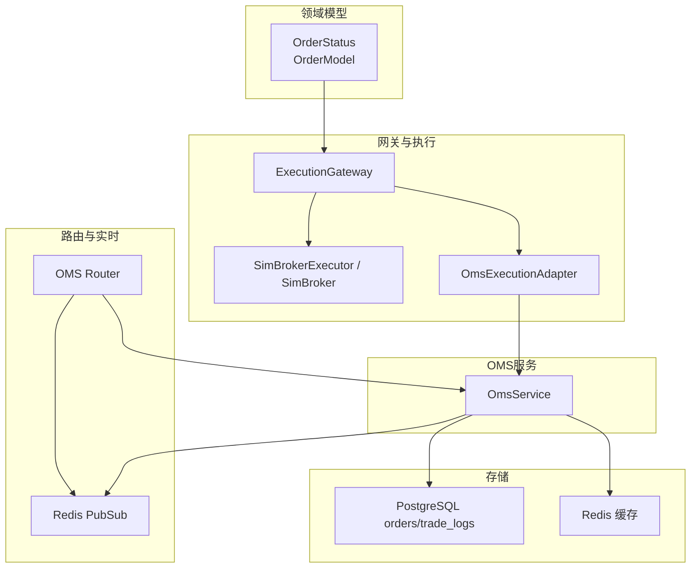
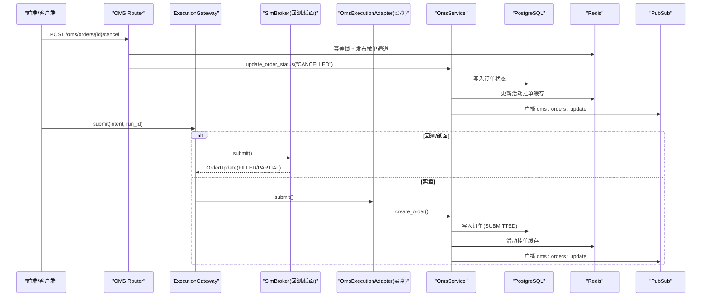
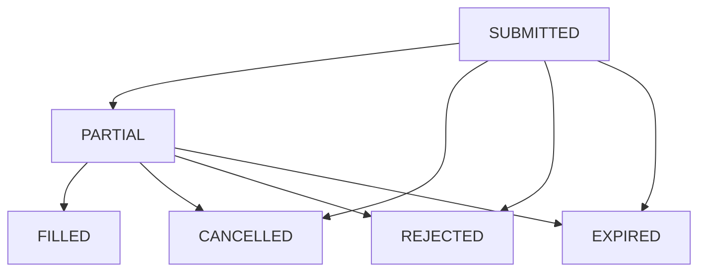
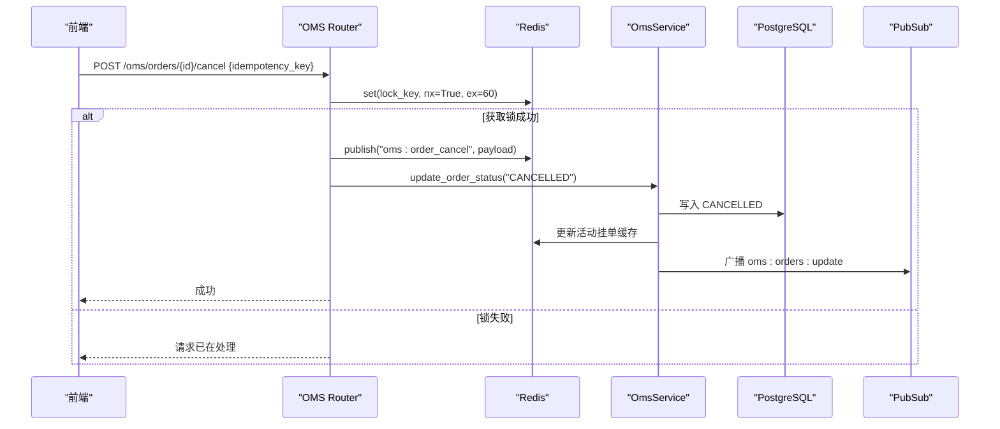
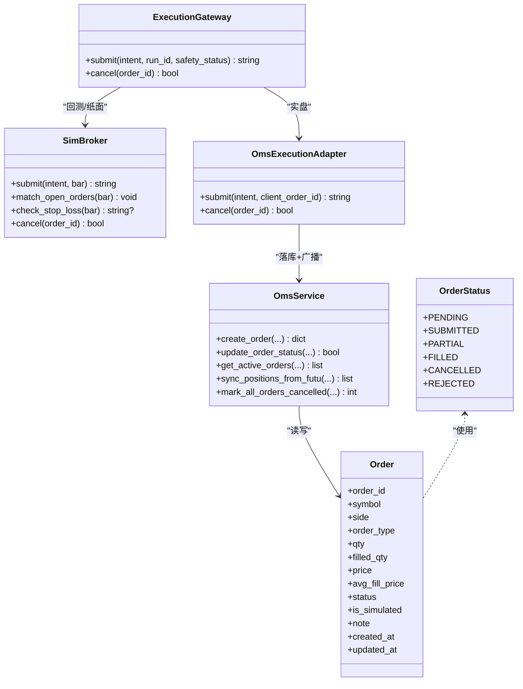
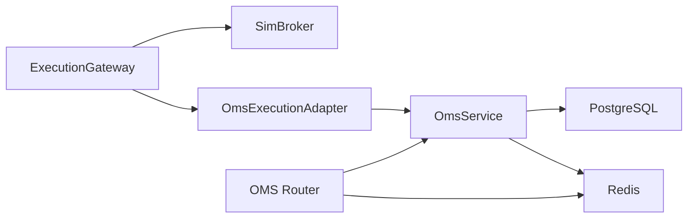

# 订单状态机设计

<cite>
**本文引用的文件**
- [backend/schemas/domain.py](file://backend/schemas/domain.py)
- [backend/core/models.py](file://backend/core/models.py)
- [backend/services/oms_service.py](file://backend/services/oms_service.py)
- [backend/routers/oms.py](file://backend/routers/oms.py)
- [backend/engine/gateway.py](file://backend/engine/gateway.py)
- [backend/engine/drivers/sim_broker.py](file://backend/engine/drivers/sim_broker.py)
</cite>

## 目录
1. [简介](#简介)
2. [项目结构](#项目结构)
3. [核心组件](#核心组件)
4. [架构总览](#架构总览)
5. [详细组件分析](#详细组件分析)
6. [依赖关系分析](#依赖关系分析)
7. [性能考量](#性能考量)
8. [故障排查指南](#故障排查指南)
9. [结论](#结论)
10. [附录：API调用与代码示例路径](#附录api调用与代码示例路径)

## 简介
本文件系统化梳理订单状态机的设计与实现，覆盖状态定义、转换规则、持久化策略（数据库与Redis）、事件广播机制、异常处理与状态验证，并提供关键流程的时序图与流程图。目标读者包括交易/OMS工程师、后端开发者与运维人员。

## 项目结构
围绕订单生命周期，系统由以下层次协作：
- 领域模型层：统一枚举 OrderStatus 与 OrderModel，作为 API 与内部流转的类型契约。
- 网关与执行层：ExecutionGateway 负责路由到 SimBroker（回测/纸面）或 OmsExecutionAdapter（实盘）。
- OMS服务层：OmsService 负责订单持久化、活动挂单缓存、持仓同步与事件广播。
- 路由层：OMS Router 提供撤单、改单、熔断、模式切换等接口，并驱动 Redis PubSub。
- 数据层：PostgreSQL orders/trade_logs 表与 Redis 缓存（活动订单、持仓、模式开关）。

图表来源
- [backend/schemas/domain.py:72-79](file://backend/schemas/domain.py#L72-L79)
- [backend/engine/gateway.py:98-196](file://backend/engine/gateway.py#L98-L196)
- [backend/engine/drivers/sim_broker.py:59-113](file://backend/engine/drivers/sim_broker.py#L59-L113)
- [backend/engine/gateway.py:215-359](file://backend/engine/gateway.py#L215-L359)
- [backend/services/oms_service.py:29-245](file://backend/services/oms_service.py#L29-L245)
- [backend/routers/oms.py:120-177](file://backend/routers/oms.py#L120-L177)

章节来源
- [backend/schemas/domain.py:72-79](file://backend/schemas/domain.py#L72-L79)
- [backend/core/models.py:269-289](file://backend/core/models.py#L269-L289)
- [backend/engine/gateway.py:98-196](file://backend/engine/gateway.py#L98-L196)
- [backend/engine/drivers/sim_broker.py:59-113](file://backend/engine/drivers/sim_broker.py#L59-L113)
- [backend/engine/gateway.py:215-359](file://backend/engine/gateway.py#L215-L359)
- [backend/services/oms_service.py:29-245](file://backend/services/oms_service.py#L29-L245)
- [backend/routers/oms.py:120-177](file://backend/routers/oms.py#L120-L177)

## 核心组件
- 订单状态枚举：PENDING、SUBMITTED、PARTIAL、FILLED、CANCELLED、REJECTED。用于统一表达订单生命周期。
- 订单数据模型：orders 表记录 order_id、symbol、side、order_type、qty、filled_qty、price、avg_fill_price、status、is_simulated、note、时间戳等。
- OMS服务：封装创建订单、更新状态、查询活动挂单、历史成交、持仓同步、熔断标记、Redis 同步与 PubSub 广播。
- 网关：统一入口，按模式路由到模拟撮合或实盘适配器；支持安全锁降级。
- 路由：提供撤单、改单、熔断、模式切换、WebSocket 推送等能力。

章节来源
- [backend/schemas/domain.py:72-79](file://backend/schemas/domain.py#L72-L79)
- [backend/core/models.py:269-289](file://backend/core/models.py#L269-L289)
- [backend/services/oms_service.py:29-245](file://backend/services/oms_service.py#L29-L245)
- [backend/engine/gateway.py:98-196](file://backend/engine/gateway.py#L98-L196)
- [backend/routers/oms.py:120-177](file://backend/routers/oms.py#L120-L177)

## 架构总览
订单从提交到完成/撤销/拒绝/过期的完整链路如下：

图表来源
- [backend/routers/oms.py:120-177](file://backend/routers/oms.py#L120-L177)
- [backend/engine/gateway.py:116-196](file://backend/engine/gateway.py#L116-L196)
- [backend/engine/drivers/sim_broker.py:81-113](file://backend/engine/drivers/sim_broker.py#L81-L113)
- [backend/engine/gateway.py:239-326](file://backend/engine/gateway.py#L239-L326)
- [backend/services/oms_service.py:34-114](file://backend/services/oms_service.py#L34-L114)

## 详细组件分析

### 状态定义与含义
- PENDING：待处理（如风控校验中），尚未进入交易所或撮合引擎。
- SUBMITTED：已提交至执行端（回测/纸面/实盘），等待撮合或券商确认。
- PARTIAL：部分成交，仍有未成交数量。
- FILLED：完全成交，剩余数量为0。
- CANCELLED：已撤销（主动撤单或熔断）。
- REJECTED：被拒绝（风控/市场时段/过期等导致不可接受）。

章节来源
- [backend/schemas/domain.py:72-79](file://backend/schemas/domain.py#L72-L79)
- [backend/core/models.py:269-289](file://backend/core/models.py#L269-L289)

### 状态转换规则
- 提交阶段：
  - 回测/纸面：submit → 立即或后续撮合生成 FILLED 或部分成交（通过 SimBroker 生成 OrderUpdate）。
  - 实盘：submit → 持久化为 SUBMITTED，随后由外部回报推进至 PARTIAL/FILLED/CANCELLED/REJECTED。
- 成交阶段：
  - 部分成交：PARTIAL（可多次触发直至 FILLED）。
  - 完全成交：FILLED（终止态）。
- 撤销阶段：
  - 主动撤单：SUBMITTED/PARTIAL → CANCELLED。
  - 熔断：所有活动订单批量标记为 CANCELLED。
- 拒绝与过期：
  - 拒绝：REJECTED（例如纸面模式下非交易时段或行情陈旧）。
  - 过期：EXPIRED（在部分场景下作为终结态，见活动挂单过滤逻辑）。

图表来源
- [backend/services/oms_service.py:225-239](file://backend/services/oms_service.py#L225-L239)
- [backend/engine/drivers/sim_broker.py:81-113](file://backend/engine/drivers/sim_broker.py#L81-L113)
- [backend/engine/drivers/sim_broker.py:205-313](file://backend/engine/drivers/sim_broker.py#L205-L313)

章节来源
- [backend/engine/drivers/sim_broker.py:81-113](file://backend/engine/drivers/sim_broker.py#L81-L113)
- [backend/engine/drivers/sim_broker.py:205-313](file://backend/engine/drivers/sim_broker.py#L205-L313)
- [backend/services/oms_service.py:225-239](file://backend/services/oms_service.py#L225-L239)

### 撤单流程与异常处理
- 幂等性：通过 Redis NX 键保证同一 idempotency_key 仅处理一次。
- 广播：发布 oms:order_cancel 通道，供下游消费。
- 状态更新：直接更新订单为 CANCELLED，并刷新活动挂单缓存与 PubSub。
- 异常：捕获异常后清理锁并返回错误。

图表来源
- [backend/routers/oms.py:120-147](file://backend/routers/oms.py#L120-L147)
- [backend/services/oms_service.py:79-114](file://backend/services/oms_service.py#L79-L114)

章节来源
- [backend/routers/oms.py:120-147](file://backend/routers/oms.py#L120-L147)
- [backend/services/oms_service.py:79-114](file://backend/services/oms_service.py#L79-L114)

### 持久化策略
- 数据库：
  - 下单：create_order 写入 orders 表，初始状态 SUBMITTED。
  - 状态更新：update_order_status 更新 status/filled_qty/avg_fill_price。
  - 活动挂单查询：优先读 Redis，未命中则查 DB 并回填缓存。
- Redis：
  - 活动挂单列表：quant:oms:active_orders，TTL 5分钟。
  - 持仓快照：quant:oms:positions:{market}，TTL 30秒。
  - 模式开关：quant:oms:trading_mode，热切换。
- 事件广播：
  - oms:orders/update：活动挂单变更。
  - oms:positions/update：持仓变更。
  - oms:mode_change：交易模式变更。
  - oms:order_cancel / oms:order_modify：指令通道。

章节来源
- [backend/services/oms_service.py:34-114](file://backend/services/oms_service.py#L34-L114)
- [backend/services/oms_service.py:118-143](file://backend/services/oms_service.py#L118-L143)
- [backend/services/oms_service.py:155-193](file://backend/services/oms_service.py#L155-L193)
- [backend/services/oms_service.py:218-245](file://backend/services/oms_service.py#L218-L245)
- [backend/routers/oms.py:321-371](file://backend/routers/oms.py#L321-L371)
- [backend/routers/oms.py:379-464](file://backend/routers/oms.py#L379-L464)

### 状态验证与非法转换防护
- 活动挂单过滤：当订单进入终结态（FILLED/CANCELLED/REJECTED/EXPIRED）时，从活动列表中移除，避免重复展示。
- 查询约束：get_active_orders 仅返回 SUBMITTED/PARTIALLY_FILLED/PENDING 等活跃态。
- 熔断保护：mark_all_orders_cancelled 将活动订单批量置为 CANCELLED，并清空活动缓存。
- 安全锁：ExecutionGateway 在 LIVE 模式下检查环境变量、交易模式与熔断标志，任一不满足即降级为纸面语义。

章节来源
- [backend/services/oms_service.py:225-239](file://backend/services/oms_service.py#L225-L239)
- [backend/services/oms_service.py:118-143](file://backend/services/oms_service.py#L118-L143)
- [backend/services/oms_service.py:197-214](file://backend/services/oms_service.py#L197-L214)
- [backend/engine/gateway.py:43-64](file://backend/engine/gateway.py#L43-L64)
- [backend/engine/gateway.py:161-186](file://backend/engine/gateway.py#L161-L186)

### 代码级类关系图

图表来源
- [backend/schemas/domain.py:72-79](file://backend/schemas/domain.py#L72-L79)
- [backend/core/models.py:269-289](file://backend/core/models.py#L269-L289)
- [backend/engine/gateway.py:98-196](file://backend/engine/gateway.py#L98-L196)
- [backend/engine/drivers/sim_broker.py:59-113](file://backend/engine/drivers/sim_broker.py#L59-L113)
- [backend/engine/gateway.py:215-359](file://backend/engine/gateway.py#L215-L359)
- [backend/services/oms_service.py:29-245](file://backend/services/oms_service.py#L29-L245)

## 依赖关系分析
- ExecutionGateway 依赖 OrderIntent/OrderUpdate 协议，解耦不同执行后端。
- OmsExecutionAdapter 依赖 OmsService 与 DataSourceRouter（实盘下单）。
- OmsService 依赖 PostgreSQL（orders/trade_logs）与 Redis（缓存与 PubSub）。
- Router 依赖 OmsService 与 Redis PubSub，提供 REST/WS 能力。
- SimBroker 独立于外部系统，用于回测/纸面一致性撮合。

图表来源
- [backend/engine/gateway.py:98-196](file://backend/engine/gateway.py#L98-L196)
- [backend/engine/gateway.py:215-359](file://backend/engine/gateway.py#L215-L359)
- [backend/services/oms_service.py:29-245](file://backend/services/oms_service.py#L29-L245)
- [backend/routers/oms.py:120-177](file://backend/routers/oms.py#L120-L177)

章节来源
- [backend/engine/gateway.py:98-196](file://backend/engine/gateway.py#L98-L196)
- [backend/engine/gateway.py:215-359](file://backend/engine/gateway.py#L215-L359)
- [backend/services/oms_service.py:29-245](file://backend/services/oms_service.py#L29-L245)
- [backend/routers/oms.py:120-177](file://backend/routers/oms.py#L120-L177)

## 性能考量
- 活动挂单缓存：Redis 5分钟 TTL，降低 DB 压力，提升前端拉取速度。
- 持仓快照：30秒 TTL，确保近实时展示。
- PubSub 广播：减少轮询，提高端到端延迟。
- 幂等锁：防止并发撤单风暴。
- 熔断批量更新：快速止损，避免逐笔更新开销。

[本节为通用指导，无需特定文件引用]

## 故障排查指南
- 订单未出现在活动列表：
  - 检查是否已进入终结态（FILLED/CANCELLED/REJECTED/EXPIRED），会被从活动列表移除。
  - 核对 Redis 缓存是否过期或被清空。
- 撤单无响应：
  - 检查幂等锁是否已被占用（同一 idempotency_key）。
  - 查看 Redis 通道 oms:order_cancel 是否被消费。
- 实盘下单失败：
  - 检查 ExecutionGateway 安全锁（环境变量、交易模式、熔断标志）。
  - 确认 OmsExecutionAdapter 的 _submit_pipeline 是否成功调用 OmsService。
- 状态不一致：
  - 对比 DB orders.status 与 Redis 活动列表，必要时重建缓存。
  - 核查 PubSub 订阅是否正常（OMS WebSocket 通道）。

章节来源
- [backend/services/oms_service.py:225-239](file://backend/services/oms_service.py#L225-L239)
- [backend/routers/oms.py:120-147](file://backend/routers/oms.py#L120-L147)
- [backend/engine/gateway.py:161-186](file://backend/engine/gateway.py#L161-L186)
- [backend/routers/oms.py:379-464](file://backend/routers/oms.py#L379-L464)

## 结论
本状态机以简洁明确的状态集合与严格的转换规则保障订单生命周期的正确性与可观测性。通过“数据库持久化 + Redis 缓存 + PubSub 广播”的三层架构，兼顾一致性与实时性。配合幂等、熔断与安全锁，系统在异常情况下具备强韧性与可控性。建议在生产环境持续监控活动挂单、成交回报与模式切换事件，确保状态机稳定运行。

[本节为总结，无需特定文件引用]

## 附录：API调用与代码示例路径
- 获取OMS初始状态（含活动挂单与历史成交）
  - 路径：[backend/routers/oms.py:56-84](file://backend/routers/oms.py#L56-L84)
- 撤单接口（带幂等锁）
  - 路径：[backend/routers/oms.py:120-147](file://backend/routers/oms.py#L120-L147)
- 改单接口
  - 路径：[backend/routers/oms.py:149-177](file://backend/routers/oms.py#L149-L177)
- 交易模式切换（热切换）
  - 路径：[backend/routers/oms.py:347-371](file://backend/routers/oms.py#L347-L371)
- WebSocket 实时推送（OMS）
  - 路径：[backend/routers/oms.py:379-464](file://backend/routers/oms.py#L379-L464)
- 下单主流程（网关路由）
  - 路径：[backend/engine/gateway.py:116-196](file://backend/engine/gateway.py#L116-L196)
- 实盘下单适配（落库+实盘下单）
  - 路径：[backend/engine/gateway.py:239-326](file://backend/engine/gateway.py#L239-L326)
- 模拟撮合（市价/限价/止损）
  - 路径：[backend/engine/drivers/sim_broker.py:81-113](file://backend/engine/drivers/sim_broker.py#L81-L113)
  - 路径：[backend/engine/drivers/sim_broker.py:205-313](file://backend/engine/drivers/sim_broker.py#L205-L313)
- 订单持久化与状态更新
  - 路径：[backend/services/oms_service.py:34-114](file://backend/services/oms_service.py#L34-L114)
- 活动挂单查询与缓存
  - 路径：[backend/services/oms_service.py:118-143](file://backend/services/oms_service.py#L118-L143)
- 持仓同步与缓存
  - 路径：[backend/services/oms_service.py:155-193](file://backend/services/oms_service.py#L155-L193)
- 熔断批量撤单
  - 路径：[backend/services/oms_service.py:197-214](file://backend/services/oms_service.py#L197-L214)
- 订单数据模型
  - 路径：[backend/core/models.py:269-289](file://backend/core/models.py#L269-L289)
- 订单状态枚举
  - 路径：[backend/schemas/domain.py:72-79](file://backend/schemas/domain.py#L72-L79)