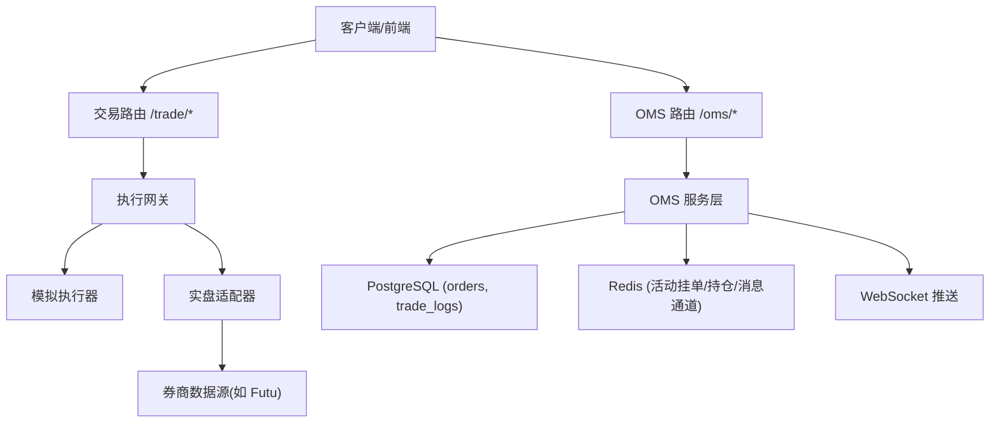
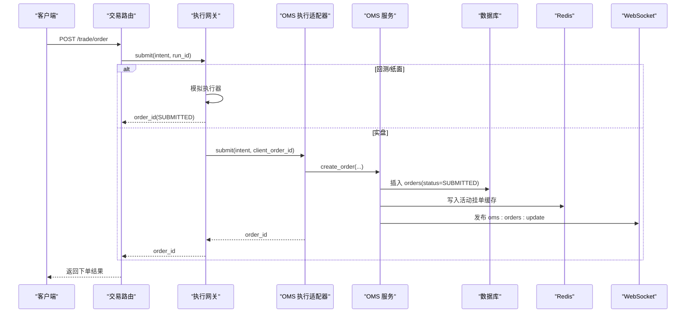
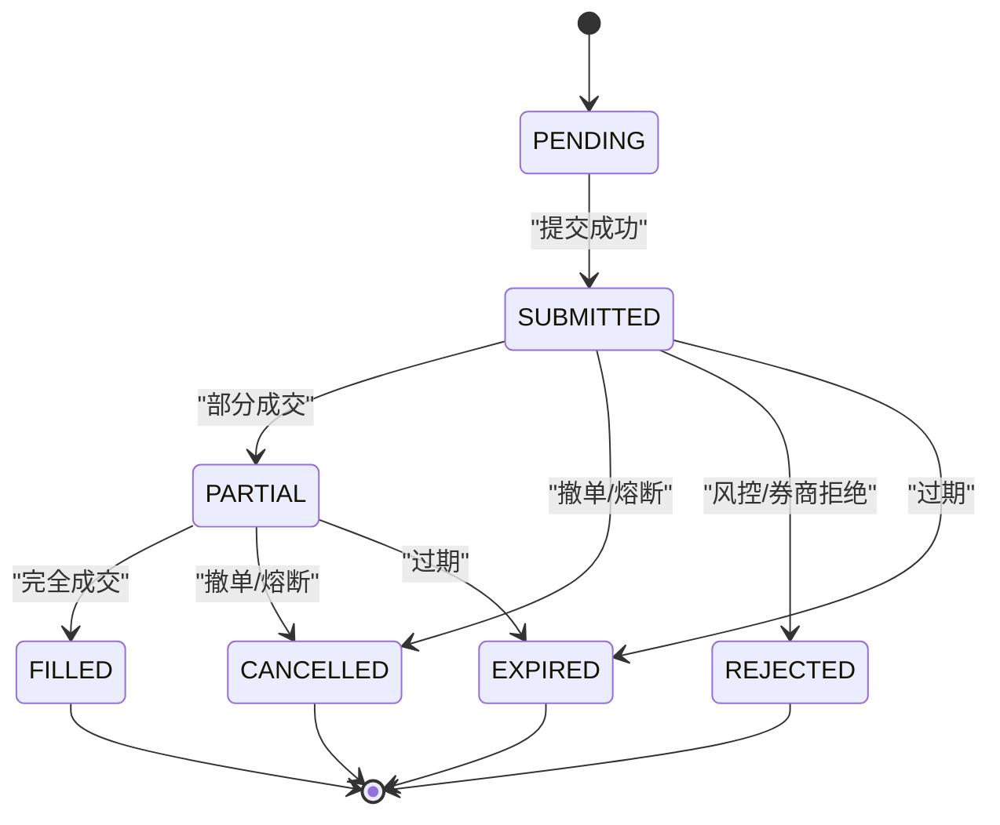
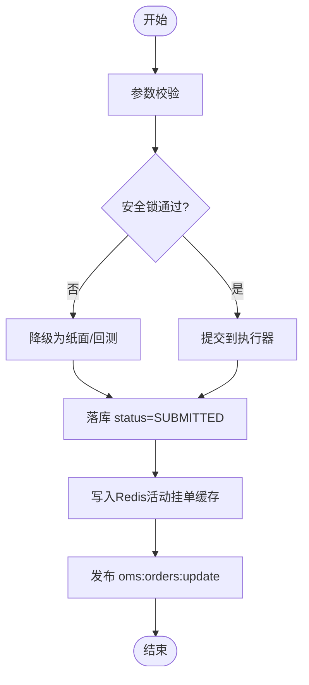
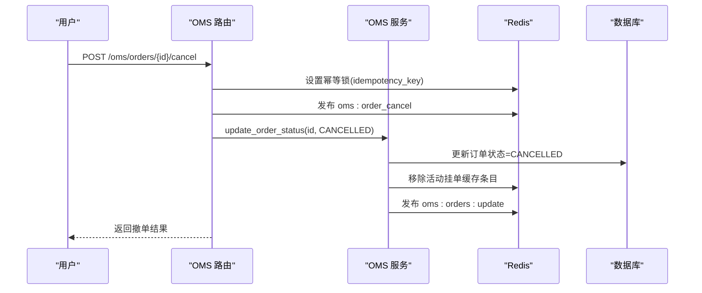
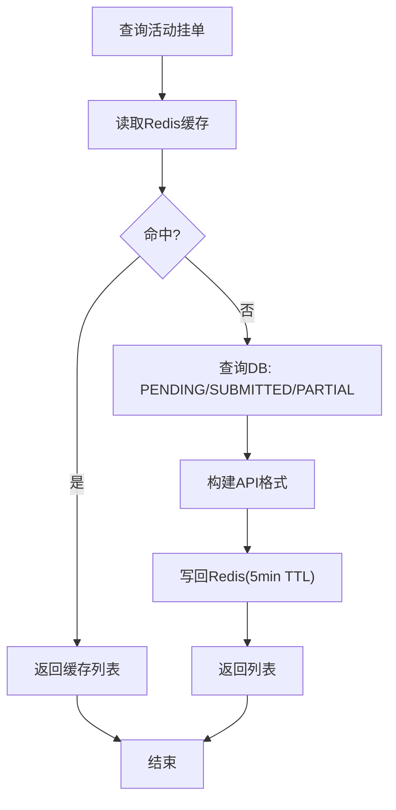
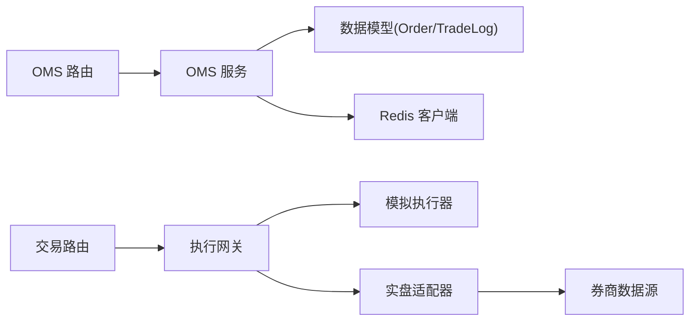

# 订单生命周期管理

<cite>
**本文引用的文件**
- [backend/services/oms_service.py](file://backend/services/oms_service.py)
- [backend/routers/oms.py](file://backend/routers/oms.py)
- [backend/schemas/domain.py](file://backend/schemas/domain.py)
- [backend/app/oms_app.py](file://backend/app/oms_app.py)
- [backend/routers/trade.py](file://backend/routers/trade.py)
- [backend/core/models.py](file://backend/core/models.py)
- [backend/engine/gateway.py](file://backend/engine/gateway.py)
</cite>

## 目录
1. [简介](#简介)
2. [项目结构](#项目结构)
3. [核心组件](#核心组件)
4. [架构总览](#架构总览)
5. [详细组件分析](#详细组件分析)
6. [依赖关系分析](#依赖关系分析)
7. [性能考量](#性能考量)
8. [故障排查指南](#故障排查指南)
9. [结论](#结论)
10. [附录：API调用示例](#附录api调用示例)

## 简介
本文件围绕订单全生命周期管理，系统化梳理状态机设计、创建流程、更新机制、查询能力与异常处理策略，并结合代码级实现给出可视化图示与可操作建议。重点覆盖以下状态与流转：SUBMITTED、PARTIALLY_FILLED（代码中对应 PARTIAL）、FILLED、CANCELLED、REJECTED、EXPIRED（部分场景由业务或网关语义触发）。

## 项目结构
订单相关的关键路径包括：
- 路由层：OMS 与交易路由负责鉴权、参数校验与编排
- 服务层：OMS 服务负责订单持久化、缓存同步与事件广播
- 引擎层：执行网关统一路由到模拟/实盘执行器，并实施安全锁与幂等控制
- 数据模型：订单与成交记录落库，Redis 提供活动挂单与持仓缓存
- WebSocket：实时推送订单、成交、持仓与模式变更

图表来源
- [backend/routers/oms.py:56-84](file://backend/routers/oms.py#L56-L84)
- [backend/routers/trade.py:30-56](file://backend/routers/trade.py#L30-L56)
- [backend/services/oms_service.py:34-151](file://backend/services/oms_service.py#L34-L151)
- [backend/engine/gateway.py:98-196](file://backend/engine/gateway.py#L98-L196)

章节来源
- [backend/routers/oms.py:56-84](file://backend/routers/oms.py#L56-L84)
- [backend/routers/trade.py:30-56](file://backend/routers/trade.py#L30-L56)
- [backend/services/oms_service.py:34-151](file://backend/services/oms_service.py#L34-L151)
- [backend/engine/gateway.py:98-196](file://backend/engine/gateway.py#L98-L196)

## 核心组件
- OMS 服务层：订单创建、状态更新、活动挂单查询、历史成交获取、持仓同步、熔断标记
- 执行网关：统一入口，安全锁检查、幂等去重、回测/纸面/实盘路由
- 路由层：OMS 与交易 API，包含撤单、改单、模式切换、WebSocket 推送
- 数据模型：Order、TradeLog 等持久化实体；领域枚举定义 OrderStatus
- 缓存与消息：Redis 活动挂单缓存、PubSub 实时广播

章节来源
- [backend/services/oms_service.py:34-214](file://backend/services/oms_service.py#L34-L214)
- [backend/engine/gateway.py:98-196](file://backend/engine/gateway.py#L98-L196)
- [backend/routers/oms.py:120-177](file://backend/routers/oms.py#L120-L177)
- [backend/schemas/domain.py:72-79](file://backend/schemas/domain.py#L72-L79)
- [backend/core/models.py:53-64](file://backend/core/models.py#L53-L64)

## 架构总览
订单从请求到落库再到状态更新的端到端流程如下：

图表来源
- [backend/routers/trade.py:30-39](file://backend/routers/trade.py#L30-L39)
- [backend/engine/gateway.py:116-186](file://backend/engine/gateway.py#L116-L186)
- [backend/engine/gateway.py:239-326](file://backend/engine/gateway.py#L239-L326)
- [backend/services/oms_service.py:34-77](file://backend/services/oms_service.py#L34-L77)

## 详细组件分析

### 订单状态机设计
- 状态集合：PENDING、SUBMITTED、PARTIAL（对应 PARTIALLY_FILLED）、FILLED、CANCELLED、REJECTED、EXPIRED（部分场景由外部系统或业务规则触发）
- 典型转换：
  - SUBMITTED → PARTIAL：部分成交
  - PARTIAL → FILLED：完全成交
  - SUBMITTED → CANCELLED：用户撤单或熔断
  - SUBMITTED → REJECTED：风控拒绝或券商拒绝
  - SUBMITTED/PARTIAL → EXPIRED：过期失效（由外部系统或业务规则触发）
- 注意：代码中活动挂单查询过滤包含 PENDING/SUBMITTED/PARTIAL，用于展示“活动”订单

图表来源
- [backend/schemas/domain.py:72-79](file://backend/schemas/domain.py#L72-L79)
- [backend/services/oms_service.py:118-143](file://backend/services/oms_service.py#L118-L143)
- [backend/services/oms_service.py:197-214](file://backend/services/oms_service.py#L197-L214)

章节来源
- [backend/schemas/domain.py:72-79](file://backend/schemas/domain.py#L72-L79)
- [backend/services/oms_service.py:118-143](file://backend/services/oms_service.py#L118-L143)
- [backend/services/oms_service.py:197-214](file://backend/services/oms_service.py#L197-L214)

### 订单创建流程：参数验证→风险检查→订单提交→状态持久化
- 参数验证：路由层接收 ticker、action、qty、price、order_id，交由应用层处理
- 风险检查：通过执行网关的安全锁（环境变量、交易模式、熔断标志）进行三重保护；未通过则降级为纸面语义
- 订单提交：网关根据模式路由至模拟或实盘执行器；实盘适配器调用 OMS 服务落库
- 状态持久化：OMS 服务写入 orders 表，初始状态为 SUBMITTED，并同步到 Redis 活动挂单缓存，同时广播 oms:orders:update

图表来源
- [backend/routers/trade.py:30-39](file://backend/routers/trade.py#L30-L39)
- [backend/engine/gateway.py:116-186](file://backend/engine/gateway.py#L116-L186)
- [backend/engine/gateway.py:239-326](file://backend/engine/gateway.py#L239-L326)
- [backend/services/oms_service.py:34-77](file://backend/services/oms_service.py#L34-L77)

章节来源
- [backend/routers/trade.py:30-39](file://backend/routers/trade.py#L30-L39)
- [backend/engine/gateway.py:116-186](file://backend/engine/gateway.py#L116-L186)
- [backend/engine/gateway.py:239-326](file://backend/engine/gateway.py#L239-L326)
- [backend/services/oms_service.py:34-77](file://backend/services/oms_service.py#L34-L77)

### 订单更新机制：部分成交、完全成交、撤单
- 部分成交与完全成交：通过 OMS 服务 update_order_status 将状态从 SUBMITTED 更新为 PARTIAL 或 FILLED，并更新已成交量与均价；随后同步 Redis 并广播
- 撤单处理：
  - 接口层使用幂等键防止重复撤单
  - 通过 Redis PubSub 下发撤单指令
  - 直接更新订单状态为 CANCELLED，并广播
- 熔断 Kill Switch：全局熔断时，停止 Bot/算法，尝试物理清仓，并将所有活动订单标记为 CANCELLED

图表来源
- [backend/routers/oms.py:120-147](file://backend/routers/oms.py#L120-L147)
- [backend/services/oms_service.py:79-114](file://backend/services/oms_service.py#L79-L114)
- [backend/services/oms_service.py:218-244](file://backend/services/oms_service.py#L218-L244)

章节来源
- [backend/routers/oms.py:120-147](file://backend/routers/oms.py#L120-L147)
- [backend/services/oms_service.py:79-114](file://backend/services/oms_service.py#L79-L114)
- [backend/services/oms_service.py:218-244](file://backend/services/oms_service.py#L218-L244)

### 订单查询功能：活动挂单、历史订单、成交记录
- 活动挂单：优先从 Redis 缓存读取，未命中则从数据库查询 PENDING/SUBMITTED/PARTIAL 的订单，并写回缓存（TTL 5分钟）
- 历史成交：从 trade_logs 表按时间倒序取最近 N 条
- 持仓信息：从 Redis 缓存读取最新持仓（定时任务从券商拉取并缓存）

图表来源
- [backend/services/oms_service.py:118-143](file://backend/services/oms_service.py#L118-L143)
- [backend/services/oms_service.py:145-151](file://backend/services/oms_service.py#L145-L151)
- [backend/services/oms_service.py:155-193](file://backend/services/oms_service.py#L155-L193)

章节来源
- [backend/services/oms_service.py:118-151](file://backend/services/oms_service.py#L118-L151)
- [backend/services/oms_service.py:155-193](file://backend/services/oms_service.py#L155-L193)

### 异常处理策略：网络超时、券商拒绝、数据不一致
- 网络超时/外部依赖失败：
  - OMS 服务在持久化与状态更新时捕获异常并回滚事务，记录错误日志
  - 网关对安全锁不通过的情况进行降级（回测/纸面），避免误发真实资金
- 券商拒绝：
  - 可通过状态机进入 REJECTED；若由外部回调驱动，需确保回调能正确映射到 REJECTED 并广播
- 数据不一致：
  - 活动挂单缓存与数据库不一致时，查询会回退到 DB 并重建缓存
  - 熔断时批量标记活动订单为 CANCELLED，并清空活动挂单缓存，保证一致性

章节来源
- [backend/services/oms_service.py:74-77](file://backend/services/oms_service.py#L74-L77)
- [backend/services/oms_service.py:111-114](file://backend/services/oms_service.py#L111-L114)
- [backend/engine/gateway.py:161-186](file://backend/engine/gateway.py#L161-L186)
- [backend/services/oms_service.py:197-214](file://backend/services/oms_service.py#L197-L214)

## 依赖关系分析
- 路由层依赖服务层与数据库会话
- 服务层依赖数据库模型与 Redis 客户端
- 网关依赖执行器协议与外部数据源（模拟/实盘）
- 模块间通过 Redis PubSub 解耦实时通知

图表来源
- [backend/routers/trade.py:30-56](file://backend/routers/trade.py#L30-L56)
- [backend/routers/oms.py:56-84](file://backend/routers/oms.py#L56-L84)
- [backend/engine/gateway.py:98-196](file://backend/engine/gateway.py#L98-L196)
- [backend/services/oms_service.py:34-77](file://backend/services/oms_service.py#L34-L77)

章节来源
- [backend/routers/trade.py:30-56](file://backend/routers/trade.py#L30-L56)
- [backend/routers/oms.py:56-84](file://backend/routers/oms.py#L56-L84)
- [backend/engine/gateway.py:98-196](file://backend/engine/gateway.py#L98-L196)
- [backend/services/oms_service.py:34-77](file://backend/services/oms_service.py#L34-L77)

## 性能考量
- 活动挂单查询采用 Redis 缓存 + DB 回退，降低数据库压力
- 状态更新后即时广播，减少前端轮询开销
- 撤单使用幂等锁避免重复处理
- 熔断批量标记与缓存清理保障一致性

[本节为通用指导，无需特定文件引用]

## 故障排查指南
- 下单失败：
  - 检查路由参数与鉴权
  - 查看网关安全锁状态（环境变量、交易模式、熔断标志）
  - 确认 OMS 服务落库是否成功（日志与数据库）
- 撤单无效：
  - 确认幂等键是否正确且未过期
  - 检查 Redis 是否收到 oms:order_cancel 消息
  - 核对订单状态是否已被其他流程修改
- 数据不一致：
  - 对比 Redis 活动挂单与数据库订单状态
  - 使用熔断接口重新标记活动订单为 CANCELLED 并清理缓存

章节来源
- [backend/routers/oms.py:120-147](file://backend/routers/oms.py#L120-L147)
- [backend/services/oms_service.py:197-214](file://backend/services/oms_service.py#L197-L214)
- [backend/engine/gateway.py:161-186](file://backend/engine/gateway.py#L161-L186)

## 结论
该订单生命周期管理以“网关安全锁 + OMS 服务 + Redis 缓存 + 实时广播”为核心，实现了稳健的下单、更新、查询与熔断能力。状态机清晰、扩展性强，适合在回测、纸面与实盘多模式下复用。建议在外部回调中完善 REJECTED/EXPIRED 的状态映射，以增强闭环能力。

[本节为总结性内容，无需特定文件引用]

## 附录：API调用示例
以下为基于仓库实现的 API 调用要点（不含具体代码片段）：
- 下单
  - 方法：POST /trade/order
  - 参数：ticker、action、qty、price、order_id
  - 行为：路由到执行网关，安全锁通过后落库并返回 order_id
  - 参考路径：[backend/routers/trade.py:30-39](file://backend/routers/trade.py#L30-L39)
- 查询初始状态（活动挂单、历史成交、Bot 状态、算法执行、交易模式）
  - 方法：GET /oms/state
  - 行为：聚合 OMS 服务与运行时数据
  - 参考路径：[backend/routers/oms.py:56-84](file://backend/routers/oms.py#L56-L84)
- 撤单
  - 方法：POST /oms/orders/{order_id}/cancel
  - 参数：idempotency_key
  - 行为：幂等锁 + 发布撤单指令 + 更新状态为 CANCELLED
  - 参考路径：[backend/routers/oms.py:120-147](file://backend/routers/oms.py#L120-L147)
- 改单
  - 方法：POST /oms/orders/{order_id}/modify
  - 参数：price
  - 行为：发布改单指令 + 更新价格 + 广播
  - 参考路径：[backend/routers/oms.py:149-177](file://backend/routers/oms.py#L149-L177)
- 查询持仓
  - 方法：GET /oms/positions?market=HK
  - 行为：从 Redis 缓存读取最新持仓
  - 参考路径：[backend/routers/oms.py:180-184](file://backend/routers/oms.py#L180-L184)
- 交易模式切换
  - 方法：POST /oms/mode/switch
  - 参数：mode（SANDBOX/PAPER/LIVE）
  - 行为：写入 Redis 并广播模式变更
  - 参考路径：[backend/routers/oms.py:347-371](file://backend/routers/oms.py#L347-L371)
- 熔断
  - 方法：POST /oms/kill_switch
  - 行为：广播熔断信号，尝试物理清仓，停止 Bot/算法，标记活动订单为 CANCELLED
  - 参考路径：[backend/routers/oms.py:94-117](file://backend/routers/oms.py#L94-L117)、[backend/app/oms_app.py:24-53](file://backend/app/oms_app.py#L24-L53)

章节来源
- [backend/routers/trade.py:30-39](file://backend/routers/trade.py#L30-L39)
- [backend/routers/oms.py:56-84](file://backend/routers/oms.py#L56-L84)
- [backend/routers/oms.py:94-117](file://backend/routers/oms.py#L94-L117)
- [backend/routers/oms.py:120-177](file://backend/routers/oms.py#L120-L177)
- [backend/routers/oms.py:180-184](file://backend/routers/oms.py#L180-L184)
- [backend/routers/oms.py:347-371](file://backend/routers/oms.py#L347-L371)
- [backend/app/oms_app.py:24-53](file://backend/app/oms_app.py#L24-L53)