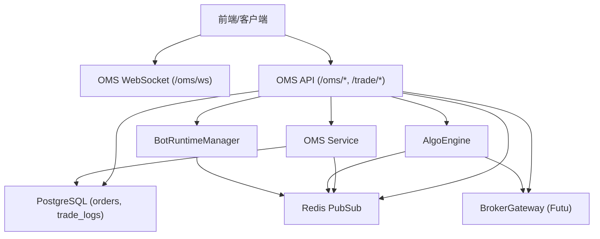
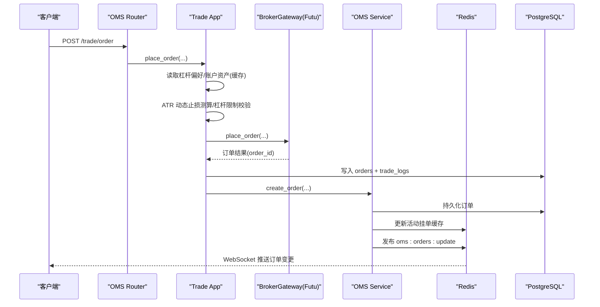
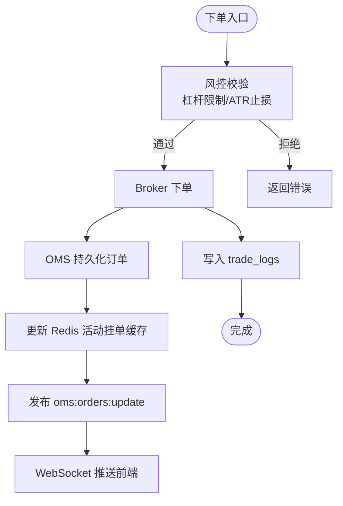
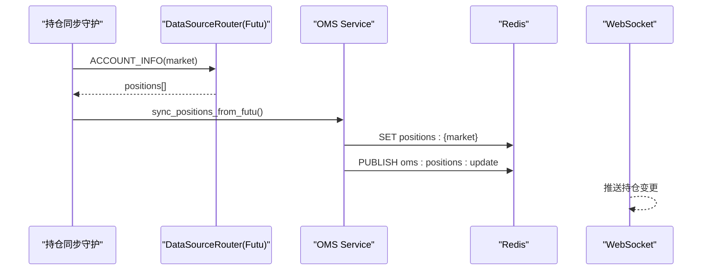
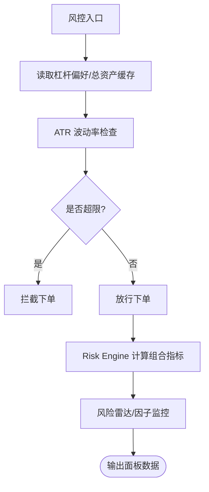
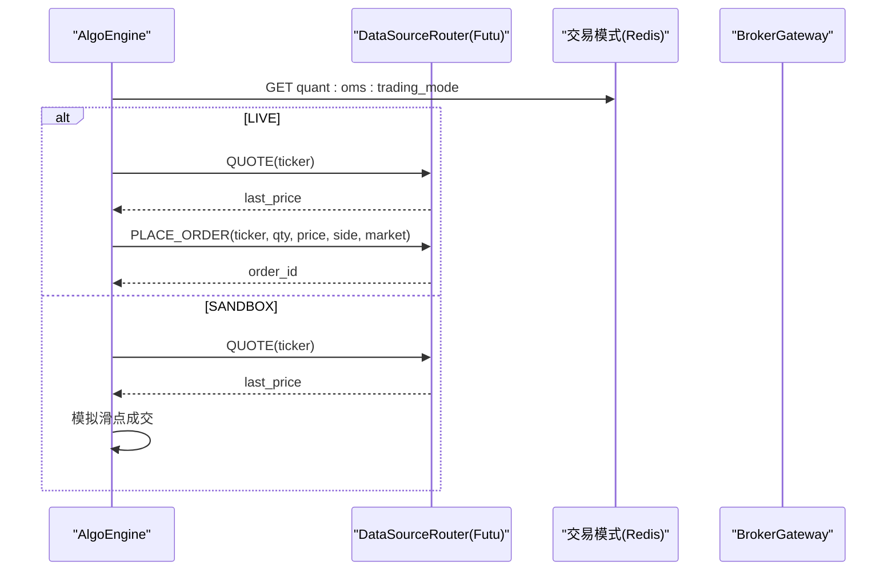
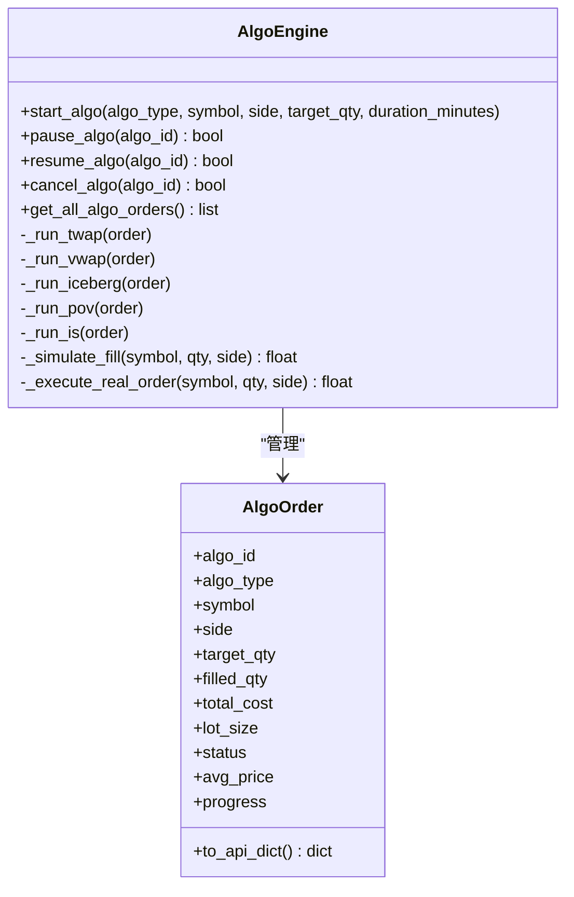
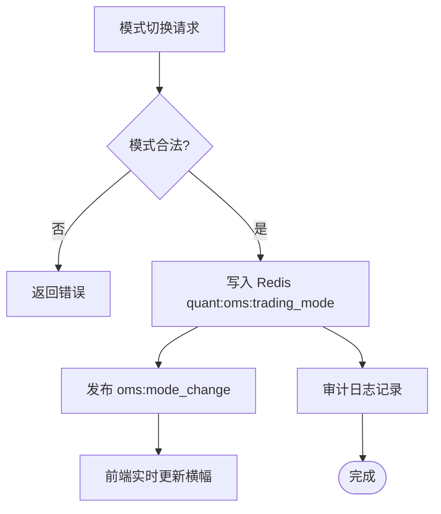
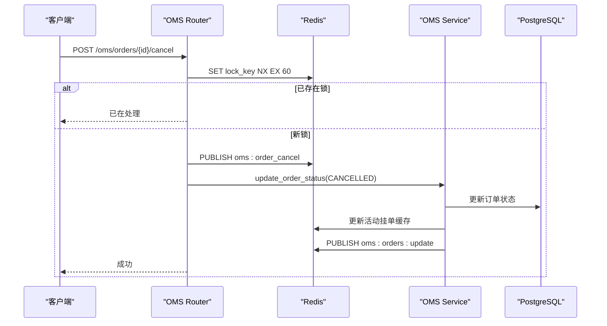
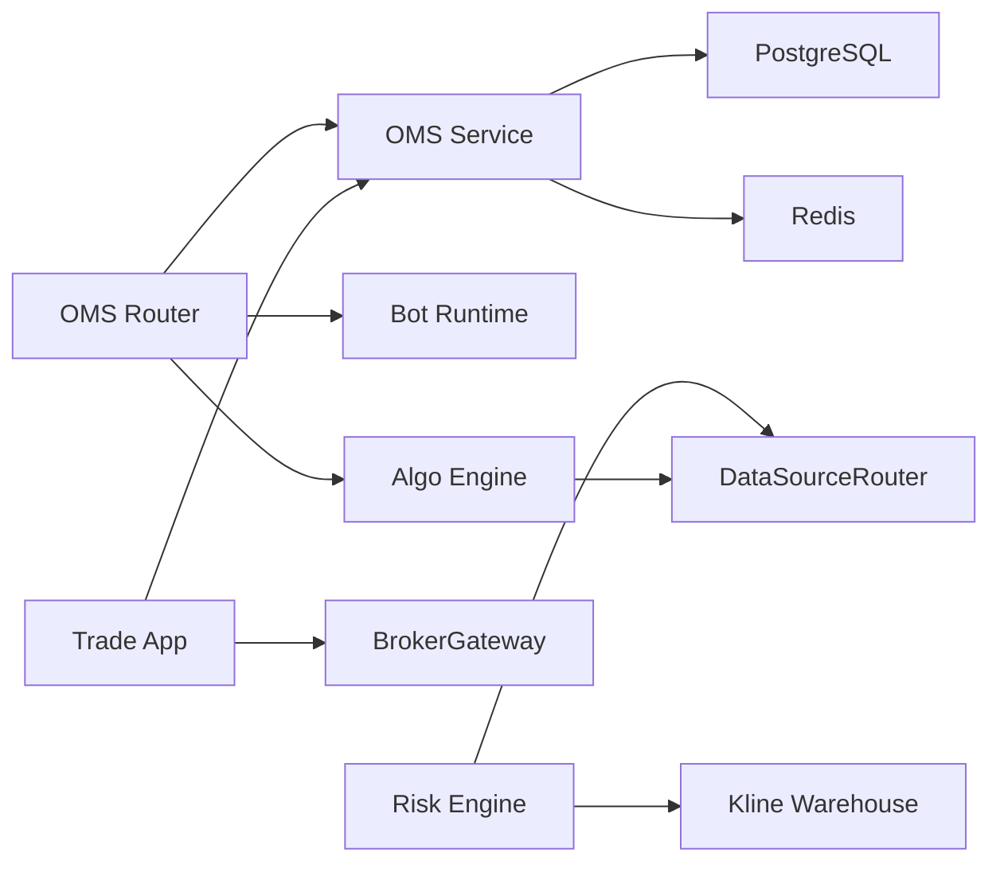

# 订单管理系统

<cite>
**本文引用的文件**
- [backend/routers/oms.py](file://backend/routers/oms.py)
- [backend/app/oms_app.py](file://backend/app/oms_app.py)
- [backend/services/oms_service.py](file://backend/services/oms_service.py)
- [backend/workers/oms/algo_engine.py](file://backend/workers/oms/algo_engine.py)
- [backend/workers/oms/bot_runtime.py](file://backend/workers/oms/bot_runtime.py)
- [backend/routers/trade.py](file://backend/routers/trade.py)
- [backend/app/trade_app.py](file://backend/app/trade_app.py)
- [backend/services/risk/risk_engine.py](file://backend/services/risk/risk_engine.py)
- [docs/subsystems/oms-module.md](file://docs/subsystems/oms-module.md)
- [docs/subsystems/risk-module.md](file://docs/subsystems/risk-module.md)
- [backend/core/models.py](file://backend/core/models.py)
</cite>

## 目录
1. [简介](#简介)
2. [项目结构](#项目结构)
3. [核心组件](#核心组件)
4. [架构总览](#架构总览)
5. [详细组件分析](#详细组件分析)
6. [依赖关系分析](#依赖关系分析)
7. [性能考量](#性能考量)
8. [故障排查指南](#故障排查指南)
9. [结论](#结论)
10. [附录](#附录)

## 简介
本文件为 Quant Agent 订单管理系统（OMS）的全面技术文档，覆盖订单生命周期管理、仓位管理、风险控制机制；说明与券商接口的集成方式（下单、成交回报、持仓查询）；详述风险管理模块（指标计算、限额控制、压力测试规划）；提供业务流程示例（下单、撤单、成交确认、结算对账）；解释算法交易支持（智能路由、执行算法）、纸面/实盘切换机制与数据一致性保障；并为交易员与开发者提供使用指南。

## 项目结构
OMS 采用分层架构：展示层通过 WebSocket 实时推送；逻辑层由 OMS Service、Bot Runtime、Algo Engine 组成；数据接口层对接券商（Futu）与行情系统；持久化层使用 PostgreSQL 与 Redis。

图表来源
- [backend/routers/oms.py:56-84](file://backend/routers/oms.py#L56-L84)
- [backend/routers/oms.py:379-464](file://backend/routers/oms.py#L379-L464)
- [backend/services/oms_service.py:34-143](file://backend/services/oms_service.py#L34-L143)
- [backend/workers/oms/algo_engine.py:251-399](file://backend/workers/oms/algo_engine.py#L251-L399)
- [backend/workers/oms/bot_runtime.py:81-195](file://backend/workers/oms/bot_runtime.py#L81-L195)

章节来源
- [docs/subsystems/oms-module.md:1-179](file://docs/subsystems/oms-module.md#L1-L179)
- [backend/routers/oms.py:1-464](file://backend/routers/oms.py#L1-L464)

## 核心组件
- OMS Service：订单持久化、状态同步、持仓缓存与广播、熔断标记。
- Bot Runtime：策略运行时引擎，管理 Bot 生命周期、资源监控与日志。
- Algo Engine：算法拆单引擎（TWAP/VWAP/ICEBERG/POV/IS），进度持久化与广播。
- Trade App：下单编排（风控校验、ATR 动态止损、杠杆限制、下单分发、OMS 落库）。
- Risk Engine：组合风控计算（波动率、VaR、Beta、Sharpe、最大回撤、相关性矩阵、雷达评分）。
- OMS Router：API 路由与 WebSocket 推送，模式切换、Kill Switch、订单/算法控制。

章节来源
- [backend/services/oms_service.py:1-276](file://backend/services/oms_service.py#L1-L276)
- [backend/workers/oms/bot_runtime.py:1-446](file://backend/workers/oms/bot_runtime.py#L1-L446)
- [backend/workers/oms/algo_engine.py:1-785](file://backend/workers/oms/algo_engine.py#L1-L785)
- [backend/app/trade_app.py:1-232](file://backend/app/trade_app.py#L1-L232)
- [backend/services/risk/risk_engine.py:1-515](file://backend/services/risk/risk_engine.py#L1-L515)
- [backend/routers/oms.py:1-464](file://backend/routers/oms.py#L1-L464)

## 架构总览
OMS 以“请求-编排-执行-持久化-广播”为主线，结合 Redis 作为高速缓存与消息总线，PostgreSQL 作为权威持久化存储。

图表来源
- [backend/routers/trade.py:30-39](file://backend/routers/trade.py#L30-L39)
- [backend/app/trade_app.py:35-187](file://backend/app/trade_app.py#L35-L187)
- [backend/services/oms_service.py:34-77](file://backend/services/oms_service.py#L34-L77)
- [backend/routers/oms.py:379-464](file://backend/routers/oms.py#L379-L464)

## 详细组件分析

### 订单生命周期管理
- 创建订单：Trade App 完成风控校验后调用 Broker 下单，随后 OMS Service 持久化到 PostgreSQL，并同步至 Redis 活动挂单缓存，通过 PubSub 广播。
- 状态同步：订单状态在 DB 与 Redis 保持一致，WebSocket 实时推送前端。
- 历史成交：从 trade_logs 表读取真实成交记录。
- 持仓同步：定时从 Futu 拉取持仓写入 Redis，供前端展示。

图表来源
- [backend/app/trade_app.py:35-187](file://backend/app/trade_app.py#L35-L187)
- [backend/services/oms_service.py:34-143](file://backend/services/oms_service.py#L34-L143)
- [backend/routers/oms.py:379-464](file://backend/routers/oms.py#L379-L464)

章节来源
- [backend/services/oms_service.py:1-276](file://backend/services/oms_service.py#L1-L276)
- [backend/app/trade_app.py:1-232](file://backend/app/trade_app.py#L1-L232)
- [backend/routers/oms.py:1-464](file://backend/routers/oms.py#L1-L464)

### 仓位管理
- 持仓缓存：按市场维度维护 Redis 键 quant:oms:positions:{market}，TTL 30s。
- 同步流程：后台守护进程定时调用 DataSourceRouter 获取 Futu 账户信息，写入 Redis 并广播 oms:positions:update。
- 查询接口：/oms/positions 返回最新缓存持仓。

图表来源
- [backend/services/oms_service.py:155-193](file://backend/services/oms_service.py#L155-L193)
- [backend/routers/oms.py:180-184](file://backend/routers/oms.py#L180-L184)

章节来源
- [backend/services/oms_service.py:155-193](file://backend/services/oms_service.py#L155-L193)
- [backend/routers/oms.py:180-184](file://backend/routers/oms.py#L180-L184)

### 风险控制机制
- 下单前风控：杠杆上限、ATR 动态止损建议、高波动资产强制降杠杆。
- 组合风控：Risk Engine 计算波动率、VaR、Beta、Sharpe、最大回撤、相关性矩阵与风险雷达评分。
- 限额控制：基于 NAV 的 VaR 百分比与金额双口径阈值；杠杆利用率阈值；最大回撤阈值。
- 压力测试：规划中（历史情景回放、假设情景冲击、NAV 变化可视化）。

图表来源
- [backend/app/trade_app.py:44-116](file://backend/app/trade_app.py#L44-L116)
- [backend/services/risk/risk_engine.py:32-135](file://backend/services/risk/risk_engine.py#L32-L135)
- [docs/subsystems/risk-module.md:1-101](file://docs/subsystems/risk-module.md#L1-L101)

章节来源
- [backend/app/trade_app.py:44-116](file://backend/app/trade_app.py#L44-L116)
- [backend/services/risk/risk_engine.py:1-515](file://backend/services/risk/risk_engine.py#L1-L515)
- [docs/subsystems/risk-module.md:1-101](file://docs/subsystems/risk-module.md#L1-L101)

### 与券商接口集成（Futu）
- 下单：Trade App 调用 BrokerGateway.place_order，经 DataSourceRouter 转发至 Futu OpenD。
- 成交回报：Broker 回调或轮询触发 OMS Service 更新订单状态与 trade_logs。
- 持仓查询：DataSourceRouter.fetch_futu("ACCOUNT_INFO") 获取账户与持仓，写入 Redis 并广播。
- 算法执行：Algo Engine 在 LIVE 模式下通过 DataSourceRouter 提交限价单；SANDBOX 模式模拟成交。

图表来源
- [backend/workers/oms/algo_engine.py:617-702](file://backend/workers/oms/algo_engine.py#L617-L702)
- [backend/app/trade_app.py:120-127](file://backend/app/trade_app.py#L120-L127)

章节来源
- [backend/workers/oms/algo_engine.py:617-702](file://backend/workers/oms/algo_engine.py#L617-L702)
- [backend/app/trade_app.py:120-127](file://backend/app/trade_app.py#L120-L127)

### 算法交易支持与智能订单路由
- 算法类型：TWAP、VWAP、ICEBERG、POV、IS。
- 智能路由：根据 lot_size（港股整手）与 ADV 曲线优化执行计划；LIVE/SANDBOX 模式自动选择真实下单或模拟成交。
- 进度持久化：Redis Hash 保存活动算法，List 归档已完成任务（7天 TTL）。
- 执行报告：TRADE-02 提供滑点、VWAP 偏离、参与率、Implementation Shortfall 等指标。

图表来源
- [backend/workers/oms/algo_engine.py:194-399](file://backend/workers/oms/algo_engine.py#L194-L399)
- [backend/workers/oms/algo_engine.py:704-785](file://backend/workers/oms/algo_engine.py#L704-L785)

章节来源
- [backend/workers/oms/algo_engine.py:1-785](file://backend/workers/oms/algo_engine.py#L1-L785)

### 纸面交易与实盘交易切换机制
- 模式键：quant:oms:trading_mode，值 SANDBOX/PAPER/LIVE。
- 热切换：/oms/mode/switch 写入 Redis 后立即生效，并通过 PubSub 广播模式变更。
- 降级策略：若 Redis 不可用，回退环境变量 FUTU_TRD_ENV 判断。
- 行为差异：LIVE 走真实下单；SANDBOX/PAPER 走模拟成交或纸面账本语义。

图表来源
- [backend/routers/oms.py:329-371](file://backend/routers/oms.py#L329-L371)

章节来源
- [backend/routers/oms.py:329-371](file://backend/routers/oms.py#L329-L371)

### 数据一致性保证
- 幂等性锁：撤单使用 Redis NX 锁（idempotency_key），防止重复处理。
- 双重持久化：订单状态同时写入 PostgreSQL 与 Redis 缓存，确保一致性与高性能。
- 广播一致性：所有状态变更通过 PubSub 统一广播，前端仅依赖单一事实源。
- 熔断安全：Kill Switch 将活动订单标记 CANCELLED，终止 Bot/算法，清空缓存。

图表来源
- [backend/routers/oms.py:120-147](file://backend/routers/oms.py#L120-L147)
- [backend/services/oms_service.py:79-114](file://backend/services/oms_service.py#L79-L114)

章节来源
- [backend/routers/oms.py:120-147](file://backend/routers/oms.py#L120-L147)
- [backend/services/oms_service.py:79-114](file://backend/services/oms_service.py#L79-L114)

### 业务流程示例
- 下单流程：客户端 → /trade/order → Trade App 风控校验 → Broker 下单 → OMS 持久化 → Redis 缓存 → WebSocket 推送。
- 撤单处理：客户端 → /oms/orders/{id}/cancel → Redis 幂等锁 → 发布撤单指令 → OMS 更新状态 → 广播。
- 成交确认：Broker 回调/轮询 → OMS 更新订单状态与 trade_logs → 广播新成交。
- 结算对账：持仓同步守护 → DataSourceRouter 拉取 Futu 持仓 → Redis 缓存 → 前端展示。

章节来源
- [backend/routers/trade.py:30-57](file://backend/routers/trade.py#L30-L57)
- [backend/app/trade_app.py:35-187](file://backend/app/trade_app.py#L35-L187)
- [backend/services/oms_service.py:145-193](file://backend/services/oms_service.py#L145-L193)
- [backend/routers/oms.py:120-147](file://backend/routers/oms.py#L120-L147)

## 依赖关系分析
- OMS Router 依赖：OMS Service、Bot Runtime、Algo Engine、Redis、数据库模型。
- Trade App 依赖：BrokerGateway、Market Data、OMS Service、Redis。
- Risk Engine 依赖：DataSourceRouter、Kline Warehouse、Redis、数据库模型。
- Algo Engine 依赖：DataSourceRouter、Redis、BrokerGateway（LIVE 模式）。

图表来源
- [backend/routers/oms.py:1-464](file://backend/routers/oms.py#L1-L464)
- [backend/app/trade_app.py:1-232](file://backend/app/trade_app.py#L1-L232)
- [backend/services/risk/risk_engine.py:1-515](file://backend/services/risk/risk_engine.py#L1-L515)
- [backend/workers/oms/algo_engine.py:1-785](file://backend/workers/oms/algo_engine.py#L1-L785)

章节来源
- [backend/routers/oms.py:1-464](file://backend/routers/oms.py#L1-L464)
- [backend/app/trade_app.py:1-232](file://backend/app/trade_app.py#L1-L232)
- [backend/services/risk/risk_engine.py:1-515](file://backend/services/risk/risk_engine.py#L1-L515)
- [backend/workers/oms/algo_engine.py:1-785](file://backend/workers/oms/algo_engine.py#L1-L785)

## 性能考量
- 缓存优先：订单与持仓查询优先读 Redis，降低数据库压力。
- 并发控制：账户信息读取使用异步锁防穿透；撤单使用 Redis NX 锁防并发。
- 批量广播：状态变更通过 PubSub 批量推送，减少前端轮询。
- 算法切片：TWAP/VWAP/ICEBERG 合理切片避免市场冲击。
- 指标计算：Risk Engine 使用 NumPy 向量化计算，提升效率。

[本节为通用指导，不直接分析具体文件]

## 故障排查指南
- 下单失败：检查杠杆偏好与账户资产缓存；查看 ATR 风控异常日志；确认 Broker 返回状态。
- 订单状态不同步：核对 Redis 活动挂单缓存与 DB 状态；检查 PubSub 通道是否正常。
- 持仓未更新：确认守护进程运行；检查 DataSourceRouter 返回；验证 Redis 键空间与 TTL。
- 算法执行异常：查看 Algo Engine 日志；确认 lot_size 对齐；检查 LIVE/SANDBOX 模式配置。
- 风控指标异常：核对 K 线数据获取；检查基准指数（^HSI/^GSPC）可用性；验证 NAV 快照序列。

章节来源
- [backend/app/trade_app.py:78-116](file://backend/app/trade_app.py#L78-L116)
- [backend/services/oms_service.py:197-214](file://backend/services/oms_service.py#L197-L214)
- [backend/workers/oms/algo_engine.py:369-399](file://backend/workers/oms/algo_engine.py#L369-L399)
- [backend/services/risk/risk_engine.py:256-283](file://backend/services/risk/risk_engine.py#L256-L283)

## 结论
OMS 实现了订单全生命周期管理、仓位实时同步、风险控制与算法交易支持，具备纸面/实盘热切换能力与强一致性保障。通过 Redis 与 PostgreSQL 的双写与广播机制，系统在高并发下仍保持低延迟与高可用。未来可进一步增强压力测试、流动性分析与相关性预警，以提升风控深度与执行质量。

[本节为总结，不直接分析具体文件]

## 附录
- 关键 API：
  - /oms/state：获取 OMS 初始状态（活动订单、历史成交、Bot 状态、算法执行、交易模式）。
  - /oms/orders/{id}/cancel：带幂等锁的撤单。
  - /oms/orders/{id}/modify：改单价格。
  - /oms/positions：获取持仓列表。
  - /oms/bots/{bot_id}/pause|resume|stop：Bot 控制。
  - /oms/algo/start|pause|resume|cancel：算法拆单控制。
  - /oms/mode|/oms/mode/switch：交易模式查询与切换。
  - /oms/ws：WebSocket 实时推送。
  - /trade/order|/trade/account|/trade/portfolio|/trade/trades：交易相关接口。

- 数据模型：
  - Order：订单主表（order_id, symbol, side, order_type, qty, filled_qty, price, status, is_simulated, note）。
  - TradeLog：交易日志（ticker, action, price, qty, status, message）。

章节来源
- [backend/routers/oms.py:56-84](file://backend/routers/oms.py#L56-L84)
- [backend/routers/oms.py:120-147](file://backend/routers/oms.py#L120-L147)
- [backend/routers/oms.py:149-177](file://backend/routers/oms.py#L149-L177)
- [backend/routers/oms.py:180-184](file://backend/routers/oms.py#L180-L184)
- [backend/routers/oms.py:190-214](file://backend/routers/oms.py#L190-L214)
- [backend/routers/oms.py:217-282](file://backend/routers/oms.py#L217-L282)
- [backend/routers/oms.py:340-371](file://backend/routers/oms.py#L340-L371)
- [backend/routers/oms.py:379-464](file://backend/routers/oms.py#L379-L464)
- [backend/routers/trade.py:30-57](file://backend/routers/trade.py#L30-L57)
- [backend/core/models.py:53-64](file://backend/core/models.py#L53-L64)
