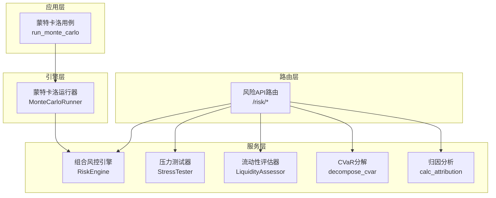
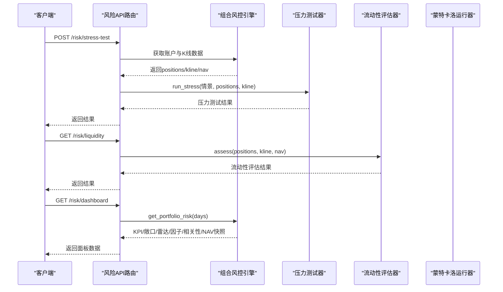
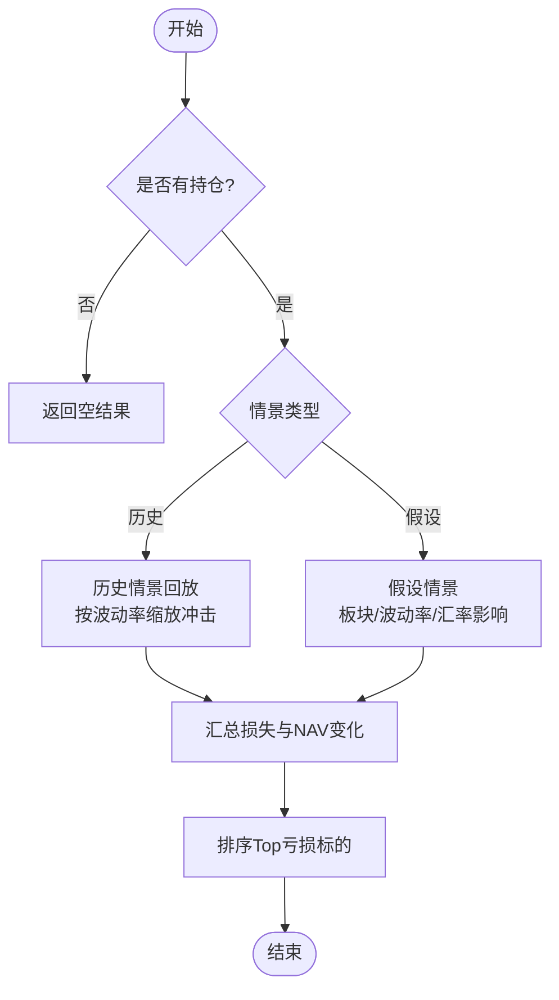
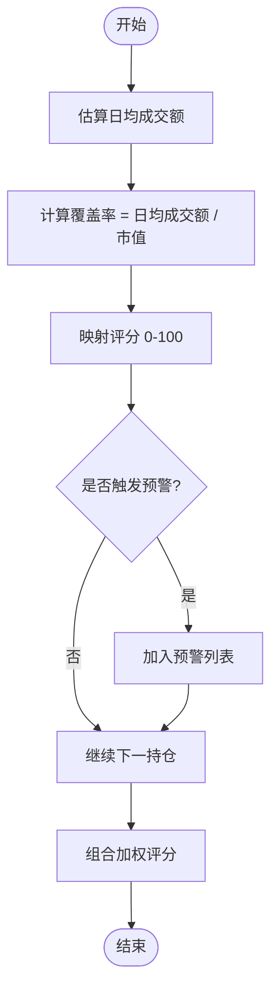
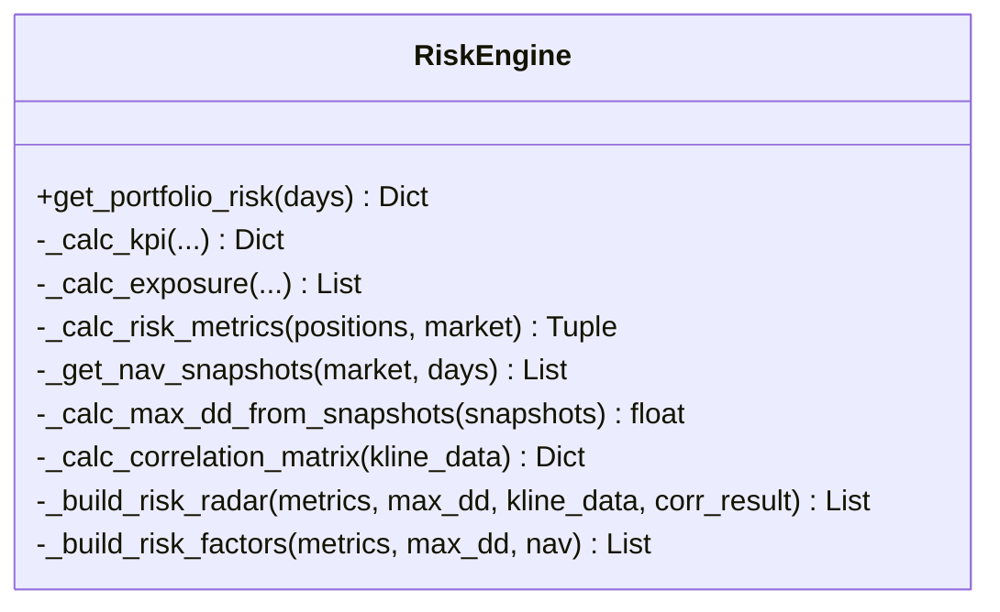
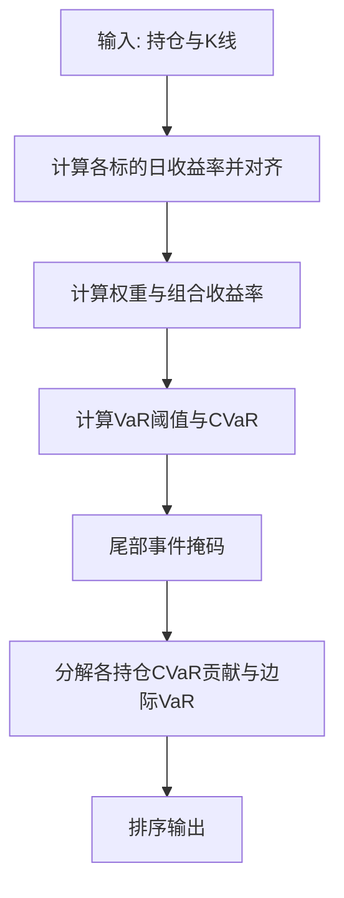
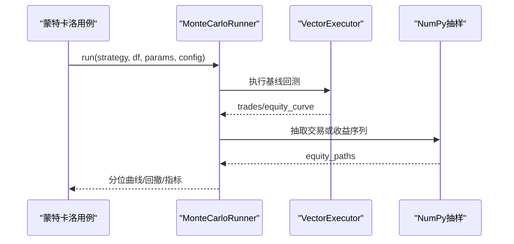
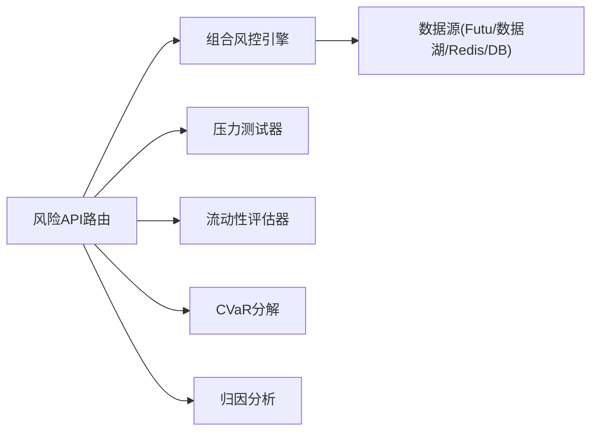

# 压力测试

<cite>
**本文引用的文件**
- [risk_stress.py](file://backend/services/risk/risk_stress.py)
- [risk_liquidity.py](file://backend/services/risk/risk_liquidity.py)
- [risk_cvar.py](file://backend/services/risk/risk_cvar.py)
- [risk_attribution.py](file://backend/services/risk/risk_attribution.py)
- [risk_engine.py](file://backend/services/risk/risk_engine.py)
- [risk.py](file://backend/routers/risk.py)
- [monte_carlo.py](file://backend/engine/monte_carlo.py)
- [monte_carlo_app.py](file://backend/app/monte_carlo_app.py)
</cite>

## 目录
1. [简介](#简介)
2. [项目结构](#项目结构)
3. [核心组件](#核心组件)
4. [架构总览](#架构总览)
5. [详细组件分析](#详细组件分析)
6. [依赖关系分析](#依赖关系分析)
7. [性能考量](#性能考量)
8. [故障排查指南](#故障排查指南)
9. [结论](#结论)
10. [附录](#附录)

## 简介
本文件面向“极端行情模拟、流动性风险评估、相关性分析与尾部风险度量、蒙特卡洛压测与执行框架”等能力，系统化梳理代码库中的压力测试实现。内容覆盖：
- 历史危机场景重现（如 2008/2020/2022）与假设性冲击（利率、波动率、汇率）
- 黑天鹅事件模拟思路与可扩展点
- 流动性风险评估：市场深度代理、买卖价差监控建议、大额交易冲击成本方法
- 相关性分析：资产间相关性矩阵、系统性风险度量（Beta）、尾部依赖（CVaR 分解）
- 压力测试执行框架：情景管理、并行计算优化、结果可视化接口
- 算法与模型选择说明及落地路径
- 结果解读与风险管理建议生成指引

## 项目结构
与压力测试直接相关的后端模块主要分布在 services/risk、engine、app 与 routers 层：
- 服务层（services/risk）：压力测试、流动性评估、CVaR、归因分析、组合风控引擎
- 引擎层（engine）：蒙特卡洛压测、向量回测集成
- 应用层（app）：蒙特卡洛用例编排
- 路由层（routers）：对外暴露风控与压力测试 API

图表来源
- [risk.py:1-231](file://backend/routers/risk.py#L1-L231)
- [risk_engine.py:22-135](file://backend/services/risk/risk_engine.py#L22-L135)
- [risk_stress.py:58-245](file://backend/services/risk/risk_stress.py#L58-L245)
- [risk_liquidity.py:12-130](file://backend/services/risk/risk_liquidity.py#L12-L130)
- [risk_cvar.py:12-114](file://backend/services/risk/risk_cvar.py#L12-L114)
- [risk_attribution.py:12-87](file://backend/services/risk/risk_attribution.py#L12-L87)
- [monte_carlo.py:149-254](file://backend/engine/monte_carlo.py#L149-L254)
- [monte_carlo_app.py:47-99](file://backend/app/monte_carlo_app.py#L47-L99)

章节来源
- [risk.py:1-231](file://backend/routers/risk.py#L1-L231)
- [risk_engine.py:22-135](file://backend/services/risk/risk_engine.py#L22-L135)

## 核心组件
- 压力测试器（StressTester）：支持历史情景回放与假设情景冲击，输出 NAV 变化、Top 亏损标的、时间戳等。
- 流动性评估器（LiquidityAssessor）：基于日均成交额代理与市值比率计算覆盖率与评分，提供预警信息。
- 组合风控引擎（RiskEngine）：聚合账户数据、计算波动率、VaR、Beta、Sharpe、相关性矩阵、最大回撤等，并缓存加速。
- CVaR 分解（risk_cvar）：计算条件 VaR 并按持仓分解贡献度与边际 VaR。
- 归因分析（risk_attribution）：Jensen's Alpha、Beta 贡献分解与超额收益归因。
- 蒙特卡洛运行器（MonteCarloRunner）：对基线回测的交易或日收益进行重排/自助抽样，输出分位曲线与最坏回撤。
- 蒙特卡洛用例（monte_carlo_app）：加载数据、执行基线回测、调用 MonteCarloRunner 生成报告。

章节来源
- [risk_stress.py:58-245](file://backend/services/risk/risk_stress.py#L58-L245)
- [risk_liquidity.py:12-130](file://backend/services/risk/risk_liquidity.py#L12-L130)
- [risk_engine.py:195-283](file://backend/services/risk/risk_engine.py#L195-L283)
- [risk_cvar.py:12-114](file://backend/services/risk/risk_cvar.py#L12-L114)
- [risk_attribution.py:12-87](file://backend/services/risk/risk_attribution.py#L12-L87)
- [monte_carlo.py:95-146](file://backend/engine/monte_carlo.py#L95-L146)
- [monte_carlo_app.py:47-99](file://backend/app/monte_carlo_app.py#L47-L99)

## 架构总览
压力测试系统以 FastAPI 路由为入口，统一调度服务层组件完成情景模拟、流动性评估、相关性分析与蒙特卡洛压测；组合风控引擎负责数据获取、指标计算与缓存。

图表来源
- [risk.py:218-231](file://backend/routers/risk.py#L218-L231)
- [risk.py:148-157](file://backend/routers/risk.py#L148-L157)
- [risk.py:63-76](file://backend/routers/risk.py#L63-L76)
- [risk_engine.py:32-135](file://backend/services/risk/risk_engine.py#L32-L135)
- [risk_stress.py:61-95](file://backend/services/risk/risk_stress.py#L61-L95)
- [risk_liquidity.py:15-35](file://backend/services/risk/risk_liquidity.py#L15-L35)

## 详细组件分析

### 压力测试器（StressTester）
- 功能要点
  - 历史情景回放：内置 2008/2020/2022 等情景，按统一冲击或结合标的波动率缩放估算损失。
  - 假设情景：利率上升、波动率翻倍、汇率贬值等，支持按板块映射与市场范围影响。
  - 输出：NAV 前后值、变动金额与百分比、Top 亏损标的列表、时间戳。
- 关键流程
  - 根据情景类型路由到历史或假设处理分支
  - 若存在真实 K 线数据，使用近期收益率波动放大冲击；否则采用固定冲击
  - 汇总各持仓损失，排序输出 Top 亏损

图表来源
- [risk_stress.py:61-95](file://backend/services/risk/risk_stress.py#L61-L95)
- [risk_stress.py:96-150](file://backend/services/risk/risk_stress.py#L96-L150)
- [risk_stress.py:152-217](file://backend/services/risk/risk_stress.py#L152-L217)

章节来源
- [risk_stress.py:58-245](file://backend/services/risk/risk_stress.py#L58-L245)

### 流动性风险评估（LiquidityAssessor）
- 功能要点
  - 日均成交额代理：在仅有收盘价序列时，用绝对对数收益率幅度乘以最新价与规模系数估算成交额。
  - 流动性覆盖率：日均成交额 / 市值；评分映射至 0-100。
  - 预警：大额持仓占比超过阈值、低流动性评分触发警告。
- 输出：个股评估、组合加权评分、预警列表、时间戳。

图表来源
- [risk_liquidity.py:15-35](file://backend/services/risk/risk_liquidity.py#L15-L35)
- [risk_liquidity.py:104-126](file://backend/services/risk/risk_liquidity.py#L104-L126)

章节来源
- [risk_liquidity.py:12-130](file://backend/services/risk/risk_liquidity.py#L12-L130)

### 相关性分析与系统性风险度量（RiskEngine）
- 相关性矩阵：基于最近 60 日对数收益率对齐后计算相关系数矩阵，并提示高相关性对。
- 系统性风险度量：通过 OLS 回归计算组合 Beta（相对于 HSI/GSPC）。
- 其他指标：波动率、VaR（历史模拟法）、Sharpe、最大回撤（从 NAV 快照）。
- 数据源：Futu 账户信息与 K 线、数据湖基准指数、Redis/DB 的 NAV 快照。

图表来源
- [risk_engine.py:22-135](file://backend/services/risk/risk_engine.py#L22-L135)
- [risk_engine.py:195-283](file://backend/services/risk/risk_engine.py#L195-L283)
- [risk_engine.py:348-374](file://backend/services/risk/risk_engine.py#L348-L374)
- [risk_engine.py:376-426](file://backend/services/risk/risk_engine.py#L376-L426)
- [risk_engine.py:428-481](file://backend/services/risk/risk_engine.py#L428-L481)

章节来源
- [risk_engine.py:195-283](file://backend/services/risk/risk_engine.py#L195-L283)
- [risk_engine.py:348-374](file://backend/services/risk/risk_engine.py#L348-L374)

### CVaR 分解（risk_cvar）
- 功能要点
  - 计算组合 CVaR（Expected Shortfall）与 VaR 阈值
  - 按持仓分解贡献度与边际 VaR，排序展示尾部风险来源
- 适用场景：识别尾部依赖与集中度风险，辅助减仓或对冲决策

图表来源
- [risk_cvar.py:12-24](file://backend/services/risk/risk_cvar.py#L12-L24)
- [risk_cvar.py:26-114](file://backend/services/risk/risk_cvar.py#L26-L114)

章节来源
- [risk_cvar.py:12-114](file://backend/services/risk/risk_cvar.py#L12-L114)

### 归因分析（risk_attribution）
- 功能要点
  - Jensen's Alpha、Beta 贡献分解、R-squared、年化收益与基准对比
- 用途：解释超额收益来源，区分市场因子与策略 alpha

章节来源
- [risk_attribution.py:12-87](file://backend/services/risk/risk_attribution.py#L12-L87)

### 蒙特卡洛压测（MonteCarloRunner & App）
- 功能要点
  - 基线回测：使用 VectorExecutor 跑一次基线
  - 抽样方法：交易重排（trade_reshuffle）、交易自助（trade_bootstrap）、收益自助（return_bootstrap）
  - 输出：分位权益曲线、最坏回撤、最终收益分位数、基线指标
- 应用编排：加载数据、构造参数、执行 runner、返回报告

图表来源
- [monte_carlo.py:95-146](file://backend/engine/monte_carlo.py#L95-L146)
- [monte_carlo.py:149-254](file://backend/engine/monte_carlo.py#L149-L254)
- [monte_carlo_app.py:47-99](file://backend/app/monte_carlo_app.py#L47-L99)

章节来源
- [monte_carlo.py:95-146](file://backend/engine/monte_carlo.py#L95-L146)
- [monte_carlo.py:149-254](file://backend/engine/monte_carlo.py#L149-L254)
- [monte_carlo_app.py:47-99](file://backend/app/monte_carlo_app.py#L47-L99)

## 依赖关系分析
- 路由层依赖服务层：/risk/* 路由调用 risk_engine、stress_tester、liquidity_assessor、decompose_cvar、calc_attribution
- 服务层内部解耦：每个模块职责清晰，便于扩展与替换
- 外部依赖：Futu 账户/K 线、数据湖基准指数、Redis/DB 缓存与快照
- 潜在循环依赖：当前未见明显循环；通过路由与服务层边界隔离

图表来源
- [risk.py:1-231](file://backend/routers/risk.py#L1-L231)
- [risk_engine.py:32-135](file://backend/services/risk/risk_engine.py#L32-L135)

章节来源
- [risk.py:1-231](file://backend/routers/risk.py#L1-L231)
- [risk_engine.py:32-135](file://backend/services/risk/risk_engine.py#L32-L135)

## 性能考量
- 缓存与并发
  - 组合风控面板使用 Redis 缓存（TTL 30s），减少重复计算
  - 多市场账户数据通过 asyncio.gather 并发获取，降低延迟
- 向量化计算
  - 蒙特卡洛路径生成与分位曲线计算使用 NumPy 向量化，避免 Python 循环瓶颈
- 数据对齐与截断
  - 收益率序列按最短长度对齐，避免广播错误与内存浪费
- 建议
  - 对高频查询增加本地缓存或增量更新
  - 大样本蒙特卡洛可考虑批处理与进程池并行

[本节为通用性能指导，不直接分析具体文件]

## 故障排查指南
- 无账户或空态
  - 现象：dashboard/liquidity/correlation 返回空数据
  - 原因：未连接 Futu 账户或无持仓
  - 处理：检查账户连接与数据源状态；路由层对 empty 返回 200 而非 500
- 数据获取失败
  - 现象：K 线或基准指数获取异常
  - 原因：网络或服务端错误
  - 处理：查看日志告警；降级返回空指标或默认值
- 蒙特卡洛报错
  - 现象：迭代次数越界、序列为空、基线路径过短
  - 原因：配置错误或数据不足
  - 处理：调整 iterations、确保基线回测有效且序列长度足够

章节来源
- [risk_engine.py:483-510](file://backend/services/risk/risk_engine.py#L483-L510)
- [risk.py:63-76](file://backend/routers/risk.py#L63-L76)
- [monte_carlo.py:110-113](file://backend/engine/monte_carlo.py#L110-L113)
- [monte_carlo.py:200-201](file://backend/engine/monte_carlo.py#L200-L201)

## 结论
该压力测试系统围绕情景模拟、流动性评估、相关性分析与蒙特卡洛压测形成完整闭环。通过服务层模块化设计、路由层统一暴露、引擎层高性能计算与缓存机制，满足极端行情下的风险评估与决策支持需求。建议在后续版本中增强：
- 更丰富的黑天鹅情景库与尾部依赖建模
- 更细粒度的流动性指标（订单簿深度、买卖价差）
- 分布式并行与增量计算以提升大规模压测效率

[本节为总结性内容，不直接分析具体文件]

## 附录
- 情景管理
  - 历史情景：2008/2020/2022 等，可直接扩展更多危机时段
  - 假设情景：利率、波动率、汇率等，可按板块与市场定制
- 结果可视化
  - 面板数据包含 KPI、敞口、雷达图、因子监控、相关性矩阵、NAV 快照
  - 蒙特卡洛输出分位曲线与回撤统计，便于前端渲染
- 风险管理建议生成
  - 基于 VaR/CVaR、Beta、流动性评分与相关性预警，自动生成减仓/对冲建议
  - 结合归因分析定位超额收益来源，优化策略参数

[本节为补充说明，不直接分析具体文件]