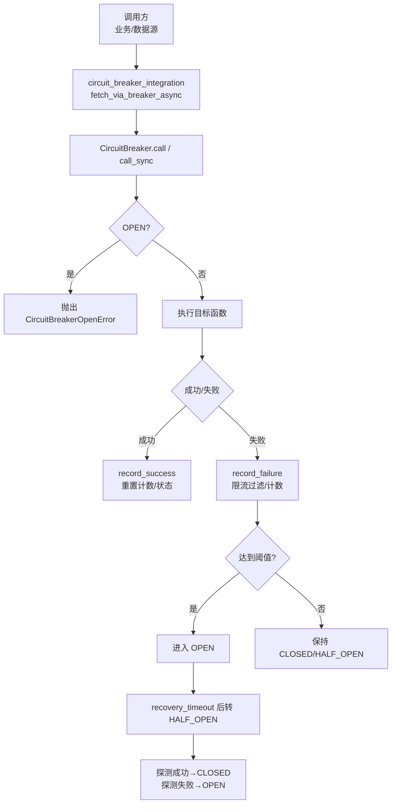
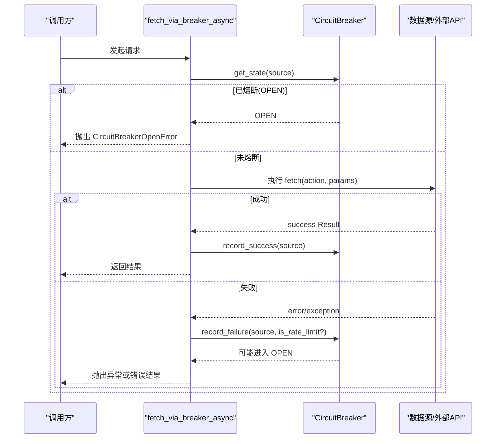
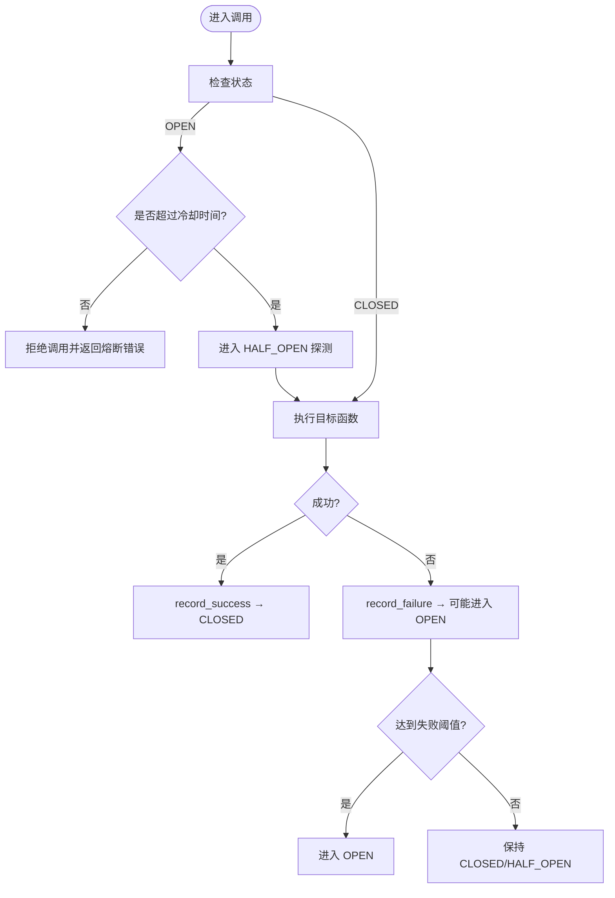
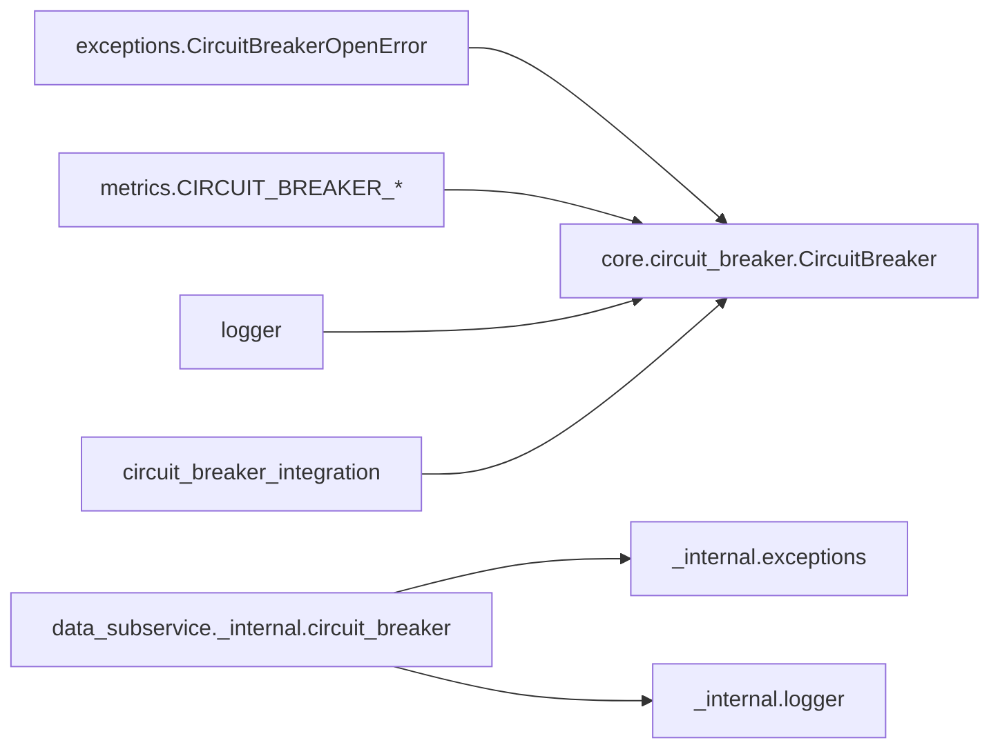

# 熔断机制

<cite>
**本文引用的文件**
- [backend/core/circuit_breaker.py](file://backend/core/circuit_breaker.py)
- [backend/core/circuit_breaker_integration.py](file://backend/core/circuit_breaker_integration.py)
- [data_subservice/_internal/circuit_breaker.py](file://data_subservice/_internal/circuit_breaker.py)
- [backend/core/exceptions.py](file://backend/core/exceptions.py)
- [backend/core/metrics.py](file://backend/core/metrics.py)
- [backend/app/system_app.py](file://backend/app/system_app.py)
- [backend/routers/system_health.py](file://backend/routers/system_health.py)
- [backend/services/akshare/calendar.py](file://backend/services/akshare/calendar.py)
- [backend/tests/test_circuit_breaker_direct.py](file://backend/tests/test_circuit_breaker_direct.py)
</cite>

## 目录
1. [简介](#简介)
2. [项目结构](#项目结构)
3. [核心组件](#核心组件)
4. [架构总览](#架构总览)
5. [详细组件分析](#详细组件分析)
6. [依赖关系分析](#依赖关系分析)
7. [性能考量](#性能考量)
8. [故障排查指南](#故障排查指南)
9. [结论](#结论)
10. [附录](#附录)

## 简介
本技术文档围绕系统内的熔断机制，系统性说明自动熔断条件、手动熔断操作、恢复机制、状态管理、决策引擎与配置项，以及事件记录与审计追踪能力。该机制通过统一的 CircuitBreaker 实现，覆盖主服务与数据子服务，结合 Prometheus 指标与健康检查接口，提供可观测性与运维可操作性。

## 项目结构
熔断相关代码主要分布在以下位置：
- 核心熔断器实现（主服务）：backend/core/circuit_breaker.py
- 数据源接入桥接：backend/core/circuit_breaker_integration.py
- 数据子服务独立熔断器：data_subservice/_internal/circuit_breaker.py
- 异常定义：backend/core/exceptions.py
- 监控指标：backend/core/metrics.py
- 健康与系统信息聚合：backend/app/system_app.py、backend/routers/system_health.py
- 遗留手写冷却逻辑复用：backend/services/akshare/calendar.py
- 单元测试：backend/tests/test_circuit_breaker_direct.py

**图表来源**
- [backend/core/circuit_breaker_integration.py:40-72](file://backend/core/circuit_breaker_integration.py#L40-L72)
- [backend/core/circuit_breaker.py:147-218](file://backend/core/circuit_breaker.py#L147-L218)
- [backend/core/circuit_breaker.py:220-265](file://backend/core/circuit_breaker.py#L220-L265)

**章节来源**
- [backend/core/circuit_breaker.py:1-379](file://backend/core/circuit_breaker.py#L1-L379)
- [backend/core/circuit_breaker_integration.py:1-73](file://backend/core/circuit_breaker_integration.py#L1-L73)
- [data_subservice/_internal/circuit_breaker.py:1-296](file://data_subservice/_internal/circuit_breaker.py#L1-L296)

## 核心组件
- CircuitBreaker：异步优先的熔断器管理器，支持装饰器与显式调用两种模式；维护每个服务的三态机（CLOSED/OPEN/HALF_OPEN），基于连续失败次数与冷却时间进行状态迁移。
- circuit_breaker_integration：将统一熔断器接入数据源 fetch 主路径，封装 Result 成功/失败判定与限流分类，避免对熔断中服务继续施压。
- data_subservice._internal.circuit_breaker：与主服务一致的熔断器实现，适配子服务环境（metrics 降级为 no-op）。
- 异常与指标：CircuitBreakerOpenError 用于明确“熔断中”错误；Prometheus 指标 CIRCUIT_BREAKER_STATE、CIRCUIT_BREAKER_TRANSITIONS 暴露状态与转换次数。
- 健康与系统信息：system_app 与 system_health 聚合并暴露熔断状态快照，便于外部监控与告警。

**章节来源**
- [backend/core/circuit_breaker.py:64-353](file://backend/core/circuit_breaker.py#L64-L353)
- [backend/core/circuit_breaker_integration.py:25-72](file://backend/core/circuit_breaker_integration.py#L25-L72)
- [data_subservice/_internal/circuit_breaker.py:64-275](file://data_subservice/_internal/circuit_breaker.py#L64-L275)
- [backend/core/exceptions.py:108-115](file://backend/core/exceptions.py#L108-L115)
- [backend/core/metrics.py:100-110](file://backend/core/metrics.py#L100-L110)
- [backend/app/system_app.py:130-147](file://backend/app/system_app.py#L130-L147)
- [backend/routers/system_health.py:340-355](file://backend/routers/system_health.py#L340-L355)

## 架构总览
熔断机制在数据获取主路径上以“前置短路 + 后置统计”的方式工作：
- 调用前：若目标服务处于 OPEN，直接短路返回 CircuitBreakerOpenError，避免放大下游压力。
- 调用中：执行目标函数，捕获异常或解析 Result 成功/失败。
- 调用后：根据是否限流类错误决定是否计入失败计数；成功则复位计数与状态；失败累计至阈值触发 OPEN；超过 recovery_timeout 自动进入 HALF_OPEN 进行探测。

**图表来源**
- [backend/core/circuit_breaker_integration.py:40-72](file://backend/core/circuit_breaker_integration.py#L40-L72)
- [backend/core/circuit_breaker.py:147-218](file://backend/core/circuit_breaker.py#L147-L218)
- [backend/core/exceptions.py:108-115](file://backend/core/exceptions.py#L108-L115)

**章节来源**
- [backend/core/circuit_breaker_integration.py:1-73](file://backend/core/circuit_breaker_integration.py#L1-L73)
- [backend/core/circuit_breaker.py:147-218](file://backend/core/circuit_breaker.py#L147-L218)

## 详细组件分析

### 自动熔断条件
- 市场异常波动检测：当前实现以“连续失败次数”作为触发条件，不直接内置市场波动指标。可通过上层策略在异常波动时主动调用 record_failure 或设置更严格的 max_failures 来提前触发熔断。
- 数据源故障识别：异常或 Result.error 均会被记录为失败；限流类错误（如 429/403/402）通过 error_category 或 _error_category 标记被排除在失败计数之外，避免误熔断。
- 系统资源耗尽保护：熔断器本身不直接检测 CPU/内存等系统资源，但可通过快速短路（OPEN 时立即返回）降低资源占用；如需资源级保护，可在调用层增加资源探针并在超限前主动触发熔断。

**章节来源**
- [backend/core/circuit_breaker.py:104-145](file://backend/core/circuit_breaker.py#L104-L145)
- [backend/core/circuit_breaker_integration.py:25-72](file://backend/core/circuit_breaker_integration.py#L25-L72)

### 手动熔断操作
- 管理员干预接口：
  - 重置单个服务：调用 reset(service) 将指定服务恢复到 CLOSED。
  - 重置全部服务：调用 reset() 将所有服务恢复到 CLOSED。
- 熔断状态查询：
  - 使用 get_state(service) 获取当前状态。
  - 使用 status_snapshot() 获取所有服务的状态快照。
  - 通过系统健康接口 /health 或 /monitor 查看 circuit_breaker_states。
- 强制恢复流程：
  - 在确认下游恢复后，调用 reset(service) 立即恢复；或通过等待 recovery_timeout 自动进入 HALF_OPEN 探测恢复。

**章节来源**
- [backend/core/circuit_breaker.py:326-353](file://backend/core/circuit_breaker.py#L326-L353)
- [backend/app/system_app.py:130-147](file://backend/app/system_app.py#L130-L147)
- [backend/routers/system_health.py:340-355](file://backend/routers/system_health.py#L340-L355)

### 熔断恢复机制
- 冷却时间设置：由环境变量 CIRCUIT_BREAKER_COOLDOWN_S 控制，默认 60 秒；禁止硬编码。
- 健康检查验证：OPEN 超时后自动转为 HALF_OPEN，允许一次探测；探测成功则回到 CLOSED，失败则重新进入 OPEN。
- 渐进式恢复策略：当前实现为“单探测”策略；如需渐进式恢复，可在 HALF_OPEN 期间引入多次探测与成功率阈值，或在调用层对流量进行逐步放行。

**图表来源**
- [backend/core/circuit_breaker.py:88-97](file://backend/core/circuit_breaker.py#L88-L97)
- [backend/core/circuit_breaker.py:147-218](file://backend/core/circuit_breaker.py#L147-L218)
- [backend/core/circuit_breaker.py:220-265](file://backend/core/circuit_breaker.py#L220-L265)

**章节来源**
- [backend/core/circuit_breaker.py:40-43](file://backend/core/circuit_breaker.py#L40-L43)
- [backend/core/circuit_breaker.py:88-97](file://backend/core/circuit_breaker.py#L88-L97)
- [backend/core/circuit_breaker.py:147-218](file://backend/core/circuit_breaker.py#L147-L218)

### 熔断状态管理
- 状态持久化：当前实现为进程内状态（内存字典），重启后丢失；如需跨实例/进程持久化，可扩展到 Redis 或数据库存储，并在多实例间同步。
- 多实例同步：当前无分布式锁或共享状态；在多实例部署下，建议引入集中式存储（如 Redis）与键空间通知/轮询，确保各实例一致。
- 监控告警集成：通过 CIRCUIT_BREAKER_STATE 与 CIRCUIT_BREAKER_TRANSITIONS 暴露 Prometheus 指标；system_app 聚合这些指标并通过 /health 暴露给监控系统。

**章节来源**
- [backend/core/circuit_breaker.py:77-86](file://backend/core/circuit_breaker.py#L77-L86)
- [backend/core/metrics.py:100-110](file://backend/core/metrics.py#L100-L110)
- [backend/app/system_app.py:130-147](file://backend/app/system_app.py#L130-L147)

### 熔断决策引擎与配置选项
- 决策引擎：
  - 失败计数：每次非限流失败递增 failures，达到 max_failures 即进入 OPEN。
  - 限流过滤：通过 is_rate_limit_error 或 per-call error_classifier 判断是否为限流类错误，不计入失败计数。
  - 半开探测：超过 recovery_timeout 自动进入 HALF_OPEN，单次探测成功即恢复 CLOSED。
- 配置选项：
  - CIRCUIT_BREAKER_MAX_FAILURES：连续失败阈值（默认 3）。
  - CIRCUIT_BREAKER_COOLDOWN_S：冷却时间（默认 60 秒）。
  - 可通过 get_circuit_breaker(max_failures, recovery_timeout) 创建不同配置的实例。

**章节来源**
- [backend/core/circuit_breaker.py:40-43](file://backend/core/circuit_breaker.py#L40-L43)
- [backend/core/circuit_breaker.py:104-145](file://backend/core/circuit_breaker.py#L104-L145)
- [backend/core/circuit_breaker.py:355-379](file://backend/core/circuit_breaker.py#L355-L379)

### 历史记录与审计追踪
- 日志记录：状态转换、失败计数、限流跳过、半开探测等关键事件均有日志输出，便于审计与排障。
- 指标记录：CIRCUIT_BREAKER_STATE（状态）、CIRCUIT_BREAKER_TRANSITIONS（转换次数）可用于历史回溯与告警。
- 健康接口：/health 与 /monitor 暴露 circuit_breaker_states，供监控系统采集与可视化。

**章节来源**
- [backend/core/circuit_breaker.py:94-97](file://backend/core/circuit_breaker.py#L94-L97)
- [backend/core/circuit_breaker.py:192-199](file://backend/core/circuit_breaker.py#L192-L199)
- [backend/core/metrics.py:100-110](file://backend/core/metrics.py#L100-L110)
- [backend/app/system_app.py:130-147](file://backend/app/system_app.py#L130-L147)
- [backend/routers/system_health.py:340-355](file://backend/routers/system_health.py#L340-L355)

## 依赖关系分析
- 主服务熔断器依赖：
  - 异常：CircuitBreakerOpenError
  - 指标：CIRCUIT_BREAKER_STATE、CIRCUIT_BREAKER_TRANSITIONS
  - 日志：logger
- 数据源桥接依赖：
  - 熔断器：circuit_breaker
  - Result 成功判定：is_success 属性
- 子服务熔断器：
  - 内部异常与日志：_internal.exceptions、_internal.logger
  - metrics 降级：no-op 桩，不影响行为

**图表来源**
- [backend/core/circuit_breaker.py:34-36](file://backend/core/circuit_breaker.py#L34-L36)
- [backend/core/circuit_breaker_integration.py:22-23](file://backend/core/circuit_breaker_integration.py#L22-L23)
- [data_subservice/_internal/circuit_breaker.py:17-18](file://data_subservice/_internal/circuit_breaker.py#L17-L18)

**章节来源**
- [backend/core/circuit_breaker.py:34-36](file://backend/core/circuit_breaker.py#L34-L36)
- [backend/core/circuit_breaker_integration.py:22-23](file://backend/core/circuit_breaker_integration.py#L22-L23)
- [data_subservice/_internal/circuit_breaker.py:17-18](file://data_subservice/_internal/circuit_breaker.py#L17-L18)

## 性能考量
- 低开销短路：OPEN 状态下立即返回错误，避免无效调用与资源消耗。
- 限流过滤：限流类错误不计入失败计数，减少误熔断带来的抖动。
- 指标与日志：适度打点，避免高频写入影响性能；子服务 metrics 降级为 no-op，降低边缘节点负担。
- 线程安全：异步路径使用 asyncio.Lock，同步路径使用简单判断，保证并发安全。

[本节为通用指导，无需特定文件引用]

## 故障排查指南
- 常见问题定位：
  - 频繁熔断：检查上游异常类型与错误码，确认是否被正确识别为限流类错误；调整 max_failures 或 recovery_timeout。
  - 无法恢复：确认 HALF_OPEN 探测是否成功；必要时手动调用 reset(service)。
  - 监控缺失：检查 Prometheus 指标是否上报；确认 system_app 能读取 CIRCUIT_BREAKER_STATE。
- 诊断步骤：
  - 查看 /health 中的 circuit_breaker_states 快照。
  - 检查日志中的熔断事件（进入 OPEN、HALF_OPEN、恢复等）。
  - 核对错误分类与 Result 的 is_success/error_category。
- 参考用例：
  - 单元测试覆盖状态机与边界场景，可作为回归测试基线。

**章节来源**
- [backend/app/system_app.py:130-147](file://backend/app/system_app.py#L130-L147)
- [backend/core/circuit_breaker.py:94-97](file://backend/core/circuit_breaker.py#L94-L97)
- [backend/core/circuit_breaker.py:192-199](file://backend/core/circuit_breaker.py#L192-L199)
- [backend/tests/test_circuit_breaker_direct.py:69-97](file://backend/tests/test_circuit_breaker_direct.py#L69-L97)
- [backend/tests/test_circuit_breaker_direct.py:114-196](file://backend/tests/test_circuit_breaker_direct.py#L114-L196)

## 结论
本熔断机制以简洁可靠的三态机为核心，结合限流过滤、冷却时间与半开探测，有效保护下游服务免受雪崩效应影响。通过 Prometheus 指标与健康接口，提供完善的可观测性与运维可操作性。未来可考虑扩展分布式状态持久化与渐进式恢复策略，以适配更大规模的多实例部署。

[本节为总结性内容，无需特定文件引用]

## 附录
- 环境变量配置：
  - CIRCUIT_BREAKER_MAX_FAILURES：连续失败阈值（默认 3）
  - CIRCUIT_BREAKER_COOLDOWN_S：冷却时间（默认 60 秒）
- 遗留兼容：
  - 旧版手写冷却逻辑通过 get_cooldown_seconds() 统一获取冷却时长，避免硬编码。

**章节来源**
- [backend/core/circuit_breaker.py:40-43](file://backend/core/circuit_breaker.py#L40-L43)
- [backend/core/circuit_breaker.py:373-379](file://backend/core/circuit_breaker.py#L373-L379)
- [backend/services/akshare/calendar.py:14-62](file://backend/services/akshare/calendar.py#L14-L62)