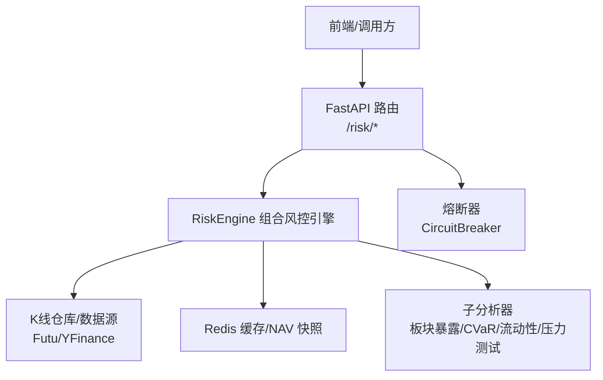
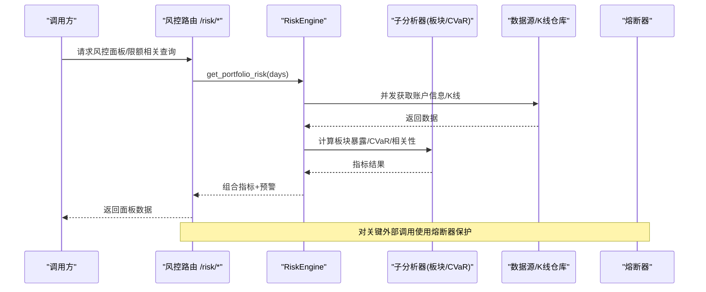
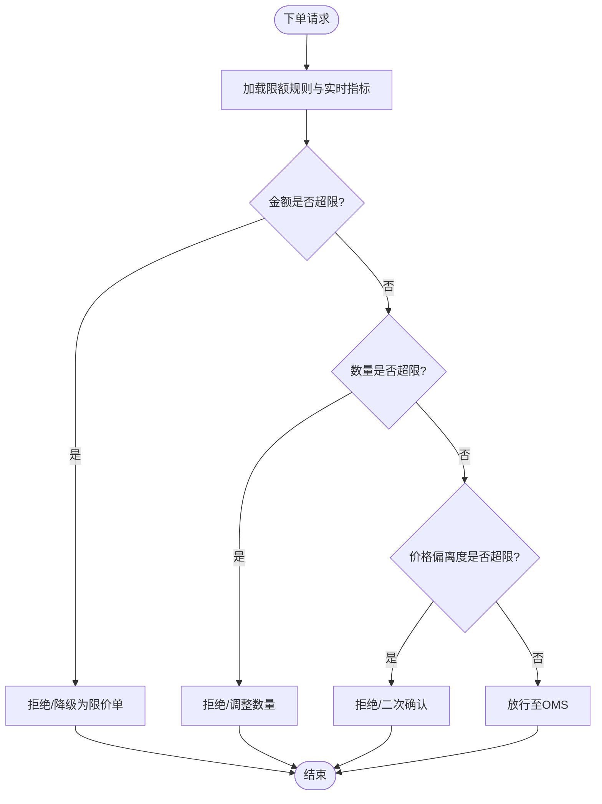
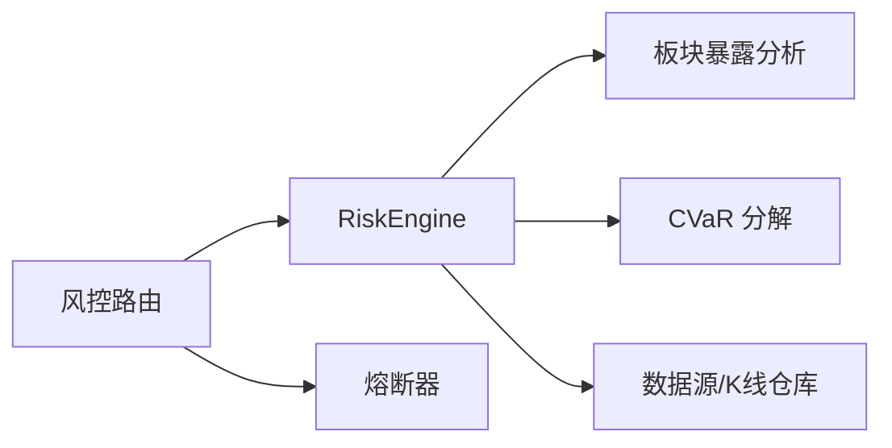

# 限额控制

<cite>
**本文引用的文件**
- [backend/routers/risk.py](file://backend/routers/risk.py)
- [backend/services/risk/risk_engine.py](file://backend/services/risk/risk_engine.py)
- [backend/services/risk/risk_sector.py](file://backend/services/risk/risk_sector.py)
- [backend/services/risk/risk_cvar.py](file://backend/services/risk/risk_cvar.py)
- [backend/core/circuit_breaker.py](file://backend/core/circuit_breaker.py)
</cite>

## 目录
1. [简介](#简介)
2. [项目结构](#项目结构)
3. [核心组件](#核心组件)
4. [架构总览](#架构总览)
5. [详细组件分析](#详细组件分析)
6. [依赖关系分析](#依赖关系分析)
7. [性能考量](#性能考量)
8. [故障排查指南](#故障排查指南)
9. [结论](#结论)
10. [附录](#附录)

## 简介
本文件围绕“限额控制系统”的目标，结合仓库中已实现的风控能力，给出可落地的设计与落地方案。重点覆盖：
- 单笔交易限额控制：订单金额、数量、价格偏离度检查（建议与现有风控面板联动）
- 日交易限额管理：日内累计额度监控、跨账户合并计算（基于分账户风控数据）
- 持仓集中度限制：单只股票仓位上限、行业集中度控制、相关性风险分散（已有板块暴露与相关性矩阵）
- 止损止盈机制：动态止损、跟踪止损、移动止盈（建议与组合波动率/回撤指标联动）
- 限额规则配置接口与实时监控（基于现有 /risk 路由扩展）
- 违规处理流程与自动熔断触发条件（复用熔断器能力）

说明：以下设计在现有代码基础上进行增强与集成，确保不破坏既有接口与行为。

## 项目结构
与限额控制直接相关的后端模块主要位于 backend/services/risk 与 backend/routers/risk.py；熔断保护位于 backend/core/circuit_breaker.py。

图表来源
- [backend/routers/risk.py:63-231](file://backend/routers/risk.py#L63-L231)
- [backend/services/risk/risk_engine.py:32-135](file://backend/services/risk/risk_engine.py#L32-L135)
- [backend/core/circuit_breaker.py:64-218](file://backend/core/circuit_breaker.py#L64-L218)

章节来源
- [backend/routers/risk.py:63-231](file://backend/routers/risk.py#L63-L231)
- [backend/services/risk/risk_engine.py:32-135](file://backend/services/risk/risk_engine.py#L32-L135)
- [backend/core/circuit_breaker.py:64-218](file://backend/core/circuit_breaker.py#L64-L218)

## 核心组件
- 风控面板与指标聚合：提供分账户 KPI、敞口、风险雷达、相关性矩阵、CVaR、流动性评估等，支撑限额判定所需的数据基础。
- 板块暴露分析：按 GICS 标准聚合行业集中度，用于行业集中度限额校验。
- CVaR 分解：按持仓分解尾部风险贡献，辅助定位集中度与相关性风险。
- 熔断器：对外部数据源或关键路径提供快速失败与恢复能力，避免雪崩。

章节来源
- [backend/routers/risk.py:63-231](file://backend/routers/risk.py#L63-L231)
- [backend/services/risk/risk_engine.py:32-135](file://backend/services/risk/risk_engine.py#L32-L135)
- [backend/services/risk/risk_sector.py:43-153](file://backend/services/risk/risk_sector.py#L43-L153)
- [backend/services/risk/risk_cvar.py:12-114](file://backend/services/risk/risk_cvar.py#L12-L114)
- [backend/core/circuit_breaker.py:64-218](file://backend/core/circuit_breaker.py#L64-L218)

## 架构总览
限额控制由“规则引擎 + 实时指标 + 熔断保护”构成。规则引擎读取当前组合状态（来自 RiskEngine），结合限额策略（可配置）做出放行/拒绝/减仓决策；熔断器保障外部依赖异常时的系统稳定性。

图表来源
- [backend/routers/risk.py:63-231](file://backend/routers/risk.py#L63-L231)
- [backend/services/risk/risk_engine.py:32-135](file://backend/services/risk/risk_engine.py#L32-L135)
- [backend/core/circuit_breaker.py:147-218](file://backend/core/circuit_breaker.py#L147-L218)

## 详细组件分析

### 单笔交易限额控制（订单金额、数量、价格偏离度）
- 目标：在下单前对单笔订单进行限额校验，防止超限成交。
- 数据来源：从风控面板获取当前账户净值、现金、杠杆利用率、波动率、VaR、最大回撤等指标，作为阈值参考。
- 校验要点：
  - 订单金额：不超过账户净值的一定比例或可用现金的阈值。
  - 订单数量：不超过单标的流通量或历史日均成交量的比例。
  - 价格偏离度：委托价相对最新价的偏离幅度超过阈值时拦截或要求二次确认。
- 与现有系统的集成点：
  - 通过 /risk/dashboard 或 /risk/positions-breakdown 获取实时组合状态。
  - 将限额规则以配置形式注入到下单前置校验层（建议在 OMS/交易网关层实现）。
- 建议流程：

章节来源
- [backend/routers/risk.py:63-92](file://backend/routers/risk.py#L63-L92)
- [backend/services/risk/risk_engine.py:137-193](file://backend/services/risk/risk_engine.py#L137-L193)

### 日交易限额管理（日内累计额度监控、跨账户合并计算）
- 目标：控制单日累计买入/卖出金额、净头寸变化，避免过度交易。
- 数据来源：RiskEngine 的分账户 KPI（净值、现金、市值）、NAV 快照序列（用于回撤与波动统计）。
- 实现思路：
  - 日内累计：维护 Redis 键记录当日累计买卖额，按账户维度与全局维度分别统计。
  - 跨账户合并：汇总 HK/US 账户的累计额与净敞口，统一判断是否触发限额。
  - 阈值策略：基于 VaR、波动率、最大回撤动态调整限额（高波动期收紧）。
- 与现有系统的集成点：
  - 使用 /risk/dashboard 的 accounts 字段获取各账户净值与敞口。
  - 使用 NAV 快照序列计算最大回撤，作为限额松紧度的输入。

章节来源
- [backend/services/risk/risk_engine.py:32-135](file://backend/services/risk/risk_engine.py#L32-L135)
- [backend/services/risk/risk_engine.py:285-346](file://backend/services/risk/risk_engine.py#L285-L346)

### 持仓集中度限制（单只股票仓位上限、行业集中度、相关性风险分散）
- 单只股票仓位上限：基于市值权重与波动率/VaR 设定上限，避免单一标的风险过大。
- 行业集中度控制：利用板块暴露分析（GICS 聚合）计算各行业占比，设置行业集中度阈值。
- 相关性风险分散：基于相关性矩阵识别高相关标的，降低组合整体尾部风险。
- 与现有系统的集成点：
  - 板块暴露：/risk/sector-exposure 提供行业分布。
  - 相关性矩阵：/risk/correlation 提供持仓间相关系数及高相关预警。
  - CVaR 分解：/risk/cvar 提供尾部风险贡献度，辅助定位集中风险来源。

章节来源
- [backend/routers/risk.py:98-127](file://backend/routers/risk.py#L98-L127)
- [backend/services/risk/risk_sector.py:43-153](file://backend/services/risk/risk_sector.py#L43-L153)
- [backend/services/risk/risk_cvar.py:26-114](file://backend/services/risk/risk_cvar.py#L26-L114)

### 止损止盈机制（动态止损、跟踪止损、移动止盈）
- 动态止损：根据组合波动率与 VaR 动态调整止损位，波动增大时收紧止损。
- 跟踪止损：随价格上涨上移止损位，锁定利润；下跌时保持原止损位。
- 移动止盈：基于技术指标或回撤阈值逐步上移止盈位。
- 与现有系统的集成点：
  - 使用组合波动率、VaR、最大回撤等指标作为动态参数输入。
  - 在 OMS/执行层实现止损止盈逻辑，并与限额控制联动（触发减仓/平仓）。

章节来源
- [backend/services/risk/risk_engine.py:195-283](file://backend/services/risk/risk_engine.py#L195-L283)
- [backend/services/risk/risk_engine.py:330-346](file://backend/services/risk/risk_engine.py#L330-L346)

### 限额规则配置接口与实时监控
- 配置接口（建议新增）：
  - 单笔限额：订单金额上限、数量上限、价格偏离度阈值。
  - 日限额：日内累计买卖额、净敞口变化阈值。
  - 集中度：单票权重上限、行业集中度上限、相关性阈值。
  - 止损止盈：动态止损参数、跟踪止损步长、移动止盈阈值。
- 实时监控：
  - 复用 /risk/dashboard 与 /risk/positions-breakdown 展示实时限额使用情况。
  - 在面板中增加“限额占用率”“剩余额度”“预警等级”等字段。
- 与现有系统的集成点：
  - 通过 RiskEngine 的分账户数据构建限额占用视图。
  - 使用板块暴露与相关性矩阵作为集中度监控的可视化依据。

章节来源
- [backend/routers/risk.py:63-92](file://backend/routers/risk.py#L63-L92)
- [backend/routers/risk.py:98-127](file://backend/routers/risk.py#L98-L127)

### 限额违规处理流程与自动熔断触发条件
- 违规处理流程：
  - 拦截：当单笔/日内/集中度指标超限时，拒绝下单或强制减仓。
  - 告警：记录违规事件并推送告警（可对接通知适配器）。
  - 复盘：定期生成限额使用报告，优化阈值与策略。
- 自动熔断触发条件：
  - 外部数据源连续失败达到阈值时触发熔断，避免雪崩。
  - 熔断器支持半开探测与自动恢复，减少误判影响。
- 与现有系统的集成点：
  - 使用熔断器保护关键外部调用（如数据源、行情服务）。
  - 在风控面板中暴露熔断状态，便于运维观察。

章节来源
- [backend/core/circuit_breaker.py:64-218](file://backend/core/circuit_breaker.py#L64-L218)

## 依赖关系分析
- 路由层依赖 RiskEngine 提供组合指标；RiskEngine 依赖数据源与 K 线仓库；子分析器依赖数据源与缓存。
- 熔断器独立于业务逻辑，但可包裹关键外部调用，提升鲁棒性。

图表来源
- [backend/routers/risk.py:63-231](file://backend/routers/risk.py#L63-L231)
- [backend/services/risk/risk_engine.py:32-135](file://backend/services/risk/risk_engine.py#L32-L135)
- [backend/services/risk/risk_sector.py:43-153](file://backend/services/risk/risk_sector.py#L43-L153)
- [backend/services/risk/risk_cvar.py:26-114](file://backend/services/risk/risk_cvar.py#L26-L114)
- [backend/core/circuit_breaker.py:64-218](file://backend/core/circuit_breaker.py#L64-L218)

章节来源
- [backend/routers/risk.py:63-231](file://backend/routers/risk.py#L63-L231)
- [backend/services/risk/risk_engine.py:32-135](file://backend/services/risk/risk_engine.py#L32-L135)
- [backend/core/circuit_breaker.py:64-218](file://backend/core/circuit_breaker.py#L64-L218)

## 性能考量
- 缓存策略：RiskEngine 对风控面板数据使用 Redis 缓存（TTL 30s），降低重复计算开销。
- 并发获取：HK/US 账户数据与 K 线数据采用并发拉取，缩短响应时间。
- 指标计算：收益率对齐与加权组合收益计算使用 NumPy 向量化，提升效率。
- 熔断保护：对不稳定外部依赖启用熔断，避免级联失败。

章节来源
- [backend/services/risk/risk_engine.py:32-135](file://backend/services/risk/risk_engine.py#L32-L135)
- [backend/core/circuit_breaker.py:64-218](file://backend/core/circuit_breaker.py#L64-L218)

## 故障排查指南
- 无账户空态：当 Futu 账户未连接或无持仓时，RiskEngine 返回空态而非错误，前端应友好提示。
- 数据源异常：若 K 线或基准指数获取失败，RiskEngine 会记录警告并降级计算，需检查数据源连通性。
- 熔断触发：若外部 API 频繁失败，熔断器将进入 OPEN 状态，需检查依赖服务健康度并等待恢复。
- 缓存失效：Redis 读写异常时，RiskEngine 会回退到数据库或直接计算，需关注日志与监控。

章节来源
- [backend/services/risk/risk_engine.py:483-510](file://backend/services/risk/risk_engine.py#L483-L510)
- [backend/core/circuit_breaker.py:147-218](file://backend/core/circuit_breaker.py#L147-L218)

## 结论
本方案在现有风控能力基础上，构建了完整的限额控制系统：以 RiskEngine 为核心，结合板块暴露、相关性矩阵、CVaR 分解等指标，实现单笔、日内、集中度等多维限额控制；通过熔断器保障系统稳定性；并提供可扩展的配置接口与实时监控能力。后续可在 OMS/交易网关层落地具体校验逻辑，并结合告警与复盘机制持续优化。

## 附录
- 建议新增的限额规则配置项示例（概念性）：
  - 单笔限额：订单金额上限、数量上限、价格偏离度阈值
  - 日限额：日内累计买卖额、净敞口变化阈值
  - 集中度：单票权重上限、行业集中度上限、相关性阈值
  - 止损止盈：动态止损参数、跟踪止损步长、移动止盈阈值
- 监控指标建议：
  - 限额占用率、剩余额度、预警等级
  - 板块集中度、相关性高值对数量
  - 熔断状态、失败次数、恢复时间
