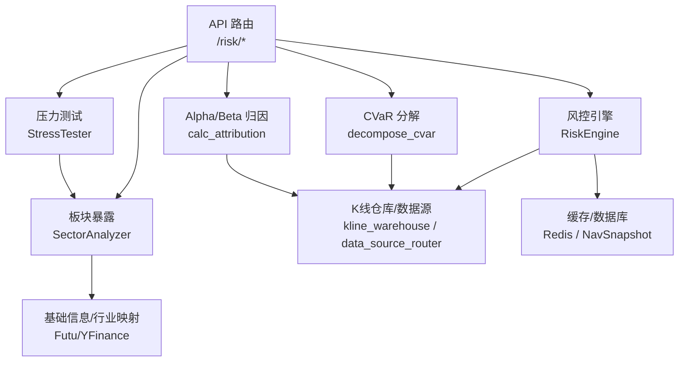
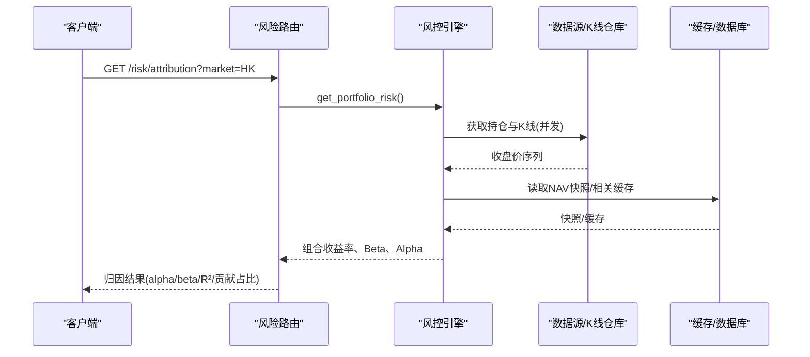
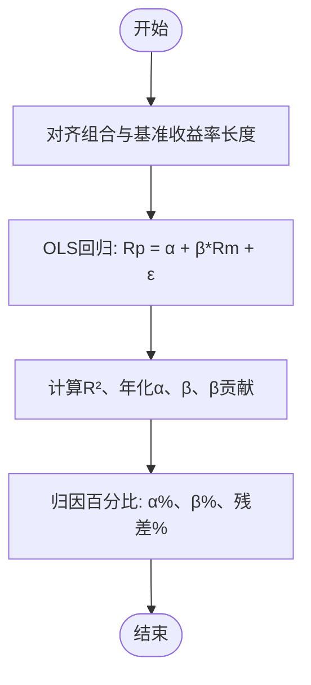
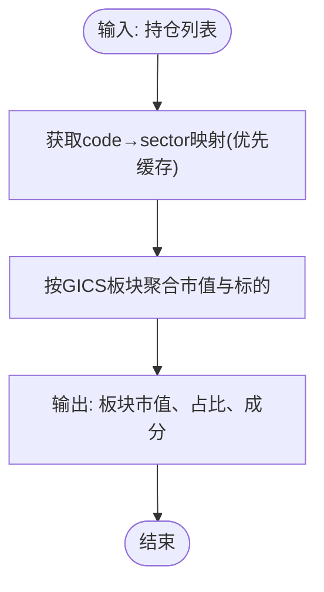
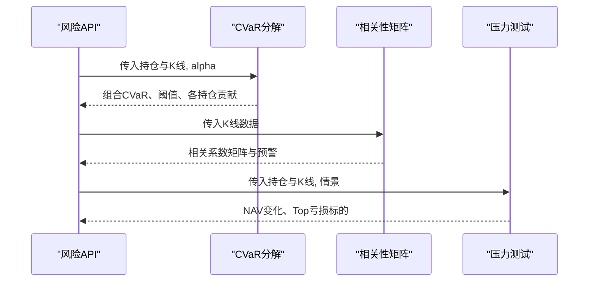
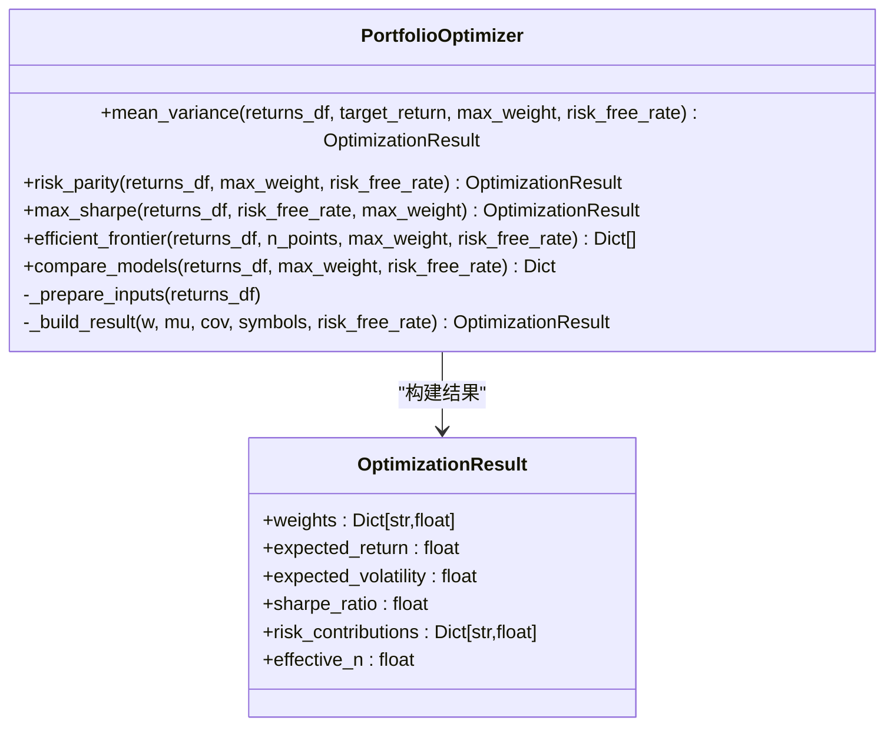
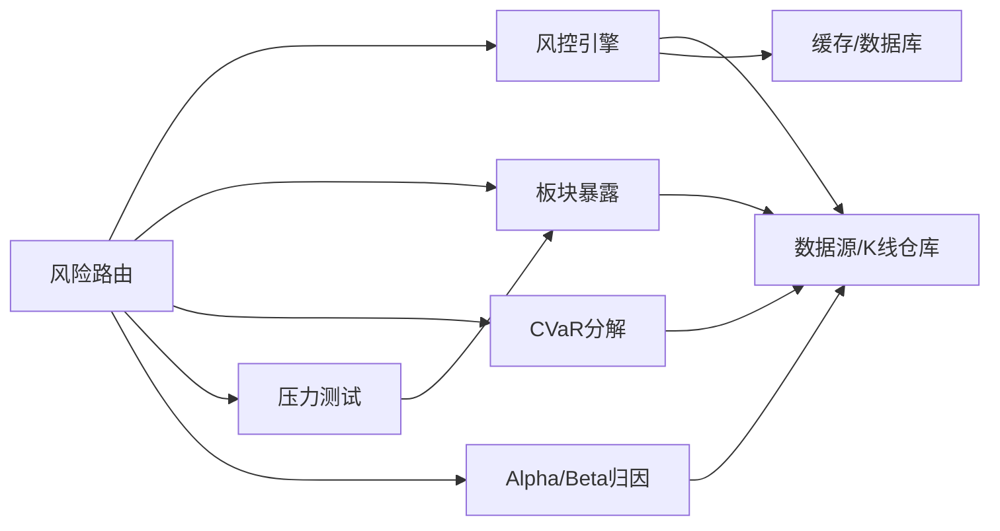

# 风险归因分析

<cite>
**本文引用的文件**
- [backend/services/risk/risk_engine.py](file://backend/services/risk/risk_engine.py)
- [backend/services/risk/risk_attribution.py](file://backend/services/risk/risk_attribution.py)
- [backend/services/risk/risk_sector.py](file://backend/services/risk/risk_sector.py)
- [backend/services/risk/risk_cvar.py](file://backend/services/risk/risk_cvar.py)
- [backend/services/risk/risk_stress.py](file://backend/services/risk/risk_stress.py)
- [backend/domain/performance.py](file://backend/domain/performance.py)
- [backend/domain/portfolio_optimizer.py](file://backend/domain/portfolio_optimizer.py)
- [backend/routers/risk.py](file://backend/routers/risk.py)
</cite>

## 目录
1. [简介](#简介)
2. [项目结构](#项目结构)
3. [核心组件](#核心组件)
4. [架构总览](#架构总览)
5. [详细组件分析](#详细组件分析)
6. [依赖关系分析](#依赖关系分析)
7. [性能考量](#性能考量)
8. [故障排查指南](#故障排查指南)
9. [结论](#结论)
10. [附录](#附录)

## 简介
本文件面向“风险归因分析”的完整实现与使用，覆盖以下目标：
- 风险来源分解：因子风险贡献度、行业暴露评估、个股特异性风险识别。
- 绩效归因方法：Jensen Alpha/Beta 归因（代码中已实现）、基准对比评估；并给出 Brinson 模型与风险调整后收益的分析思路与落地建议。
- 风险贡献度计算：边际风险贡献、成分风险贡献、风险预算分配的实现逻辑与扩展点。
- 可视化与报告：风险热力图、贡献度瀑布图、趋势分析报告的数据结构与生成建议。
- 多维度归因的实现逻辑与性能优化策略。
- 结果解读与管理决策支持建议。

## 项目结构
围绕风险归因的核心模块位于后端服务层与领域层：
- 风控引擎与指标：组合波动率、VaR/CVaR、Beta/Alpha、相关性矩阵、压力测试等。
- 板块暴露：按 GICS 标准聚合行业集中度。
- 绩效指标库：Sharpe、最大回撤、跟踪误差、超额收益序列等。
- 组合优化：均值-方差、风险平价、有效前沿、风险贡献度与有效持仓数。
- API 路由：对外暴露风险面板、板块暴露、相关性、CVaR、流动性、压力测试、归因等接口。

图表来源
- [backend/routers/risk.py:1-231](file://backend/routers/risk.py#L1-L231)
- [backend/services/risk/risk_engine.py:1-515](file://backend/services/risk/risk_engine.py#L1-L515)
- [backend/services/risk/risk_sector.py:1-153](file://backend/services/risk/risk_sector.py#L1-L153)
- [backend/services/risk/risk_cvar.py:1-114](file://backend/services/risk/risk_cvar.py#L1-L114)
- [backend/services/risk/risk_stress.py:1-245](file://backend/services/risk/risk_stress.py#L1-L245)
- [backend/services/risk/risk_attribution.py:1-87](file://backend/services/risk/risk_attribution.py#L1-L87)

章节来源
- [backend/routers/risk.py:1-231](file://backend/routers/risk.py#L1-L231)
- [backend/services/risk/risk_engine.py:1-515](file://backend/services/risk/risk_engine.py#L1-L515)

## 核心组件
- 风控引擎 RiskEngine：提供组合 KPI、敞口分布、波动率、VaR、真实 Beta、Sharpe、相关性矩阵、雷达评分、因子监控、NAV 快照等。
- 板块暴露 SectorAnalyzer：基于 GICS 将持仓聚合为行业集中度，带缓存与多源兜底。
- CVaR 分解 decompose_cvar：计算组合 CVaR、阈值、按持仓分解贡献度与边际 VaR。
- 压力测试 StressTester：历史情景回放与假设情景冲击，输出 NAV 变化与亏损标的 Top N。
- Alpha/Beta 归因 calc_attribution：基于 OLS 回归分解 Beta 贡献与 Alpha，输出拟合优度与归因百分比。
- 绩效指标 performance：Sharpe、最大回撤、年化收益、波动率、跟踪误差、超额收益序列等。
- 组合优化 PortfolioOptimizer：均值-方差、风险平价、最大 Sharpe、有效前沿，并提供风险贡献度与有效持仓数。

章节来源
- [backend/services/risk/risk_engine.py:1-515](file://backend/services/risk/risk_engine.py#L1-L515)
- [backend/services/risk/risk_sector.py:1-153](file://backend/services/risk/risk_sector.py#L1-L153)
- [backend/services/risk/risk_cvar.py:1-114](file://backend/services/risk/risk_cvar.py#L1-L114)
- [backend/services/risk/risk_stress.py:1-245](file://backend/services/risk/risk_stress.py#L1-L245)
- [backend/services/risk/risk_attribution.py:1-87](file://backend/services/risk/risk_attribution.py#L1-L87)
- [backend/domain/performance.py:1-177](file://backend/domain/performance.py#L1-L177)
- [backend/domain/portfolio_optimizer.py:1-355](file://backend/domain/portfolio_optimizer.py#L1-L355)

## 架构总览
风险归因在系统中的调用路径如下：
- 前端或外部系统通过 /risk 路由发起请求。
- 路由层从账户获取持仓与 K 线数据，调用相应服务完成计算。
- 计算结果经缓存/数据库持久化或直接返回。

图表来源
- [backend/routers/risk.py:162-207](file://backend/routers/risk.py#L162-L207)
- [backend/services/risk/risk_engine.py:32-135](file://backend/services/risk/risk_engine.py#L32-L135)
- [backend/services/risk/risk_attribution.py:12-87](file://backend/services/risk/risk_attribution.py#L12-L87)

## 详细组件分析

### 因子风险贡献度分析（Beta/Alpha 归因）
- 实现要点：
  - 以组合日收益率对基准指数日收益率做 OLS 回归，估计 Beta 与 Alpha。
  - 计算 R²（拟合优度），并将总收益分解为 Beta 贡献与 Alpha，剩余为残差。
  - 输出年化 Alpha、Beta、Beta 贡献、总收益及归因百分比。
- 适用场景：市场因子归因，评估策略是否获得稳定超额收益。

图表来源
- [backend/services/risk/risk_attribution.py:12-87](file://backend/services/risk/risk_attribution.py#L12-L87)
- [backend/routers/risk.py:162-207](file://backend/routers/risk.py#L162-L207)

章节来源
- [backend/services/risk/risk_attribution.py:12-87](file://backend/services/risk/risk_attribution.py#L12-L87)
- [backend/routers/risk.py:162-207](file://backend/routers/risk.py#L162-L207)

### 行业风险暴露评估（GICS 板块聚合）
- 实现要点：
  - 通过 Futu 或 YFinance 获取股票行业分类，统一映射到 GICS 中文名称。
  - 按行业聚合市值与权重，输出板块集中度与成分标的列表。
  - 使用 Redis 缓存行业映射，降低重复查询成本。
- 管理意义：识别行业集中风险，避免过度暴露于单一行业。

图表来源
- [backend/services/risk/risk_sector.py:43-87](file://backend/services/risk/risk_sector.py#L43-L87)
- [backend/services/risk/risk_sector.py:89-149](file://backend/services/risk/risk_sector.py#L89-L149)

章节来源
- [backend/services/risk/risk_sector.py:43-149](file://backend/services/risk/risk_sector.py#L43-L149)

### 个股特异性风险识别（尾部事件与相关性）
- 实现要点：
  - 通过 CVaR 分解定位尾部事件中贡献最大的个股（Component VaR）。
  - 计算持仓间收益率相关系数矩阵，识别高相关性风险对。
  - 结合压力测试，评估极端情景下个股亏损幅度。
- 管理意义：聚焦尾部风险与相关性聚集，优化分散化与对冲策略。

图表来源
- [backend/services/risk/risk_cvar.py:26-114](file://backend/services/risk/risk_cvar.py#L26-L114)
- [backend/services/risk/risk_engine.py:348-374](file://backend/services/risk/risk_engine.py#L348-L374)
- [backend/services/risk/risk_stress.py:61-217](file://backend/services/risk/risk_stress.py#L61-L217)
- [backend/routers/risk.py:133-156](file://backend/routers/risk.py#L133-L156)

章节来源
- [backend/services/risk/risk_cvar.py:26-114](file://backend/services/risk/risk_cvar.py#L26-L114)
- [backend/services/risk/risk_engine.py:348-374](file://backend/services/risk/risk_engine.py#L348-L374)
- [backend/services/risk/risk_stress.py:61-217](file://backend/services/risk/risk_stress.py#L61-L217)
- [backend/routers/risk.py:133-156](file://backend/routers/risk.py#L133-L156)

### 绩效归因方法
- Jensen Alpha/Beta 归因（已实现）：见上文“因子风险贡献度分析”。
- Brinson 归因模型（建议实现）：
  - 将组合收益分解为配置效应（Allocation）、选择效应（Selection）、交互效应（Interaction），按行业或风格维度进行。
  - 需要行业权重、行业收益、基准权重与基准收益作为输入。
  - 可在 SectorAnalyzer 基础上扩展，结合 portfolio_optimizer 的行业权重优化。
- 风险调整后收益分析（已实现）：
  - 使用 Sharpe、最大回撤、跟踪误差、年化波动率等指标评估风险调整后表现。
  - 参考 performance 模块中的函数。

章节来源
- [backend/services/risk/risk_attribution.py:12-87](file://backend/services/risk/risk_attribution.py#L12-L87)
- [backend/domain/performance.py:14-177](file://backend/domain/performance.py#L14-L177)

### 风险贡献度计算（边际、成分、预算）
- 边际风险贡献（Marginal Risk Contribution）：
  - 在风险平价中，边际风险 = Σw / σ_p，用于衡量权重变动对组合风险的边际影响。
  - 代码中在风险平价目标函数内计算边际风险向量。
- 成分风险贡献（Component Risk Contribution）：
  - 成分贡献 = w_i × 边际风险_i，所有成分之和等于组合风险。
  - 代码中通过 w × (Σw) 得到各标的的风险贡献，再归一化为百分比。
- 风险预算分配（Risk Budgeting）：
  - 设定每只标的的目标风险贡献比例，求解满足约束的最优权重。
  - 可基于风险平价结果作为初始解，进一步优化达到预算目标。

图表来源
- [backend/domain/portfolio_optimizer.py:27-35](file://backend/domain/portfolio_optimizer.py#L27-L35)
- [backend/domain/portfolio_optimizer.py:54-136](file://backend/domain/portfolio_optimizer.py#L54-L136)
- [backend/domain/portfolio_optimizer.py:304-333](file://backend/domain/portfolio_optimizer.py#L304-L333)

章节来源
- [backend/domain/portfolio_optimizer.py:54-136](file://backend/domain/portfolio_optimizer.py#L54-L136)
- [backend/domain/portfolio_optimizer.py:304-333](file://backend/domain/portfolio_optimizer.py#L304-L333)

### 归因结果可视化（数据结构与实现建议）
- 风险热力图：
  - 使用相关性矩阵 labels 与 matrix 字段绘制行业/个股相关性热力图。
  - 数据来源：风险引擎的相关性矩阵计算。
- 贡献度瀑布图：
  - 使用 Alpha/Beta 归因的 attribution 百分比字段，展示总收益的来源构成。
  - 或使用 CVaR 分解的 cvar_contrib 字段，展示尾部风险贡献。
- 趋势分析报告：
  - 使用 NAV 快照序列与绩效指标（Sharpe、最大回撤、跟踪误差）生成时间序列趋势。
  - 数据来源：风险引擎的 NAV 快照与 performance 模块。

章节来源
- [backend/services/risk/risk_engine.py:348-374](file://backend/services/risk/risk_engine.py#L348-L374)
- [backend/services/risk/risk_attribution.py:12-87](file://backend/services/risk/risk_attribution.py#L12-L87)
- [backend/services/risk/risk_cvar.py:26-114](file://backend/services/risk/risk_cvar.py#L26-L114)
- [backend/domain/performance.py:14-177](file://backend/domain/performance.py#L14-L177)

## 依赖关系分析
- 路由层依赖：
  - 风控引擎、板块暴露、CVaR、压力测试、Alpha/Beta 归因等服务。
- 服务层依赖：
  - 数据源路由与 K 线仓库获取行情数据。
  - Redis 缓存与数据库存储 NAV 快照与行业映射。
- 领域层依赖：
  - 绩效指标库与组合优化器提供通用计算能力。

图表来源
- [backend/routers/risk.py:1-231](file://backend/routers/risk.py#L1-L231)
- [backend/services/risk/risk_engine.py:1-515](file://backend/services/risk/risk_engine.py#L1-L515)
- [backend/services/risk/risk_sector.py:1-153](file://backend/services/risk/risk_sector.py#L1-L153)
- [backend/services/risk/risk_cvar.py:1-114](file://backend/services/risk/risk_cvar.py#L1-L114)
- [backend/services/risk/risk_stress.py:1-245](file://backend/services/risk/risk_stress.py#L1-L245)
- [backend/services/risk/risk_attribution.py:1-87](file://backend/services/risk/risk_attribution.py#L1-L87)

章节来源
- [backend/routers/risk.py:1-231](file://backend/routers/risk.py#L1-L231)

## 性能考量
- 缓存策略：
  - 风险面板结果与行业映射使用 Redis 缓存，显著降低重复计算与外部查询开销。
- 并发处理：
  - 风控引擎并发获取 HK 与 US 账户数据，提升响应速度。
- 数据对齐与向量化：
  - 收益率序列对齐取最短长度，使用 NumPy/Pandas 向量化计算，减少循环开销。
- 降级与容错：
  - 无账户或数据缺失时返回空态，避免系统错误；异常捕获并记录日志。
- 优化建议：
  - 对高频查询增加多级缓存（内存+Redis）。
  - 对大矩阵运算（相关性）考虑分块计算或稀疏化。
  - 对优化问题使用热启动与并行求解。

章节来源
- [backend/services/risk/risk_engine.py:32-135](file://backend/services/risk/risk_engine.py#L32-L135)
- [backend/services/risk/risk_sector.py:89-149](file://backend/services/risk/risk_sector.py#L89-L149)

## 故障排查指南
- 常见错误：
  - 数据源不可用：检查 Futu/YFinance 连接与权限。
  - K 线数据不足：确保至少 10 个有效收盘价用于计算。
  - 基准指数缺失：确认基准指数代码与数据可用性。
- 诊断步骤：
  - 查看路由层日志与异常捕获。
  - 检查缓存键是否存在且有效。
  - 验证输入参数（市场、天数、alpha）是否符合预期。
- 恢复措施：
  - 重试机制与降级返回空态。
  - 清理过期缓存并重新拉取数据。

章节来源
- [backend/routers/risk.py:25-57](file://backend/routers/risk.py#L25-L57)
- [backend/services/risk/risk_engine.py:47-63](file://backend/services/risk/risk_engine.py#L47-L63)
- [backend/services/risk/risk_engine.py:206-224](file://backend/services/risk/risk_engine.py#L206-L224)

## 结论
本系统实现了完整的风险归因与分析能力，涵盖因子归因、行业暴露、尾部风险、压力测试与绩效评估。通过缓存、并发与向量化优化，保证了高性能与稳定性。建议在现有基础上扩展 Brinson 归因与更丰富的可视化报表，以支持更精细的管理决策。

## 附录
- 关键接口说明：
  - /risk/dashboard：风控面板全量数据。
  - /risk/sector-exposure：板块暴露分析。
  - /risk/correlation：相关性矩阵。
  - /risk/cvar：CVaR 分解。
  - /risk/attribution：Alpha/Beta 归因。
  - /risk/stress-test：压力测试。
- 数据模型参考：
  - 组合优化结果包含权重、预期收益、波动率、Sharpe、风险贡献度与有效持仓数。
  - 绩效指标包括 Sharpe、最大回撤、年化收益、波动率、跟踪误差、超额收益序列。

章节来源
- [backend/routers/risk.py:63-231](file://backend/routers/risk.py#L63-L231)
- [backend/domain/portfolio_optimizer.py:27-35](file://backend/domain/portfolio_optimizer.py#L27-L35)
- [backend/domain/performance.py:14-177](file://backend/domain/performance.py#L14-L177)
