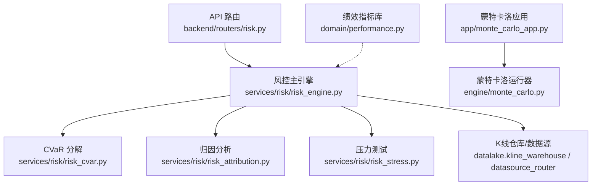
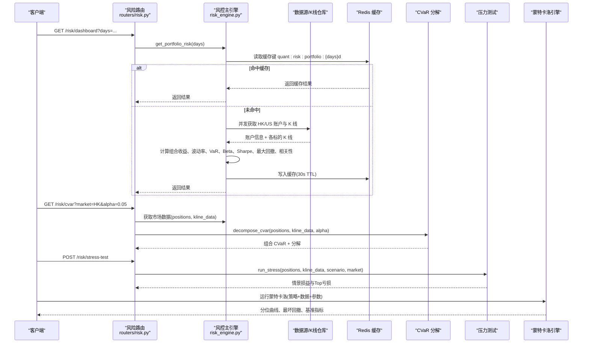
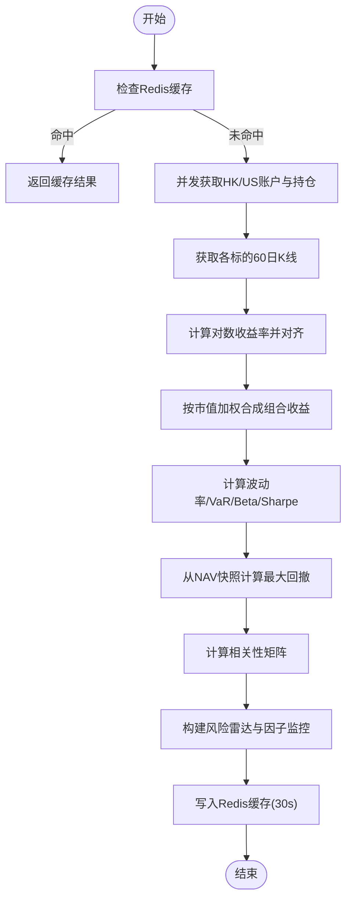
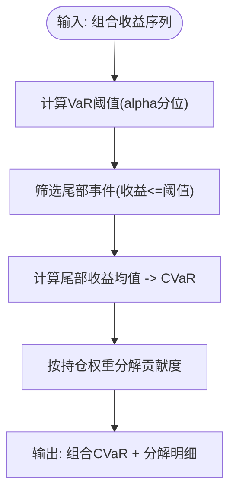
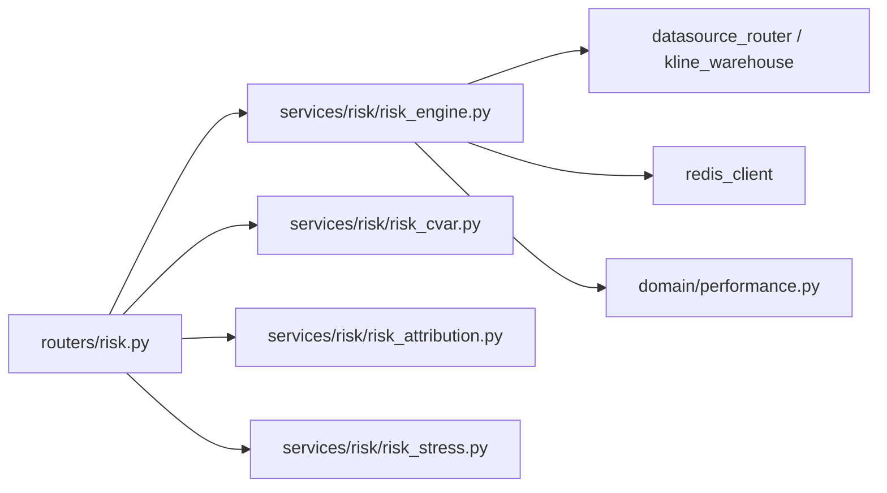

# 风险指标计算

<cite>
**本文引用的文件**
- [risk_engine.py](file://backend/services/risk/risk_engine.py)
- [risk_cvar.py](file://backend/services/risk/risk_cvar.py)
- [performance.py](file://backend/domain/performance.py)
- [risk_attribution.py](file://backend/services/risk/risk_attribution.py)
- [risk_stress.py](file://backend/services/risk/risk_stress.py)
- [risk.py](file://backend/routers/risk.py)
- [monte_carlo_app.py](file://backend/app/monte_carlo_app.py)
- [monte_carlo.py](file://backend/engine/monte_carlo.py)
</cite>

## 目录
1. [简介](#简介)
2. [项目结构](#项目结构)
3. [核心组件](#核心组件)
4. [架构总览](#架构总览)
5. [详细组件分析](#详细组件分析)
6. [依赖关系分析](#依赖关系分析)
7. [性能考虑](#性能考虑)
8. [故障排查指南](#故障排查指南)
9. [结论](#结论)
10. [附录：调用示例与最佳实践](#附录调用示例与最佳实践)

## 简介
本文件系统性梳理风险指标计算模块，覆盖 VaR（在险价值）的多种实现、CVaR（条件在险价值）的计算与分解、夏普比率、最大回撤、波动率等核心指标，并说明实时计算机制、缓存策略、批量计算方法与性能优化。同时给出端到端调用路径与使用建议，帮助读者快速理解与落地应用。

## 项目结构
风险指标计算围绕“服务层 + 领域函数库 + API 路由 + 蒙特卡洛引擎”组织：
- 服务层：组合风控主引擎、CVaR 分解、归因分析、压力测试等
- 领域函数库：Sharpe、最大回撤、波动率等纯函数
- API 路由：对外暴露风控面板、相关性、CVaR、流动性、归因、压力测试等接口
- 蒙特卡洛引擎：基于回测结果进行交易重排/自助抽样，输出分位曲线与极端统计

图表来源
- [risk.py:63-231](file://backend/routers/risk.py#L63-L231)
- [risk_engine.py:22-515](file://backend/services/risk/risk_engine.py#L22-L515)
- [risk_cvar.py:12-114](file://backend/services/risk/risk_cvar.py#L12-L114)
- [risk_attribution.py:12-87](file://backend/services/risk/risk_attribution.py#L12-L87)
- [risk_stress.py:58-245](file://backend/services/risk/risk_stress.py#L58-L245)
- [monte_carlo_app.py:47-99](file://backend/app/monte_carlo_app.py#L47-L99)
- [monte_carlo.py:149-254](file://backend/engine/monte_carlo.py#L149-L254)
- [performance.py:14-86](file://backend/domain/performance.py#L14-L86)

章节来源
- [risk.py:63-231](file://backend/routers/risk.py#L63-L231)
- [risk_engine.py:22-515](file://backend/services/risk/risk_engine.py#L22-L515)

## 核心组件
- 风控主引擎：聚合账户信息、获取 K 线、计算组合收益序列、波动率、VaR、Beta、Sharpe、最大回撤、相关性矩阵，并提供雷达图因子与 NAV 快照
- CVaR 分解：计算 Expected Shortfall，按持仓分解贡献度与边际 VaR
- 归因分析：Jensen's Alpha、Beta 贡献分解、拟合优度 R²
- 压力测试：历史情景回放与假设情景冲击，输出净值变化与亏损标的 Top N
- 蒙特卡洛引擎：对基线回测的交易 PnL 或日收益进行重排/自助抽样，生成权益路径与分位曲线
- 绩效指标库：Sharpe、最大回撤、年化收益率、波动率、跟踪误差等纯函数

章节来源
- [risk_engine.py:195-283](file://backend/services/risk/risk_engine.py#L195-L283)
- [risk_cvar.py:12-114](file://backend/services/risk/risk_cvar.py#L12-L114)
- [risk_attribution.py:12-87](file://backend/services/risk/risk_attribution.py#L12-L87)
- [risk_stress.py:58-245](file://backend/services/risk/risk_stress.py#L58-L245)
- [monte_carlo.py:149-254](file://backend/engine/monte_carlo.py#L149-L254)
- [performance.py:14-86](file://backend/domain/performance.py#L14-L86)

## 架构总览
风控面板请求从 API 路由进入，主引擎并发拉取多市场账户与 K 线，计算组合收益序列与各项指标，并通过 Redis 缓存加速后续请求；进阶能力（CVaR、归因、压力测试、流动性）通过路由分发到对应服务模块；蒙特卡洛压测独立于日常风控面板，基于 Vector 回测结果进行路径模拟。

图表来源
- [risk.py:63-231](file://backend/routers/risk.py#L63-L231)
- [risk_engine.py:32-135](file://backend/services/risk/risk_engine.py#L32-L135)
- [risk_cvar.py:26-114](file://backend/services/risk/risk_cvar.py#L26-L114)
- [risk_stress.py:58-245](file://backend/services/risk/risk_stress.py#L58-L245)
- [monte_carlo_app.py:47-99](file://backend/app/monte_carlo_app.py#L47-L99)
- [monte_carlo.py:149-254](file://backend/engine/monte_carlo.py#L149-L254)

## 详细组件分析

### 风控主引擎（RiskEngine）
- 职责：组合层面计算波动率、VaR、Beta、Sharpe、最大回撤、相关性矩阵，构建风险雷达与因子监控，提供 NAV 快照与仓位敞口
- 关键流程：
  - 并发获取 HK/US 账户信息与持仓
  - 拉取各标的 60 日 K 线，计算对数收益率并对齐长度
  - 按市值加权合成组合收益序列
  - 计算年化波动率、VaR（历史模拟法）、Beta（OLS vs 基准指数）、Sharpe（无风险利率 4%）
  - 从 NAV 快照计算最大回撤
  - 计算相关系数矩阵并预警高相关性
  - 构建六维风险雷达与因子监控（含 VaR 双口径：百分比与金额）
- 实时与缓存：
  - 使用 Redis 缓存 key quant:risk:portfolio:{days}d，TTL 30 秒
  - NAV 快照：days≤1 从 Redis 列表读取最近 24h；days>1 从数据库查询历史

图表来源
- [risk_engine.py:32-135](file://backend/services/risk/risk_engine.py#L32-L135)
- [risk_engine.py:195-283](file://backend/services/risk/risk_engine.py#L195-L283)
- [risk_engine.py:285-346](file://backend/services/risk/risk_engine.py#L285-L346)
- [risk_engine.py:348-481](file://backend/services/risk/risk_engine.py#L348-L481)

章节来源
- [risk_engine.py:32-135](file://backend/services/risk/risk_engine.py#L32-L135)
- [risk_engine.py:195-283](file://backend/services/risk/risk_engine.py#L195-L283)
- [risk_engine.py:285-346](file://backend/services/risk/risk_engine.py#L285-L346)
- [risk_engine.py:348-481](file://backend/services/risk/risk_engine.py#L348-L481)

### VaR 算法实现
- 历史模拟法：直接使用组合收益序列的分位数作为 VaR（代码中为 5% 分位），适用于非正态分布与厚尾特征
- 参数法：当前主引擎未直接实现参数法（正态/学生 t 分布假设下的解析 VaR）。可在现有收益序列基础上扩展：估计均值与标准差后按分布分位数计算
- 蒙特卡洛方法：通过蒙特卡洛引擎对交易 PnL 或日收益进行重排/自助抽样，生成多条权益路径，结合分位曲线评估尾部风险（如 p5/p95），可用于 VaR/CVaR 的近似估计

章节来源
- [risk_engine.py:250-255](file://backend/services/risk/risk_engine.py#L250-L255)
- [monte_carlo.py:95-146](file://backend/engine/monte_carlo.py#L95-L146)
- [monte_carlo_app.py:47-99](file://backend/app/monte_carlo_app.py#L47-L99)

### CVaR（条件在险价值）
- 计算逻辑：先求 VaR 阈值（收益序列的 alpha 分位），再计算低于该阈值的尾部收益的条件均值，即 Expected Shortfall
- 置信水平设置：alpha 默认 0.05（对应 95% 置信水平），可通过 API 参数调整
- 持仓分解：按权重计算每只标的在尾部事件日的平均收益，得到 Component CVaR 与 Marginal VaR，并按绝对值排序展示

图表来源
- [risk_cvar.py:12-24](file://backend/services/risk/risk_cvar.py#L12-L24)
- [risk_cvar.py:26-114](file://backend/services/risk/risk_cvar.py#L26-L114)

章节来源
- [risk_cvar.py:12-114](file://backend/services/risk/risk_cvar.py#L12-L114)

### 夏普比率、最大回撤、波动率
- 夏普比率：年化 Sharpe = (年化收益 - 无风险利率) / 年化波动率；主引擎使用无风险利率 4%，领域库 sharpe 函数以无风险利率 0 计算
- 最大回撤：从净值序列计算峰值到谷值的最大跌幅；主引擎从 NAV 快照计算，领域库提供通用函数
- 波动率：日收益标准差乘以 sqrt(252) 得到年化波动率

章节来源
- [risk_engine.py:250-276](file://backend/services/risk/risk_engine.py#L250-L276)
- [risk_engine.py:330-346](file://backend/services/risk/risk_engine.py#L330-L346)
- [performance.py:14-86](file://backend/domain/performance.py#L14-L86)

### 归因分析与压力测试
- 归因分析：Jensen's Alpha、Beta 贡献分解、R²，用于解释超额收益来源
- 压力测试：历史情景（2008、2020、2022）与假设情景（利率上升、波动率翻倍、汇率贬值），输出净值变化与 Top 亏损标的

章节来源
- [risk_attribution.py:12-87](file://backend/services/risk/risk_attribution.py#L12-L87)
- [risk_stress.py:58-245](file://backend/services/risk/risk_stress.py#L58-L245)

### 蒙特卡洛引擎
- 方法：trade_reshuffle（交易重排）、trade_bootstrap（交易自助抽样）、return_bootstrap（日收益自助抽样）
- 输出：分位权益曲线（p5/p50/p95）、最坏回撤、最终收益分位、基准指标
- 适用场景：评估策略在不同随机扰动下的稳健性与尾部风险

章节来源
- [monte_carlo.py:95-146](file://backend/engine/monte_carlo.py#L95-L146)
- [monte_carlo.py:149-254](file://backend/engine/monte_carlo.py#L149-L254)
- [monte_carlo_app.py:47-99](file://backend/app/monte_carlo_app.py#L47-L99)

## 依赖关系分析
- 路由层依赖服务层：/risk/* 路由调用 risk_engine、risk_cvar、risk_attribution、risk_stress 等
- 服务层依赖数据源：通过 DataSourceRouter 与 KlineWarehouse 获取账户与 K 线数据
- 缓存依赖：Redis 用于面板结果与 NAV 快照的快速读取
- 领域函数库被多处复用：Sharpe、最大回撤、波动率等

图表来源
- [risk.py:63-231](file://backend/routers/risk.py#L63-L231)
- [risk_engine.py:32-135](file://backend/services/risk/risk_engine.py#L32-L135)
- [risk_engine.py:195-283](file://backend/services/risk/risk_engine.py#L195-L283)

章节来源
- [risk.py:63-231](file://backend/routers/risk.py#L63-L231)
- [risk_engine.py:32-135](file://backend/services/risk/risk_engine.py#L32-L135)

## 性能考虑
- 并发数据获取：HK/US 账户与 K 线采用 asyncio.gather 并发拉取，降低延迟
- 向量计算：使用 NumPy/Pandas 矢量化计算收益、波动率、VaR、相关性，提升吞吐
- 缓存策略：
  - 面板结果缓存 key quant:risk:portfolio:{days}d，TTL 30 秒
  - NAV 快照短期走 Redis 列表，长期走数据库
- 批处理建议：
  - 对多标的 K 线批量拉取与对齐，减少网络往返
  - 对多账户/多市场的数据合并计算，避免重复工作
- 内存与精度：对齐收益序列时取最短长度，避免广播开销；数值计算注意浮点精度与除零保护

[本节为通用指导，不直接分析具体文件]

## 故障排查指南
- 数据源异常：当账户或 K 线获取失败时，记录警告日志并降级返回空态或零指标，避免级联错误
- 缓存写入失败：Redis 写入异常仅记录警告，不影响主流程返回
- 基准数据缺失：若基准指数 K 线不可用，Beta 计算跳过并记录警告
- 蒙特卡洛序列过短：当基线路径不足或交易数过少时，自动回退到 return_bootstrap 或抛出明确错误提示

章节来源
- [risk_engine.py:56-63](file://backend/services/risk/risk_engine.py#L56-L63)
- [risk_engine.py:129-134](file://backend/services/risk/risk_engine.py#L129-L134)
- [risk_engine.py:256-271](file://backend/services/risk/risk_engine.py#L256-L271)
- [monte_carlo.py:199-202](file://backend/engine/monte_carlo.py#L199-L202)

## 结论
本模块提供了完整的风险指标计算体系：以历史模拟法为主实现 VaR，辅以蒙特卡洛路径模拟评估尾部风险；CVaR 提供 Expected Shortfall 与持仓分解；Sharpe、最大回撤、波动率等核心指标由领域函数库统一实现；通过并发数据获取、向量化计算与 Redis 缓存保障实时性与性能；API 路由将复杂计算封装为易用的服务接口，便于前端与下游系统集成。

[本节为总结性内容，不直接分析具体文件]

## 附录：调用示例与最佳实践
- 获取风控面板（含 VaR、Sharpe、波动率、最大回撤、相关性矩阵）
  - 调用：GET /risk/dashboard?days=1
  - 说明：返回分账户 KPI、敞口、风险雷达、因子监控、NAV 快照、持仓明细与相关性
  - 参考路径：[risk.py:63-76](file://backend/routers/risk.py#L63-L76)

- 获取 CVaR 及持仓分解
  - 调用：GET /risk/cvar?market=HK&alpha=0.05
  - 说明：返回组合 CVaR、VaR 阈值与各标的贡献度
  - 参考路径：[risk.py:133-143](file://backend/routers/risk.py#L133-L143)

- 获取 Beta/Alpha 归因
  - 调用：GET /risk/attribution?market=HK
  - 说明：返回 Jensen's Alpha、Beta、R² 与归因百分比
  - 参考路径：[risk.py:162-207](file://backend/routers/risk.py#L162-L207)

- 执行压力测试
  - 调用：POST /risk/stress-test，body: {scenario: "2008_crash", market: "HK"}
  - 说明：返回情景净值变化与 Top 亏损标的
  - 参考路径：[risk.py:218-224](file://backend/routers/risk.py#L218-L224)

- 运行蒙特卡洛压测
  - 调用：使用 MonteCarloParams 指定 ticker、策略、迭代次数与方法
  - 说明：输出分位曲线、最坏回撤与基准指标
  - 参考路径：[monte_carlo_app.py:47-99](file://backend/app/monte_carlo_app.py#L47-L99)

- 最佳实践
  - 合理设置 alpha 与窗口长度：较短窗口更敏感但噪声大，较长窗口更稳定但滞后
  - 关注 VaR 双口径：百分比与金额（按实际净值）结合使用，便于限额管理
  - 结合相关性矩阵与压力测试：识别集中度风险与极端情景影响
  - 利用缓存与批处理：在高并发场景下优先命中缓存，批量拉取 K 线减少网络开销

[本节为操作指引，不直接分析具体文件]
