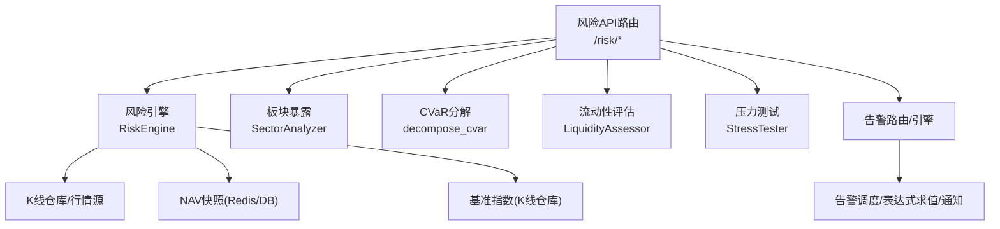
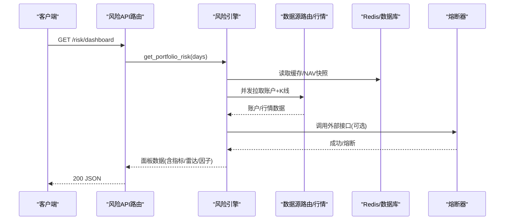
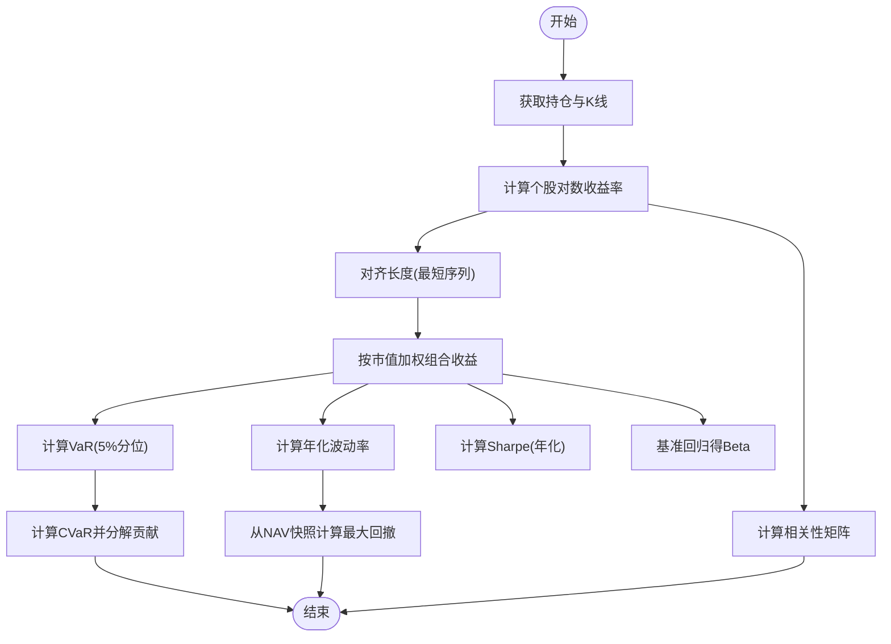
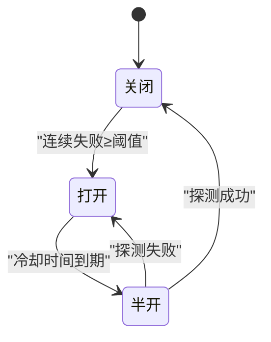
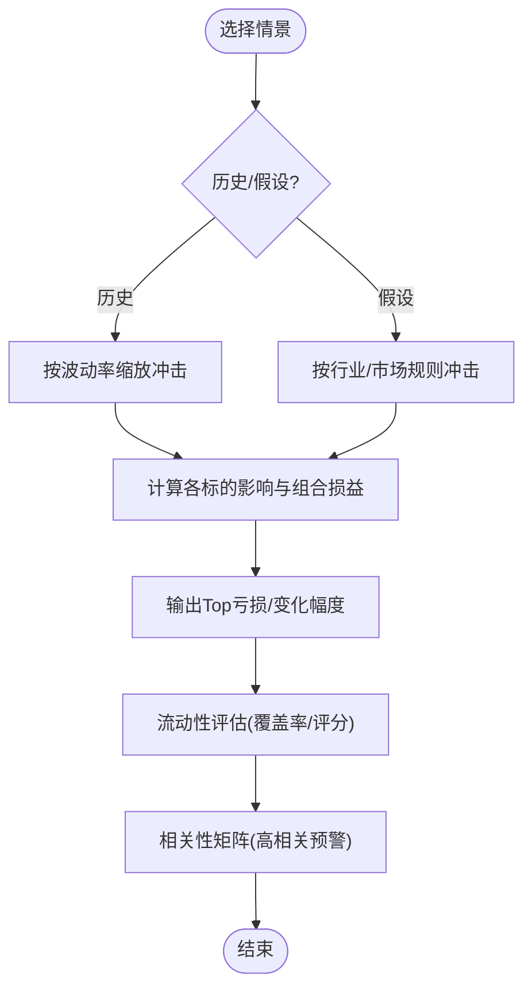
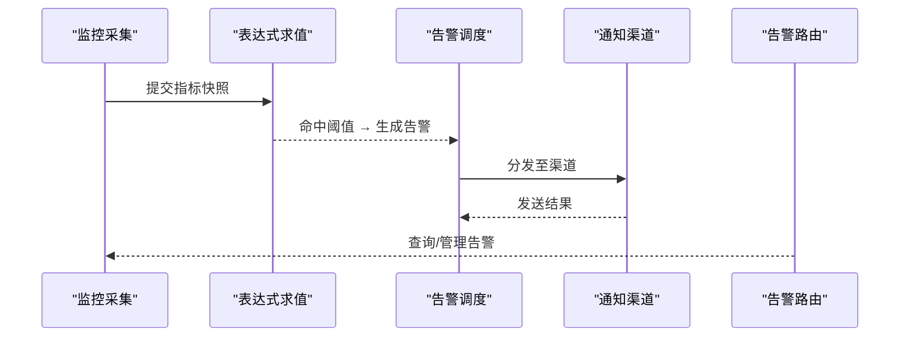
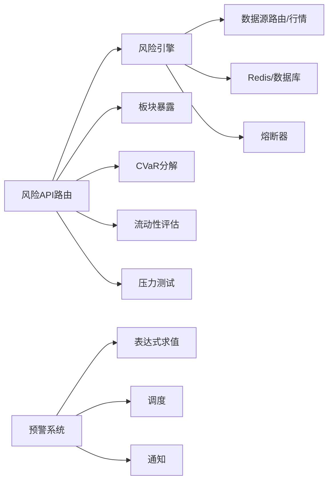

# 风险控制

<cite>
**本文引用的文件**
- [backend/routers/risk.py](file://backend/routers/risk.py)
- [backend/services/risk/risk_engine.py](file://backend/services/risk/risk_engine.py)
- [backend/services/risk/risk_cvar.py](file://backend/services/risk/risk_cvar.py)
- [backend/services/risk/risk_stress.py](file://backend/services/risk/risk_stress.py)
- [backend/services/risk/risk_liquidity.py](file://backend/services/risk/risk_liquidity.py)
- [backend/services/risk/risk_sector.py](file://backend/services/risk/risk_sector.py)
- [backend/services/risk/risk_attribution.py](file://backend/services/risk/risk_attribution.py)
- [backend/core/circuit_breaker.py](file://backend/core/circuit_breaker.py)
- [backend/core/alert_models.py](file://backend/core/alert_models.py)
- [backend/routers/alert.py](file://backend/routers/alert.py)
- [backend/workers/alert_engine.py](file://backend/workers/alert_engine.py)
- [backend/services/alert/dispatcher.py](file://backend/services/alert/dispatcher.py)
- [backend/services/alert/expr_evaluator.py](file://backend/services/alert/expr_evaluator.py)
- [backend/services/alert/notification.py](file://backend/services/alert/notification.py)
</cite>

## 目录
1. [简介](#简介)
2. [项目结构](#项目结构)
3. [核心组件](#核心组件)
4. [架构总览](#架构总览)
5. [详细组件分析](#详细组件分析)
6. [依赖关系分析](#依赖关系分析)
7. [性能考量](#性能考量)
8. [故障排查指南](#故障排查指南)
9. [结论](#结论)
10. [附录](#附录)

## 简介
本模块为量化交易系统的风险控制子系统，围绕“指标计算—限额控制—熔断机制—压力测试—预警通知—报告与历史”构建完整闭环。核心能力包括：
- 风险指标：VaR、最大回撤、夏普比率、波动率、Beta/Alpha 归因、CVaR 分解、相关性矩阵、流动性评估、板块暴露。
- 限额控制：单笔/日交易限额、持仓集中度限制、止损止盈（策略侧配置 + 风控校验）。
- 熔断机制：自动熔断（连续失败触发）、手动熔断/恢复（运维接口）。
- 压力测试：历史情景回放与假设情景冲击，输出组合损益与亏损排行。
- 风险预警：实时监控、阈值告警、多渠道通知推送。
- 报告与历史：面板数据、NAV 快照、因子监控、可导出报表。

## 项目结构
风险相关代码主要分布在后端服务层与路由层：
- 路由层：统一对外暴露风控 API（面板、相关性、CVaR、流动性、板块暴露、压力测试等）。
- 服务层：按职责拆分为风险引擎、CVaR、压力测试、流动性、板块暴露、归因分析。
- 基础设施：熔断器、告警模型、告警调度与通知。

**图表来源**
- [backend/routers/risk.py:63-231](file://backend/routers/risk.py#L63-L231)
- [backend/services/risk/risk_engine.py:32-135](file://backend/services/risk/risk_engine.py#L32-L135)
- [backend/services/risk/risk_sector.py:46-87](file://backend/services/risk/risk_sector.py#L46-L87)
- [backend/services/risk/risk_cvar.py:26-113](file://backend/services/risk/risk_cvar.py#L26-L113)
- [backend/services/risk/risk_liquidity.py:15-102](file://backend/services/risk/risk_liquidity.py#L15-L102)
- [backend/services/risk/risk_stress.py:61-217](file://backend/services/risk/risk_stress.py#L61-L217)

**章节来源**
- [backend/routers/risk.py:1-231](file://backend/routers/risk.py#L1-L231)
- [backend/services/risk/risk_engine.py:1-515](file://backend/services/risk/risk_engine.py#L1-L515)

## 核心组件
- 风险引擎 RiskEngine：聚合账户信息、计算组合收益序列、波动率、VaR、Sharpe、Beta、最大回撤、相关性矩阵、风险雷达与因子监控，并提供缓存与降级。
- CVaR 分解：计算条件 VaR（Expected Shortfall）并按持仓贡献度分解，提供边际 VaR。
- 压力测试 StressTester：支持历史情景（2008/2020/2022）与假设情景（利率、波动率、汇率），输出组合损益与 Top 亏损。
- 流动性评估 LiquidityAssessor：基于成交额代理或波动率估算覆盖率与评分，识别大额持仓与低流动性标的。
- 板块暴露 SectorAnalyzer：按 GICS 标准聚合行业暴露，支持缓存与多源兜底。
- 归因分析 risk_attribution：Jensen's Alpha、Beta 贡献分解、拟合优度与年化指标。
- 熔断器 CircuitBreaker：OPEN/HALF_OPEN/CLOSED 状态机，限流错误过滤，手动重置与状态快照。
- 预警系统 Alert：表达式求值、调度分发、多渠道通知。

**章节来源**
- [backend/services/risk/risk_engine.py:22-515](file://backend/services/risk/risk_engine.py#L22-L515)
- [backend/services/risk/risk_cvar.py:12-113](file://backend/services/risk/risk_cvar.py#L12-L113)
- [backend/services/risk/risk_stress.py:58-245](file://backend/services/risk/risk_stress.py#L58-L245)
- [backend/services/risk/risk_liquidity.py:12-130](file://backend/services/risk/risk_liquidity.py#L12-L130)
- [backend/services/risk/risk_sector.py:43-153](file://backend/services/risk/risk_sector.py#L43-L153)
- [backend/services/risk/risk_attribution.py:12-87](file://backend/services/risk/risk_attribution.py#L12-L87)
- [backend/core/circuit_breaker.py:64-379](file://backend/core/circuit_breaker.py#L64-L379)
- [backend/core/alert_models.py:1-200](file://backend/core/alert_models.py#L1-L200)
- [backend/routers/alert.py:1-200](file://backend/routers/alert.py#L1-L200)
- [backend/workers/alert_engine.py:1-200](file://backend/workers/alert_engine.py#L1-L200)
- [backend/services/alert/dispatcher.py:1-200](file://backend/services/alert/dispatcher.py#L1-L200)
- [backend/services/alert/expr_evaluator.py:1-200](file://backend/services/alert/expr_evaluator.py#L1-L200)
- [backend/services/alert/notification.py:1-200](file://backend/services/alert/notification.py#L1-L200)

## 架构总览
风险模块采用“路由—服务—数据源/存储”的分层架构，关键交互如下：
- 路由层接收请求，调用各服务完成计算并返回结果。
- 服务层通过 DataSourceRouter/KlineWarehouse 获取行情与基准数据，使用 Redis/DB 进行缓存与历史读取。
- 熔断器保护外部依赖调用，避免雪崩。
- 预警系统通过表达式引擎对实时指标进行阈值判断，并通过通知通道推送。

**图表来源**
- [backend/routers/risk.py:63-76](file://backend/routers/risk.py#L63-L76)
- [backend/services/risk/risk_engine.py:32-135](file://backend/services/risk/risk_engine.py#L32-L135)
- [backend/core/circuit_breaker.py:147-218](file://backend/core/circuit_breaker.py#L147-L218)

## 详细组件分析

### 风险指标计算（VaR、最大回撤、夏普比率、波动率、Beta/Alpha、CVaR）
- 波动率：基于组合对数收益率的年化标准差。
- VaR（95%）：历史模拟法，取组合收益率分布的 5% 分位数。
- Sharpe：年化超额收益除以年化波动率（无风险利率假设为 4%）。
- Beta：以市场指数为基准的 OLS 回归斜率。
- 最大回撤：从 NAV 快照序列中计算峰值到谷值的最大跌幅。
- CVaR：尾部条件均值，并按持仓权重分解贡献度与边际 VaR。
- 相关性矩阵：持仓间 60 日收益率相关系数，高相关预警。

**图表来源**
- [backend/services/risk/risk_engine.py:195-283](file://backend/services/risk/risk_engine.py#L195-L283)
- [backend/services/risk/risk_engine.py:285-346](file://backend/services/risk/risk_engine.py#L285-L346)
- [backend/services/risk/risk_engine.py:348-374](file://backend/services/risk/risk_engine.py#L348-L374)
- [backend/services/risk/risk_cvar.py:12-113](file://backend/services/risk/risk_cvar.py#L12-L113)
- [backend/services/risk/risk_attribution.py:12-87](file://backend/services/risk/risk_attribution.py#L12-L87)

**章节来源**
- [backend/services/risk/risk_engine.py:195-481](file://backend/services/risk/risk_engine.py#L195-L481)
- [backend/services/risk/risk_cvar.py:12-113](file://backend/services/risk/risk_cvar.py#L12-L113)
- [backend/services/risk/risk_attribution.py:12-87](file://backend/services/risk/risk_attribution.py#L12-L87)

### 限额控制机制（单笔/日交易限额、集中度、止损止盈）
- 单笔交易限额：在订单执行前校验委托金额/数量是否超过策略或风控配置的阈值。
- 日交易限额：统计当日累计成交金额/次数，达到上限后拒绝新单或降频。
- 持仓集中度限制：按单票/行业/区域设置占比上限，超限则禁止加仓或强制减仓。
- 止损止盈：按标的或组合维度设置动态止损/止盈线，触发时自动平仓或减仓。
- 实施建议：在 OMS/执行网关处集成风控校验，结合预警系统进行阈值告警与审计记录。

[本节为通用设计说明，不直接分析具体文件]

### 熔断机制（自动熔断、手动操作、恢复流程）
- 自动熔断：连续失败次数达到阈值后进入 OPEN；冷却时间到达后进入 HALF_OPEN 探测；探测成功回到 CLOSED，失败再次 OPEN。
- 限流错误过滤：可通过 error_classifier 或 is_rate_limit_error 钩子将限流类错误排除在失败计数之外。
- 手动熔断/恢复：提供 reset() 方法重置指定或全部服务的熔断状态；status_snapshot() 用于健康检查。
- 集成点：外部 API 调用（如行情、数据源）通过熔断器包裹，避免级联故障。

**图表来源**
- [backend/core/circuit_breaker.py:45-97](file://backend/core/circuit_breaker.py#L45-L97)
- [backend/core/circuit_breaker.py:147-218](file://backend/core/circuit_breaker.py#L147-L218)
- [backend/core/circuit_breaker.py:286-352](file://backend/core/circuit_breaker.py#L286-L352)

**章节来源**
- [backend/core/circuit_breaker.py:45-379](file://backend/core/circuit_breaker.py#L45-L379)

### 压力测试（极端行情模拟、流动性风险评估、相关性分析）
- 历史情景：2008 金融危机、2020 疫情、2022 加息周期，按标的波动率缩放冲击，输出组合损益与 Top 亏损。
- 假设情景：利率上升、波动率翻倍、汇率贬值等，按行业映射或市场范围施加影响。
- 流动性风险：成交额覆盖率与评分，识别大额持仓与低流动性标的。
- 相关性分析：高相关预警，辅助分散化与集中度控制。

**图表来源**
- [backend/services/risk/risk_stress.py:61-217](file://backend/services/risk/risk_stress.py#L61-L217)
- [backend/services/risk/risk_liquidity.py:15-102](file://backend/services/risk/risk_liquidity.py#L15-L102)
- [backend/services/risk/risk_engine.py:348-374](file://backend/services/risk/risk_engine.py#L348-L374)

**章节来源**
- [backend/services/risk/risk_stress.py:58-245](file://backend/services/risk/risk_stress.py#L58-L245)
- [backend/services/risk/risk_liquidity.py:12-130](file://backend/services/risk/risk_liquidity.py#L12-L130)
- [backend/services/risk/risk_engine.py:348-374](file://backend/services/risk/risk_engine.py#L348-L374)

### 风险预警系统（实时监控、阈值告警、通知推送）
- 实时监控：通过工作进程或定时任务采集指标（波动率、VaR、最大回撤、流动性评分、板块集中度等）。
- 阈值告警：表达式求值引擎对指标进行条件判断，触发告警事件。
- 通知推送：多渠道适配器（飞书、Telegram、站内信等）发送告警消息。
- 路由与调度：告警路由提供查询与管理接口，调度器负责分发与去重。

**图表来源**
- [backend/services/alert/expr_evaluator.py:1-200](file://backend/services/alert/expr_evaluator.py#L1-L200)
- [backend/services/alert/dispatcher.py:1-200](file://backend/services/alert/dispatcher.py#L1-L200)
- [backend/services/alert/notification.py:1-200](file://backend/services/alert/notification.py#L1-L200)
- [backend/routers/alert.py:1-200](file://backend/routers/alert.py#L1-L200)
- [backend/workers/alert_engine.py:1-200](file://backend/workers/alert_engine.py#L1-L200)
- [backend/core/alert_models.py:1-200](file://backend/core/alert_models.py#L1-L200)

**章节来源**
- [backend/core/alert_models.py:1-200](file://backend/core/alert_models.py#L1-L200)
- [backend/routers/alert.py:1-200](file://backend/routers/alert.py#L1-L200)
- [backend/workers/alert_engine.py:1-200](file://backend/workers/alert_engine.py#L1-L200)
- [backend/services/alert/dispatcher.py:1-200](file://backend/services/alert/dispatcher.py#L1-L200)
- [backend/services/alert/expr_evaluator.py:1-200](file://backend/services/alert/expr_evaluator.py#L1-L200)
- [backend/services/alert/notification.py:1-200](file://backend/services/alert/notification.py#L1-L200)

### 风险报告生成与历史数据分析
- 面板数据：包含 KPI、敞口、风险雷达、因子监控、NAV 快照、持仓明细、相关性矩阵。
- 历史数据：NAV 快照可从 Redis（近 24h）或数据库（多日历史）读取，用于回测与趋势分析。
- 报告导出：可将面板数据与压力测试结果导出为结构化数据供报表系统消费。

**章节来源**
- [backend/routers/risk.py:63-92](file://backend/routers/risk.py#L63-L92)
- [backend/services/risk/risk_engine.py:285-328](file://backend/services/risk/risk_engine.py#L285-L328)
- [backend/services/risk/risk_engine.py:483-510](file://backend/services/risk/risk_engine.py#L483-L510)

## 依赖关系分析
- 路由层依赖各风险服务，服务层依赖数据源与存储。
- 熔断器作为横切关注点，保护外部依赖调用。
- 预警系统与风险引擎解耦，通过指标快照与表达式引擎实现灵活告警。

**图表来源**
- [backend/routers/risk.py:12-17](file://backend/routers/risk.py#L12-L17)
- [backend/services/risk/risk_engine.py:15-20](file://backend/services/risk/risk_engine.py#L15-L20)
- [backend/core/circuit_breaker.py:355-379](file://backend/core/circuit_breaker.py#L355-L379)
- [backend/services/alert/dispatcher.py:1-200](file://backend/services/alert/dispatcher.py#L1-L200)
- [backend/services/alert/expr_evaluator.py:1-200](file://backend/services/alert/expr_evaluator.py#L1-L200)
- [backend/services/alert/notification.py:1-200](file://backend/services/alert/notification.py#L1-L200)

**章节来源**
- [backend/routers/risk.py:1-231](file://backend/routers/risk.py#L1-L231)
- [backend/services/risk/risk_engine.py:1-515](file://backend/services/risk/risk_engine.py#L1-L515)
- [backend/core/circuit_breaker.py:1-379](file://backend/core/circuit_breaker.py#L1-L379)
- [backend/services/alert/dispatcher.py:1-200](file://backend/services/alert/dispatcher.py#L1-L200)
- [backend/services/alert/expr_evaluator.py:1-200](file://backend/services/alert/expr_evaluator.py#L1-L200)
- [backend/services/alert/notification.py:1-200](file://backend/services/alert/notification.py#L1-L200)

## 性能考量
- 缓存策略：面板数据与板块映射使用 Redis 缓存（TTL 30s/24h），减少重复计算与外部调用。
- 并发处理：账户与行情数据并行获取，缩短响应时间。
- 数据对齐：收益率序列按最短长度对齐，避免广播开销。
- 降级策略：无账户或数据缺失时返回空态，避免 500 错误。
- 熔断保护：外部依赖异常快速失败，防止雪崩。

[本节为通用性能指导，不直接分析具体文件]

## 故障排查指南
- 面板数据为空：检查账户连接与缓存键，确认 status 是否为 empty/error。
- 指标异常：核对 K 线数据完整性与对齐逻辑，确认基准指数获取成功。
- 熔断频繁触发：查看熔断状态快照，调整 max_failures 与 recovery_timeout，或修复上游依赖。
- 告警未触发：验证表达式求值与阈值配置，检查调度与通知通道连通性。

**章节来源**
- [backend/services/risk/risk_engine.py:483-510](file://backend/services/risk/risk_engine.py#L483-L510)
- [backend/core/circuit_breaker.py:341-352](file://backend/core/circuit_breaker.py#L341-L352)
- [backend/routers/risk.py:63-92](file://backend/routers/risk.py#L63-L92)

## 结论
本风险控制模块以清晰的分层架构与模块化设计，实现了从指标计算、限额控制、熔断机制到压力测试与预警通知的完整风控闭环。通过缓存、并发与熔断优化性能与稳定性，借助表达式引擎与多渠道通知提升告警时效性与覆盖面。建议在实盘环境中持续校准阈值与参数，并结合历史回测与压力测试完善风控策略。

## 附录
- 常用端点：
  - 面板数据：GET /risk/dashboard
  - 持仓明细：GET /risk/positions-breakdown
  - 板块暴露：GET /risk/sector-exposure
  - 相关性矩阵：GET /risk/correlation
  - CVaR 分解：GET /risk/cvar
  - 流动性评估：GET /risk/liquidity
  - 压力测试：POST /risk/stress-test
  - 可用情景：GET /risk/stress-test/scenarios
- 告警管理：
  - 告警路由：/alert/*
  - 表达式求值与通知：services/alert/*

**章节来源**
- [backend/routers/risk.py:63-231](file://backend/routers/risk.py#L63-L231)
- [backend/routers/alert.py:1-200](file://backend/routers/alert.py#L1-L200)